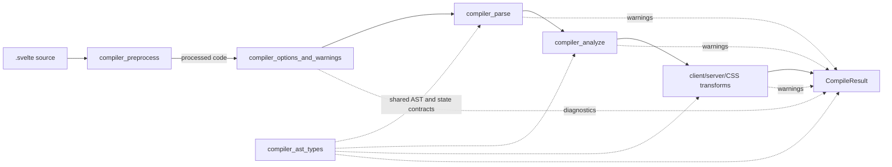
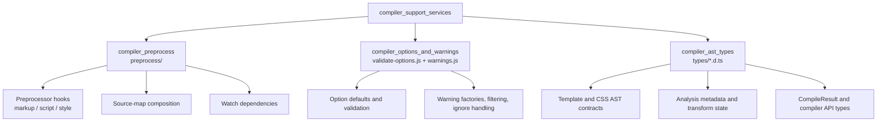

# compiler_support_services

## Purpose

`compiler_support_services` contains the compiler’s shared support layer at `packages/svelte/src/compiler`. It provides:

- Preprocessing of markup, script, and style content before compilation, including source-map chaining and dependency collection.
- Validation and normalization of compiler options.
- Construction, filtering, and delivery of compiler warnings.
- TypeScript declarations for the template AST, CSS AST, compiler options, compile results, analysis metadata, and transform state.

These services support the main compilation pipeline but do not themselves implement parsing, analysis, or code generation.

## Architecture

### Components

`compiler_preprocess` is an explicit caller-driven stage: consumers run `preprocess()` and pass its resulting code to `compile()`. It does not parse Svelte syntax.

`compiler_options_and_warnings` forms the compiler policy boundary. Option validators normalize configuration before compilation, while warning factories are used by parser, analysis, and transform phases to produce filtered diagnostics.

`compiler_ast_types` is a declaration-only contract shared by all compiler phases. The parser creates AST values, analysis decorates them with metadata, and transforms consume those typed structures to generate output.

## Core component documentation

- [compiler_preprocess](compiler_preprocess.md) — preprocessing hooks, tag rewriting, source maps, and dependencies.
- [compiler_options_and_warnings](compiler_options_and_warnings.md) — option validation, compatibility handling, warning factories, and filtering.
- [compiler_ast_types](compiler_ast_types.md) — template/CSS AST types, compiler result types, metadata, and transform state.
- [compiler_core](compiler_core.md) — compiler entry points and orchestration.
- [compiler_parse](compiler_parse.md) — phase-one parsing.
- [compiler_analyze](compiler_analyze.md) — phase-two semantic analysis.
- [compiler_transform_client](compiler_transform_client.md) — client-side code generation.
- [compiler_transform_server](compiler_transform_server.md) — server-side code generation.
- [compiler_css_transform](compiler_css_transform.md) — CSS analysis and transformation.