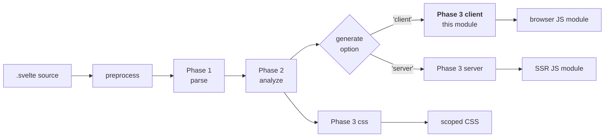
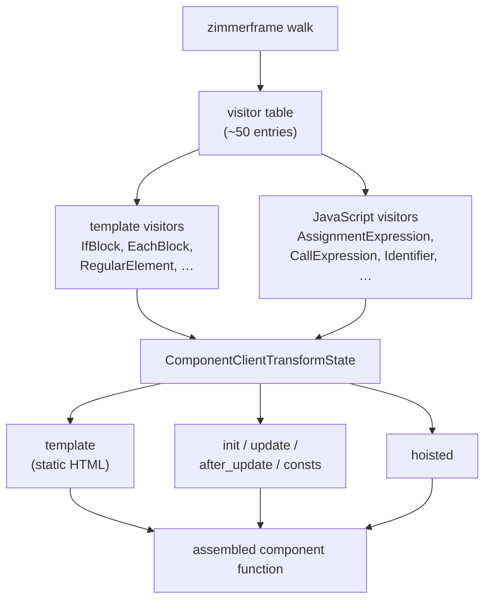
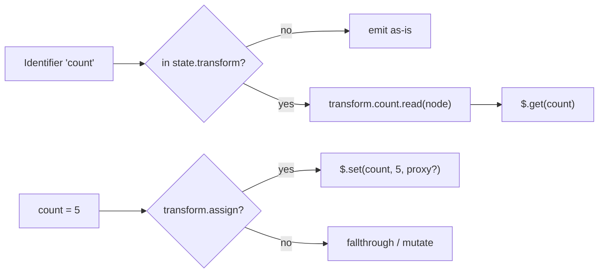
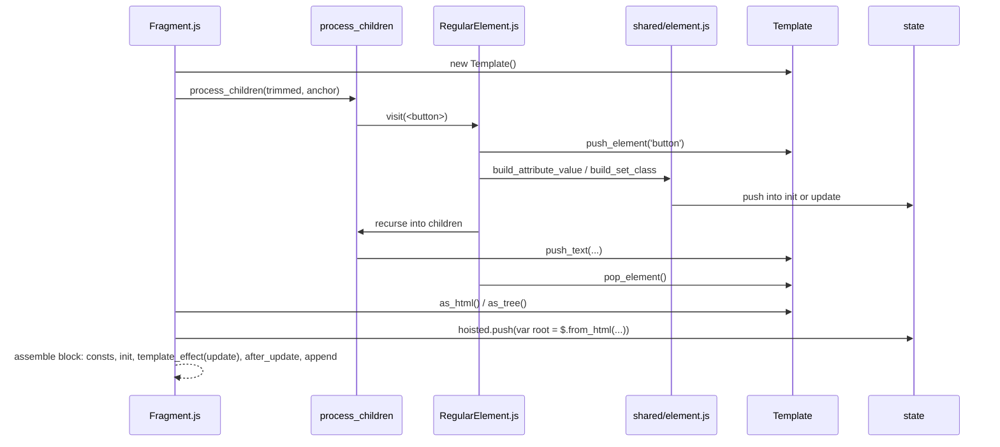
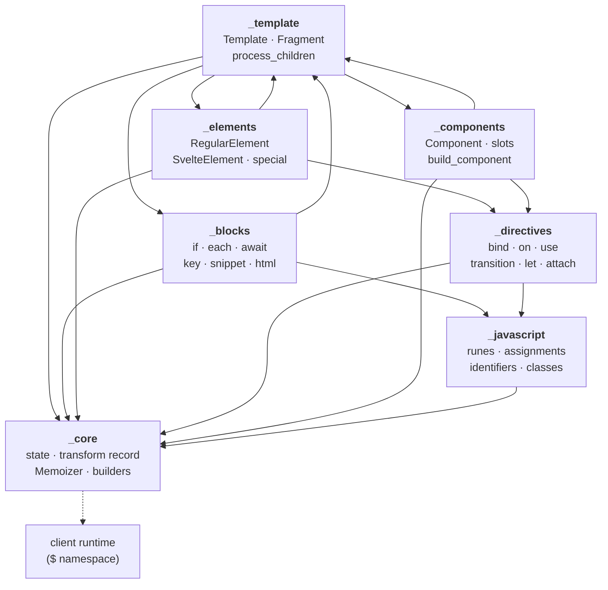

# compiler_transform_client

## 1. What this module does

`compiler_transform_client` is the **client-side code generator** of the Svelte compiler. It is the third and last phase of the compile pipeline. It takes the analyzed Svelte AST and turns it into a JavaScript ES module that runs in the browser.

In plain words: this module answers the question *"what JavaScript do I have to write so the browser shows this component and keeps it up to date?"*

It does two things at the same time, in one single walk over the tree:

1. **It builds a static HTML template string** (or a tree of arrays) for everything that never changes. At runtime the browser clones this template once — that is much faster than creating each node by hand.
2. **It builds JavaScript statements** that fill in the holes: reading reactive values, setting attributes, wiring events, creating reactive blocks for `{#if}`/`{#each}`, and so on.

The output calls into the client runtime, which is always imported under the short alias `$`. So generated code looks like `$.text(...)`, `$.if(...)`, `$.set_attribute(...)`. Everything this module emits is a call into [client_dom_rendering_runtime](client_dom_rendering_runtime.md) or [client_reactivity_core](client_reactivity_core.md).

### A tiny example

Source:

```svelte
<script>
  let count = $state(0);
</script>
<button onclick={() => count++}>clicks: {count}</button>
```

Roughly what this module emits:

```js
var root = $.from_html(`<button> </button>`);   // static part, hoisted once

export default function App($$anchor) {
  let count = $.state(0);
  var button = root();
  var text = $.child(button);
  button.__click = () => $.update(count);       // delegated event
  $.template_effect(() => $.set_text(text, `clicks: ${$.get(count)}`));
  $.append($$anchor, button);
}
```

Notice the three buckets the code falls into: **hoisted** (the template), **init** (runs once), and **update** (runs inside a reactive effect). Sorting every piece of generated code into the right bucket is the core job of this module.

### Where it sits in the pipeline



Related modules:

- [compiler_parse](compiler_parse.md) — produces the AST this module consumes.
- [compiler_analyze](compiler_analyze.md) — attaches the `metadata` and `Scope`/`Binding` data that drives almost every decision here.
- [compiler_transform_server](compiler_transform_server.md) — the sibling generator for SSR. Same AST in, string-concatenation out instead of DOM operations.
- [compiler_core](compiler_core.md) — the `b.*` AST builders, `Scope`, and shared transform helpers used everywhere in this module.
- [compiler_ast_types](compiler_ast_types.md) — node type definitions (`AST.RegularElement`, `AST.EachBlock`, …).

## 2. Architecture

### 2.1 The visitor pattern

The module is a **`zimmerframe` visitor table**: a plain object mapping AST node type names to functions. One file per node type, named exactly after the node it handles (`IfBlock.js` exports `IfBlock`). A tree walker calls the matching function for each node.

Each visitor receives:

- `node` — the AST node.
- `context` — with `context.state` (the mutable transform state), `context.visit(child)` (recurse), `context.next()` (recurse with defaults), and `context.path` (ancestor chain).



### 2.2 The transform state — the shared blackboard

Visitors barely talk to each other. Instead they all push into a shared `ComponentClientTransformState`. This is the single most important concept in the module:

| Field | Meaning |
| --- | --- |
| `template` | The `Template` builder collecting static HTML. |
| `init` | Statements that run **once**, before the render effect. |
| `update` | Statements that run **inside** the render effect (re-run on change). |
| `after_update` | Statements that run **after** the render effect — bindings, transitions, events. Order matters. |
| `consts` | Transformed `{@const ...}` declarations. |
| `memoizer` | Collects expressions that need to become `$.derived(...)`. |
| `hoisted` | Module-level statements: templates, imports, hoisted event handlers. |
| `node` | The current anchor/DOM node identifier the visitor should attach to. |
| `transform` | **Per-variable read/assign/mutate rewrite rules** (see below). |
| `metadata` | Current namespace (`html`/`svg`/`mathml`) and `bound_contenteditable`. |
| `in_constructor`, `in_derived`, `is_instance` | Lexical flags that change how expressions compile. |

The three-bucket split (`init` / `update` / `after_update`) is what gives the generated code its correct execution order. Getting a statement into the wrong bucket is the classic bug shape in this module — e.g. a `bind:` must land in `after_update` so it runs *after* attribute updates.

### 2.3 The `transform` record — how reactivity is injected

`state.transform` is a map from variable name to rewrite functions:

```js
state.transform[name] = {
  read:   (id) => b.call('$.get', id),      // foo      -> $.get(foo)
  assign: (id, value) => ...,               // foo = x  -> $.set(foo, x)
  mutate: (id, mutation) => ...,            // foo.x = y
  update: (node) => ...                     // foo++
}
```

This is the mechanism that turns plain JavaScript into reactive JavaScript. `Identifier.js` consults `read`; `AssignmentExpression.js` consults `assign`/`mutate`. Because the record is copied and extended when entering a new scope (an `{#each}` body, a snippet, a `{#await}` branch), the *same* identifier can compile differently depending on where it appears.



### 2.4 Sync and async expression handling

Expressions that call functions or `await` cannot be re-evaluated freely inside an effect, so they are **memoized**. The `Memoizer` collects them and emits either:

- `$.derived(() => expr)` for synchronous calls, or
- an `$.async(anchor, [thunks], (anchor, $0, $1) => { ... })` wrapper for `await`-containing expressions.

Nearly every block visitor has the same shape: check `metadata.expression.has_await`, and if set, wrap the emitted statements in `$.async(...)` and read the value via `$.get($$id)`.

### 2.5 Data flow through one element



## 3. Sub-modules

The module is split into seven documented areas. Each has its own file.

| Sub-module | Responsibility |
| --- | --- |
| [compiler_transform_client_core](compiler_transform_client_core.md) | Transform state, the `transform` rewrite record, `Memoizer`, expression/template-chunk building, prop sources, proxy decisions, ownership validation. The shared toolbox everything else uses. |
| [compiler_transform_client_template](compiler_transform_client_template.md) | The `Template` builder (`stringify` / `objectify`), `transform_template`, `Fragment` visitor, and `process_children`. Turns static markup into a cloneable template and assembles each block. |
| [compiler_transform_client_blocks](compiler_transform_client_blocks.md) | Control-flow visitors: `IfBlock`, `EachBlock`, `AwaitBlock`, `KeyBlock`, `SnippetBlock`, `RenderTag`, `HtmlTag`, `ConstTag`, `DebugTag`, `SvelteBoundary`. |
| [compiler_transform_client_elements](compiler_transform_client_elements.md) | `RegularElement`, `SvelteElement` (`<svelte:element>`), `Attribute`, `SpreadAttribute`, `TitleElement`, and the `<svelte:window/body/document/head>` special elements. |
| [compiler_transform_client_directives](compiler_transform_client_directives.md) | `bind:`, `on:`, `use:`, `transition:`/`in:`/`out:`, `let:`, `{@attach}` and event-attribute handling including event delegation. |
| [compiler_transform_client_components](compiler_transform_client_components.md) | `Component`, `SvelteComponent`, `SvelteSelf`, `SlotElement`, `SvelteFragment` and the large `build_component` helper that assembles props, slots, snippets and bindings. |
| [compiler_transform_client_javascript](compiler_transform_client_javascript.md) | `<script>` and expression transforms: runes (`$state`, `$derived`, `$effect`, …), assignments, identifiers, class fields, functions, `await`, legacy `$:` statements, imports/exports. |

### How the sub-modules depend on each other



`_core` is the leaf everything builds on. `_template` and `_blocks` are mutually recursive: a fragment contains blocks, and every block body is a fragment.

## 4. Key cross-cutting behaviours

### 4.1 Runes mode vs legacy mode

`state.analysis.runes` splits the module's behaviour in two almost everywhere:

- **Runes mode** — fine-grained signals. `$.derived`, `$.state`, strict equality.
- **Legacy mode** (Svelte 4 semantics) — coarse-grained. `$.derived_safe_equal`, `$.legacy_pre_effect` for `$:` blocks, `$.invalidate_inner_signals` after `{#each}` mutations, store subscriptions via `$.store_get`.

`create_derived()` in `_core` is the single switch: `$.derived` vs `$.derived_safe_equal`. See [legacy_compatibility_and_migration](legacy_compatibility_and_migration.md) for the runtime side of legacy support.

### 4.2 Development mode

When `dev` is true the module injects a large amount of extra instrumentation, all of it gated behind the same `dev` flag:

- `$.strict_equals` / `$.equals` replacing `===` / `==` so state-vs-snapshot comparisons can warn.
- `$.add_svelte_meta(...)` wrapping every block call, giving source locations for the inspector.
- `$.tag(...)` naming deriveds and class fields for the debugger.
- `$$ownership_validator.mutation(...)` / `.binding(...)` catching mutations of another component's state.
- `$.validate_each_keys`, `$.validate_snippet_args`, `$.validate_dynamic_element_tag`.
- `$.wrap_snippet`, `$.log_if_contains_state`, `$.track_reactivity_loss`.

These come from [client_dev_tooling](client_dev_tooling.md).

### 4.3 Hoisting

Three kinds of hoisting happen here:

1. **Templates** — `var root = $.from_html(...)` is created once at module level.
2. **Event handlers** — a handler that reads no local state becomes a module-level function, with any needed closure variables passed as extra parameters (`build_hoisted_params`). This is what makes event delegation cheap.
3. **Snippets** — top-level `{#snippet}` declarations move to module or instance level so `<script>` can reference them.

### 4.4 Static vs dynamic — the central optimisation

The module works hard to decide, at compile time, whether something can be baked into the template or must become a runtime call. Examples:

| Case | Emitted |
| --- | --- |
| `<div class="a">` | baked into template string |
| `<div class={x}>` static-evaluable | baked, or a one-off `init` statement |
| `<div class={x}>` reactive | `$.set_class(...)` in `update` |
| `<span>{name}</span>` non-reactive text | `element.textContent = ...` in `init` |
| `<span>{name}</span>` reactive text | `$.set_text(...)` in `update` |
| element with spread | always `$.attribute_effect(...)` — shape unknown at compile time |

`Scope.evaluate()` from [compiler_core](compiler_core.md) drives the "is this statically known?" checks.

## 5. Reading order for newcomers

1. [compiler_transform_client_core](compiler_transform_client_core.md) — learn the state object and the `transform` record first; nothing else makes sense without it.
2. [compiler_transform_client_template](compiler_transform_client_template.md) — see how a block is assembled end to end.
3. [compiler_transform_client_elements](compiler_transform_client_elements.md) — the largest, most representative visitor.
4. [compiler_transform_client_blocks](compiler_transform_client_blocks.md) and [compiler_transform_client_directives](compiler_transform_client_directives.md).
5. [compiler_transform_client_javascript](compiler_transform_client_javascript.md) and [compiler_transform_client_components](compiler_transform_client_components.md).

## 6. Document map

All documentation lives in one flat directory. Files belonging to this module:

| File | Covers |
| --- | --- |
| `compiler_transform_client.md` | This overview. |
| [`compiler_transform_client_core.md`](compiler_transform_client_core.md) | `client/utils.js`, `visitors/shared/utils.js`, `visitors/shared/declarations.js`, `client/types.d.ts` |
| [`compiler_transform_client_template.md`](compiler_transform_client_template.md) | `transform-template/template.js`, `transform-template/index.js`, `visitors/Fragment.js`, `visitors/shared/fragment.js` |
| [`compiler_transform_client_blocks.md`](compiler_transform_client_blocks.md) | `visitors/{IfBlock,EachBlock,AwaitBlock,KeyBlock,SnippetBlock,RenderTag,HtmlTag,ConstTag,DebugTag,SvelteBoundary}.js` |
| [`compiler_transform_client_elements.md`](compiler_transform_client_elements.md) | `visitors/{RegularElement,SvelteElement,Attribute,SpreadAttribute,TitleElement,SvelteWindow,SvelteBody,SvelteDocument,SvelteHead}.js`, `visitors/shared/{element,special_element}.js` |
| [`compiler_transform_client_directives.md`](compiler_transform_client_directives.md) | `visitors/{BindDirective,OnDirective,UseDirective,TransitionDirective,LetDirective,AttachTag}.js`, `visitors/shared/events.js` |
| [`compiler_transform_client_components.md`](compiler_transform_client_components.md) | `visitors/{Component,SvelteComponent,SvelteSelf,SlotElement,SvelteFragment}.js`, `visitors/shared/component.js` |
| [`compiler_transform_client_javascript.md`](compiler_transform_client_javascript.md) | `visitors/{AssignmentExpression,CallExpression,Identifier,MemberExpression,ClassBody,ArrowFunctionExpression,FunctionExpression,AwaitExpression,BinaryExpression,ExpressionStatement,ForOfStatement,BreakStatement,LabeledStatement,ImportDeclaration,ExportNamedDeclaration}.js`, `visitors/shared/function.js` |

Sibling and related modules referenced above: [compiler_parse](compiler_parse.md), [compiler_analyze](compiler_analyze.md), [compiler_transform_server](compiler_transform_server.md), [compiler_css_transform](compiler_css_transform.md), [compiler_core](compiler_core.md), [compiler_ast_types](compiler_ast_types.md), [client_dom_rendering_runtime](client_dom_rendering_runtime.md), [client_reactivity_core](client_reactivity_core.md), [client_dev_tooling](client_dev_tooling.md), [legacy_compatibility_and_migration](legacy_compatibility_and_migration.md).
