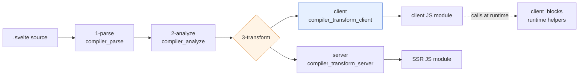
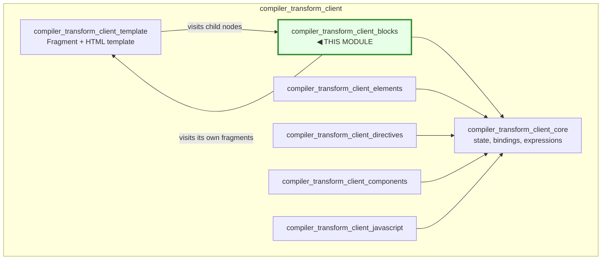
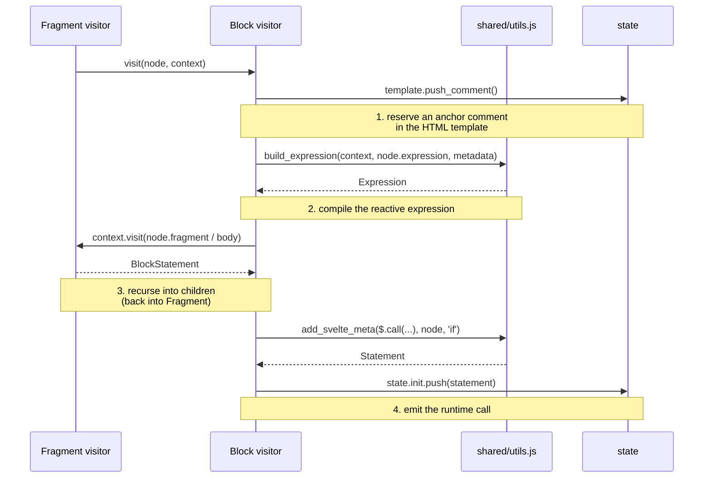
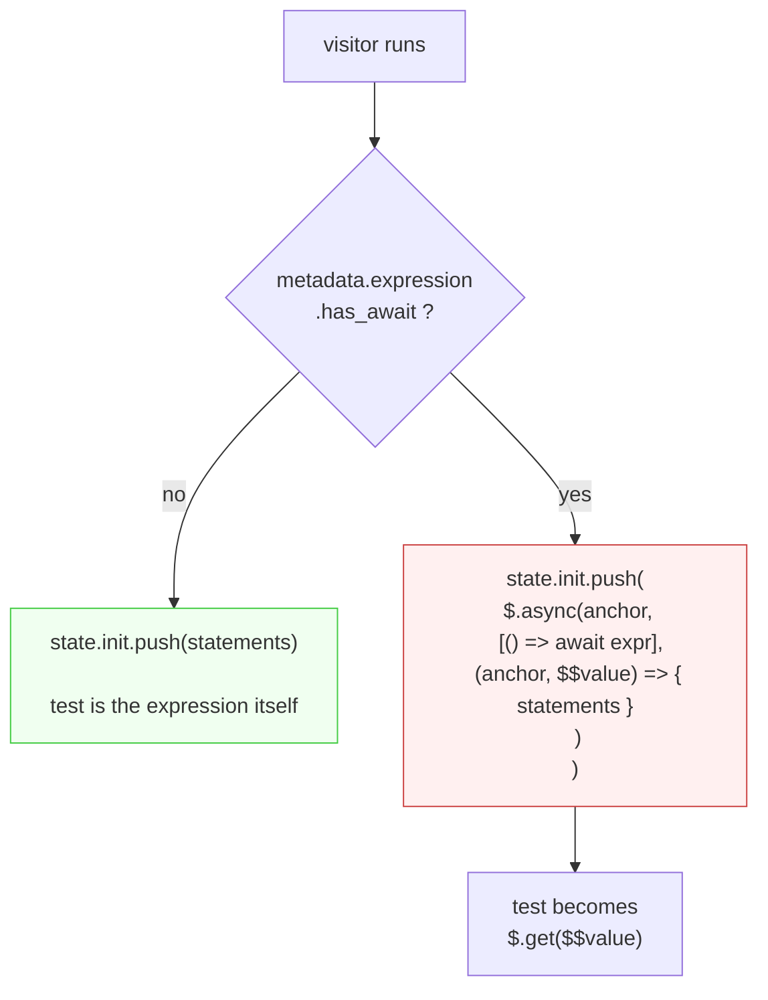
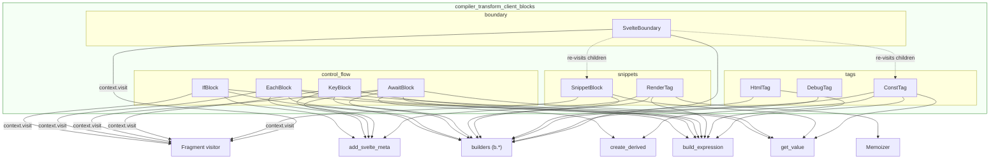
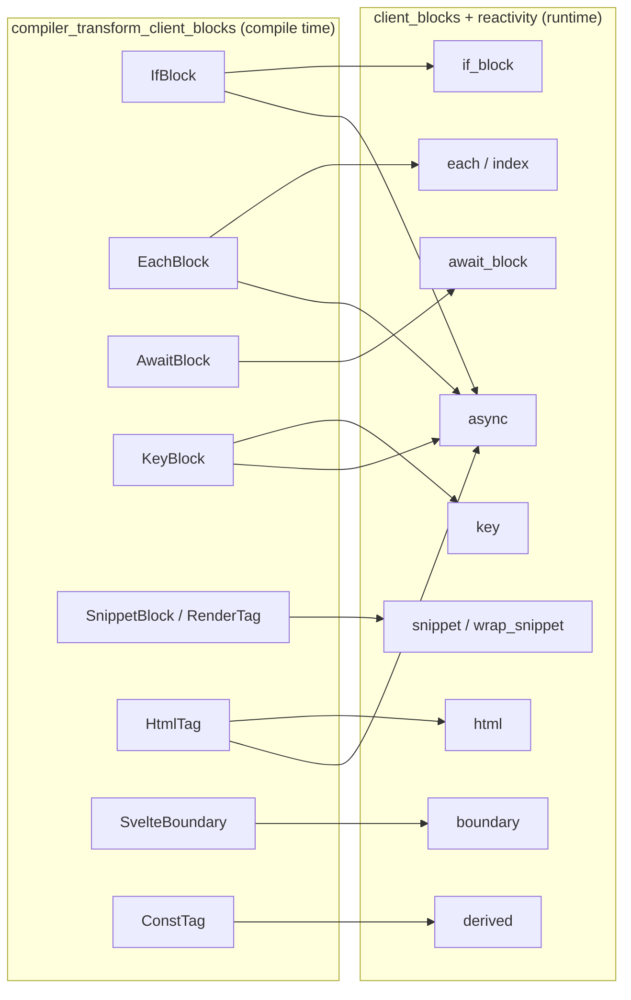

# compiler_transform_client_blocks

## Purpose

This module is the part of the Svelte compiler that turns **template blocks and tags** into client-side JavaScript.

When you write a `.svelte` file, things like `{#if}`, `{#each}`, `{#await}`, `{#key}`, `{#snippet}`, `{@render}`, `{@html}`, `{@const}`, `{@debug}` and `<svelte:boundary>` are *not* plain HTML. They are control flow. The browser has no idea what they mean. So the compiler must rewrite each one into a call to a matching runtime helper.

That rewrite is what this module does. Each file here is one **visitor**: a function that takes one AST node and pushes generated JavaScript into the surrounding code.

The pattern is always the same:

| Template you write | Runtime call this module emits |
| --- | --- |
| `{#if x}...{/if}` | `$.if(anchor, ...)` |
| `{#each list as item}...{/each}` | `$.each(anchor, flags, ...)` |
| `{#await p}...{/await}` | `$.await(anchor, ...)` |
| `{#key k}...{/key}` | `$.key(anchor, ...)` |
| `{#snippet foo()}...{/snippet}` | `const foo = ($$anchor) => {...}` |
| `{@render foo()}` | `$.snippet(anchor, ...)` or a direct call |
| `{@html s}` | `$.html(anchor, ...)` |
| `{@const x = y}` | `const x = $.derived(...)` |
| `{@debug x}` | `$.template_effect(...)` + `console.log` |
| `<svelte:boundary>` | `$.boundary(anchor, props, ...)` |

The `$.` prefix is the import alias for the client runtime. Every helper named above lives in [client_blocks](client_blocks.md) — that module is the runtime half of this compile-time half.

## Where it sits in the system

This module is one slice of the client transform, which is phase 3 of the compiler.



Inside the client transform, the visitors are split by the kind of node they handle. This module owns the **block and tag** visitors:



The relationship with [compiler_transform_client_template](compiler_transform_client_template.md) is **mutually recursive**, and that is the key idea of the whole design:

- `Fragment` walks a list of nodes and calls into a block visitor when it meets one.
- That block visitor calls `context.visit(node.fragment)` on its own body, which lands back in `Fragment`.

So each block body becomes its own self-contained `BlockStatement`, with its own HTML template, its own `init` list and its own anchor. That is why blocks nest to any depth without any special handling.

## How a visitor works

Every visitor in this module has the same signature and follows the same four steps.

```js
export function SomeBlock(node, context) { /* ... */ }
```

`context.state` is a `ComponentClientTransformState` (defined in [compiler_transform_client_core](compiler_transform_client_core.md)). The fields this module touches most are:

- **`state.template`** — the HTML template string being built. Blocks call `push_comment()` to reserve an anchor.
- **`state.node`** — the anchor identifier for the current position.
- **`state.init`** — statements that run before the render effect. Almost every block pushes here.
- **`state.consts`** — where `{@const}` declarations go.
- **`state.transform`** — the read/assign/mutate rewrite table for variable names.
- **`state.scope`** — used to generate collision-free names.

### The four steps



**Step 1 — reserve an anchor.** `context.state.template.push_comment()` puts a `<!>` marker in the static HTML. At runtime the block inserts and removes its content around that marker. `EachBlock` skips this when `is_controlled` is set, because a controlled each block owns its parent element and can use it directly.

**Step 2 — compile the expression.** `build_expression` (from `shared/utils.js`) visits the expression and, in legacy non-runes mode, wraps it so that coarse-grained reactivity still works — it reads every statically visible dependency, then wraps the real value in `$.untrack(...)`. In runes mode it just returns the visited expression.

**Step 3 — recurse.** `context.visit(...)` on the body. Blocks that introduce new variables (`{#each}`, `{#await}`, `{#snippet}`) build a **child state** with a cloned `transform` table first, so the new names only exist inside the body.

**Step 4 — emit.** The runtime call is wrapped in `add_svelte_meta`, which in dev mode adds the source line and column so error messages and the devtools can point back at your template. In production it is just `b.stmt(expression)`.

## The async lifting pattern

This is the most important shared behaviour in the module, and it shows up in `IfBlock`, `EachBlock`, `KeyBlock`, `HtmlTag` and `RenderTag`.

If the analysis phase marked an expression with `metadata.expression.has_await` — meaning the template used `await` directly, as in `{#if await ready()}` — the block cannot evaluate it inline, because rendering is synchronous. So the visitor **lifts** the whole block into a `$.async(...)` wrapper.



The shape is identical everywhere:

1. Build the expression once as an **async thunk** — `b.thunk(expression, true)`.
2. Pass it to `$.async` in an array, together with the anchor.
3. The callback receives the anchor plus a signal id (`$$condition`, `$$collection`, `$$key`, `$$html`).
4. Inside the block, read the resolved value with `$.get($$id)` instead of re-evaluating.

`RenderTag` is the general case. It uses the `Memoizer` class instead of a hand-rolled array, because a `{@render}` tag can have many arguments and each one may or may not be async. The memoizer sorts them into sync (which become `$.derived` declarations) and async (which become the `$.async` value array), then hands back stable ids.

## Sub-modules

The ten visitors split into four groups by what they generate.

### 1. Control-flow blocks → [compiler_transform_client_blocks_control_flow](compiler_transform_client_blocks_control_flow.md)

`IfBlock.js`, `EachBlock.js`, `AwaitBlock.js`, `KeyBlock.js`

The four blocks that conditionally or repeatedly render a fragment. Each compiles its branches into arrow functions taking `$$anchor`, then emits `$.if` / `$.each` / `$.await` / `$.key`.

This is where the real complexity of the module lives, almost all of it in `EachBlock`:

- a **bitmask of flags** (`EACH_ITEM_REACTIVE`, `EACH_INDEX_REACTIVE`, `EACH_IS_ANIMATED`, `EACH_IS_CONTROLLED`, `EACH_ITEM_IMMUTABLE`) computed at compile time so the runtime does not have to work anything out
- **destructuring** of the item pattern into per-path `$.derived` declarations
- **`transform` entries** so `item` reads as `$.get(item)`, and reassignment writes back into `array[index]`
- **store invalidation** and legacy `invalidate_inner_signals` plumbing for non-runes mode
- a **key function**, plus a dev-mode `$.validate_each_keys` guard

`IfBlock` carries one subtle rule worth knowing: for `{:else if}` it appends an extra `true` argument, which marks the transition as non-local so it plays when *either* condition changes.

`AwaitBlock` is the odd one out — it always evaluates its expression through a thunk and has no `$.async` lifting, because `$.await` already handles promises. Its `then`/`catch` values become deriveds via a local `create_derived_block_argument` helper.

### 2. Snippets and rendering → [compiler_transform_client_blocks_snippets](compiler_transform_client_blocks_snippets.md)

`SnippetBlock.js`, `RenderTag.js`

The definition side and the call side of snippets.

`SnippetBlock` compiles `{#snippet}` into a function whose first parameter is `$$anchor`. Each declared parameter gets a default of `$.noop` so an omitted argument is safe to call. Top-level snippets are **hoisted** — to `module_level_snippets` if the analysis says `can_hoist`, otherwise to `instance_level_snippets` — which is what lets `<script>` reference them.

`RenderTag` compiles `{@render foo(...)}`. It picks between a direct call and the `$.snippet(...)` wrapper based on `node.metadata.dynamic`, and it is the heaviest user of `Memoizer`.

### 3. Inline tags → [compiler_transform_client_blocks_tags](compiler_transform_client_blocks_tags.md)

`HtmlTag.js`, `ConstTag.js`, `DebugTag.js`

Three small tags that produce values or side effects rather than branching.

`HtmlTag` emits `$.html`, passing namespace flags so SVG and MathML content is parsed correctly. `ConstTag` is the closest thing in the module to `$derived` — it pushes into `state.consts` and registers a `transform` entry, handling both simple identifiers and destructuring patterns. `DebugTag` is dev tooling: a `$.template_effect` that snapshots the named values, logs them and hits `debugger`.

### 4. Error boundaries → [compiler_transform_client_blocks_boundary](compiler_transform_client_blocks_boundary.md)

`SvelteBoundary.js`

`<svelte:boundary>` compiles to `$.boundary(anchor, props, body)`. Attributes become either plain properties or **getters**, depending on whether the analysis found state in them — a getter keeps the value reactive.

This visitor has the most awkward job in the module. `{@const}` must live *inside* the boundary, but `failed` and `pending` snippets are hoisted *outside* it, so a hoisted snippet could reference a const that is not in scope. The current workaround duplicates the const declarations into each hoisted snippet body. Under `options.experimental.async` this is skipped and consts stay in the fragment instead. The source comments call the original behaviour a mistake that will be reverted, so treat this area as unstable.

## Component and dependency map



External dependencies, and where they are documented:

| Dependency | Provides | Module |
| --- | --- | --- |
| `client/visitors/shared/utils.js` | `build_expression`, `add_svelte_meta`, `Memoizer` | [compiler_transform_client_core](compiler_transform_client_core.md) |
| `client/visitors/shared/declarations.js` | `get_value` — makes `$.get(x)` | [compiler_transform_client_core](compiler_transform_client_core.md) |
| `client/utils.js` | `create_derived` — sync or async derived | [compiler_transform_client_core](compiler_transform_client_core.md) |
| `client/types.d.ts` | `ComponentClientTransformState` | [compiler_transform_client_core](compiler_transform_client_core.md) |
| `client/visitors/Fragment.js` | recursion target for block bodies | [compiler_transform_client_template](compiler_transform_client_template.md) |
| `compiler/utils/builders.js` | `b.call`, `b.arrow`, `b.thunk`, `b.var`, … | [compiler_core](compiler_core.md) |
| `compiler/utils/ast.js` | `extract_paths`, `extract_identifiers`, `object`, `unwrap_optional` | [compiler_core](compiler_core.md) |
| `compiler/state.js` | `dev`, `is_ignored` | [compiler_core](compiler_core.md) |
| `compiler/constants.js` | `EACH_*` flags | [compiler_core](compiler_core.md) |
| node `metadata` fields | `has_await`, `keyed`, `is_controlled`, `can_hoist`, `dynamic` | [compiler_analyze](compiler_analyze.md) / [compiler_analyze_blocks](compiler_analyze_blocks.md) |
| AST node types | `AST.IfBlock`, `AST.EachBlock`, … | [compiler_ast_types](compiler_ast_types.md) |

## Relationship to the runtime

This module only writes calls. The functions it calls are implemented in [client_blocks](client_blocks.md):



The reactive primitives (`$.derived`, `$.get`, `$.async`, `$.template_effect`) come from [client_reactivity](client_reactivity.md). Dev-only helpers (`$.validate_each_keys`, `$.validate_snippet_args`, `$.tag`, `$.snapshot`, `$.add_svelte_meta`, `$.wrap_snippet`) come from [client_dev_tooling](client_dev_tooling.md) and [client_render_and_templates](client_render_and_templates.md).

For the same blocks compiled for the server instead, see [compiler_transform_server](compiler_transform_server.md). The server visitors have the same file names but produce string concatenation rather than runtime calls, since SSR output is not reactive.

## Notes for maintainers

- **Adding a new block type** means: a new visitor here, a matching runtime helper in `client_blocks`, a server visitor in `compiler_transform_server`, an analysis visitor for metadata, and an AST node type. All five, or it will not work.
- **Keep the four steps in order.** `push_comment()` must happen before children are visited, because the template is built in document order. Getting this wrong produces anchors in the wrong place, which fails silently at runtime and only shows up during hydration.
- **`dev` guards are everywhere.** Eager `$.get(...)` calls exist purely to trigger "Cannot access x before initialization" errors at the right moment. They look redundant. They are not.
- **Runes vs legacy** is checked with `context.state.analysis.runes` all over `EachBlock` and `ConstTag`. Legacy paths carry store invalidation and `derived_safe_equal` instead of `derived`.

## Related documentation

### Sub-modules of this module

- [compiler_transform_client_blocks_control_flow](compiler_transform_client_blocks_control_flow.md) — `IfBlock`, `EachBlock`, `AwaitBlock`, `KeyBlock`
- [compiler_transform_client_blocks_snippets](compiler_transform_client_blocks_snippets.md) — `SnippetBlock`, `RenderTag`
- [compiler_transform_client_blocks_tags](compiler_transform_client_blocks_tags.md) — `HtmlTag`, `ConstTag`, `DebugTag`
- [compiler_transform_client_blocks_boundary](compiler_transform_client_blocks_boundary.md) — `SvelteBoundary`

### Sibling and related modules

- [compiler_transform_client](compiler_transform_client.md) — the parent client transform
- [compiler_transform_client_core](compiler_transform_client_core.md) — shared state, expression building, bindings
- [compiler_transform_client_template](compiler_transform_client_template.md) — `Fragment` and HTML template construction
- [compiler_transform_client_elements](compiler_transform_client_elements.md) — element and attribute visitors
- [compiler_transform_client_components](compiler_transform_client_components.md) — component and slot visitors
- [compiler_transform_client_directives](compiler_transform_client_directives.md) — `bind:`, `on:`, `use:`, `transition:`
- [compiler_transform_client_javascript](compiler_transform_client_javascript.md) — `<script>` and expression-level visitors
- [compiler_analyze_blocks](compiler_analyze_blocks.md) — the analysis pass that fills in block metadata
- [client_blocks](client_blocks.md) — the runtime implementations
- [compiler_transform_server](compiler_transform_server.md) — the SSR counterpart
