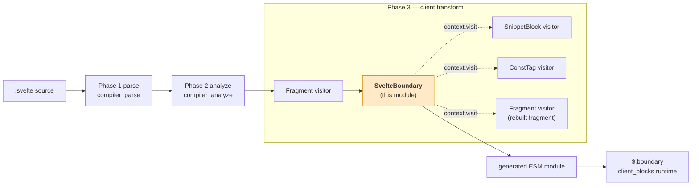
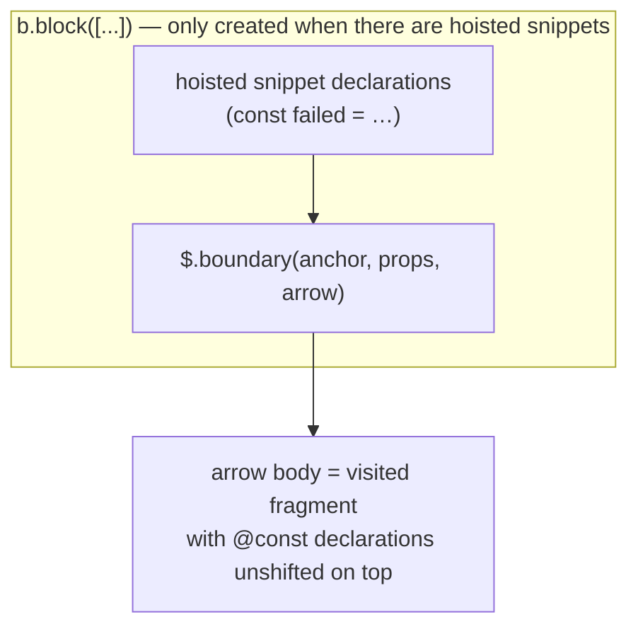
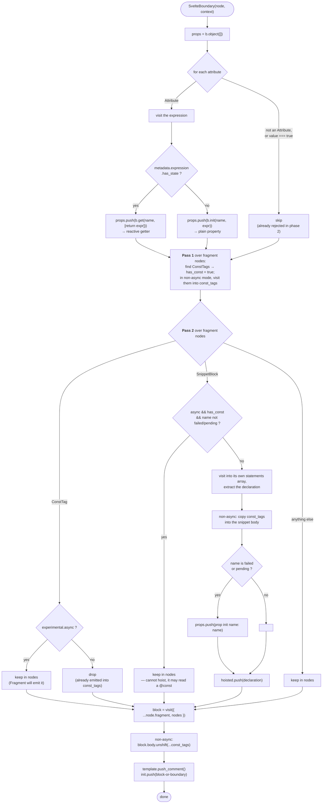
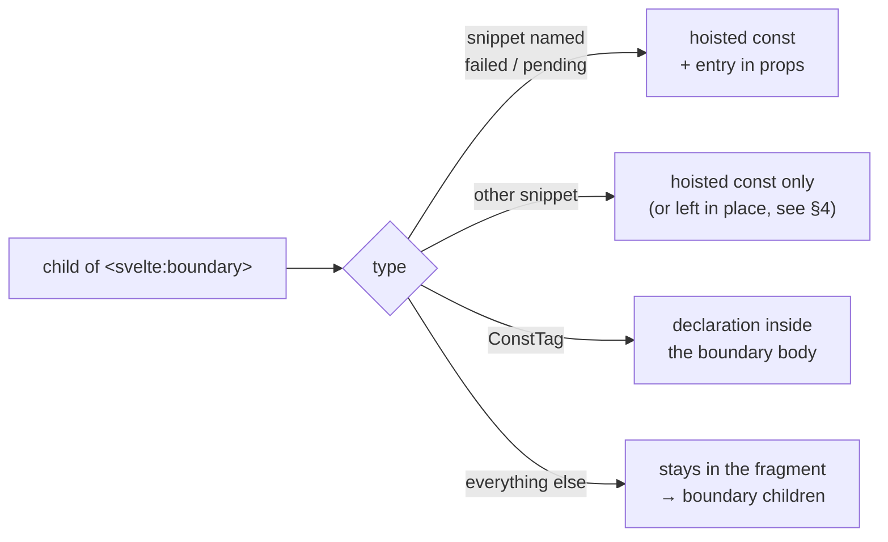
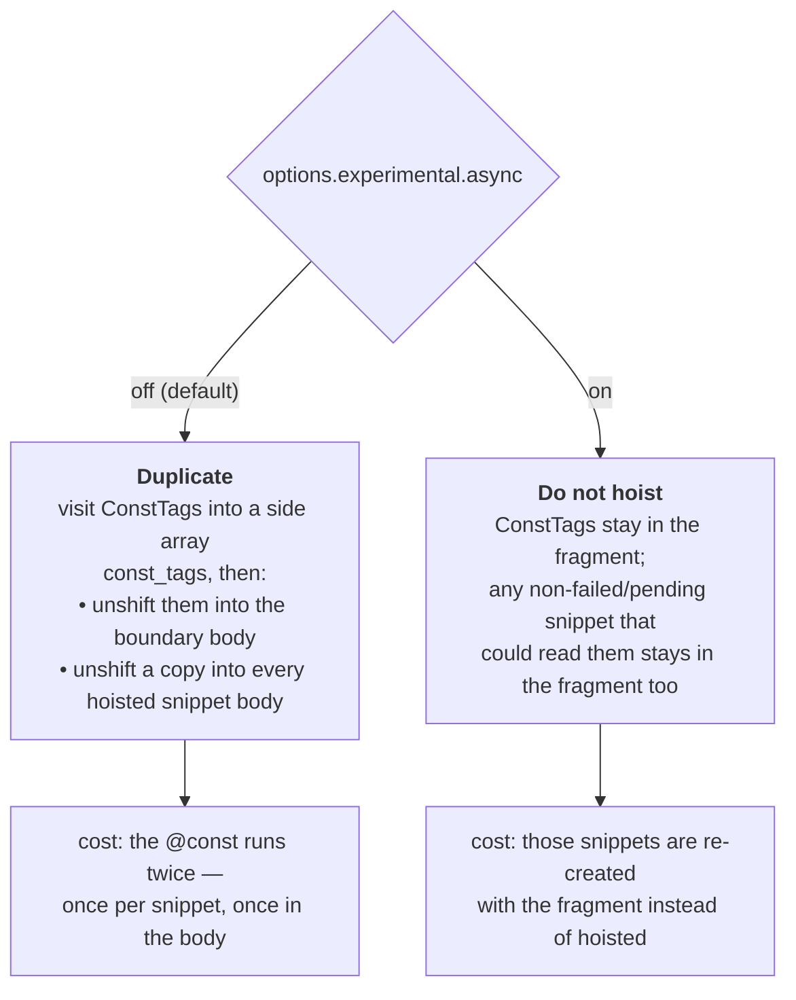
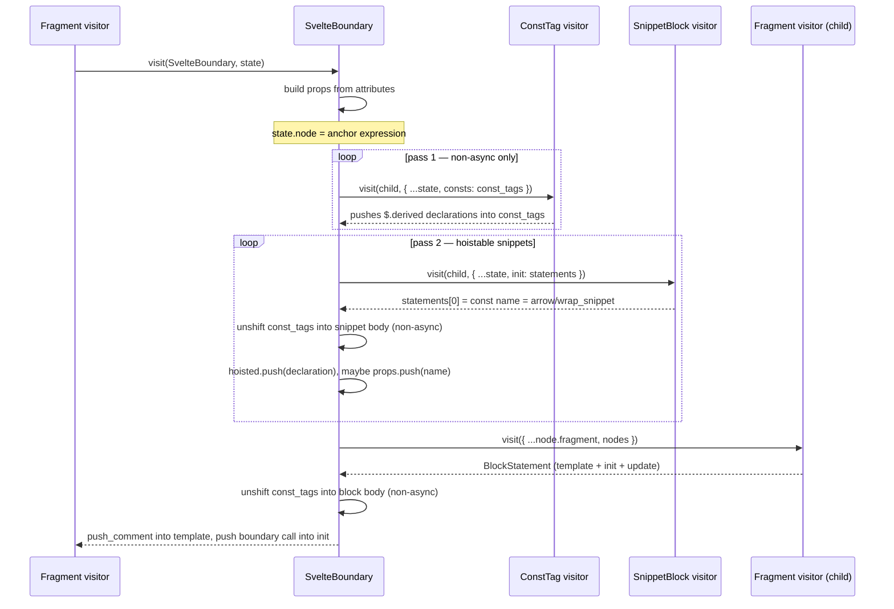
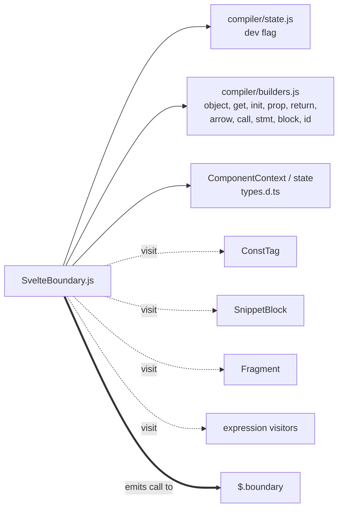
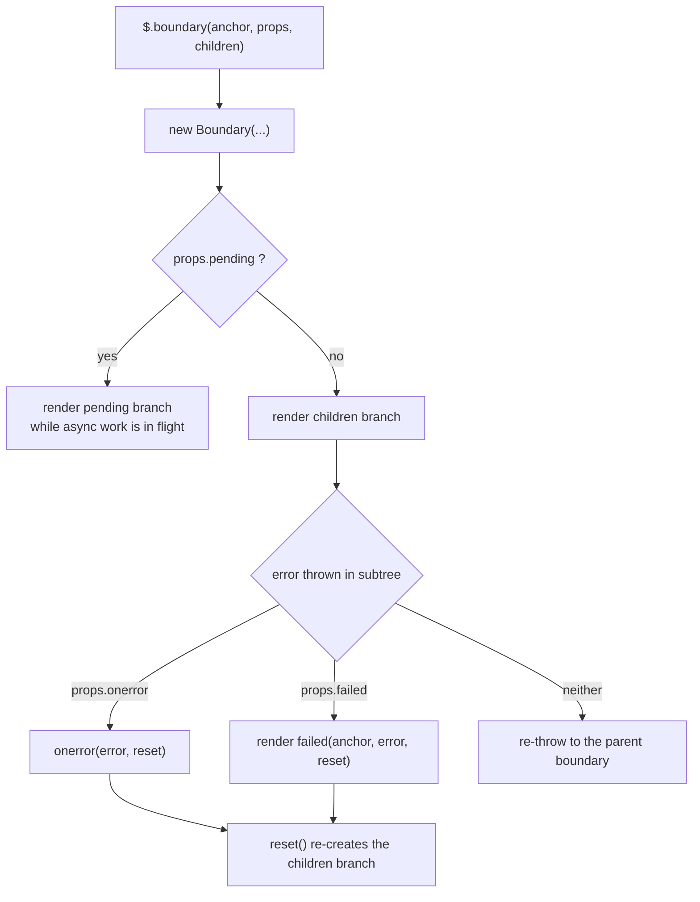

# compiler_transform_client_blocks_boundary

## Introduction

This module is one file with one job: turn a `<svelte:boundary>` tag into client-side JavaScript.

| Item | Value |
| --- | --- |
| Core component | `packages/svelte/src/compiler/phases/3-transform/client/visitors/SvelteBoundary.js::SvelteBoundary` |
| Runs in | Phase 3, client transform (see [compiler_transform_client](compiler_transform_client.md)) |
| Input | an `AST.SvelteBoundary` node + a `ComponentContext` |
| Output | statements pushed into `context.state.init`, plus one comment in the template |
| Runtime call it emits | `$.boundary(anchor, props, ($$anchor) => { … })` |

`<svelte:boundary>` is Svelte's error boundary (and, in async mode, its "pending" boundary). In the source it looks like this:

```svelte
<svelte:boundary onerror={handler}>
  {@const label = title.toUpperCase()}
  <Widget {label} />

  {#snippet failed(error, reset)}
    <p>oops: {error.message}</p>
    <button onclick={reset}>retry</button>
  {/snippet}
</svelte:boundary>
```

The visitor's real work is not the boundary call itself — that part is short. The hard part is **sorting the children**: `failed` / `pending` snippets have to become props of the boundary, other snippets get hoisted *above* the boundary, `{@const}` tags must live *inside* the boundary, and those two rules conflict. Section 4 explains how the code cheats its way out of that conflict.

This is a sibling of [compiler_transform_client_blocks_control_flow](compiler_transform_client_blocks_control_flow.md), [compiler_transform_client_blocks_snippets](compiler_transform_client_blocks_snippets.md) and [compiler_transform_client_blocks_tags](compiler_transform_client_blocks_tags.md), all inside [compiler_transform_client_blocks](compiler_transform_client_blocks.md).

---

## 1. Where this module sits



Two things are already settled before this visitor runs:

* **Validation.** The phase-2 visitor `2-analyze/visitors/SvelteBoundary.js` has already rejected anything that is not `onerror`, `failed` or `pending`, and rejected attribute values that are not a single expression tag (`svelte_boundary_invalid_attribute`, `svelte_boundary_invalid_attribute_value`). See [compiler_analyze_special_elements](compiler_analyze_special_elements.md). That is why the transform can safely `continue` past "impossible" attribute shapes — the comment in the code says exactly that: they cannot exist, TypeScript just does not know it.
* **Expression metadata.** Each attribute's `chunk.metadata.expression.has_state` was computed in phase 2 — see [compiler_analyze_expression_metadata](compiler_analyze_expression_metadata.md). The transform only reads it.

The server side handles the same tag completely differently: it has no error recovery, it just renders the `pending` snippet if there is one, otherwise the children. See `3-transform/server/visitors/SvelteBoundary.js` in [compiler_transform_server](compiler_transform_server.md).

---

## 2. The shape of the output

For the example at the top, the generated code looks roughly like this (names simplified):

```js
{
  const failed = ($$anchor, error, reset) => { /* snippet body, with @const copied in */ };

  $.boundary(node, { onerror: handler, failed }, ($$anchor) => {
    let label = $.derived(() => title.toUpperCase());   // the @const, inside the boundary
    /* the rest of the children */
  });
}
```

Notice the three layers:



The wrapping `b.block` exists for scoping: the hoisted snippet consts must be visible to the `props` object literal, but must not leak into the surrounding fragment's scope. When there are no hoisted snippets, the visitor pushes the bare `$.boundary(...)` statement instead — no extra block.

---

## 3. Step-by-step flow



### 3.1 Attributes → props

Every attribute becomes one property on the `props` object literal handed to `$.boundary`. The only real decision is **getter vs plain value**:

* `has_state === false` → `b.init(name, expression)`. The value is read once. Fine for a stable function like `onerror={handler}`.
* `has_state === true` → `b.get(name, [b.return(expression)])`, i.e. `{ get failed() { return … } }`. The runtime re-reads the property every time it needs it, so state changes are picked up.

This is the same trick used for component props (see [compiler_transform_client_components](compiler_transform_client_components.md)), and it is why the runtime `Boundary` class can just read `this.#props.pending` / `this.#props.failed` / `this.#props.onerror` whenever it wants.

### 3.2 The three destinations for a child node



`failed` and `pending` are pushed as `b.prop('init', child.expression, child.expression)` — a shorthand-style `{ failed }` property that points at the hoisted const. That is how a `{#snippet failed(...)}` in the markup and a `failed={...}` attribute end up looking identical to the runtime.

### 3.3 Emitting

* `context.state.template.push_comment()` adds a `<!>` placeholder to the fragment's HTML template (see `Template` in [compiler_transform_client_template](compiler_transform_client_template.md)). That comment is the anchor node the boundary renders against, and it is also what hydration walks over.
* `context.state.init.push(...)` puts the statement into the current fragment's init list. `context.state.node` — the anchor expression for this position — is passed as the first argument to `$.boundary`.

---

## 4. The `{@const}` vs hoisted-snippet conflict

This is the part of the file worth reading twice. Two rules pull in opposite directions:

1. A `{@const}` inside a boundary must be evaluated **inside** the boundary body, so that an error while computing it is caught by that boundary.
2. A snippet declaration is **hoisted above** the `$.boundary` call, so the `props` object can reference it.

If a snippet reads a `{@const}`, rule 2 puts the read above the declaration from rule 1 — a `ReferenceError`.

The file solves it in two different ways depending on the `experimental.async` compiler option:



The code says this out loud:

> `const tags need to live inside the boundary, but might also be referenced in hoisted snippets. to resolve this we cheat: we duplicate const tags inside snippets. We'll revert this behavior in the future, it was a mistake to allow this (Component snippets also don't do this).`

So the async branch is the intended future behaviour, and the legacy branch is kept for compatibility.

### 4.1 How the duplication is done

To copy a `{@const}` into a snippet the visitor has to reach *inside* the AST that `SnippetBlock` produced. That is what these lines do:

```js
const snippet = statements[0];                       // the VariableDeclaration
const snippet_fn = dev
  ? snippet.declarations[0].init.arguments[1]        // $.wrap_snippet(Comp, function (…) {…})
  : snippet.declarations[0].init;                    // ($$anchor, …) => {…}

snippet_fn.body.body.unshift(...const_tags.filter(n => n.type === 'VariableDeclaration'));
```

The `dev` fork exists because `SnippetBlock` wraps the function in `$.wrap_snippet(Component, fn)` in dev mode so the runtime can report a nice ownership/stack error, and emits a bare arrow in production. See [compiler_transform_client_blocks_snippets](compiler_transform_client_blocks_snippets.md) for that shape, and `dev` in `compiler/state.js` ([compiler_core](compiler_core.md)).

Only `VariableDeclaration` statements are copied. `ConstTag` in dev mode also pushes an eager `$.get(x)` read statement (to surface "cannot access before initialization"); that one is deliberately not duplicated.

### 4.2 Why two passes over the children

Pass 1 exists purely to compute `has_const` and to fill `const_tags` **before** any snippet is visited. A `{@const}` may appear *after* a snippet in the source, so a single pass would sometimes copy an empty array.

---

## 5. Interaction with other visitors



The two **state overrides** are the interesting bit. Both visitors normally write into the *current* fragment's state; the boundary redirects them:

| Override | Why |
| --- | --- |
| `{ ...context.state, consts: const_tags }` | so `ConstTag` writes into a private array the boundary controls, instead of the fragment's `consts` (which `Fragment` would emit at the top of the outer block) |
| `{ ...context.state, init: statements }` | so `SnippetBlock`'s declaration lands in a one-element array the boundary can read back, instead of the fragment's `init` |

`SnippetBlock` also hoists top-level snippets to module/instance scope when `context.path.length === 1`. Inside a boundary the path is deeper, so it always takes the `context.state.init.push(declaration)` branch — which is exactly the branch this override captures.

Note that `{ ...node.fragment, nodes }` builds a **new** fragment object with a filtered child list. The original AST is not mutated, so nothing downstream sees the rewritten node list.

---

## 6. Dependencies at a glance



| Dependency | Module doc |
| --- | --- |
| `b.*` AST builders | [compiler_core](compiler_core.md) |
| `dev` compile-time flag | [compiler_core](compiler_core.md) |
| `ComponentContext`, `ComponentClientTransformState` (`init`, `consts`, `template`, `node`, `options`) | [compiler_transform_client_core_state](compiler_transform_client_core_state.md) |
| `Fragment` visitor, `Template.push_comment` | [compiler_transform_client_template](compiler_transform_client_template.md) |
| `SnippetBlock` visitor | [compiler_transform_client_blocks_snippets](compiler_transform_client_blocks_snippets.md) |
| `ConstTag` visitor | [compiler_transform_client_blocks_tags](compiler_transform_client_blocks_tags.md) |
| Attribute validation, `AST.SvelteBoundary` shape | [compiler_analyze_special_elements](compiler_analyze_special_elements.md), [compiler_ast_types](compiler_ast_types.md) |
| `$.boundary` runtime | [client_blocks](client_blocks.md) |
| SSR counterpart | [compiler_transform_server](compiler_transform_server.md) |

---

## 7. What the runtime does with this output

Short version, so the emitted shape makes sense. `$.boundary(node, props, children)` constructs a `Boundary` (in `internal/client/dom/blocks/boundary.js`, part of [client_blocks](client_blocks.md)):



Three details tie straight back to the transform:

* **`props.failed` is called with `(anchor, error, reset)`** — three arguments. That matches a `{#snippet failed(error, reset)}`, whose generated function takes `($$anchor, error, reset)`. The transform does not need special handling; a snippet already has that signature.
* **`re-throw when there is no `onerror` and no `failed`.** A boundary with neither is a pass-through, which is why the transform is happy to emit an empty `props` object.
* **`reset()` re-runs `children`.** `children` is the arrow function the transform built from the fragment, so anything the transform put *inside* that arrow — including the duplicated `{@const}` declarations — is re-evaluated on reset. Anything hoisted *outside* (the snippets) is not. That is the semantic reason `{@const}` has to be inside and snippets can be outside.

---

## 8. Edge cases and gotchas

| Situation | Behaviour |
| --- | --- |
| No attributes and no snippets | `props` is `{}`, `hoisted` is empty → a bare `$.boundary(node, {}, arrow)` statement. Errors pass through to the parent boundary. |
| `failed` given both as attribute and as snippet | Both would push a `failed` property; the later one (the snippet, pushed during pass 2) wins in the object literal. Phase 2 is the layer that is expected to complain about duplicates. |
| `pending` in non-async mode | Still compiled into a prop. The runtime only shows it when there is async work to wait for. |
| Snippet named neither `failed` nor `pending` | Hoisted but not added to `props` — it is just a normal snippet the children can `{@render}`. |
| `{@const}` + a normal snippet, async mode | Neither is hoisted; both stay in the fragment, so ordering is handled by the `Fragment` visitor instead. |
| `{@const}` + `failed`/`pending` snippet, async mode | The snippet is still hoisted (the `!['failed','pending'].includes(...)` guard), because a fallback snippet must be reachable from `props` even if the main body blew up. |
| Attribute value is a static string | Impossible here — phase 2 requires an expression tag, so `chunk.expression` always exists. |

---

## 9. Summary

`SvelteBoundary` in the client transform is a small router. It splits the children of `<svelte:boundary>` into three piles — props (`failed` / `pending`), hoisted snippet declarations, and real children — then emits one `$.boundary(anchor, props, children)` call plus a `<!>` anchor comment. Attributes become plain properties or getters depending on whether they read state.

The only genuinely tricky logic is `{@const}` placement, and the file is honest about it: in legacy mode it duplicates the declarations into every hoisted snippet, and under `experimental.async` it stops hoisting the snippets that could need them.
