# compiler_transform_client_blocks_control_flow

## Introduction

This module holds the four **client-side transform visitors** for Svelte's control-flow template blocks:

| Template syntax | Visitor file | Runtime call it emits |
| --- | --- | --- |
| `{#if ...}` / `{:else if}` / `{:else}` | `IfBlock.js` | `$.if(...)` |
| `{#each ...}` / `{:else}` | `EachBlock.js` | `$.each(...)` |
| `{#await ...}` / `{:then}` / `{:catch}` | `AwaitBlock.js` | `$.await(...)` |
| `{#key ...}` | `KeyBlock.js` | `$.key(...)` |

Each visitor takes one AST node plus a transform context, and pushes JavaScript statements into `context.state.init`. Those statements are the browser code that creates and updates the block at runtime.

The job of the module is small but central: **turn declarative template blocks into imperative calls into the client runtime**, while wiring up scopes, reactivity, keys, and (new in Svelte 5 async mode) `await` inside the block expression.

---

## Where this module sits

The compiler runs in three phases. This module is a leaf inside phase 3, on the client (DOM) side.

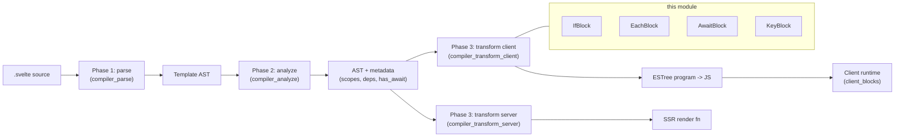

Related docs:

- [compiler_transform_client](compiler_transform_client.md) — the whole client transform pass and its visitor table.
- [compiler_transform_client_blocks](compiler_transform_client_blocks.md) — the parent group (this module plus snippets, tags, boundary).
- [compiler_transform_client_core](compiler_transform_client_core.md) — shared helpers and transform state.
- [compiler_transform_client_template](compiler_transform_client_template.md) — `Fragment` and the template/anchor machinery.
- [compiler_analyze_blocks](compiler_analyze_blocks.md) — where the block metadata read here is produced.
- [client_blocks](client_blocks.md) — the runtime side: `$.if`, `$.each`, `$.await`, `$.key`, `$.async`.
- [compiler_transform_server](compiler_transform_server.md) — the SSR counterparts of these same four blocks.

---

## The shared shape

All four visitors follow the same five steps. Reading this once makes all four files easy to follow.

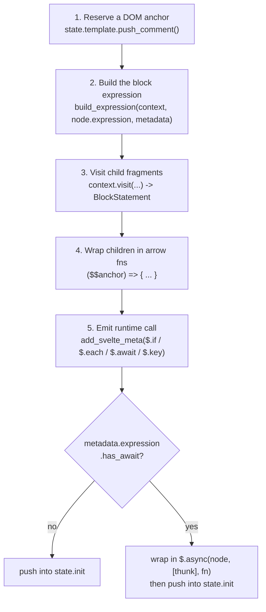

### 1. The anchor comment

`context.state.template.push_comment()` adds a `<!>` placeholder to the hoisted template string. At runtime the block gets that comment node as its anchor and inserts/removes siblings around it. Anchors are why blocks can swap content without touching the rest of the DOM.

`EachBlock` is the one exception — it skips the comment when `metadata.is_controlled` is true (see below).

### 2. Building the expression

`build_expression` (from `compiler_transform_client_core`) visits the expression and, **in legacy (non-runes) mode only**, wraps it so that coarse-grained legacy reactivity still works: it reads every statically visible dependency, then evaluates the real value inside `$.untrack(...)`. In runes mode it just returns the visited expression.

### 3–4. Child fragments become closures

Every branch body (`consequent`, `alternate`, `then`, `catch`, `pending`, each `body`, each `fallback`, key `fragment`) is visited through the `Fragment` visitor, which returns a `BlockStatement`. The visitor then wraps it in an arrow that takes `$$anchor` — that is the contract the runtime expects for a "branch function".

### 5. Dev metadata

`add_svelte_meta(call, node, type)` is a no-op in production (it just wraps the call in a statement). In dev it becomes:

```js
$.add_svelte_meta(() => $.if(...), 'if', ComponentName, line, column);
```

This is what powers dev-time component stack traces and error locations.

---

## Async mode: the `$.async` wrapper

When Svelte's async mode is on, a block expression may contain `await` (`{#if await ready()}`, `{#each await load()}`, `{#key await id()}`). Analysis records this as `node.metadata.expression.has_await`.

Three of the four visitors handle it the same way:

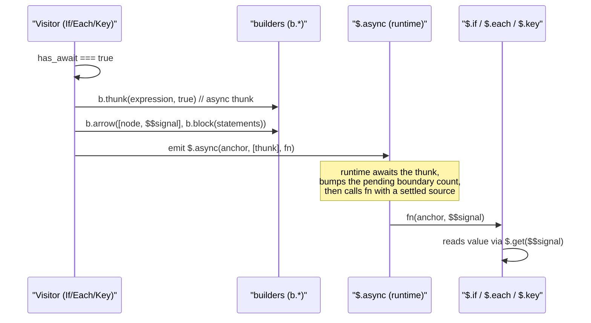

The signal name differs per block, and that is the only real difference:

| Visitor | Async param | Inner read |
| --- | --- | --- |
| `IfBlock` | `$$condition` | `$.get($$condition)` used as the `if` test |
| `EachBlock` | `$$collection` | `() => $.get($$collection)` used as `get_collection` |
| `KeyBlock` | `$$key` | `() => $.get($$key)` used as `get_key` |

`AwaitBlock` does **not** use `$.async`. It is already promise-aware: it just marks its own expression thunk as async (`b.thunk(expr, has_await)`) and lets `$.await` deal with pending/resolved/rejected states.

---

## Component interaction

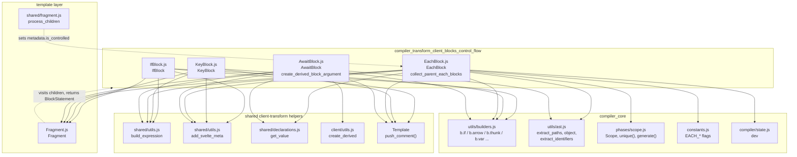

---

## `IfBlock`

### Emitted shape

```js
// {#if x} A {:else} B {/if}
{
	var consequent = ($$anchor) => { /* A */ };
	var alternate = ($$anchor) => { /* B */ };

	$.if(node_1, ($$render) => {
		if (x) $$render(consequent);
		else $$render(alternate, false);
	});
}
```

Notes:

- Branch names come from `context.state.scope.generate('consequent' | 'alternate')`, so nesting never collides.
- The whole thing is pushed as a single `b.block([...])` — a bare block statement — which keeps the `var` declarations scoped to the block.
- The `false` second argument to `$$render` tells the runtime "this is the alternate branch", which it uses for hydration matching (`HYDRATION_START_ELSE`).

### The `elseif` flag

When `node.elseif` is true, a third argument `true` is passed to `$.if`. At runtime this sets `EFFECT_TRANSPARENT` on the block effect. The source comment explains why:

```svelte
{#if x}...{:else}{#if y}<div transition:foo>{/if}{/if}
{#if x}...{:else if y}<div transition:foo>{/if}
```

These are logically the same, but transitions differ. In the nested form the transition is "local" to `y`. In the `:else if` form it should also play when `x` changes. The transparent flag makes the outer block's changes visible to the inner transition.

### Control flow

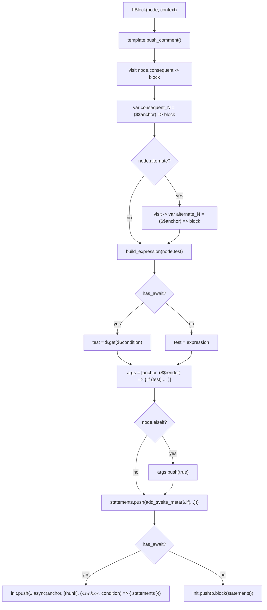

---

## `EachBlock`

This is by far the largest visitor in the module. It has to decide *how reactive* each item and index need to be, handle destructuring, handle keys, handle legacy store invalidation, and handle animations.

### Emitted shape

```js
// {#each items as item, i (item.id)} ... {:else} ... {/each}
$.each(
	node_1,
	flags,
	() => items,
	(item, i) => item.id,
	($$anchor, item, $$index) => { /* body */ },
	($$anchor) => { /* fallback */ }
);
```

### The flags bitmask

The second argument is a bitmask from `packages/svelte/src/constants.js`. This is the visitor's main compile-time optimisation: it decides once, at build time, how much reactive machinery the runtime must allocate per item.

| Flag | Value | Set when |
| --- | --- | --- |
| `EACH_ITEM_REACTIVE` | `1` | the collection expression depends on state declared in an outer function scope, and it is not the simple "key is the item" runes case |
| `EACH_INDEX_REACTIVE` | `2` | the block is keyed **and** has an index (`as item, i`) — reordering changes indices |
| `EACH_IS_CONTROLLED` | `4` | `metadata.is_controlled` — the each block is the only child of an element |
| `EACH_IS_ANIMATED` | `8` | keyed **and** some direct child element carries an `animate:` directive |
| `EACH_ITEM_IMMUTABLE` | `16` | runes mode and no store subscription in the collection expression |

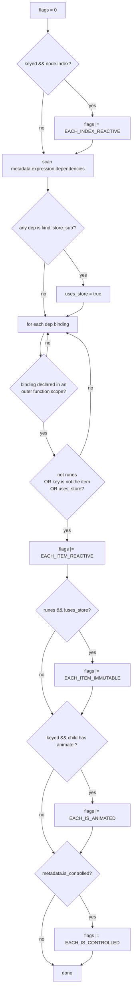

**"Controlled"** means the each block is the sole child of a real element, so the parent element itself can act as the container — no comment anchor is needed, and the runtime can clear it by emptying the parent. `metadata.is_controlled` is set upstream by `process_children` in `shared/fragment.js` (see [compiler_transform_client_template](compiler_transform_client_template.md)). This is why `push_comment()` is conditional here.

**Key is item** (`{#each items as item (item)}`) plus runes plus no store means the item never needs its own source — the key already identifies it, so `EACH_ITEM_REACTIVE` can be skipped.

### Scope handling: parent vs. child

An each block creates a new scope for `item` and `i`, but the collection expression belongs to the **parent** scope. The visitor is explicit about this:

```js
const parent_scope_state = { ...context.state, scope: context.state.scope.parent };
const collection = build_expression({ ...context, state: parent_scope_state }, node.expression, ...);
```

Three separate states are then in play:

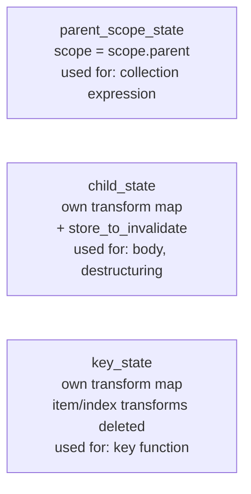

`key_state` deliberately **deletes** the transforms for `item` and the destructured names. The key function receives the raw item as a parameter, so it must not go through `$.get(...)`. It only tracks whether the index was used, via `key_uses_index`.

### The transform map

`state.transform` is a per-name table of `{ read, assign, mutate }` hooks. Later visitors (`Identifier`, `AssignmentExpression`, `MemberExpression` — see [compiler_transform_client_javascript](compiler_transform_client_javascript.md)) consult it whenever they touch a name. `EachBlock` installs entries for the loop variables:

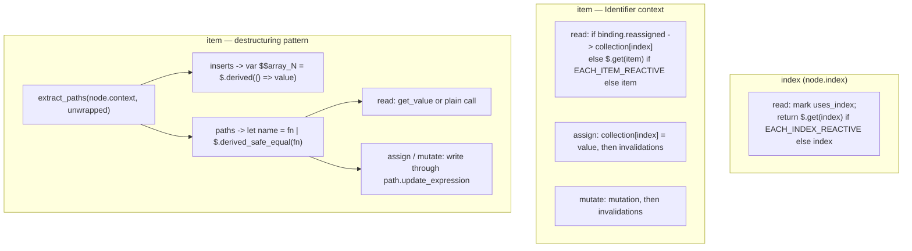

Two details worth knowing:

- **`binding.reassigned`** (legacy only — runes forbids it): reading `item` compiles to `collection[index]` rather than the parameter, so writes are visible. This forces `uses_index = true`.
- **Default values in patterns** (`as { a = 1 }`) set `has_default_value`, so the path gets a `$.derived_safe_equal` instead of a plain thunk. That guarantees the default expression runs only once.
- In dev, each destructured path also emits an eager read (`b.stmt(read(b.id(name)))`) so "cannot access before initialization" errors surface at the right place.

### Legacy invalidation

In non-runes mode, mutating an item must invalidate the arrays it came from. The visitor builds a `sequence` of invalidation calls that is appended to every `assign` and `mutate`:

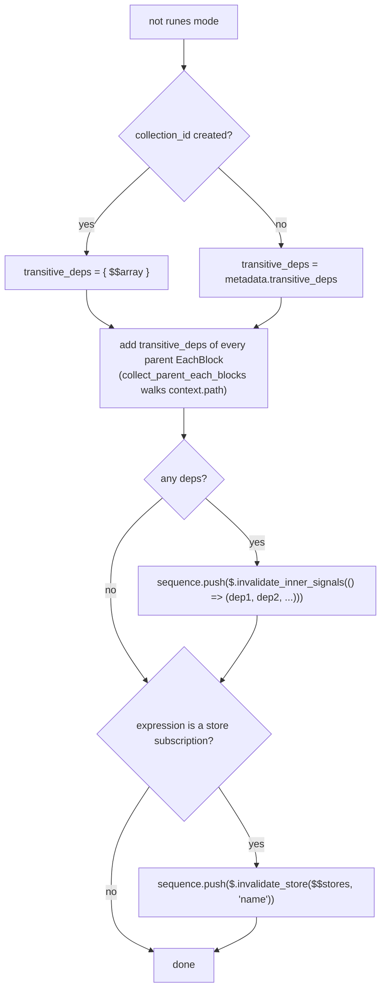

`collect_parent_each_blocks` simply filters `context.path` for `EachBlock` nodes — a cheap way to reach every enclosing each block without threading extra state.

### `collection_id` (`$$array`)

If any name declared in the each scope **shadows** a name from the parent scope, the collection expression cannot be re-evaluated safely inside the body. The visitor then allocates a unique `$$array` identifier, passes it as an extra render-function parameter, and reads it through `read: b.call` (the runtime hands in a getter).

### Render-function parameters

Parameters are added only when needed, keeping generated code lean:

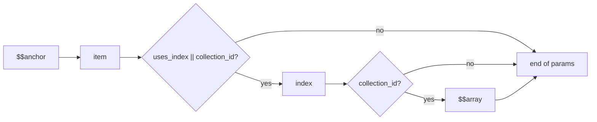

Because `uses_index` is only flipped by the `read`/`assign` hooks, the visitor must visit the body **before** it can build the parameter list — and it does exactly that.

`contains_group_binding` (from a `bind:group` inside the block) always forces `uses_index = true`, because group bindings need the index. In that case the index parameter uses the generated `metadata.index` name, and an extra `let <user index name> = $$index` declaration is added so the template can still use the author's name.

### Key function

```js
key_function = node.metadata.keyed
	? b.arrow(key_uses_index ? [pattern, index] : [pattern], key_expression)
	: b.id('$.index');
```

`$.index` is the runtime's built-in identity key (position-based). In dev, keyed blocks also emit `$.validate_each_keys(thunk, key_function)` **before** the `$.each` call, so duplicate keys are reported early.

### Full flow

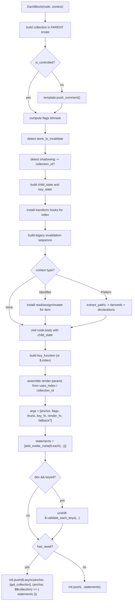

---

## `AwaitBlock`

### Emitted shape

```js
// {#await promise}P{:then value}T{:catch error}C{/await}
$.await(
	node_1,
	() => promise,
	($$anchor) => { /* P */ },
	($$anchor, value) => { /* T */ },
	($$anchor, error) => { /* C */ }
);
```

Any of the three branch functions can be `null`/absent. `pending` becomes `b.null` when missing, so the argument positions stay fixed.

### Visit order matters

The first thing the visitor does after pushing the anchor is build the expression:

> `// Visit {#await <expression>} first to ensure that scopes are in the correct order`

Visiting is stateful — it advances the scope cursor and can allocate names. Doing the expression before the `then`/`catch` bodies keeps generated identifiers in source order.

### `create_derived_block_argument`

`{:then value}` and `{:catch error}` bind a value that the runtime supplies as a **source**, not a plain value. The runtime passes `input_source` / `error_source` directly. So the compiler must make reads go through `$.get`.

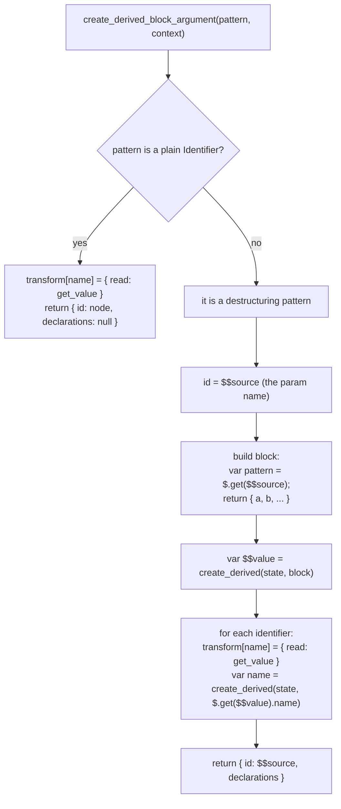

The two-level derived is deliberate. One derived runs the destructuring once and returns an object; then one small derived per name picks a field out of it. That way changing one field only invalidates the consumers of that field.

`create_derived` (from `compiler_transform_client_core`) picks `$.derived` in runes mode and `$.derived_safe_equal` in legacy mode, matching the equality semantics of each mode.

Note that `then` gets a fresh cloned `transform` map (`transform: { ...context.state.transform }`) so the `value` binding does not leak; `catch` clones only the state object.

### Data flow at runtime

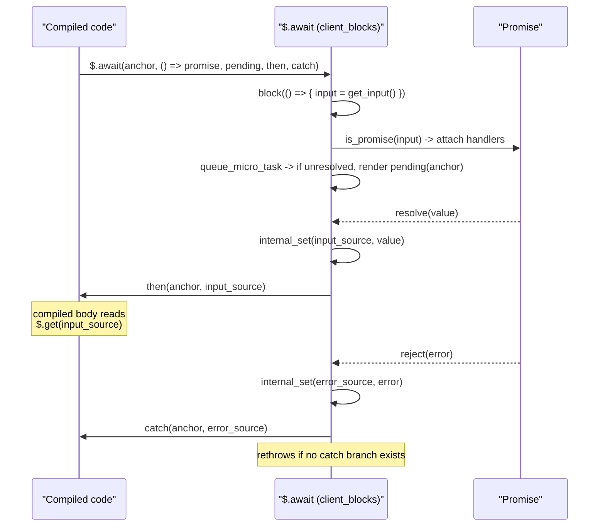

---

## `KeyBlock`

The smallest visitor. `{#key expr}...{/key}` destroys and recreates its contents whenever `expr` changes.

```js
// {#key id} <Child /> {/key}
$.key(node_1, () => id, ($$anchor) => { /* body */ });
```

With `await` in the key expression:

```js
$.async(node_1, [async () => id], (node_1, $$key) => {
	$.key(node_1, () => $.get($$key), ($$anchor) => { /* body */ });
});
```

Two small points:

- The key is always passed as a **thunk**, so the runtime can re-read it inside its own `block(...)` effect and track dependencies.
- The body is obtained by visiting `node.fragment` (not a `then`/`consequent`), and there is no fallback or alternate — a key block has exactly one branch.

At runtime `$.key` compares old and new keys with `not_equal` (runes) or `safe_not_equal` (legacy), and on change creates a new `branch(...)` effect and pauses the old one.

---

## Compile-time vs. runtime split

A useful way to read this module is: what is decided at build time, and what is deferred?

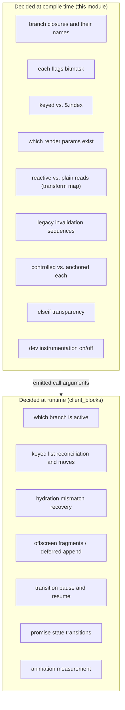

The pattern is consistent: the compiler resolves everything statically knowable into cheap constants and closure shapes, and the runtime handles only what depends on live values.

---

## Cross-cutting notes

### Shared dependencies at a glance

| Helper | Source module | Used by |
| --- | --- | --- |
| `build_expression` | [compiler_transform_client_core](compiler_transform_client_core.md) | all four |
| `add_svelte_meta` | [compiler_transform_client_core](compiler_transform_client_core.md) | all four |
| `get_value` (`$.get(x)`) | [compiler_transform_client_core](compiler_transform_client_core.md) | `EachBlock`, `AwaitBlock` |
| `create_derived` | [compiler_transform_client_core](compiler_transform_client_core.md) | `AwaitBlock` |
| `Template.push_comment` | [compiler_transform_client_template](compiler_transform_client_template.md) | all four (conditional in `EachBlock`) |
| `b.*` builders | [compiler_core](compiler_core.md) | all four |
| `extract_paths`, `object`, `extract_identifiers` | [compiler_core](compiler_core.md) | `EachBlock`, `AwaitBlock` |
| `EACH_*` constants | `packages/svelte/src/constants.js` | `EachBlock` |
| `dev` flag | [compiler_core](compiler_core.md) (`compiler/state.js`) | `EachBlock` (+ indirectly via `add_svelte_meta`) |

### Metadata consumed from phase 2

These visitors never re-derive information that analysis already computed. See [compiler_analyze_blocks](compiler_analyze_blocks.md).

| Metadata | Read by |
| --- | --- |
| `metadata.expression.has_await` | `IfBlock`, `EachBlock`, `AwaitBlock`, `KeyBlock` |
| `metadata.expression.dependencies` | `EachBlock` (flags) |
| `metadata.expression.references`, `has_call`, `has_member_expression`, `has_assignment` | via `build_expression` (legacy mode) |
| `metadata.keyed` | `EachBlock` |
| `metadata.index` | `EachBlock` |
| `metadata.contains_group_binding` | `EachBlock` |
| `metadata.is_controlled` | `EachBlock` (set during transform by `process_children`) |
| `metadata.transitive_deps` | `EachBlock` (legacy invalidation) |

### Runes vs. legacy mode

Mode changes real output in this module:

| Concern | Runes | Legacy |
| --- | --- | --- |
| Expression wrapping | plain visit | `deep_read_state` reads + `$.untrack(...)` |
| Each item | may skip source (`EACH_ITEM_IMMUTABLE`) | usually `EACH_ITEM_REACTIVE` |
| Array invalidation | not needed | `$.invalidate_inner_signals`, `$.invalidate_store` |
| Item reassignment | forbidden | `binding.reassigned` -> `collection[index]` |
| Derived factory | `$.derived` | `$.derived_safe_equal` |

### Symmetry with the server transform

Every block here has an SSR twin in [compiler_transform_server](compiler_transform_server.md) (`IfBlock.js`, `EachBlock.js`, `AwaitBlock.js`, `KeyBlock.js`). The server versions emit straight-line string appends with hydration markers instead of effects, and share no code with this module — only the AST and its metadata. The hydration markers they write (`HYDRATION_START_ELSE`, `HYDRATION_END`) are what the runtime blocks documented here read back during hydration.
