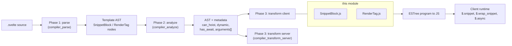
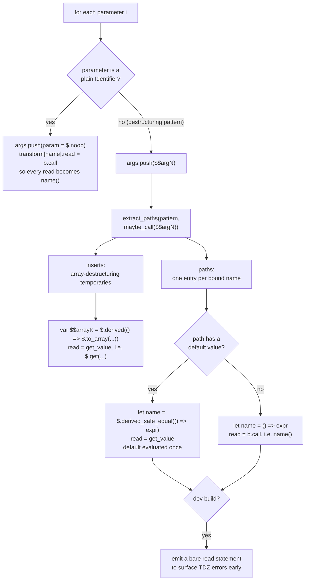
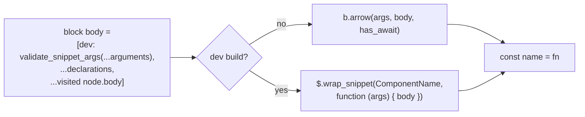
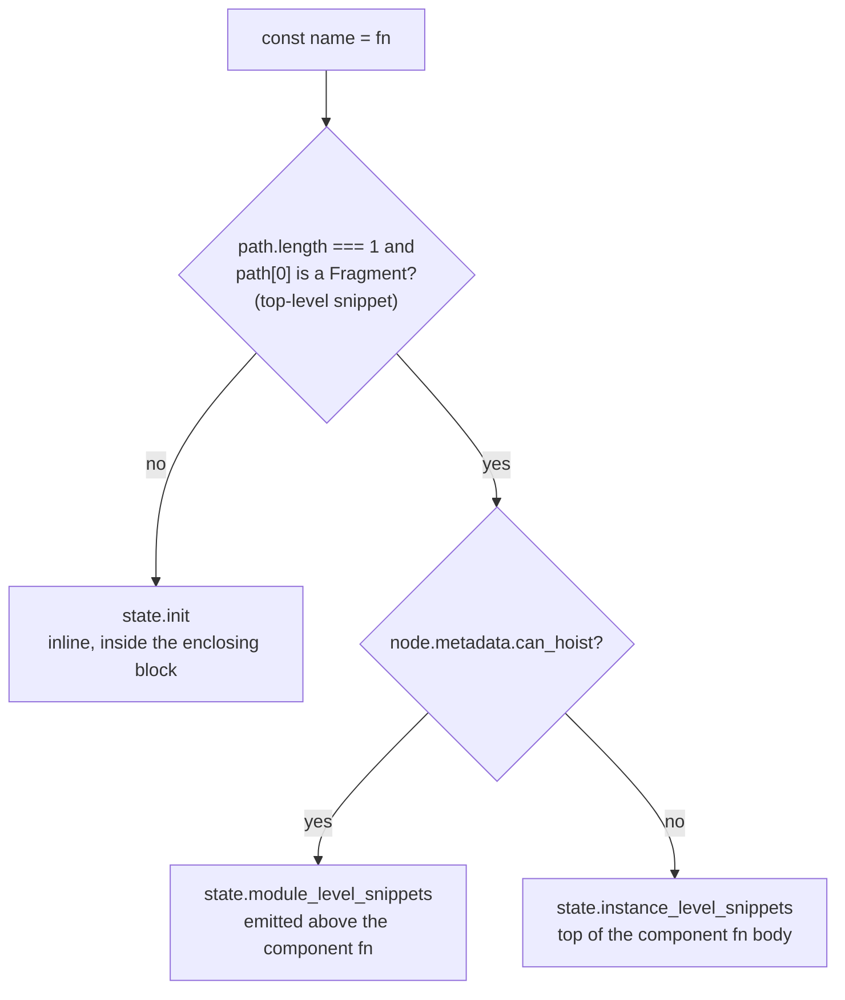
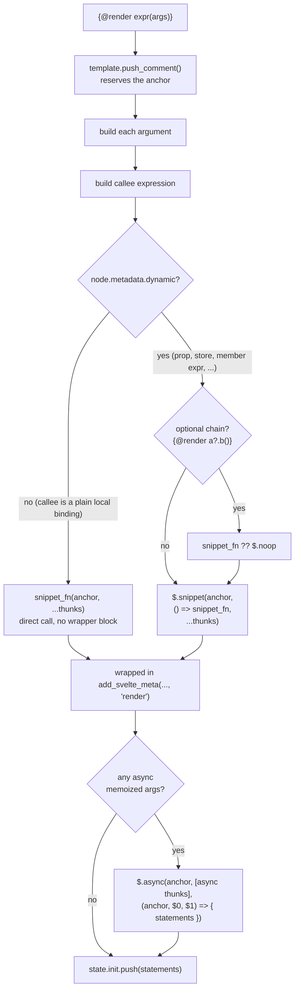
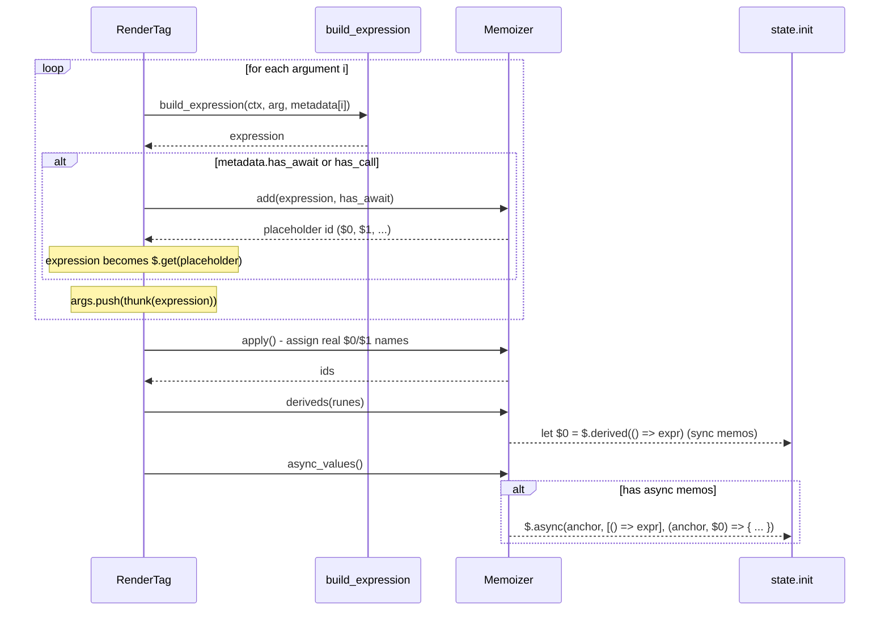
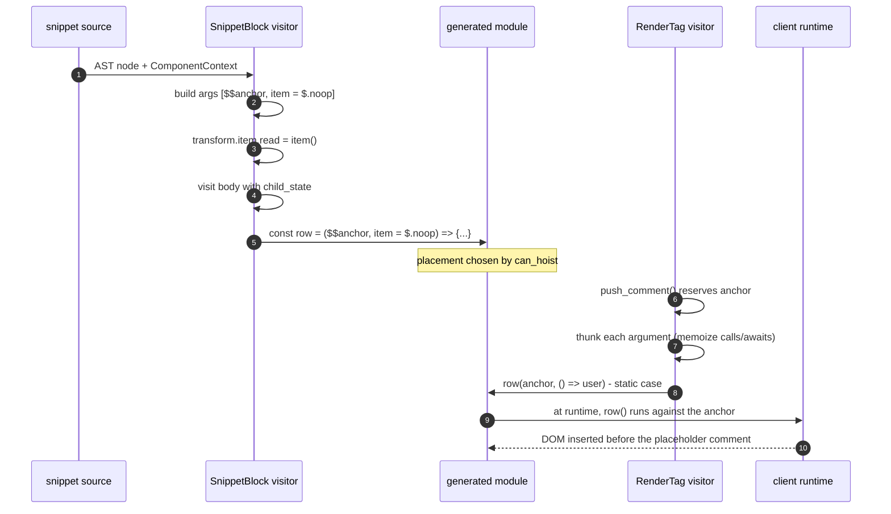
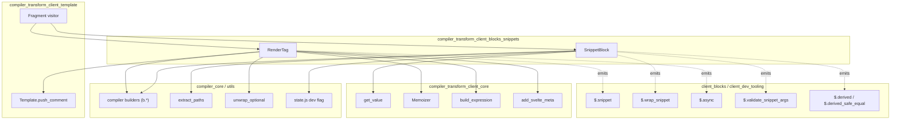

# compiler_transform_client_blocks_snippets

## Introduction

This module contains the two **client-side transform visitors** that implement Svelte 5 snippets:

| Template syntax | Visitor file | What it produces |
| --- | --- | --- |
| `{#snippet name(a, b)}...{/snippet}` | `SnippetBlock.js` | a `const name = ($$anchor, a, b) => {...}` function |
| `{@render name(x)}` | `RenderTag.js` | a call to that function, or `$.snippet(...)` |

Snippets are Svelte's answer to "reusable chunks of markup". A snippet **declares** a piece of template as a plain JavaScript function; a render tag **calls** it at a specific place in the DOM. This module is the pair of compiler visitors that make that translation happen for the browser build.

The two halves are deliberately asymmetric:

- `SnippetBlock` is a **declaration site**. It has to build a function, turn its parameters into lazily-read reactive getters, and decide *where* to place the declaration (module scope, instance scope, or inline).
- `RenderTag` is a **call site**. It has to build the argument thunks, memoize expensive/async arguments, and pick between a direct call (cheap, static) and a reactive `$.snippet(...)` block (needed when the snippet function itself can change).

---

## Where this module sits



Related docs:

- [compiler_transform_client](compiler_transform_client.md) — the whole client transform pass and its visitor table.
- [compiler_transform_client_blocks](compiler_transform_client_blocks.md) — the parent group (control flow, snippets, tags, boundary).
- [compiler_transform_client_blocks_control_flow](compiler_transform_client_blocks_control_flow.md) — sibling module for `{#if}`, `{#each}`, `{#await}`, `{#key}`.
- [compiler_transform_client_core](compiler_transform_client_core.md) — `Memoizer`, `build_expression`, `add_svelte_meta`, `get_value`, transform state.
- [compiler_transform_client_template](compiler_transform_client_template.md) — `Fragment`, the template builder and anchor nodes.
- [compiler_transform_client_components](compiler_transform_client_components.md) — components pass snippets as props (`children`, named snippets).
- [compiler_analyze_blocks](compiler_analyze_blocks.md) / [compiler_analyze](compiler_analyze.md) — where `can_hoist`, `dynamic` and expression metadata come from.
- [client_blocks](client_blocks.md) — the runtime: `snippet`, `wrap_snippet`, `createRawSnippet`, `async`.
- [compiler_transform_server](compiler_transform_server.md) — the SSR counterparts of the same two nodes.
- [client_dev_tooling](client_dev_tooling.md) — `validate_snippet_args`, dev component-context tracking.
- [compiler_core](compiler_core.md) — the `b.*` builder helpers used everywhere here.

---

## Part 1 — `SnippetBlock`

### What it emits

A snippet becomes an ordinary function whose **first parameter is an anchor node** and whose remaining parameters are the snippet's own parameters.

Source:

```svelte
{#snippet row(item, index)}
  <li>{index}: {item.name}</li>
{/snippet}
```

Production output (roughly):

```js
const row = ($$anchor, item = $.noop, index = $.noop) => {
  // ...template code, reading `item()` and `index()`
};
```

Two things stand out:

1. **Parameters are functions, not values.** The caller passes thunks. Inside the body, every read of `item` is rewritten to `item()`. This is what makes snippet arguments lazy and reactive — the snippet re-reads the argument whenever its own effect re-runs.
2. **The default is `$.noop`.** If a caller omits an argument, calling it is harmless and returns `undefined`.

### The parameter loop

The heart of `SnippetBlock` is a loop over `node.parameters`. Each parameter takes one of two paths.



Key details:

- **`transform` is cloned, not mutated.** `const transform = { ...context.state.transform }` — the parameter rewrites only apply inside the snippet body (`child_state`), never leaking out.
- **`b.maybe_call($$argN)`** is used as the source expression for destructuring, so an omitted argument does not blow up.
- **`$.derived_safe_equal` for defaults.** A default like `{#snippet s({ a = expensive() })}` must run `expensive()` at most once per change, not once per read — hence a derived rather than a raw thunk.
- **The eager dev read** (`b.stmt(transform[name].read(b.id(name)))`) exists so that "Cannot access `x` before initialization" surfaces at the top of the snippet body rather than deep inside a nested effect.

### Dev vs production function shape



Dev mode uses a **`function` expression, not an arrow**, purely so the body can reference `arguments` and hand the whole argument list to `$.validate_snippet_args`. `$.wrap_snippet` (see [client_blocks](client_blocks.md)) additionally restores the correct component context for ownership checks and marks the function so that accidentally stringifying it throws a helpful error.

`has_await` comes from `node.body.metadata.has_await` and is forwarded as the "is async" flag to the builder, producing an `async` function when the snippet body contains a top-level `await`.

### Placement — the three destinations

The last few lines of `SnippetBlock` decide *where* the `const` declaration goes. This is the module's most consequential decision.



| Destination | When | Why it matters |
| --- | --- | --- |
| `module_level_snippets` | Top-level snippet whose body references nothing component-local | Created **once per module**, shared by all instances. Cheapest option. |
| `instance_level_snippets` | Top-level snippet that does touch component state | Created once per instance, but placed **before** the `<script>` body so `<script>` code can reference the snippet by name. |
| `init` | Any nested snippet (inside `{#each}`, a component, etc.) | Must be recreated per block instance because it closes over block-local variables. |

`can_hoist` is computed in phase 2 (see `SnippetBlock` in [compiler_analyze_blocks](compiler_analyze_blocks.md)): it walks the snippet's scope references and returns `false` as soon as it finds a binding declared at non-zero function depth outside the snippet. Snippets referencing other hoistable snippets stay hoistable, via a `visited` set that also protects against recursion.

The consumption side lives in `transform-client.js`: `module_level_snippets` are spliced in after imports at program top level, `instance_level_snippets` are placed at the start of the component function body (and inside the `$.async_body` wrapper when the instance script itself contains `await`).

---

## Part 2 — `RenderTag`

### What it emits

`RenderTag` first calls `context.state.template.push_comment()`, which reserves a `<!>` placeholder in the template HTML. That placeholder becomes `context.state.node` — the anchor the snippet will render into.

It then produces one of two shapes.



**Why two shapes?** `node.metadata.dynamic` is set in phase 2 to `binding?.kind !== 'normal'`. If the callee is an ordinary `const` in the component — typically a snippet declared in the same file — it can never change, so the compiler emits a plain call and skips the reactive block entirely. Anything else (a snippet passed as a prop, a member expression, a conditional) can change between renders, so `$.snippet` is needed: it wraps the call in a `block(...)` effect that tears down the old snippet's branch and mounts the new one whenever the function identity changes.

`b.call` vs `b.maybe_call` mirrors the source: `{@render foo()}` compiles to `foo(anchor, ...)`, while `{@render foo?.()}` compiles to `foo?.(anchor, ...)`.

### Arguments and the `Memoizer`

Every argument becomes a thunk (`b.thunk(expression)`), matching the getter-shaped parameters that `SnippetBlock` produced. But a naive thunk would re-evaluate the expression on every read, so arguments that call functions or await are hoisted into a memo first.



- **Sync memos** become `let $N = $.derived(() => expr)` (or `$.derived_safe_equal` in non-runes mode), and the argument thunk reads `$.get($N)`.
- **Async memos** are collected separately. If any exist, the whole set of statements is deferred into `$.async(anchor, [thunks], (anchor, $0, ...) => {...})`, which registers a pending count with the nearest `<svelte:boundary>` and only builds the block once every promise settles. See [compiler_transform_client_blocks_boundary](compiler_transform_client_blocks_boundary.md) and [client_blocks](client_blocks.md).
- `Memoizer.apply()` must be called **after** all `add()` calls, since it is what actually names the placeholder identifiers (sync memos first, then async).

`build_expression` (from [compiler_transform_client_core](compiler_transform_client_core.md)) is what visits the argument sub-tree; in legacy (non-runes) mode it also prepends a dependency-reading sequence so coarse-grained reactivity still works.

### Dev metadata

Both branches wrap the emitted call in `add_svelte_meta(expression, node, 'render')`. In production this is an identity wrapper (`b.stmt(expression)`); in dev it becomes `$.add_svelte_meta(() => call, 'render', ComponentName, line, column)`, which feeds the component tree shown in devtools and in error stacks.

---

## How the two halves fit together



The contract between the two visitors is small and strict:

| Contract point | `SnippetBlock` side | `RenderTag` side |
| --- | --- | --- |
| First parameter | `$$anchor` | `context.state.node` (the `<!>` comment) |
| Remaining parameters | getter functions, defaulting to `$.noop` | `b.thunk(expression)` per argument |
| Identity stability | a `const`, so identity is stable | static path relies on that; dynamic path does not assume it |
| Async | `has_await` produces an async function | async args produce an `$.async` wrapper |

---

## Component interaction map



Both visitors are registered in the client visitor table and reached through the generic `Fragment` walk; neither is called directly.

---

## Transform-state fields this module touches

| Field | Used by | Purpose |
| --- | --- | --- |
| `state.transform` | `SnippetBlock` | Per-name read/assign rewrites. Cloned, extended with parameter getters, passed down as `child_state`. |
| `state.scope.generate` | `SnippetBlock` | Unique `$$arrayN` names for array-destructuring temporaries. |
| `state.init` | both | Statements emitted into the current block. |
| `state.module_level_snippets` | `SnippetBlock` | Hoisted, per-module snippet declarations. |
| `state.instance_level_snippets` | `SnippetBlock` | Per-instance snippet declarations, placed before the instance script. |
| `state.node` | `RenderTag` | The anchor comment node for the render tag. |
| `state.template` | `RenderTag` | The template builder; `push_comment()` reserves the anchor. |
| `state.analysis.name` | `SnippetBlock` | Component name, passed to `$.wrap_snippet` in dev. |
| `state.analysis.runes` | `RenderTag` | Chooses `$.derived` vs `$.derived_safe_equal` for memos. |

See [compiler_transform_client_core_state](compiler_transform_client_core_state.md) for the full `ComponentClientTransformState` shape.

---

## Comparison with the server transform

The SSR versions of the same two nodes ([compiler_transform_server](compiler_transform_server.md)) are dramatically simpler, which is a useful way to see what the client complexity actually buys.

| Concern | Client | Server |
| --- | --- | --- |
| Function shape | `($$anchor, a = $.noop) => {}` — arrow, getter params | `function name($$payload, a) {}` — declaration, plain params |
| Parameters | rewritten into lazy getters / deriveds | used verbatim; no reactivity needed |
| Placement | module / instance / inline, driven by `can_hoist` | `state.hoisted` or `state.init` |
| Render tag | direct call **or** `$.snippet(...)` reactive block | always a direct call with `$$payload` |
| Async args | `$.async` plus a boundary pending count | not applicable |
| Dev checks | `$.validate_snippet_args(...arguments)`, `$.wrap_snippet` | `$.validate_snippet_args($$payload)`, `$.prevent_snippet_stringification` |

The server has no anchors, no effects, and no identity tracking — the payload is a string buffer, so calling the function once in place is enough.

---

## Gotchas and invariants

- **`can_hoist` is only consulted for top-level snippets.** The visitor re-checks `context.path.length === 1 && path[0].type === 'Fragment'` even though the analyzer already gated `can_hoist` on the same condition. Nested snippets always land in `init`.
- **`Memoizer.apply()` before `deriveds()`.** The placeholder ids are literally named `'#'` until `apply()` runs; calling `deriveds()` first would emit broken identifiers.
- **`memoizer.async_values()` is called twice** in `RenderTag` (once to test, once to build). It is a pure builder over the collected list, so this is safe, just slightly redundant.
- **Rest parameters are rejected earlier.** `{#snippet s(...rest)}` is an error raised by the phase-2 analyzer, so the transform never sees a `RestElement` at the top level of `node.parameters` (rest *inside* a destructuring pattern is fine and handled by `extract_paths`).
- **A missing parameter is skipped.** `if (!argument) continue` tolerates holes in the parameter list, but the positional `$$argN` alias still uses the original index `i`, keeping argument positions aligned.
- **The `// TODO hoist where possible` comment** at the top of `SnippetBlock` refers to hoisting nested snippets, which is not attempted today.
