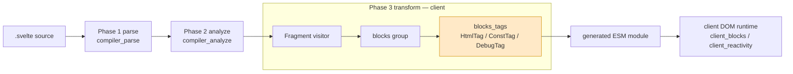
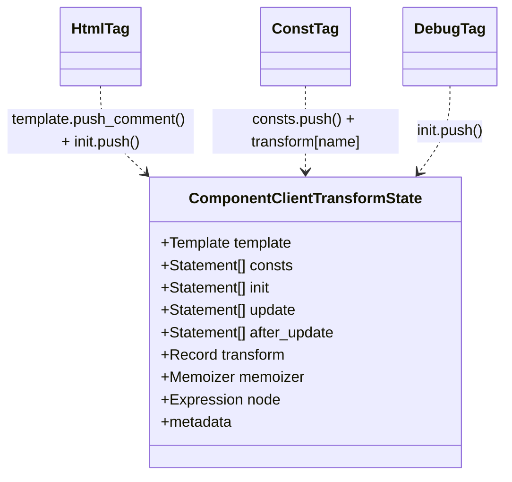
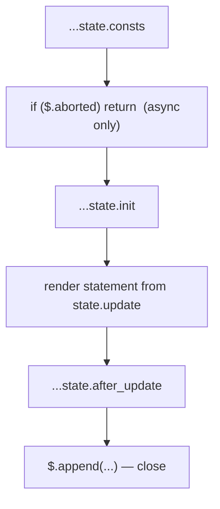
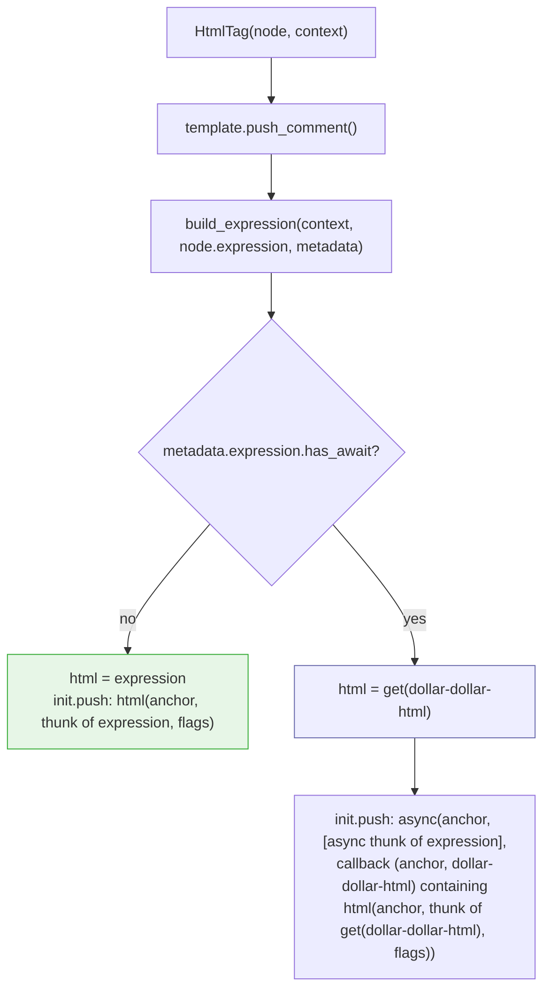
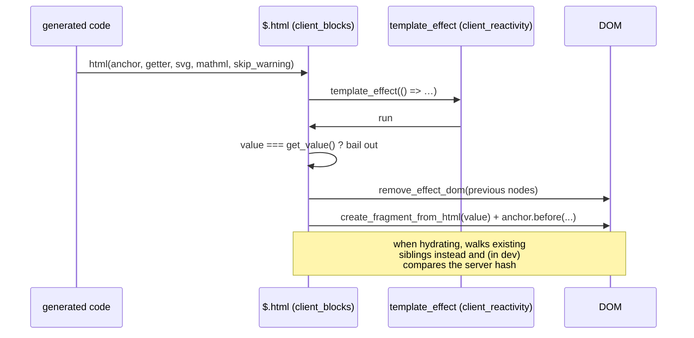
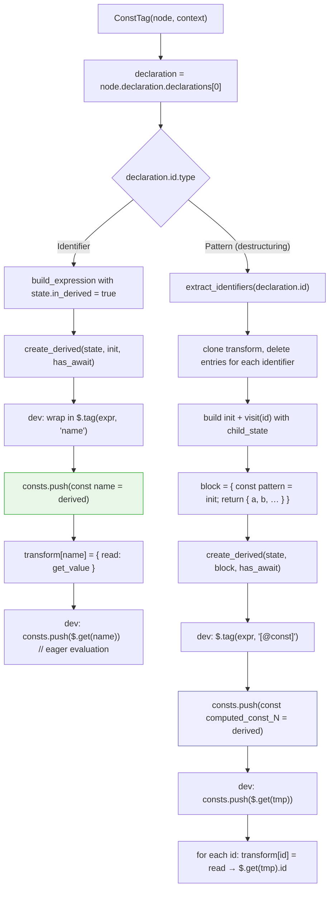
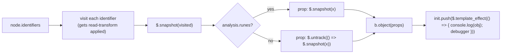
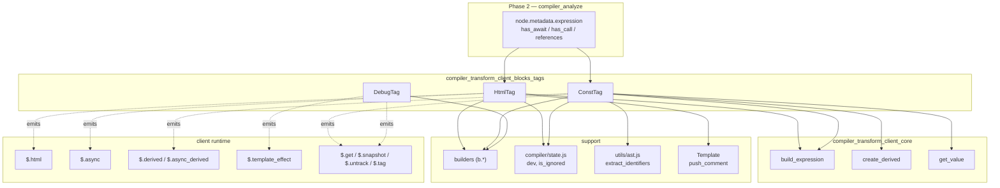
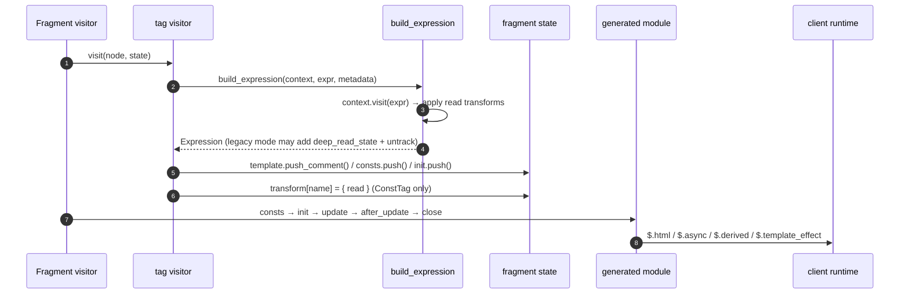

# compiler_transform_client_blocks_tags

## Introduction

This module holds three small but very different template-tag visitors used by Svelte's **client-side code generator** (phase 3, "transform client"):

| Tag in `.svelte` source | Visitor | What it becomes in the output |
| --- | --- | --- |
| `{@html expr}` | `HtmlTag` | a `$.html(anchor, () => expr, …)` call |
| `{@const x = expr}` | `ConstTag` | a `$.derived(() => expr)` binding plus a read-transform |
| `{@debug a, b}` | `DebugTag` | a `$.template_effect` that logs and hits `debugger` |

They are grouped together because they are all **leaf tags**: they have no children and no fragment of their own. Each one takes an AST node, builds a few JavaScript statements, and pushes them into the right slot of the current fragment's transform state. Nothing here recurses into a nested template the way `IfBlock` or `EachBlock` do (see [compiler_transform_client_blocks_control_flow](compiler_transform_client_blocks_control_flow.md)).

The three visitors are siblings of the snippet visitors ([compiler_transform_client_blocks_snippets](compiler_transform_client_blocks_snippets.md)) and the boundary visitor ([compiler_transform_client_blocks_boundary](compiler_transform_client_blocks_boundary.md)) inside the wider [compiler_transform_client_blocks](compiler_transform_client_blocks.md) group.

---

## 1. Where this module sits



Phase 2 has already done the hard thinking. By the time these visitors run:

* every tag has `node.metadata.expression` filled in (`has_await`, `has_call`, `references`, …) — see [compiler_analyze_expression_metadata](compiler_analyze_expression_metadata.md);
* placement rules are already validated (e.g. `{@const}` may only sit directly inside a block or a slot-bearing element) — see [compiler_analyze_blocks](compiler_analyze_blocks.md).

So these visitors are pure **code emitters**. They do not report errors.

---

## 2. The shared contract

All three functions have the same shape:

```js
export function XxxTag(node, context) { … }   // returns nothing
```

They communicate only by **mutating `context.state`**. The state object is created per fragment by the `Fragment` visitor (see [compiler_transform_client_template](compiler_transform_client_template.md)) and typed as `ComponentClientTransformState` (see [compiler_transform_client_core_state](compiler_transform_client_core_state.md)).

### State slots these visitors write to



| Slot | Meaning | Written by |
| --- | --- | --- |
| `template` | the static HTML/tree skeleton that gets cloned at runtime | `HtmlTag` (a placeholder comment) |
| `consts` | statements emitted **before** everything else in the fragment body | `ConstTag` |
| `init` | one-time setup statements | `HtmlTag`, `DebugTag` |
| `transform[name]` | how later reads of an identifier are rewritten | `ConstTag` |

The `Fragment` visitor then concatenates the slots in a fixed order:



That ordering is the reason `ConstTag` uses `consts` and not `init`: a `{@const}` must be visible to every sibling expression, including ones that are emitted earlier in the traversal.

---

## 3. `HtmlTag` — `{@html expr}`

### 3.1 What it emits

Two things, in two different slots:

1. **A comment into the template.** `context.state.template.push_comment()` reserves an anchor node in the cloned DOM. At runtime the raw HTML is inserted *before* that comment.
2. **A `$.html(...)` statement into `init`.**

```js
$.html(anchor, () => value, /* svg */ true?, /* mathml */ true?, /* skip_warning */ true?)
```

### 3.2 The five arguments

| Argument | Source in the visitor | Purpose |
| --- | --- | --- |
| `context.state.node` | current anchor expression | where to insert |
| `b.thunk(html)` | the visited expression | re-read on every update |
| `is_svg` | `state.metadata.namespace === 'svg'` | wrap in `<svg>` before parsing |
| `is_mathml` | `state.metadata.namespace === 'mathml'` | wrap in `<math>` before parsing |
| `skip_warning` | `is_ignored(node, 'hydration_html_changed')` | honour `<!-- svelte-ignore -->` |

The namespace flags matter because raw HTML is parsed with `innerHTML`-style semantics; SVG and MathML fragments only parse correctly inside the right parent element. The runtime unwraps the temporary wrapper again (see `html` in [client_blocks](client_blocks.md)).

`is_ignored` comes from [compiler_core](compiler_core.md) (`compiler/state.js`) and is **dev-only** — in production builds it always returns `false`, so the extra argument disappears.

### 3.3 Sync vs. async

This is the only real branching in the visitor. `node.metadata.expression.has_await` tells us whether the expression contains an `await` (async mode, see `AwaitExpression` in [compiler_transform_client_javascript](compiler_transform_client_javascript.md)).

> In the diagram below, runtime helpers are written without their `$.` prefix
> (`html` means `$.html`, `get` means `$.get`), and `$$html` is spelled out.
> The literal generated code follows the diagram.



In real generated code the async form is:

```js
$.async(
  anchor,
  [async () => expr],
  (anchor, $$html) => {
    $.html(anchor, () => $.get($$html), is_svg, is_mathml, skip_warning);
  }
);
```

In the async case the awaited value is first resolved by `$.async` (see `async` in [client_blocks](client_blocks.md)), which:

* bumps the nearest boundary's pending count (so `<svelte:boundary>` can show a pending state),
* flattens the promise into a reactive `Value`,
* then calls the callback with a fresh anchor plus the derived, which the generated code reads through `$.get($$html)`.

Note the small asymmetry: the *inner* `$.html` thunk reads `$.get($$html)`, while the *outer* `$.async` argument thunk is the original expression built as an async thunk (`b.thunk(expression, true)`).

### 3.4 Why `init` and not `update`

The source comment is explicit: the statement is pushed into `init` **so that bindings run afterwards**. If `$.html` ran after bindings, a re-run triggered by a binding could clobber freshly hydrated DOM. Ordering here is a correctness requirement, not a style choice.

### 3.5 Runtime pairing



---

## 4. `ConstTag` — `{@const x = expr}`

`ConstTag` is the most involved of the three because a `{@const}` is really a **fragment-scoped `$derived`**. It has two code paths depending on the declaration's left-hand side.



### 4.1 Simple identifier path

For `{@const doubled = count * 2}`:

```js
// consts
const doubled = $.derived(() => count * 2);
// dev only, after the declaration
$.get(doubled);
```

and `state.transform.doubled = { read: get_value }`, so every later `doubled` in the same fragment is rewritten to `$.get(doubled)` by the `Identifier` visitor ([compiler_transform_client_javascript](compiler_transform_client_javascript.md)).

`create_derived` (from [compiler_transform_client_core_bindings](compiler_transform_client_core_bindings.md)) picks the right runtime helper:

| Situation | Emitted |
| --- | --- |
| runes mode, sync | `$.derived(() => …)` |
| legacy mode, sync | `$.derived_safe_equal(() => …)` |
| `has_await` | `(await $.save($.async_derived(async () => …)))()` |

### 4.2 Destructuring path

For `{@const { a, b } = obj}` a single derived cannot hold two values, so the visitor:

1. collects the bound names with `extract_identifiers`;
2. builds a **child state** whose `transform` map has those names *deleted* — inside the derived body they are plain locals, not signals, so they must not be rewritten to `$.get(...)`;
3. wraps the destructuring in a block that returns an object of all bound names;
4. stores that object in one generated temp (`computed_const`, name allocated via `state.scope.generate`);
5. registers a read-transform per name that projects out of the temp.

```js
const computed_const = $.derived(() => {
  const { a, b } = obj;
  return { a, b };
});
// later `a` in the template becomes:
$.get(computed_const).a
```

A `TODO` in the source notes the un-taken optimisation: for a plain `{ x } = y` there is no need to destructure and rebuild an object.

### 4.3 Dev-mode extras

Two dev-only behaviours, both worth knowing when reading generated output:

* **`$.tag(...)`** attaches a human-readable label for the dev tracing tools (`tag` in [client_dev_tooling](client_dev_tooling.md)). The label is the variable name, or the literal `'[@const]'` for the destructured case.
* **Eager `$.get(...)`** is pushed right after the declaration. Deriveds are lazy, so without this a *"Cannot access x before initialization"* mistake would stay silent until something happened to read the value. Forcing a read makes the error surface deterministically.

### 4.4 `in_derived`

`build_expression` is called with `state.in_derived = true`. Downstream visitors use this flag to decide how to treat state reads and `await` inside a derived body. Details live in [compiler_transform_client_core_expressions](compiler_transform_client_core_expressions.md).

---

## 5. `DebugTag` — `{@debug a, b}`

The simplest visitor. It builds an object literal from `node.identifiers`, logs it, and breaks:

```js
$.template_effect(() => {
  console.log({ a: $.snapshot(a), b: $.snapshot(b) });
  debugger;
});
```



Three details:

* **`$.snapshot`** unwraps proxies so the console shows plain data instead of `Proxy` internals.
* **`$.untrack` in legacy mode.** In runes mode the reads inside the effect are the intended dependencies. In legacy mode the tag must not add dependencies of its own, so each read is untracked; the effect is then driven by whatever legacy invalidation already covers.
* **`b.debugger`** emits a real `debugger` statement, which is what makes `{@debug}` pause devtools.

Because the whole thing lives in a `$.template_effect`, the log re-fires whenever the tracked values change.

---

## 6. Component interaction



### Direct dependencies

| Import | From | Used by |
| --- | --- | --- |
| `build_expression` | `visitors/shared/utils.js` — [core_expressions](compiler_transform_client_core_expressions.md) | `HtmlTag`, `ConstTag` |
| `create_derived` | `client/utils.js` — [core_bindings](compiler_transform_client_core_bindings.md) | `ConstTag` |
| `get_value` | `visitors/shared/declarations.js` — [core_state](compiler_transform_client_core_state.md) | `ConstTag` |
| `extract_identifiers` | `compiler/utils/ast.js` | `ConstTag` |
| `dev`, `is_ignored` | `compiler/state.js` — [compiler_core](compiler_core.md) | `ConstTag`, `HtmlTag` |
| `* as b` | `compiler/utils/builders.js` — [compiler_core](compiler_core.md) | all three |
| `Template#push_comment` | `transform-template/template.js` — [template group](compiler_transform_client_template.md) | `HtmlTag` |

### Who calls these visitors

All three are registered in the client visitor table (`3-transform/client/transform-client.js`) and reached through `context.visit(...)` while `process_children` walks a fragment's children — see [compiler_transform_client_template](compiler_transform_client_template.md).

---

## 7. Data flow: from source text to DOM



The legacy-mode behaviour inside `build_expression` is easy to miss and shows up in generated output: for non-runes components whose expression contains a call, member expression, or assignment, the expression is wrapped in a sequence that eagerly `deep_read_state`s the statically known dependencies and then `$.untrack`s the real value. That reproduces Svelte 4's coarse-grained reactivity.

---

## 8. Client vs. server output

The same three tags are handled by the server generator ([compiler_transform_server](compiler_transform_server.md)). Comparing them shows how much of the complexity here is purely about *updates over time*:

| Tag | Client | Server |
| --- | --- | --- |
| `{@html}` | anchor comment + `$.html(anchor, thunk, svg, mathml, skip)` inside a reactive effect; async path via `$.async` | one `$.html(expression)` pushed straight onto the string template |
| `{@const}` | `$.derived` + read-transform so later reads become `$.get(...)` | a plain `const id = init` in `init` |
| `{@debug}` | `$.template_effect(console.log + debugger)` | not emitted |

The server has no reactivity graph and renders once, so no deriveds, no anchors, and no re-run ordering constraints.

---

## 9. Gotchas and invariants

| Invariant | Why it matters |
| --- | --- |
| `HtmlTag` pushes the anchor comment **before** anything else | the template skeleton and the `init` statements are built in traversal order; the comment must land at the right position in the cloned tree |
| `$.html` goes in `init`, never `update` | bindings must run after it, otherwise a binding-triggered re-run can overwrite hydrated DOM |
| `ConstTag` writes to `consts`, not `init` | `consts` are emitted first, so a `{@const}` is available to every sibling regardless of traversal order |
| In the destructuring path, bound names are **deleted** from the child `transform` map | inside the derived body they are ordinary locals; rewriting them to `$.get(...)` would be wrong |
| `transform[name]` is set on the **parent** state, not the child state | the read-transform must apply to siblings, not to the derived body |
| Dev-only eager `$.get(...)` | forces lazy deriveds to evaluate so use-before-initialization errors are not swallowed |
| Legacy mode `{@debug}` untracks its reads | the tag must observe, not create dependencies |
| `is_ignored` is dev-gated | the fifth `$.html` argument silently vanishes in production output |
| `<svelte:boundary>` swaps the `consts` array | `SvelteBoundary` passes its own array as `consts` when visiting children, so `{@const}` declarations land in the boundary's scope — see [blocks_boundary](compiler_transform_client_blocks_boundary.md) |

---

## 10. Extending or debugging this module

* **Adding a new leaf tag.** Copy the shape: read `node.metadata.expression`, call `build_expression`, push into the right slot, register the visitor in `transform-client.js`. Do validation in phase 2, not here.
* **Wrong value at runtime?** Check which slot the statement landed in and where the `Fragment` visitor places that slot. Ordering bugs in this area almost always trace back to `consts` vs `init` vs `update`.
* **Async surprises?** `has_await` is decided in phase 2. If a `{@html}` or `{@const}` is unexpectedly wrapped in `$.async` / `$.async_derived`, look at `AwaitExpression` in [compiler_analyze_expression_metadata](compiler_analyze_expression_metadata.md).
* **Reading generated code.** `$.derived_safe_equal` instead of `$.derived` means the component is in legacy mode; a `deep_read_state` sequence in a thunk means the same thing.

## Related documentation

* [compiler_transform_client](compiler_transform_client.md) — the whole client generator
* [compiler_transform_client_blocks](compiler_transform_client_blocks.md) — parent group
* [compiler_transform_client_blocks_control_flow](compiler_transform_client_blocks_control_flow.md) — `if` / `each` / `await` / `key`
* [compiler_transform_client_blocks_snippets](compiler_transform_client_blocks_snippets.md) — `{#snippet}` / `{@render}`
* [compiler_transform_client_blocks_boundary](compiler_transform_client_blocks_boundary.md) — `<svelte:boundary>`
* [compiler_transform_client_core](compiler_transform_client_core.md) — shared expression / state helpers
* [compiler_transform_client_template](compiler_transform_client_template.md) — `Fragment`, `Template`, `process_children`
* [client_blocks](client_blocks.md) — the `html` and `async` runtime helpers
* [client_reactivity](client_reactivity.md) — deriveds, effects, `template_effect`
* [client_dev_tooling](client_dev_tooling.md) — `$.tag`, tracing, dev logging
* [compiler_transform_server](compiler_transform_server.md) — the SSR counterparts
* [compiler_ast_types](compiler_ast_types.md) — `AST.HtmlTag`, `AST.ConstTag`, `AST.DebugTag`
