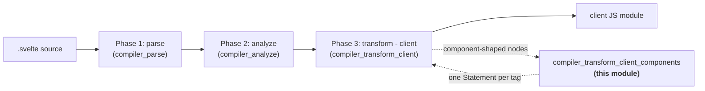
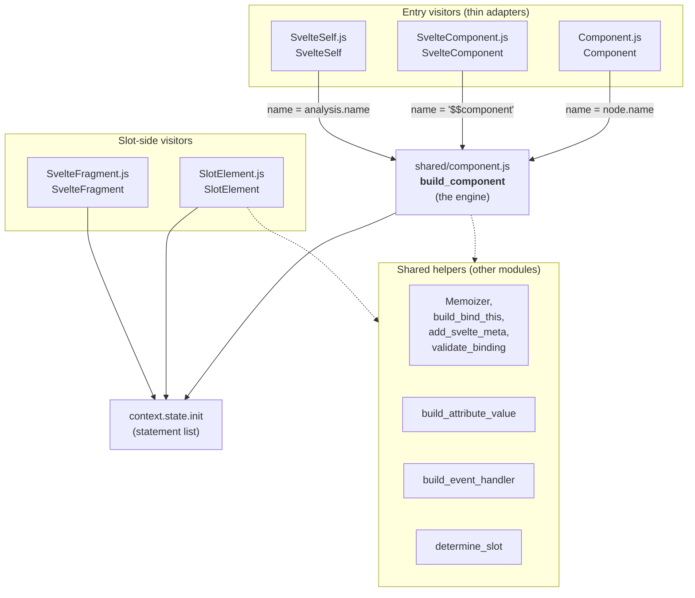
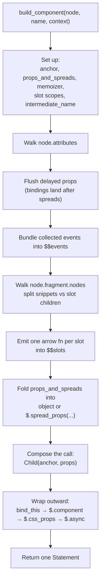
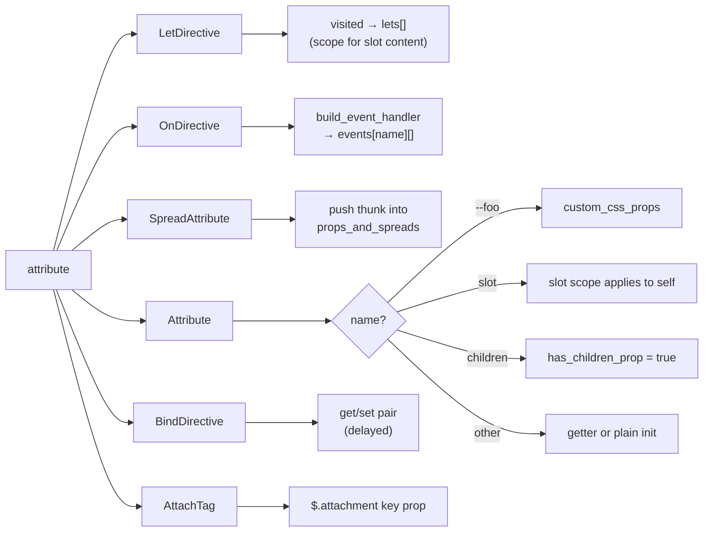
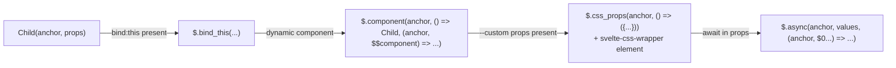
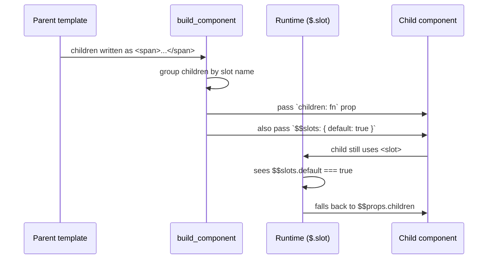
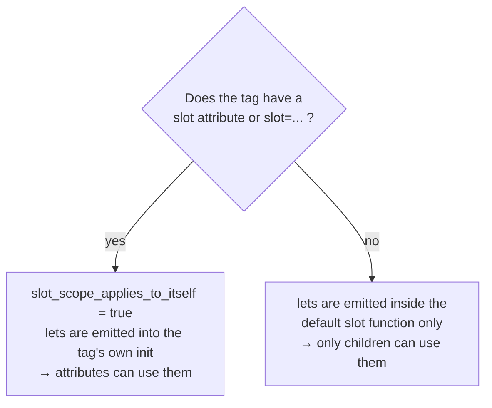

# compiler_transform_client_components

## What this module does

This module is the part of the Svelte client compiler that turns **component tags** in a
`.svelte` template into JavaScript that runs in the browser.

A template author writes things like this:

```svelte
<Button label="Save" bind:value={x} on:click={save} --accent="red">
  <span slot="icon">💾</span>
</Button>

<svelte:component this={Dynamic} />
<svelte:self depth={depth - 1} />

<slot name="icon">fallback icon</slot>
<svelte:fragment let:item>{item.name}</svelte:fragment>
```

None of that is HTML. There is no DOM element to create. Instead each of these tags becomes a
**function call** that the client runtime executes. This module writes those calls.

Its job in one sentence: **take a component-shaped AST node, work out its props, bindings,
events, slots and snippets, and emit a single statement that instantiates the child component at
an anchor node.**

### Two directions of the same problem

The module handles both sides of the component boundary, which is why slot tags live here too:

| Direction | Meaning | Tags handled |
| --- | --- | --- |
| **Consuming** (parent side) | "I am rendering a child component and passing things down." | `<Button />`, `<svelte:component>`, `<svelte:self>` |
| **Providing** (child side) | "I am the child, and I want to render what my parent gave me." | `<slot>`, `<svelte:fragment>` |

Both directions speak the same protocol — props objects, `$$slots`, `$$props`, `$$slotProps` —
so keeping them together means the two halves cannot drift apart.

## Where it sits in the compiler

The module is a leaf of the client transform phase (phase 3). It never parses and never analyses;
it only reads AST nodes that earlier phases already validated and annotated with metadata.



The transform phase walks the AST with a visitor table. When the walker reaches a node whose
`type` is `Component`, `SvelteComponent`, `SvelteSelf`, `SlotElement` or `SvelteFragment`, it
calls the matching function in this module. See
[compiler_transform_client](compiler_transform_client.md) for the walker and the visitor table,
and [compiler_transform_client_core](compiler_transform_client_core.md) for the shared transform
state those visitors mutate.

## Architecture

The shape is deliberately simple: **four thin entry visitors and one thick shared builder.**



Why the split matters: the three consuming tags differ **only** in how the child component is
named. Everything else — prop collection, binding get/set pairs, slot grouping, snippet hoisting,
CSS custom properties, async memoization — is identical, so it lives once in `build_component`.

| Tag | Name passed to `build_component` | Why |
| --- | --- | --- |
| `<Button />` | `node.name` → `Button` | The identifier is in scope from an import or declaration. |
| `<svelte:component this={X} />` | `'$$component'` | The component is an expression, so it is resolved at runtime into a placeholder binding. |
| `<svelte:self />` | `context.state.analysis.name` | Refers to the component currently being compiled. |

## The build pipeline inside `build_component`

`build_component` is a single long pass over the tag's attributes, then a second pass over its
children. Understanding the order is the key to understanding the module.



### Attribute dispatch

Every attribute type takes a different route:



### Reactivity: getters, not values

A prop that can change is emitted as a **getter** so the child re-reads it on every access:

```js
// label={name}          (reactive)   →  { get label() { return name; } }
// label="Save"          (static)     →  { label: 'Save' }
```

When the expression is more than a bare identifier or member access — for example
`active={i === index}` — the builder routes it through the shared `Memoizer` so it becomes a
`$.derived`. This stops the child from over-firing when an unrelated dependency changes.
`await`-containing expressions go to the memoizer's async list instead and force the whole
statement to be wrapped in `$.async(...)`.

### Bindings are ordered last on purpose

`bind:value={x}` becomes a getter **and** a setter pair. Those pushes are *delayed* until all
other attributes are processed, because a later spread would otherwise overwrite them:

```js
{
  ...spread,
  get value() { return x; },
  set value($$value) { x = $$value; }
}
```

`bind:this` is special — it is pulled out of the props object entirely and instead wraps the whole
instantiation call via `build_bind_this`.

### Outward wrapping

The final call is built inside-out. Each optional feature wraps the previous result:



Each wrapper is conditional, so a plain `<Button />` collapses all the way down to one call.

## Sub-modules

Every file in this module is covered by exactly one sub-module document below.

| Sub-module | Files covered | Responsibility |
| --- | --- | --- |
| [compiler_transform_client_components_builder](compiler_transform_client_components_builder.md) | `visitors/shared/component.js` | `build_component` — the shared engine that turns any component tag into one instantiation statement. Covers prop collection, binding get/set pairs, event bundling, slot and snippet serialization, CSS custom properties, and the outward wrapping order. |
| [compiler_transform_client_components_entries](compiler_transform_client_components_entries.md) | `visitors/Component.js`, `visitors/SvelteComponent.js`, `visitors/SvelteSelf.js` | The three consuming visitors. Each is a thin adapter that decides how the child component is named, then delegates to the builder. |
| [compiler_transform_client_components_slots](compiler_transform_client_components_slots.md) | `visitors/SlotElement.js`, `visitors/SvelteFragment.js` | The child-side half of the protocol: `<slot>` reading from `$$slots` / `$$props` with fallback content, and `<svelte:fragment>` as a transparent `let:`-scoping wrapper. |

Reading order: start with
[compiler_transform_client_components_entries](compiler_transform_client_components_entries.md)
for the three one-line entry points, then
[compiler_transform_client_components_builder](compiler_transform_client_components_builder.md)
for the bulk of the logic, then
[compiler_transform_client_components_slots](compiler_transform_client_components_slots.md)
for the receiving side.

## Generated code, end to end

Input:

```svelte
<Button label={caption} bind:value={x} on:click={save}>
  <span>Save</span>
</Button>
```

Output shape (simplified):

```js
Button($$anchor, {
  get label() { return caption; },
  get value() { return x; },
  set value($$value) { x = $$value; },
  $$events: { click: save },
  children: ($$anchor, $$slotProps) => { /* <span>Save</span> */ }
});
```

Input:

```svelte
<slot name="icon" {size}>fallback</slot>
```

Output shape:

```js
$.slot($$anchor, $$props, 'icon', { get size() { return size; } },
  ($$anchor) => { /* fallback */ });
```

## Snippets, slots and the interop bridge

Svelte 5 prefers snippets; Svelte 4 used slots. This module keeps both working at once, and that
bridging logic is one of its least obvious responsibilities.



The rules the builder applies:

- A `SnippetBlock` directly inside a component is **hoisted** into a declaration block first, so
  it can be referenced as a prop without name conflicts. It is then passed both as a named prop
  and as `$$slots.<name>: true`.
- Default children with no `let:` directives become a plain `children` prop, plus
  `$$slots.default: true` so a child that still uses `<slot>` keeps working.
- Default children **with** `let:` directives cannot be a snippet (snippets do not receive slot
  props the same way), so they go into `$$slots.default` and `children` is set to
  `$.invalid_default_snippet`, which errors if called.
- In legacy (non-runes) mode, any `bind:` on the tag also adds `$$legacy: true`.

## Slot scoping

`let:` directives create bindings that child content can read from `$$slotProps`. Which scope they
apply to depends on whether the tag itself sits in a named slot:



Each named slot gets its own pre-computed scope from `node.metadata.scopes[slot_name]`, produced
during analysis. The builder just looks it up.

## Development-mode extras

When `dev` is on, the module adds guard rails. All of them are compiled out in production.

| Feature | What it emits | Guards against |
| --- | --- | --- |
| Ownership validation | `$$ownership_validator.binding(...)` | Binding to a prop you do not own. |
| Binding validation | `$.validate_binding(...)` | `bind:` to a non-reactive property in runes mode. |
| Source locations | `$.add_svelte_meta(..., 'component', { componentTag })` | Unhelpful stack traces and devtools output. |
| Snippet wrapping | `$.wrap_snippet(ComponentName, fn)` | Snippets called from the wrong place. |

Each of these can be silenced per-tag with a `<!-- svelte-ignore ... -->` comment, which
`is_ignored` checks.

## Dependencies

### Compiler-side (what this module calls)

| Dependency | Module | Used for |
| --- | --- | --- |
| `Memoizer`, `build_bind_this`, `add_svelte_meta`, `validate_binding` | [compiler_transform_client_core](compiler_transform_client_core.md) | Derived caching, `bind:this`, dev metadata, dev binding checks. |
| `build_attribute_value` | [compiler_transform_client_elements](compiler_transform_client_elements.md) | Turning attribute value chunks into expressions. |
| `build_event_handler` | [compiler_transform_client_directives](compiler_transform_client_directives.md) | `on:` handlers, including bubbling and `once`. |
| `LetDirective`, `AttachTag` visitors | [compiler_transform_client_directives](compiler_transform_client_directives.md) | Visited through `context.visit`. |
| `SnippetBlock` visitor | [compiler_transform_client_blocks](compiler_transform_client_blocks.md) | Hoisting snippet declarations. |
| `Fragment` visitor, `Template` | [compiler_transform_client_template](compiler_transform_client_template.md) | Compiling slot bodies; pushing anchor comments. |
| AST builders (`b.*`), `determine_slot`, `object`, `dev`, `is_ignored` | [compiler_core](compiler_core.md) | Node construction and compiler state. |
| `AST.Component`, `AST.SlotElement`, … | [compiler_ast_types](compiler_ast_types.md) | Node type definitions. |

### Runtime-side (what the emitted code calls)

| Emitted call | Runtime module | Purpose |
| --- | --- | --- |
| `$.component` | [client_blocks](client_blocks.md) | Swap the rendered component when the expression changes. |
| `$.slot` | [client_blocks](client_blocks.md) | Resolve `$$slots` / `children`, or render fallback. |
| `$.css_props` | [client_blocks](client_blocks.md) | Apply `--custom` properties to a wrapper element. |
| `$.snippet`, `$.wrap_snippet` | [client_blocks](client_blocks.md) | Snippet rendering and dev wrapping. |
| `$.async` | [client_blocks](client_blocks.md) | Suspend until awaited prop values settle. |
| `$.spread_props`, `$.derived`, `$.get`, `$.mark_store_binding` | [client_reactivity](client_reactivity.md) | Prop merging and reactive reads. |
| `$.bind_this` | [client_bindings](client_bindings.md) | Wire an element/component reference back to a variable. |
| `$.attachment` | [public_api](public_api.md) | Attachment key for `{@attach ...}`. |
| `$.add_svelte_meta`, `$.validate_binding` | [client_dev_tooling](client_dev_tooling.md) | Dev-only diagnostics. |

## Related reading

- [compiler_transform_client](compiler_transform_client.md) — the phase that owns this module.
- [compiler_transform_server](compiler_transform_server.md) — the server-side equivalent, which
  emits string concatenation instead of runtime calls.
- [compiler_analyze](compiler_analyze.md) — where `node.metadata.dynamic`,
  `node.metadata.scopes` and expression metadata come from.
