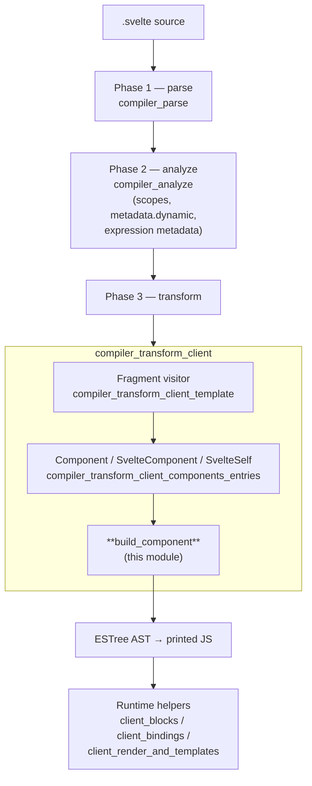
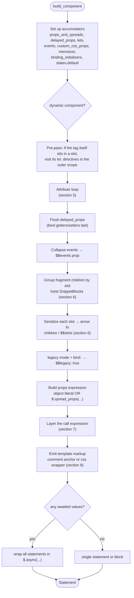
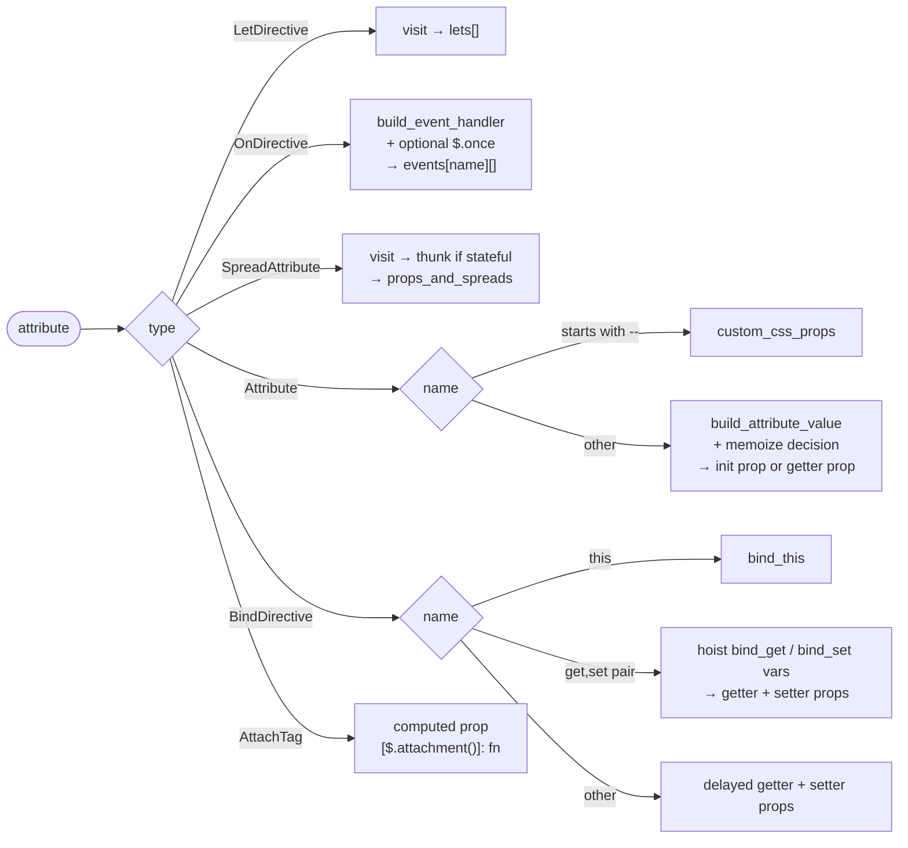
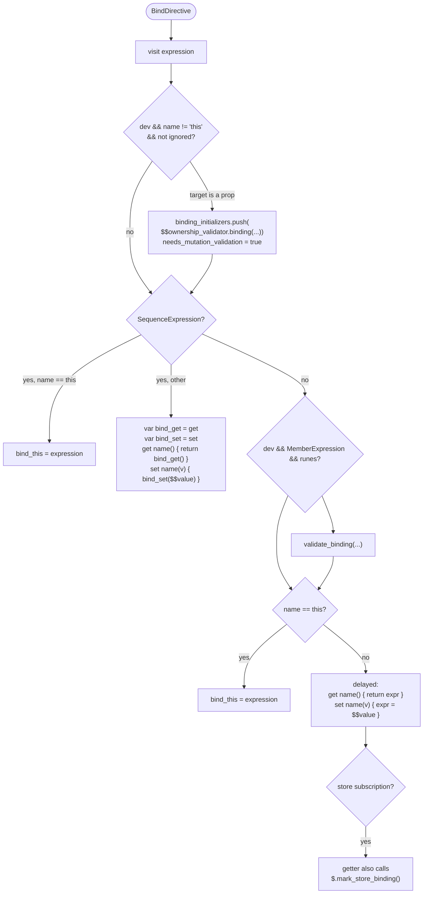
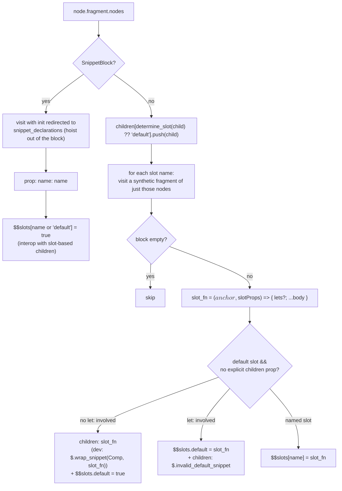
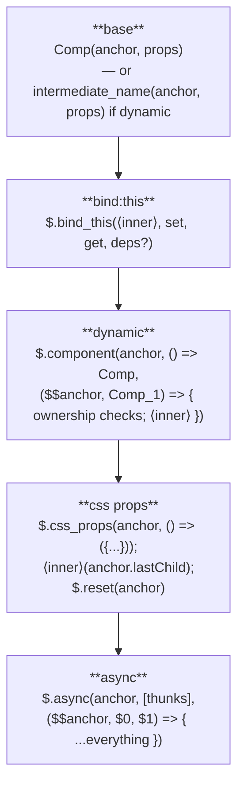
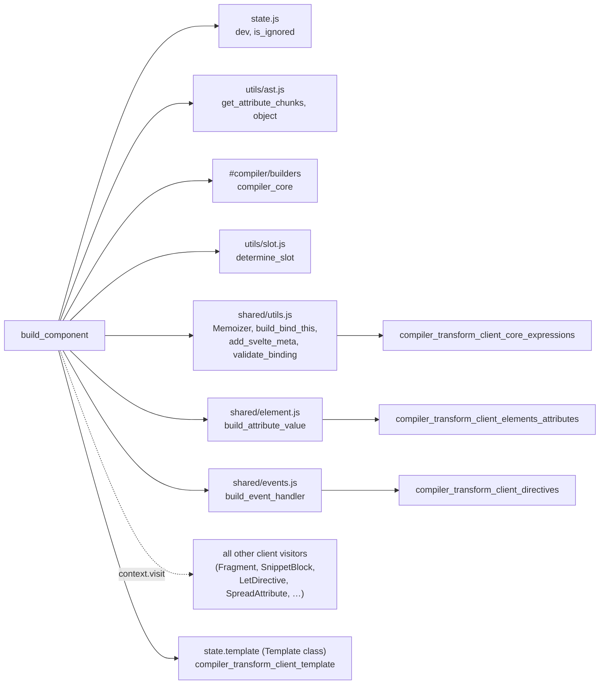

# compiler_transform_client_components_builder

## 1. What this module is

This module is a single function: `build_component`.

It is the **code generator for component instantiation** in the client (DOM) transform. Whenever a Svelte template contains a component tag — `<Button />`, `<svelte:component this={x} />`, or `<svelte:self />` — the compiler must turn that tag into a plain JavaScript call:

```js
Button($$anchor, { label: 'hi' });
```

`build_component` builds that call. It is the widest single visitor in the client transform, because a component tag can carry almost every template feature at once: props, spreads, getters/setters for `bind:`, event handlers, actions, attachments, custom CSS properties, `let:` directives, named slots, and snippet children. All of those must collapse into **one props object** and **one call expression**.

| | |
|---|---|
| **File** | `packages/svelte/src/compiler/phases/3-transform/client/visitors/shared/component.js` |
| **Export** | `build_component(node, component_name, context) → Statement` |
| **Called by** | `Component`, `SvelteComponent`, `SvelteSelf` (see [compiler_transform_client_components_entries](compiler_transform_client_components_entries.md)) |
| **Phase** | 3 — transform, client output |

Because this is shared logic behind three visitors, it is documented on its own. The thin visitors that call it are documented in [compiler_transform_client_components_entries](compiler_transform_client_components_entries.md); slot-side handling (`<slot>`, `<svelte:fragment>`) is in [compiler_transform_client_components_slots](compiler_transform_client_components_slots.md).

---

## 2. Where it sits in the system



The module never emits text. It emits an **ESTree AST** using the builder helpers `b.*` from `compiler_core` (`packages/svelte/src/compiler/utils/builders.js`), and it pushes template markup through `context.state.template`. The generated code calls runtime functions documented under [client_blocks](client_blocks.md), [client_bindings](client_bindings.md) and [client_render_and_templates](client_render_and_templates.md).

---

## 3. The signature

```js
export function build_component(node, component_name, context)
```

| Parameter | Meaning |
|---|---|
| `node` | `AST.Component`, `AST.SvelteComponent`, or `AST.SvelteSelf` |
| `component_name` | the identifier to call. `Button` for `<Button/>`, `'$$component'` for `<svelte:component>`, `context.state.analysis.name` for `<svelte:self>` |
| `context` | the zimmerframe `ComponentContext` — `state` (scope, init, template, analysis, transform) plus `visit` |
| **returns** | one `Statement`. A single statement when possible, otherwise a `BlockStatement`, otherwise a `$.async(...)` statement |

The three callers all do the same thing with the result: `context.state.init.push(component)`.

---

## 4. High level flow



### Key local state

| Local | Purpose |
|---|---|
| `anchor` | `context.state.node` — the DOM anchor expression the component renders at |
| `props_and_spreads` | `Array<Property[] \| Expression>`. Runs of plain props collect into one array; a spread breaks the run |
| `delayed_props` | deferred `push_prop` calls, so `bind:` accessors land **after** spreads and cannot be overwritten by them |
| `lets` | compiled `let:` directives, as expression statements |
| `states.default` | a child transform state scoped to `node.metadata.scopes.default` — the default-slot scope |
| `children` | `slot_name → TemplateNode[]` |
| `events` | `event_name → handler expressions[]` (legacy `on:` directives) |
| `memoizer` | a `Memoizer` from [compiler_transform_client_core_expressions](compiler_transform_client_core_expressions.md); hoists non-trivial expressions into `$.derived`s or async values |
| `bind_this` | the `bind:this` target expression, if any |
| `binding_initializers` | dev-only `$$ownership_validator.binding(...)` statements |
| `custom_css_props` | `--foo={...}` attributes |

### Two naming decisions made up front

```js
const is_component_dynamic =
    node.type === 'SvelteComponent' || (node.type === 'Component' && node.metadata.dynamic);

const intermediate_name =
    node.type === 'Component' && node.metadata.dynamic
        ? context.state.scope.generate(node.name)   // e.g. `Button_1`
        : '$$component';
```

A component is **dynamic** when the constructor itself can change at runtime — `<svelte:component>`, or a `<Component>` whose name resolves to a reactive value. Dynamic components are wrapped in `$.component(...)`, which re-mounts when the constructor changes. `intermediate_name` is the parameter that receives the current constructor inside that wrapper.

### Slot scope subtlety

```js
let slot_scope_applies_to_itself = !!determine_slot(node);
```

`determine_slot` (from `packages/svelte/src/compiler/utils/slot.js`) reads a static `slot="..."` attribute. If the component tag *is itself* placed in a parent's named slot, then the parent's `let:` bindings are visible to the tag's own attributes, not only to its children. That flag changes **which scope** `let:` directives are compiled in and **where** they are emitted (`context.state.init` vs. inside the slot function). It is also set later if any `slot` attribute is seen in the loop, covering non-static slot names.

---

## 5. The attribute loop

Every attribute goes through one dispatch. This is the heart of the module.



### `let:` directives

Visited into `lets`. If the slot scope applies to the tag itself, they are visited in the **outer** scope in a pre-pass before the main loop; otherwise they are visited against `states.default` so they resolve against the default-slot scope.

### `on:` directives (legacy events)

```js
if (!attribute.expression) context.state.analysis.needs_props = true;   // event bubbling needs $$props
let handler = build_event_handler(attribute.expression, attribute.metadata.expression, context);
if (attribute.modifiers.includes('once')) handler = b.call('$.once', handler);
(events[attribute.name] ||= []).push(handler);
```

Handlers are grouped by event name. After the loop they collapse into one `$$events` prop; a name with several handlers becomes an array. `build_event_handler` lives in [compiler_transform_client_directives](compiler_transform_client_directives.md).

### Spread attributes

```js
const expression = context.visit(attribute);
if (attribute.metadata.expression.has_state) {
    props_and_spreads.push(b.thunk(
        has_await || has_call ? b.call('$.get', memoizer.add(expression, has_await)) : expression
    ));
} else {
    props_and_spreads.push(expression);
}
```

A stateful spread becomes a **thunk** so `$.spread_props` can re-read it. A static spread is passed as-is.

### Normal attributes → props

Two questions are answered per attribute:

1. **Does it need memoizing?** — yes if the value awaits, or if any expression chunk is more than a bare `Identifier` / `MemberExpression`. The comment in the source gives the motivating case: `active={i === index}` would otherwise re-fire the child's reads on every unrelated change. Memoized values are read back as `$.get($0)`.
2. **Does it need a getter?** — if `has_state`, the prop is emitted as `get name() { return value }` so the child re-reads it lazily; otherwise as a plain `name: value`.

Two names are special-cased for bookkeeping: `slot` flips `slot_scope_applies_to_itself`, and `children` sets `has_children_prop` (which suppresses the implicit `children` snippet later).

Names starting with `--` are diverted into `custom_css_props` and skipped as props entirely.

### `bind:` directives



Three things are worth remembering here:

- **Function-pair bindings** (`bind:x={() => a.b, v => a.b = v}`) are hoisted into two `var`s in `init` so each is created only once, then referenced from the accessor pair.
- **`bind:this`** never becomes a prop. It is stashed in `bind_this` and applied as an outer `$.bind_this(...)` wrapper around the whole component call (section 7).
- **Ordering matters.** Regular bindings are pushed through `delayed_props`, so their accessors are appended after every spread. Without this, `<Comp {...props} bind:value />` could have the spread clobber the setter.

### `{@attach ...}`

Attachments become a **computed** property keyed by `$.attachment()`:

```js
{ [$.attachment()]: ($$node) => (fn || $.noop)($$node) }
```

The `|| $.noop` guard is dropped when the scope evaluator already proves the expression is a function. If the attachment expression has no state, the value is passed straight through without the wrapper arrow.

---

## 6. Children: snippets and slots



### Why snippets are hoisted

The `SnippetBlock` visitor normally pushes its declaration into the surrounding `init`. Directly inside a component tag that is wrong — the declaration has to exist *before* the props object that references it. So `build_component` redirects `init` to a local `snippet_declarations` array and prepends it to the emitted statements.

### Why there are two shapes for the default slot

Modern Svelte passes default children as a `children` **prop** (a snippet). But `let:` directives are a slot-only feature — a `children` snippet cannot receive slot props. So:

- No `let:` anywhere in the default children → the clean modern form: `children: slot_fn`, plus `$$slots.default = true` so a child still using `<slot>` keeps working.
- Any `let:` present → the slot function goes to `$$slots.default`, and `children` is set to `$.invalid_default_snippet`, which errors if the child tries to render it as a snippet.

`has_children_prop` (an explicit `children={...}` attribute) also forces the `$$slots` path, since the author's prop must win.

Each named slot is compiled against its own analyzed scope, `node.metadata.scopes[slot_name]`, with a fresh copy of the transform map.

### Legacy flag

```js
if (!runes && node.attributes.some(a => a.type === 'BindDirective')) push_prop(b.init('$$legacy', b.true));
```

Signals the runtime to use Svelte-4 two-way binding semantics.

---

## 7. Assembling the call

Props first:

```js
props_expression =
    (no spreads)  ? b.object(props)
                  : b.call('$.spread_props', ...groups)
```

An object literal is used when there is at most one run of plain props. As soon as a spread is present, the runs and spreads are handed to `$.spread_props`, which merges them lazily so getters stay live.

Then the call is built as **layers**. `fn` is a function from anchor expression to call expression, wrapped outward-in:



Notes on each layer:

- **Base**: for a non-dynamic component the callee itself is `context.visit(b.member_id(component_name))`, so any import/store transform applies. For a dynamic one it is the plain `intermediate_name` identifier.
- **`bind:this`**: delegated to `build_bind_this` in [compiler_transform_client_core_expressions](compiler_transform_client_core_expressions.md), which produces getter/setter arrows and threads each-block context variables through so stale values can be nulled on teardown.
- **Dynamic**: `$.component(node_id, () => Comp, ($$anchor, Comp_1) => { ... })` — the thunk is tracked, and the render callback re-runs with the new constructor. Note that `binding_initializers` move **inside** this callback (they reference the current constructor); for static components they are emitted as plain statements instead.
- **Custom CSS props**: these need a real DOM element to hang inline `style` on. The module pushes a wrapper into the template — `<g>` inside an SVG namespace, otherwise `<svelte-css-wrapper style="display: contents">` — then a comment anchor inside it, then pops. The component is mounted at `anchor.lastChild`, and `$.reset(anchor)` closes the wrapper.
- **Otherwise** a bare comment anchor is pushed and the call is wrapped by `add_svelte_meta(..., 'component', { componentTag: node.name })`, which in dev registers the component in the Svelte dev stack for error locations.

Statement order in the returned block:

```
snippet_declarations
memoizer.deriveds(runes)            // let $0 = $.derived(() => ...)
binding_initializers                // static components only
css_props / mount / reset  OR  the wrapped component call
```

Finally `memoizer.apply()` assigns the real `$0`, `$1`, … names, and if any memoized value was **awaited**, the entire statement list is wrapped:

```js
$.async(anchor, [() => await_expr], ($$anchor, $0) => { ...statements });
```

---

## 8. Worked examples

### Simple props

```svelte
<Button label={text} active={i === index} />
```

```js
var node = $.comment();
let $0 = $.derived(() => i === index);
Button(node, {
    get label() { return text; },
    get active() { return $.get($0); }
});
```

`label` is a bare identifier → getter, no derived. `active` is a computed comparison → memoized, so the child does not re-run on unrelated changes.

### Spread plus binding

```svelte
<Input {...rest} bind:value />
```

```js
Input(node, $.spread_props(rest, {
    get value() { return value; },
    set value($$value) { value = $$value; }
}));
```

The binding accessors are last — that is `delayed_props` at work.

### Dynamic component with `bind:this`

```svelte
<svelte:component this={Cmp} bind:this={ref} />
```

```js
$.component(node, () => Cmp, ($$anchor, $$component) => {
    $.bind_this($$component($$anchor, {}), ($$value) => ref = $$value, () => ref);
});
```

### Default children

```svelte
<Card>hello</Card>
```

```js
Card(node, {
    children: ($$anchor, $$slotProps) => { /* hello */ },
    $$slots: { default: true }
});
```

---

## 9. Dependencies



| Dependency | Module doc | Used for |
|---|---|---|
| `Memoizer`, `build_bind_this`, `add_svelte_meta`, `validate_binding` | [compiler_transform_client_core_expressions](compiler_transform_client_core_expressions.md) | expression hoisting, `bind:this`, dev metadata, dev binding checks |
| `build_attribute_value` | [compiler_transform_client_elements_attributes](compiler_transform_client_elements_attributes.md) | text/expression attribute values |
| `build_event_handler` | [compiler_transform_client_directives](compiler_transform_client_directives.md) | legacy `on:` handlers |
| `state.template` | [compiler_transform_client_template](compiler_transform_client_template.md) | comment anchor and `<svelte-css-wrapper>` markup |
| `b.*` builders | [compiler_core](compiler_core.md) | ESTree construction |
| `ComponentClientTransformState` | [compiler_transform_client_core_state](compiler_transform_client_core_state.md) | the `state` shape (`init`, `transform`, `scope`, `analysis`) |
| `node.metadata.*` | [compiler_analyze](compiler_analyze.md) | `dynamic`, `scopes`, expression metadata |
| AST node types | [compiler_ast_types](compiler_ast_types.md) | `AST.Component`, `AST.SvelteComponent`, `AST.SvelteSelf` |

Runtime counterparts of the emitted calls:

| Emitted call | Runtime module |
|---|---|
| `$.component` | [client_blocks](client_blocks.md) |
| `$.async` | [client_blocks](client_blocks.md) |
| `$.css_props` | [client_blocks](client_blocks.md) |
| `$.wrap_snippet`, `$.invalid_default_snippet` | [client_blocks](client_blocks.md) |
| `$.bind_this` | [client_bindings](client_bindings.md) |
| `$.spread_props`, `$.derived`, `$.get`, `$.mark_store_binding` | [client_reactivity](client_reactivity.md) |
| `$.comment`, `$.reset` | [client_render_and_templates](client_render_and_templates.md) |
| `$.attachment` | [public_api](public_api.md) |
| `$.add_svelte_meta`, `$$ownership_validator` | [client_dev_tooling](client_dev_tooling.md) |
| `$.once`, `$.bubble_event` | [legacy_compat](legacy_compat.md) |

The SSR sibling of this function is `Component` in `phases/3-transform/server/visitors/Component.js` — see [compiler_transform_server](compiler_transform_server.md). It solves the same problem (fold attributes into one props object) but emits string-concatenation code instead of getters and effects.

---

## 10. Behaviour notes for maintainers

- **Prop order is semantic.** Plain props keep source order; `bind:` accessors are always pushed last via `delayed_props`; `$$events`, `$$slots` and `$$legacy` are appended after the attribute loop. Changing this order changes which value wins under a spread.
- **Getter vs. plain prop is decided by `has_state`,** not by syntax. A statically-known expression is inlined as a literal by `build_attribute_value` / `build_template_chunk`.
- **Memoization is a correctness/perf tradeoff.** Wrapping too little re-fires child reactivity; wrapping too much adds derived overhead. The current rule — memoize on `await`, or when a chunk is not a bare identifier/member expression — is deliberate and load-bearing.
- **Dev-only code paths.** `add_svelte_meta`, `$.wrap_snippet`, `$$ownership_validator.binding`, and `validate_binding` are all gated on `dev`, and each is individually suppressible with `<!-- svelte-ignore ... -->` (`ownership_invalid_binding`, `binding_property_non_reactive`).
- **`custom_css_props` is an array but is length-checked with `Object.keys(...).length`.** This works (array indices are own keys) but is worth knowing before refactoring.
- **Empty slots are dropped.** A slot whose compiled block has no statements produces no prop at all, so the child sees the slot as absent rather than empty.
- **The return value is deliberately shape-flexible** — a bare statement when only one is needed, a `BlockStatement` when several must stay together, a `$.async(...)` statement when awaited props exist. Callers must not assume a block.
