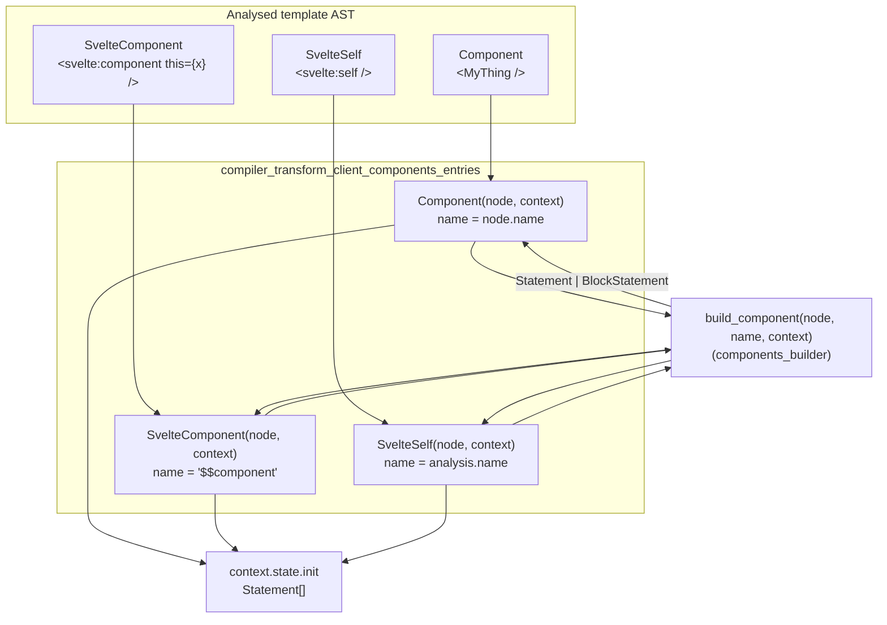
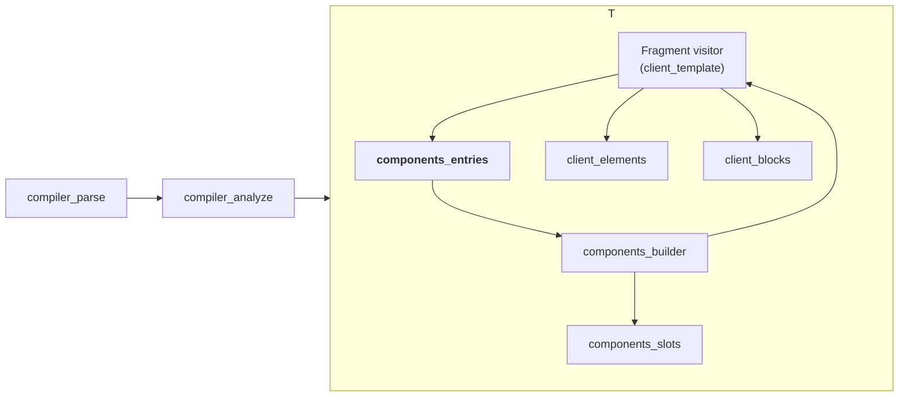
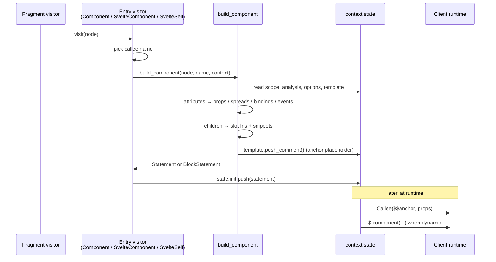
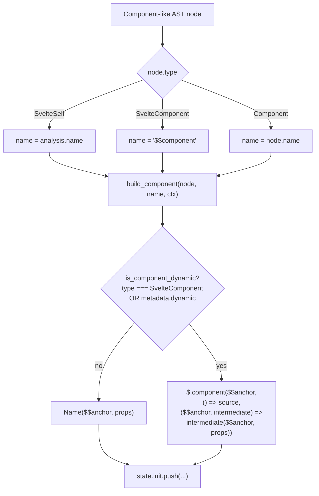
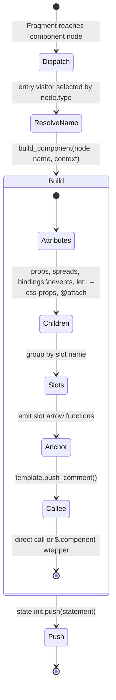
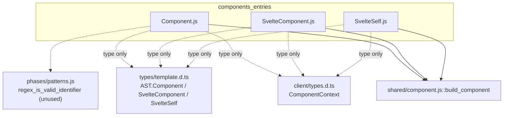
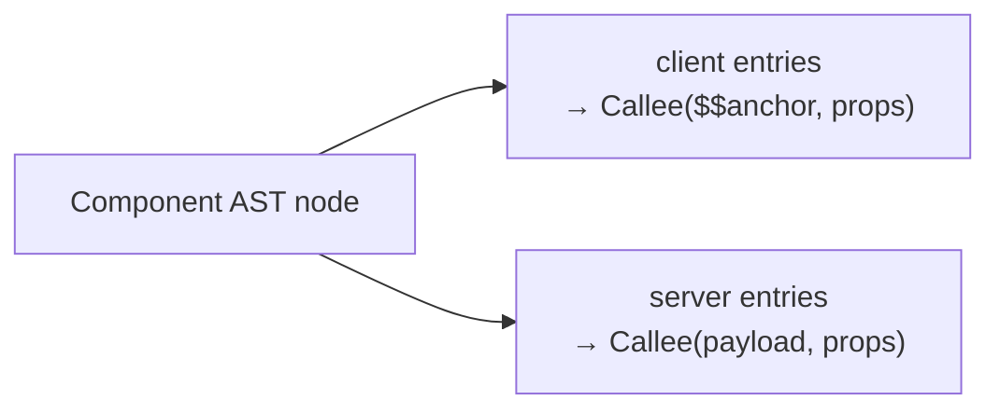

# compiler_transform_client_components_entries

## Introduction

This module holds the three **entry-point visitors** that the client-side code generator uses when it meets a component in a Svelte template:

| Template syntax | AST node type | Visitor file |
| --- | --- | --- |
| `<MyThing />` | `Component` | `visitors/Component.js` |
| `<svelte:component this={X} />` | `SvelteComponent` | `visitors/SvelteComponent.js` |
| `<svelte:self />` | `SvelteSelf` | `visitors/SvelteSelf.js` |

Each visitor is tiny on purpose. All the hard work — reading props, bindings, slots, `let:` directives, event handlers, custom CSS properties, snippets — lives in one shared builder, `build_component`, documented in [compiler_transform_client_components_builder](compiler_transform_client_components_builder.md).

So the job of this module is narrow but important: **decide which name the generated code should call, then hand off to the shared builder and place the result in the right output bucket.**

---

## Purpose and core functionality

The client transform walks the analysed AST and rewrites each node into JavaScript statements. For components, the generated call always has the same shape:

```js
SomeCallee($$anchor, { /* props */ });
```

The only thing that differs between the three template forms is **what `SomeCallee` is**. That single decision is the whole reason three separate files exist:

| Visitor | Name passed to `build_component` | Meaning |
| --- | --- | --- |
| `Component` | `node.name` | The identifier written in the template, e.g. `MyThing` or `namespace.Thing` |
| `SvelteComponent` | `'$$component'` | A placeholder; the real constructor comes from `this={...}` at runtime |
| `SvelteSelf` | `context.state.analysis.name` | The name of the component currently being compiled (recursion) |

All three then do the identical final step:

```js
context.state.init.push(component);
```

`init` is the "before the render effect" bucket on the transform state (see [compiler_transform_client_core_state](compiler_transform_client_core_state.md)). Components are created once at init time; their reactivity is handled by getters inside the props object, not by re-running the creation statement.

### Component.js

```js
export function Component(node, context) {
        const component = build_component(node, node.name, context);
        context.state.init.push(component);
}
```

The plain case. `node.name` is the raw text from the template, which may be a dotted path (`foo.Bar`). The builder itself decides whether the call needs to be wrapped in `$.component(...)` for dynamic re-resolution — it checks `node.metadata.dynamic`, a flag set earlier during analysis:

```js
// phases/2-analyze/visitors/Component.js
node.metadata.dynamic =
        context.state.analysis.runes &&        // Svelte 4 needed <svelte:component>
        binding !== null &&
        (binding.kind !== 'normal' || node.name.includes('.'));
```

In other words: in runes mode, a component referenced through a reactive binding (state, prop, derived) or through a member expression is treated as *dynamic*, so swapping the value at runtime swaps the rendered component.

> Note: `Component.js` imports `regex_is_valid_identifier` but does not use it — a leftover from an earlier refactor.

### SvelteComponent.js

```js
export function SvelteComponent(node, context) {
        const component = build_component(node, '$$component', context);
        context.state.init.push(component);
}
```

`<svelte:component this={expr}>` is the legacy way to render a component chosen at runtime. There is no static identifier to call, so the visitor passes the literal placeholder `'$$component'`. Inside the builder, `node.type === 'SvelteComponent'` unconditionally means "dynamic", so the output is always wrapped:

```js
$.component($$anchor, () => expr, ($$anchor, $$component) => {
        $$component($$anchor, { /* props */ });
});
```

`node.expression` (the value of `this`) is read by the builder, not by this visitor.

### SvelteSelf.js

```js
export function SvelteSelf(node, context) {
        const component = build_component(node, context.state.analysis.name, context);
        context.state.init.push(component);
}
```

`<svelte:self />` is recursion. A component cannot import itself, so the compiler substitutes the name of the function it is currently generating, taken from the component analysis. No dynamic wrapping is involved — the callee is a known local function.

---

## Architecture



The three visitors are siblings with no dependency on each other. They are *adapters*: they translate three template spellings into one builder signature.

### Position in the client transform



Fragment traversal ([compiler_transform_client_template](compiler_transform_client_template.md)) reaches a component node, dispatches to one of these three visitors, which calls the builder, which recursively visits the component's children as slot/snippet functions — going back through Fragment. The recursion is what lets arbitrarily deep templates compile.

---

## Component interaction



### What the visitors read from `context`

They touch surprisingly little of the transform state directly:

| Field | Used by | Why |
| --- | --- | --- |
| `context.state.init` | all three | destination bucket for the generated statement |
| `context.state.analysis.name` | `SvelteSelf` | the compiled component's own function name |
| everything else | `build_component` | props, bindings, slots, memoization, anchors |

`ComponentContext` is a `zimmerframe` context typed over `ComponentClientTransformState` — see [compiler_transform_client_core_state](compiler_transform_client_core_state.md) for the full shape of `init` / `update` / `after_update` / `template`.

---

## Data flow: name resolution



Worth reading carefully: **the dynamic decision is not made in this module.** `SvelteComponent` is dynamic because of its node type; `Component` is dynamic only if analysis marked it so. `SvelteSelf` is never dynamic. This split means the entry visitors stay free of policy and the builder holds all of it.

### Example outputs

Static component:

```svelte
<Button label="ok" />
```

```js
// roughly
var node = $.first_child(fragment);
Button(node, { label: 'ok' });
```

Dynamic component in runes mode (`let Thing = $state(A)`):

```svelte
<Thing x={1} />
```

```js
$.component(node, () => Thing, ($$anchor, $$component) => {
        $$component($$anchor, { x: 1 });
});
```

`<svelte:component>`:

```svelte
<svelte:component this={Chosen} y={2} />
```

```js
$.component(node, () => Chosen, ($$anchor, $$component) => {
        $$component($$anchor, { y: 2 });
});
```

Recursion:

```svelte
<!-- Tree.svelte -->
<svelte:self {node} />
```

```js
Tree(anchor, { node: /* ... */ });
```

---

## Process flow inside a single visit



---

## Dependencies



| Dependency | Kind | Reference |
| --- | --- | --- |
| `build_component` | runtime, required | [compiler_transform_client_components_builder](compiler_transform_client_components_builder.md) |
| `ComponentContext`, `ComponentClientTransformState` | type only | [compiler_transform_client_core_state](compiler_transform_client_core_state.md) |
| `AST.*` node types | type only | [compiler_ast_types](compiler_ast_types.md) |
| `node.metadata.dynamic` | data produced upstream | [compiler_analyze](compiler_analyze.md) |
| `$.component`, `$.spread_props`, `$.css_props` | emitted runtime calls | [client_blocks](client_blocks.md), [client_reactivity](client_reactivity.md) |
| Visitor registration table | consumer | [compiler_transform_client](compiler_transform_client.md) |

No module depends on these three functions except the client visitor registry, which maps node type names to visitor functions.

---

## Relationship to the server transform

The server code generator has its own `Component.js`, `SvelteComponent.js`, and `SvelteSelf.js` under `3-transform/server/visitors/`, with the same three-way split and the same "pick a name, call a shared builder" structure. The difference is the output: the server emits string-concatenation into a payload rather than DOM-creating calls, and there is no `$.component` wrapper because there are no updates to react to. See [compiler_transform_server](compiler_transform_server.md).



---

## Design notes and maintenance guidance

**Why three files for nine lines of code?** The client transform is a flat table of `nodeType -> visitor`. Every AST node type that can appear needs an entry, even when the bodies are near-identical. Keeping them separate makes the table exhaustive and lets each one document its own naming rule.

**Where to make changes:**

- Changing *which callee name* is used, or *where the statement is pushed* → edit these files.
- Changing *how props, slots, bindings, or anchors* are generated → edit `shared/component.js` ([builder docs](compiler_transform_client_components_builder.md)).
- Changing *when a component counts as dynamic* → edit the analyze-phase `Component.js` ([analyze docs](compiler_analyze.md)).

**Legacy trajectory:** `<svelte:component>` exists only for Svelte 4 compatibility. In runes mode, `<Component />` with a reactive binding already handles dynamic swapping, which is why `Component.js` and `SvelteComponent.js` converge on the same `$.component` output. If `<svelte:component>` is eventually removed, `SvelteComponent.js` and the `'$$component'` placeholder disappear with it, and the `is_component_dynamic` ternary inside the builder simplifies to a plain identifier reference — a simplification the builder's own comments anticipate.

**`<svelte:self>` and hoisting:** because the callee is the enclosing component's own function name, `SvelteSelf` is sensitive to how that name is generated in [compiler_transform_client](compiler_transform_client.md). If the component function is renamed for uniqueness, `analysis.name` must reflect the final name, or recursion breaks.

---

## Related documentation

- [compiler_transform_client_components](compiler_transform_client_components.md) — parent module overview
- [compiler_transform_client_components_builder](compiler_transform_client_components_builder.md) — `build_component`, the shared engine
- [compiler_transform_client_components_slots](compiler_transform_client_components_slots.md) — `<slot>` and `<svelte:fragment>`
- [compiler_transform_client_core_state](compiler_transform_client_core_state.md) — transform state buckets
- [compiler_transform_client_template](compiler_transform_client_template.md) — Fragment traversal and anchors
- [compiler_transform_client_directives](compiler_transform_client_directives.md) — `bind:`, `on:`, `let:`, `@attach`
- [compiler_analyze](compiler_analyze.md) — where `metadata.dynamic` is decided
- [compiler_transform_server](compiler_transform_server.md) — the SSR counterpart
