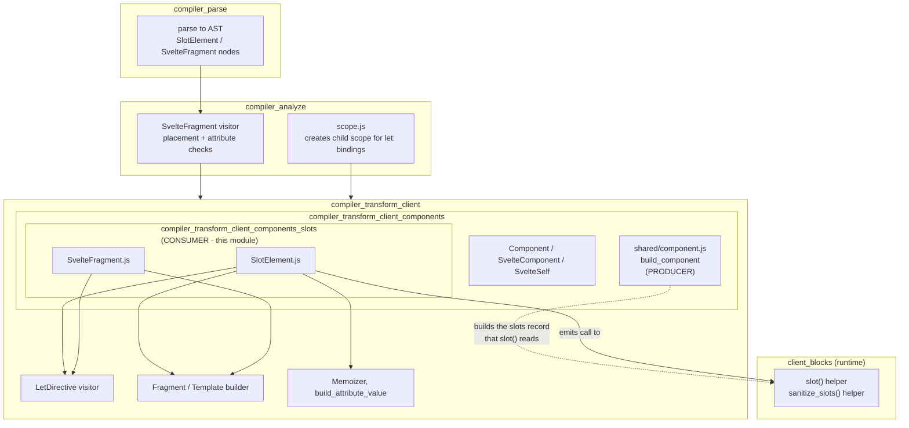
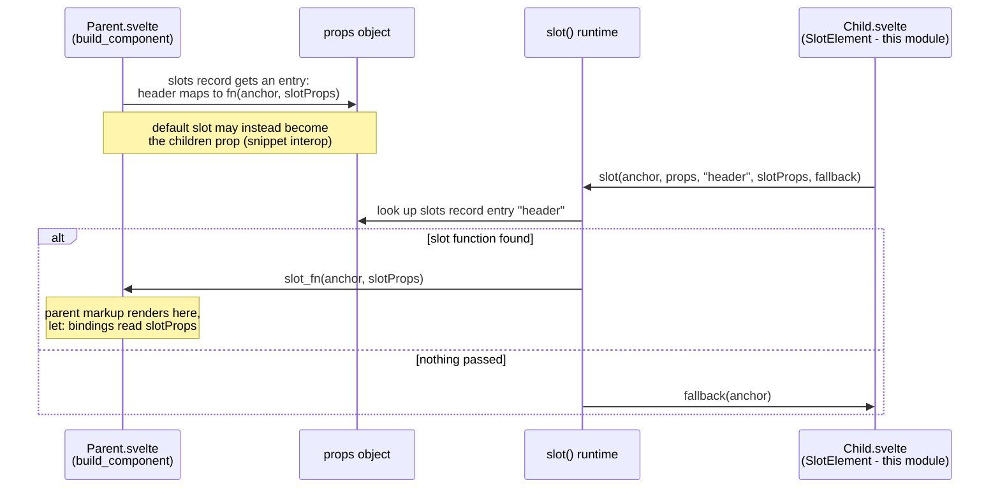
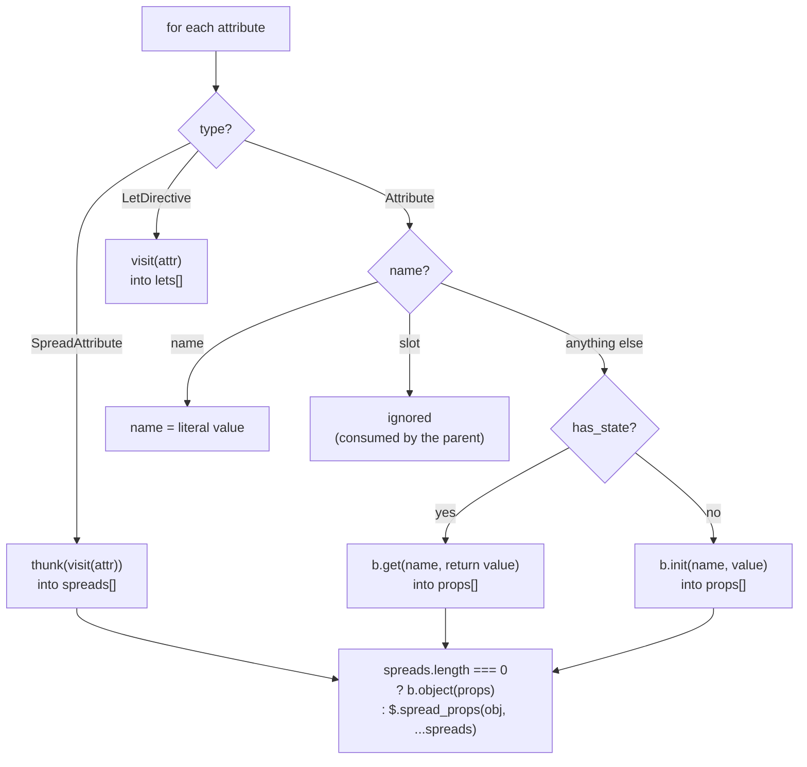
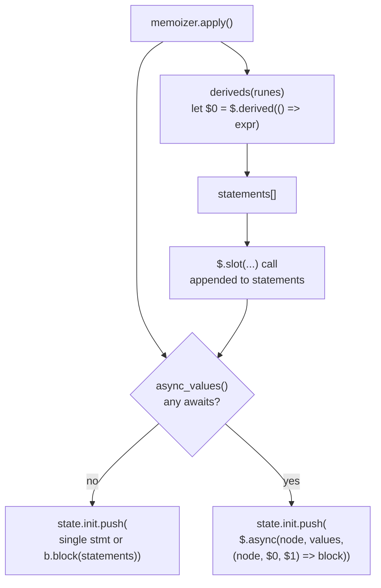
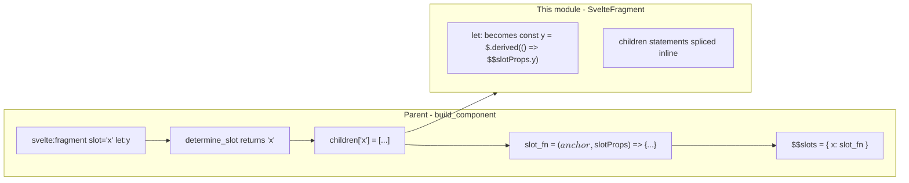
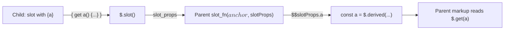
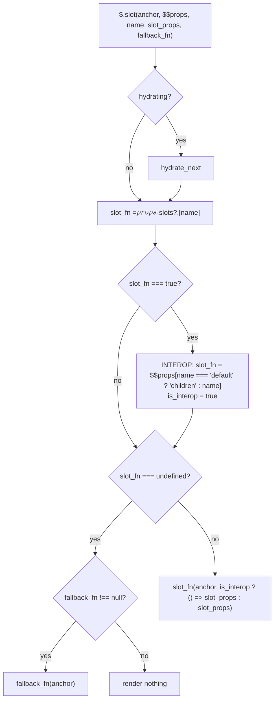

# compiler_transform_client_components_slots

## Introduction

This module is the **slot-consumer side** of Svelte's client-side code generator. It holds two small visitors that run during phase 3 (transform) of the compiler:

| Visitor | Handles | Turns it into |
| --- | --- | --- |
| `SlotElement` | `<slot name="x" {a}>fallback</slot>` | a `$.slot(...)` runtime call |
| `SvelteFragment` | `<svelte:fragment slot="x" let:y>` | inlined statements + `let:` bindings |

The word "slots" here means the **legacy slot API** (Svelte 3/4 style), which Svelte 5 still supports for backwards compatibility. Snippets (`{#snippet}` / `{@render}`) are the modern replacement and live in [compiler_transform_client_blocks_snippets](compiler_transform_client_blocks_snippets.md).

The two halves of the slot system are split across modules:

- **Producer** — a parent writes `<Child><p slot="header">…</p></Child>`. The parent's children are packed into a `$$slots` object by `build_component`. See [compiler_transform_client_components_builder](compiler_transform_client_components_builder.md).
- **Consumer** — the child writes `<slot name="header" />`. That is **this module**. It emits the call that looks the slot function up and runs it.

---

## Where this module sits



> In the diagram above (and in the sequence diagram that follows) the `$.` and `$$` prefixes are dropped for readability. The real generated names are `$.slot`, `$.sanitize_slots`, `$$props`, `$$slots`, `$$anchor` and `$$slotProps`.

Related docs: [compiler_transform_client](compiler_transform_client.md) · [compiler_transform_client_components_entries](compiler_transform_client_components_entries.md) · [compiler_transform_client_directives](compiler_transform_client_directives.md) · [compiler_transform_client_core_expressions](compiler_transform_client_core_expressions.md) · [compiler_transform_client_elements_attributes](compiler_transform_client_elements_attributes.md) · [compiler_transform_client_template](compiler_transform_client_template.md) · [client_blocks](client_blocks.md) · [compiler_ast_types](compiler_ast_types.md)

---

## The mental model in one picture

A parent packs children into `$$slots`; a child unpacks them with `$.slot`.



---

## Component 1 — `SlotElement`

**File:** `packages/svelte/src/compiler/phases/3-transform/client/visitors/SlotElement.js`

### What it produces

```js
// <slot name="x" {a}>fallback</slot>
$.slot($$anchor, $$props, 'x', { get a() { return a; } }, ($$anchor) => { /* fallback */ });
```

The generated call always has five arguments:

| Argument | Source | Notes |
| --- | --- | --- |
| anchor node | `context.state.node` | the comment placeholder pushed into the template |
| `$$props` | literal identifier | the runtime reads `$$props.$$slots` and snippet-interop props from it |
| name | the `name` attribute, else `b.literal('default')` | must be a static literal |
| slot props | object of the remaining attributes, optionally wrapped in `$.spread_props` | passed *up* to the parent's slot function |
| fallback | arrow function, or `b.null` | only built when the slot has children |

### Attribute handling

The visitor walks `node.attributes` once and sorts every attribute into one of four buckets:



Two details are worth calling out:

- **`slot` is skipped.** A `slot="x"` attribute on a `<slot>` element describes where *this* `<slot>` goes inside its own parent component; it is not a prop to hand downward. The parent already read it via `determine_slot`, so passing it on would leak an internal name.
- **Stateful props become getters.** `build_attribute_value` reports `has_state`. When true, the property is emitted as `get a() { return … }` so the parent re-reads a fresh value on every access instead of capturing a stale snapshot. This is the same lazy-prop convention `build_component` uses for component props.

`build_attribute_value` comes from [compiler_transform_client_elements_attributes](compiler_transform_client_elements_attributes.md); the `b.*` builders come from [compiler_core](compiler_core.md).

### Memoization and async values

`SlotElement` creates its **own local `Memoizer`** (see [compiler_transform_client_core_expressions](compiler_transform_client_core_expressions.md)) rather than reusing the fragment-level one. The callback it passes to `build_attribute_value` says: *if this expression contains a call or an `await`, hoist it into a memo slot and read it back through `$.get`.*

```js
(value, metadata) =>
    metadata.has_call || metadata.has_await
        ? b.call('$.get', memoizer.add(value, metadata.has_await))
        : value
```

Why a local memoizer? Because the emitted statements may need to be wrapped in `$.async(...)`, and an async wrapper can only wrap the statements that belong to *this* slot.

`memoizer.apply()` assigns the placeholder ids their real names (`$0`, `$1`, …), then the two kinds of memo diverge:



- **Sync memos** become `$.derived(...)` — or `$.derived_safe_equal(...)` in legacy, non-runes mode. The flag is `context.state.analysis.runes`.
- **Async memos** become the value array handed to `$.async`, and their ids become parameters of the callback. The whole slot render is therefore deferred until every awaited value settles.

When there is nothing async and only one statement, that statement is pushed bare instead of inside a block — a small output-size win that avoids a pointless `{ … }`.

### Ordering rules encoded in this visitor

The order of pushes is deliberate and easy to break:

1. `context.state.template.push_comment()` **first** — the anchor comment must exist in the template at the position the slot occupies, before any statement references `context.state.node`.
2. `lets` go into `state.init` **before** the derived/slot statements, because a `let:` binding can be read by an attribute expression on the same `<slot>`.
3. `memoizer.apply()` runs after all attributes have been visited, so ids are numbered in a stable order.

### Fallback content

```js
node.fragment.nodes.length === 0
    ? b.null
    : b.arrow([b.id('$$anchor')], context.visit(node.fragment))
```

The fallback is a normal fragment visit — see [compiler_transform_client_template](compiler_transform_client_template.md). Passing `b.null` (not an empty function) lets the runtime cheaply test `fallback_fn !== null`.

---

## Component 2 — `SvelteFragment`

**File:** `packages/svelte/src/compiler/phases/3-transform/client/visitors/SvelteFragment.js`

`<svelte:fragment>` is a **transparent wrapper**. It exists so an author can attach `slot="x"` and `let:` directives to a group of nodes without introducing a real DOM element.

```js
export function SvelteFragment(node, context) {
    for (const attribute of node.attributes) {
        if (attribute.type === 'LetDirective') {
            context.state.init.push(context.visit(attribute));
        }
    }
    context.state.init.push(...context.visit(node.fragment).body);
}
```

Two steps only:

1. Visit each `LetDirective` and push the resulting `const x = $.derived(() => $$slotProps.x)` declaration.
2. Visit the child fragment and **splice its statements inline** (`...block.body`) instead of nesting a block. Because the `let:` declarations were pushed first, the children can read them.

Notice what is *absent*: no template comment, no wrapper node, no handling of the `slot` attribute. That attribute is read by the **parent** during `build_component`, which groups children by `determine_slot(child)` and creates a separate slot function per name. By the time this visitor runs, the grouping already happened.



### Scope note

`scope.js` registers `SvelteFragment` (and `SlotElement`) as scope-creating nodes, so `let:` bindings declared on them are visible to descendants and nowhere else. See [compiler_core](compiler_core.md).

### Validation happens earlier

Phase 2 already rejected bad usage before this visitor ever runs: `<svelte:fragment>` must be a direct child of a component, and it may only carry `slot` attributes and `let:` directives. See [compiler_analyze_special_elements](compiler_analyze_special_elements.md).

---

## `let:` bindings — how the two sides meet

`let:` is transformed by the `LetDirective` visitor in [compiler_transform_client_directives](compiler_transform_client_directives.md), but it only makes sense together with slots, so the contract is summarised here.

| Author writes | Generated |
| --- | --- |
| `let:x` | `const x = $.derived(() => $$slotProps.x)` |
| `let:x={y}` | `const y = $.derived(() => $$slotProps.x)` |
| `let:x={{ y, z }}` | one derived that destructures `$$slotProps.x` and returns `{ y, z }`; each binding reads through `$.get(name).y` |

The identifier `$$slotProps` is the **second parameter of the slot function** created by `build_component`:

```js
($$anchor, $$slotProps) => { /* let: deriveds, then children */ }
```

So the data path is: child's `<slot {a}>` → `$.slot` slot-props object → parent's `$$slotProps` → parent's `let:a` derived → parent's markup.



---

## Runtime counterpart

**File:** `packages/svelte/src/internal/client/dom/blocks/slot.js` — documented in [client_blocks](client_blocks.md).



The **interop branch** is the bridge between the old and new APIs. When a parent passes a *snippet*, `build_component` records `$$slots: { default: true }` alongside the real `children` prop. The sentinel `true` tells the runtime "the content is a snippet, look in `$$props`", and snippets expect their props as a **thunk**, hence `() => slot_props`.

`$.sanitize_slots(props)` builds the `$$slots` boolean map a component sees when it references `$$slots` itself; it is injected once per component by `transform-client.js` as `const $$slots = $.sanitize_slots($$props)`.

---

## End-to-end example

**Child.svelte**

```svelte
<slot name="row" item={data[i]} count={items.length}>
  <em>nothing here</em>
</slot>
```

**Generated (shape, simplified)**

```js
var comment = $.comment();          // from template.push_comment()
var node = $.first_child(comment);

let $0 = $.derived(() => items.length);   // memoized: contains a call

$.slot(
  node,
  $$props,
  'row',
  {
    get item() { return data[i]; },       // has_state -> getter
    get count() { return $.get($0); }
  },
  ($$anchor) => { /* <em>nothing here</em> */ }
);
```

**Parent.svelte**

```svelte
<Child>
  <svelte:fragment slot="row" let:item let:count>
    {item} of {count}
  </svelte:fragment>
</Child>
```

**Generated (shape, simplified)**

```js
Child(node, {
  $$slots: {
    row: ($$anchor, $$slotProps) => {
      const item  = $.derived(() => $$slotProps.item);
      const count = $.derived(() => $$slotProps.count);
      /* text nodes reading $.get(item), $.get(count) */
    }
  }
});
```

---

## Comparison with the server transform

The server has its own `SlotElement` and `SvelteFragment` visitors (see [compiler_transform_server](compiler_transform_server.md)). They share the same *shape* but differ in every reactivity-related detail:

| Aspect | Client (this module) | Server |
| --- | --- | --- |
| Anchor | `template.push_comment()` + `state.node` | `empty_comment` before and after |
| Stateful props | `get a() { … }` getters | plain `b.init` values |
| Memoization / async | `Memoizer`, `$.derived`, `$.async` | none — rendering is one synchronous pass |
| Spread | `$.spread_props(obj, ...spreads)` | `$.spread_props([obj, ...spreads])` |
| Fallback | `($$anchor) => { … }` | `() => { … }` thunk |
| `let:` on `<slot>` | visited and pushed to `init` | not handled here |
| `SvelteFragment` | pushes `let:` deriveds, then inlines statements | just visits the fragment |
| Output target | `$.slot($$anchor, …)` into `state.init` | `$.slot($$payload, …)` into `state.template` |

---

## Design rationale

- **Two tiny files, one concept.** Both visitors exist only to bridge legacy slot syntax onto the snippet-shaped runtime. Keeping them separate from `build_component` keeps the producer/consumer split clean.
- **A local `Memoizer`, not the shared one.** Async slot props need their own `$.async` wrapper scoped to just this slot's statements; borrowing the fragment-level memoizer would pull unrelated expressions into that wrapper.
- **Getters instead of eager values.** Slot props cross a component boundary. A getter keeps the read lazy so the parent's effects track the right dependencies.
- **`b.null` fallback sentinel.** Cheaper at runtime than always allocating an empty function, and lets `$.slot` skip a call entirely.
- **`<svelte:fragment>` emits no node.** Inlining `block.body` keeps the DOM free of wrapper elements, which is the whole point of the tag.

## Common pitfalls when modifying

| Pitfall | Consequence |
| --- | --- |
| Pushing `lets` after the slot statements | attributes on the same `<slot>` reference undeclared bindings |
| Forgetting `push_comment()` before using `state.node` | anchor mismatch, hydration breaks |
| Forwarding the `slot` attribute as a slot prop | leaks an internal name into user-visible props |
| Calling `memoizer.apply()` before all attributes are visited | memo ids get renumbered incorrectly |
| Dropping the `runes` flag on `deriveds()` | legacy components lose `derived_safe_equal` semantics and over-fire |
