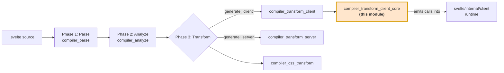
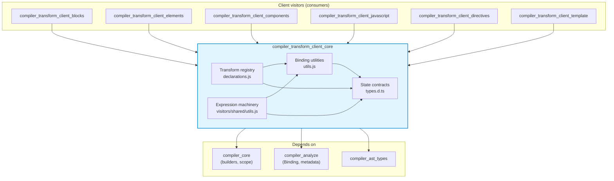
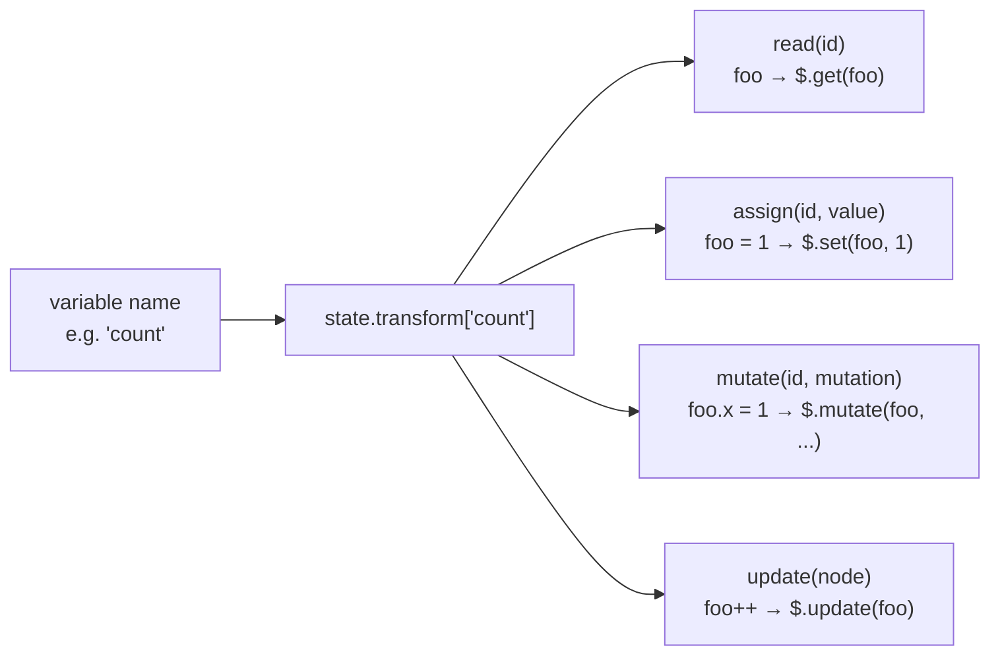
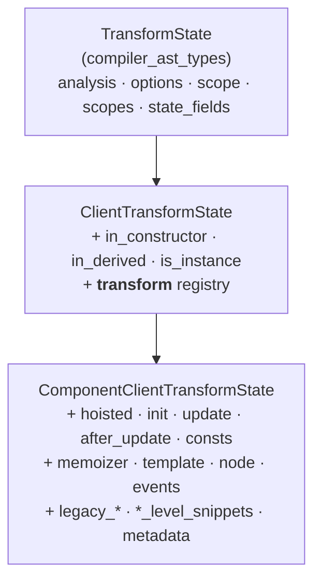
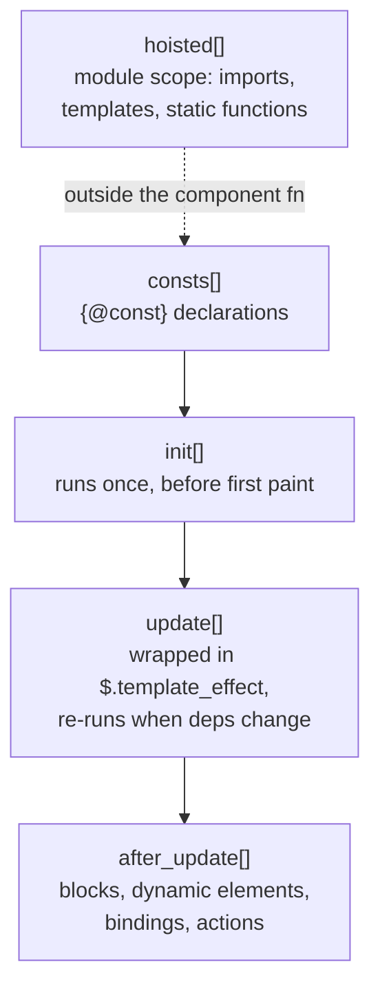
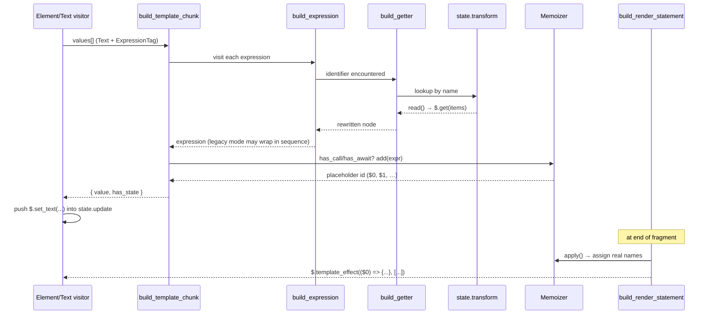
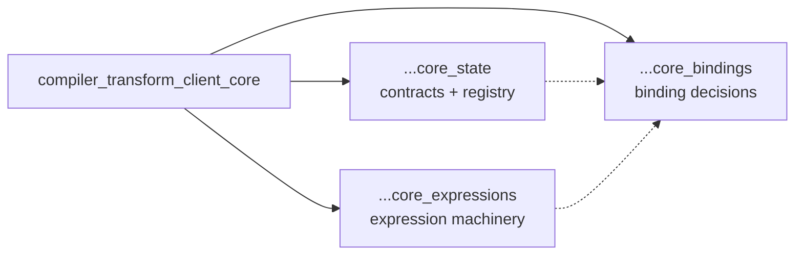
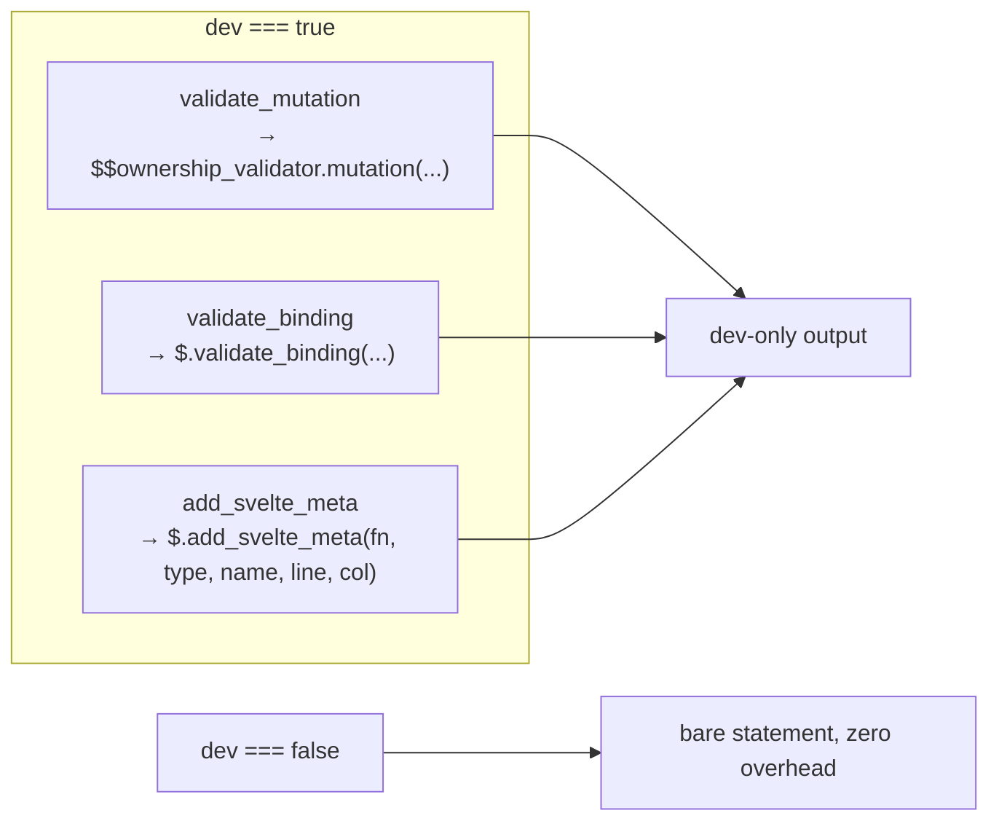

# compiler_transform_client_core

## 1. What This Module Is

`compiler_transform_client_core` is the **shared foundation layer** of Svelte's client-side code
generator (phase 3, "transform", client target). It does not handle any single Svelte syntax
feature on its own. Instead, it holds the small set of helpers, data contracts, and building
blocks that *every* client visitor calls into.

Think of the client transform as a factory floor:

- The **visitors** (`IfBlock.js`, `RegularElement.js`, `Component.js`, …) are the workers. Each one
  knows how to turn one kind of Svelte AST node into JavaScript.
- **This module** is the toolbox and the shared workbench. It answers questions every worker asks:
  - "Is this variable a reactive source, or just a plain value?"
  - "How do I read this variable in the output code — `foo`, or `$.get(foo)`?"
  - "Where do I put the statement I just built — setup, update, or teardown?"
  - "This expression calls a function. Can I hoist it out of the render loop?"
  - "Do I need to wrap this in dev-mode validation?"

Because it sits under everything, a change here changes the shape of *all* generated client code.

### Core files

| File | Role |
| --- | --- |
| `client/types.d.ts` | The `ClientTransformState` / `ComponentClientTransformState` contracts — the shared mutable workbench passed to every visitor |
| `client/utils.js` | Binding-level decisions: state sources, prop sources, proxying, hoisted params, derived creation |
| `client/visitors/shared/utils.js` | Expression-level machinery: `Memoizer`, template chunks, render statements, `bind:this`, dev metadata |
| `client/visitors/shared/declarations.js` | Registers the read/assign/mutate/update rewrite rules for reactive declarations |

---

## 2. Where It Sits In The Compiler

Svelte compiles in three phases. This module lives entirely in phase 3, on the client branch.

Phase 2 (`compiler_analyze`) decorates the AST with `Binding` objects and `ExpressionMetadata`
(`has_call`, `has_await`, `has_state`, `references`, …). This module **reads** that metadata and
turns it into decisions. It never re-derives it.

The code it emits is not standalone JavaScript — it is a stream of calls into the client runtime
(`$.get`, `$.set`, `$.derived`, `$.prop`, `$.template_effect`, `$.bind_this`). See
[client_reactivity](client_reactivity.md) and [client_render_and_templates](client_render_and_templates.md)
for the other half of that contract.

---

## 3. Architecture Overview

### The one idea that ties it together: the transform registry

The single most important concept in this module is `state.transform` — a plain object mapping a
variable **name** to four optional rewrite functions.

Every visitor that touches an identifier goes through this table rather than special-casing
binding kinds inline. That is why `Identifier.js`, `AssignmentExpression.js`, and
`MemberExpression.js` in [compiler_transform_client_javascript](compiler_transform_client_javascript.md)
stay short: the intelligence lives here.

`add_state_transformers` (in `declarations.js`) is what populates that table, and `build_getter`
(in `utils.js`) is the canonical way to consult it for reads.

---

## 4. The Shared Workbench: Transform State

Visitors are driven by [zimmerframe](https://github.com/Rich-Harris/zimmerframe), which threads a
`state` object through the walk. Child visitors can fork it (`{ ...state, in_derived: true }`) so
changes stay scoped to a subtree.

`ClientTransformState` extends the target-agnostic `TransformState` and adds lexical flags plus the
transform registry. `ComponentClientTransformState` adds everything needed to build one component
function body.

### Statement buckets

The most visible part of `ComponentClientTransformState` is a set of arrays that visitors push
into. Their order in the array *is* their order in the generated function.

`init`, `update`, `after_update`, `consts`, `template`, and `memoizer` are all `null` until the
`Fragment` visitor sets them up — they are per-fragment, not per-component. See
[compiler_transform_client_template](compiler_transform_client_template.md).

---

## 5. Data Flow: From An Expression To Emitted Code

Here is the path a single template expression like `{items.filter(fn).length}` takes:

Two things worth noting:

1. **Constant folding happens here.** `build_template_chunk` asks `scope.evaluate(value)`; when the
   result `is_known`, the expression is inlined as a literal and never reaches the runtime.
2. **`Memoizer` separates sync from async.** Sync memos become `$.derived(...)` bindings; async
   memos become an array of async thunks passed as the third argument to `$.template_effect`, so
   `await` in templates works without blocking synchronous updates.

---

## 6. Sub-Modules

The module splits cleanly into three concerns. Each has its own page.

| Sub-module page | Source file it covers | Concern |
| --- | --- | --- |
| [compiler_transform_client_core_state.md](compiler_transform_client_core_state.md) | `client/types.d.ts`, `client/visitors/shared/declarations.js` | Shared state contracts + transform registry |
| [compiler_transform_client_core_bindings.md](compiler_transform_client_core_bindings.md) | `client/utils.js` | Per-binding decisions (state, props, proxy, hoisting) |
| [compiler_transform_client_core_expressions.md](compiler_transform_client_core_expressions.md) | `client/visitors/shared/utils.js` | Expression memoization, template chunks, dev metadata |

### 6.1 State contracts and the transform registry

**Components:** `ClientTransformState`, `ComponentClientTransformState`, `get_value`,
`add_state_transformers`

Defines the workbench every visitor shares, and populates `state.transform` with rewrite rules for
`$state`, `$derived`, and legacy `$:` reactive declarations. Explains the statement buckets, the
lexical flags (`in_constructor`, `in_derived`, `is_instance`), and how state forking works during
the walk.

→ **[compiler_transform_client_core_state](compiler_transform_client_core_state.md)**

### 6.2 Binding and prop utilities

**Components:** `is_state_source`, `build_getter`, `build_hoisted_params`, `get_prop_source`,
`is_prop_source`, `should_proxy`, `create_derived`

Answers the per-binding questions. Decides whether a `$state` variable actually needs a signal
(`is_state_source`), whether a prop needs the `$.prop(...)` wrapper and which `PROPS_IS_*` flag
bits to set (`get_prop_source` / `is_prop_source`), whether a value must be deep-proxied
(`should_proxy`), and which parameters a hoisted event handler needs
(`build_hoisted_params`).

→ **[compiler_transform_client_core_bindings](compiler_transform_client_core_bindings.md)**

### 6.3 Expression and template machinery

**Components:** `Memoizer`, `build_expression`, `build_template_chunk`, `build_render_statement`,
`validate_mutation`, `build_bind_this`, `add_svelte_meta`

The heavier lifting. Hoists call/await expressions out of the render loop (`Memoizer`), stitches
text and interpolations into a template literal with constant folding
(`build_template_chunk`), emits the final `$.template_effect(...)`
(`build_render_statement`), serializes `bind:this` with each-block context capture
(`build_bind_this`), and adds dev-only ownership validation and source-location metadata.

→ **[compiler_transform_client_core_expressions](compiler_transform_client_core_expressions.md)**

---

## 7. Runes Mode vs Legacy Mode

Nearly every helper in this module branches on `state.analysis.runes`. This is the module's main
source of complexity, so it is worth stating the pattern in one place.

| Concern | Runes mode | Legacy mode |
| --- | --- | --- |
| Equality for deriveds | `$.derived` (strict) | `$.derived_safe_equal` |
| Expression dependencies | fine-grained, tracked at read time | coarse-grained — `build_expression` emits a sequence that eagerly reads every statically visible reference, then `$.untrack`s the real value |
| Mutation | direct | wrapped in `$.mutate(...)` |
| Prop source | only when reassigned / has initial / accessors | almost always, because the parent may be a legacy component |

There is also an in-between state: `analysis.maybe_runes`. A component with no explicit rune usage
and no explicit legacy marker is treated as runes-like by `build_expression`, to avoid breaking
components that were written before this distinction was tightened.

---

## 8. Dev-Mode Behaviour

Three helpers are inert in production and only emit code when the `dev` flag is set:

`validate_mutation` catches writes to a prop the component does not own. It walks the member
expression backwards to build the property path (`['user', 'profile', 'name']`) so the runtime
warning can name the exact path. Note the feedback loop: `build_hoisted_params` in `utils.js`
speculatively runs `validate_mutation` over a function body to discover whether that function needs
`$$ownership_validator` threaded in as an extra parameter.

The runtime counterparts live in [client_dev_tooling](client_dev_tooling.md).

---

## 9. Related Modules

| Module | Relationship |
| --- | --- |
| [compiler_transform_client](compiler_transform_client.md) | Parent module — the full client transform |
| [compiler_transform_client_template](compiler_transform_client_template.md) | Sets up `init`/`update`/`template`/`memoizer` per fragment; consumes `build_render_statement` |
| [compiler_transform_client_blocks](compiler_transform_client_blocks.md) | Uses `add_svelte_meta`, `create_derived`, `build_expression` |
| [compiler_transform_client_elements](compiler_transform_client_elements.md) | Heaviest user of `build_template_chunk` and the `Memoizer` |
| [compiler_transform_client_components](compiler_transform_client_components.md) | Uses `build_bind_this`, `get_prop_source`, `should_proxy` |
| [compiler_transform_client_javascript](compiler_transform_client_javascript.md) | Uses `state.transform` for every identifier/assignment rewrite |
| [compiler_transform_client_directives](compiler_transform_client_directives.md) | Uses `build_hoisted_params` for delegated event handlers |
| [compiler_analyze](compiler_analyze.md) | Produces the `Binding` and `ExpressionMetadata` this module reads |
| [compiler_core](compiler_core.md) | Provides `#compiler/builders` (`b.*`) and `Scope` |
| [compiler_transform_server](compiler_transform_server.md) | The SSR sibling — same AST, different output strategy |
| [client_reactivity](client_reactivity.md) | Runtime side of `$.get` / `$.set` / `$.derived` / `$.prop` |
| [client_render_and_templates](client_render_and_templates.md) | Runtime side of `$.template_effect` / `$.set_text` |
| [client_dev_tooling](client_dev_tooling.md) | Runtime side of the dev validators |
