# compiler_transform_client_core_bindings

## Introduction

This module is the **binding-decision layer** of the client-side code generator. It lives in a single file — `packages/svelte/src/compiler/phases/3-transform/client/utils.js` — and exports seven small, pure-ish helpers that every other client visitor leans on.

Its job is narrow but central: given a *binding* (a variable that the analysis phase already classified as `state`, `derived`, `prop`, `store_sub`, `rest_prop`, …), decide **how that variable should be represented in the compiled output**.

Concretely, it answers questions like:

| Question | Helper |
| --- | --- |
| Should `let count = $state(0)` become a real signal, or can it stay a plain variable? | `is_state_source` |
| How do I read `count` at this point in the code — `count`, `$.get(count)`, or `count()`? | `build_getter` |
| Should this prop be wrapped in `$.prop(...)`, or can I read `$$props.foo` directly? | `is_prop_source` |
| What exactly is the `$.prop(...)` call, with which bit flags and which fallback? | `get_prop_source` |
| This event handler was hoisted out of the component — which extra parameters must it now take? | `build_hoisted_params` |
| Does this initial value need a deep reactive `$.proxy(...)` wrapper? | `should_proxy` |
| How do I wrap an expression into a derived signal — sync or async, runes or legacy? | `create_derived` |

Nothing here walks the template. This module is *advice* that the visitors ask for; the visitors do the actual AST rewriting.

---

## Where it sits

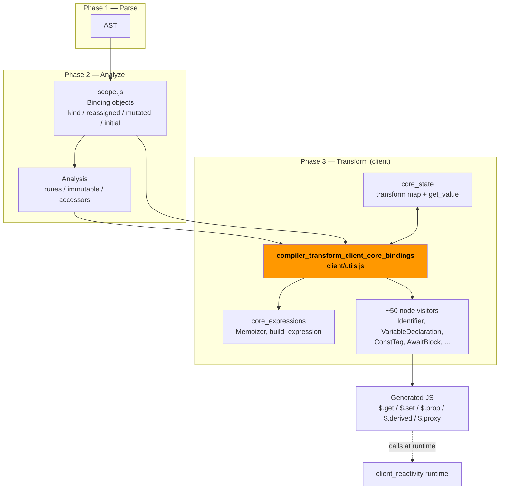

Upstream inputs come from [compiler_analyze](compiler_analyze.md) (the `Analysis` object) and `phases/scope.js` in [compiler_core](compiler_core.md) (the `Binding` class). Downstream, the emitted calls are executed by the runtime documented in [client_reactivity](client_reactivity.md).

---

## The two inputs everything depends on

### `Binding` (from `phases/scope.js`)

| Field | Meaning for this module |
| --- | --- |
| `kind` | `state`, `raw_state`, `derived`, `prop`, `bindable_prop`, `rest_prop`, `store_sub`, `legacy_reactive`, `normal` |
| `reassigned` | The variable itself was assigned (`x = 1`) |
| `mutated` | Something inside it was changed (`x.y = 1`) |
| `updated` | Getter: `mutated \|\| reassigned` |
| `initial` | The declared value (for `let {foo = 'bar'} = $props()` this is `'bar'`) |
| `declaration_kind` | `let` / `const` / `var` / `import` / … |
| `node` | The declaring `Identifier` |
| `prop_alias` | The external name, e.g. `class` in `{ class: klass } = $props()` |

### `ClientTransformState` / `ComponentClientTransformState`

Defined in `client/types.d.ts` and described in [compiler_transform_client_core_state](compiler_transform_client_core_state.md). The pieces this module reads:

- `state.analysis` — `runes`, `immutable`, `accessors`
- `state.scope` — current lexical `Scope`
- `state.transform` — the **transform map**: `name → { read, assign, mutate, update }`

The transform map is the shared contract between this module and `core_state`. `core_state` *fills* it; `build_getter` *consumes* it.

---

## Component reference

### 1. `is_state_source(binding, analysis) → boolean`

Decides whether a `$state` / `$state.raw` declaration must be backed by a real signal (`$.state(...)`), or whether it can be compiled down to a plain JS variable.

```js
return (
  (binding.kind === 'state' || binding.kind === 'raw_state') &&
  (!analysis.immutable || binding.reassigned || analysis.accessors)
);
```

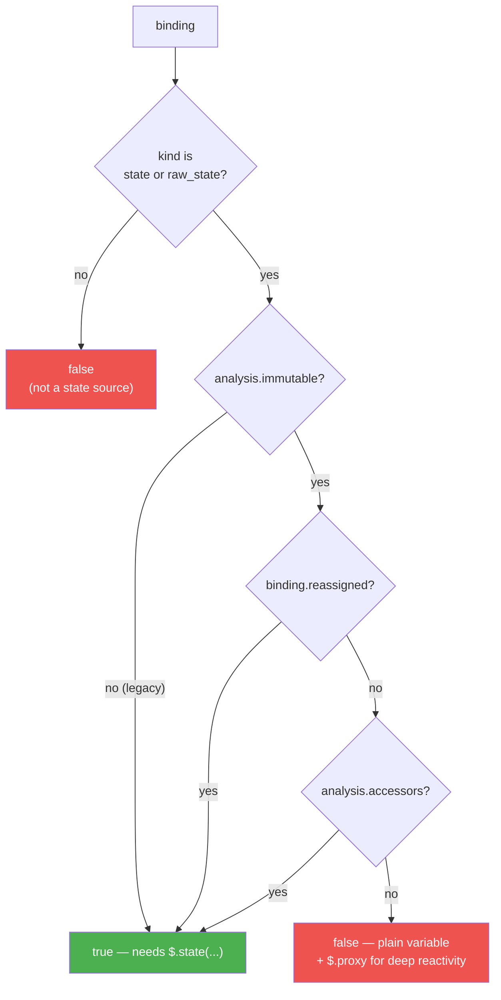

**Why the optimisation matters.** `let obj = $state({a: 1})` that is only ever *mutated* (`obj.a = 2`) and never *reassigned* does not need a signal cell at all — the `$.proxy` wrapper around the object already provides fine-grained reactivity. Skipping the signal removes a `$.get()` on every read.

**Consumers:**

| Consumer | Use |
| --- | --- |
| `transform-client.js` `set_scope` | Deletes non-source `state` names from `state.transform` when entering a scope, so reads stay untransformed |
| `visitors/shared/declarations.js::add_state_transformers` | Only installs `read`/`assign`/`mutate`/`update` entries for real sources |
| `visitors/VariableDeclaration.js` | Chooses between `b.call('$.state', value)` and a bare declarator |

---

### 2. `build_getter(node, state) → Expression`

The single funnel through which **every identifier read** in the client output passes.

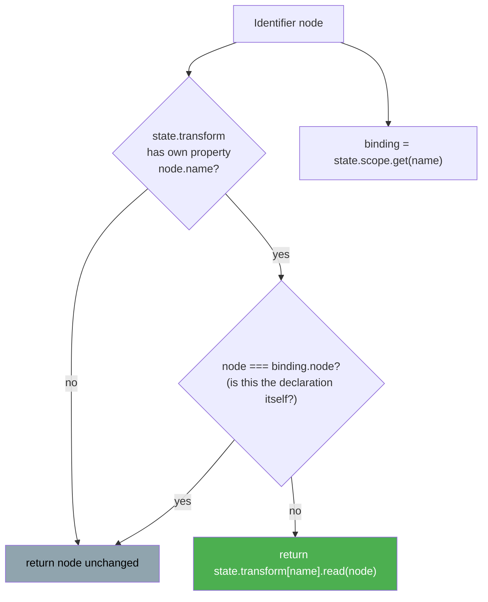

Two guards make this safe:

1. `Object.hasOwn` — avoids picking up inherited `Object.prototype` keys when a variable is literally called `toString` or `constructor`.
2. `node !== binding.node` — the *declaration site* must never be rewritten. Without this, `let count = $state(0)` would become `let $.get(count) = ...`.

What `read()` actually produces is decided by whoever registered the entry:

| Binding kind | Registered by | `read(node)` emits |
| --- | --- | --- |
| state source / derived / legacy_reactive | `add_state_transformers` | `$.get(node)` |
| same, but declared with `var` | `add_state_transformers` | `$.safe_get(node)` (hoisting-safe) |
| prop / bindable_prop that *is* a prop source | `visitors/Program.js` | `node()` — the `$.prop` accessor is a function |
| store subscription (`$foo`) | `visitors/Program.js` | `$.store_get(...)` |

**Consumers:** `visitors/Identifier.js` (the general case), plus `transform-client.js`, `LabeledStatement.js`, `RegularElement.js`, `Program.js`, and `visitors/shared/utils.js` (see [compiler_transform_client_core_expressions](compiler_transform_client_core_expressions.md)). The server transform has its own separate `build_getter` — see [compiler_transform_server](compiler_transform_server.md).

---

### 3. `build_hoisted_params(node, context)` (+ private `get_hoisted_params`)

When the analysis phase marks a function as `hoisted` (typically an event handler that closes over nothing component-instance-specific), the transform moves that function **out of the component body** so it is created once per module instead of once per instance. But a hoisted function can no longer close over instance variables — so those variables must be passed in as extra arguments.

This helper computes that extra parameter list.

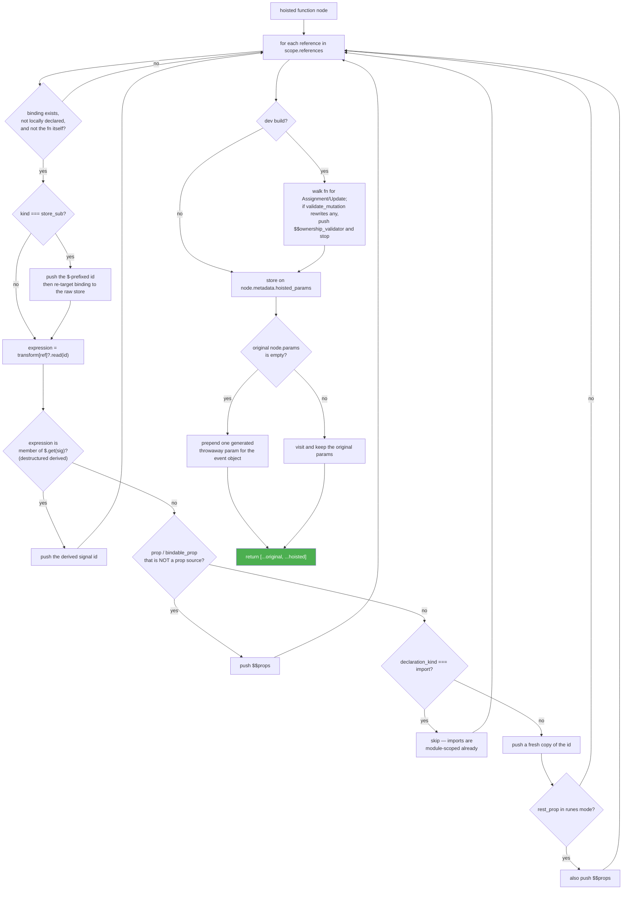

Key details:

- **`push_unique`** guards against name clashes — the same identifier may be reached through several references.
- **Store subscriptions need two params.** `$count` is used for reading and `count` for writing, so both are pushed.
- **The empty-params pad.** A hoisted handler is still called by the DOM as `handler(event, ...hoisted)`. If the source function declared no parameters, a throwaway one (`_`, `_1`, …) is inserted so the hoisted values line up at the right argument positions.
- **`node.metadata.hoisted_params`** is written as a side effect. The call sites that *invoke* the hoisted function (e.g. event delegation in [compiler_transform_client_directives](compiler_transform_client_directives.md)) read this metadata to build the matching argument list. This is the module's one piece of shared mutable state — parameters and arguments must agree, so they are derived from the same array.
- **`$$ownership_validator`** is dev-only. `validate_mutation` (from `core_expressions`) rewrites prop mutations into `$$ownership_validator.mutation(...)`; the walk here just *probes* whether that would happen, and if so adds the validator to the parameter list.

**Consumers:** `visitors/FunctionDeclaration.js` and `visitors/shared/function.js::visit_function` (which covers `FunctionExpression` and `ArrowFunctionExpression`).

---

### 4. `is_prop_source(binding, state) → boolean`

Decides whether a prop needs the reactive `$.prop(...)` accessor, or whether a plain `$$props.foo` read is enough.

```js
(binding.kind === 'prop' || binding.kind === 'bindable_prop') &&
(!state.analysis.runes ||     // legacy mode: always
 state.analysis.accessors ||  // component exposes get/set
 binding.reassigned ||        // child writes to it
 binding.initial ||           // has a default value
 binding.updated)             // mutated — parent may be legacy
```

In pure runes mode, a read-only prop with no default is *just* a property lookup on `$$props`. That is the fast path; anything that needs fallback values, write-back, or legacy coarse-grained interop takes the `$.prop` path.

---

### 5. `get_prop_source(binding, state, name, initial) → CallExpression`

Builds the actual `$.prop($$props, 'name', flags, fallback)` call. It packs four booleans into a single integer flag argument (constants from `src/constants.js`, read by `internal/client/reactivity/props.js`).

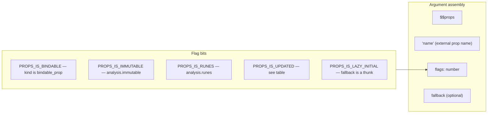

| Flag | Value | Set when |
| --- | --- | --- |
| `PROPS_IS_IMMUTABLE` | `1` | `analysis.immutable` |
| `PROPS_IS_RUNES` | `1 << 1` | `analysis.runes` |
| `PROPS_IS_UPDATED` | `1 << 2` | `accessors`, or in immutable mode `reassigned \|\| (runes && mutated)`, else `updated` |
| `PROPS_IS_BINDABLE` | `1 << 3` | `binding.kind === 'bindable_prop'` |
| `PROPS_IS_LAZY_INITIAL` | `1 << 4` | the fallback had to be wrapped in a thunk |

**Fallback handling** is the interesting part — a default value must not be evaluated when the prop *is* supplied:

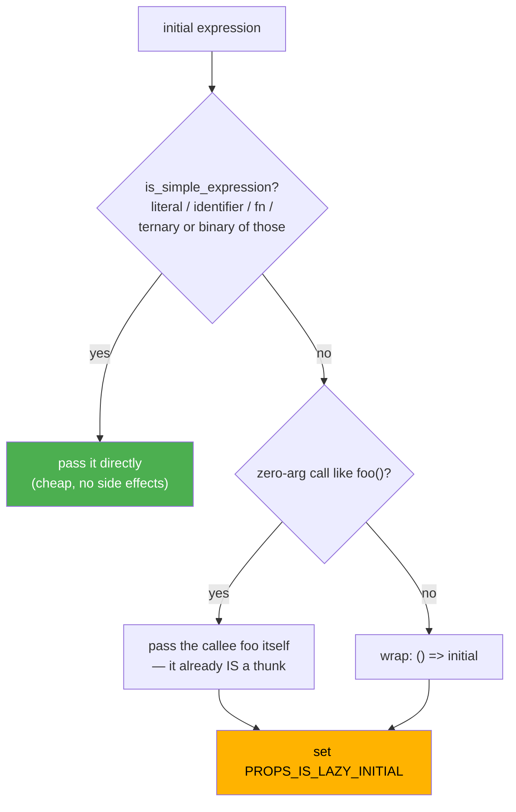

The `foo()` → `foo` shortcut avoids allocating `() => foo()` when `foo` is already a nullary function.

**Consumer:** `visitors/VariableDeclaration.js`, which handles both destructured `$props()` and legacy `export let`. Note that when the prop is `bindable_prop` and the default is proxyable, `VariableDeclaration` wraps the initial in `$.proxy(...)` *before* handing it here — that decision uses `should_proxy`.

---

### 6. `should_proxy(node, scope) → boolean`

Decides whether a value assigned to `$state` needs `$.proxy(...)` for deep reactivity. Proxying primitives, functions, and other non-container values is pure overhead, so this filters them out.

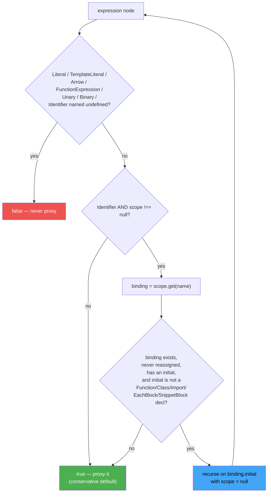

Two things worth noting:

- **The recursion passes `scope = null`.** This deliberately limits the analysis to one hop. `let a = 1; let b = a; let c = $state(b)` resolves `b → a`'s initial `1` → `false`, but does not chase further chains. It is a bounded heuristic, not a full constant-propagation pass.
- **Default is `true`.** When in doubt, proxy. A missed proxy would silently break reactivity; a redundant one only costs a little.

**Consumers:** `visitors/AssignmentExpression.js`, `visitors/CallExpression.js`, `visitors/VariableDeclaration.js`, and — unusually — `phases/2-analyze/visitors/Identifier.js`. That last one is a **backwards edge from the transform phase into the analyze phase**: analysis needs to know whether a value would be proxied in order to emit correct warnings, so it imports this transform helper directly.

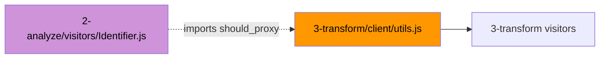

---

### 7. `create_derived(state, expression, async = false) → CallExpression`

Wraps an expression (or a `BlockStatement`, for multi-statement derivations) into a derived signal. Three output shapes:

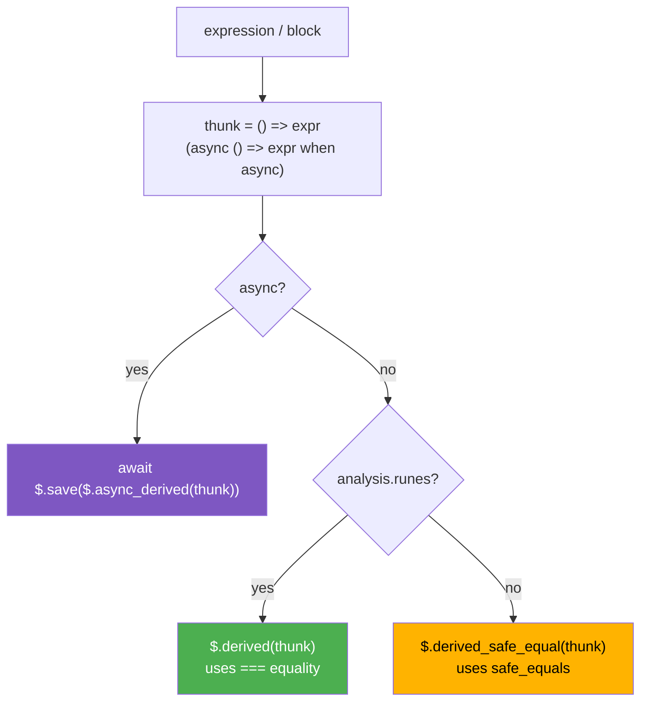

| Mode | Emitted | Equality | Why |
| --- | --- | --- | --- |
| runes | `$.derived(fn)` | `===` | Runes users opt into precise semantics |
| legacy | `$.derived_safe_equal(fn)` | `safe_equals` | Legacy code mutates objects in place; strict equality would miss those updates |
| async | `await $.save($.async_derived(fn))` | — | `$.save` preserves the surrounding reactive context across the `await` boundary |

**Consumers:** `visitors/ConstTag.js` (`{@const ...}`), `visitors/AwaitBlock.js` (the `then`/`catch` value bindings, including destructured ones), and `visitors/LetDirective.js` (`let:` slot props). See [compiler_transform_client_blocks](compiler_transform_client_blocks.md) and [compiler_transform_client_directives](compiler_transform_client_directives.md).

---

## Dependency graph

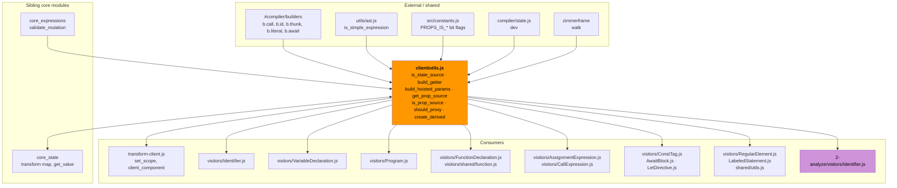

Note the **cycle with `core_expressions`**: `client/utils.js` imports `validate_mutation` from `visitors/shared/utils.js`, which in turn imports `build_getter` from `client/utils.js`. ES modules tolerate this because both imports are only touched at call time, not at module-evaluation time.

---

## End-to-end example

Source component:

```svelte
<script>
  let { label = compute(), onclick } = $props();
  let items = $state([]);
  const total = $derived(items.length);
</script>

<button {onclick}>{label}: {total}</button>
```

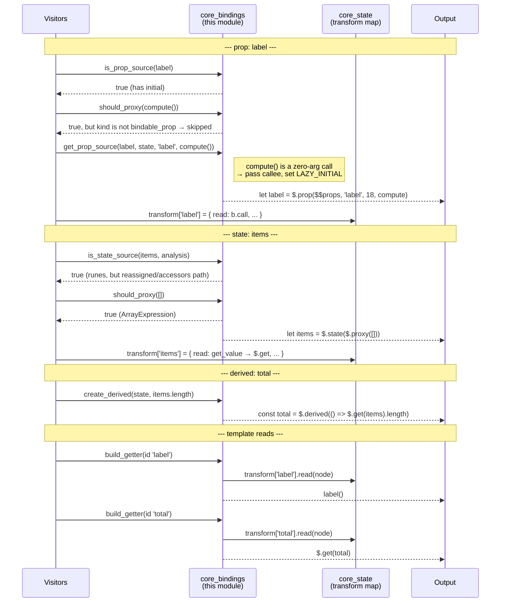

---

## Compiled-output → runtime contract

Everything this module emits is a call into the client runtime. The counterpart implementations live in the modules listed below.

| Emitted call | Runtime home | Doc |
| --- | --- | --- |
| `$.get(sig)` / `$.safe_get(sig)` | `internal/client/runtime.js` | [client_reactivity](client_reactivity.md) |
| `$.state(v)`, `$.set`, `$.update`, `$.update_pre` | `internal/client/reactivity/sources.js` | [client_reactivity](client_reactivity.md) |
| `$.derived`, `$.derived_safe_equal`, `$.async_derived` | `internal/client/reactivity/deriveds.js` | [client_reactivity](client_reactivity.md) |
| `$.save(...)` | `internal/client/reactivity/async.js` | [client_reactivity](client_reactivity.md) |
| `$.prop`, `$.rest_props`, `$.update_prop` | `internal/client/reactivity/props.js` | [client_reactivity](client_reactivity.md) |
| `$.proxy(...)` | `internal/client/proxy.js` | [client_reactivity](client_reactivity.md) |
| `$.store_get`, `$.store_unsub` | `internal/client/reactivity/store.js` | [client_store_interop](client_store_interop.md) |
| `$$ownership_validator.mutation(...)` | `internal/client/dev/ownership.js` | [client_dev_tooling](client_dev_tooling.md) |

The bit-flag integer passed to `$.prop` is the tightest coupling in the whole file: `src/constants.js` is shared verbatim between the compiler and the runtime, so both sides agree on the encoding.

---

## Design notes and gotchas

**Advice, not rewriting.** Six of the seven exports are either predicates or expression factories. Only `build_hoisted_params` mutates anything (`node.metadata.hoisted_params`), and that mutation exists purely so that parameter lists and argument lists at call sites stay in sync.

**Conservative defaults.** `should_proxy` returns `true` when it cannot prove otherwise; `is_prop_source` returns `true` for anything remotely uncertain. Both err toward "more machinery," because a false negative breaks reactivity silently while a false positive only costs bundle size and a little speed.

**Legacy mode leaks everywhere.** Four of the seven functions branch on `analysis.runes` or `analysis.immutable`. A child component compiled in runes mode can be used by a legacy parent, so the compiler cannot always take the fast path — this is why `is_prop_source` still checks `binding.updated` even in runes mode, with an in-code comment saying so.

**Dev-only paths.** `build_hoisted_params` gains a whole `zimmerframe` walk under `dev`, and callers add `$.tag_proxy` around proxied values. Production output is meaningfully leaner.

**Known rough edge.** The destructured-derived branch inside `get_hoisted_params` pattern-matches the *shape* of the generated AST (`$.get(x).y`) rather than consulting binding metadata, and carries a `TODO this code is bad, we need to kill it` comment. It is fragile against changes in how `core_state` emits derived reads.

---

## Related documentation

- [compiler_transform_client_core](compiler_transform_client_core.md) — parent module overview
- [compiler_transform_client_core_state](compiler_transform_client_core_state.md) — the transform map and `add_state_transformers`
- [compiler_transform_client_core_expressions](compiler_transform_client_core_expressions.md) — `Memoizer`, `build_expression`, `validate_mutation`
- [compiler_transform_client](compiler_transform_client.md) — the full client transform phase
- [compiler_transform_client_javascript](compiler_transform_client_javascript.md) — `Identifier`, `VariableDeclaration`, `AssignmentExpression` visitors
- [compiler_transform_client_blocks](compiler_transform_client_blocks.md) — `ConstTag`, `AwaitBlock` consumers of `create_derived`
- [compiler_transform_client_directives](compiler_transform_client_directives.md) — `LetDirective`, hoisted event handlers
- [compiler_analyze](compiler_analyze.md) — where `Binding.kind`, `reassigned`, `mutated` are computed
- [compiler_core](compiler_core.md) — `scope.js`, `builders.js`
- [compiler_transform_server](compiler_transform_server.md) — the SSR counterpart with its own `build_getter`
- [client_reactivity](client_reactivity.md) — runtime implementations of every emitted call
