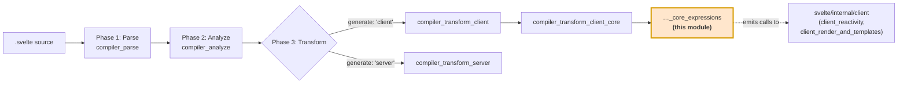
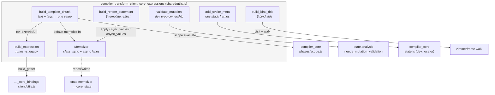
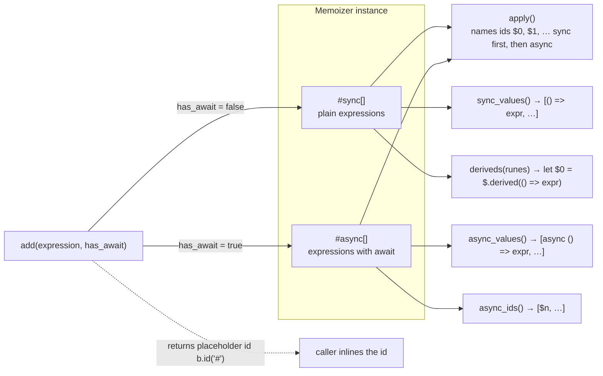
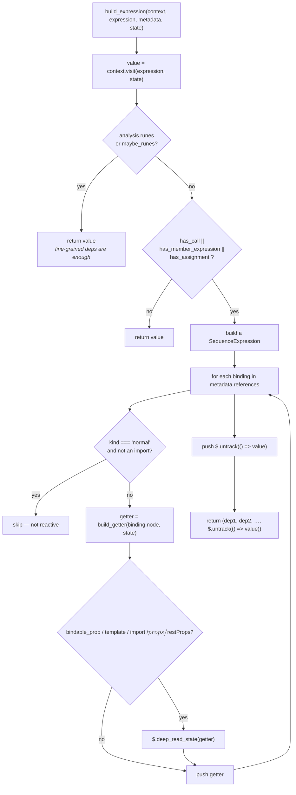
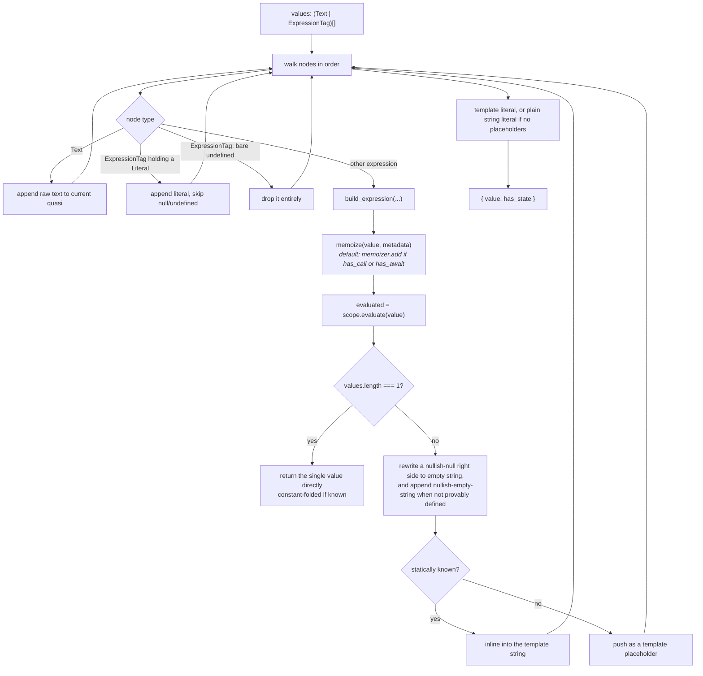
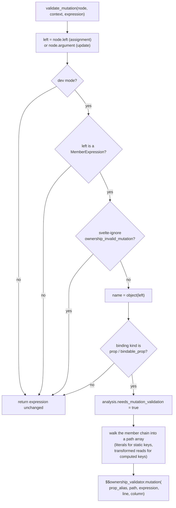
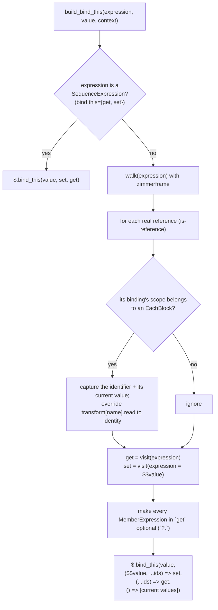
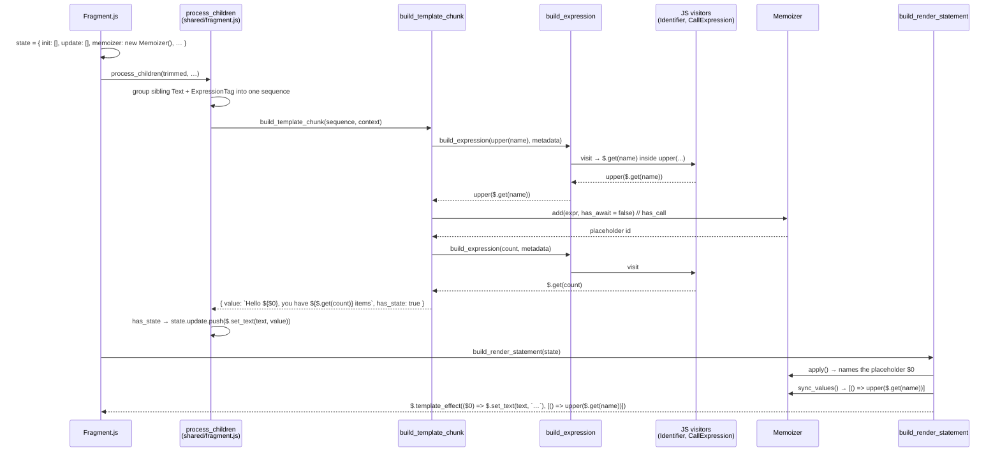
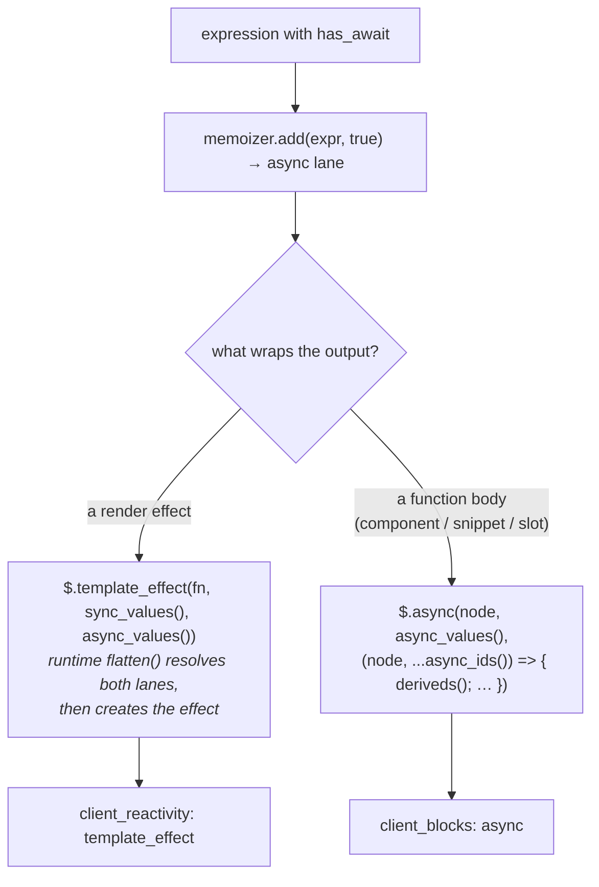

# compiler_transform_client_core_expressions

## 1. What This Module Is

`compiler_transform_client_core_expressions` is one file:
`packages/svelte/src/compiler/phases/3-transform/client/visitors/shared/utils.js`.

It is the **expression layer** of Svelte's client code generator. Every time a client visitor has a
piece of JavaScript that came out of a template — `{count}`, `class={cls}`, `{#if a > b}`,
`{@render row(item)}`, `bind:this={el}` — that expression has to be turned into runtime code. This
file holds the seven helpers that do that work, so no visitor has to invent its own rules.

The questions this module answers:

| Question a visitor asks | Helper that answers it |
| --- | --- |
| "This expression calls a function or awaits. Where do I park it so it is only recomputed when needed?" | `Memoizer` |
| "How do I emit this expression so that it works in both runes mode and legacy mode?" | `build_expression` |
| "I have `hello {name}, you have {n} items` — how do I make one string out of it?" | `build_template_chunk` |
| "I collected a pile of update statements. How do I wrap them in a render effect?" | `build_render_statement` |
| "Someone is mutating a prop. Should I warn about it in dev?" | `validate_mutation` |
| "How do I turn `bind:this={foo.bar}` into a get/set pair?" | `build_bind_this` |
| "How do I attach source location info so dev-mode error stacks are useful?" | `add_svelte_meta` |

Two more helpers live in the same file and are used by neighbours, but are not core components:
`parse_directive_name` (turns `use:a.b-c` into a member expression) and `validate_binding` (dev-mode
`bind:` validation, called by `BindDirective` and `build_component`).

This module is a **sibling** of two other core sub-modules and is best read together with them:

- [compiler_transform_client_core_state](compiler_transform_client_core_state.md) — the mutable
  workbench (`init` / `update` / `after_update` / `memoizer` / `transform`) that this module writes into.
- [compiler_transform_client_core_bindings](compiler_transform_client_core_bindings.md) — binding-level
  decisions (`build_getter`, `should_proxy`, `create_derived`) that this module calls into.

Parent: [compiler_transform_client_core](compiler_transform_client_core.md).

---

## 2. Where It Sits In The Compiler



Phase 2 does the thinking; this module does the writing.

[compiler_analyze_expression_metadata](compiler_analyze_expression_metadata.md) attaches an
`ExpressionMetadata` object to every template expression:

```ts
interface ExpressionMetadata {
  dependencies: Set<Binding>;   // read eagerly (not inside a function)
  references: Set<Binding>;     // read anywhere, including inside functions
  has_state: boolean;           // reads state, or might
  has_call: boolean;            // contains a call expression
  has_await: boolean;           // contains `await`
  has_member_expression: boolean;
  has_assignment: boolean;
}
```

This module **only reads** those flags. It never recomputes them. That split is important: if a
generated component updates too often or not often enough, the bug is usually in phase 2's metadata,
not here.

---

## 3. Component Map



External dependencies used by this file:

| Import | From | Why |
| --- | --- | --- |
| `b` (builders) | `compiler/utils/builders.js` ([compiler_core](compiler_core.md)) | Every AST node it emits |
| `build_getter` | `client/utils.js` ([…_core_bindings](compiler_transform_client_core_bindings.md)) | Legacy dependency reads |
| `object`, `sanitize_template_string` | `compiler/utils` | Root of a member chain; safe template literals |
| `dev`, `is_ignored`, `locator`, `component_name` | `compiler/state.js` | Dev-only output and source positions |
| `walk` | `zimmerframe` | Scan `bind:this` expressions for each-block variables |
| `is_reference` | `is-reference` | Tell a real variable read from a property name |

---

## 4. `Memoizer` — Hoisting Expensive Expressions

### The problem

A render effect re-runs when any of its dependencies change. If the template says
`{format(a)} and {b}`, a change to `b` should not re-run `format(a)`. Also, `await` cannot be
evaluated inline inside a synchronous render effect.

### The solution

`Memoizer` is a small collector with **two lanes**:



API in order of use:

| Method | Returns | Notes |
| --- | --- | --- |
| `add(expression, has_await)` | an `Identifier` placeholder named `'#'` | The name is filled in later. Callers can safely inline the returned node. |
| `apply()` | all ids, renamed `$0`, `$1`, … | **Must be called once, after all `add()` calls.** Sync entries are numbered first, then async. |
| `sync_values()` | `[() => expr, …]` array, or `undefined` if empty | Thunks for the sync lane |
| `async_values()` | `[async () => expr, …]`, or `undefined` | Async thunks for the async lane |
| `deriveds(runes)` | `let $0 = $.derived(() => expr)` statements | Used where a `$.template_effect` is not the wrapper (components, snippets, slots). `runes === false` emits `$.derived_safe_equal` instead. |
| `async_ids()` | just the async lane ids | Used as the parameter list of an `$.async(...)` callback |

### The two-lane ordering contract

`apply()` numbers sync entries before async entries. That order must match how the runtime hands
values back:

```js
// packages/svelte/src/internal/client/reactivity/effects.js
export function template_effect(fn, sync = [], async = []) {
  flatten(sync, async, (values) => {
    create_effect(RENDER_EFFECT, () => fn(...values.map(get)), true);
  });
}
```

`flatten` concatenates sync then async, so `$0…$n` line up positionally. If you add a third lane, or
reorder the lanes in `apply()`, you must change `flatten`/`template_effect` too. This is the single
most fragile invariant in the module.

### Who creates a Memoizer

Most visitors reuse `context.state.memoizer` (one per fragment). Some create a **local** one because
their output is a separate function body, not a render effect:

| Owner | Where | Wrapper it feeds |
| --- | --- | --- |
| `Fragment.js` | `new Memoizer()` per fragment | `$.template_effect(...)` via `build_render_statement` |
| `SvelteElement.js` | per dynamic element body | `$.template_effect(...)` |
| `shared/element.js` (`build_attribute_effect`) | per spread-attribute effect | `$.attribute_effect(...)` |
| `shared/component.js` (`build_component`) | per component | `deriveds()` + optional `$.async(...)` |
| `RenderTag.js`, `SlotElement.js` | per `{@render}` / `<slot>` | `deriveds()` + optional `$.async(...)` |

---

## 5. `build_expression` — One Expression, Two Reactivity Models

This is the wrapper that every visitor should use instead of calling `context.visit(expression)`
directly. It first visits (so `Identifier`/`MemberExpression`/`CallExpression` visitors from
[compiler_transform_client_javascript](compiler_transform_client_javascript.md) rewrite reads into
`$.get(...)` and friends), then decides whether legacy compatibility code is needed.



### Why the sequence expression

Svelte 4 (legacy) reactivity was **coarse-grained**: it looked at the identifiers you could see in
the source, not at what actually got read at runtime. `foo.bar()` re-ran whenever `foo` changed, even
if the call never touched the changing part.

To keep that behaviour, the legacy path emits a comma sequence that:

1. reads every statically visible reference first, so the effect subscribes to all of them
   (`$.deep_read_state` walks objects deeply for props and imports, matching Svelte 4);
2. evaluates the real value last inside `$.untrack(...)`, so the value itself adds no extra
   dependencies.

`maybe_runes` is treated like runes on purpose. Components that never opted in explicitly were being
broken by a stricter rule, so this in-between mode bails out of the legacy path.

---

## 6. `build_template_chunk` — Text and Tags Into One Value

Input: a run of sibling `Text` and `ExpressionTag` nodes (`hello {name}!`). Output: one expression
plus a `has_state` flag telling the caller whether it needs to go in `state.update` (reactive) or
`state.init` (once).



Behaviours worth knowing:

- **Single-expression fast path.** For `{value}` alone, the raw expression is returned rather than a
  template literal. The runtime `$.set_text` does the string conversion, which avoids extra work
  inside the render effect.
- **Constant folding.** `state.scope.evaluate(value)` (from `phases/scope.js`, see
  [compiler_core](compiler_core.md)) can prove some expressions constant. Those are baked into the
  string and do **not** count towards `has_state`.
- **Nullish handling.** In a multi-part template, `null`/`undefined` must render as `''`, not
  `"null"`. So `?? ''` is appended unless the value is provably defined, and an existing
  `x ?? null` / `x || null` gets its right side rewritten to `''`.
- **`undefined` identifier.** A literal `{undefined}` is dropped — unless a local variable named
  `undefined` shadows it in scope.
- **`has_state` is sticky for await.** `has_await` forces `has_state`, because an awaited value
  always resolves later.
- **Custom memoize hooks.** `shared/element.js` passes its own `memoize` so attribute values land in
  a local memoizer instead of the fragment one.

Callers: `shared/fragment.js` (`process_children`), `TitleElement.js`, `RegularElement.js`,
`shared/element.js` (`build_attribute_value`). See
[compiler_transform_client_template](compiler_transform_client_template.md) and
[compiler_transform_client_elements](compiler_transform_client_elements.md).

---

## 7. `build_render_statement` — Sealing the Render Effect

Small function, big role. It takes a finished
[state](compiler_transform_client_core_state.md) and turns `state.update` plus `state.memoizer` into
one statement:

```js
$.template_effect(
  ($0, $1) => { /* state.update statements */ },
  [() => sync_expr],        // memoizer.sync_values()
  [async () => async_expr]  // memoizer.async_values()
);
```

Details:

- `memoizer.apply()` is called here, which is what finally names the placeholders. So this call must
  happen **after** all visiting is done.
- If `state.update` is exactly one `ExpressionStatement`, the arrow body is that expression instead
  of a block — smaller output.
- Callers guard with `if (state.update.length > 0)`; the helper itself does not check.

`Fragment.js`, `SvelteElement.js` and `RegularElement.js` (for `contenteditable` child state) are the
three callers.

---

## 8. `validate_mutation` — Dev-Only Prop Ownership Checks

Mutating a prop from a child component is legal JavaScript but usually a bug in Svelte. In dev mode
this helper wraps the mutation so the runtime can warn.



Notes:

- The function is **pass-through by design**. Callers do `return validate_mutation(node, context, expr)`
  and get `expr` back unchanged in production. That is why `client/utils.js` can use
  `validate_mutation(node, ctx, node) !== node` as a cheap "would this need the validator?" probe when
  deciding whether a hoisted function needs an extra `$$ownership_validator` parameter.
- Setting `analysis.needs_mutation_validation` is what makes the component prologue declare
  `$$ownership_validator`.
- Callers: `AssignmentExpression.js`, `UpdateExpression.js` (see
  [compiler_transform_client_javascript](compiler_transform_client_javascript.md)) and
  `client/utils.js` (`build_hoisted_params`).
- Runtime side: `create_ownership_validator` in
  [client_dev_tooling](client_dev_tooling.md).

---

## 9. `build_bind_this` — Two-Way Binding to a Node or Component Instance

`bind:this={x}` needs a getter and a setter, because the runtime must write the node in on mount and
write `null` back on teardown.



Why the each-block capture exists: on teardown the runtime must null out the *same* slot it wrote to.
If the binding target is `items[i].el` inside `{#each}`, `i` may have moved on. So the loop variables
are passed in as extra arguments and snapshotted with a thunk. The code comment is explicit that this
is a Svelte-4-compatible approximation — a member expression with several changing computed parts can
still go stale. That is a known limitation, not a bug to "fix" casually.

The optional-chaining step (`get.object?.…`) prevents runtime exceptions when the target object does
not exist yet.

Callers: `BindDirective.js` (elements, see
[compiler_transform_client_directives](compiler_transform_client_directives.md)) and
`shared/component.js` (components, see
[compiler_transform_client_components](compiler_transform_client_components.md)). Runtime side:
`bind_this` in [client_bindings](client_bindings.md).

---

## 10. `add_svelte_meta` — Dev Stack Frames for Blocks

In dev mode Svelte keeps its own "component stack" so that errors and `$inspect.trace` can say
*which* `{#each}` in *which* component went wrong. This helper wraps a block-creating call in that
bookkeeping.

```js
// production
$.if(node, ($$render) => { … });

// dev
$.add_svelte_meta(
  () => $.if(node, ($$render) => { … }),
  'if',
  App,        // component_name
  12, 1       // line, column
);
```

- Returns a plain `b.stmt(expression)` when `dev` is false, or when the node has no usable start
  offset. So callers never need their own `if (dev)`.
- `type` is one of `'component' | 'if' | 'each' | 'await' | 'key' | 'render'`.
- `additional` adds extra fields to the stack frame (for example each-block index info).
- Runtime counterpart: `add_svelte_meta` in `internal/client/context.js`, which pushes/pops
  `dev_stack` around the callback; `block()` in
  [client_reactivity](client_reactivity.md) then stores `dev_stack` on the effect.

Callers: `IfBlock.js`, `EachBlock.js`, `AwaitBlock.js`, `KeyBlock.js`, `RenderTag.js` (see
[compiler_transform_client_blocks](compiler_transform_client_blocks.md)) and `shared/component.js`.

---

## 11. End-to-End Data Flow

Take this template:

```svelte
<p>Hello {upper(name)}, you have {count} items</p>
```



Roughly the emitted code:

```js
var root = $.from_html(`<p> </p>`);

function App($$anchor, $$props) {
  let name = $.prop($$props, 'name');
  let count = $.prop($$props, 'count');

  var p = root();
  var text = $.child(p);

  $.template_effect(
    ($0) => $.set_text(text, `Hello ${$0}, you have ${$.get(count)} items`),
    [() => upper($.get(name))]
  );

  $.append($$anchor, p);
}
```

Note the division of labour: `upper(name)` is a call, so it becomes a memoized `$0` that is only
recomputed when `name` changes. `count` is a plain read and is inlined.

---

## 12. Async (`await` in Templates)

Async templates are the reason `Memoizer` has two lanes. An awaited expression cannot be evaluated
inside a synchronous render effect, so it must be resolved *before* the code that uses it runs.



The two shapes:

- **Render effect shape** (`build_render_statement`) — both lanes go to `$.template_effect`, and the
  arrow takes all ids in `apply()` order.
- **Callback shape** (`RenderTag.js`, `SlotElement.js`, `shared/component.js`) — the async lane goes
  to `$.async(...)` as an argument list, `async_ids()` become the callback's parameters, and the sync
  lane becomes `let $n = $.derived(...)` statements from `deriveds(runes)`. When `async_values()`
  returns `undefined` the `$.async` wrapper is skipped entirely.

Also relevant: `Fragment.js` wraps a whole fragment body in `$.async_body(...)` and inserts an
`if ($.aborted()) return;` guard when the fragment contains `await`.

---

## 13. Dev vs Production Output

| Helper | Production | Dev extra |
| --- | --- | --- |
| `Memoizer` | same | same |
| `build_expression` | same | same |
| `build_template_chunk` | same | same |
| `build_render_statement` | same | same |
| `validate_mutation` | identity | `$$ownership_validator.mutation(...)` wrapper |
| `validate_binding` (non-core, same file) | nothing | `$.validate_binding(...)` pushed into `state.init` |
| `build_bind_this` | same | same |
| `add_svelte_meta` | `b.stmt(expression)` | `$.add_svelte_meta(() => expr, type, Component, line, col)` |

The `dev` flag and `locator` come from `compiler/state.js`
([compiler_core](compiler_core.md)) — module-level state set once per compile, not passed as
arguments.

---

## 14. Maintainer Notes

Things that will bite you:

1. **`apply()` exactly once, and last.** It mutates the placeholder identifiers in place. Calling it
   before all `add()` calls have happened produces ids named `#` in the output. Calling it twice
   renumbers ids that other emitted code already refers to.
2. **Lane order is a cross-boundary contract.** `apply()` numbers sync before async; the runtime's
   `flatten(sync, async, …)` concatenates in the same order. Change one, change both.
3. **Placeholder identity matters.** `add()` returns the *same node object* it later renames.
   Cloning or re-creating that identifier breaks the link and the name never lands.
4. **Do not bypass `build_expression`.** Calling `context.visit(expr)` directly skips the legacy
   coarse-grained dependency sequence, which silently breaks reactivity in non-runes components.
5. **`has_state` decides `init` vs `update`.** Getting it wrong makes output either stale or
   needlessly re-rendered. Trust `ExpressionMetadata`; don't guess.
6. **Local vs shared memoizer.** If your output is a separate function body (a component, a snippet,
   a slot), create a local `Memoizer`. Using `state.memoizer` puts your ids in a render effect that
   is in a different scope, and the generated code will not resolve them.
7. **`validate_mutation` must stay pass-through.** `build_hoisted_params` depends on the
   `!== expression` identity check to detect that the validator is needed.
8. **`build_bind_this`'s each-block staleness is intentional.** It matches Svelte 4 behaviour; the
   comment in the source says it should be revisited only once legacy mode is gone.

---

## 15. Related Modules

| Module | Relationship |
| --- | --- |
| [compiler_transform_client_core](compiler_transform_client_core.md) | Parent — the shared foundation layer |
| [compiler_transform_client_core_state](compiler_transform_client_core_state.md) | The `init`/`update`/`memoizer`/`transform` workbench this module reads and writes |
| [compiler_transform_client_core_bindings](compiler_transform_client_core_bindings.md) | `build_getter`, `should_proxy`, `create_derived` used by `build_expression` |
| [compiler_analyze_expression_metadata](compiler_analyze_expression_metadata.md) | Produces the `ExpressionMetadata` flags this module branches on |
| [compiler_transform_client_template](compiler_transform_client_template.md) | `Fragment` / `process_children` — biggest consumer of `build_template_chunk` |
| [compiler_transform_client_blocks](compiler_transform_client_blocks.md) | `{#if}`, `{#each}`, `{#await}`, `{#key}`, `{@render}` — use `build_expression` + `add_svelte_meta` |
| [compiler_transform_client_elements](compiler_transform_client_elements.md) | Attribute values, class/style directives — local memoizers |
| [compiler_transform_client_directives](compiler_transform_client_directives.md) | `bind:this` via `build_bind_this`; `bind:` validation |
| [compiler_transform_client_components](compiler_transform_client_components.md) | `build_component` — local memoizer, `bind:this`, dev meta |
| [compiler_transform_client_javascript](compiler_transform_client_javascript.md) | The visitors that `build_expression` delegates to; callers of `validate_mutation` |
| [client_reactivity](client_reactivity.md) | Runtime side: `template_effect`, `derived`, `untrack`, `block` |
| [client_render_and_templates](client_render_and_templates.md) | Runtime side: `set_text`, `child`, `sibling`, `add_svelte_meta` |
| [client_blocks](client_blocks.md) | Runtime side: `async`, `snippet`, `if`, `each` |
| [client_bindings](client_bindings.md) | Runtime side: `bind_this` |
| [client_dev_tooling](client_dev_tooling.md) | Runtime side: ownership validator, dev stack consumers |
| [compiler_transform_server](compiler_transform_server.md) | The SSR counterpart — same AST in, no reactivity, so none of this machinery |
| [compiler_core](compiler_core.md) | `builders.js`, `state.js` (`dev`, `locator`), `scope.js` (`evaluate`) |
