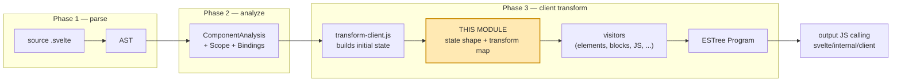
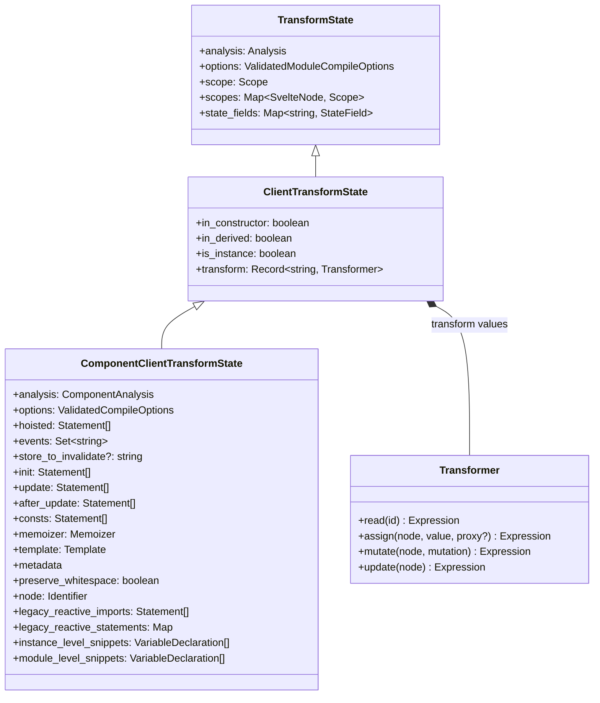
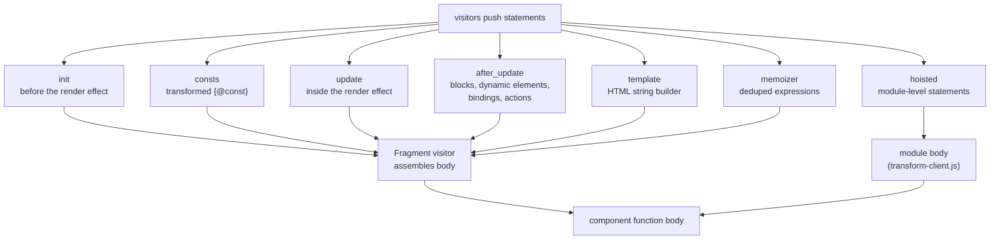
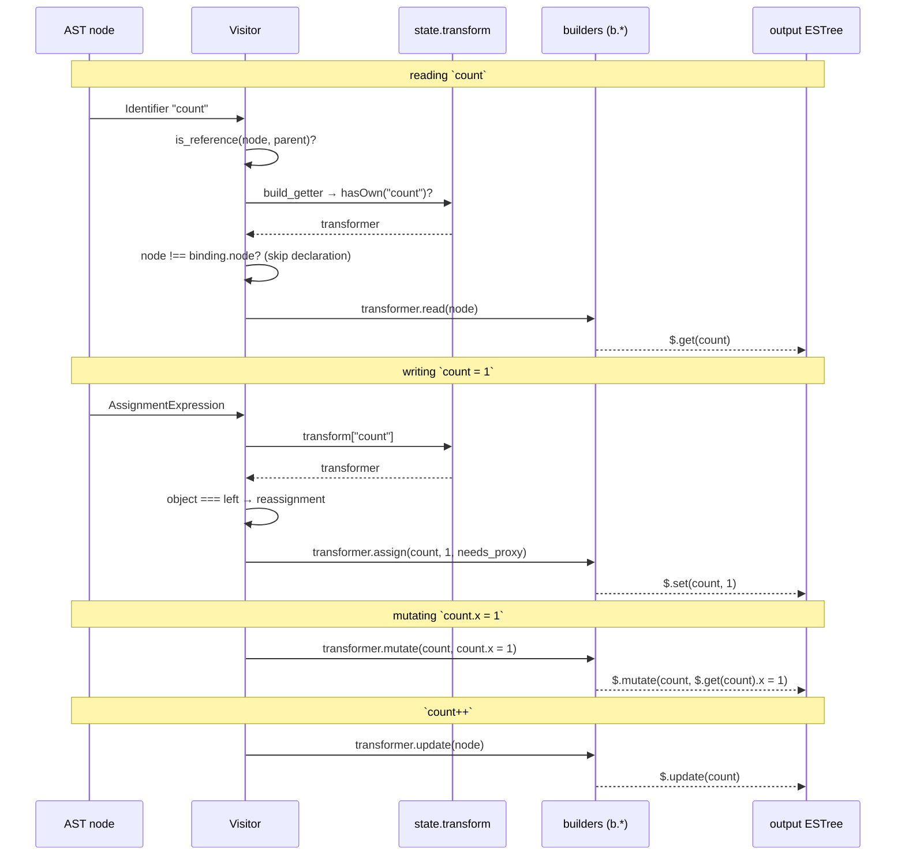
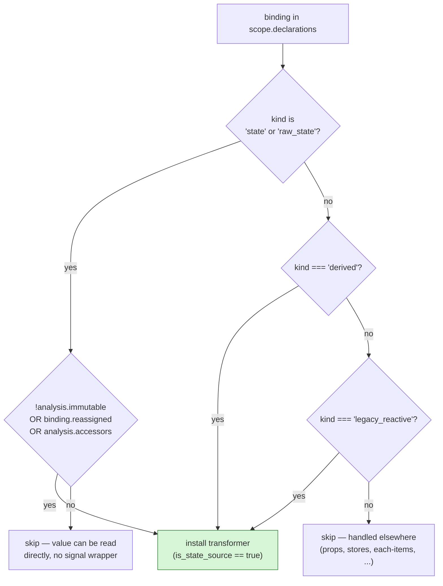
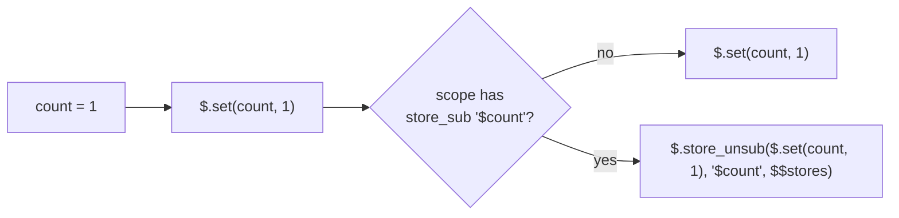
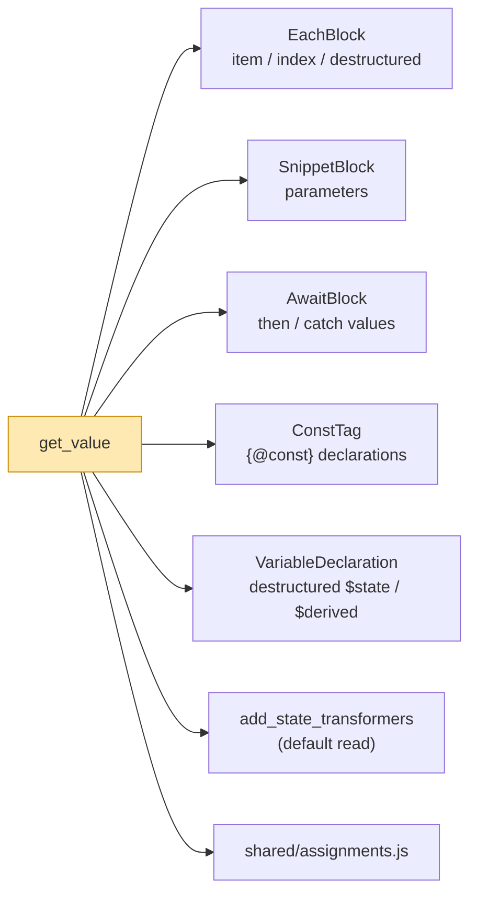
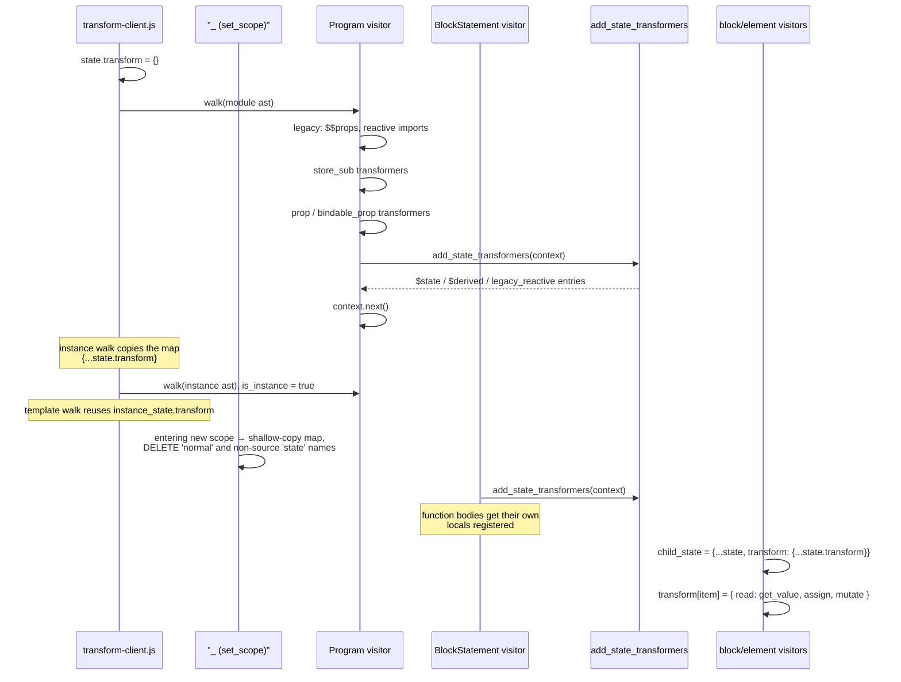
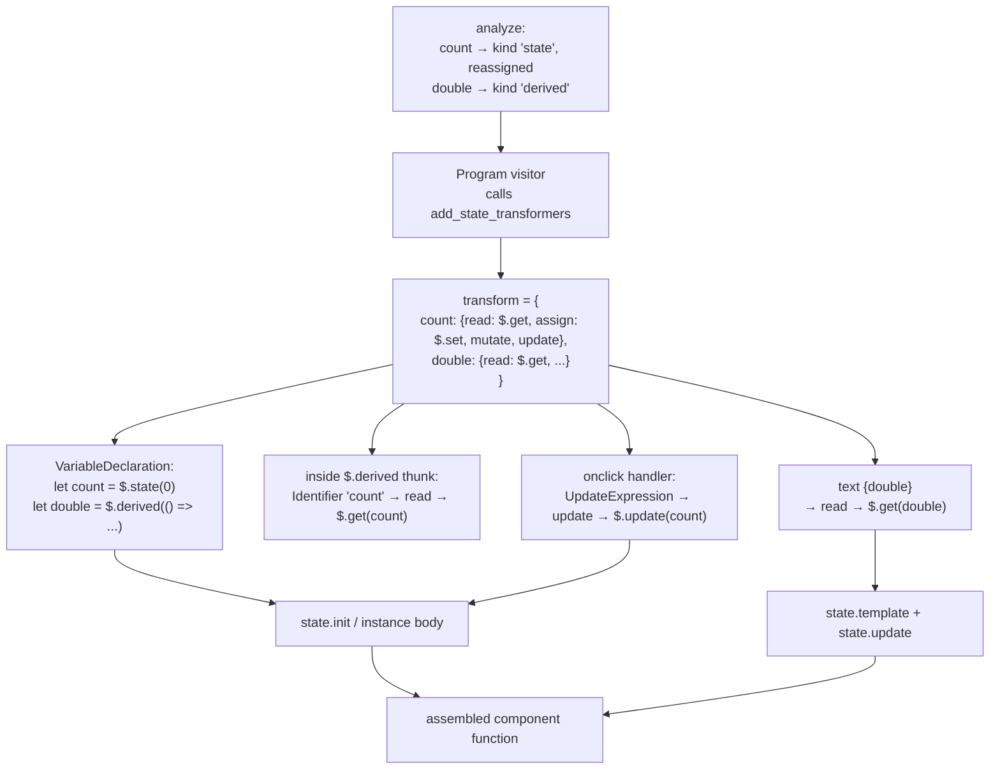
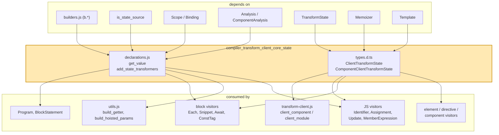

# compiler_transform_client_core_state

## Introduction

This module is the **memory of the client transform**. When Svelte turns a `.svelte` file into browser JavaScript, it has to rewrite every read and every write of reactive data. A plain `count` in your source has to become `$.get(count)`. A plain `count = 1` has to become `$.set(count, 1)`. Something must decide, for each name, what that rewrite looks like.

That "something" is this module. It has two parts:

1. **The state shape** (`types.d.ts`) — `ClientTransformState` and `ComponentClientTransformState`. These describe every piece of information the transform carries as it walks the AST: the current scope, the code buckets it is filling in, the flags telling it where it is, and — most importantly — the `transform` map.
2. **The state transformer factory** (`declarations.js`) — `get_value` and `add_state_transformers`. These fill the `transform` map with rewrite rules for `$state`, `$derived`, and legacy `$:` reactive variables.

Nothing here emits final code by itself. Instead it defines the *contract* that every other client visitor obeys. Change the contract here and the whole client output changes.

---

## 1. Where this module sits

The client transform is phase 3 of the compiler. Phase 1 parses, phase 2 analyzes (and produces `Binding` records with a `kind`), phase 3 rewrites.



Related module docs:

- [compiler_analyze](compiler_analyze.md) — produces the `Binding.kind` values this module keys off.
- [compiler_core](compiler_core.md) — `scope.js` (`Scope`, `Binding`) and `builders.js` (the `b.*` helpers).
- [compiler_transform_client_core_bindings](compiler_transform_client_core_bindings.md) — `is_state_source`, `build_getter`, `get_prop_source`, `is_prop_source`, `should_proxy`, `create_derived`.
- [compiler_transform_client_core_expressions](compiler_transform_client_core_expressions.md) — `Memoizer`, `build_expression`, `validate_mutation`.
- [compiler_transform_client_template](compiler_transform_client_template.md) — the `Template` object held in state.
- [compiler_transform_client_javascript](compiler_transform_client_javascript.md) — the main consumer of the `transform` map.
- [client_reactivity](client_reactivity.md) — the runtime side: `$.get`, `$.set`, `$.update`, `$.mutate`.
- [client_store_interop](client_store_interop.md) — `$.store_get`, `$.store_set`, `$.store_unsub`.
- [compiler_ast_types](compiler_ast_types.md) — the base `TransformState` this module extends.

---

## 2. The state shape

### 2.1 Inheritance chain



`ClientTransformState` is enough for a `.svelte.js` module (`client_module`). `ComponentClientTransformState` adds everything a real component needs (`client_component`). Both are declared in `transform-client.js`; note that `init`, `consts`, `update`, `after_update`, `template`, and `memoizer` start as `null` and only become usable once the `Fragment` visitor sets them up.

### 2.2 The three location flags

These are cheap booleans that let a deeply nested visitor know where it is without walking back up the path.

| Flag | Meaning | Who sets it | Who reads it |
| --- | --- | --- | --- |
| `in_constructor` | The current lexical scope is a class constructor body | `shared/function.js` (checks for `MethodDefinition` with `kind: 'constructor'`), `AssignmentExpression` for the `$state` field special case, reset to `false` in `FunctionDeclaration` | `MemberExpression` — inside a constructor `this.#foo` becomes `this.#foo.v` (direct signal field access); outside it becomes `$.get(this.#foo)` |
| `in_derived` | We are directly inside `$derived(...)` — but **not** `$derived.by(...)` | `VariableDeclaration`, `CallExpression`, `ConstTag` | `AwaitExpression` — an `await` inside a plain `$derived` needs different handling than one in a normal function |
| `is_instance` | We are transforming `<script>` contents (not `<script module>`, not the template) | `client_component` — `false` for the module walk, `true` for the instance walk | `AwaitExpression` (top-level await detection at `function_depth === 1`), `ExportNamedDeclaration` |

### 2.3 The code buckets

`ComponentClientTransformState` is largely a set of arrays that visitors push generated statements into. The `Fragment` visitor later assembles them in a fixed order, which is why the ordering matters more than the individual pushes.



Other notable fields:

- `node` — the current **anchor** identifier. DOM operations need to know where to insert; each block/element visitor swaps this for its children.
- `events` — delegated event names, collected globally and emitted once as `$.delegate([...])` at the end of the module.
- `store_to_invalidate` — set by `EachBlock` when iterating a store expression, so `bind:` inside the block can also invalidate the store (used by `validate_binding`).
- `legacy_reactive_imports` / `legacy_reactive_statements` — legacy-mode only. `$:` statements must be emitted in analysis-determined order, so they are collected in a `Map` keyed by the original `LabeledStatement` and re-ordered at the end.
- `instance_level_snippets` / `module_level_snippets` — snippets hoisted out of the template to whichever level they can safely live at.
- `state_fields` (inherited) — maps class field names to `$state`/`$derived` field metadata; drives the `this.#foo` rewrites.

---

## 3. The `transform` map — the core idea

`transform` is a plain object: **variable name → four optional rewrite functions**.

```
transform["count"] = {
  read:   (id)                => $.get(count)
  assign: (id, value, proxy?) => $.set(count, value, true?)
  mutate: (id, mutation)      => $.mutate(count, <mutation>)
  update: (node)              => $.update(count)
}
```

Only `read` is required. A name with no `assign` is effectively read-only from the transform's point of view (the visitor falls back to emitting the original assignment).

### 3.1 How a visitor consumes it



The key guard, in `build_getter` ([bindings module](compiler_transform_client_core_bindings.md)):

```js
if (Object.hasOwn(state.transform, node.name)) {
  const binding = state.scope.get(node.name);
  if (node !== binding?.node) {          // don't rewrite the declaration itself
    return state.transform[node.name].read(node);
  }
}
return node;
```

Without that `node !== binding.node` check, `let count = $state(0)` would become `$.get(count) = $.state(0)`.

### 3.2 Which visitor calls which method

| Source pattern | Visitor | Method used |
| --- | --- | --- |
| `count` (a reference) | `Identifier` → `build_getter` | `read` |
| `count = 1`, `count += 1`, `count ??= x` | `AssignmentExpression` → `build_assignment` | `assign` (when the whole left side is the identifier) |
| `obj.x = 1`, `arr[0] = 1` | `AssignmentExpression` → `build_assignment` | `mutate` (identifier is only the root object) |
| `count++`, `--count` | `UpdateExpression` | `update`, falling back to `mutate` |
| `obj.x++` | `UpdateExpression` | `mutate` |
| hoisted event handler params | `build_hoisted_params` | `read` (to discover which signals to pass in) |
| `export`ed values, `bind_prop` | `transform-client.js` | `read` via `build_getter` |

---

## 4. `add_state_transformers` — populating the map

### 4.1 What it does

```js
export function add_state_transformers(context) {
  for (const [name, binding] of context.state.scope.declarations) {
    if (
      is_state_source(binding, context.state.analysis) ||
      binding.kind === 'derived' ||
      binding.kind === 'legacy_reactive'
    ) {
      context.state.transform[name] = { read, assign, mutate, update };
    }
  }
}
```

It scans **only the current scope's own declarations** and installs a signal-flavoured transformer for each one that is backed by a real signal.

### 4.2 The eligibility test



`is_state_source` (see [bindings](compiler_transform_client_core_bindings.md)) is the interesting condition: a `$state` variable that is never reassigned in an immutable component does **not** need a signal wrapper for reads, so it gets no transformer and stays a plain variable. This is a real output-size optimization, and it is mirrored in `transform-client.js`'s `set_scope` visitor, which *deletes* such names from the inherited map when entering a nested scope.

### 4.3 The four methods, in detail

**`read`** — `$.get(name)` normally, but `$.safe_get(name)` when `declaration_kind === 'var'`. A `var` may be read before its declaration runs (hoisting), so the safe variant tolerates an uninitialized signal.

**`assign`** — builds `$.set(name, value, proxy && true)`. The third argument tells the runtime to wrap the new value in a proxy. There is one extra wrinkle: if a store subscription `$name` exists in scope, the call is wrapped in `$.store_unsub(...)` so that reassigning the store variable tears down the old subscription.



**`mutate`** — mode-dependent. In **runes** mode the mutation is returned untouched, because `$state` proxies already intercept property writes. In **legacy** mode it becomes `$.mutate(name, mutation)`, which explicitly bumps the signal because legacy `let` variables have no proxy to notice the change.

**`update`** — turns `count++` / `++count` / `count--` into `$.update(count)`, `$.update_pre(count)`, or the same with a `-1` second argument. Note it reads `node.argument`, not the passed identifier, so the original operand is preserved.

### 4.4 `get_value`

```js
export function get_value(node) {
  return b.call('$.get', node);
}
```

Three lines, and one of the most-imported functions in the client transform. It is the default `read` implementation and is reused directly by any visitor that introduces a signal-backed local:



---

## 5. When the map is populated, and how it is scoped

`add_state_transformers` is called from exactly two places, and everything else adds entries ad hoc.



Two mechanisms keep scoping correct:

1. **Copy-on-descend.** Any visitor that introduces new names makes a shallow copy of `transform` before writing to it (`{ ...context.state.transform }`), so siblings never see each other's locals.
2. **Delete-on-shadow.** The generic `set_scope` visitor in `transform-client.js` removes names from the copied map when the new scope declares them as plain (`kind === 'normal'`) or as non-source `state`. This is what makes a local `let count` inside a function correctly shadow a component-level `$state` called `count`.

### 5.1 Full list of transformer producers

| Producer | Names covered | Notes |
| --- | --- | --- |
| `add_state_transformers` (this module) | `$state`, `$state.raw`, `$derived`, `$:` variables | full four-method transformer |
| `Program` | `$$props` (legacy), mutated instance imports, `store_sub`, `prop` / `bindable_prop` | `store_sub` gets store-specific `assign`/`mutate`/`update`; props get `$.prop`-backed or `$$props.x` reads |
| `BlockStatement` | locals declared inside function bodies | calls `add_state_transformers` |
| `EachBlock` | item, index, destructured paths, `$$array` inserts | `read` closures also record `uses_index` as a side effect |
| `SnippetBlock` | snippet parameters | `read: get_value` or `b.call` |
| `AwaitBlock` | `then` / `catch` values | `read: get_value` |
| `ConstTag` | `{@const}` names | `read: get_value` |
| `VariableDeclaration` | destructured `$state` / `$derived` / props | `read: get_value` for the derived helpers |
| `build_bind_this` (expressions module) | temporary rewrites for `bind:this` | builds a throwaway child map |

---

## 6. End-to-end example

Source:

```svelte
<script>
  let count = $state(0);
  let double = $derived(count * 2);
</script>

<button onclick={() => count++}>{double}</button>
```



Roughly the output:

```js
let count = $.state(0);
let double = $.derived(() => $.get(count) * 2);
// onclick
() => $.update(count)
// text
$.set_text(text, $.get(double))
```

Every `$.get` / `$.set` / `$.update` in there came from a transformer installed by `add_state_transformers`.

---

## 7. Component interaction map



---

## 8. Notes for maintainers

- **`readonly` is a lie in practice.** Every field is declared `readonly`, but the *contents* of `transform`, `init`, `update`, `hoisted`, `events`, etc. are mutated constantly. The `readonly` only stops a visitor from swapping the whole array or object; that must be done by building a new state object (`{ ...context.state, ... }`) and passing it to `context.visit`.
- **Always copy before adding names.** Writing to `context.state.transform` directly (as `Program` and `BlockStatement` do) is correct only when the new names really do belong to that scope for the rest of the walk. Block visitors must copy first.
- **`Object.hasOwn`, not `in`.** `build_getter` and `build_assignment` use `Object.hasOwn` so that prototype keys (`constructor`, `toString`, …) used as variable names can't accidentally match.
- **Runes vs legacy diverge inside `mutate`.** If you add a new mutation path, remember the runes branch returns the mutation untouched (proxies handle it) while the legacy branch must wrap it in `$.mutate`.
- **`read` closures can have side effects.** `EachBlock` uses its `read` closure to record `uses_index`. So `read` may be called for probing purposes (e.g. by `build_hoisted_params`) and the resulting expression discarded — keep side effects idempotent.
- **Adding a state field to the type is cheap; forgetting to initialize it is not.** Both `client_component` and `client_module` in `transform-client.js` construct the state literal, and `client_module` only satisfies `ClientTransformState`. A new required field on `ClientTransformState` must be added in both places.
