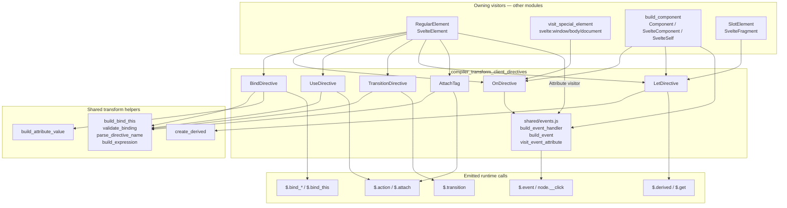
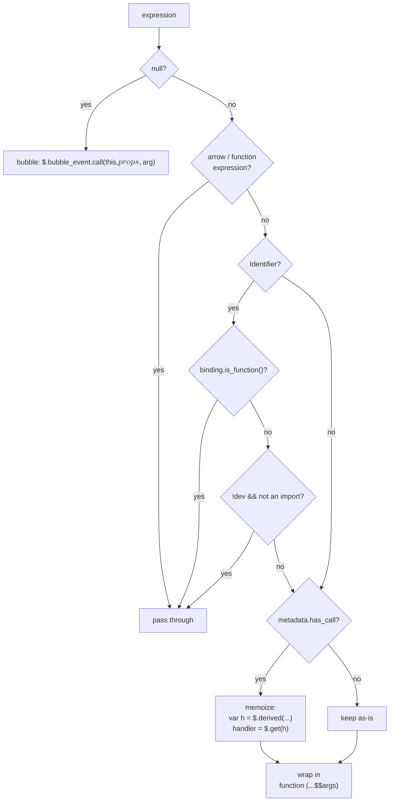
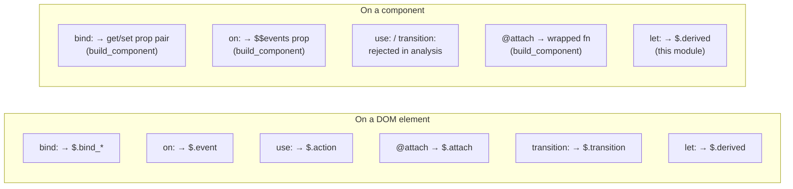

# Client Directive Transforms

## Overview

This module is the part of the client-side code generator that turns **directives** — the `bind:`, `on:`, `use:`, `transition:`/`in:`/`out:`, `let:` forms and `{@attach}` tags — into JavaScript that calls the client runtime.

A directive is not a thing that renders. It is a thing that *attaches behaviour* to something that already rendered. That single fact drives almost every design decision here:

- Each visitor is small. It reads one AST node plus the metadata that [analysis](compiler_analyze.md) put on it, and pushes one statement (or returns one expression) built with the [AST builders](compiler_core.md).
- Almost no visitor writes into the render effect. Directives run **before** or **after** the render effect, never inside it, because they need the element's attributes to be settled first.
- The visitors do not decide where in the output they land. They push into buckets on the transform state, and the owning element/component visitor splices those buckets together.

**Files in this module**

| File | Exports | Handles |
| --- | --- | --- |
| `visitors/BindDirective.js` | `BindDirective` | `bind:value`, `bind:this`, `bind:group`, media/window/document/dimension bindings |
| `visitors/OnDirective.js` | `OnDirective` | legacy `on:click`, event modifiers |
| `visitors/shared/events.js` | `visit_event_attribute`, `build_event`, `build_event_handler` | modern `onclick={...}` attributes, event delegation, handler wrapping |
| `visitors/UseDirective.js` | `UseDirective` | `use:action` |
| `visitors/TransitionDirective.js` | `TransitionDirective` | `transition:`, `in:`, `out:` |
| `visitors/LetDirective.js` | `LetDirective` | `let:x` slot props |
| `visitors/AttachTag.js` | `AttachTag` | `{@attach fn}` |

All of them are registered in the client visitor map in `phases/3-transform/client/transform-client.js` (lines 88–140).

**Not in this module.** `ClassDirective` and `StyleDirective` never reach a visitor of their own on the client — [`RegularElement`](compiler_transform_client_elements_regular.md) collects them and builds `$.set_class` / `$.set_style` calls directly. `AnimateDirective` has its own visitor outside this module.

---

## The one thing to understand first: statement buckets

Every visitor here writes into one of three arrays on `ComponentClientTransformState` (see [transform state](compiler_transform_client_core_state.md)):

```
init         →  runs once, before the render effect
update       →  runs inside the render effect (attributes, text, classes)
after_update →  runs once, after the render effect
```

The generated shape for an element is roughly:

```js
var div = root();          // template instantiation
/* ...init... */
$.template_effect(() => {  /* ...update... */ });
/* ...after_update... */
```

Directives need attributes to already be applied, so **the default home for a directive is `after_update`**. Three things override that default:

1. **`bind:this` goes to `init`.** It is one-way (DOM → state) and the value it writes may be read by the render effect itself, so it has to be established first.
2. **Actions and attachments go to `init`.** They receive the node, not the node's settled attributes, and the runtime's own effect scheduling handles ordering from there.
3. **If the element has a `use:` directive, bindings and events move to `init` — but wrapped in `$.effect(...)`.** This is the ordering-preservation trick: an `$.effect` created during `init` still *runs* after the render effect, so the observable order becomes source order (`bind:` and `on:` interleaved correctly with `use:`) instead of "all actions, then all bindings".

Where each directive lands:

| Directive | Bucket | Emitted call |
| --- | --- | --- |
| `bind:this` | `init` | `$.bind_this(...)` |
| `bind:*` (element has `use:`) | `init`, inside `$.effect` | `$.bind_value(...)` etc. |
| `bind:*` (otherwise) | `after_update` | `$.bind_value(...)` etc. |
| `on:*` (element has `use:`) | `init`, inside `$.effect` | `$.event(...)` |
| `on:*` (otherwise) | `after_update` | `$.event(...)` |
| `onclick={...}`, delegated | `init` | `node.__click = handler` |
| `onclick={...}`, not delegated | `after_update`¹ | `$.event(...)` |
| `use:` | `init` | `$.action(...)` |
| `{@attach}` | `init` | `$.attach(...)` |
| `transition:`/`in:`/`out:` | `after_update` | `$.transition(...)` |
| `let:` | *returned*, spliced into `init` first | `$.derived(...)` declaration |

¹ except on `<svelte:window>`, `<svelte:document>` and `<svelte:body>`, where it goes to `init` so that these above-the-tree listeners fire parent-first (`shared/events.js:77`).

Note the asymmetry in who does the pushing. `BindDirective`, `UseDirective`, `TransitionDirective` and `AttachTag` push into `context.state` themselves. `OnDirective` **returns** an expression and lets the caller schedule it, because the caller is the only one that knows whether it is dealing with an element (`$.event(...)` statement) or a component (an entry in the `$$events` prop object). `LetDirective` likewise **returns** a declaration.

---

## Architecture



---

## `BindDirective`

`visitors/BindDirective.js`

By far the largest visitor in the module. It has three jobs: build an accessor pair, pick a runtime function, and schedule the call.

### Step 1 — build the get/set pair

Every `bind_*` runtime function takes accessors, not values. There are two ways to get them.

**Function bindings.** `bind:value={() => v, (v) => …}` parses as a `SequenceExpression`, so the two halves are already written by the user (`BindDirective.js:23`):

```js
if (expression.type === 'SequenceExpression') {
    [get, set] = expression.expressions;
}
```

**Ordinary bindings.** Otherwise the visitor synthesises them (`BindDirective.js:43`):

```js
get = b.thunk(expression);

set = b.unthunk(
    b.arrow([b.id('$$value')],
        context.visit(b.assignment('=', node.expression, b.id('$$value'))))
);

if (get === set) {
    set = undefined;
}
```

Two details matter here.

First, the setter is produced by **synthesising an assignment and visiting it**. It does not try to reason about what kind of binding it is — it hands `x = $$value` to [`AssignmentExpression`](compiler_transform_client_javascript.md), which already knows how to write to a `$state` source, a `$bindable` prop, a store, or a proxied member. All of the write-path complexity lives there, not here.

Second, `get === set` is not a coincidence — it is a deliberate collapse. `b.thunk` and `b.unthunk` both rewrite `(a) => f(a)` into just `f`. When the bound thing is a `$bindable()` prop, the read transform yields `value()` and the write transform yields `value($$value)`; both collapse to the identifier `value`. Detecting that identity lets the visitor pass a single combined accessor instead of two functions.

This is why the dispatch table below is full of `set ?? get`. For **write-only** bindings (`bind:buffered`, `bind:clientWidth`, `bind:focused`, `bind:online`, …) the runtime only ever pushes values *out* of the DOM, so it needs one setter — `set` if there is one, otherwise the combined accessor.

### Step 2 — dev-mode validation

Under `dev` + runes, a `MemberExpression` binding is checked at runtime via [`validate_binding`](compiler_transform_client_core_expressions.md), which warns when you bind to a property of a non-reactive object. `bind:this` is exempt *unless* it sits inside an `IfBlock`, `EachBlock`, `AwaitBlock` or `KeyBlock` — only there can the same expression be re-bound to different nodes, making a stale non-reactive target observable. `binding_property_non_reactive` in a `svelte-ignore` comment suppresses it.

### Step 3 — pick the runtime function

The fast path is data-driven. `binding_properties` (in `phases/bindings.js`) maps a binding name to `{ event, bidirectional }`, and anything with an `event` becomes a generic property binding (`BindDirective.js:65`):

```js
call = b.call('$.bind_property',
    b.literal(node.name), b.literal(property.event),
    context.state.node, set ?? get, property.bidirectional && get);
```

Everything else is an explicit `switch` on the binding name. Grouped by what they bind to:

| Group | Bindings | Runtime |
| --- | --- | --- |
| window | `online` | `$.bind_online` |
| | `scrollX`, `scrollY` | `$.bind_window_scroll` (name normalised to `'x'`/`'y'`) |
| | `innerWidth/Height`, `outerWidth/Height` | `$.bind_window_size` |
| document | `activeElement` | `$.bind_active_element` |
| media | `muted`, `paused`, `volume`, `playbackRate`, `currentTime` | two-way: `(node, get, set)` |
| | `buffered`, `played`, `seekable`, `seeking`, `ended`, `readyState` | write-only: `(node, set ?? get)` |
| dimensions | `contentRect`, `contentBoxSize`, `borderBoxSize`, `devicePixelContentBoxSize` | `$.bind_resize_observer` |
| | `clientWidth/Height`, `offsetWidth/Height` | `$.bind_element_size` |
| form | `value` | `$.bind_select_value` on `<select>`, else `$.bind_value` |
| | `checked` | `$.bind_checked` |
| | `files` | `$.bind_files` |
| | `group` | `$.bind_group` (see below) |
| | `focused` | `$.bind_focused` |
| contenteditable | `textContent`, `innerHTML`, `innerText` | `$.bind_content_editable` |
| element ref | `this` | `build_bind_this(...)` |

Anything unmatched throws `unknown binding <name>` (`BindDirective.js:242`) — an internal invariant, since the [analysis phase](compiler_analyze.md) rejects unknown bindings with a proper diagnostic long before transform.

The receiving runtime functions live in [client bindings](client_bindings.md).

### `bind:group` — the interesting case

`bind:group` is the only binding whose codegen depends on surrounding blocks and sibling attributes.

**Each-block indexes.** A radio/checkbox group inside nested `{#each}` blocks needs to know *which* row it belongs to, so the visitor collects an index per enclosing each block from `node.metadata.parent_each_blocks`:

```js
const indexes = node.metadata.parent_each_blocks.map((each) =>
    each.metadata.keyed && each.index
        ? b.call('$.get', each.metadata.index)   // keyed index is a source
        : each.metadata.index                    // unkeyed index is a plain value
);
```

The keyed/unkeyed split exists because [`EachBlock`](compiler_transform_client_blocks_control_flow.md) stores the index in a reactive source only for keyed blocks, where rows can be reordered.

**Registering the `value` attribute as a dependency.** A group binding must re-run when the input's `value` changes, but the binding expression itself never mentions `value`. So when the parent is a `RegularElement` with a *dynamic* `value` attribute, the getter is rewritten to read it and throw the result away (`BindDirective.js:224`):

```js
group_getter = b.thunk(b.block([
    b.stmt(build_attribute_value(value, context).value),  // read for the dependency
    b.return(expression)                                  // actual value
]));
```

The filter is `a.name === 'value' && !is_text_attribute(a) && a.value !== true` — a static string `value="a"` cannot change, so it needs no dependency. [`build_attribute_value`](compiler_transform_client_elements_attributes.md) does the actual chunk building.

The final call passes `node.metadata.binding_group_name`, the index array, the node, the (possibly rewritten) getter, and `set ?? get`.

### `bind:this`

Delegated wholesale to [`build_bind_this`](compiler_transform_client_core_expressions.md), which does something the other bindings do not: it walks the expression for identifiers bound in enclosing each-block scopes and threads them through as extra parameters, so that teardown can null out the *right* slot even after the list has changed. It also marks every `MemberExpression` in the getter chain `optional`, so reading `foo.bar.baz` on a partly-missing object cannot throw.

`bind:this` on a **component** does not come through this visitor at all — [`build_component`](compiler_transform_client_components.md) intercepts it and calls `build_bind_this` itself, because the target is a component instance rather than a DOM node.

---

## Event handling — `shared/events.js`

Two entry points share one handler builder:

- **`visit_event_attribute`** — modern `onclick={handler}`, reached from the [`Attribute`](compiler_transform_client_elements_attributes.md) visitor, whose whole body is `if (is_event_attribute(node)) visit_event_attribute(node, context)`.
- **`OnDirective`** — legacy `on:click|once|preventDefault={handler}`.

`visit_event_attribute` also strips a `capture` suffix off the attribute name up front (`onclickcapture` → `onclick` + `capture = true`) and tolerates the old `onclick="{() => …}"` form, where the value arrives as a one-element array instead of a bare tag.

### `build_event_handler`

This is where the interesting decisions live. It takes the user's expression and returns something safe to hand the runtime, trying hard to pass the function through untouched.



Four things worth calling out:

**Bubbling.** A bare `on:click` with no expression means "re-dispatch to my parent". It compiles to a call into `$.bubble_event` (see [legacy compat](legacy_compat.md)) and sets `context.state.analysis.needs_props = true`, because the generated function reads `$$props` and the component would otherwise not declare it.

**The pass-through fast path.** An inline function, or an identifier that analysis knows is a function declaration, is used directly — no wrapper, no allocation. A plain local variable is also passed directly, *but only outside dev mode*: in dev the handler goes through `$.apply` so that calling a non-function produces a proper Svelte error instead of a raw `TypeError`. Imports are always wrapped, since an import binding can be reassigned by HMR.

**Memoization.** If the expression contains a call (`onclick={getHandler()}`), evaluating it on every event would be wrong and possibly expensive, so it becomes a `$.derived` pushed into `init` and read with `$.get`.

**Late binding.** Anything not on the fast path is wrapped in `function (...$$args) { handler.apply(this, $$args) }` (`shared/events.js:176`). The wrapper exists so the *expression* is re-evaluated per event — `onclick={obj.method}` must see the current `obj.method`, not the one that existed at attach time. In dev the body becomes `$.apply(...)` with the source location, the component name, and two hint flags: `has_side_effects` (the expression is a call/new/assignment/update, so `onclick={foo()}` is probably a mistake the user should hear about) and `remove_parens` (a zero-arg call to a plain identifier, so the warning can suggest `onclick={foo}`).

### `build_event`

A thin builder for `$.event(name, node, handler, capture && b.true, passive)`. The `capture && b.true` idiom emits nothing when false — the builders drop falsy trailing arguments, keeping output small. `passive` is passed as `undefined` when unspecified, so the runtime can apply its own per-event default (`is_passive_event` decides this for plain event attributes).

### Delegation

When analysis marks an event attribute `delegated`, no listener is attached to the element at all. Instead the handler is stored as an expando and a single delegated listener on the component root dispatches it:

```js
node.__click = handler;
```

The event name is recorded in `context.state.events` so the root knows which delegated listeners to install. If analysis also marked the handler `hoisted`, the function is lifted to module scope via `context.state.hoisted` — and when it closes over values that were turned into hoisted parameters, the expando gets an **array** of `[fn, ...params]` instead of a bare function, which the runtime unpacks at dispatch time. See [client DOM events](client_dom_elements.md) for the receiving end.

---

## `OnDirective`

The legacy `on:` form. Short, because `build_event_handler` does the work:

```js
let handler = build_event_handler(node.expression, node.metadata.expression, context);

for (const modifier of modifiers) {
    if (node.modifiers.includes(modifier)) {
        handler = b.call('$.' + modifier, handler);
    }
}
```

Modifiers split into two kinds:

- **Wrapping modifiers** — `stopPropagation`, `stopImmediatePropagation`, `preventDefault`, `self`, `trusted`, `once` — become nested runtime calls, applied in the fixed order of the module-level `modifiers` array (not source order). These are the [legacy event modifiers](legacy_compat.md).
- **Listener-option modifiers** — `capture`, `passive`, `nonpassive` — become arguments to `$.event`. `passive` is tri-state: `true` for `|passive`, `false` for `|nonpassive`, `undefined` when neither is present.

The visitor **returns** the `$.event(...)` expression rather than pushing it, so its caller can place it. [`RegularElement`](compiler_transform_client_elements_regular.md) wraps it per the `use:` rule; [`visit_special_element`](compiler_transform_client_elements_special.md) and [`build_component`](compiler_transform_client_components.md) do something different. On a component, `on:` never produces `$.event` at all — `build_component` collects handlers into an `$$events` prop, and only honours `once` (the other modifiers are DOM-specific and rejected earlier).

---

## `UseDirective`

`use:action` becomes `$.action(node, wrapper, get_arg?)`:

```js
const params = [b.id('$$node')];
if (node.expression) params.push(b.id('$$action_arg'));

const args = [
    context.state.node,
    b.arrow(params, b.maybe_call(context.visit(parse_directive_name(node.name)), ...params))
];

if (node.expression) {
    args.push(b.thunk(context.visit(node.expression)));
}

context.state.init.push(b.stmt(b.call('$.action', ...args)));
context.next();
```

Three points:

- **`parse_directive_name`** turns the directive name into an expression. `use:foo` → `foo`; `use:foo.bar` → `foo.bar`; `use:foo.my-thing` → `foo["my-thing"]`. Directive names are strings in the AST, so they have to be re-parsed into member chains here. Shared with `TransitionDirective`.
- **`b.maybe_call`** emits `action?.(...)`, so a conditionally-undefined action is a no-op rather than a crash.
- The argument is passed as a **thunk**, letting the runtime re-read it reactively and call the action's `update`.

The generated wrapper is `($$node, $$action_arg) => action?.($$node, $$action_arg)` — an indirection that keeps the call site's shape uniform regardless of whether the action takes an argument.

`UseDirective` and `AttachTag` are the only two visitors here that end with `context.next()`, continuing the generic walk of the node's children.

---

## `TransitionDirective`

Handles `transition:`, `in:` and `out:`, which are the same AST node distinguished by the `intro` / `outro` booleans. Those, plus the `global` modifier, are packed into a bitmask from [`constants.js`](compiler_core.md):

```js
let flags = node.modifiers.includes('global') ? TRANSITION_GLOBAL : 0;  // 4
if (node.intro) flags |= TRANSITION_IN;   // 1
if (node.outro) flags |= TRANSITION_OUT;  // 2
```

So `transition:fade` is `IN | OUT` (3), `in:fade` is `IN` (1), `out:fade|global` is `OUT | GLOBAL` (6). The call is `$.transition(flags, node, get_fn, get_params?)`, with both the transition function and its parameters passed as thunks so they can be re-read per transition.

It goes into **`after_update`**, and the code comment is explicit about why: *"in after_update to ensure it always happens after bind:this"*. A transition function commonly needs a fully-wired element, and `bind:this` is the one directive that lands in `init`. Implementations of the transition functions themselves live in [transitions](transitions.md); the scheduler is in [client DOM elements](client_dom_elements.md).

---

## `LetDirective`

The odd one out — it emits no runtime side effect. `let:` declares a variable derived from `$$slotProps`, so this visitor produces a **declaration** and registers a **read transform**.

Two shapes, both returning a `b.const(...)`:

**Simple** — `let:x` or `let:x={y}`:

```js
const name = node.expression === null ? node.name : node.expression.name;
context.state.transform[name] = { read: (node) => b.call('$.get', node) };

return b.const(name, create_derived(context.state, b.member(b.id('$$slotProps'), node.name)));
```

**Destructuring** — `let:x={{ y, z }}` or `let:x={[y, z]}`. One derived returns an object of all the destructured bindings, and each binding's read transform pulls its member off that derived:

```js
// let:x={{y, z}}  -->
const derived_x = $.derived(() => {
    let { y, z } = $$slotProps.x;
    return { y, z };
});
// reads of `y` become  $.get(derived_x).y
```

The generated name comes from `context.state.scope.generate(node.name)` so it cannot collide with user code, and the bindings to rewrite come from `context.state.scope.get_bindings(node)`.

`create_derived` (see [client transform bindings](compiler_transform_client_core_bindings.md)) picks `$.derived` under runes and `$.derived_safe_equal` otherwise — legacy components need the looser equality check to stay compatible.

**Two gotchas.**

Because the return value is a declaration whose bindings other attributes may reference, callers must splice `let:` declarations in **before everything else**. [`RegularElement`](compiler_transform_client_elements_regular.md) collects them in a separate `lets` array and pushes them first (`// Let bindings first, they can be used on attributes`, `RegularElement.js:193`); [`build_component`](compiler_transform_client_components.md), [`SlotElement`](compiler_transform_client_components.md), `SvelteFragment` and `SvelteElement` do the same.

Also, every caller annotates the result as `ExpressionStatement` while the visitor actually returns a `VariableDeclaration`. The cast is a convenience lie that the emitter does not care about — worth knowing if you are following types through this code.

---

## `AttachTag`

`{@attach fn}` — the modern replacement for `use:`. The smallest visitor in the module:

```js
const expression = build_expression(context, node.expression, node.metadata.expression);
context.state.init.push(b.stmt(b.call('$.attach', context.state.node, b.thunk(expression))));
context.next();
```

Unlike `use:`, there is no name to parse (the expression is an ordinary expression, often `createAttachmentKey`-based) and no separate argument — the attachment closes over what it needs. Going through [`build_expression`](compiler_transform_client_core_expressions.md) rather than a bare `context.visit` matters in legacy mode, where that helper adds the coarse-grained dependency reads legacy reactivity expects.

`{@attach}` on a **component** is handled by `build_component` instead, which wraps a stateful attachment in `($$node) => (fn || $.noop)($$node)` so a nullish value is tolerated.

---

## Element vs. component: two dispatch paths

The same directive means different things depending on what it is attached to, and the split is made by the *owner*, not by these visitors.



Only `OnDirective`'s handler builder and `LetDirective` are genuinely shared across both paths. For `bind:` on a component, `build_component` reimplements the get/set derivation (`shared/component.js:198-278`) — it needs a `{ get x() {}, set x(v) {} }` property pair rather than a runtime call, plus dev-mode ownership validation (`$$ownership_validator.binding`) that has no element equivalent. It also delays those property pushes so bindings land last and cannot be clobbered by a spread. If you change how bindings derive accessors, **both** places need the change.

---

## Working in this module

**Adding a new element binding.** Add the name to `binding_properties` in `phases/bindings.js`. If it is a plain property/event pair, the generic `$.bind_property` path picks it up with no change here. Only add a `switch` case if the runtime signature is unusual. Mirror it in [analysis](compiler_analyze.md) so bad usage is diagnosed, and add the runtime function to [client bindings](client_bindings.md).

**Adding an event modifier.** Wrapping modifiers go in the `modifiers` array in `OnDirective.js` and need a matching export in [legacy event modifiers](legacy_compat.md). Listener options need a new argument on `build_event` *and* on the runtime `$.event`.

**Touching ordering.** The `has_use` checks in `BindDirective.js:251` and `RegularElement.js:145` are duplicated logic that must stay in sync — they both ask "does the parent element have a `use:` directive" to decide between `init`-wrapped-in-`$.effect` and `after_update`. Changing one without the other silently reorders user code.

**Reading the output.** Element directives are visited against a scratch `element_state` with its own empty `init`/`after_update` arrays (`RegularElement.js:139`), which is spliced into the real state at the end (`RegularElement.js:367-385`). There are three variants: wrapped in a block when children include snippets (to avoid declaration conflicts), merged with child state when the fragment is dynamic, or the plain case. If a directive's generated code appears in a surprising place, that splice is where to look.

## Related modules

- [Client transform core](compiler_transform_client_core.md) — shared helpers, `Memoizer`, transform state
- [Client transform: expressions](compiler_transform_client_core_expressions.md) — `build_expression`, `build_bind_this`, `validate_binding`
- [Client transform: state & transforms](compiler_transform_client_core_state.md) — the `transform` map that `let:` writes into
- [Client transform: regular elements](compiler_transform_client_elements_regular.md) — the main caller
- [Client transform: components](compiler_transform_client_components.md) — the component-side directive path
- [Client transform: attributes](compiler_transform_client_elements_attributes.md) — `build_attribute_value`, the `Attribute` entry point for `on*`
- [Client transform: JavaScript](compiler_transform_client_javascript.md) — `AssignmentExpression`, which builds every binding setter
- [Client bindings runtime](client_bindings.md) — the `$.bind_*` functions
- [Client DOM elements runtime](client_dom_elements.md) — `$.event`, `$.action`, `$.attach`, `$.transition`
- [Analysis phase](compiler_analyze.md) — produces the directive metadata consumed here
- [Template directive AST types](template_directives.md) — node shapes
- [Legacy compatibility](legacy_compat.md) — event modifiers, `bubble_event`
