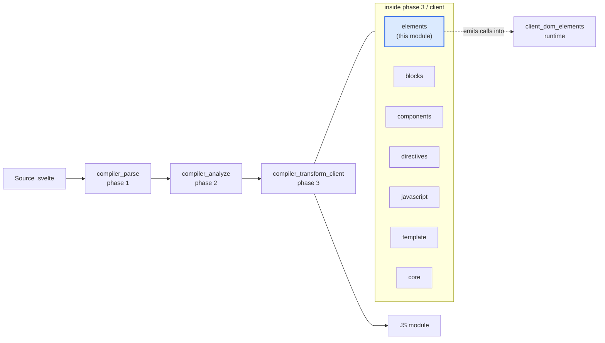
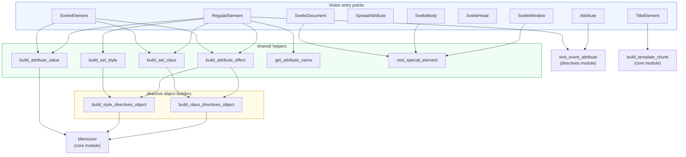
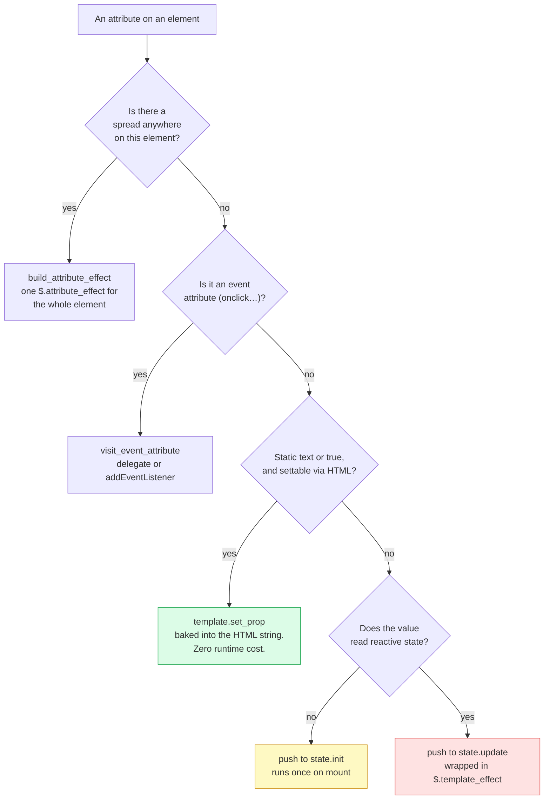
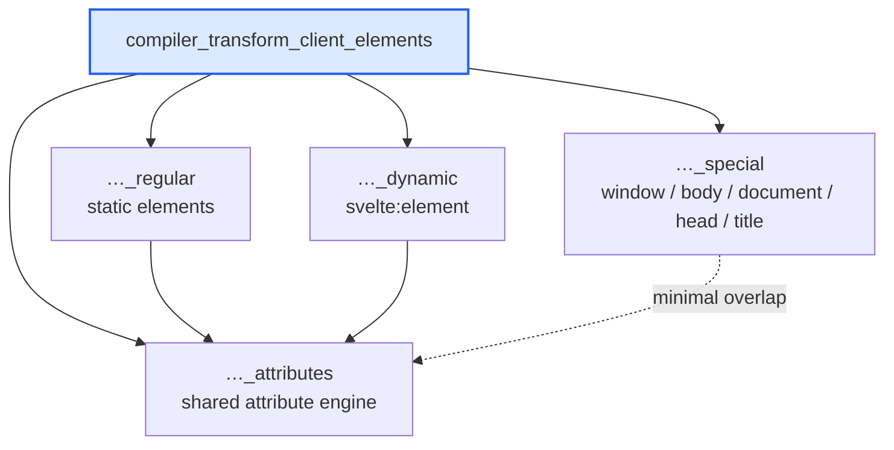
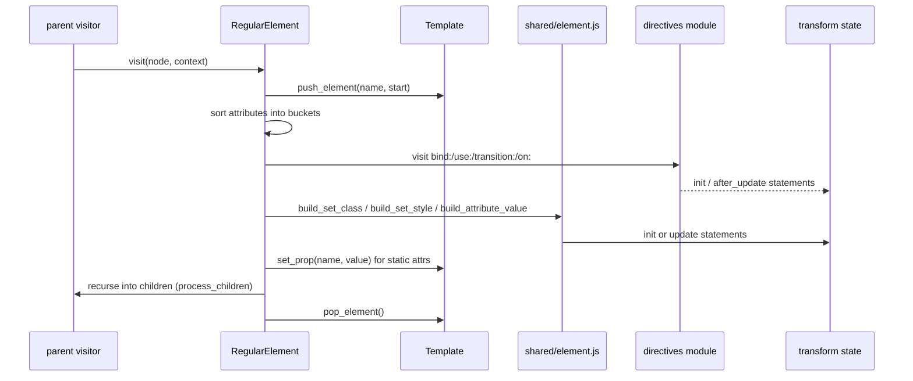

# compiler_transform_client_elements

## What this module does

This module is the part of the Svelte compiler that turns **elements** in a
`.svelte` file into browser JavaScript.

An "element" here means anything in the template that is a tag rather than a
component or a block:

| Template code | Handled by |
| --- | --- |
| `<div class="a" onclick={fn}>` | `RegularElement` |
| `<svelte:element this={tag}>` | `SvelteElement` |
| `<input {...props}>` | `SpreadAttribute` + shared attribute code |
| `<svelte:window>` `<svelte:body>` `<svelte:document>` | `visit_special_element` |
| `<svelte:head>` `<title>` | `SvelteHead`, `TitleElement` |

The module runs in **phase 3 (transform), client target**. It receives an AST
node that phase 1 parsed and phase 2 analyzed, and it writes two things:

1. **Static HTML** — pushed into a shared `Template` object. This becomes one
   big HTML string that the browser clones at runtime. Cheap.
2. **JavaScript statements** — pushed into `state.init`, `state.update`, and
   `state.after_update`. These call runtime helpers such as `$.set_attribute`,
   `$.set_class`, and `$.attribute_effect`. Needed only for the parts that can
   change.

The whole design is about **moving as much as possible into group 1**. A
`class="box"` that never changes costs nothing at runtime — it just lives in the
cloned HTML. A `class={expr}` needs a real effect.

## Where it sits in the compiler



Related modules:

- [compiler_transform_client](compiler_transform_client.md) — the parent visitor
  set and the dispatch table that routes each AST node type here.
- [compiler_transform_client_core](compiler_transform_client_core.md) —
  `Memoizer`, `build_expression`, `build_template_chunk`, `build_getter`, and the
  `ComponentClientTransformState` type this module reads and mutates.
- [compiler_transform_client_template](compiler_transform_client_template.md) —
  the `Template` class that collects the static HTML, and `process_children`
  which walks child nodes.
- [compiler_transform_client_directives](compiler_transform_client_directives.md)
  — `bind:`, `use:`, `transition:`, `on:`, and `{@attach}` are visited *from*
  this module but implemented there.
- [compiler_transform_client_components](compiler_transform_client_components.md)
  — the sibling module for `<Foo />` rather than `<div>`.
- [client_dom_elements](client_dom_elements.md) and
  [client_blocks](client_blocks.md) — the runtime functions the generated code
  actually calls.
- [compiler_transform_server](compiler_transform_server.md) — the SSR
  counterpart, which emits HTML strings instead of DOM operations.
- [compiler_ast_types](compiler_ast_types.md) — the node shapes
  (`AST.RegularElement`, `AST.Attribute`, …).

## Internal architecture



The shape is: **thin visitors, fat shared helpers**. `Attribute.js` and
`SpreadAttribute.js` are three lines each. `shared/element.js` holds the real
logic, and both `RegularElement` and `SvelteElement` call into it.

## The central decision: static, init, or update?

Every attribute goes through the same triage. This is the single most important
idea in the module.



`build_attribute_value` returns `{ value, has_state }`, and `has_state` is what
picks between `init` and `update` at the bottom of that tree. The pattern

```js
(has_state ? context.state.update : context.state.init).push(b.stmt(...));
```

appears in `build_set_class`, `build_set_style`, `TitleElement`, and the generic
attribute path in `RegularElement`. It is the module's signature line.

### Why spread forces a different path

Without a spread the compiler knows every attribute name at build time, so it
can emit one targeted call per attribute. With `{...props}` it does not — a name
could appear, disappear, or collide with a previous one. So the whole element
switches to `$.attribute_effect`, which takes a thunk returning one object of
all attributes and diffs it at runtime. Class and style directives ride along in
that same object under the `$.CLASS` and `$.STYLE` symbol keys, so they stay in
the correct order relative to a spread `class` key.

## Generated code, before and after

Static only — no JS at all, it is pure template:

```svelte
<div class="card" id="main">hello</div>
```

```js
var root = $.from_html(`<div class="card" id="main">hello</div>`);
```

One reactive attribute — a targeted effect:

```svelte
<div title={name}>hello</div>
```

```js
var div = root();
$.template_effect(() => $.set_attribute(div, 'title', name()));
```

A spread — one combined effect:

```svelte
<div {...props} class:active={on}>hello</div>
```

```js
var div = root();
$.attribute_effect(div, ($0) => ({ ...props(), [$.CLASS]: $0 }), [() => ({ active: on() })]);
```

## Sub-modules

The module splits into four areas. Each has its own document.



### Regular elements

Handles `<div>`, `<input>`, `<select>`, `<video>`, custom elements — every
ordinary tag. This is the largest piece. It sorts an element's attributes into
seven buckets, applies per-tag workarounds (`remove_input_defaults`, textarea
child removal, `<select>` value sync, the Chromium `dir="auto"` bug), decides
whether children can be collapsed into a single `textContent` assignment, and
builds the class/style directive objects.

See [compiler_transform_client_elements_regular](compiler_transform_client_elements_regular.md).

### Dynamic elements

Handles `<svelte:element this={tag}>`, where the tag name is only known at
runtime. Because the tag is unknown, this path cannot use the static HTML
template and cannot know whether the element is a custom element — so it almost
always routes attributes through the spread path. It emits a `$.element(...)`
call with the element body as a callback, plus dev-mode tag validation and
`$.async` wrapping when the tag expression awaits.

See [compiler_transform_client_elements_dynamic](compiler_transform_client_elements_dynamic.md).

### Attribute engine

The shared layer both element kinds depend on: `build_attribute_value`,
`build_attribute_effect`, `build_set_class`, `build_set_style`,
`get_attribute_name`, plus the trivial `Attribute` and `SpreadAttribute`
visitors. Owns the `has_state` contract, CSS-hash injection for scoped styles,
`clsx` handling, the previous-value tracking that lets `$.set_class` diff
cheaply, and `!important` splitting for style directives.

See [compiler_transform_client_elements_attributes](compiler_transform_client_elements_attributes.md).

### Special elements

Handles the tags that target something outside the component's own DOM:
`<svelte:window>`, `<svelte:body>`, `<svelte:document>` (all via the shared
`visit_special_element`), plus `<svelte:head>` and `<title>`. These produce no
element of their own — they retarget `state.node` at an existing global object,
or wrap children in a `$.head(...)` call.

See [compiler_transform_client_elements_special](compiler_transform_client_elements_special.md).

## Data flow through one element



Note that `Template` operations are **balanced** — `push_element` at the top,
`pop_element` at every exit, including the early `noscript` return. An
unbalanced pair corrupts the HTML nesting for everything after it.

## Key conventions worth knowing

- **`$.` prefix** — every generated call is namespaced `$.foo`, referring to the
  runtime import namespace. `$.set_attribute` resolves to
  [client_dom_elements](client_dom_elements.md).
- **`b.` builders** — all AST output is built with the `#compiler/builders`
  helpers (`b.call`, `b.stmt`, `b.member`, …) from
  [compiler_core](compiler_core.md), never with string concatenation.
- **Three statement lists** — `init` (once, on mount), `update` (inside
  `$.template_effect`), `after_update` (once, but after children exist — used
  for event listeners so they attach in the right order).
- **`Memoizer`** — when an attribute value contains a function call or an
  `await`, the raw expression is swapped for a generated `$0`, `$1`, … id and
  the real expression moves into a derived. This stops a call from re-running
  once per dependent attribute.
- **Metadata is read, not computed** — flags such as `metadata.has_spread`,
  `metadata.scoped`, `metadata.needs_clsx`, `metadata.delegated`, and
  `metadata.expression.has_state` were all set in phase 2
  ([compiler_analyze](compiler_analyze.md)). This module trusts them.

## Document index

Every file this module's documentation is split across, and the source it covers.

| Document | Source files covered |
| --- | --- |
| [compiler_transform_client_elements_regular](compiler_transform_client_elements_regular.md) | `visitors/RegularElement.js` |
| [compiler_transform_client_elements_dynamic](compiler_transform_client_elements_dynamic.md) | `visitors/SvelteElement.js` |
| [compiler_transform_client_elements_attributes](compiler_transform_client_elements_attributes.md) | `visitors/shared/element.js`, `visitors/Attribute.js`, `visitors/SpreadAttribute.js` |
| [compiler_transform_client_elements_special](compiler_transform_client_elements_special.md) | `visitors/shared/special_element.js`, `visitors/SvelteWindow.js`, `visitors/SvelteBody.js`, `visitors/SvelteDocument.js`, `visitors/SvelteHead.js`, `visitors/TitleElement.js` |

Sibling and dependency modules referenced above:
[compiler_transform_client](compiler_transform_client.md) ·
[compiler_transform_client_core](compiler_transform_client_core.md) ·
[compiler_transform_client_template](compiler_transform_client_template.md) ·
[compiler_transform_client_directives](compiler_transform_client_directives.md) ·
[compiler_transform_client_components](compiler_transform_client_components.md) ·
[compiler_transform_client_blocks](compiler_transform_client_blocks.md) ·
[compiler_transform_server](compiler_transform_server.md) ·
[compiler_analyze](compiler_analyze.md) ·
[compiler_core](compiler_core.md) ·
[compiler_ast_types](compiler_ast_types.md) ·
[client_dom_elements](client_dom_elements.md) ·
[client_blocks](client_blocks.md)
