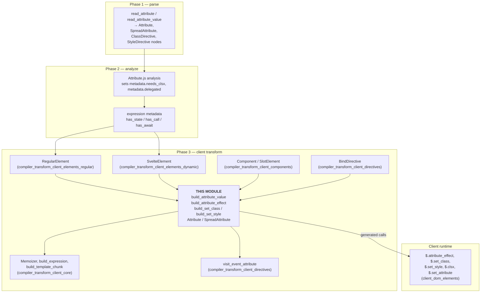
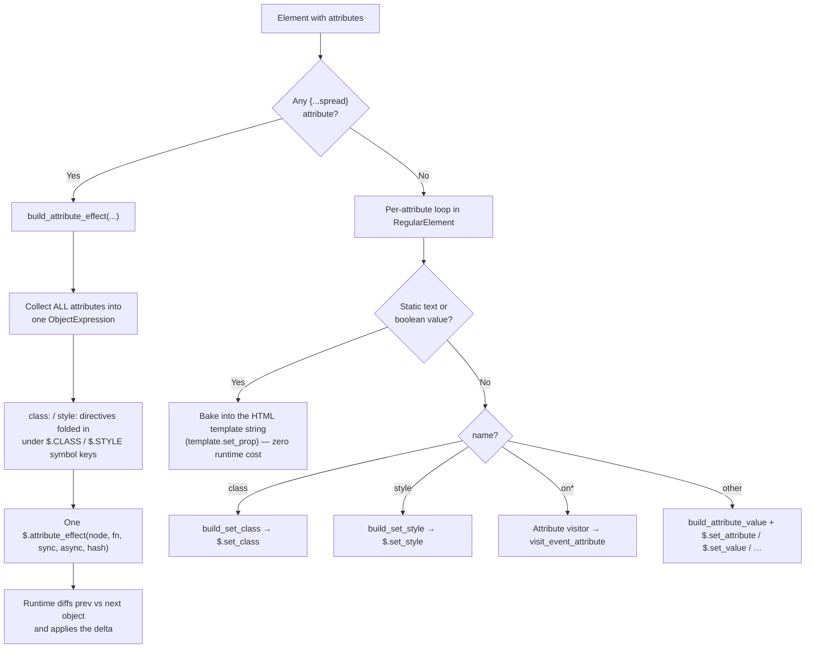
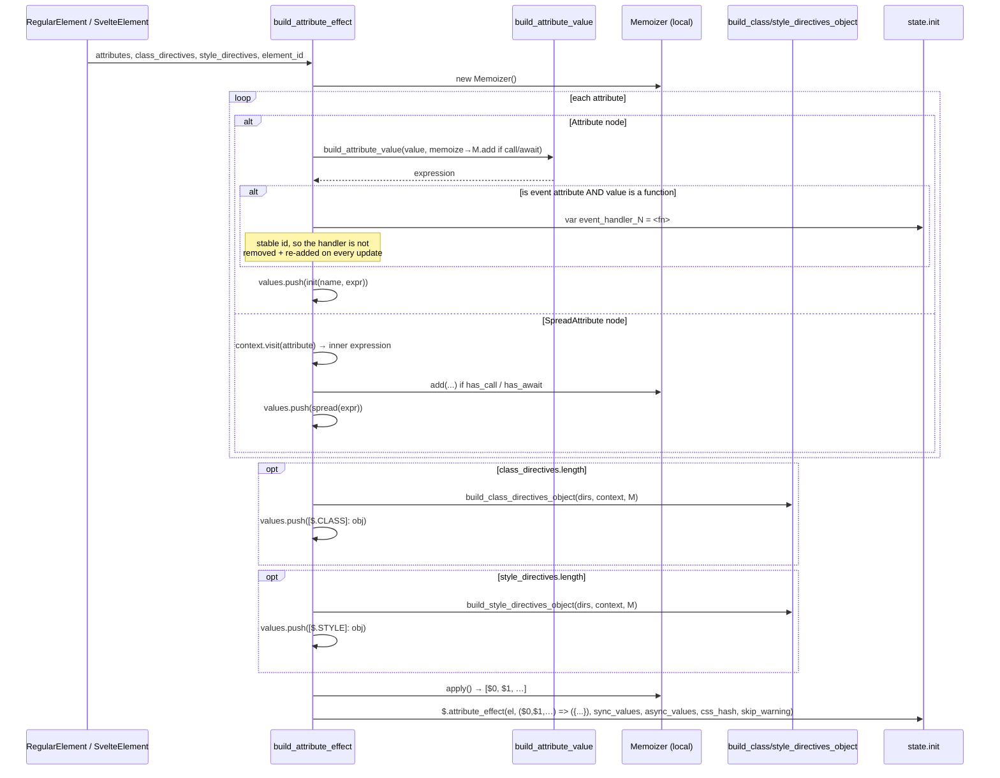
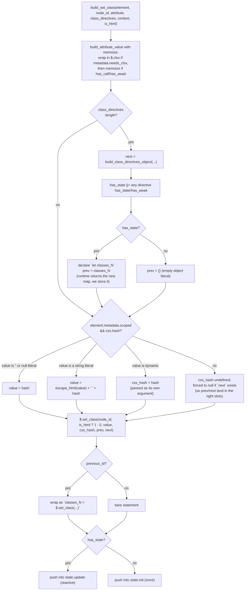
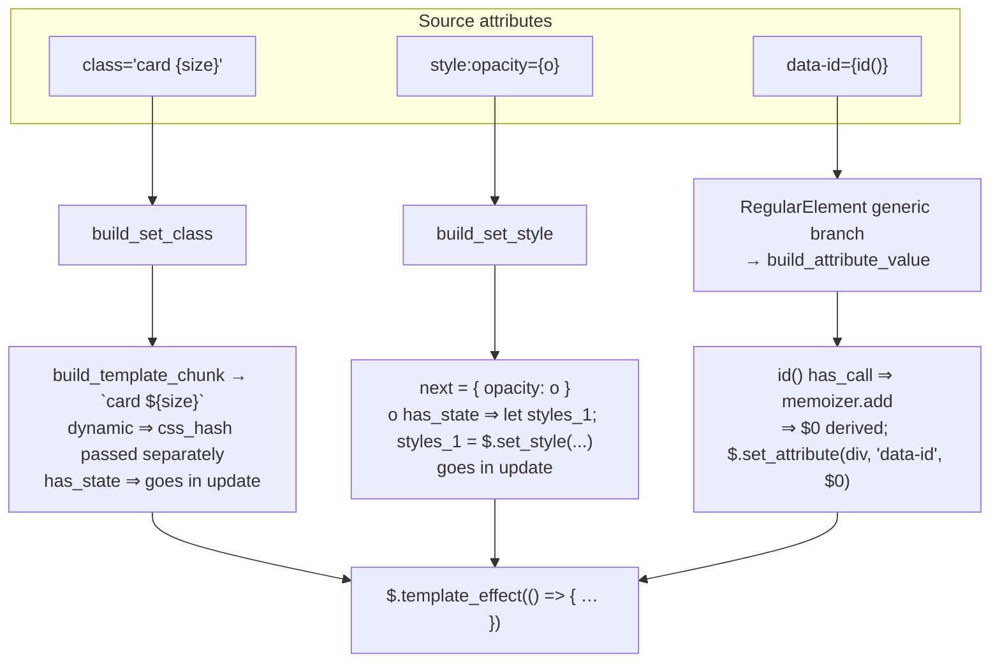

# compiler_transform_client_elements_attributes

## Introduction

This module is the part of the Svelte client compiler that turns **attributes** on DOM elements into JavaScript. When you write markup like this:

```svelte
<div class="card {extra}" style:color={c} data-id={id} onclick={handler} {...rest}>
```

something has to decide: which of these can be baked into a static HTML template, which need a one-time call at mount, which need a reactive update, and which need to be re-evaluated together as a group. That decision — and the code generation that follows it — lives here.

The module is small (three files) but it is the shared "attribute engine" used by every element visitor in the client transform. `RegularElement`, `SvelteElement`, `Component`, `SlotElement`, and `BindDirective` all call into it.

**Core components**

| Component | File | Role |
|---|---|---|
| `build_attribute_value` | `visitors/shared/element.js` | Turns an attribute's value (text, one expression, or a mix) into a single JS expression |
| `build_attribute_effect` | `visitors/shared/element.js` | Handles the spread case — emits one `$.attribute_effect(...)` for the whole element |
| `build_set_class` | `visitors/shared/element.js` | Emits `$.set_class(...)`, merging the `class` attribute, `class:` directives, and the CSS scoping hash |
| `build_set_style` | `visitors/shared/element.js` | Emits `$.set_style(...)`, merging the `style` attribute and `style:` directives |
| `get_attribute_name` | `visitors/shared/element.js` | Normalizes attribute casing for HTML (leaves SVG/MathML alone) |
| `Attribute` | `visitors/Attribute.js` | AST visitor; only acts on event attributes (`onclick`, …) |
| `SpreadAttribute` | `visitors/SpreadAttribute.js` | AST visitor; unwraps `{...spread}` to its inner expression |

---

## 1. Where this module sits

This module is a leaf of the client transform (phase 3). It never runs on its own — it is called by the element visitors above it, and it emits calls into the client runtime below it.



Related module docs:
- [compiler_transform_client_elements_regular](compiler_transform_client_elements_regular.md) — the main caller, plus `build_class_directives_object` / `build_style_directives_object`
- [compiler_transform_client_elements_dynamic](compiler_transform_client_elements_dynamic.md) — `<svelte:element>` caller
- [compiler_transform_client_core](compiler_transform_client_core.md) — `Memoizer`, `build_expression`, `build_template_chunk`
- [compiler_transform_client_directives](compiler_transform_client_directives.md) — event attributes, `bind:`, `use:`
- [client_dom_elements](client_dom_elements.md) — the runtime functions that get called
- [compiler_analyze_expression_metadata](compiler_analyze_expression_metadata.md) — where `has_state` / `has_call` / `has_await` come from

---

## 2. The two code paths: static per-attribute vs. spread

The single most important thing to understand about this module is that an element takes **one of two paths**, and the choice is made by the caller based on whether the element has any spread attribute.



Why two paths? A spread object's keys are not known at compile time, so the compiler cannot emit one targeted setter per attribute. It has to hand the whole object to the runtime and let the runtime diff it. That is more expensive, so the non-spread path is kept as narrow and direct as possible.

---

## 3. `build_attribute_value` — the shared value builder

This is the smallest and most reused function in the module. Given an `AST.Attribute['value']`, it returns a single ESTree `Expression` plus a `has_state` flag telling the caller whether the result needs to go in the reactive `update` list or the one-shot `init` list.

It handles exactly three shapes:

```mermaid
flowchart LR
    IN["attribute.value"] --> A{"=== true?"}
    A -->|"yes — <input disabled>"| A1["b.true<br/>has_state: false"]
    A -->|no| B{"single chunk?"}
    B -->|"Text — class='card'"| B1["b.literal(data)<br/>has_state: false"]
    B -->|"ExpressionTag — value={x}"| B2["build_expression(...)<br/>then memoize(...)<br/>has_state from metadata"]
    B -->|"no — class='a {b} c'"| C1["build_template_chunk(...)<br/>→ template literal"]
```



Key details:

- **`has_state` includes `has_await`.** An awaited expression is treated as changing over time, so it always lands in the update path.
- **The `memoize` callback is injected by the caller.** `build_attribute_value` does not decide the memoization policy itself; it just calls whatever function you pass. The default is identity (no memoization), which is what simple call sites like `BindDirective` and `SlotElement` want.
- **Multi-chunk values delegate.** For `class="a {b} c"` it hands off to `build_template_chunk` in [compiler_transform_client_core](compiler_transform_client_core.md), which builds a template literal and does constant folding along the way.

### The memoize callback pattern

Different call sites need different memoization rules, so the policy is a parameter. This is the recurring shape:

```js
build_attribute_value(attribute.value, context, (value, metadata) =>
  metadata.has_call || metadata.has_await
    ? context.state.memoizer.add(value, metadata.has_await)
    : value
);
```

The rule is: **memoize only if the expression contains a function call or an `await`.** A plain state read (`{count}`) is cheap to re-read, so it is left inline. A call (`{expensive()}`) or an `await` could be costly or could suspend, so it is lifted into a derived (sync) or an async value (async) by the `Memoizer`.

| Call site | Memoizer used | Note |
|---|---|---|
| `build_attribute_effect` | a **local** `new Memoizer()` | Values become the arrow function's `$0, $1, …` params |
| `build_set_class` / `build_set_style` | `context.state.memoizer` (fragment-level) | Wraps in `$.clsx` first if `needs_clsx` |
| `RegularElement` generic attribute | `context.state.memoizer` | |
| `BindDirective`, `SlotElement` | none (default identity) | |

---

## 4. `build_attribute_effect` — the spread path

When an element has a spread, every attribute plus every `class:` / `style:` directive is collapsed into **one** object literal, and one `$.attribute_effect` call manages the element.



### Shape of the emitted code

Input:

```svelte
<div {...props} class:active={isActive} title={compute()} onclick={fn}>
```

Output (roughly):

```js
var event_handler = fn;
$.attribute_effect(
  div,
  ($0, $1) => ({ ...$0, title: $1, [$.CLASS]: { active: isActive } }),
  [() => props, () => compute()],   // sync memoized values → deriveds
  undefined,                        // async memoized values
  'svelte-xyz123',                  // css hash, if the element is scoped
  undefined                         // skip_warning flag
);
```

Notes on the arguments:

- **Ordering matters.** Properties are pushed in source order, and `$.CLASS` / `$.STYLE` are pushed *last*. Since the runtime builds the object by evaluating properties in order, a later spread can overwrite an earlier explicit attribute exactly as it would in plain JS — and the directive objects always win over a spread's `class` / `style`.
- **`$.CLASS` and `$.STYLE`** are symbol keys, so they cannot collide with a real attribute name coming from a spread.
- **Event handlers get a stable variable.** Without the hoisted `var`, a fresh arrow function identity on each run would make the runtime see a "changed" handler and detach/reattach the listener every update.
- **`css_hash`** is only passed when `element.metadata.scoped` is set *and* the analysis produced a non-empty hash.
- **`skip_warning`** is `true` when `hydration_attribute_changed` is ignored for this element (via `<!-- svelte-ignore -->`).

The runtime side (`attribute_effect` in [client_dom_elements](client_dom_elements.md)) then flattens sync + async values, runs the arrow function inside a `block`, diffs the resulting object against `prev` via `set_attributes`, manages attachment effects for symbol keys, and special-cases `<select>`.

---

## 5. `build_set_class` — class attribute + `class:` directives + CSS hash

`class` cannot be handled like a generic attribute, because up to three sources must be merged into one string:

1. the `class` attribute itself (which in runes mode may be an object or array, hence `clsx`),
2. any number of `class:name={condition}` directives,
3. the component's CSS scoping hash (`svelte-xyz123`).



Two design points worth calling out:

- **Static hash folding.** If the class value is a plain string literal and the element is scoped, the hash is concatenated at *compile* time. No runtime argument, no extra work. This is the common case for `<div class="card">` in a component with styles.
- **`prev` / `next` for directives.** The runtime needs to know which classes it previously added via directives so it can remove the ones that went away. When directives are reactive, the compiler declares a `let classes_N` holder and assigns the return value of `$.set_class` to it, so the next run has the previous map. When nothing is reactive, an empty object literal is enough.
- **`is_html`** distinguishes HTML elements (where `className` can be used) from SVG/MathML (where `setAttribute('class', …)` is required). `RegularElement` computes it as `namespace === 'html' && node.name !== 'svg'`; `SvelteElement` always passes `false`, because the tag is not known at compile time.

---

## 6. `build_set_style` — style attribute + `style:` directives

Structurally this mirrors `build_set_class`, minus the CSS-hash and `clsx` concerns:

```js
$.set_style(node_id, value, prev, next)
// with `styles_N = $.set_style(...)` when the directives are reactive
```

Differences from `build_set_class`:

| Aspect | `build_set_class` | `build_set_style` |
|---|---|---|
| Memoize trigger | `has_call \|\| has_await` | `has_call` only |
| `clsx` wrapping | yes, when `needs_clsx` | n/a |
| CSS hash | merged in | n/a |
| `is_html` flag | yes | n/a |
| `next` shape | one object `{ name: cond }` | object, **or** `[normal, important]` array when any directive has the `important` modifier |

The `[normal, important]` split comes from `build_style_directives_object` (see [compiler_transform_client_elements_regular](compiler_transform_client_elements_regular.md)), which buckets `style:color|important={c}` separately so the runtime can call `setProperty(..., 'important')`.

Note the subtle asymmetry in the memoize trigger: `build_set_style` checks only `metadata.has_call` but still passes `metadata.has_await` through to `memoizer.add`, whereas `build_set_class` checks both.

---

## 7. `get_attribute_name` — casing normalization

```js
export function get_attribute_name(element, attribute) {
  if (!element.metadata.svg && !element.metadata.mathml) {
    return normalize_attribute(attribute.name);
  }
  return attribute.name;
}
```

HTML attribute names are case-insensitive, so authors write `readonly`, `maxlength`, `class`, and the compiler normalizes them to the canonical DOM form (`readOnly`, `maxLength`, `className`-adjacent handling, …). SVG and MathML **are** case-sensitive (`viewBox`, `clipPathUnits`), so their names are passed through untouched. `RegularElement` calls this before its per-attribute dispatch, so the `class` / `style` / `autofocus` branches compare against the normalized name.

---

## 8. The two AST visitors

Both visitors in this module are deliberately thin, because the real work is driven by the parent element visitor rather than by the generic AST walk.

### `Attribute.js`

```js
export function Attribute(node, context) {
  if (is_event_attribute(node)) {
    visit_event_attribute(node, context);
  }
}
```

Non-event attributes produce **nothing** when visited generically. Their code is generated by the parent element visitor, which needs the whole attribute list at once (to decide spread vs. per-attribute, to merge directives, to fold the CSS hash). Only event attributes are self-contained enough to be handled in place, and that is delegated to `visit_event_attribute` in [compiler_transform_client_directives](compiler_transform_client_directives.md).

Note that event attributes are handled in *both* paths: `RegularElement` calls `visit_event_attribute` directly in its non-spread loop, and `build_attribute_effect` folds them into the spread object with a stable handler id.

### `SpreadAttribute.js`

```js
export function SpreadAttribute(node, context) {
  return context.visit(node.expression);
}
```

A pure unwrap. Visiting the inner expression runs it through the normal JavaScript transform (see [compiler_transform_client_javascript](compiler_transform_client_javascript.md)) so state reads become signal reads. `build_attribute_effect` relies on exactly this: it calls `context.visit(attribute)` on the spread node and gets back a ready-to-use expression.

---

## 9. End-to-end example

Input:

```svelte
<style>.card { color: red }</style>

<div class="card {size}" style:opacity={o} data-id={id()}>…</div>
```

What each piece produces:



Approximate output:

```js
let styles_1;
var $0 = $.derived(() => id());

$.template_effect(() => {
  $.set_class(div, 1, `card ${size}`, 'svelte-xyz123');
  styles_1 = $.set_style(div, undefined, styles_1, { opacity: o });
  $.set_attribute(div, 'data-id', $.get($0));
});
```

Now add a spread and the whole thing collapses into one call:

```svelte
<div {...rest} class="card {size}" style:opacity={o} data-id={id()}>…</div>
```

```js
$.attribute_effect(
  div,
  ($0, $1) => ({
    ...$0,
    class: `card ${size}`,
    'data-id': $1,
    [$.STYLE]: { opacity: o }
  }),
  [() => rest, () => id()],
  undefined,
  'svelte-xyz123'
);
```

---

## 10. Decision summary

A compact reference for "where does my attribute end up?":

| Attribute shape | Element has spread? | Handled by | Emitted into |
|---|---|---|---|
| `disabled` / `class="x"` (static text or `true`) | no | `RegularElement` template baking | HTML template string |
| `class` (any dynamic, or with `class:` directives) | no | `build_set_class` | `init` or `update` |
| `style` (dynamic, or with `style:` directives) | no | `build_set_style` | `init` or `update` |
| `onclick={…}` | no | `Attribute` → `visit_event_attribute` | `init` / `after_update` / delegated |
| `autofocus` | no | `build_attribute_value` + `$.autofocus` | `init` |
| any other dynamic attribute | no | `build_attribute_value` + a targeted setter | `init` or `update` |
| **everything, including directives** | yes | `build_attribute_effect` | one `$.attribute_effect` in `init` |

And the reactivity rule that runs through all of it:

- `has_state == false` → `state.init` (runs once at mount)
- `has_state == true` → `state.update` (wrapped in a template effect, re-runs on change)
- `has_call` or `has_await` → additionally memoized into a derived (sync) or an async value

---

## 11. Server-side counterpart

The server transform has its own `build_attribute_value` at `phases/3-transform/server/visitors/shared/utils.js`. It shares the name and the general idea (fold an attribute value into one expression) but not the implementation: on the server there are no effects, no `prev`/`next` diffing, and no memoizer — everything is stringified once. See [compiler_transform_server](compiler_transform_server.md).

| | Client (this module) | Server |
|---|---|---|
| Output | statements + effects | string concatenation into a payload |
| Reactivity | `init` vs. `update`, memoizer | none |
| Spread | `$.attribute_effect` with diffing | `$.spread_attributes(...)` once |
| class / style | `$.set_class` / `$.set_style` with prev/next | `$.attr_class` / `$.attr_style` |
