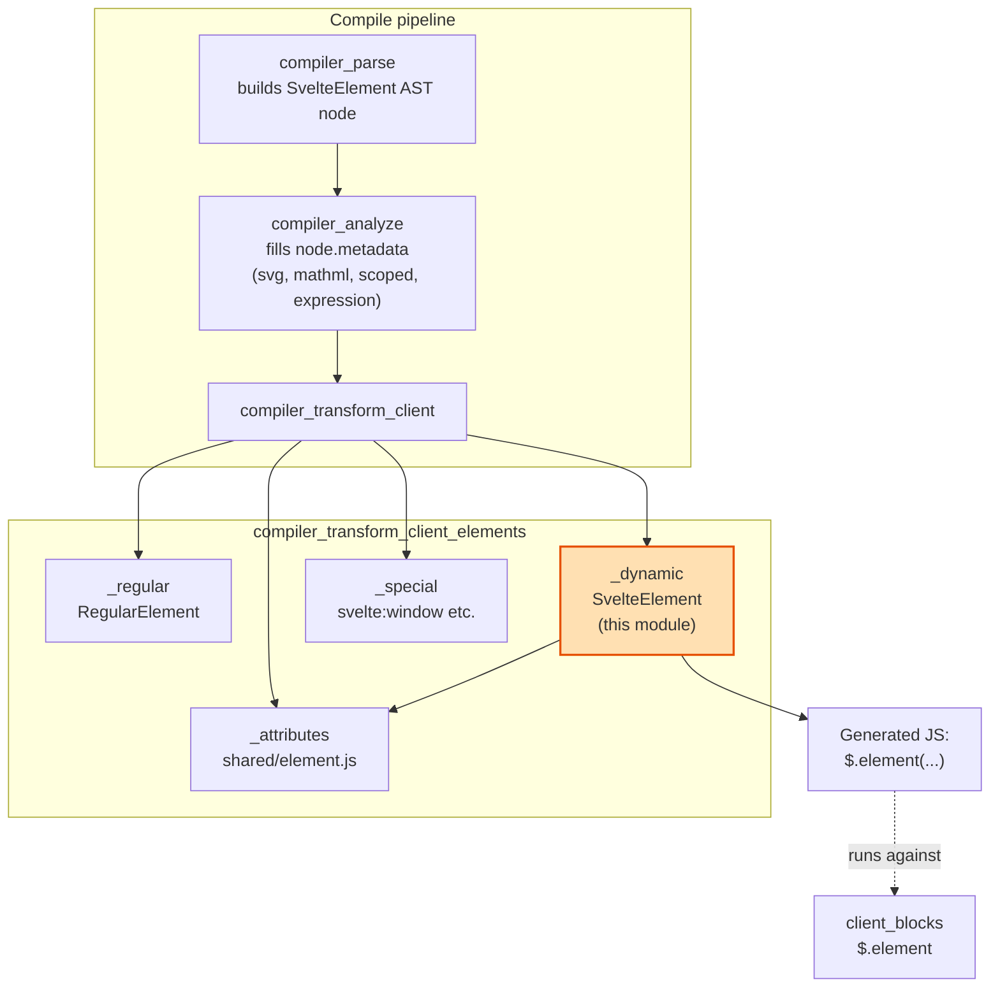
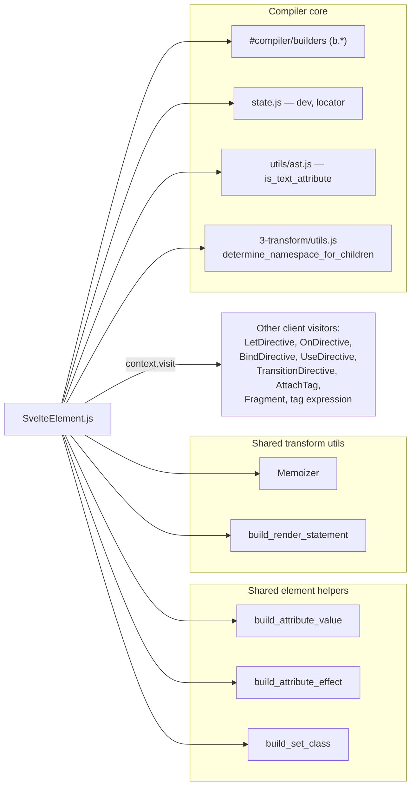
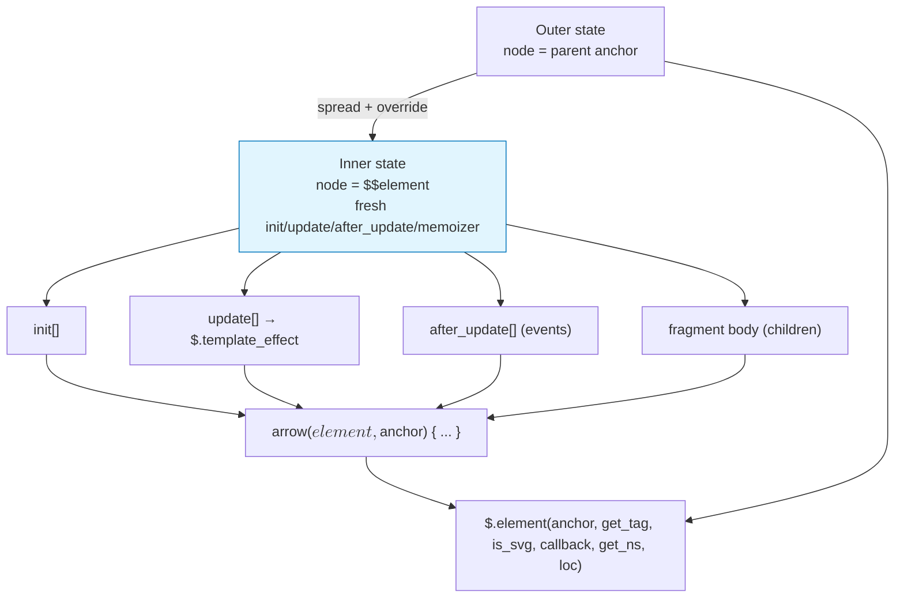
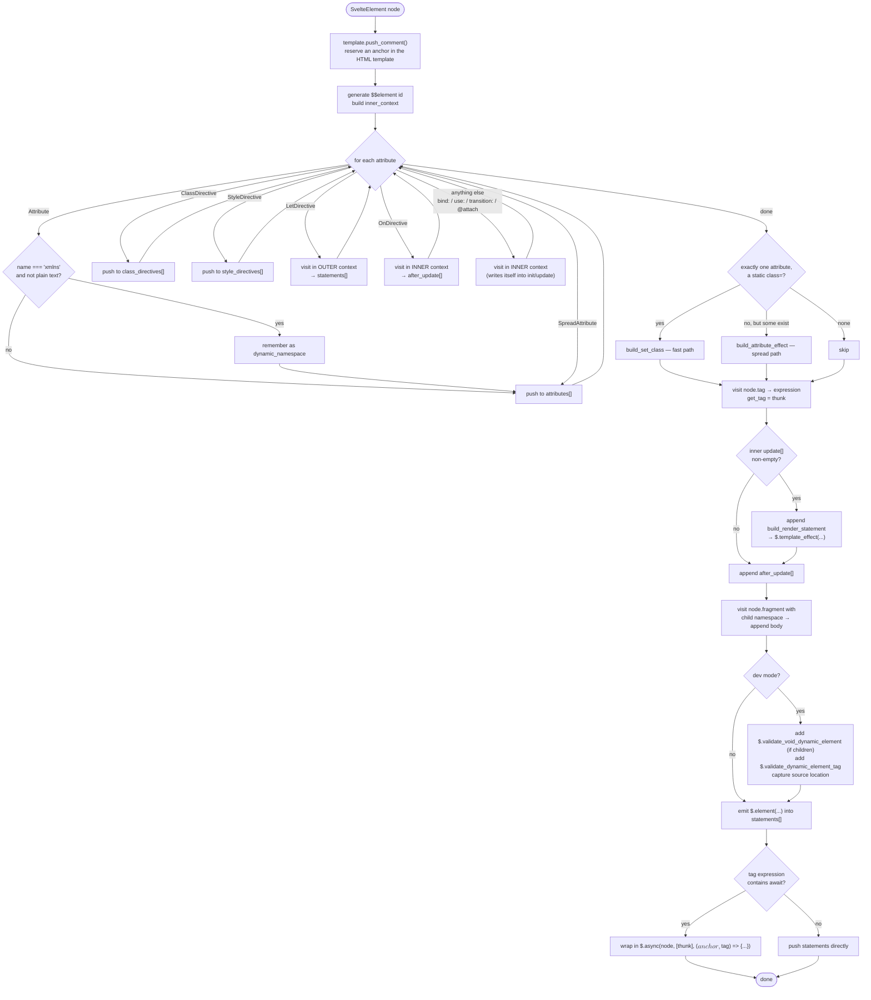
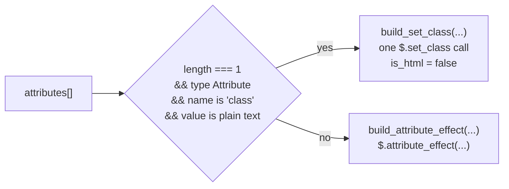
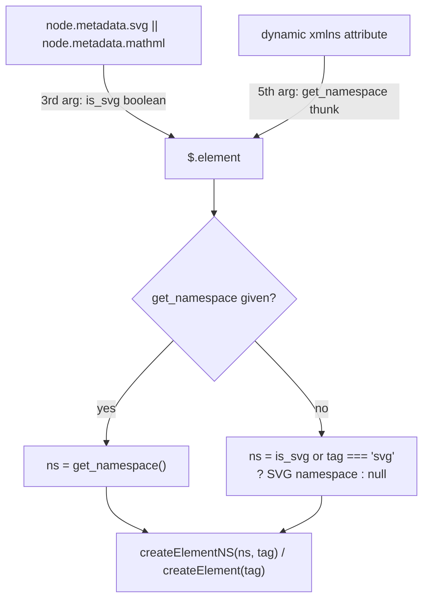
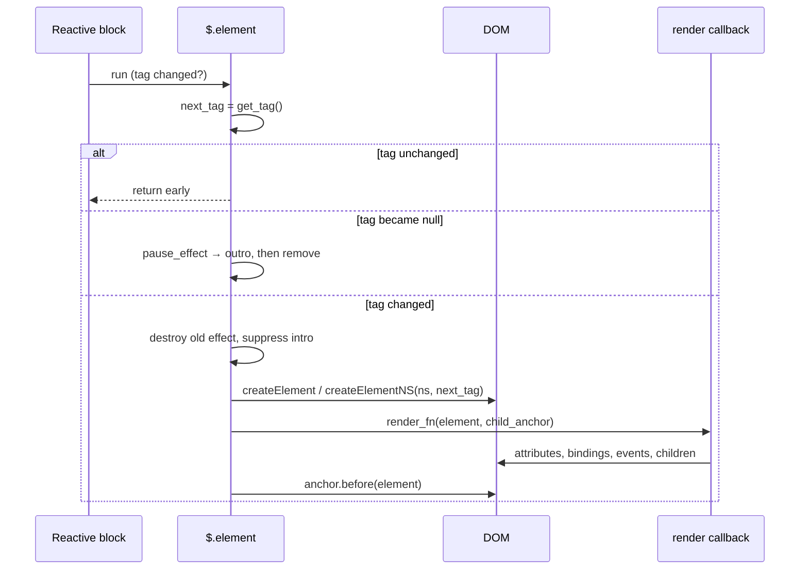
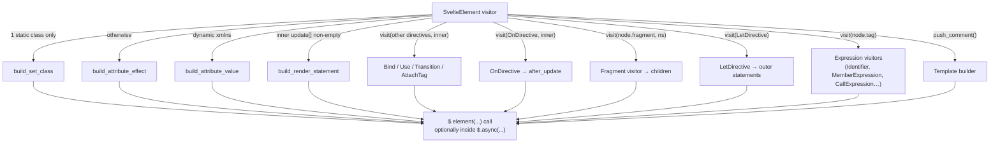

# compiler_transform_client_elements_dynamic

## Introduction

This module holds one visitor: `SvelteElement`. It turns a `<svelte:element this={...}>` node from the
template AST into client-side JavaScript.

A normal element like `<div>` has a tag name the compiler knows at build time. `<svelte:element>` does
not — the tag comes from an expression that can change while the app runs. That one difference changes
everything about how the code is built:

| | Regular element | Dynamic element (`<svelte:element>`) |
| --- | --- | --- |
| Tag known at compile time | yes | no |
| Lives in the cloned HTML template | yes | no — only a comment anchor |
| Attributes | can be set one by one, with the right DOM method chosen at build time | must go through one runtime "spread" path |
| Namespace (HTML / SVG / MathML) | decided at compile time | may need a runtime `xmlns` lookup |
| Element identity | stable | element is destroyed and rebuilt when the tag changes |

So this module cannot emit "create a `div`, set its `class`". It has to emit "call `$.element(...)`, and
here is a function that fills in whatever element you end up creating".

- **Source:** `packages/svelte/src/compiler/phases/3-transform/client/visitors/SvelteElement.js`
- **Runtime partner:** `$.element` in `packages/svelte/src/internal/client/dom/blocks/svelte-element.js`
  (see [client_blocks](client_blocks.md))
- **Sibling module:** [compiler_transform_client_elements_regular](compiler_transform_client_elements_regular.md)

---

## Where this module sits



---

## Dependencies



Related module docs:

- [compiler_transform_client_elements_attributes](compiler_transform_client_elements_attributes.md) —
  `build_attribute_value`, `build_attribute_effect`, `build_set_class`
- [compiler_transform_client_core_expressions](compiler_transform_client_core_expressions.md) —
  `Memoizer`, `build_render_statement`
- [compiler_transform_client_directives](compiler_transform_client_directives.md) — the directive visitors
- [compiler_transform_client_template](compiler_transform_client_template.md) — `Fragment`, template building
- [compiler_core](compiler_core.md) — AST builders (`b.*`), `determine_namespace_for_children`
- [compiler_ast_types](compiler_ast_types.md) — the `SvelteElement` node shape

---

## The core idea: an inner context

The visitor builds **two** streams of code at once:

1. **Outer stream** (`context.state`) — the `$.element(...)` call itself, plus dev checks and
   `let:` bindings. This code lives in the parent fragment.
2. **Inner stream** (`inner_context.state`) — everything that needs a real DOM element to work on:
   attributes, class/style directives, event handlers, bindings, actions, transitions, children.
   This code becomes the body of the callback passed to `$.element`.

The inner stream cannot be written into the parent scope, because the element does not exist yet — and
may be recreated later. So the visitor makes a fresh state object:

```js
const element_id = b.id(context.state.scope.generate('$$element'));

const inner_context = {
  ...context,
  state: {
    ...context.state,
    node: element_id,      // "the current DOM node" is now the callback parameter
    init: [],              // one-time setup statements
    update: [],            // statements that re-run when state changes
    after_update: [],      // event handlers, ordered last
    memoizer: new Memoizer()  // its own derived/async value pool
  }
};
```

`node: element_id` is the trick that makes it all work. Every downstream visitor writes
`$.something($$element, ...)` without knowing it is inside a dynamic element.



---

## Process flow



---

## Step-by-step detail

### 1. Reserve an anchor

```js
context.state.template.push_comment();
```

The tag is unknown, so nothing can be baked into the cloned HTML template. Instead a comment node is
placed there. At runtime `$.element` inserts the real element **before** that comment
(`anchor.before(element)`). The comment also gives hydration a stable marker to line up with the
server-rendered output. See [compiler_transform_client_template](compiler_transform_client_template.md).

### 2. Sort the attributes

Attributes fall into six buckets. The interesting part is *which context* each is visited in:

| Kind | Handling | Why |
| --- | --- | --- |
| `Attribute` | collected into `attributes[]` | applied together later |
| `Attribute` named `xmlns` with a non-static value | saved as `dynamic_namespace`, **and** kept in `attributes[]` | the runtime needs it before creating the element |
| `SpreadAttribute` | collected into `attributes[]` | merged with the rest |
| `ClassDirective` | collected into `class_directives[]` | merged into the class value |
| `StyleDirective` | collected into `style_directives[]` | merged into the style value |
| `LetDirective` | visited in the **outer** context, result pushed to `statements[]` | `let:` declares variables that the surrounding scope needs; it does not touch the DOM node |
| `OnDirective` | visited in the **inner** context, result pushed to `after_update` | needs the element; ordered after other setup so handlers attach last |
| everything else (`bind:`, `use:`, `transition:`, `animate:`, `@attach`) | visited in the **inner** context for its side effects | these visitors write directly into `inner_context.state.init` / `.update` |

### 3. Choose an attribute strategy



The spread path is the default **even for a single simple attribute**. The source comment explains why:

> Always use spread because we don't know whether the element is a custom element or not, therefore we
> need to do the "how to set an attribute" logic at runtime.

For a `<div>` the compiler can prove that `value` should be set as a property and `aria-label` as an
attribute. For `<svelte:element this={tag}>` it cannot — `tag` might resolve to a custom element where
the rules differ. So the decision is deferred to `$.attribute_effect` at runtime.

The static-`class`-only case is safe to fast-path because setting `class` is the same on every element
type. Note the `is_html = false` argument passed to `build_set_class` — again, the compiler will not
claim the element is HTML.

Both helpers live in
[compiler_transform_client_elements_attributes](compiler_transform_client_elements_attributes.md).

### 4. Build the tag getter

```js
const { has_await } = node.metadata.expression;
const expression = context.visit(node.tag);
const get_tag = b.thunk(has_await ? b.call('$.get', b.id('$$tag')) : expression);
```

`get_tag` is always a function, because `$.element` re-invokes it inside a reactive `block` to detect
tag changes. Two shapes:

- **Sync tag** — `() => tag`. The visited expression goes straight in.
- **Async tag** (the expression contains `await`) — `() => $.get($$tag)`. The value is resolved outside
  and handed in as a signal named `$$tag`; see step 7.

### 5. Assemble the callback body

```js
const inner = inner_context.state.init;
if (inner_context.state.update.length > 0) {
  inner.push(build_render_statement(inner_context.state));
}
inner.push(...inner_context.state.after_update);
inner.push(...context.visit(node.fragment, { /* child namespace */ }).body);
```

Order matters: setup, then the reactive update effect, then event handlers, then children.

`build_render_statement` wraps all `update` statements in a single `$.template_effect(...)`, feeding it
the memoized sync and async values the inner `Memoizer` collected. One effect for the whole element
keeps the runtime cheap. See
[compiler_transform_client_core_expressions](compiler_transform_client_core_expressions.md).

If `inner` ends up empty, the callback argument is emitted as `false` instead of an arrow function, and
`$.element` skips calling it — no wasted closure for `<svelte:element this={tag} />`.

### 6. Namespace for children

```js
context.visit(node.fragment, {
  ...context.state,
  metadata: {
    ...context.state.metadata,
    namespace: determine_namespace_for_children(node, context.state.metadata.namespace)
  }
})
```

Children need to know whether they are inside SVG, MathML, or plain HTML, because that decides which
template factory builds them (`from_svg` vs `from_html` vs `from_mathml`, see
[client_render_and_templates](client_render_and_templates.md)). `determine_namespace_for_children`
reads the analysis-phase flags on the node.

The element's *own* namespace is communicated to the runtime two ways:



The dynamic thunk wins when present. Note the runtime also special-cases a literal `svg` tag name, so
`<svelte:element this={'svg'}>` works without an explicit `xmlns`.

### 7. Dev-mode checks

Only when `dev` is on:

```js
if (node.fragment.nodes.length > 0) {
  statements.push(b.stmt(b.call('$.validate_void_dynamic_element', get_tag)));
}
statements.push(b.stmt(b.call('$.validate_dynamic_element_tag', get_tag)));
const location = dev && locator(node.start);
```

- `validate_void_dynamic_element` — warns if the resolved tag is a void element (`br`, `img`, …) but the
  template gave it children. Only emitted when there actually are children.
- `validate_dynamic_element_tag` — errors if `this` resolved to something that is not a string.
- `locator(node.start)` produces `[line, column]`, passed as the last argument to `$.element` so the
  created DOM node gets `__svelte_meta` for devtools.

Both validators live in [internal_shared](internal_shared.md).

### 8. Emit, and wrap if async

```js
statements.push(b.stmt(b.call(
  '$.element',
  context.state.node,       // parent anchor (the comment)
  get_tag,
  node.metadata.svg || node.metadata.mathml ? b.true : b.false,
  inner.length > 0 && b.arrow([element_id, b.id('$$anchor')], b.block(inner)),
  dynamic_namespace && b.thunk(build_attribute_value(dynamic_namespace, context).value),
  location && b.array([b.literal(location.line), b.literal(location.column)])
)));
```

Then the async question. If the tag expression contains `await`, the whole statement list is deferred:

```js
$.async(anchor, [async () => expression], (anchor, $$tag) => {
  /* dev validations + $.element(...) */
});
```

`$.async` (see [client_blocks](client_blocks.md)) registers with the nearest pending boundary, resolves
the expression, and only then runs the body — so the element is never created with an unresolved tag,
and `<svelte:boundary>` can show a pending state. Inside the body, `$$tag` is the resolved signal that
`get_tag` reads through `$.get`.

If there is no await, the statements are pushed directly — a single statement goes in bare, several are
wrapped in a `b.block(...)` so any generated temporaries stay scoped.

---

## Generated code, illustrated

Input:

```svelte
<svelte:element this={tag} class="card" onclick={handler} bind:this={el}>
  {text}
</svelte:element>
```

Shape of the output (simplified, names will differ):

```js
var node = $.comment();               // the anchor from push_comment()
// ...
$.element(node, () => tag, false, ($$element, $$anchor) => {
  $.attribute_effect($$element, ($0) => ({ class: 'card', onclick: $0 }), [() => handler]);
  $.bind_this($$element, ($$value) => el = $$value, () => el);

  var text_node = $.text();
  $.template_effect(() => $.set_text(text_node, text));
  $.append($$anchor, text_node);
});
```

Data flow at runtime:



The important consequence for users: **changing the tag rebuilds the element from scratch.** State held
in the DOM (focus, scroll position, uncontrolled input values) is lost, intro transitions are skipped on
the replacement, and `use:`/`@attach` cleanups run. That behaviour is decided by the runtime, but this
module is what makes the callback re-runnable in the first place.

---

## Component interaction



---

## Comparison with the server transform

The server has its own `SvelteElement` visitor in
[compiler_transform_server](compiler_transform_server.md). It emits `$.element(payload, tag, attrs_fn,
children_fn)` — a string-building call, no reactivity, no `$.async` wrapper, no callback re-runs. The
two visitors share the same AST node and the same metadata, but nothing else. Comparing them is a good
way to see how much of this module exists purely to make the element *replaceable*.

---

## Notes for maintainers

- **The inner/outer split is load-bearing.** If you add handling for a new attribute type, decide
  deliberately which context to visit it in. Visiting a DOM-touching directive in the outer context
  will emit code referring to the parent anchor instead of `$$element`.
- **Do not add compile-time per-attribute optimisations** without proving they hold for custom elements
  too. That is the whole reason the spread path is the default.
- **`$$element` is scope-generated**, so nesting dynamic elements is safe — the ids will be
  `$$element`, `$$element_1`, and so on.
- **The inner `Memoizer` is separate from the outer one.** Memoized values created for attributes belong
  to the callback's effect, and must not leak into the parent's `$.template_effect`.
- **Adding a new dev validation?** Push it into `statements` *before* the `$.element` call, so it runs
  with the same `get_tag` and, in the async case, ends up inside the `$.async` body.
