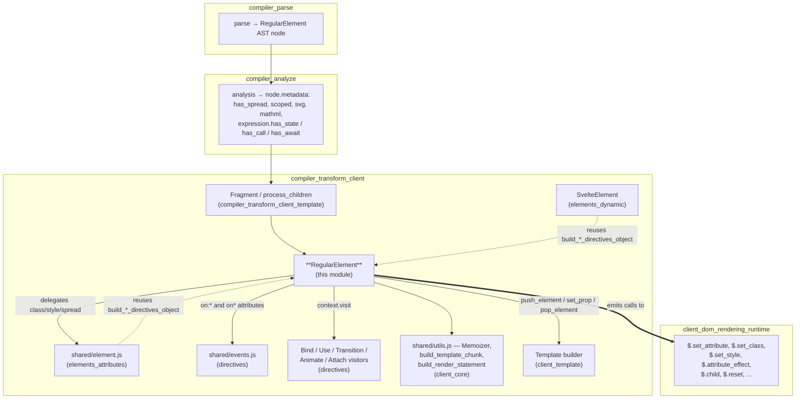
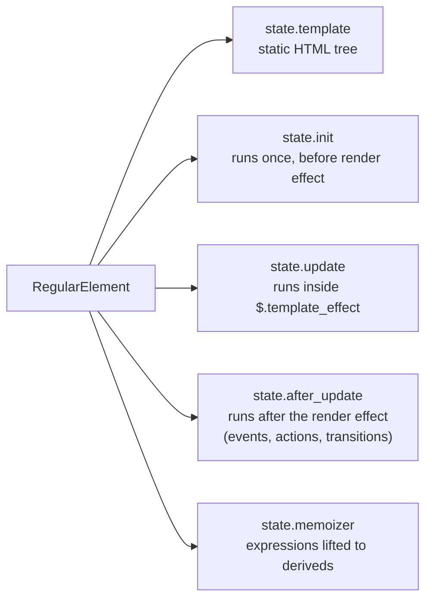
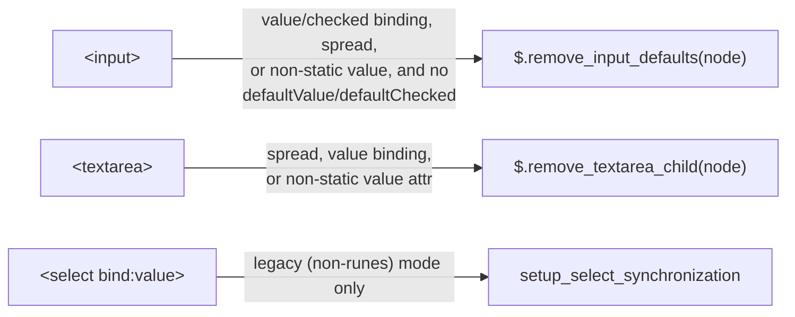
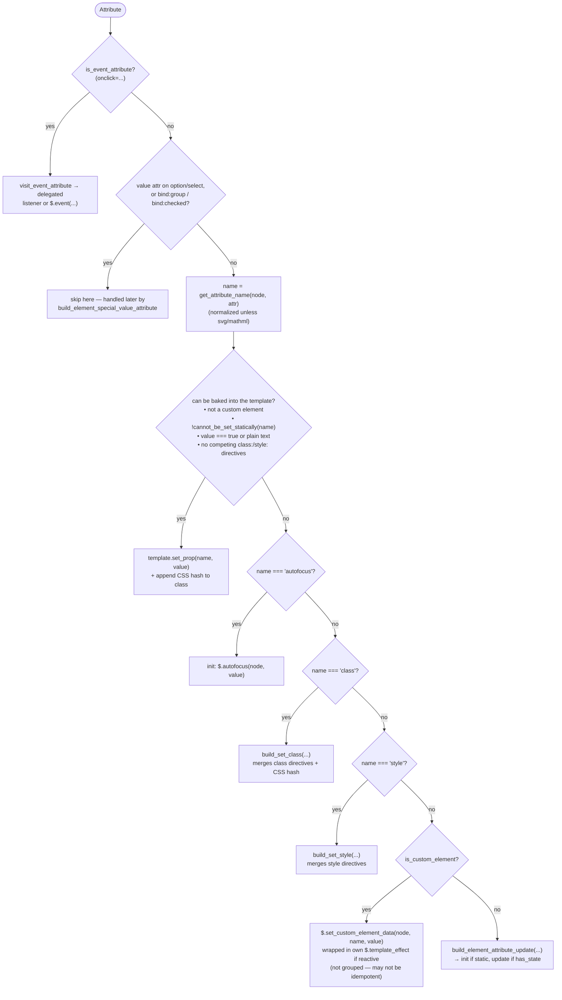
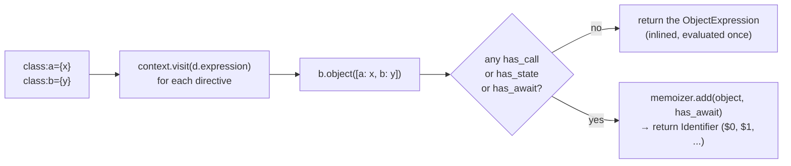
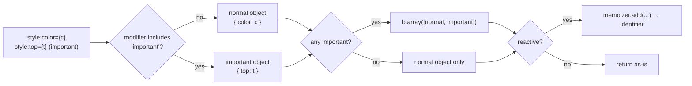
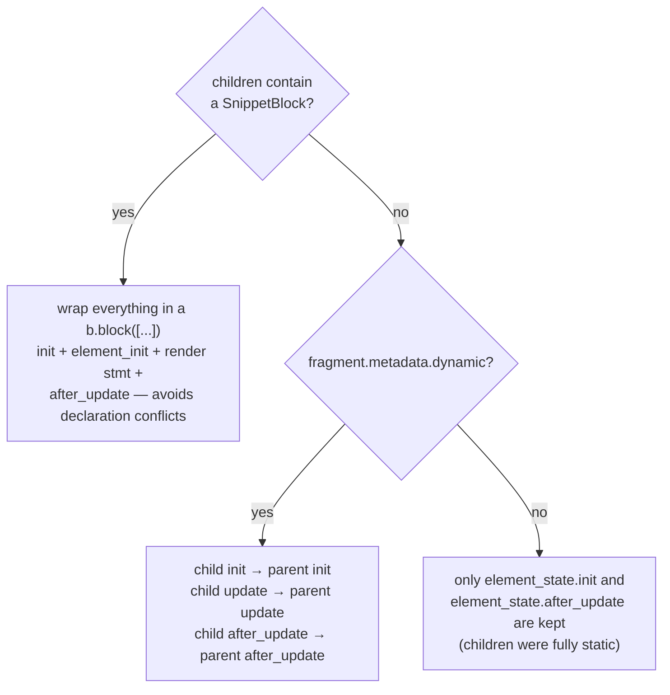
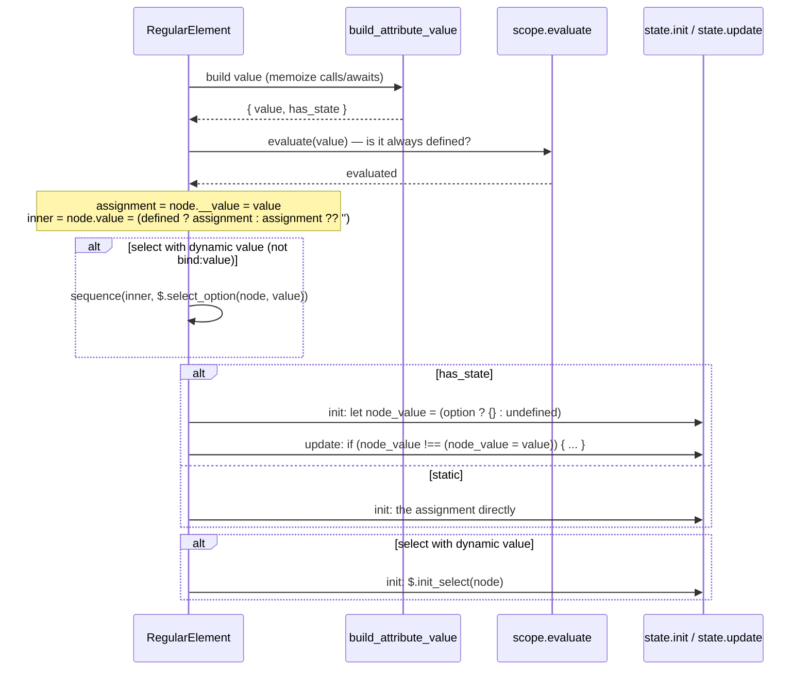

# compiler_transform_client_elements_regular

## Introduction

This module holds the client-side transform for **plain HTML elements** — things like `<div>`, `<input>`, `<select>`, `<option>`, `<textarea>`, `<video>`, `<template>`, and custom elements such as `<my-widget>`. It is one visitor file:

`packages/svelte/src/compiler/phases/3-transform/client/visitors/RegularElement.js`

Its job: take one `RegularElement` AST node (already parsed and analyzed) and turn it into two things at once:

1. **Static HTML** that gets baked into the component's cloned template string.
2. **JavaScript statements** that run at mount time or inside a render effect, for everything that cannot be baked in (dynamic attributes, bindings, events, actions, transitions, children).

The whole design is built around one idea: *push as much as possible into the static template, and only emit code for what really changes.* Every branch in this file is some version of "can this be static, or does it need an effect?"

Three components are exported or used across the module:

| Component | Role |
| --- | --- |
| `RegularElement` | The visitor. Sorts attributes, decides static vs. dynamic, emits code, walks children. |
| `build_class_directives_object` | Turns `class:foo={bar}` directives into one object expression (memoized if reactive). |
| `build_style_directives_object` | Turns `style:color={x}` directives into one (or two, for `!important`) object expressions. |

The last two are exported because [compiler_transform_client_elements_attributes](compiler_transform_client_elements_attributes.md) and [compiler_transform_client_elements_dynamic](compiler_transform_client_elements_dynamic.md) reuse them for spread attributes and `<svelte:element>`.

---

## Where this module sits

`RegularElement` is a leaf of the client transform tree. It is called by the fragment walker, and it calls back into the shared element/attribute helpers.



Related reading:

- [compiler_transform_client_elements](compiler_transform_client_elements.md) — the parent group.
- [compiler_transform_client_elements_attributes](compiler_transform_client_elements_attributes.md) — `build_attribute_value`, `build_attribute_effect`, `build_set_class`, `build_set_style`.
- [compiler_transform_client_core_expressions](compiler_transform_client_core_expressions.md) — `Memoizer`, `build_template_chunk`, `build_render_statement`.
- [compiler_transform_client_template](compiler_transform_client_template.md) — the `Template` object and `process_children`.
- [compiler_transform_client_directives](compiler_transform_client_directives.md) — bind/use/transition/on visitors.
- [client_dom_elements](client_dom_elements.md) and [client_render_and_templates](client_render_and_templates.md) — the runtime functions this module emits calls to.

---

## The transform state it writes into

Everything this visitor produces lands in one of four buckets on `ComponentClientTransformState` (see [compiler_transform_client_core_state](compiler_transform_client_core_state.md)):



Ordering matters and is deliberate:

- `init` — DOM lookups, static property writes, `let` declarations, action setup.
- `update` — anything guarded by `has_state`; later wrapped by `build_render_statement` into a single `$.template_effect(...)`.
- `after_update` — event listeners and `$.replay_events`, so they attach after the element's children exist.
- `memoizer` — expressions with `has_call` or `has_await`, hoisted into `$.derived` / async values so they are computed once per update, not per use.

---

## Main flow

```mermaid
flowchart TD
    START([RegularElement node]) --> PUSH["template.push_element(name, start)"]
    PUSH --> NOSCRIPT{name === 'noscript'?}
    NOSCRIPT -->|yes| POP0["pop_element → return<br/>(never render contents)"]
    NOSCRIPT -->|no| FLAGS["set template flags:<br/>needs_import_node (video / custom element)<br/>contains_script_tag (script)"]

    FLAGS --> SORT["**1. Sort attributes** into buckets"]
    SORT --> LETS["**2. Visit LetDirectives first**<br/>(they define state used by others)"]
    LETS --> OTHER["**3. Visit other directives**<br/>bind / on / use / transition / animate / attach<br/>into element_state"]
    OTHER --> QUIRKS["**4. Element quirks**<br/>input defaults, textarea child,<br/>select value sync"]
    QUIRKS --> SPREAD{has_spread?}

    SPREAD -->|yes| EFFECT["build_attribute_effect(...)<br/>one $.attribute_effect for everything"]
    SPREAD -->|no| LOOP["**5. Per-attribute dispatch**<br/>(see attribute decision tree)"]

    EFFECT --> REPLAY
    LOOP --> REPLAY{"load-error element<br/>with onload/onerror/spread/use?"}
    REPLAY -->|yes| RPE["after_update: $.replay_events(node)"]
    REPLAY -->|no| CHILDNS
    RPE --> CHILDNS["**6. Namespace + contenteditable metadata**"]

    CHILDNS --> CLEAN["**7. clean_nodes()**<br/>→ hoisted + trimmed children"]
    CLEAN --> TEXTONLY{"only static-ish text<br/>+ at least one ExpressionTag?"}
    TEXTONLY -->|yes| TC["node.textContent = `...`"]
    TEXTONLY -->|no| PC["process_children(trimmed, $.child(node), ...)<br/>+ $.hydrate_template for &lt;template&gt;<br/>+ $.reset(node) if needed"]

    TC --> MERGE["**8. Merge child_state into parent**"]
    PC --> MERGE
    MERGE --> DIRFIX{"has 'dir' attribute?"}
    DIRFIX -->|yes| DIRUP["update: node.dir = node.dir<br/>(Chromium dir=auto fix)"]
    DIRFIX -->|no| VAL
    DIRUP --> VAL{"needs __value handling<br/>and no spread?"}
    VAL -->|yes| SV["build_element_special_value_attribute(...)"]
    VAL -->|no| POP
    SV --> POP["template.pop_element()"]
    POP --> END([done])
```



### Step 1 — Sorting attributes

The single `for` loop over `node.attributes` splits them into six buckets. This is the backbone of the whole visitor, because each bucket is handled by a different mechanism.

| Bucket | Node types | Handled by |
| --- | --- | --- |
| `attributes` | `Attribute`, `SpreadAttribute` | Static template props, or per-attribute update code, or one big `$.attribute_effect` |
| `class_directives` | `ClassDirective` | `build_class_directives_object` → `build_set_class` |
| `style_directives` | `StyleDirective` | `build_style_directives_object` → `build_set_style` |
| `other_directives` | `Animate`, `Bind`, `On`, `Transition`, `Use`, `AttachTag` | `context.visit(...)` into the per-element `element_state` |
| `lets` | `LetDirective` | Visited immediately, results pushed to `init` first |
| `lookup` / `bindings` | maps by name | Used by the quirk checks (`value`, `checked`, `dir`, `contenteditable`, …) |

One special case lives inside the loop: an `is` attribute in the HTML namespace with a literal string value is written straight into the template via `template.set_prop('is', value)` and skipped. It has to be in the markup, because `document.createElement('x', {is})` semantics cannot be applied after the fact.

### Step 3 — `OnDirective` and the `use:` interaction

Event directives are pulled out of the generic directive loop:

```js
if (has_use) {
    element_state.init.push(b.stmt(b.call('$.effect', b.thunk(handler))));
} else {
    element_state.after_update.push(b.stmt(handler));
}
```

The reason: an action (`use:`) may replace or wrap the element's behaviour, and listeners registered by `on:` must be ordered relative to it. Wrapping the handler in `$.effect` when an action is present gives the action a chance to run first.

### Step 4 — Element quirks

These are browser-behaviour patches, not general logic. They are worth listing because they are exactly the kind of thing that looks arbitrary in generated output.



`setup_select_synchronization` is the most unusual of the three. In legacy mode, changing a `<select>` value may indirectly depend on option state that the compiler cannot track. So it emits a `$.template_effect` that reads the bound expression and then calls `$.invalidate_inner_signals` over every other referenced name in scope — a deliberate over-invalidation to keep the select in sync. It returns early in runes mode, where dependency tracking is precise.

---

## Attribute handling: the decision tree

This is the heart of the module. For a non-spread element, each attribute goes through this chain (first match wins):



### `build_element_attribute_update`

The final fallback picks the cheapest correct runtime call for a given attribute name:

| Condition | Emitted code | Why |
| --- | --- | --- |
| `muted` | `node.muted = value` | Firefox only honours the property |
| `value` | `$.set_value(node, value)` | Property + `__value` bookkeeping |
| `checked` | `$.set_checked(node, value)` | Same |
| `selected` | `$.set_selected(node, value)` | Same |
| `defaultValue` (with a static `value` attr, or a `<textarea>` with content) | `$.set_default_value(...)` | Setting `defaultValue` naively would clobber `value` on pristine inputs |
| `defaultChecked` (with `checked` present) | `$.set_default_checked(...)` | Same reasoning |
| `is_dom_property(name)` | `node[name] = value` | Direct property write is fastest |
| `xlink*` | `$.set_xlink_attribute(...)` | Needs the XLink namespace |
| anything else | `$.set_attribute(node, name, value, [skip_warning])` | Generic path |

The last argument to `$.set_attribute` is `is_ignored(element, 'hydration_attribute_changed')` — when the user added an ignore comment, the dev-mode mismatch warning is suppressed.

### Spread path

When `node.metadata.has_spread` is true, per-attribute reasoning is impossible (names are only known at runtime), so the whole attribute set — including class and style directives — is folded into a single `$.attribute_effect(...)` by `build_attribute_effect`. That helper builds its **own** `Memoizer`, separate from the component-level one, so the memoized values become the effect's parameters. See [compiler_transform_client_elements_attributes](compiler_transform_client_elements_attributes.md).

---

## `build_class_directives_object`

```js
build_class_directives_object(class_directives, context, memoizer = context.state.memoizer)
```

Collapses `class:a={x} class:b={y}` into `{ a: x, b: y }`.



The returned value is either the object literal itself or a placeholder identifier the `Memoizer` will later bind to a `$.derived`. The caller (`build_set_class`) does not care which — it just drops it into the `next` slot of `$.set_class(node, is_html, value, css_hash, prev, next)`. The `prev` slot holds the previous object so the runtime can diff and only touch changed classes.

## `build_style_directives_object`

Same shape, with one extra wrinkle: `!important`.



A shorthand directive (`style:color` with `value === true`) resolves the value from a variable of the same name via `build_getter`, which applies the current state transform (so a `$state` variable becomes `$.get(color)`). Non-shorthand values go through `build_attribute_value`.

---

## Children

After attributes come the element's children. Three decisions happen here.

### Namespace and `bound_contenteditable`

`determine_namespace_for_children` decides whether children are `html`, `svg`, or `mathml` (with `<foreignObject>` switching back to `html`). Separately, if the element has an `innerHTML` / `innerText` / `textContent` binding **and** a truthy `contenteditable` attribute, `metadata.bound_contenteditable` is set — `process_children` reads this to avoid pushing text updates into the render effect (the user's typing owns the DOM there).

### Text-content fast path

```js
const use_text_content =
    trimmed.every(n => n.type === 'Text' || n.type === 'ExpressionTag') &&
    trimmed.every(n => n.type === 'Text' ||
        (!n.metadata.expression.has_state && !n.metadata.expression.has_await)) &&
    trimmed.some(n => n.type === 'ExpressionTag');
```

Meaning: *all* children are text-ish, *none* of the expressions are reactive, and at least one is an expression (a pure-text element would already be fully static in the template). In that case a single `node.textContent = \`...\`` in `init` replaces the whole child-walking machinery — no text node lookups, no siblings, no effects.

### General path

Otherwise `process_children` walks the trimmed children, generating `$.child(node)` / `$.sibling(...)` traversal. Two extras:

- `<template>` elements get `$.hydrate_template(node)` and children are anchored at `node.content`.
- If any child is not plain `Text`, a `$.reset(node)` is appended so hydration's cursor is restored after descending.

### Merging child statements back



The snippet case needs its own scope block because snippet declarations would otherwise collide with sibling declarations in the same function body. When the fragment is *not* dynamic, the children produced no code at all — they live entirely in the template string — so nothing is merged.

---

## `build_element_special_value_attribute`

Some elements need a hidden `__value` property so the runtime can hold non-string values (objects, numbers) behind a DOM `value` that is always a string. This applies to `<option>`, `<select>`, and inputs with `bind:group` / `bind:checked`.



Two subtleties encoded here:

- **`<option>` sentinel.** The initial guard variable is `{}` (an object nobody can equal) rather than `undefined`, because an `<option>` whose value is genuinely `undefined` must still write the empty string on the first run.
- **`<select value={x}>` without a binding** is *always* treated as reactive, even if `x` never changes — the set of `<option>` children can change underneath it. Hence the extra `$.select_option` call and `$.init_select`, which installs a mutation observer (the select's value is not reflected as an attribute, so nothing else would notice).

---

## Custom elements

Custom elements take a separate path in three places:

1. `template.needs_import_node = true` — `cloneNode` does not upgrade the custom element class until the node is connected, which breaks property writes; `importNode` does not have that problem. (`<video>` sets the same flag, for Webkit autoplay.)
2. The "can it be static?" check excludes custom elements entirely — their attributes are really properties and may be case-sensitive and non-string.
3. `build_custom_element_attribute_update_assignment` emits `$.set_custom_element_data(node, name, value)`, and when reactive wraps it in its **own** `$.template_effect` rather than joining the shared update group. The comment in the source is explicit about why: `set_custom_element_data` may not be idempotent, so it must not be re-run as a side effect of some unrelated dependency changing.

---

## Worked examples

### Fully static

```svelte
<div class="card" id="main">hello</div>
```

Everything is baked in. No JS statements at all — the template string carries `<div class="card" id="main">hello</div>`, plus the CSS hash appended to `class` if the element is scoped.

### Mixed

```svelte
<input class="field" value={name} bind:checked={done} onclick={handler} />
```

| Piece | Where it goes |
| --- | --- |
| `class="field"` | template `set_prop` (+ CSS hash) |
| `value={name}` | `bind:checked` present → `needs_special_value_handling` → `build_element_special_value_attribute` |
| `bind:checked` | `other_directives` → BindDirective visitor → `element_state` |
| `onclick={handler}` | `visit_event_attribute` → delegated listener or `after_update` |
| — | `$.remove_input_defaults(node)` in `init`, because a `checked` binding exists |

### Spread

```svelte
<div {...props} class:active={isActive} style:top={y}>{text}</div>
```

All attributes plus both directive groups collapse into one call:

```js
$.attribute_effect(div, ($0, $1) => ({
    ...props,
    [$.CLASS]: $0,
    [$.STYLE]: $1
}), [/* sync thunks */], /* async */, /* css hash */);
```

---

## Design notes and gotchas

- **Static-first.** Six separate conditions must all hold before an attribute is baked into the template. Any one failing pushes it into generated code. When debugging "why is this attribute in an effect?", walk that condition list.
- **`has_state` decides init vs. update, everywhere.** The same expression builder is used in both cases; only the destination array differs.
- **`has_call` / `has_await` decide memoization.** These are orthogonal to `has_state`: a pure function call with no reactive dependency is still memoized so it is not re-invoked per template chunk.
- **The `dir` hack is unconditional** whenever a `dir` attribute exists — `node.dir = node.dir` is pushed into `update` to work around a Chromium bug where `dir="auto"` does not re-evaluate after text changes.
- **`<noscript>` is dropped early.** It is pushed and immediately popped from the template with no children visited, so its contents never reach the client bundle.
- **Server counterpart.** The SSR version of the same node lives at `phases/3-transform/server/visitors/RegularElement.js`; see [compiler_transform_server](compiler_transform_server.md). The two share attribute-name normalization and the AST shape, but nothing else — SSR concatenates strings, this module builds a DOM template plus effects.
