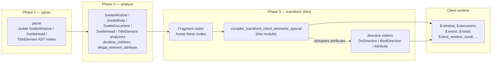
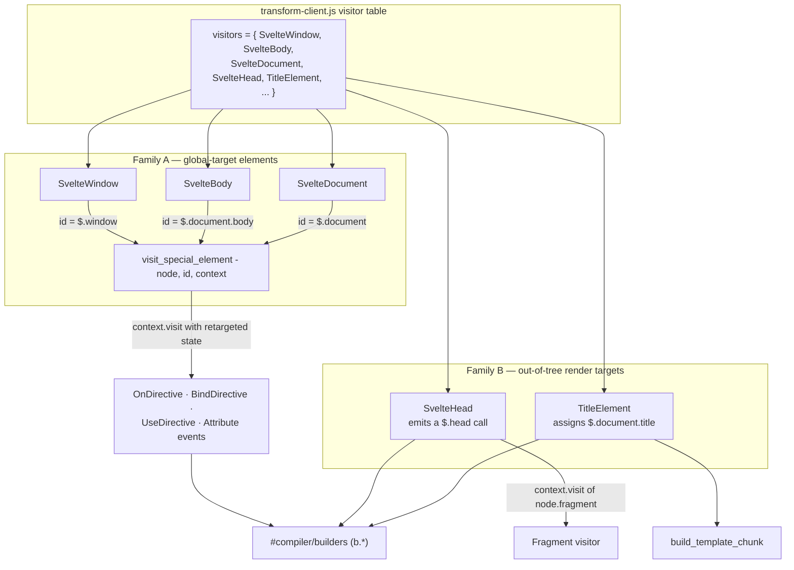
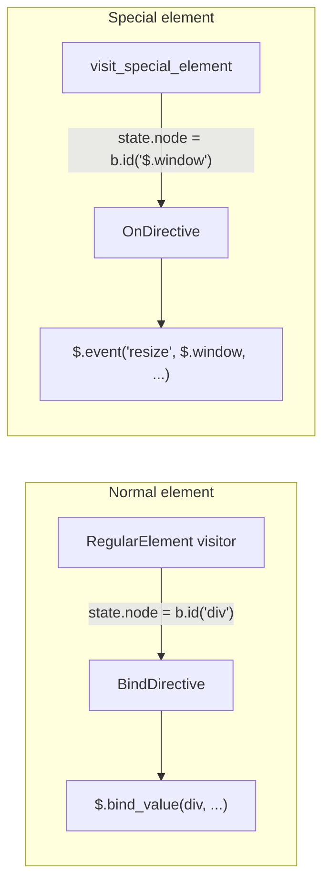
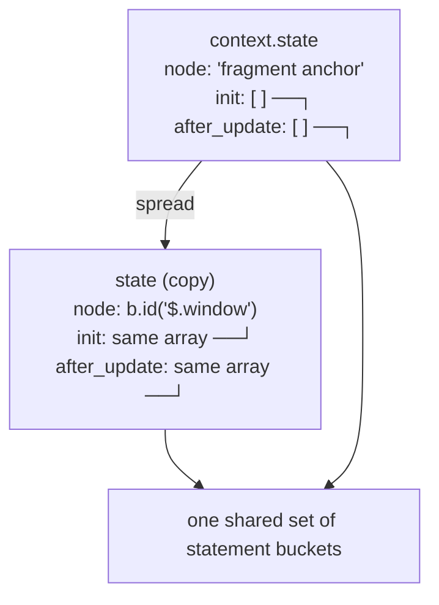
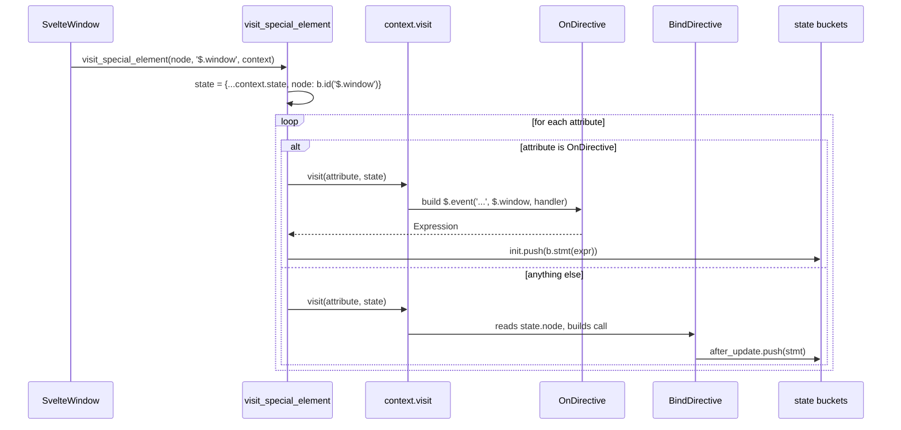
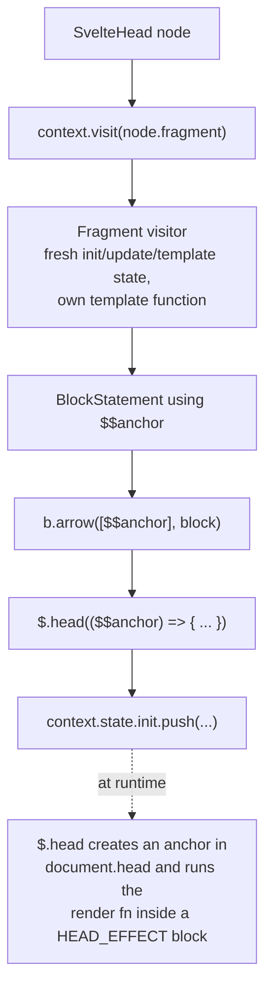
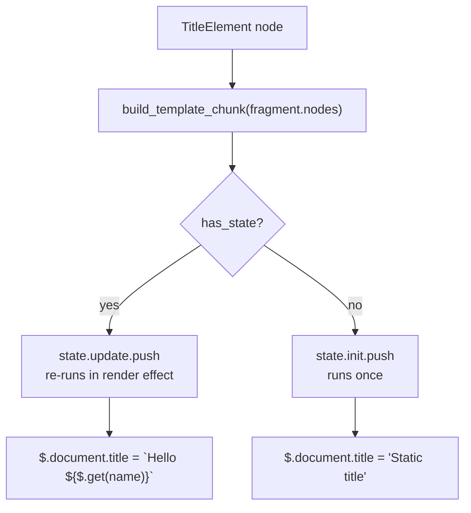
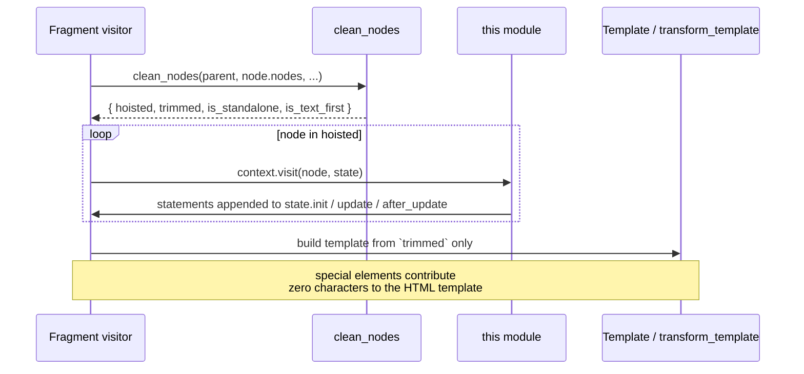
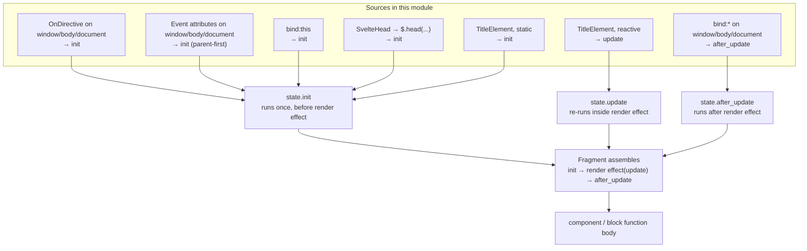
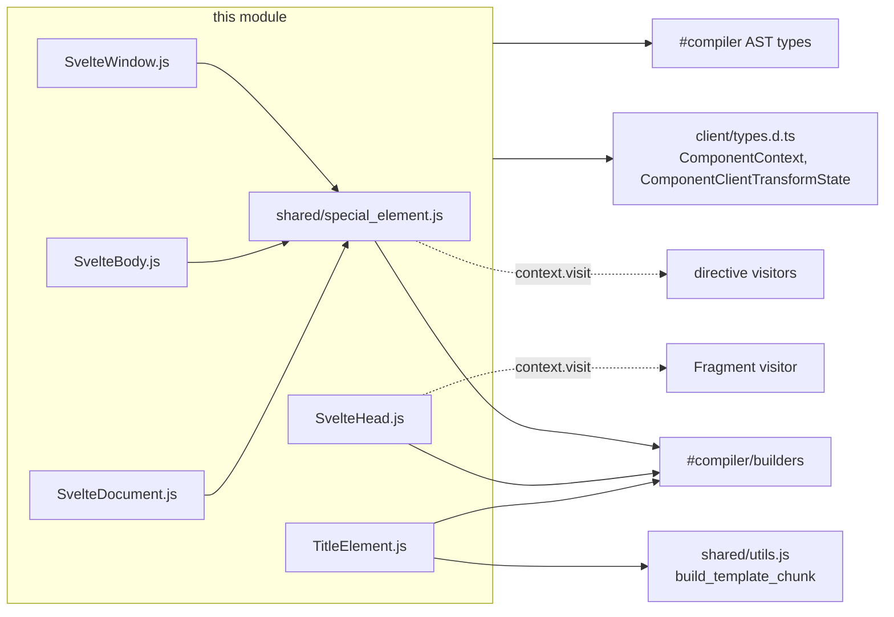

# compiler_transform_client_elements_special

## Introduction

Most template nodes in Svelte turn into real DOM nodes. A few do not. `<svelte:window>`, `<svelte:body>`, `<svelte:document>`, `<svelte:head>` and `<title>` all talk to things that already exist in the page — the browser window, the `<body>` tag, the document, the `<head>` tag, the tab title. The component does not own them and must not create them.

This module holds the client-side (DOM) transform visitors for exactly those five nodes. It is a small module — five thin visitors plus one shared helper — but it solves a specific problem: **how do you reuse the normal attribute/directive/fragment machinery when there is no element to attach to?**

The answer is two tricks:

1. **Node retargeting** — swap the "current DOM node" in the transform state for a runtime reference to a global (`$.window`, `$.document`, `$.document.body`), then let the ordinary directive visitors run unchanged.
2. **Out-of-tree rendering** — for `<svelte:head>` and `<title>`, emit code that writes into `document.head` / `document.title` instead of into the component's template.

| Component | File | Target |
|---|---|---|
| `visit_special_element` | `visitors/shared/special_element.js` | shared helper for the three global elements |
| `SvelteWindow` | `visitors/SvelteWindow.js` | `$.window` |
| `SvelteBody` | `visitors/SvelteBody.js` | `$.document.body` |
| `SvelteDocument` | `visitors/SvelteDocument.js` | `$.document` |
| `SvelteHead` | `visitors/SvelteHead.js` | `document.head`, via `$.head(...)` |
| `TitleElement` | `visitors/TitleElement.js` | `$.document.title` |

Related modules: [compiler_transform_client](compiler_transform_client.md) (the phase these visitors are registered in), [compiler_transform_client_elements](compiler_transform_client_elements.md) (the parent element-transform group), [compiler_analyze_special_elements](compiler_analyze_special_elements.md) (the validation that runs first), [compiler_transform_server](compiler_transform_server.md) (the SSR counterparts).

---

## 1. Where this module sits

These visitors are leaves of the client transform (phase 3). They only ever run on an AST that phase 2 has already validated, and the code they emit calls into the client runtime.



Links: [compiler_parse](compiler_parse.md) · [compiler_analyze_special_elements](compiler_analyze_special_elements.md) · [compiler_transform_client_template](compiler_transform_client_template.md) · [compiler_transform_client_directives](compiler_transform_client_directives.md) · [client_dom_elements](client_dom_elements.md) · [client_bindings](client_bindings.md) · [client_blocks](client_blocks.md)

### What phase 2 guarantees

The transform visitors are deliberately naive. They can be, because analysis has already rejected the bad cases:

| Node | Guarantee from phase 2 |
|---|---|
| `<svelte:window>`, `<svelte:body>`, `<svelte:document>` | no children (`disallow_children`); attributes are **only** event attributes, `bind:`, `use:`, `on:` — plain attributes and spreads raise `illegal_element_attribute` |
| `<svelte:head>` | no attributes at all (`svelte_head_illegal_attribute`); subtree marked dynamic |
| `<title>` | no attributes; children are only `Text` or `ExpressionTag` (`title_invalid_content`) |

That is why, for example, `TitleElement` can cast `node.fragment.nodes` straight to a text/expression list without checking, and why `visit_special_element` never looks at `node.fragment`.

---

## 2. Component architecture



The two families barely share code. `visit_special_element` exists only for family A, where all three visitors are literally one line each — the *only* difference between `<svelte:window>` and `<svelte:document>` at the codegen level is which runtime global gets substituted.

---

## 3. Family A — node retargeting

### 3.1 The core idea

`visit_special_element` is nine lines long:

```js
export function visit_special_element(node, id, context) {
    const state = { ...context.state, node: b.id(id) };

    for (const attribute of node.attributes) {
        if (attribute.type === 'OnDirective') {
            context.state.init.push(b.stmt(context.visit(attribute, state)));
        } else {
            context.visit(attribute, state);
        }
    }
}
```

`ComponentClientTransformState.node` is the identifier of "the DOM node we are currently building" — see [compiler_transform_client_core_state](compiler_transform_client_core_state.md). Every directive visitor reads `context.state.node` when it needs a target. By shallow-copying the state and replacing only `node` with `b.id('$.window')`, this helper makes the entire directive layer work against a global with zero changes on the directive side.



`b.id('$.window')` builds an `Identifier` whose *name* is the literal string `"$.window"`. It is not a real member expression — it is a shortcut that prints correctly. `'$.document.body'` uses the same shortcut for a two-level access.

### 3.2 Why the shallow copy matters

This is the subtlest part of the module. `{ ...context.state }` copies the **references** to `init`, `update`, `after_update` and `consts` — it does not copy the arrays. So a directive visitor that pushes into `state.after_update` is pushing into the *same* array the surrounding component is collecting into. Only `node` is genuinely overridden.



Consequence: the helper does not have to collect and re-splice anything. Directives self-deliver into the right bucket.

### 3.3 Why `OnDirective` is special-cased

Visitors in this phase come in two flavours:

* **self-delivering** — the visitor pushes its own statement into `state.init` / `state.after_update` and returns nothing useful (`Attribute` → `visit_event_attribute`, `BindDirective`, `UseDirective`).
* **expression-returning** — `OnDirective` (the legacy `on:click` form) *returns* the `$.event(...)` call expression, because callers sometimes need the value rather than a statement.

So `visit_special_element` wraps the `OnDirective` return value in `b.stmt(...)` and pushes it into `init` itself. Everything else is visited for its side effects only.



### 3.4 Event ordering: `init`, not `after_update`

Regular element events are registered in `after_update` so that attributes are set before listeners attach. Window/body/document events go into `init` instead. `visit_event_attribute` in [compiler_transform_client_directives](compiler_transform_client_directives.md) does this explicitly:

```js
const type = context.path.at(-1).type;
if (type === 'SvelteDocument' || type === 'SvelteWindow' || type === 'SvelteBody') {
    // These nodes are above the component tree, and its events should run parent first
    context.state.init.push(statement);
} else {
    context.state.after_update.push(statement);
}
```

These targets sit *above* the component in the DOM tree, so their handlers should fire before (outer-first) the component's own handlers during the bubbling/delegation phase. Registering early achieves that. `visit_special_element` mirrors the same choice for the legacy `OnDirective` path.

### 3.5 Bindings that ignore the retargeted node

Not every binding uses `state.node`. Some window/document bindings have no meaningful element and the runtime reads the global directly. From `BindDirective`:

| Binding | Generated call | Uses `state.node`? |
|---|---|---|
| `bind:scrollX` / `bind:scrollY` | `$.bind_window_scroll('x' \| 'y', get, set)` | no |
| `bind:innerWidth` / `innerHeight` / `outerWidth` / `outerHeight` | `$.bind_window_size('innerWidth', set)` | no |
| `bind:online` | `$.bind_online(set)` | no |
| `bind:activeElement` | `$.bind_active_element(set)` | no |
| `bind:this` | `$.bind_this(...)` | yes, pushed to `init` |
| generic property bindings | `$.bind_property(name, event, state.node, ...)` | yes |

So the retargeting is *load-bearing for events and generic bindings*, and merely harmless for the window-specific bindings. See [client_bindings](client_bindings.md) for the runtime side.

### 3.6 `$.window` / `$.document` are not the globals

The compiled output never writes bare `window` or `document`. It writes `$.window` / `$.document`, which the runtime re-exports from `dom/operations.js`:

```js
// export these for reference in the compiled code, making global name deduplication unnecessary
export var $window;
export var $document;

export function init_operations() {
    if ($window !== undefined) return;
    $window = window;
    $document = document;
    // ...
}
```

Two benefits:

* **No name collisions.** A component is free to declare `let window = ...`; the emitted `$.window` cannot be shadowed, so the compiler does not need to generate a unique alias.
* **Server safety.** The values are assigned lazily by `init_operations()`, so importing the runtime in a non-DOM context does not touch missing globals.

See [client_render_and_templates](client_render_and_templates.md).

---

## 4. Family B — out-of-tree render targets

### 4.1 `SvelteHead`

`<svelte:head>` has real children, and those children must be appended to `document.head` rather than to the component's fragment. The visitor recurses into the fragment to get a normal block statement, then wraps it in a `$.head(...)` call that supplies its own anchor:

```js
context.state.init.push(
    b.stmt(
        b.call(
            '$.head',
            b.arrow([b.id('$$anchor')], context.visit(node.fragment))
        )
    )
);
```



The nested `Fragment` visit is what makes this work: it allocates its own template, its own statement buckets, and its own `$$anchor` parameter, so the head content is a self-contained render function. See [compiler_transform_client_template](compiler_transform_client_template.md).

At runtime, `$.head` (in [client_blocks](client_blocks.md)) appends a text anchor to `document.head`, or — during hydration — walks `document.head` looking for the `HYDRATION_START` comment so multiple independent `<svelte:head>` blocks each hydrate from the right position. If no marker is found, it silently drops out of hydration mode. None of that complexity leaks into the compiler; the visitor just emits the call.

The `// TODO attributes?` comment in the source is safe today because phase 2 rejects every attribute on `<svelte:head>`.

### 4.2 `TitleElement`

`<title>` is not rendered as an element at all — it becomes a plain assignment to `document.title`:

```js
const { has_state, value } = build_template_chunk(node.fragment.nodes, context);
const statement = b.stmt(b.assignment('=', b.id('$.document.title'), value));

if (has_state) {
    context.state.update.push(statement);   // inside the render effect
} else {
    context.state.init.push(statement);     // once, at setup
}
```

`build_template_chunk` (see [compiler_transform_client_core_expressions](compiler_transform_client_core_expressions.md)) folds the `Text` / `ExpressionTag` children into a single template literal — or a bare expression when there is only one dynamic child — and reports whether any part is reactive. That flag drives the only branch in the visitor:



`build_template_chunk` also handles literal folding and memoization of call/await expressions through the state's `Memoizer`, so `<title>{expensive()}</title>` does not re-invoke the call more than needed.

Note that `TitleElement` is one of only two node types the `Fragment` visitor treats as "a single child not needing a template" (the other is `SvelteFragment`) — because it produces no DOM at all.

---

## 5. Hoisting: how these visitors get called early

None of these five nodes emit template markup, and several of them need to run before the surrounding element tree is built. `clean_nodes` in `phases/3-transform/utils.js` splits a fragment's children into `hoisted` and `regular`, and puts all five node types (plus `ConstTag`, `DebugTag`, `SnippetBlock`) into `hoisted`:

```js
if (
    node.type === 'ConstTag' ||
    node.type === 'DebugTag' ||
    node.type === 'SvelteBody' ||
    node.type === 'SvelteWindow' ||
    node.type === 'SvelteDocument' ||
    node.type === 'SvelteHead' ||
    node.type === 'TitleElement' ||
    node.type === 'SnippetBlock'
) {
    hoisted.push(node);
} else {
    regular.push(node);
}
```

The `Fragment` visitor then visits every hoisted node **before** it decides on a template strategy for the remaining children:



Two effects worth remembering:

* The special elements never appear in the template string, so they do not consume a template slot and do not shift sibling `$.child` / `$.sibling` traversal.
* Their generated statements land in the *surrounding* fragment's buckets, which is why `<svelte:window>` inside an `{#if}` block correctly gets torn down with that block.

---

## 6. Data flow: from statement buckets to output

Everything this module does ends up in one of three buckets on `ComponentClientTransformState`. The `Fragment` visitor assembles them in a fixed order.



---

## 7. Worked examples

### `<svelte:window>`

```svelte
<svelte:window onkeydown={handle} bind:scrollY={y} />
```

```js
// init
$.event('keydown', $.window, handle);
// after_update
$.bind_window_scroll('y', () => y, ($$value) => y = $$value);
```

### `<svelte:body>`

```svelte
<svelte:body onmouseenter={enter} />
```

```js
// init
$.event('mouseenter', $.document.body, enter);
```

### `<svelte:document>`

```svelte
<svelte:document bind:activeElement={el} />
```

```js
// after_update
$.bind_active_element(($$value) => el = $$value);
```

### `<svelte:head>`

```svelte
<svelte:head>
    <meta name="description" content={description} />
</svelte:head>
```

```js
// init
$.head(($$anchor) => {
    var meta = root_1();
    $.template_effect(() => $.set_attribute(meta, 'content', description));
    $.append($$anchor, meta);
});
```

### `<title>`

```svelte
<title>Hello {name}</title>
```

```js
// update (inside the render effect, because has_state === true)
$.document.title = `Hello ${name}`;
```

---

## 8. Client vs. server

The same five nodes exist in the SSR transform ([compiler_transform_server](compiler_transform_server.md)), but the strategies differ completely — a useful contrast for understanding why the client versions look the way they do.

| Node | Client (this module) | Server |
|---|---|---|
| `<svelte:window>` / `<svelte:body>` / `<svelte:document>` | retarget `state.node` to a runtime global; emit event/binding calls | **no visitor at all** — nothing to render, listeners are meaningless |
| `<svelte:head>` | `$.head(($$anchor) => { ... })` — appends into live `document.head` | `$.head($$payload, ($$payload) => { ... })` — writes into a separate `head` payload buffer |
| `<title>` | `$.document.title = ...` — mutates the live document | `$$payload.title = '<title>' + ... + '</title>'` — a string in the payload |

The client side mutates existing browser objects; the server side accumulates strings in the payload. The hydration markers written by the server `$.head` are what the client `$.head` searches for. See [server_runtime](server_runtime.md).

---

## 9. Dependencies



| Dependency | Used for | Module |
|---|---|---|
| `#compiler/builders` (`b.id`, `b.stmt`, `b.call`, `b.arrow`, `b.assignment`) | building the output ESTree nodes | [compiler_core](compiler_core.md) |
| `build_template_chunk` | folding `<title>` children into one expression + reactivity flag | [compiler_transform_client_core_expressions](compiler_transform_client_core_expressions.md) |
| `ComponentContext`, `ComponentClientTransformState` | the `node` field being retargeted, the statement buckets | [compiler_transform_client_core_state](compiler_transform_client_core_state.md) |
| `AST.SvelteWindow` / `SvelteBody` / `SvelteDocument` / `SvelteHead` / `TitleElement` | node shapes | [compiler_ast_types](compiler_ast_types.md) |
| zimmerframe `context.visit` | delegating to directive and fragment visitors | [compiler_transform_client](compiler_transform_client.md) |

Runtime functions referenced by name in the emitted code: `$.window`, `$.document` ([client_render_and_templates](client_render_and_templates.md)), `$.head` ([client_blocks](client_blocks.md)), `$.event` ([client_dom_elements](client_dom_elements.md)), `$.bind_window_scroll`, `$.bind_window_size`, `$.bind_online`, `$.bind_active_element` ([client_bindings](client_bindings.md)).

---

## 10. Notes for maintainers

* **Adding a new global-target special element** (say `<svelte:navigator>`): add an analyzer in [compiler_analyze_special_elements](compiler_analyze_special_elements.md), add a one-line visitor calling `visit_special_element(node, '$.navigator', context)`, register it in `transform-client.js`, add the node type to the hoisting list in `3-transform/utils.js`, and add the type to `events.js`'s parent-first check if its events should run outer-first.
* **`state` is a shallow copy.** If you ever need a special element's directives to collect into *separate* buckets, you must explicitly create new arrays — the spread will not do it for you.
* **`b.id('$.document.body')` is a string hack.** It prints correctly but is not a structurally valid member expression. Any pass that inspects identifiers structurally (a minifier, a scope walker) would see one identifier named `$.document.body`. Keep that in mind before running these nodes through a generic AST utility.
* **`SvelteHead`'s `// TODO attributes?`** is currently unreachable — phase 2 errors on any attribute. If that validation is ever relaxed, this visitor needs the family-A treatment.
* **`TitleElement` trusts phase 2's content check.** The cast to `any` on `node.fragment.nodes` bypasses the type system; loosening `title_invalid_content` would break `build_template_chunk`.
