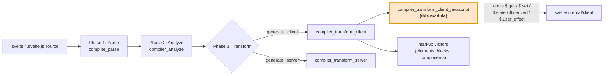
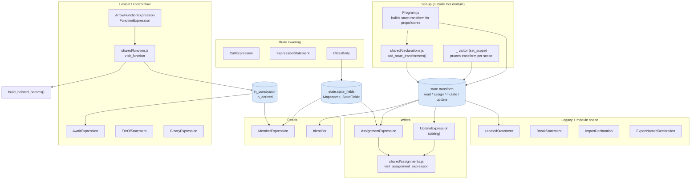
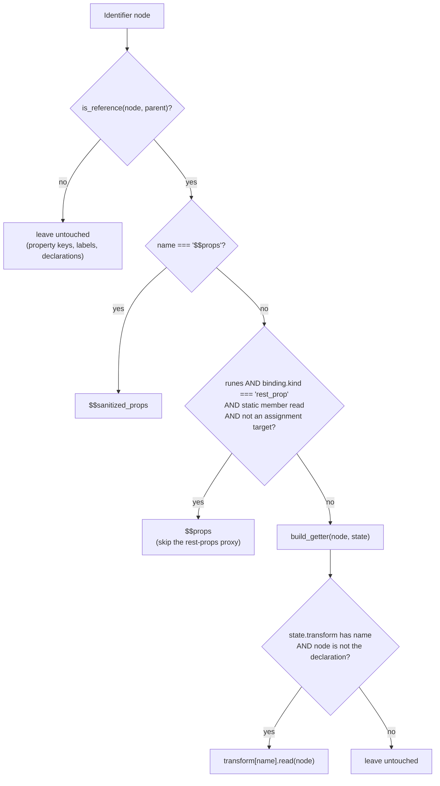
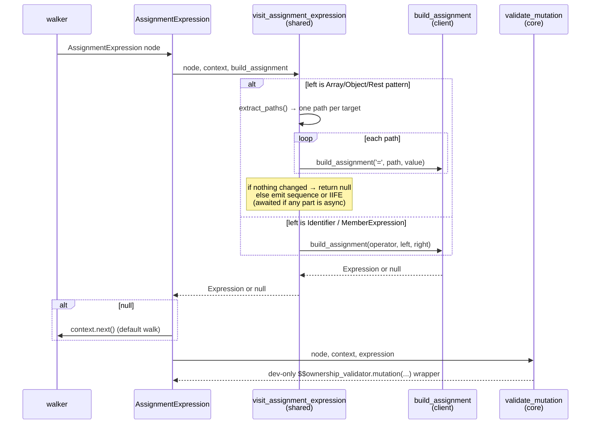
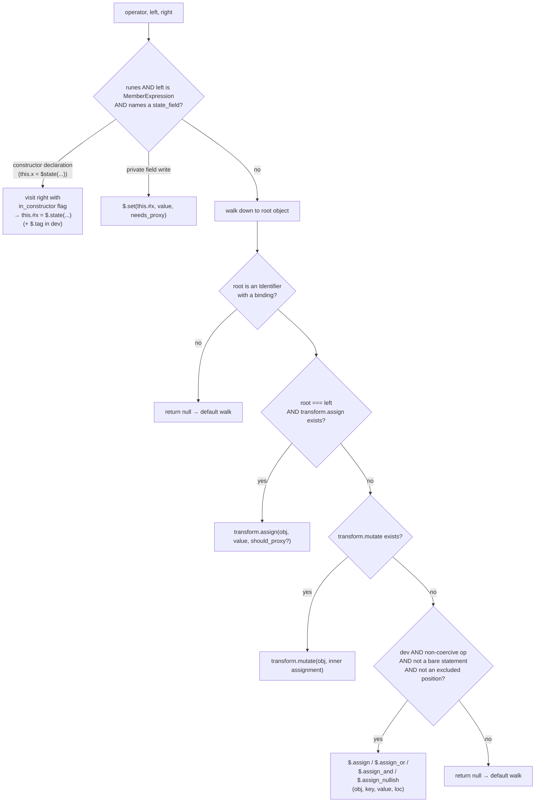
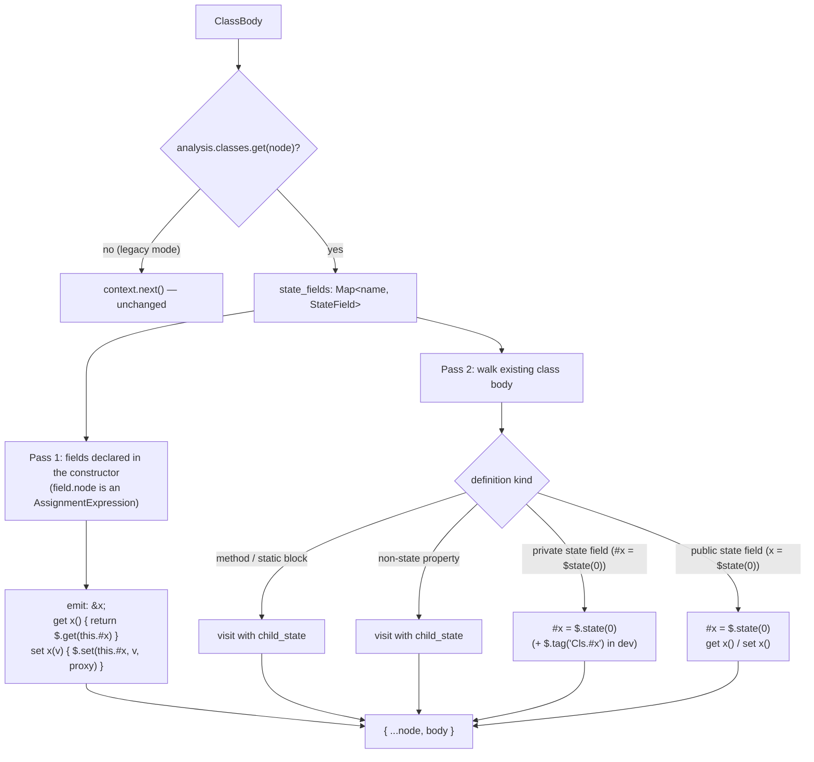
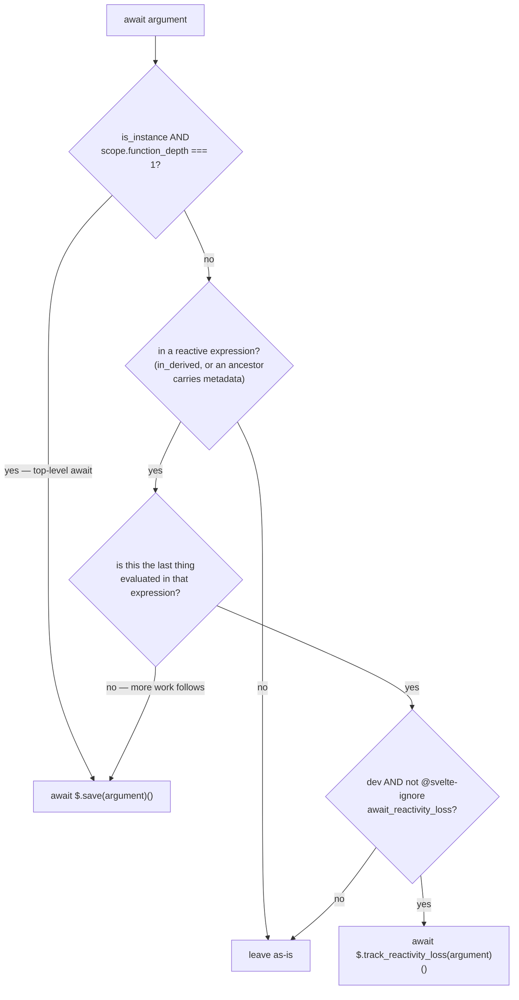
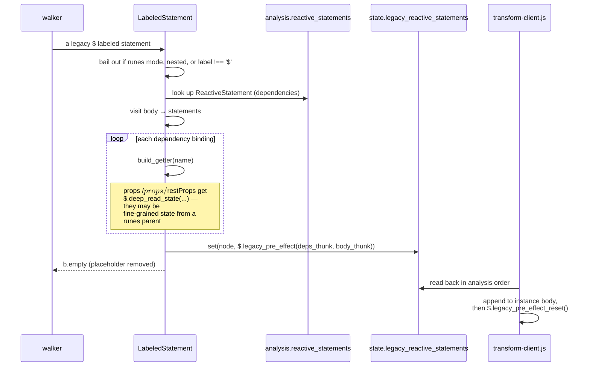
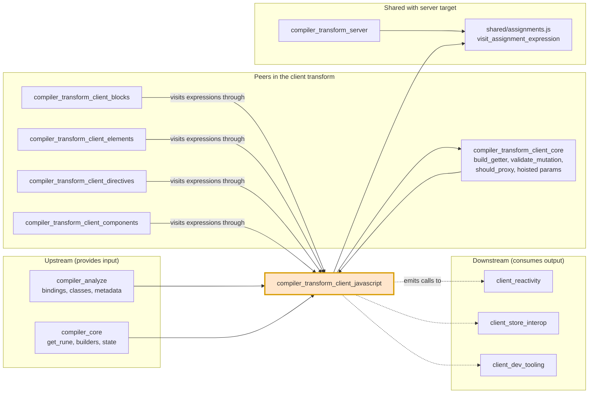

# compiler_transform_client_javascript

## 1. What This Module Is

`compiler_transform_client_javascript` is the part of Svelte's client code generator that rewrites
**plain JavaScript** — the code you write inside `<script>` blocks, inside `{...}` template
expressions, and inside `.svelte.js` modules.

Every other client-transform module deals with markup: elements, blocks, components, directives.
This module deals with the language itself. It answers questions like:

- "This is a read of `count`. Should the output say `count`, or `$.get(count)`, or `$$props.count`?"
- "This is `count = 1`. Should the output say `count = 1`, or `$.set(count, 1)`?"
- "This is `$state(0)`. What runtime call replaces it?"
- "This is `$: total = a + b`. How do we recreate Svelte 4 behaviour with runes-era primitives?"
- "This `await` is inside a `$derived`. Do we need to save and restore reactive context around it?"
- "This class has `#count = $state(0)`. What backing field and getter/setter pair do we emit?"

The rule of thumb: **markup visitors decide *where* code goes; this module decides *what the code
says*.**

### Core files

| File | Node type it handles | Job |
| --- | --- | --- |
| `Identifier.js` | `Identifier` | Rewrite every variable *read* |
| `MemberExpression.js` | `MemberExpression` | Rewrite `this.#field` reads in classes |
| `AssignmentExpression.js` | `AssignmentExpression` | Rewrite every *write* (`=`, `+=`, `??=`, destructuring) |
| `CallExpression.js` | `CallExpression` | Turn rune calls (`$state`, `$derived`, `$host`, `$inspect`, …) into runtime calls |
| `ExpressionStatement.js` | `ExpressionStatement` | Turn statement-position runes (`$effect`, `$effect.pre`, `$inspect.trace`) into effects |
| `ClassBody.js` | `ClassBody` | Rewrite `$state` class fields into backing field + accessor pair |
| `ArrowFunctionExpression.js`, `FunctionExpression.js`, `shared/function.js` | function nodes | Track lexical flags and rewrite hoisted event handlers |
| `AwaitExpression.js` | `AwaitExpression` | Preserve reactive context across `await` |
| `ForOfStatement.js` | `ForOfStatement` | Dev-mode reactivity-loss tracking for `for await` |
| `BinaryExpression.js` | `BinaryExpression` | Dev-mode equality checks that see through proxies |
| `LabeledStatement.js`, `BreakStatement.js` | `$:` statements | Legacy reactive statements |
| `ImportDeclaration.js`, `ExportNamedDeclaration.js` | module structure | Hoist imports, flatten instance exports |

---

## 2. Where It Sits In The Compiler

The module is **downstream of analysis and upstream of the runtime**:

- Phase 2 ([compiler_analyze](compiler_analyze.md)) has already built `Scope` objects, `Binding`
  records (`kind`, `reassigned`, `mutated`, `declaration_kind`, …), `analysis.classes`
  (the `StateField` map per class body), `analysis.reactive_statements`, and per-expression
  `metadata`. This module *reads* that and never re-derives it.
- The output is not standalone JavaScript; it is a stream of calls into the client runtime.
  See [client_reactivity](client_reactivity.md), [client_store_interop](client_store_interop.md),
  and [client_dev_tooling](client_dev_tooling.md) for the receiving end.

Both entry points in `transform-client.js` — `client_component` (for `.svelte`) and `client_module`
(for `.svelte.js`) — register the same visitor table, so this module runs for components *and* for
standalone reactive modules.

---

## 3. Architecture Overview

There is no dispatcher inside this module. Each file exports one function named after the ESTree /
Svelte AST node type, and `transform-client.js` assembles them into a single
[zimmerframe](https://github.com/Rich-Harris/zimmerframe) visitor table. Coordination happens
through **shared mutable state**, not through direct calls between visitors.

---

## 4. The Three Shared Channels

Almost everything in this module is driven by three fields on the transform state (defined in
`client/types.d.ts`, documented in [compiler_transform_client_core_state](compiler_transform_client_core_state.md)).

### 4.1 `state.transform` — the rewrite table

A `Record<string, {read, assign?, mutate?, update?}>` keyed by variable name. It is the single
source of truth for "how do I touch this variable in output code".

| Hook | Input | Typical output |
| --- | --- | --- |
| `read` | `foo` | `$.get(foo)`, `foo()`, `$$props.foo`, `$.safe_get(foo)` |
| `assign` | `foo = bar` | `$.set(foo, bar)`, `foo(bar)`, `$.store_set(foo, bar)` |
| `mutate` | `foo.bar = baz` | `$.mutate(foo, $.get(foo).bar = baz)` (legacy), or unchanged (runes) |
| `update` | `foo++` | `$.update(foo)` / `$.update_pre(foo, -1)` |

Who fills it in:

- `Program.js` — props (`$.prop` sources vs. plain `$$props.x` reads), store subscriptions
  (`$.store_get` / `$.store_set` / `$.store_mutate`), legacy reactive imports.
- `shared/declarations.js::add_state_transformers` — `$state`, `$state.raw`, `$derived`, and legacy
  `$:` declarations, all of which read via `$.get` and write via `$.set`.
- The `_` (set_scope) visitor **deletes** entries when entering a nested scope that shadows the
  name, and for `$state` bindings that are never reassigned (a read-only `$state` needs no
  `$.get`).

This design is why the visitors here are so short: `Identifier` does not know what a store is; it
just looks the name up in the table.

### 4.2 `state.state_fields` — class field info

Set by `ClassBody` for the class it is currently rewriting (from `analysis.classes`). Maps a field
name (`foo`, or `#foo` for private) to a `StateField` describing its rune type (`$state`,
`$state.raw`, `$derived`, …), its declaring node, and the backing key. `MemberExpression` and
`AssignmentExpression` consult it to rewrite `this.#foo`.

### 4.3 `in_constructor` / `in_derived` — lexical flags

Two booleans threaded down by `visit_function` and `CallExpression`:

- `in_constructor` — we are lexically inside a class constructor, so a private state field can be
  touched directly as `this.#foo.v` instead of `$.get(this.#foo)`.
- `in_derived` — we are directly inside `$derived(...)` (not `$derived.by(...)`), which makes
  `AwaitExpression` treat the surrounding expression as reactive.

---

## 5. Reads: `Identifier` and `MemberExpression`

### 5.1 `Identifier`

Two things worth noting:

- `is_reference` guards against rewriting things that merely *look* like variables — object keys,
  labels, member properties.
- The `rest_prop` branch is a pure optimisation: `rest.foo` can read straight off `$$props` instead
  of going through the rest-props proxy, but only for a static, non-mutating read, and only in runes
  mode (in legacy mode the proxy does more than read).
- `build_getter` explicitly skips the *declaration* node itself, so `let count = $state(0)` does not
  become `let $.get(count) = ...`.

### 5.2 `MemberExpression`

Only one case is handled: `this.#foo` where `#foo` is a state field.

| Context | Output |
| --- | --- |
| Inside constructor, field is `$state` / `$state.raw` | `this.#foo.v` (direct source access, cheaper) |
| Anywhere else | `$.get(this.#foo)` |

Everything else falls through to `context.next()`, so `a.b.c` is walked normally and its object is
rewritten by `Identifier`.

---

## 6. Writes: `AssignmentExpression`

This is the largest and most branch-heavy visitor in the module. It delegates the *pattern* work to
`shared/assignments.js::visit_assignment_expression` (shared with
[compiler_transform_server](compiler_transform_server.md)) and supplies the client-specific
`build_assignment` callback.

### 6.1 The `build_assignment` decision ladder

Key details behind each branch:

**Proxy decisions.** A `$state` write only needs `$.proxy` when the operator does *not* coerce the
value (`=`, `||=`, `&&=`, `??=` — see `is_non_coercive_operator`) and when
`should_proxy(value, scope)` says the value could hold nested state. Prop, `raw_state`, `derived`,
and `store_sub` bindings never get proxied here; nor does a `bind:` target on a regular element,
which is known to be a primitive.

**The `$.assign` family (dev only).** For code like `(object.items ??= []).push(value)` the proxy
created by the assignment is *not* the object that gets pushed to. Rewriting to
`$.assign_nullish(object, 'items', [], loc)` lets the runtime warn. Several positions are explicitly
excluded because a `?? =` there is intentional and harmless:

- `onclick={() => (...)}` — arrow directly inside an element event attribute
- `bind:value={x.y}` and `bind:prop={getter, (v) => (...)}` sequences
- component / `svelte:component` attribute positions

**Destructuring.** `visit_assignment_expression` splits `[a, b] = value` into one assignment per
path via `extract_paths`. If *none* of the paths needed rewriting it returns `null` so the original
node is kept verbatim (better output, better source maps). Otherwise it emits either a
`SequenceExpression` or an IIFE (`(($$value) => { ... })(value)`), `await`-ed when any part is
async, and ending with the value when the assignment is used as an expression rather than a
statement.

**Ownership validation.** Every path finishes through `validate_mutation`
([compiler_transform_client_core_expressions](compiler_transform_client_core_expressions.md)), which
in dev mode wraps mutations of `prop` / `bindable_prop` members in
`$$ownership_validator.mutation(...)`.

`UpdateExpression` (`foo++`) is the sibling of this visitor and uses the same `transform.update` /
`transform.mutate` / `validate_mutation` chain, plus the same `this.#foo` special case
(`$.update(this.#foo)`).

---

## 7. Rune Lowering

### 7.1 `CallExpression`

`get_rune(node, scope)` (from [compiler_core](compiler_core.md)'s `scope.js`) classifies the callee;
the visitor is then a flat mapping table.

| Rune | Emitted |
| --- | --- |
| `$host` | `$$props.$$host` |
| `$state(v)` | `$.state(v)`, wrapping `v` in `$.proxy(...)` when `should_proxy` |
| `$state.raw(v)` | `$.state(v)` (never proxied) |
| `$derived(fn)` | `$.derived(() => fn)`, child visited with `in_derived: true` |
| `$derived.by(fn)` | `$.derived(fn)` |
| `$state.snapshot(v)` | `$.snapshot(v, ignore_uncloneable?)` |
| `$effect.tracking()` | `$.effect_tracking()` |
| `$effect.root(fn)` | `$.effect_root(fn)` |
| `$effect.pending()` | `$.pending()` |
| `$inspect(...)`, `$inspect().with(...)` | `transform_inspect_rune(...)` → `$.inspect(() => [...], with?)`; erased outside dev |

Anything that is not a rune falls through, with one dev-only extra: a `console.log`-family call
whose arguments include a spread or a value the scope evaluator cannot pin down is rewritten to
`console.log(...$.log_if_contains_state('log', ...args))`, so logging a raw state proxy prints a
useful warning. The `console` global must be un-shadowed for this to fire.

### 7.2 `ExpressionStatement`

Runes that only make sense as statements are handled one level up, so the effect wrapper replaces
the whole statement:

| Statement | Emitted |
| --- | --- |
| `$effect(fn)` | `$.user_effect(fn)` |
| `$effect.pre(fn)` | `$.user_pre_effect(fn)` |
| `$inspect.trace(...)` | nothing (`b.empty`) — the analysis phase already set `analysis.tracing`, which makes `transform-client.js` import the tracing flag |

The callee's `loc` is copied onto the new call so stack traces and source maps still point at the
user's `$effect`.

### 7.3 `ClassBody`

Class state fields become a private backing signal plus a public getter/setter pair, so
`obj.count` keeps working while reads and writes route through the runtime.

Notes:

- The child state carries `state_fields`, which is what lets `MemberExpression` and
  `AssignmentExpression` recognise `this.#x` deeper in the tree.
- Fields first assigned in the constructor (`this.count = $state(0)`) need their backing field
  *declared* in the class body, which is what pass 1 does; the constructor assignment itself is
  rewritten by `AssignmentExpression`.
- In dev, every state field is wrapped in `$.tag(value, 'ClassName.field')` so
  [client_dev_tooling](client_dev_tooling.md) can name signals in `$inspect.trace` output.
- Private fields get no accessors — reads go through `MemberExpression`, writes through
  `AssignmentExpression`.

---

## 8. Functions, Async, and Dev Equality

### 8.1 `visit_function`

`ArrowFunctionExpression` and `FunctionExpression` are one-line wrappers around
`shared/function.js::visit_function`. It does two things:

1. **Resets lexical flags.** Entering any function clears `in_constructor` and `in_derived` (a
   callback inside `$derived(...)` is not itself the derived expression). It then sets
   `in_constructor: true` when a `FunctionExpression` is the value of a `constructor`
   `MethodDefinition`.
2. **Rewrites hoisted functions.** When analysis marked the function `metadata.hoisted`, the closed-
   over reactive values cannot be captured by closure — the function lives outside the component
   instance. `build_hoisted_params`
   ([compiler_transform_client_core_bindings](compiler_transform_client_core_bindings.md)) turns
   those references into extra parameters, and the body is visited with the reset state. This is what
   makes delegated event handlers (`onclick`) shareable across instances; see
   [compiler_transform_client_directives](compiler_transform_client_directives.md) for the call side.

Note `FunctionDeclaration` is a separate visitor outside this module's core set, but follows the same
hoisting idea.

### 8.2 `AwaitExpression`

An `await` can silently break reactive tracking: after the microtask boundary the runtime no longer
knows which effect is running.

- `$.save` captures and restores reactive context, so anything evaluated *after* the await still
  tracks correctly. It is emitted for top-level await in `<script>` and for awaits that precede
  further work inside a template expression or `$derived`.
- If the await *is* the last thing evaluated, nothing follows it, so no save is needed — in dev the
  cheaper `$.track_reactivity_loss` wrapper is emitted instead, which only warns.
- `is_last_evaluated_expression` walks up the expression tree with per-node-type rules (last array
  element, last call argument, right side of a binary, last sequence expression, …) until it reaches
  a node carrying `metadata`, which marks the reactive expression root.
- Runtime counterparts live in [client_reactivity](client_reactivity.md) (`$.save`, `$.async_body`).
  `transform-client.js` wraps an instance containing top-level await in `$.async_body(...)`.

### 8.3 `ForOfStatement`

Only `for await (... of ...)` in dev mode, with `experimental.async` enabled and no
`@svelte-ignore await_reactivity_loss`, is touched: the iterable is wrapped in
`$.for_await_track_reactivity_loss(iterable)`. Same idea as above, applied to async iteration.

### 8.4 `BinaryExpression`

Dev-only. Because `$state` objects are Proxies, `a === b` can be false when `a` and `b` are "the
same" object seen through different lenses. In dev the visitor rewrites:

| Source | Output |
| --- | --- |
| `a === b` | `$.strict_equals(a, b)` |
| `a !== b` | `$.strict_equals(a, b, false)` |
| `a == b` | `$.equals(a, b)` |
| `a != b` | `$.equals(a, b, false)` |

In production nothing is emitted, so there is zero cost. See `internal/client/dev/equality.js` in
[client_dev_tooling](client_dev_tooling.md).

---

## 9. Legacy Reactive Statements

`$: total = a + b` predates runes. It is recreated with `$.legacy_pre_effect`, which takes an
explicit dependency thunk (what the compiler *can* see) and an untracked body thunk — matching
Svelte 4's semantics rather than fine-grained runes tracking.

The statement is emitted as `b.empty` at its original position and stashed in
`state.legacy_reactive_statements`, because `$:` statements must be **topologically ordered** by
dependency, not by source order. `transform-client.js` replays them in
`analysis.reactive_statements` order.

`BreakStatement` handles the matching oddity: `break $` inside a `$:` block means "stop this
reactive statement". Since the block became a function body, it compiles to `return`. Only fires in
legacy mode, for label `$`, when the immediate ancestor is the `$:` labeled statement.

---

## 10. Module Structure: Imports and Exports

### 10.1 `ImportDeclaration`

If the state has a `hoisted` array (i.e. we are transforming a component, not a bare module), the
import node is moved into `state.hoisted` and replaced with `b.empty`. This matters because a
component's `<script>` body becomes the *inside* of a function — imports must live at module top
level. `transform-client.js` later re-splits `[...module.body, ...state.hoisted]` so all
`ImportDeclaration`s land first, in source order.

### 10.2 `ExportNamedDeclaration`

Inside the instance (`is_instance`):

- `export let foo = 1` → the declaration alone (`let foo = 1`); the export becomes part of the
  component's returned accessor object.
- `export { foo }` (no declaration) → `b.empty`.

Outside the instance (module context) it walks normally, so `<script module>` exports stay real ES
exports. The accessor/getter object itself is assembled in `transform-client.js` from
`analysis.exports`, which is why this visitor only has to *remove* the syntax.

---

## 11. Interaction With Other Modules

| Module | Relationship |
| --- | --- |
| [compiler_transform_client_core](compiler_transform_client_core.md) | Supplies `build_getter`, `should_proxy`, `build_hoisted_params`, `validate_mutation`, and the state contract. This module is its heaviest consumer. |
| [compiler_transform_client_blocks](compiler_transform_client_blocks.md), [_elements](compiler_transform_client_elements.md), [_directives](compiler_transform_client_directives.md), [_components](compiler_transform_client_components.md) | Markup visitors. Every template expression they visit flows through the visitors here. |
| [compiler_transform_client_template](compiler_transform_client_template.md) | Sets up `init` / `update` / `after_update` buckets and the `Memoizer` that decide where expressions produced here are placed. |
| [compiler_transform_server](compiler_transform_server.md) | Shares `visit_assignment_expression` and mirrors many visitor names with SSR-specific bodies — a useful comparison when changing semantics. |
| [compiler_analyze](compiler_analyze.md) | Produces the `Binding`, `StateField`, `ReactiveStatement`, and expression `metadata` this module branches on. |
| [client_reactivity](client_reactivity.md) | Runtime home of `$.state`, `$.get`, `$.set`, `$.derived`, `$.update`, `$.save`, `$.async_body`, `$.legacy_pre_effect`. |
| [client_store_interop](client_store_interop.md) | Runtime home of `$.store_get`, `$.store_set`, `$.store_mutate`, `$.update_store` used by the store `transform` entries. |
| [client_dev_tooling](client_dev_tooling.md) | Runtime home of `$.tag`, `$.inspect`, `$.equals`, `$.strict_equals`, `$.assign*`, `$.log_if_contains_state`, `$$ownership_validator`. |

---

## 12. Practical Notes For Maintainers

- **Add rewrites to `state.transform`, not to visitors.** If a new kind of binding needs different
  read/write code, register it in `Program.js` or `add_state_transformers`. `Identifier`,
  `AssignmentExpression`, and `UpdateExpression` then pick it up for free.
- **Returning `null` / falling through is meaningful.** `build_assignment` returning `null` means
  "emit the original node, walked normally", which keeps output small and source maps accurate.
  Prefer it over reconstructing an identical node.
- **Dev-only branches must be free in production.** Every `if (dev)` path here (`$.tag`,
  `$.strict_equals`, `$.assign*`, `$.track_reactivity_loss`, ownership validation) must leave the
  production output untouched.
- **Respect `@svelte-ignore`.** `is_ignored(node, '...')` gates `await_reactivity_loss`,
  `state_snapshot_uncloneable`, and `ownership_invalid_mutation`. New warnings should follow suit.
- **Keep client and server in step.** Rune semantics changes usually need matching edits in
  [compiler_transform_server](compiler_transform_server.md), especially anything routed through
  `shared/assignments.js`.
- **Lexical flags are easy to leak.** Anything that introduces a new function-like scope must reset
  `in_constructor` / `in_derived` the way `visit_function` does, or `this.#x` and `await` will be
  compiled with the wrong assumptions.
