# compiler_transform_client_template

## Introduction

When Svelte compiles a component for the browser, it does **not** emit code that builds the DOM node by node. Instead it emits a *template* — a single blueprint of the static parts of the markup — and then emits a small amount of code that clones the blueprint and patches the dynamic bits into it.

This module is the part of the client transform that builds that blueprint.

It has two jobs:

1. **Collect** the static shape of a fragment while the other client visitors walk the AST. Elements, comments and text get pushed into a small in-memory tree (the `Template` class).
2. **Emit** that tree as JavaScript — either as an HTML string handed to `$.from_html(...)`, or as a nested array handed to `$.from_tree(...)`.

On top of that, it owns the code that decides *how* a fragment is realised at runtime: whether it needs a hoisted template at all, whether a bare `$.text()` or `$.comment()` is enough, and how sibling nodes are reached (`$.child`, `$.sibling`, `$.first_child`, `$.next`).

Think of it as the "static skeleton" half of the client transform. The other client sub-modules ([elements](compiler_transform_client_elements.md), [blocks](compiler_transform_client_blocks.md), [components](compiler_transform_client_components.md), [directives](compiler_transform_client_directives.md)) supply the "dynamic muscle" that hangs off the skeleton.

---

## Table of contents

- [Where this module sits](#where-this-module-sits)
- [Core components](#core-components)
- [The template IR](#the-template-ir)
- [`Template` — the collector](#template--the-collector)
- [Two emit strategies: `stringify` vs `objectify`](#two-emit-strategies-stringify-vs-objectify)
- [`transform_template` — the emitter](#transform_template--the-emitter)
- [`Fragment` — the orchestrator](#fragment--the-orchestrator)
- [`process_children` — the sibling walker](#process_children--the-sibling-walker)
- [End-to-end walkthrough](#end-to-end-walkthrough)
- [Runtime handoff](#runtime-handoff)
- [Dependencies](#dependencies)
- [Design notes and gotchas](#design-notes-and-gotchas)

---

## Where this module sits

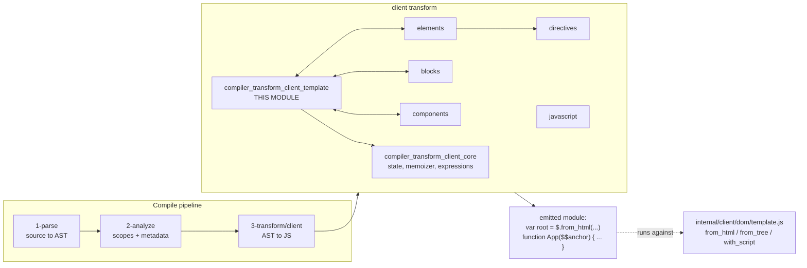

Related module docs: [compiler_transform_client](compiler_transform_client.md) (the parent), [compiler_transform_client_core](compiler_transform_client_core.md) (transform state + expression building), [client_render_and_templates](client_render_and_templates.md) (the runtime side), [compiler_analyze](compiler_analyze.md) (the metadata this module reads).

---

## Core components

| Component | File | Role |
| --- | --- | --- |
| `Template` | `transform-template/template.js` | Mutable builder for the static node tree of one fragment |
| `stringify` | `transform-template/template.js` | IR node → HTML string (`fragments: 'html'` mode) |
| `objectify` | `transform-template/template.js` | IR node → ESTree array/literal (`fragments: 'tree'` mode) |
| `transform_template` | `transform-template/index.js` | Wraps the emitted template in the right runtime call + flags |
| `Fragment` | `visitors/Fragment.js` | Per-fragment orchestrator: fresh state, branch selection, block assembly |
| `process_children` | `visitors/shared/fragment.js` | Walks siblings, joins text runs, wires up node references |

One supporting file lives in the same folder: `fix-attribute-casing.js`, which restores camelCase SVG attribute names (`viewbox` → `viewBox`). It is needed only in tree mode — see [why the two modes are not symmetric](#why-the-two-modes-are-not-symmetric).

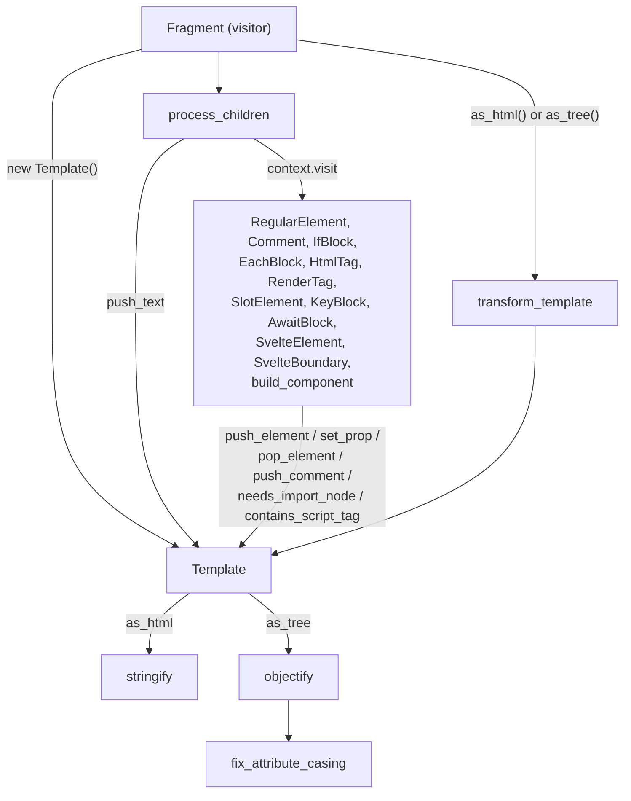

---

## The template IR

The intermediate representation is deliberately tiny — three node kinds, defined in `transform-template/types.d.ts`:

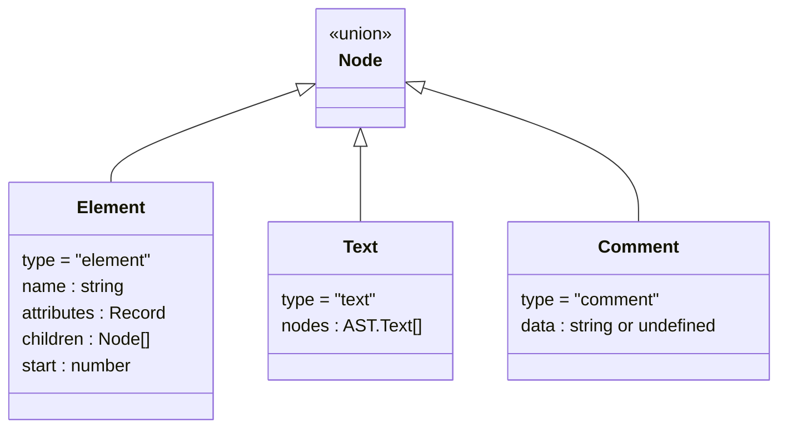

Points worth knowing:

- **Only static things live here.** An attribute enters `Element.attributes` only if the [elements sub-module](compiler_transform_client_elements.md) decided it can be set statically (see `RegularElement`'s `set_prop` calls). Anything reactive is emitted as separate `init`/`update` statements instead.
- **`Text` keeps the original AST nodes**, not a string. This matters because the two emit modes need different views of the same text: `stringify` uses `node.raw` (source text, entities intact) while `objectify` uses `node.data` (decoded text). See [asymmetry](#why-the-two-modes-are-not-symmetric).
- **`Comment` doubles as an anchor.** `data === undefined` means "this is an anchor placeholder" — the `<!>` marker that control-flow blocks use to find their insertion point. `data` is only set when `preserveComments` is on.
- **`Element.start` is the source offset**, kept purely so dev mode can attach `__svelte_meta` locations.

---

## `Template` — the collector

`Template` is a stack-based builder. Visitors push into it as they descend and pop as they ascend, so the IR mirrors the nesting of the markup without anyone having to pass a "current parent" around.

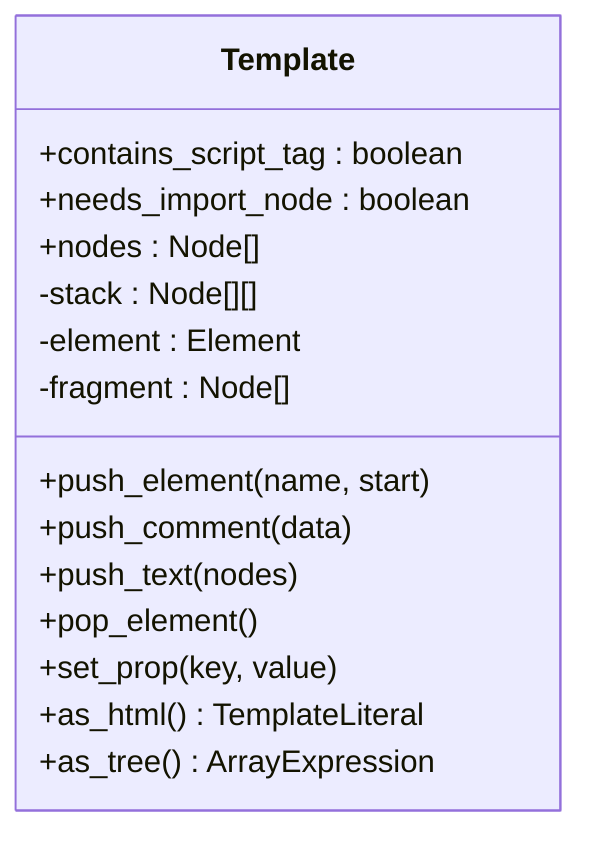

### State fields

| Field | Set by | Consumed by |
| --- | --- | --- |
| `nodes` | all `push_*` methods | `as_html`, `as_tree`, `build_locations`, and `Fragment`'s "single comment" check |
| `#stack` / `#fragment` | `push_element` / `pop_element` | keeps track of where the next push lands |
| `#element` | `push_element` | target of `set_prop` |
| `contains_script_tag` | `RegularElement` when it sees `<script>` | `transform_template` → wraps in `$.with_script` |
| `needs_import_node` | `RegularElement` for `<video>` and custom elements | `Fragment` → `TEMPLATE_USE_IMPORT_NODE` flag |

### Why `needs_import_node` exists

`cloneNode` is faster than `importNode`, but cloning does not upgrade a custom element's class until the node is connected to the document — which breaks any code that sets properties on it beforehand. WebKit also needs `importNode` for `<video>` autoplay. So a single boolean on the template flips the whole fragment over to `document.importNode`.

### Push/pop lifecycle

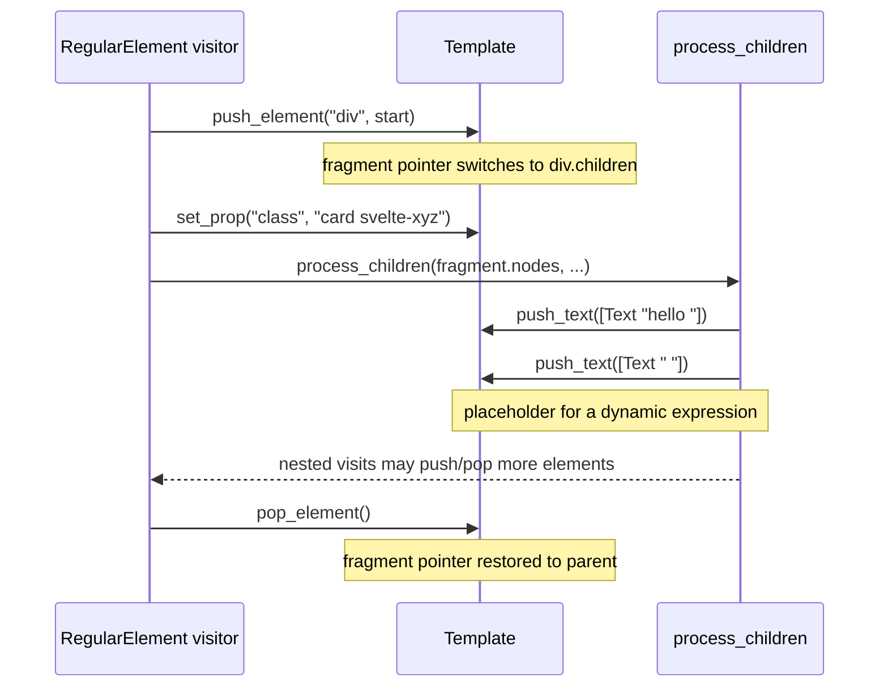

### Callers of `Template`

| Method | Called from |
| --- | --- |
| `push_element` | `RegularElement`, `shared/component.js` (the `<g>` / `<svelte-css-wrapper>` wrapper for `--css-props`) |
| `set_prop` | `RegularElement` (static attributes, `is="..."`), `shared/component.js` (`style="display: contents"`) |
| `pop_element` | `RegularElement` (incl. the early `<noscript>` bail-out), `shared/component.js` |
| `push_comment` | `Comment`, `IfBlock`, `EachBlock`, `AwaitBlock`, `KeyBlock`, `HtmlTag`, `RenderTag`, `SlotElement`, `SvelteElement`, `SvelteBoundary`, `shared/component.js` |
| `push_text` | `process_children` only |

Every block-ish visitor pushes an anchor comment because at runtime those constructs need a stable DOM position to insert and remove content around. See [client_blocks](client_blocks.md).

---

## Two emit strategies: `stringify` vs `objectify`

The `fragments` compile option (validated in [compiler_options_and_warnings](compiler_options_and_warnings.md), typed in [compiler_ast_types](compiler_ast_types.md)) picks between two ways of shipping the same skeleton.

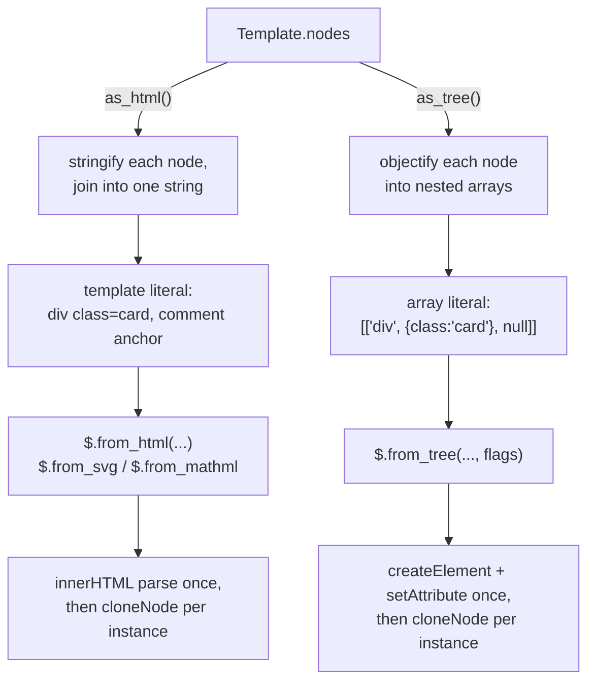

### `stringify` rules

| IR node | Output |
| --- | --- |
| `text` | concatenation of `node.raw` for each AST text node |
| `comment` with data | `<!--data-->` |
| `comment` without data | `<!>` (the anchor marker) |
| `element`, void | `` — self-closed for XHTML compliance |
| `element`, non-void | `<div ...>children</div>` |
| attribute with value | ` key="escaped"` via `escape_html(value, true)` |
| attribute without value | ` key` (boolean attribute) |

### `objectify` rules

| IR node | Output |
| --- | --- |
| `text` | `b.literal(concat of node.data)` |
| `comment` with data | `b.array([b.literal("// data")])` — the leading `//` is the runtime's comment marker |
| `comment` without data | `null` — the runtime turns a hole into an empty comment node |
| `element` | `b.array([name, attributes?, ...children])` |
| attributes | object literal; keys passed through `fix_attribute_casing`; an `undefined` value becomes `b.void0` |
| element with children but no attributes | `b.null` inserted in the attributes slot so children stay at the right index |

Two extra behaviours in `as_tree`/`objectify`:

- **Leading anchor comment.** If `nodes[0]` is a comment, `as_tree` unshifts *another* anchor comment. The runtime needs a distinct node for `effect.nodes_start`, and the first comment is already claimed by whatever block owns it. In HTML mode the equivalent fix-up lives in the runtime (`from_html` prepends `<!>` when `has_start` is false).
- **`<pre>` / `<textarea>` newline stripping.** HTML parsers silently drop a newline immediately after these opening tags. Since tree mode never runs an HTML parser, `objectify` strips it manually from the first child literal.

### Why the two modes are not symmetric

This is the subtlest thing in the module. HTML mode leans on the browser's HTML parser to do work; tree mode has to replicate that work at compile time.

| Concern | `stringify` (html) | `objectify` (tree) |
| --- | --- | --- |
| Text source | `node.raw` — parser will decode `&amp;` etc. | `node.data` — already decoded, `createTextNode` takes it literally |
| Attribute values | `escape_html(value, true)` so quotes survive the string | plain literal, `setAttribute` needs no escaping |
| Attribute casing | parser fixes SVG casing itself | `fix_attribute_casing` restores `viewBox`, `preserveAspectRatio`, `xlink:href`, ... |
| `<pre>` first newline | parser drops it | `objectify` drops it |
| Namespace | encoded in the callee (`$.from_svg`) | encoded in flags (`TEMPLATE_USE_SVG`) |
| Leading anchor | runtime prepends `<!>` | compiler unshifts a `null` node |

Practical consequence: **any new template feature must be implemented twice**, once per mode, and the two must produce identical DOM.

---

## `transform_template` — the emitter

`transform_template(state, namespace, flags)` turns a finished `Template` into the expression that becomes the hoisted `var root = ...` declaration.

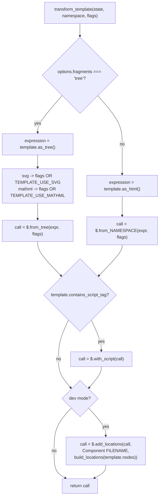

### Template flags

Defined in `packages/svelte/src/constants.js` and decoded by the runtime in `internal/client/dom/template.js`:

| Flag | Value | Meaning | Set by |
| --- | --- | --- | --- |
| `TEMPLATE_FRAGMENT` | `1` | the blueprint is a multi-node fragment, not a single element | `Fragment` (multi-child branch) |
| `TEMPLATE_USE_IMPORT_NODE` | `2` | clone with `importNode`, not `cloneNode` | `Fragment`, from `template.needs_import_node` |
| `TEMPLATE_USE_SVG` | `4` | build children in the SVG namespace | `transform_template` (tree mode only) |
| `TEMPLATE_USE_MATHML` | `8` | build children in the MathML namespace | `transform_template` (tree mode only) |

### Dev locations

`build_locations` recursively walks the IR, keeping only `element` nodes, and produces a parallel array of source positions:

```
[
  [line, column],                      // a <div> with no element children
  [line, column, [ [line, column] ]]   // a <ul> whose 3rd slot holds its children's locations
]
```

`locator` (from `compiler/state.js`, see [compiler_core](compiler_core.md)) converts `Element.start` into line/column. At runtime `$.add_locations` walks the cloned DOM in the same order and stamps `__svelte_meta` on each element — that's what powers "open in editor" and the component stack in error messages. See [client_dev_tooling](client_dev_tooling.md).

Because the shape is positional, `build_locations` must skip exactly the nodes the runtime skips (text and comments) — an easy place to introduce off-by-one bugs.

---

## `Fragment` — the orchestrator

`Fragment` is the visitor for every `AST.Fragment` node: the component body, an `{#if}` branch, an each-block body, a snippet body, and so on. It is where a new `Template` is born and where the generated block statement is assembled.

### Fresh state per fragment

Each `Fragment` visit forks the transform state:

```js
const state = {
  ...context.state,
  init: [], consts: [], update: [], after_update: [],
  memoizer: new Memoizer(),
  template: new Template(),
  transform: { ...context.state.transform },
  metadata: { namespace, bound_contenteditable: /* inherited */ }
};
```

This is why every fragment gets its own hoisted template and its own render effect. `hoisted` and `scope` are *not* forked — hoisted declarations accumulate at module level and names stay globally unique. See [compiler_transform_client_core_state](compiler_transform_client_core_state.md) for the full `ComponentClientTransformState` shape (the root state starts with `template: null`, so it is genuinely created here for the first time).

### Preparation

1. `infer_namespace(state.metadata.namespace, parent, node.nodes)` — decides `html` / `svg` / `mathml` for this fragment. Lives in `3-transform/utils.js`.
2. `clean_nodes(...)` — also in `3-transform/utils.js`. Splits children into:
   - `hoisted` — `ConstTag`, `DebugTag`, `SnippetBlock`, `SvelteWindow`/`Body`/`Document`/`Head`, `TitleElement`; visited first, contribute no DOM position.
   - `trimmed` — the actual renderable children, with whitespace collapsed unless `preserveWhitespace`.
   - `is_standalone` — the fragment owns its anchor, so no template is needed.
   - `is_text_first` — the fragment starts with text, so hydration needs to step over an inserted comment.

### Branch selection

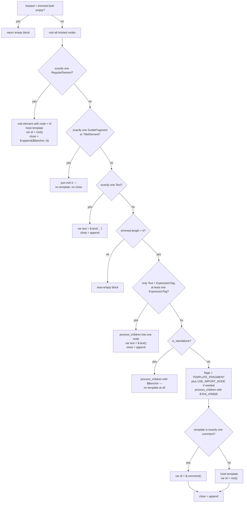

The three "no template" shortcuts (`$.text`, `$.comment`, standalone) exist purely to avoid paying for a hoisted blueprint when the DOM is one node or when a parent already provides an anchor. `{#if}`-heavy components hit the `$.comment()` path constantly.

### Block assembly order

The order of statements in the returned block is load-bearing:

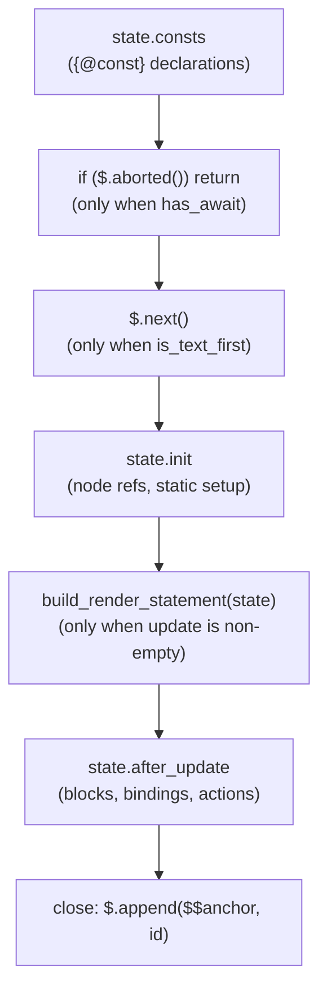

- `consts` first so `{@const}` values are available to everything below.
- `$.next()` when `is_text_first`, because SSR inserts a comment before leading text and the hydration cursor must skip it.
- `close` **last, always** — earlier statements can insert nodes into the template, and `$.append` needs the final child list to compute the effect's node range.
- If `node.metadata.has_await` is set (from [compiler_analyze_expression_metadata](compiler_analyze_expression_metadata.md)), the whole body is wrapped: `$.async_body(async () => { ... })`.

---

## `process_children` — the sibling walker

`process_children(nodes, initial, is_element, context)` is the second half of the module's job: given a list of sibling AST nodes, it decides which of them need a runtime reference and emits the cheapest possible traversal to reach each one.

### The two counters

- `prev` — a function returning the last node reference we have in hand.
- `skipped` — how many DOM nodes lie between `prev` and the node we want next.

Together they generate `$.sibling(prev, skipped, is_text)` chains instead of one variable per node.

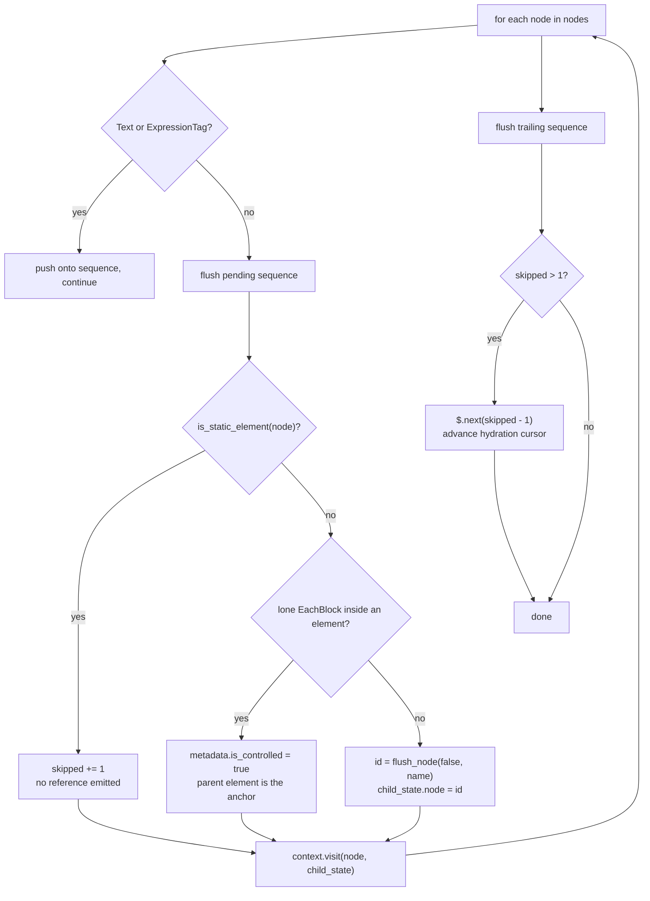

### Text sequence flushing

Consecutive `Text` and `ExpressionTag` nodes are grouped, then flushed in one of two ways:

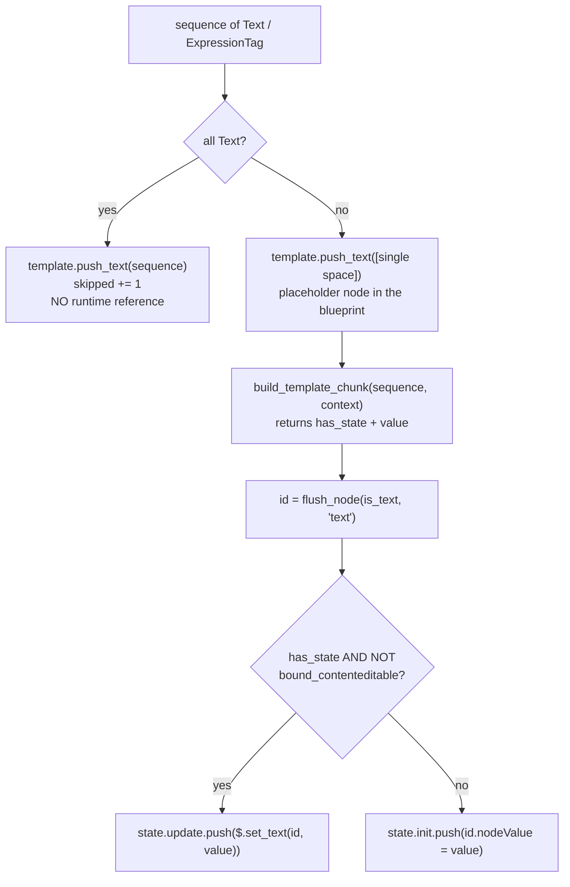

Notes:

- The single-space placeholder guarantees the blueprint contains a real text node at that position — the runtime then overwrites its `nodeValue`. Without it, `{a} {b}` could collapse into one node during parsing.
- `is_text = sequence.length === 1` is passed down to `$.child` / `$.sibling` / `$.first_child`. It tells hydration "expect a text node here even if SSR produced nothing", covering the case where a standalone `{expression}` rendered as an empty string.
- `build_template_chunk` and `Memoizer` come from [compiler_transform_client_core_expressions](compiler_transform_client_core_expressions.md).
- Under a bound contenteditable, updates are written once into `init` rather than into the render effect, so the effect does not fight the user's edits.

### `is_static_element` — the skip test

A `RegularElement` can be skipped (no variable, no traversal) only if *everything* about it is static. The predicate rejects it when:

| Condition | Why |
| --- | --- |
| `fragment.metadata.dynamic` | children need references |
| custom element | all attributes go through properties, not markup |
| any non-`Attribute` in `attributes` | directives, spreads, `bind:`, `use:` all need the node |
| event attribute | needs a listener attached |
| `cannot_be_set_statically(name)` | props the DOM won't reliably pick up from markup |
| `dir` | Chromium bug: direction must be re-assigned after text updates |
| `value` / `checked` on `input` / `textarea` | markup sets the *default*, not the live value |
| `value` on `option` | same reason |
| `loading` on `img` | must be applied after insertion for lazy loading to work |
| a value that is neither `true` nor a plain text attribute | it's an expression |

### The trailing `$.next`

If the fragment ends with a run of static nodes, no reference was created for any of them — but during hydration the cursor must still end up in the right place for the *next* sibling of the fragment. `$.next(skipped - 1)` advances it. (`skipped - 1` because the cursor only needs to reach the second-to-last node.)

### Callers

| Caller | `initial` | `is_element` |
| --- | --- | --- |
| `Fragment` — space-template branch | `() => text_id` | `false` |
| `Fragment` — standalone branch | `() => $$anchor` | `false` |
| `Fragment` — fragment branch | `(is_text) => $.first_child(id, is_text)` | `false` |
| `RegularElement` / `SvelteElement` | `(is_text) => $.child(node, is_text)` | `true` |

`is_element === true` is what unlocks the "controlled each-block" optimisation: when an element's only child is `{#each}`, the element itself serves as the block's container, so no anchor comment is needed.

---

## End-to-end walkthrough

For this component:

```svelte
<div class="card">
  <h1>Hello</h1>
  <p>{name}</p>
</div>
```

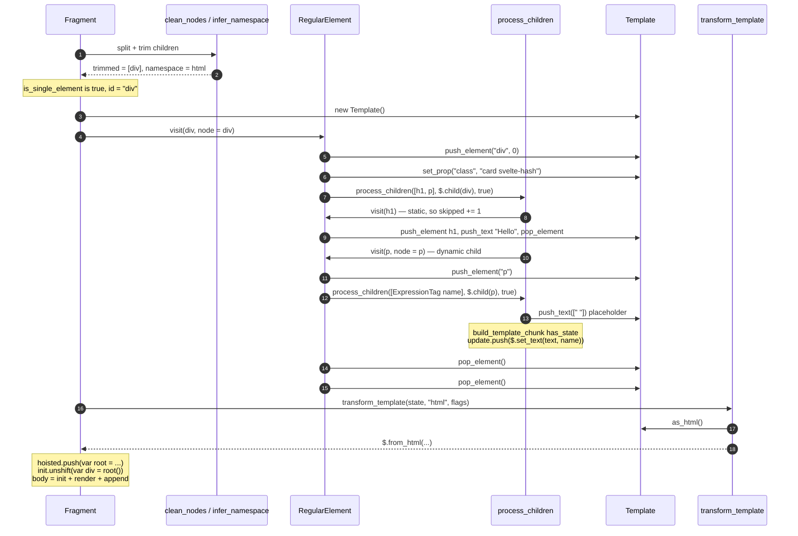

Resulting shape (html mode, non-dev):

```js
var root = $.from_html(`<div class="card"><h1>Hello</h1><p> </p></div>`);

function App($$anchor, $$props) {
  var div = root();
  var p = $.sibling($.child(div), 2);
  var text = $.child(p, true);
  $.reset(p);
  $.reset(div);

  $.template_effect(() => $.set_text(text, name));
  $.append($$anchor, div);
}
```

The same component with `fragments: 'tree'`:

```js
var root = $.from_tree([['div', { class: 'card' }, ['h1', null, 'Hello'], ['p', null, ' ']]]);
```

Note the `<p>` still carries a single space — that is the placeholder text node `process_children` inserted so `$.set_text` has something to write into.

---

## Runtime handoff

Everything this module emits is consumed by `internal/client/dom/template.js` and `internal/client/dom/operations.js` — see [client_render_and_templates](client_render_and_templates.md).

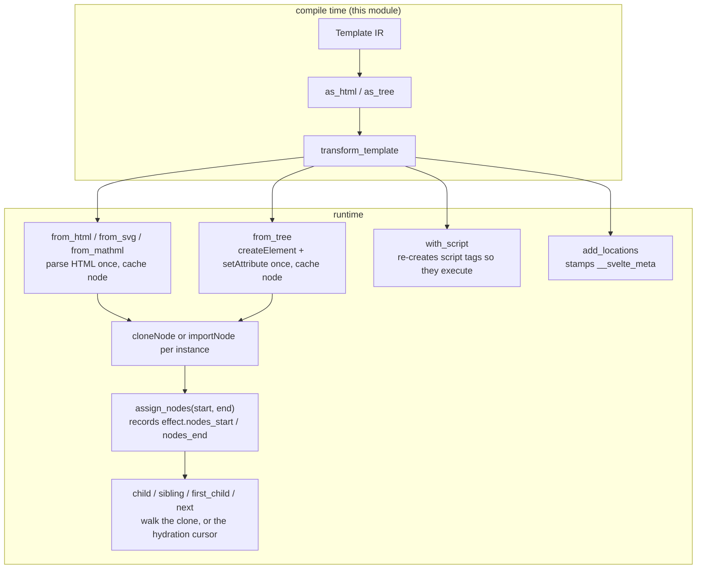

Two runtime behaviours worth calling out, because they explain compiler decisions:

- **`has_start`.** `from_html` checks whether the content begins with `<!>`; if not it prepends one, so that `effect.nodes_start` always points at a node the effect owns. `as_tree` does the compile-time equivalent.
- **Hydration.** In hydrating mode every `from_*` factory returns the current `hydrate_node` instead of a clone. That is why `process_children` must emit the *exact* traversal sequence that matches the SSR output — the `skipped` counters, `is_text` flags and trailing `$.next` all exist to keep the compile-time walk and the hydration cursor in lockstep. The server-side counterpart lives in [compiler_transform_server](compiler_transform_server.md).

---

## Dependencies

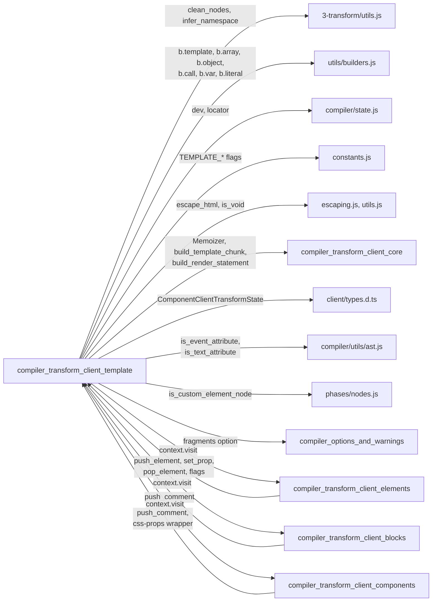

`3-transform/utils.js`, `utils/builders.js` and `compiler/state.js` are documented in [compiler_core](compiler_core.md).

The cycle between this module and elements/blocks/components is real and intentional: `Fragment` → `process_children` → `context.visit(child)` → child visitor → `state.template.push_*` → (nested) `process_children`. Zimmerframe's visitor context is what breaks the static import cycle.

---

## Design notes and gotchas

**One `Template` per fragment, never shared.** `new Template()` appears exactly once in the whole codebase — in `Fragment`. If you need template state to cross a fragment boundary, it has to be threaded through `state` explicitly.

**Static-vs-dynamic is decided upstream.** `is_static_element` and the `set_prop` guards in `RegularElement` are the gatekeepers. Adding a new attribute kind that the DOM cannot pick up from markup means adding it to `cannot_be_set_statically` (in `packages/svelte/src/utils.js`) — otherwise it silently ends up in the blueprint and stops updating.

**Anchor comments are not optional.** Every construct that inserts or removes DOM at runtime pushes a `push_comment()`. Forgetting it produces a template whose node count no longer matches what the generated traversal expects, and the failure shows up far away as a wrong-node bug.

**Positional coupling in three places.** The IR order drives (a) the emitted string or array, (b) `build_locations` for dev metadata, and (c) the `skipped` / `$.sibling` / `$.next` arithmetic in `process_children`. A change to one usually needs a matching change to the other two.

**Implement template features twice.** As covered in [the asymmetry table](#why-the-two-modes-are-not-symmetric), `stringify` and `objectify` must agree on the resulting DOM even though they take completely different routes. `<pre>` / `<textarea>` newline handling and SVG attribute casing are the existing examples of tree mode compensating for the missing HTML parser.

**`close` really must be last.** The comment in `Fragment` is there because it was a bug once: statements before `close` can append into the template, and `$.append` snapshots the child list.
