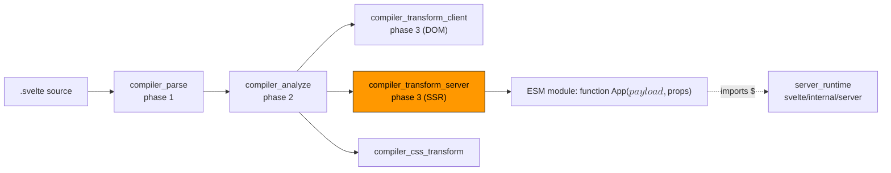
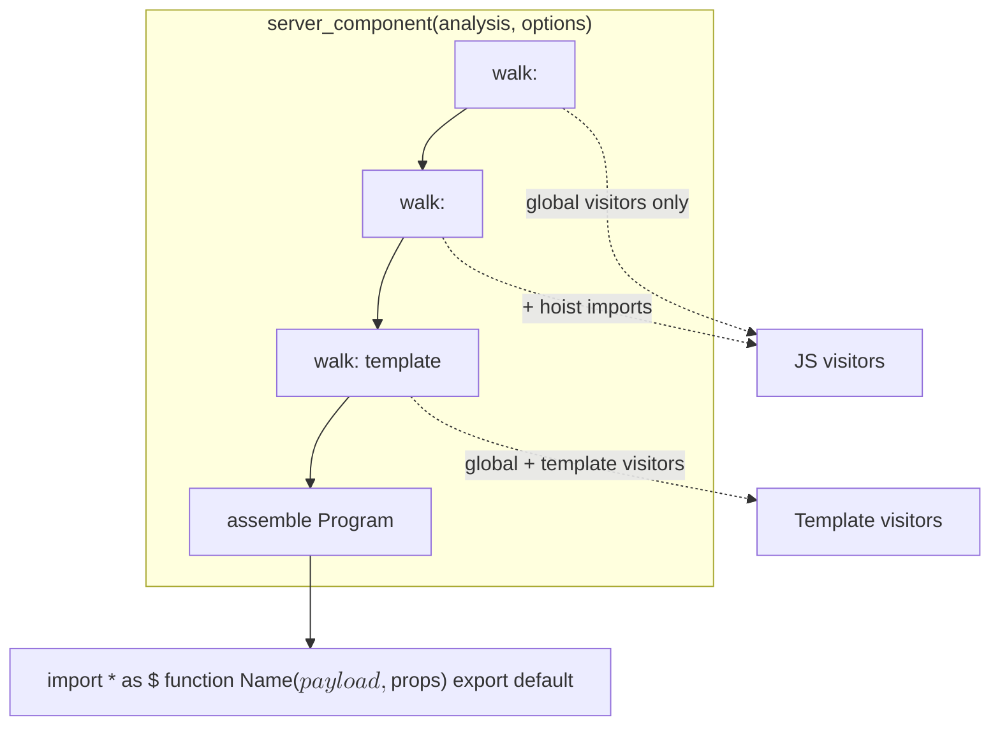
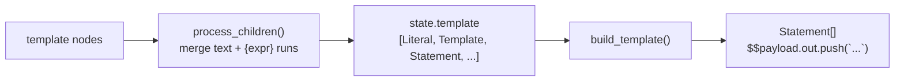
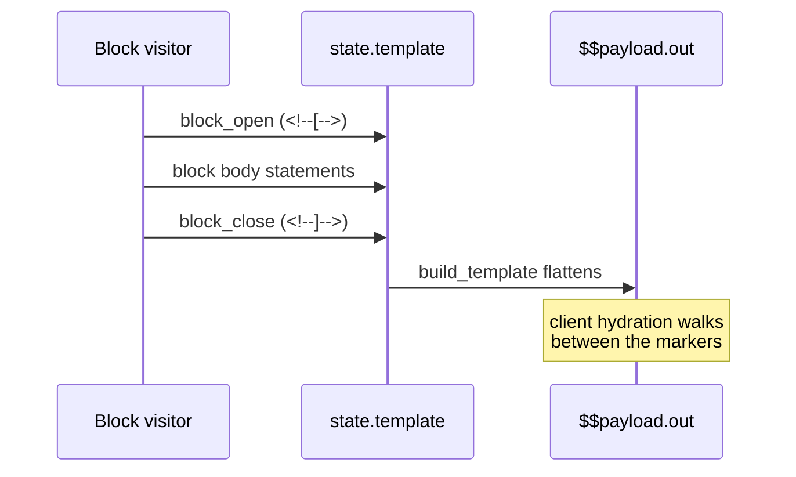
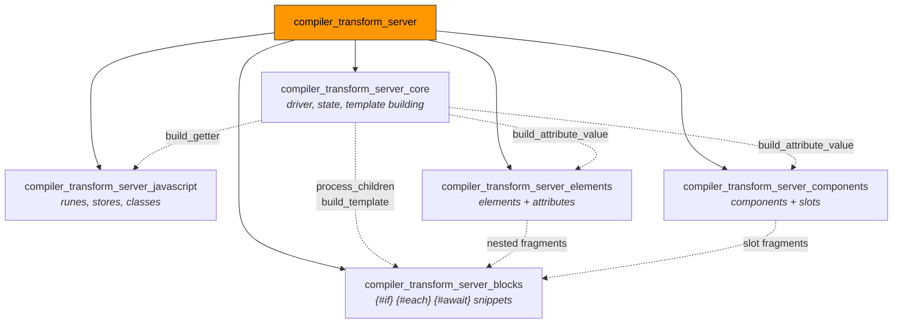
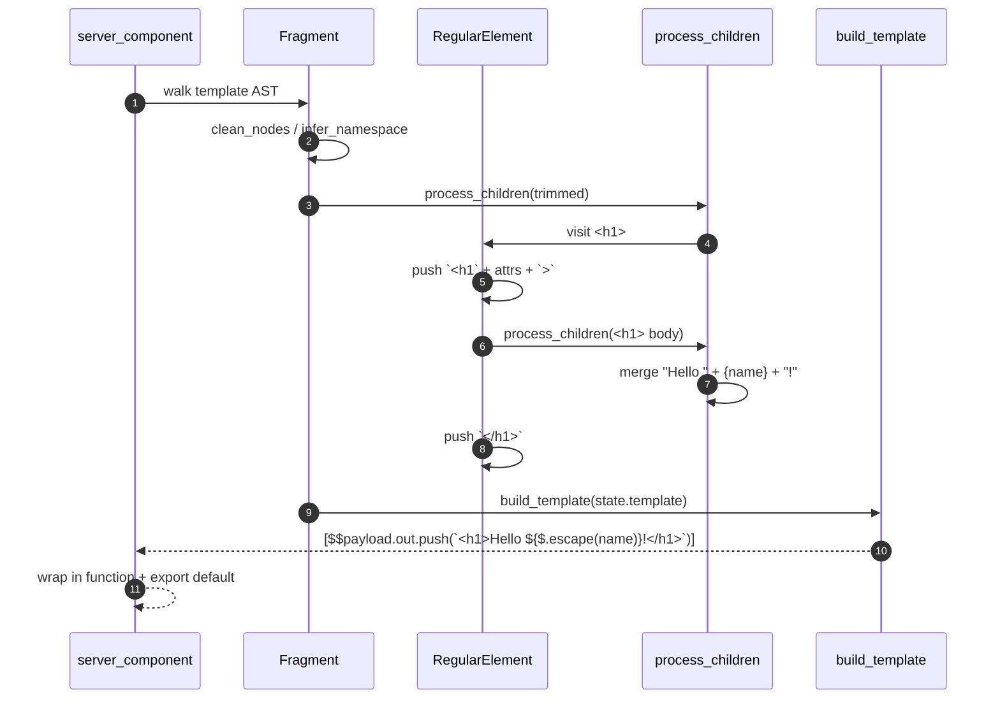

# compiler_transform_server

## 1. What this module does

`compiler_transform_server` is the **server-side (SSR) code generator** of the Svelte compiler.

It takes the analyzed AST of a `.svelte` component and turns it into a plain JavaScript
function that writes an HTML string. There is no DOM, no reactivity, and no update logic —
the component runs exactly once, top to bottom, pushing strings into a `$$payload` object.

A one-line mental model:

> **client transform** builds a *live* DOM tree that can update.
> **server transform** builds a *dead* HTML string that is rendered once.

Input and output look like this:

```svelte
<!-- input -->
<script>
        let { name } = $props();
</script>
<h1>Hello {name}!</h1>
```

```js
// output (simplified)
import * as $ from 'svelte/internal/server';

export default function App($$payload, $$props) {
        let { name } = $$props;
        $$payload.out.push(`<h1>Hello ${$.escape(name)}!</h1>`);
}
```

This module is the third phase of the pipeline. It runs after
[parsing](compiler_parse.md) and [analysis](compiler_analyze.md), and it is the sibling of
[the client transform](compiler_transform_client.md). The runtime helpers it emits
(`$.escape`, `$.slot`, `$.await`, `$.head`, …) live in
[the server runtime](server_runtime.md).

### Key design ideas

| Idea | What it means in practice |
| --- | --- |
| **String first** | Everything the component prints is collected into a `state.template` array, then squashed into as few template literals as possible. |
| **Push, don't concatenate** | Output goes to `$$payload.out.push(...)` so appending stays cheap. |
| **Hydration markers** | `<!--[-->` / `<!--]-->` comments wrap blocks so the client can find and replace them during hydration. |
| **Reactivity is erased** | `$state` becomes a plain value, `$derived` becomes a one-shot `$.derived`, `$effect` is deleted entirely. |
| **Two-pass for legacy bindings** | If a component binds to a child, the whole template is re-run in a loop until values settle. |

---

## 2. Where the module sits



- **Upstream** — [`compiler_analyze`](compiler_analyze.md) supplies the `analysis` object:
  scopes, bindings, runes usage, class state fields, CSS hash, slot names, export list.
- **Shared helpers** — [`compiler_core`](compiler_core.md) supplies the AST builders
  (`#compiler/builders`), scope utilities, and `clean_nodes` / `infer_namespace`.
- **Downstream** — the generated module is executed at request time by
  [`server_runtime`](server_runtime.md), which owns `$$payload`, context, and stores.

---

## 3. Architecture

The transform is a **`zimmerframe` tree walk with a visitor per node type**. Three walks
happen in order, all sharing one mutable `state`:



### The state object

Every visitor reads and writes `ComponentServerTransformState`:

| Field | Purpose |
| --- | --- |
| `analysis` | Result of phase 2 — scopes, runes flag, css hash, exports. |
| `scope` / `scopes` | Current lexical scope and the node → scope map. |
| `hoisted` | Statements lifted to module top level (imports, hoistable snippets). |
| `init` | Statements emitted *before* the current fragment's output. |
| `template` | Mixed array of `Expression`s (printed) and `Statement`s (run) for the current fragment. |
| `namespace` | `html` / `svg` / `mathml` — controls child namespace inference. |
| `preserve_whitespace` | Set inside `<pre>` and `<textarea>`. |
| `skip_hydration_boundaries` | True when a fragment is standalone, so marker comments can be dropped. |
| `state_fields` | Class field metadata for `$state` / `$derived` inside `class` bodies. |
| `legacy_reactive_statements` | `$:` statements, topologically ordered at the end. |

### The template → statements pipeline

This is the heart of the module. `state.template` mixes things that are *printed* with
things that are *executed*; `build_template` separates them.



`process_children` walks a node list and greedily groups adjacent `Text`, `Comment`, and
`ExpressionTag` nodes into a single template literal. Static text is escaped at compile
time; constant-folded expressions (via `scope.evaluate`) are inlined as literals; only
truly dynamic expressions become `${$.escape(...)}`. Anything else (an element, a block)
flushes the run and is visited normally.

`build_template` then folds consecutive literal/template entries into one
`$$payload.out.push(\`...\`)` call and passes statements through untouched — so a static
component emits exactly one push.

### Hydration markers

Blocks whose content can change between server and client are wrapped in comment anchors
so the client renderer can locate and claim them.



`block_open`, `block_close`, and `empty_comment` are shared constants from the module's
`shared/utils.js`. `empty_comment` (`<!---->`) is a lighter marker used to keep adjacent
text nodes from gluing together and to give components/snippets an anchor.

---

## 4. Sub-modules

The module is split into five areas. Each has its own document.



### 4.1 Core — driver, state and template building

**[compiler_transform_server_core.md](compiler_transform_server_core.md)**

Owns the walk itself and the shared string-building primitives:

- `server_component` / `server_module` — set up state, run the three walks, assemble the
  final `Program` (store subscriptions, `$$restProps`, injected CSS, `$.push`/`$.pop`
  context, the legacy `do…while` settle loop).
- `process_children` — merge text/expression runs into template literals.
- `build_template` — turn the mixed template array into `$$payload.out.push(...)` calls.
- `build_attribute_value` — turn an attribute value (literal, single tag, or mixed array)
  into one expression, with escaping and optional whitespace trimming.
- `build_getter` — rewrite `$store` reads into `$.store_get(...)`.
- `Fragment` — the per-fragment entry point that resets `init`/`template` and returns a
  `BlockStatement`.
- The `block_open` / `block_close` / `empty_comment` marker constants.

### 4.2 JavaScript — runes, stores and classes

**[compiler_transform_server_javascript.md](compiler_transform_server_javascript.md)**

Rewrites the `<script>` blocks and any expression in the template. This is where the
"reactivity is erased" rule is implemented:

- `CallExpression` — `$state` → its argument, `$derived` → `$.derived(thunk)`,
  `$effect.tracking` → `false`, `$effect.root` → a noop, `$host` → `undefined`.
- `VariableDeclaration` — destructure `$props()` into `$$props`, strip `$bindable()`,
  handle legacy `export let`.
- `AssignmentExpression` / `UpdateExpression` — `$store = x` → `$.store_set(...)`,
  `store.deep = x` → `$.store_mutate(...)`, `$store++` → `$.update_store(...)`.
- `ClassBody` / `PropertyDefinition` / `MemberExpression` — turn `$derived` class fields
  into a backing field plus a getter/setter pair.
- `Identifier` — `$$props` → `$$sanitized_props`, `$store` → `$.store_get(...)`.
- `ExpressionStatement` — delete `$effect` / `$inspect.trace` statements.
- `LabeledStatement` — collect `$:` blocks for later topological ordering.
- `AwaitExpression` — allow `await` in functions/module scope, otherwise emit
  `$.await_outside_boundary()`.

### 4.3 Blocks and tags — control flow

**[compiler_transform_server_blocks.md](compiler_transform_server_blocks.md)**

Turns Svelte's template blocks into ordinary JavaScript control flow, wrapped in
hydration markers:

- `IfBlock` → `if / else` with `<!--[-->` and `<!--[!-->` prefixes.
- `EachBlock` → `$.ensure_array_like(...)` plus a `for` loop, with an optional
  `{:else}` fallback branch.
- `AwaitBlock` → `$.await($$payload, promise, pending_thunk, then_arrow)`.
- `KeyBlock` → the fragment between two `<!---->` anchors (no keying needed on the server).
- `SnippetBlock` → a hoistable `function name($$payload, ...params)`.
- `RenderTag` → a direct call to that function.
- `HtmlTag` → `$.html(expr)` (raw, unescaped).
- `ConstTag` → a `const` in `init`.
- `DebugTag` → `console.log({...})` plus `debugger`.
- `SvelteBoundary` → renders the `pending` snippet if present, otherwise the children.

### 4.4 Elements and attributes

**[compiler_transform_server_elements.md](compiler_transform_server_elements.md)**

Emits the actual HTML tags and their attribute strings:

- `RegularElement` — `<tag`, attributes, `>`, children, `</tag>`; plus the special cases
  for `<script>`/`<style>` raw bodies, `<select>` value propagation via
  `$$payload.select_value`, `<option>` without a value, `<textarea>` and
  `contenteditable` body handling, void elements, and dev-mode `$.push_element`.
- `SvelteElement` — dynamic `<svelte:element this={tag}>` via `$.element(...)`.
- `build_element_attributes` (shared) — the attribute decision tree: literal inlining,
  `class`/`style` directive merging with the scoping hash, `bind:` → attribute mapping
  (`bind:group` → `checked`), spread handling, and `onload`/`onerror` capture.
- `SpreadAttribute`, `TitleElement` (writes `$$payload.title`), `SvelteHead`
  (`$.head(...)`), `SvelteFragment` (transparent pass-through).

### 4.5 Components and slots

**[compiler_transform_server_components.md](compiler_transform_server_components.md)**

Renders child components as plain function calls:

- `build_inline_component` (shared) — collects props and spreads, converts `bind:x` into
  getter/setter property pairs, groups children by slot name, builds `children` /
  `$$slots` functions, and emits `Component($$payload, props)` — or wraps it in
  `$.css_props(...)` when `--custom-property` attributes are present.
- `Component`, `SvelteComponent` (dynamic, `maybe_call`), `SvelteSelf` (recursive).
- `SlotElement` — legacy `<slot>` compiled to `$.slot($$payload, $$props, name, props,
  fallback)`.

---

## 5. End-to-end example



---

## 6. Contrast with the client transform

Both transforms share the AST, the analysis result, and the builders — but almost nothing
else. This table is a quick orientation aid when reading either side.

| Concern | Server ([this module](compiler_transform_server.md)) | Client ([compiler_transform_client](compiler_transform_client.md)) |
| --- | --- | --- |
| Output shape | one function that pushes strings | `$.template(...)` + effects |
| `{#if}` | plain `if / else` | `$.if_block(anchor, fn)` |
| `{#each}` | `for` loop | `$.each(...)` with keying and reconciliation |
| `$state` | plain value | `$.state(...)` signal / proxy |
| `$derived` | one-shot `$.derived(thunk)` | lazily-recomputed derived signal |
| `$effect` | removed | `$.user_effect(...)` |
| Events | dropped (except `onload`/`onerror` capture) | delegated listeners |
| Transitions / actions | dropped | `$.transition`, `$.action` |
| Bindings | read once into an attribute | two-way with getters/setters |

---

## 7. Sub-module file index

All five sub-module documents live in the same flat folder as this file.

| Document | Covers | Main source files |
| --- | --- | --- |
| [compiler_transform_server_core.md](compiler_transform_server_core.md) | Walk driver, transform state, template building | `transform-server.js`, `visitors/shared/utils.js`, `visitors/Fragment.js`, `types.d.ts` |
| [compiler_transform_server_javascript.md](compiler_transform_server_javascript.md) | Runes, stores, classes, `$:` statements | `visitors/CallExpression.js`, `VariableDeclaration.js`, `AssignmentExpression.js`, `UpdateExpression.js`, `ClassBody.js`, `PropertyDefinition.js`, `MemberExpression.js`, `Identifier.js`, `ExpressionStatement.js`, `LabeledStatement.js`, `AwaitExpression.js` |
| [compiler_transform_server_blocks.md](compiler_transform_server_blocks.md) | Control-flow blocks, snippets, tags | `visitors/IfBlock.js`, `EachBlock.js`, `AwaitBlock.js`, `KeyBlock.js`, `SnippetBlock.js`, `RenderTag.js`, `HtmlTag.js`, `ConstTag.js`, `DebugTag.js`, `SvelteBoundary.js` |
| [compiler_transform_server_elements.md](compiler_transform_server_elements.md) | HTML tags, attributes, head/title | `visitors/RegularElement.js`, `SvelteElement.js`, `visitors/shared/element.js`, `SpreadAttribute.js`, `TitleElement.js`, `SvelteHead.js`, `SvelteFragment.js` |
| [compiler_transform_server_components.md](compiler_transform_server_components.md) | Child components, props, slots | `visitors/shared/component.js`, `Component.js`, `SvelteComponent.js`, `SvelteSelf.js`, `SlotElement.js` |

Suggested reading order: **core → javascript → blocks → elements → components**. Core
defines the state and the string-building primitives that the other four all depend on.

## 8. Related documentation

| Document | Why you would read it |
| --- | --- |
| [compiler_parse.md](compiler_parse.md) | How the AST this module walks is produced. |
| [compiler_analyze.md](compiler_analyze.md) | Where `analysis`, scopes, and metadata come from. |
| [compiler_transform_client.md](compiler_transform_client.md) | The DOM-generating sibling. |
| [compiler_css_transform.md](compiler_css_transform.md) | How the scoping hash and stylesheet are produced. |
| [compiler_core.md](compiler_core.md) | AST builders, scope, and shared transform utilities. |
| [server_runtime.md](server_runtime.md) | The `$` helpers the generated code calls. |
| [compiler_ast_types.md](compiler_ast_types.md) | `AST.*` node shapes and `TransformState`. |
