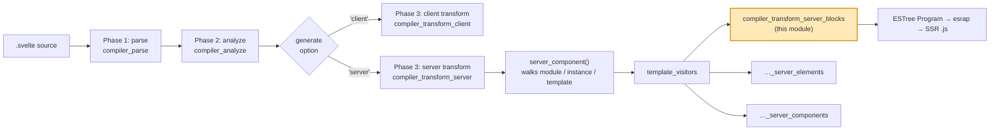
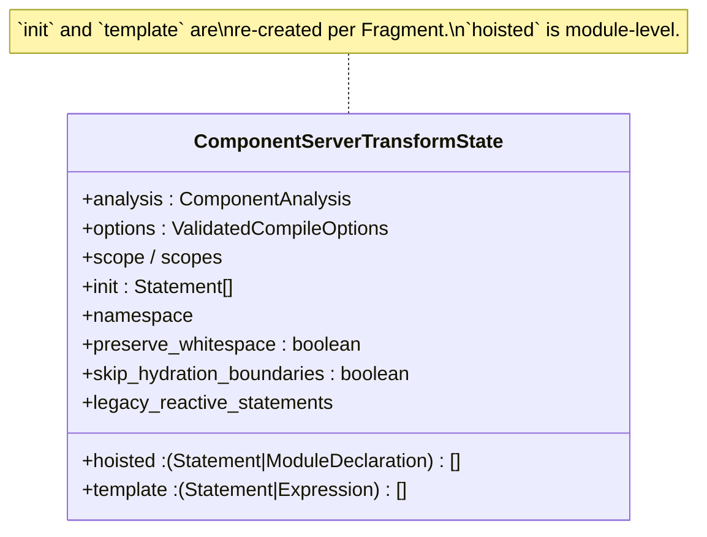
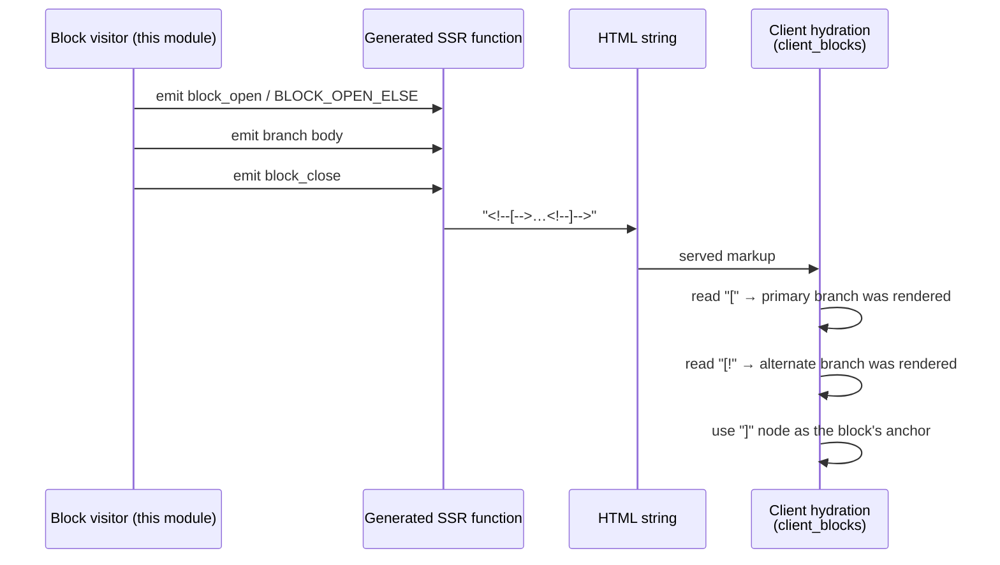
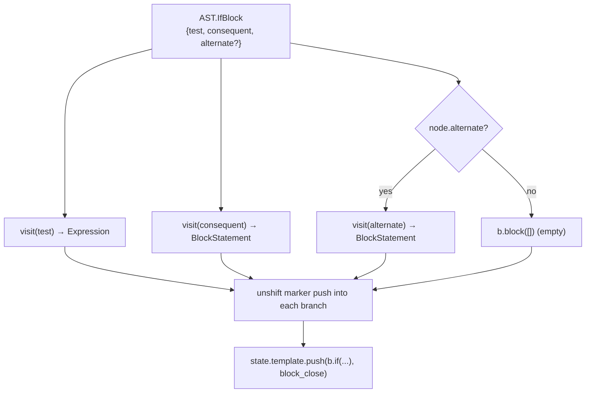
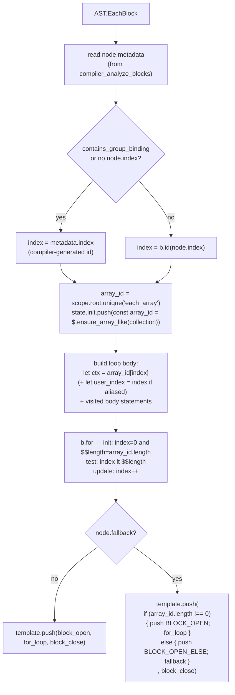
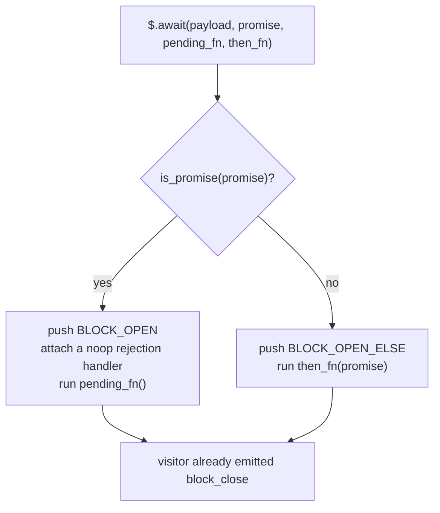
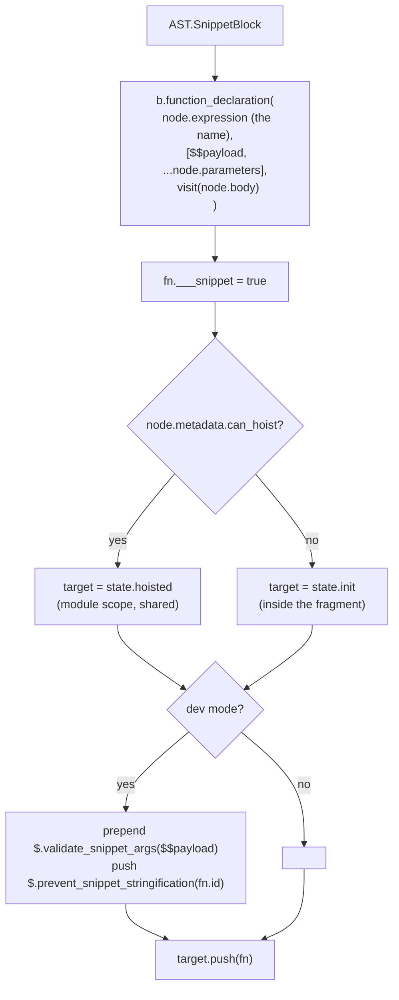
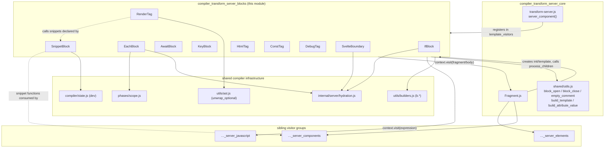
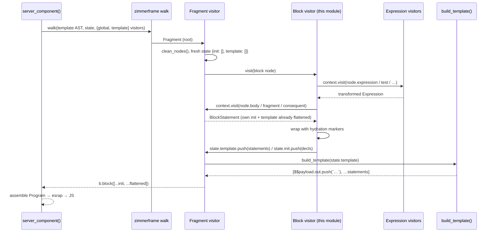

# compiler_transform_server_blocks

## Introduction

This module holds the **server-side (SSR) transform visitors for Svelte template blocks and tags**. It is a small, focused slice of phase 3 of the compiler: it turns the block-shaped parts of a `.svelte` template — `{#if}`, `{#each}`, `{#await}`, `{#key}`, `{#snippet}`, `{@render}`, `{@html}`, `{@const}`, `{@debug}` and `<svelte:boundary>` — into **plain JavaScript statements that push strings into a server render payload**.

The key idea is simple: on the server there is no DOM, no reactivity, and no updates. A component renders **once**, top to bottom, appending HTML text to `$$payload.out`. So a `{#if}` block does not become a "block" object with a lifecycle (as it does on the client) — it becomes a real JavaScript `if` statement. An `{#each}` block becomes a real `for` loop. A `{#snippet}` becomes a real function declaration.

The only extra thing these visitors must do is emit **hydration marker comments** so the client can later find the boundaries of each block in the server-rendered HTML and take over from there.

Related modules:

- [compiler_transform_server_core](compiler_transform_server_core.md) — the driver (`server_component`), transform state, and the `Fragment` visitor that owns `init`/`template`.
- [compiler_transform_server_core_template](compiler_transform_server_core_template.md) — `process_children`, `build_template`, `build_attribute_value`, and the marker constants used here.
- [compiler_transform_server_elements](compiler_transform_server_elements.md) — element/attribute visitors that sit alongside these block visitors.
- [compiler_transform_server_components](compiler_transform_server_components.md) — component and slot visitors (consumers of the snippets produced here).
- [compiler_transform_server_javascript](compiler_transform_server_javascript.md) — expression-level visitors that run *inside* every expression these visitors visit.
- [compiler_transform_client_blocks](compiler_transform_client_blocks.md) — the client-side counterpart of this exact module.
- [server_runtime](server_runtime.md) — the runtime helpers (`$.await`, `$.html`, `$.ensure_array_like`, …) that the generated code calls.
- [client_blocks](client_blocks.md) — the client block runtime that consumes the hydration markers emitted here.

---

## Scope

| Visitor | Template syntax | Generated JS shape |
|---|---|---|
| `IfBlock` | `{#if}` / `{:else if}` / `{:else}` | `if (test) { … } else { … }` |
| `EachBlock` | `{#each}` / `{:else}` | `const arr = $.ensure_array_like(…)` + `for (…) { … }` |
| `AwaitBlock` | `{#await}` / `{:then}` / `{:catch}` | `$.await($$payload, promise, pending_thunk, then_arrow)` |
| `KeyBlock` | `{#key}` | inlined fragment wrapped in `<!---->` comments |
| `SnippetBlock` | `{#snippet}` | `function name($$payload, …params) { … }` |
| `RenderTag` | `{@render}` | `snippet($$payload, …args)` |
| `HtmlTag` | `{@html}` | `$.html(expression)` |
| `ConstTag` | `{@const}` | `const id = init` (pushed to `init`, not `template`) |
| `DebugTag` | `{@debug}` | `console.log({ … }); debugger;` |
| `SvelteBoundary` | `<svelte:boundary>` | markers + either the `pending` snippet or the fragment |

All ten are registered in `template_visitors` inside `transform-server.js` and are driven by a [zimmerframe](https://github.com/rich-harris/zimmerframe) walk. See [compiler_transform_server_core](compiler_transform_server_core.md).

---

## Position in the compilation pipeline



---

## The shared contract every visitor obeys

Every visitor in this module receives `(node, context)` where `context.state` is a `ComponentServerTransformState`. Three fields of that state matter here:



| Field | Meaning | Who writes to it in this module |
|---|---|---|
| `state.template` | Ordered list of **strings/expressions to emit** and **statements to run** at this point in the output. Later flattened by `build_template`. | `IfBlock`, `EachBlock`, `AwaitBlock`, `KeyBlock`, `RenderTag`, `HtmlTag`, `DebugTag`, `SvelteBoundary` |
| `state.init` | Statements that must run **before** the fragment's output is produced (declarations). | `ConstTag`, `EachBlock` (array binding), `SnippetBlock` (non-hoistable) |
| `state.hoisted` | Module-level statements. | `SnippetBlock` (when `metadata.can_hoist`) |

An important consequence: a visitor **never returns** a replacement node. It mutates `state` and lets the enclosing `Fragment` visitor assemble the result. `Fragment` finishes with:

```js
return b.block([...state.init, ...build_template(state.template)]);
```

`build_template` merges adjacent literal strings into a single `$$payload.out.push(\`…\`)` call and leaves statements (like our `if`/`for`) in place. Details in [compiler_transform_server_core_template](compiler_transform_server_core_template.md).

---

## Hydration markers

Because SSR output is later hydrated, the client needs to know where each block starts and ends inside the flat HTML string. That is done with HTML comments whose contents are single characters:

| Constant | Value | Meaning |
|---|---|---|
| `BLOCK_OPEN` | `<!--[-->` | a block opened, took its **primary** branch |
| `BLOCK_OPEN_ELSE` | `<!--[!-->` | a block opened, took its **alternate** branch |
| `BLOCK_CLOSE` | `<!--]-->` | block ended; also serves as the client's anchor node |
| `EMPTY_COMMENT` | `<!---->` | separator / anchor with no branch meaning |

`shared/utils.js` pre-wraps the first three as reusable literal builders: `block_open`, `block_close`, `empty_comment`. The raw string constants come from `internal/server/hydration.js`, which derives them from `HYDRATION_START = '['`, `HYDRATION_START_ELSE = '[!'`, `HYDRATION_END = ']'` in `src/constants.js` — the same constants the client hydration code reads. This shared-constant link is what keeps the two halves in sync.



`state.skip_hydration_boundaries` (set by `Fragment` when a fragment is "standalone") lets some markers be omitted — currently honoured by `RenderTag`.

---

## Component-by-component

### IfBlock



The consequent gets `$$payload.out.push('<!--[-->')` prepended; the alternate gets `$$payload.out.push('<!--[!-->')`. The single shared `block_close` is emitted **after** the `if` statement, so it runs on both paths.

Note that the alternate branch is created even when the source has no `{:else}` — an empty block still needs to emit `<!--[!-->` so hydration can tell "condition was false" from "block was never rendered".

```svelte
{#if ok}<p>yes</p>{:else}<p>no</p>{/if}
```

```js
if (ok) {
  $$payload.out.push(`<!--[-->`);
  $$payload.out.push(`<p>yes</p>`);
} else {
  $$payload.out.push(`<!--[!-->`);
  $$payload.out.push(`<p>no</p>`);
}
$$payload.out.push(`<!--]-->`);
```

### EachBlock

This is the most involved visitor. It has to (a) normalise the collection into something with `.length`, (b) pick an index identifier, (c) bind the item and index, and (d) optionally handle an `{:else}` fallback.



Points worth remembering:

- **`$.ensure_array_like`** ([server_runtime](server_runtime.md)) converts iterables to arrays and `null`/`undefined` to `[]`, so the `for` loop can use `.length` and index access unconditionally.
- The array is declared in `state.init`, not `state.template` — it must be evaluated before any output is pushed for the fragment.
- `array_id` comes from `state.scope.root.unique('each_array')`, so nested `{#each}` blocks get distinct names (`each_array`, `each_array_1`, …) with no collisions against user code.
- `$$length` is cached in the loop initialiser rather than re-read each iteration.
- The `index.name !== node.index && node.index != null` guard emits a second `let` only when the loop counter identifier differs from the user's declared index name (the group-binding case).
- The `{:else}` path uses a `length !== 0` test rather than tracking whether the loop body ever ran — a direct check is enough because nothing is reactive on the server.

### AwaitBlock

Server rendering cannot suspend on a promise and still produce a synchronous string, so `{#await}` delegates entirely to the runtime helper `$.await`:

```js
$.await($$payload, promise, () => { /* pending */ }, (value) => { /* then */ });
$$payload.out.push(`<!--]-->`);
```

The runtime's `await_block` (in `internal/server/index.js`) then decides:



So the **open** marker is chosen at runtime (only the runtime knows whether the value is a real promise), while the **close** marker is emitted statically by the visitor. Note there is no `catch` branch on the server: an unresolved promise renders its pending content, and the client resolves it after hydration.

`node.value` (the `{:then value}` pattern) becomes the arrow function's parameter; `node.pending` becomes a thunk. Missing branches become empty blocks so the call shape stays uniform.

### KeyBlock

`{#key}` exists purely to force teardown/recreation when a value changes — a client-only concern. On the server the visitor simply inlines the fragment between two `<!---->` comments:

```js
context.state.template.push(empty_comment, visit(node.fragment), empty_comment);
```

The comments are still needed as anchors so hydration can locate the keyed region.

### SnippetBlock



Three details:

- **`$$payload` first.** Snippets are ordinary functions whose first parameter is the payload. That is why `RenderTag` can call them directly and why a snippet is interchangeable with a component's children on the server.
- **`fn.___snippet = true`** is a deliberate marker (flagged `@ts-expect-error` in the source). `server_component` reads it to lift snippet declarations *out* of the `$$render_inner` re-render loop it builds when `analysis.uses_component_bindings` is true — legacy two-way component bindings render the template repeatedly until settled, and function declarations must not be re-created inside that loop. See [compiler_transform_server_core](compiler_transform_server_core.md).
- **Dev guards.** `$.validate_snippet_args` throws a helpful error if the first argument is not a `Payload`, which catches a user calling a snippet like a normal function. `$.prevent_snippet_stringification` makes accidental interpolation of the snippet itself (`{snippet}` instead of `{@render snippet()}`) fail loudly.

### RenderTag

```js
// {@render items(a, b)}      -> items($$payload, a, b)
// {@render items?.(a, b)}    -> items?.($$payload, a, b)
```

`unwrap_optional` (from `compiler/utils/ast.js`) strips the `ChainExpression` wrapper so the callee and arguments can be read uniformly; the node's own type then selects `b.call` vs `b.maybe_call` to preserve optional-call semantics. A trailing `empty_comment` is appended **unless** `state.skip_hydration_boundaries` is set — the one place in this module that consults that flag.

### HtmlTag

`{@html expr}` becomes the expression `$.html(expr)` pushed onto the template. The runtime wraps the raw string in `<!---->` markers (and, in dev, a content hash comment instead of the opening `<!---->`, so a hydration mismatch can be reported precisely). No escaping is applied — that is the documented meaning of `{@html}`.

### ConstTag

`{@const x = y}` becomes `const x = y` pushed to **`state.init`**, not `state.template`. Because the enclosing `Fragment` emits `[...state.init, ...template]`, the constant is hoisted to the top of its block and is therefore visible to every expression in that fragment regardless of source order — matching the semantics users expect from `{@const}`.

Only `node.declaration.declarations[0]` is read; the analysis phase guarantees a single declarator.

### DebugTag

Emits a `console.log({ a, b })` (an object literal so names are visible in the console) followed by a `debugger;` statement. Both go into `state.template` so they fire at the right point in the render sequence.

### SvelteBoundary

Boundaries are an error/pending-state feature that only really operates on the client. The server version resolves the *pending* view:

```mermaid
flowchart TD
    B["<svelte:boundary>"] --> OPEN["template.push(BLOCK_OPEN literal)"]
    OPEN --> Q1{"pending attribute?"}
    Q1 -->|yes| A1["value = build_attribute_value(...)<br/>template.push(value($$payload))"]
    Q1 -->|no| Q2{"child SnippetBlock named 'pending'?"}
    Q2 -->|yes| A2["template.push(visit(pending_snippet.body))"]
    Q2 -->|no| A3["template.push(visit(node.fragment))"]
    A1 & A2 & A3 --> CLOSE["template.push(BLOCK_CLOSE literal)"]
```



Three-way precedence: `pending` **attribute** (a snippet passed in) beats an inline `{#snippet pending()}`, which beats the boundary's ordinary content. `build_attribute_value(..., is_component = true)` is used for the attribute so the value is treated as a component-style expression (no HTML escaping) — see [compiler_transform_server_core_template](compiler_transform_server_core_template.md).

Unlike other visitors here, `SvelteBoundary` pushes the raw `BLOCK_OPEN`/`BLOCK_CLOSE` literals rather than the shared `block_open`/`block_close` builders; the emitted text is identical.

---

## Interaction with the rest of the transform



### Runtime helpers the generated code depends on

| Emitted call | Defined in | Purpose |
|---|---|---|
| `$.ensure_array_like` | `internal/server/index.js` | normalise the `{#each}` collection |
| `$.await` | `internal/server/index.js` (`await_block as await`) | pick pending vs then at runtime |
| `$.html` | `internal/server/blocks/html.js` | wrap raw HTML with markers |
| `$.validate_snippet_args` | `internal/server/dev.js` | dev-only snippet arg check |
| `$.prevent_snippet_stringification` | `internal/shared/validate.js` | dev-only misuse guard |
| `$$payload.out.push` | `internal/server/payload.js` | the output sink |

All of these are reached through the `import * as $ from 'svelte/internal/server'` that `server_component` puts at the top of `state.hoisted`. See [server_runtime](server_runtime.md).

---

## End-to-end data flow



Note the recursion: a block visitor calls `context.visit` on its child fragment, and the `Fragment` visitor gives it back a **fully self-contained `BlockStatement`**. That is why block visitors never worry about their children's `init` statements — nesting is handled by state shadowing in `Fragment`.

---

## Server vs client: the same blocks, two strategies

| Block | Server (this module) | Client ([compiler_transform_client_blocks](compiler_transform_client_blocks.md)) |
|---|---|---|
| `{#if}` | JS `if` statement, markers around branches | `$.if_block(anchor, fn)` + branch functions, re-runs on change |
| `{#each}` | JS `for` loop over an array | `$.each(...)` with keyed reconciliation, flags, indices |
| `{#await}` | `$.await(...)`, renders pending or then once | `$.await_block(...)` with pending/then/catch state machine |
| `{#key}` | inlined between comments | `$.key(...)`, destroys and recreates on key change |
| `{#snippet}` | `function(payload, …)` | `$.wrap_snippet(...)` closure carrying component context |
| `{@render}` | direct call with payload | `$.snippet(...)` inside an effect |
| `{@html}` | `$.html(value)` string | `$.html(...)` effect that parses and swaps DOM nodes |
| `{@const}` | `const` in `init` | `const` or `$.derived(...)` depending on reactivity |
| `<svelte:boundary>` | renders pending or content | `$.boundary(...)` with error capture and reset |

The pattern to hold onto: **the server transform emits straight-line JavaScript; the client transform emits reactive graph construction.** The two agree only on the hydration marker vocabulary.

---

## Maintenance notes

- **Marker symmetry is the invariant.** If a block emits an open marker, it must emit exactly one close marker on every path. `IfBlock` and `EachBlock` do this by placing `block_close` *outside* the branching statement. Breaking this produces hydration mismatches that surface far from the compiler.
- **Statically-emitted close, runtime-chosen open.** `AwaitBlock` splits responsibility with the runtime. When editing either side, edit both.
- **`init` vs `template` is a semantics choice, not a style choice.** Anything that must be visible to sibling expressions (`{@const}`, the `each_array` binding) belongs in `init`.
- **The `___snippet` flag is load-bearing.** It couples `SnippetBlock` to the legacy-binding re-render loop in `server_component`. It is marked as a hack to remove once legacy component bindings are gone; removing it early breaks components that bind to children.
- **Adding a new block visitor** means: write the visitor file, register it in `template_visitors` in `transform-server.js`, decide its marker contract, and mirror the marker reading in [client_blocks](client_blocks.md).
- **AST node shapes** (`AST.IfBlock`, `AST.EachBlock`, metadata fields such as `contains_group_binding` and `can_hoist`) are defined in [compiler_ast_types](compiler_ast_types.md) and populated by [compiler_analyze_blocks](compiler_analyze_blocks.md); these visitors trust that analysis and do no validation of their own.
