# compiler_transform_server_components

## Introduction

This module is the part of the server (SSR) transform that turns **component usage** in a
`.svelte` template into plain JavaScript calls. It answers one question:

> When the template says `<Foo a={1}>hello</Foo>`, what JS should the compiler emit so that
> the server prints the right HTML string?

The answer is always the same shape:

```js
Foo($$payload, { a: 1, children: ($$payload) => { $$payload.out.push('hello'); } });
```

A server component is just a function that takes a payload (the output buffer) and a props
object. So this module's whole job is to build **one call expression** and **one props
object** — plus the slot/snippet functions that go inside it.

Five files live here:

| Component | File | Template syntax it handles |
| --- | --- | --- |
| `build_inline_component` | `server/visitors/shared/component.js` | the shared engine for all three below |
| `Component` | `server/visitors/Component.js` | `<Foo />` — a component known by name |
| `SvelteComponent` | `server/visitors/SvelteComponent.js` | `<svelte:component this={X} />` (legacy) |
| `SvelteSelf` | `server/visitors/SvelteSelf.js` | `<svelte:self />` (legacy recursion) |
| `SlotElement` | `server/visitors/SlotElement.js` | `<slot name="x" />` — the *receiving* side |

The first four are about **calling** a child component. `SlotElement` is the mirror image: it
is what a component uses to **render content it was given**.

The client-side counterpart of this module is
[`compiler_transform_client_components`](compiler_transform_client_components.md). Both read the
same analyzed AST, but the client emits reactive effect code while the server emits a single
straight-line function call — no effects, no reactivity, run once, produce a string.

---

## Where this module sits

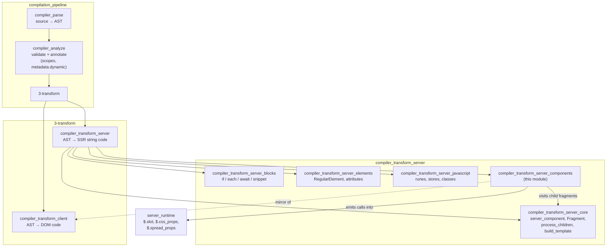

Related reading:

- [`compiler_transform_server`](compiler_transform_server.md) — the parent module and the full visitor table.
- [`compiler_transform_server_core`](compiler_transform_server_core.md) — `Fragment`, `process_children`, `build_template`, `ServerTransformState`.
- [`server_runtime`](server_runtime.md) — the `$.*` helpers this module calls at runtime.
- [`compiler_analyze`](compiler_analyze.md) — where `node.metadata.scopes` and `node.metadata.dynamic` come from.

---

## Architecture: one engine, three thin entry points

All three component visitors are one-liners. They differ only in **which expression names the
component**.

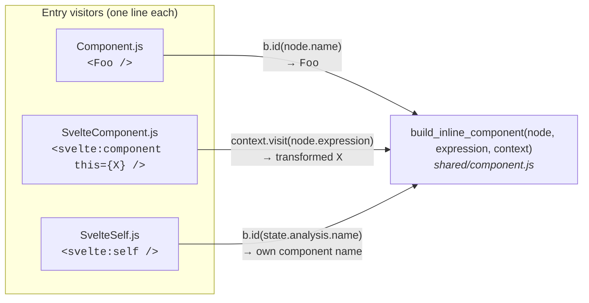

| Visitor | `expression` passed in | Why |
| --- | --- | --- |
| `Component` | `b.id(node.name)` | the tag name *is* an in-scope identifier (an import or a local) |
| `SvelteComponent` | `context.visit(node.expression)` | `this={...}` is arbitrary JS, so it must be transformed first (stores, runes, …) |
| `SvelteSelf` | `b.id(context.state.analysis.name)` | the component refers to itself by its own generated name |

`SvelteComponent` is also the only one that emits an **optional call** (`X?.($$payload, …)`), via
`b.maybe_call`, because `this={undefined}` is allowed and must render nothing rather than throw.

`SlotElement` does not use the engine at all — it is a separate, simpler visitor (see below).

---

## `build_inline_component` — the core engine

This is the only substantial function in the module. It walks a component node once and produces
one statement (or a small block) that it pushes onto `context.state.template`.

### Data it collects

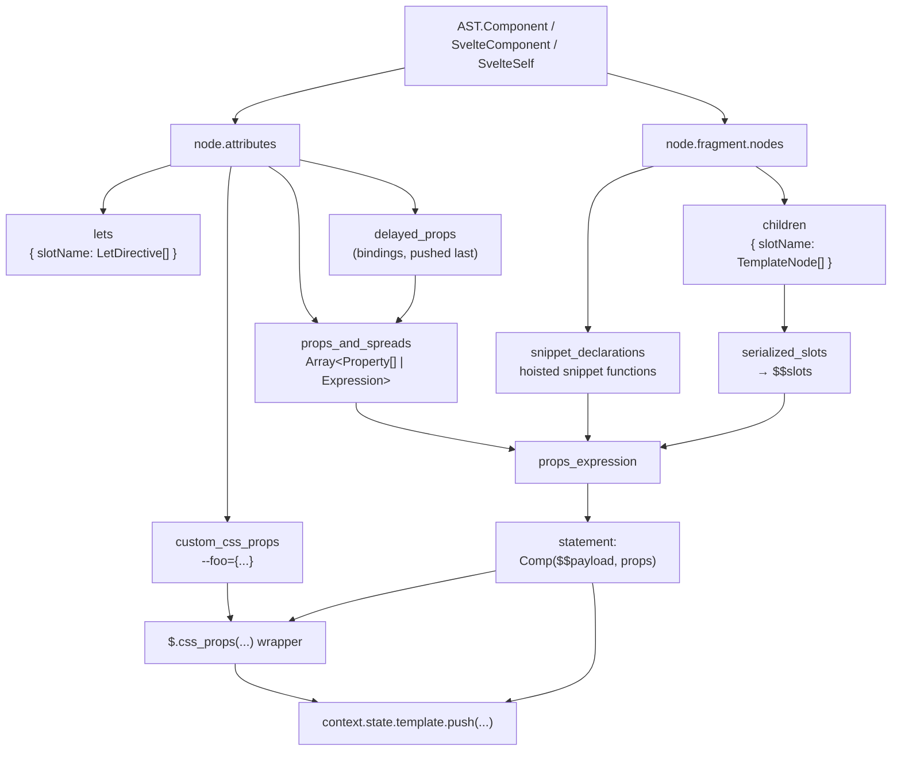

Key local variables:

| Name | Purpose |
| --- | --- |
| `props_and_spreads` | ordered list; each item is either a group of plain properties or a spread expression |
| `delayed_props` | thunks for binding getters/setters, run **after** all other attributes |
| `custom_css_props` | `--name={value}` attributes; become a `$.css_props(...)` wrapper |
| `lets` | `let:` directives grouped per slot name |
| `children` | template children grouped per slot name |
| `snippet_declarations` | snippet function declarations hoisted into a wrapping block |
| `serialized_slots` | the properties of the `$$slots` object |
| `child_state` | `context.state` with `scope` swapped to the default-slot scope |

### Step-by-step flow

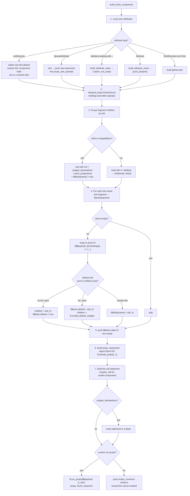

---

## Attributes → props, in detail

### Plain attributes

`build_attribute_value(attribute.value, context, false, true)` does the work. The last argument
(`is_component = true`) is important: for a component prop the value must stay a **raw JS value**,
not HTML-escaped text. Escaping only happens when a value is written into the HTML stream, which
for a component prop is the child's job, not the caller's. See
[`compiler_transform_server_core`](compiler_transform_server_core.md) for `build_attribute_value`.

Property keys go through `b.key(...)`, which emits an identifier when the name is a valid JS
identifier and a string literal otherwise (`data-foo` → `'data-foo'`).

### Spread attributes

A spread cannot be merged into an object literal at compile time, so it is pushed as a standalone
expression. This is why `props_and_spreads` is a list of *alternating* groups:

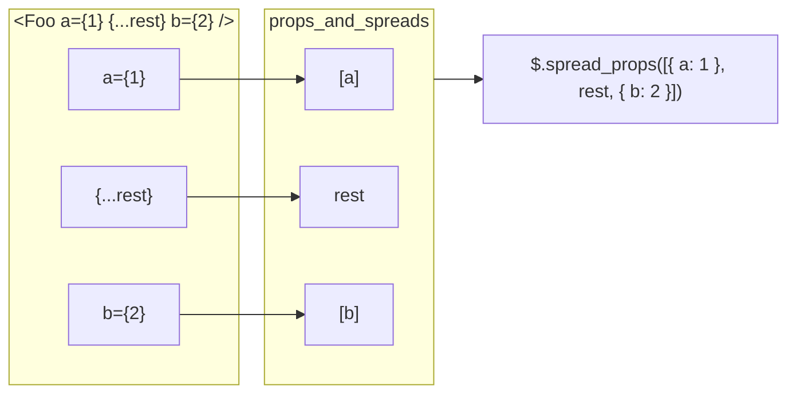

If there is exactly one group and it is a property list, the emitted props are a plain object
literal — no runtime helper needed. Otherwise `$.spread_props` merges them left-to-right at
runtime, preserving property **descriptors** so that getter/setter props survive the merge
(see [`server_runtime`](server_runtime.md)).

### Bindings (`bind:x`)

Server rendering has no reactivity, so a binding becomes a **getter/setter property pair** on the
props object. Two shapes exist:

**Sequence expression** (the modern, analysis-provided `[get, set]` form):

```js
// bind:value={() => a, (v) => a = v}   →
let bind_get = () => a;
let bind_set = (v) => a = v;
Child($$payload, {
  get value() { return bind_get(); },
  set value($$value) { bind_set($$value); }
});
```

The getter and setter are hoisted into `context.state.init` under generated names
(`scope.generate('bind_get')`), so the expressions are evaluated once, in the right order.

**Plain expression** (`bind:value={a}`):

```js
get value() { return a; },
set value($$value) { a = $$value; $$settled = false; }
```

The `$$settled = false` line is the interesting part. Legacy component bindings can flow data
*upwards* mid-render, which means the parent's own output may already be wrong. The program
builder in [`compiler_transform_server_core_program`](compiler_transform_server_core_program.md)
detects `analysis.uses_component_bindings` and wraps the whole template in a
`do { ... } while (!$$settled)` loop over a copied payload — so setting `$$settled = false` makes
the parent re-render until values stop changing.

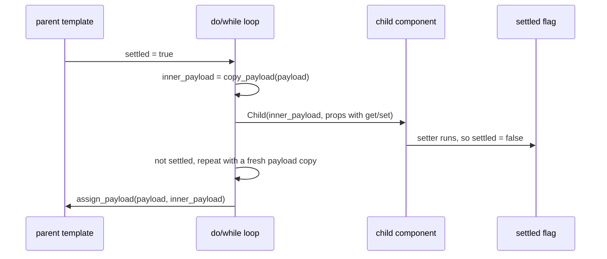

Bindings are also **delayed**: `push_prop(..., true)` queues them, and
`delayed_props.forEach(fn => fn())` runs them after the attribute loop. That guarantees a later
`{...spread}` can never overwrite a `bind:` accessor, which would silently break two-way data flow.

### Custom CSS properties (`--foo={...}`)

These are not props at all — they are CSS variables that must be set on a wrapper element around
the component's output. They are collected separately and turned into:

```js
$.css_props($$payload, /* is_html */ true, { '--foo': value }, () => {
  Child($$payload, { ... });
}, /* dynamic */ true);
```

`is_html` is `false` when `context.state.namespace === 'svg'`, because the runtime then wraps in
`<g>` instead of `<svelte-css-wrapper>`.

---

## Children → slots and snippets

This is the subtlest area, because Svelte has three overlapping ways to pass content: legacy
slots, `let:` scoped slots, and modern snippets. `build_inline_component` normalizes all of them
into the same runtime contract:

- `children` prop → the default content, callable as a snippet.
- `$$slots` prop → a record of `name → function` (or `name → true` for snippet interop).

### Scope switching

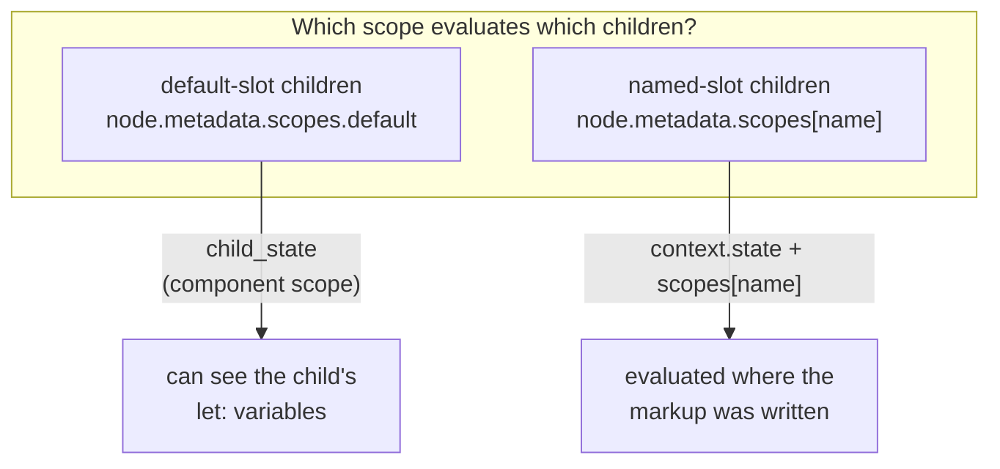

The scopes themselves are produced during analysis; see
[`compiler_analyze`](compiler_analyze.md) and [`compiler_core`](compiler_core.md) (`scope.js`).

There is one special case: `slot_scope_applies_to_itself`. If the component node *itself* carries a
`slot="x"` attribute, it is a named slot inside some *other* component, so its own `let:`
directives belong to that outer slot — not to its children. In that case `let:` directives are not
collected into `lets.default`.

### Grouping children

For every node in `node.fragment.nodes`:

1. **`SnippetBlock`** — visited with `init` redirected to a local `snippet_declarations` array.
   Normally `SnippetBlock` (see [`compiler_transform_server_blocks`](compiler_transform_server_blocks.md))
   pushes its function declaration into `state.init`; here it must be hoisted next to the call
   instead, so the function can be referenced as a prop without name conflicts. The snippet is
   then passed twice: once as a real prop (`{#snippet foo()}` → `foo`) and once as
   `$$slots.foo = true`, so a child that still uses `<slot name="foo">` keeps working.
2. **Element-like nodes with `slot="x"`** — go into `children['x']`, and their `let:` directives
   into `lets['x']`.
3. **`<svelte:fragment>` without `slot`** — its `let:` directives are merged into `lets.default`.
4. **Everything else** — goes into `children.default`.

### Serializing each slot

Each group is visited as a synthetic fragment, producing a `BlockStatement` (via the `Fragment`
visitor in [`compiler_transform_server_core`](compiler_transform_server_core.md)). Empty blocks are
dropped. The block becomes an arrow function whose first parameter is always `$$payload`; if the
slot has `let:` directives, a destructuring object pattern is added as a second parameter:

```js
// <Foo let:item let:index={i}>{item}</Foo>   →
($$payload, { item, index: i }) => { $$payload.out.push(`${$.escape(item)}`); }
```

`let:x={...}` values that parse as `ObjectExpression` / `ArrayExpression` are re-tagged as
destructuring patterns, since the parser cannot tell the two apart in this position.

### The default-slot decision

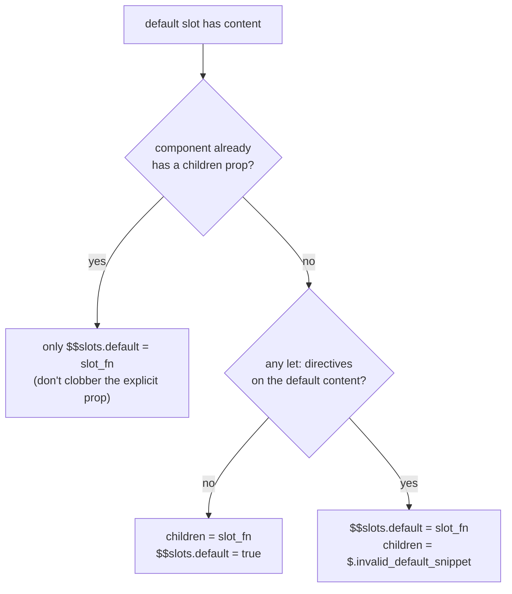

Why the split:

- **No `let:`** — the content is a valid snippet, so it can be passed as `children`. The extra
  `$$slots.default = true` lets a child that still renders `<slot />` find it, because the runtime
  `$.slot` helper treats `true` as "look for a prop with this name".
- **With `let:`** — the content needs arguments the caller controls, which is not what a snippet
  is. It is passed only through `$$slots`, and `children` is set to `$.invalid_default_snippet`, a
  runtime function that throws a clear error if the child tries to render it as a snippet.

In dev mode the `children` snippet function is wrapped in `$.prevent_snippet_stringification`, so
accidentally interpolating a snippet (`{children}`) produces a helpful error instead of
`"function () {...}"` in the HTML.

---

## Hydration markers

Server output must line up with what the client expects to hydrate. `build_inline_component` emits
`empty_comment` (`<!---->`) markers around the call:

| Situation | Markers emitted |
| --- | --- |
| static `<Foo />`, not standalone | trailing `<!---->` |
| dynamic component (`<svelte:component>`, or `Component` with `metadata.dynamic`) | leading **and** trailing `<!---->` |
| `state.skip_hydration_boundaries` is set (component is the only child) | no trailing marker |
| custom CSS props present | markers are handled inside `$.css_props` instead |

`skip_hydration_boundaries` is set by the `Fragment` visitor when the fragment is "standalone"
— see [`compiler_transform_server_core_template`](compiler_transform_server_core_template.md).
`metadata.dynamic` comes from analysis.

---

## `SlotElement` — the receiving side

`<slot>` is the legacy counterpart to everything above. Where `build_inline_component` *builds*
`$$slots`, `SlotElement` *consumes* it.

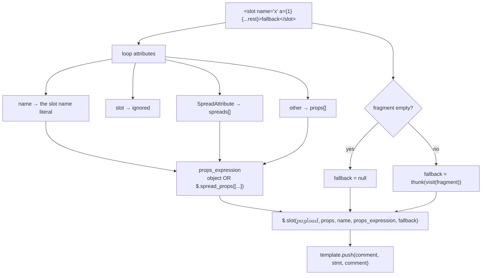

The emitted call is always wrapped in a pair of `<!---->` markers, because a slot's content length
is unknown at compile time and hydration needs stable anchors on both sides.

At runtime (`$.slot` in [`server_runtime`](server_runtime.md)):

```js
var slot_fn = $$props.$$slots?.[name];
if (slot_fn === true) slot_fn = $$props[name === 'default' ? 'children' : name];
if (slot_fn !== undefined) slot_fn(payload, slot_props);
else fallback_fn?.();
```

That `slot_fn === true` branch is exactly the interop path that `build_inline_component` sets up
when it pushes `$$slots.default = true` next to a `children` prop, or `$$slots.foo = true` next to
a snippet named `foo`. The two halves of this module are designed against each other.

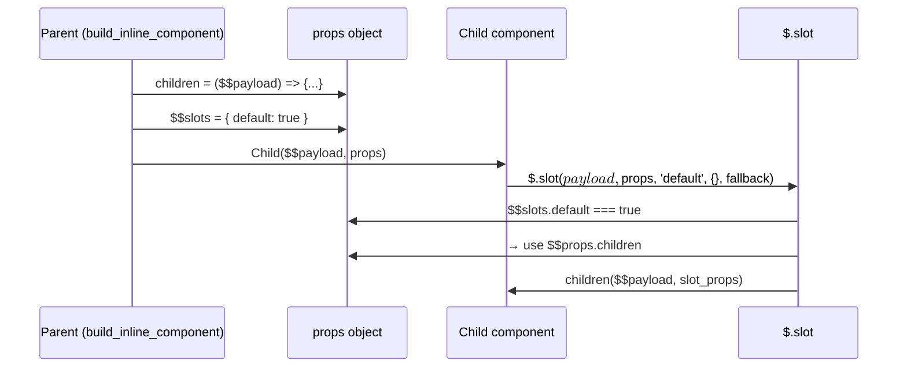

---

## Dependencies

```mermaid
graph TD
    subgraph THIS["compiler_transform_server_components"]
        ENGINE["shared/component.js<br/>build_inline_component"]
        C["Component.js"]
        SC["SvelteComponent.js"]
        SS["SvelteSelf.js"]
        SE["SlotElement.js"]
    end

    subgraph SHARED["shared helpers"]
        UTILS["server/visitors/shared/utils.js<br/>empty_comment, build_attribute_value"]
        BUILDERS["compiler/utils/builders.js<br/>b.call, b.maybe_call, b.object,<br/>b.get, b.set, b.arrow, b.thunk, b.key"]
        NODES["phases/nodes.js<br/>is_element_node"]
        STATE["compiler/state.js<br/>dev"]
        TYPES["server/types.d.ts<br/>ComponentContext,<br/>ComponentServerTransformState"]
    end

    subgraph SIBLINGS["sibling transform modules (via context.visit)"]
        FRAG["Fragment visitor<br/>compiler_transform_server_core"]
        SNIP["SnippetBlock, SpreadAttribute<br/>compiler_transform_server_blocks / _elements"]
        JSV["expression visitors<br/>compiler_transform_server_javascript"]
    end

    subgraph RT["emitted runtime calls"]
        R1["$.spread_props"]
        R2["$.css_props"]
        R3["$.slot"]
        R4["$.invalid_default_snippet"]
        R5["$.prevent_snippet_stringification (dev)"]
    end

    C --> ENGINE
    SC --> ENGINE
    SS --> ENGINE

    ENGINE --> UTILS
    ENGINE --> BUILDERS
    ENGINE --> NODES
    ENGINE --> STATE
    ENGINE --> TYPES
    SE --> UTILS
    SE --> BUILDERS

    ENGINE --> FRAG
    ENGINE --> SNIP
    ENGINE --> JSV
    SE --> FRAG

    ENGINE --> R1
    ENGINE --> R2
    ENGINE --> R4
    ENGINE --> R5
    SE --> R1
    SE --> R3
```

### State this module reads and writes

| Field on `ComponentServerTransformState` | Used for |
| --- | --- |
| `template` | where the finished component call statement is pushed |
| `init` | where hoisted `bind_get` / `bind_set` variables go |
| `scope` | resolving names; also `scope.generate(...)` for fresh identifiers |
| `namespace` | picks the HTML vs SVG wrapper in `$.css_props` |
| `skip_hydration_boundaries` | whether to omit the trailing `<!---->` |
| `analysis.name` | the component's own name, used by `SvelteSelf` |

Full definitions live in [`compiler_transform_server_core_program`](compiler_transform_server_core_program.md)
and [`compiler_ast_types`](compiler_ast_types.md).

---

## Worked example

Input:

```svelte
<Card --accent="red" title="Hi" bind:open {...rest} let:x>
  <span>{x}</span>
  <p slot="footer">bye</p>
  {#snippet icon()}<i></i>{/snippet}
</Card>
```

Roughly what this module emits (formatting cleaned up):

```js
$.css_props($$payload, true, { '--accent': 'red' }, () => {
  function icon($$payload) { $$payload.out.push('<i></i>'); }

  Card($$payload, $.spread_props([
    { title: 'Hi' },
    rest,
    {
      icon,
      $$slots: {
        icon: true,
        default: ($$payload, { x }) => {
          $$payload.out.push(`<span>${$.escape(x)}</span>`);
        },
        footer: ($$payload) => {
          $$payload.out.push('<p>bye</p>');
        }
      },
      children: $.invalid_default_snippet,
      get open() { return open; },
      set open($$value) { open = $$value; $$settled = false; }
    }
  ]));
}, true);
```

Note how every rule shows up: the CSS prop became a wrapper, the snippet was hoisted into a block
and passed both ways, the `let:x` forced `$$slots.default` plus `$.invalid_default_snippet`, the
binding accessors landed **after** `rest` in the spread list, and the named slot got its own
function.

---

## Design notes and gotchas

- **One statement out.** No matter how complex the input, the visitor pushes a single statement
  (sometimes a block) onto `state.template`. This keeps `build_template` able to interleave string
  chunks and statements freely.
- **Order matters twice.** Bindings after spreads (correctness of two-way data), and getter/setter
  hoisting into `init` (correctness of evaluation order).
- **`$$settled` is legacy-only.** It exists so old-style `bind:` on components still converges.
  It is dead weight for rune-based components, and the loop is only generated when
  `analysis.uses_component_bindings` is true.
- **Snippet vs slot is decided at compile time, checked at runtime.** The compiler emits
  `$.invalid_default_snippet` rather than a compile error, because whether the *child* treats the
  content as a snippet or a slot is not knowable from the parent alone.
- **The client transform makes different choices.** Same AST, same slot/snippet rules, but the
  client emits reactive props and effect-driven rendering. Compare with
  [`compiler_transform_client_components_builder`](compiler_transform_client_components_builder.md)
  when changing shared semantics — the two must stay in agreement, or SSR output and hydration will
  disagree.
