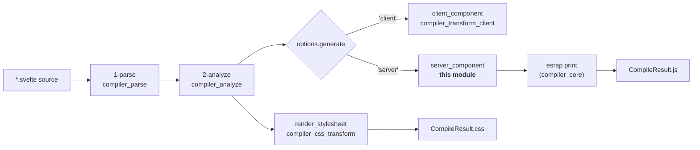
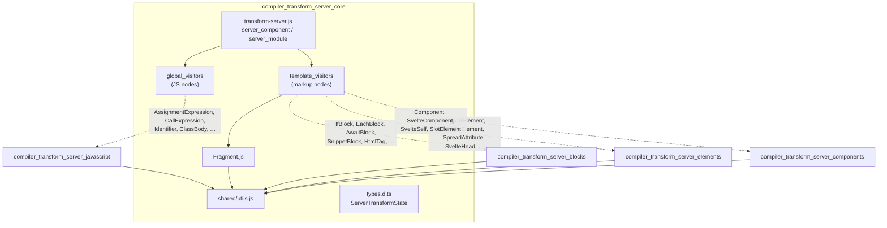
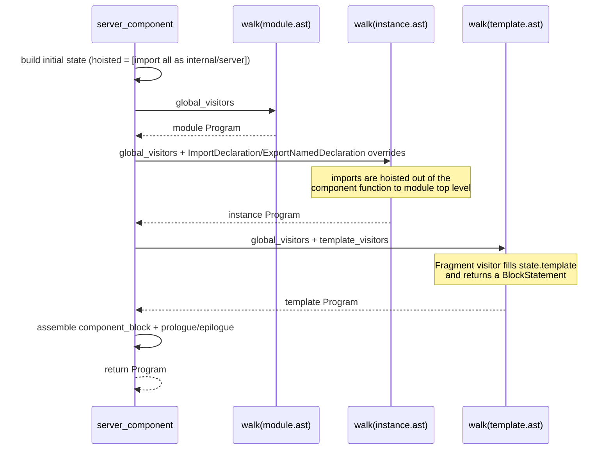
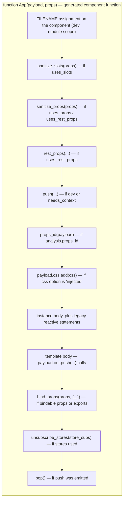
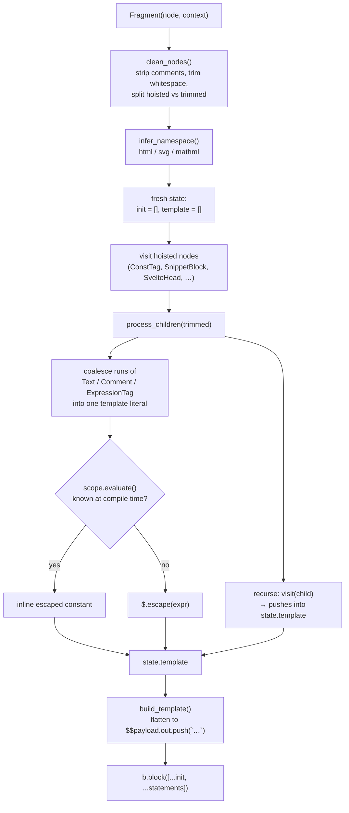
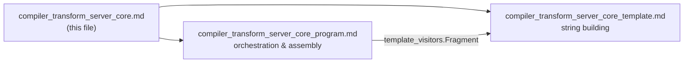

# compiler_transform_server_core

## 1. Purpose

`compiler_transform_server_core` is the **backbone of Svelte's server (SSR) code generator**. It is the part of phase 3 (`3-transform`) that turns an analyzed Svelte component into a plain JavaScript module that, when run on a server, appends HTML strings into a payload object.

It does three things and only three things:

1. **Drives the walk.** `server_component` (and its sibling `server_module`) walk the module, instance, and template ASTs with [zimmerframe](https://github.com/Rich-Harris/zimmerframe), handing each node to a visitor, then assemble the results into one exported function declaration.
2. **Owns the shared string-building helpers.** Every other server visitor calls into `process_children`, `build_template`, `build_attribute_value`, and `build_getter` instead of writing its own string logic.
3. **Defines the transform state.** `ServerTransformState` / `ComponentServerTransformState` are the mutable context objects that flow through the walk (`template`, `init`, `hoisted`, `namespace`, …).

Everything else — how an `{#if}` block, an element, or a component call is turned into code — lives in sibling modules that plug into this core.

### Why the server output looks the way it does

Client-side Svelte builds a DOM tree and wires up reactive effects. The server does none of that. It produces a function like:

```js
import * as $ from 'svelte/internal/server';

export default function App($$payload, $$props) {
        let { name } = $$props;
        $$payload.out.push(`<h1>hello ${$.escape(name)}</h1>`);
}
```

So the whole job of this module is **string concatenation with correct escaping, whitespace, and hydration markers** — no reactivity, no lifecycle, no event wiring.

---

## 2. Where it sits in the compiler



`compile()` in [compiler_core](compiler_core.md) picks the branch; `transform_component` calls `server_component(analysis, options)` and prints the returned ESTree `Program` with esrap.

The generated code's runtime counterpart is [server_runtime](server_runtime.md) — every `$.escape`, `$.push`, `$.bind_props`, `$.copy_payload` call emitted here is a function that lives there. Reading the two side by side is the fastest way to understand either.

---

## 3. Architecture

### 3.1 The visitor registry

`transform-server.js` holds two flat objects that make up the whole server code generator. All sibling modules exist only to fill these tables.



Two tables, because there are two kinds of node:

| Table | Applied to | State type | Contents |
|---|---|---|---|
| `global_visitors` | module script, instance script, **and** template | `ServerTransformState` | Pure-JS nodes: `AssignmentExpression`, `AwaitExpression`, `CallExpression`, `ClassBody`, `ExpressionStatement`, `Identifier`, `LabeledStatement`, `MemberExpression`, `PropertyDefinition`, `UpdateExpression`, `VariableDeclaration`, plus `_: set_scope` |
| `template_visitors` | template AST only | `ComponentServerTransformState` | Markup nodes: `Fragment`, blocks, elements, tags, components |

`_: set_scope` is the catch-all hook from [compiler_core](compiler_core.md); it keeps `state.scope` pointing at the correct lexical scope as the walk descends, which is what makes `build_getter` and store detection work.

### 3.2 The three walks

`server_component` runs **three separate walks**, one per script/markup region of a `.svelte` file, because each has a different scope map and a different visitor set.



### 3.3 Assembly order inside the generated function

After the walks, `server_component` layers a series of conditional prologue and epilogue statements onto `component_block`. The order matters — each `unshift` pushes the new statement in front of the previous ones:



Notable special cases handled here:

- **Legacy reactive statements (`$:`)** are collected during the walk into `state.legacy_reactive_statements` and re-emitted at the end of the instance body in the dependency order computed by [compiler_analyze](compiler_analyze.md), with `let` declarators hoisted to the top.
- **Legacy component bindings** (`analysis.uses_component_bindings`) wrap the whole template in a `do…while (!$$settled)` loop over `$.copy_payload` / `$.assign_payload`, re-rendering until two-way bindings stabilise.
- **Store subscriptions** get a `var $$store_subs` declaration and a matching `$.unsubscribe_stores` teardown. See [client_store_interop](client_store_interop.md) for the client-side equivalent.
- **Svelte 4 compatibility** (`compatibility.componentApi === 4`) attaches a `Component.render(...)` static; in dev it attaches a throwing stub instead. Related: [legacy_compat](legacy_compat.md).

### 3.4 Data flow: markup → string

The `Fragment` visitor plus the shared utils form the pipeline that every piece of markup passes through.



The key idea: `state.template` is a **mixed array of expressions and statements**. Visitors append freely; `build_template` walks it once at the end, merging adjacent expressions into a single tagged template literal and letting statements (an `if`, a `for`) interrupt the run. That is what keeps the output compact — one `push` per contiguous chunk of HTML instead of one per node.

---

## 4. Sub-modules

The module splits cleanly in two: the part that *orchestrates* the walk and assembles the module, and the part that *builds strings*.



| Sub-module | Documentation file | Covers | What you'll find there |
|---|---|---|---|
| Program orchestration | [compiler_transform_server_core_program.md](compiler_transform_server_core_program.md) | `transform-server.js`, `types.d.ts` | `server_component` / `server_module`, the visitor registries, the three walks, prologue/epilogue assembly, legacy `$:` and component-binding handling, `ServerTransformState` field reference |
| Template &amp; string building | [compiler_transform_server_core_template.md](compiler_transform_server_core_template.md) | `visitors/Fragment.js`, `visitors/shared/utils.js` | `Fragment`, `process_children`, `build_template`, `build_attribute_value`, `build_getter`, hydration markers (`block_open`, `block_close`, `empty_comment`), escaping and whitespace rules |

---

## 5. Core components at a glance

| Component | File | Role |
|---|---|---|
| `server_component` | `transform-server.js` | Entry point: analysis → ESTree `Program` for a component |
| `server_module` | `transform-server.js` | Same for a `.svelte.js` module (no template, JS visitors only) |
| `Fragment` | `visitors/Fragment.js` | Turns a markup fragment into a `BlockStatement` of `$$payload.out.push(...)` |
| `process_children` | `visitors/shared/utils.js` | Coalesces text/comment/expression runs; recurses into element children |
| `build_template` | `visitors/shared/utils.js` | Flattens `state.template` into the fewest possible push/assign statements |
| `build_attribute_value` | `visitors/shared/utils.js` | Attribute value → literal or `$.stringify`-joined template literal |
| `build_getter` | `visitors/shared/utils.js` | Rewrites `$store` reads into `$.store_get(...)` |
| `ServerTransformState` | `types.d.ts` | Shared walk context; `ComponentServerTransformState` adds template-only fields |

---

## 6. Related modules

- [compiler_transform_server](compiler_transform_server.md) — parent module; the full server visitor set
- [compiler_transform_server_javascript](compiler_transform_server_javascript.md) — fills `global_visitors`
- [compiler_transform_server_blocks](compiler_transform_server_blocks.md) — fills the block/tag half of `template_visitors`
- [compiler_transform_server_elements](compiler_transform_server_elements.md) — element and attribute visitors
- [compiler_transform_server_components](compiler_transform_server_components.md) — component invocation and slots
- [compiler_transform_client](compiler_transform_client.md) — the DOM-generating sibling; same shape, very different output
- [compiler_core](compiler_core.md) — `compile()`, `set_scope`, the `b.*` ESTree builders, compiler `state`
- [compiler_css_transform](compiler_css_transform.md) — `render_stylesheet`, used here for `css: 'injected'`
- [server_runtime](server_runtime.md) — the `svelte/internal/server` functions this module emits calls to
- [compiler_ast_types](compiler_ast_types.md) — `AST.*` node shapes and `TransformState`
