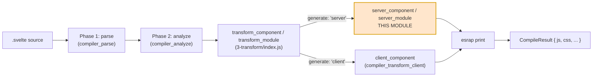
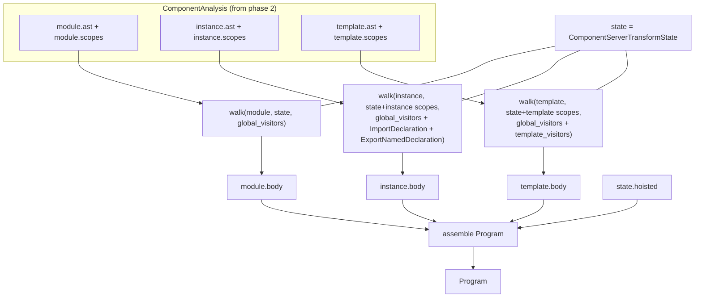
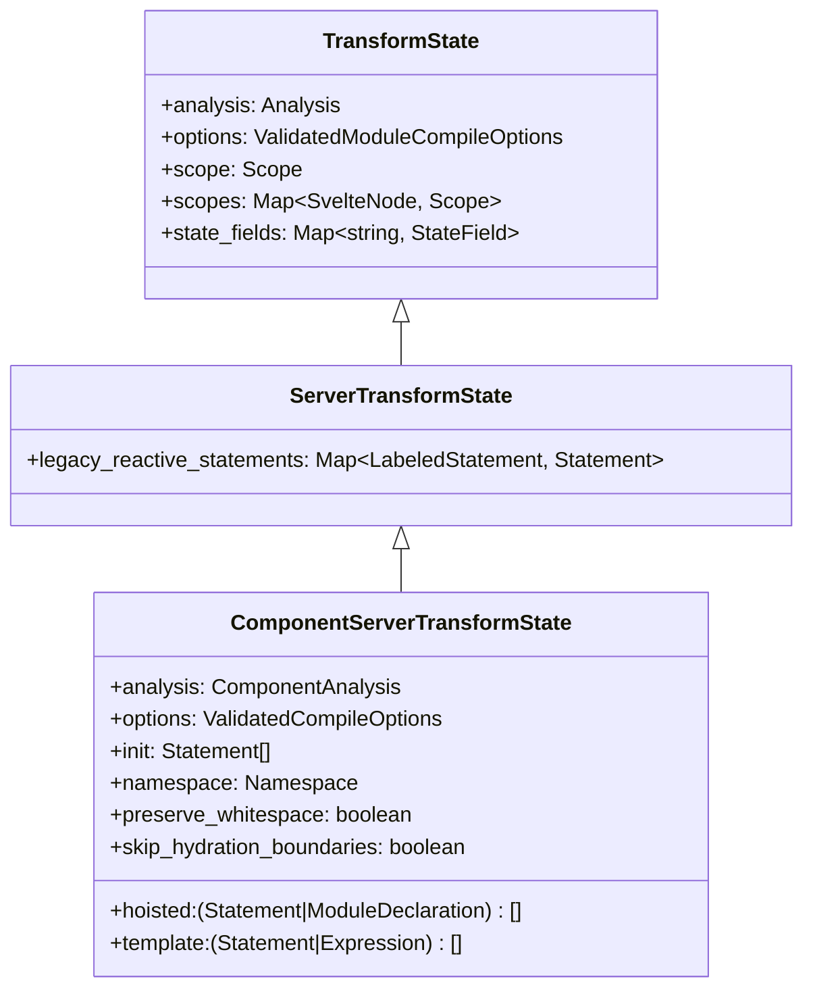
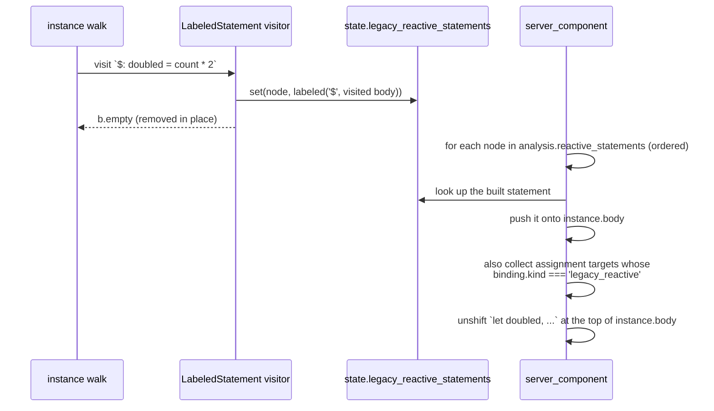
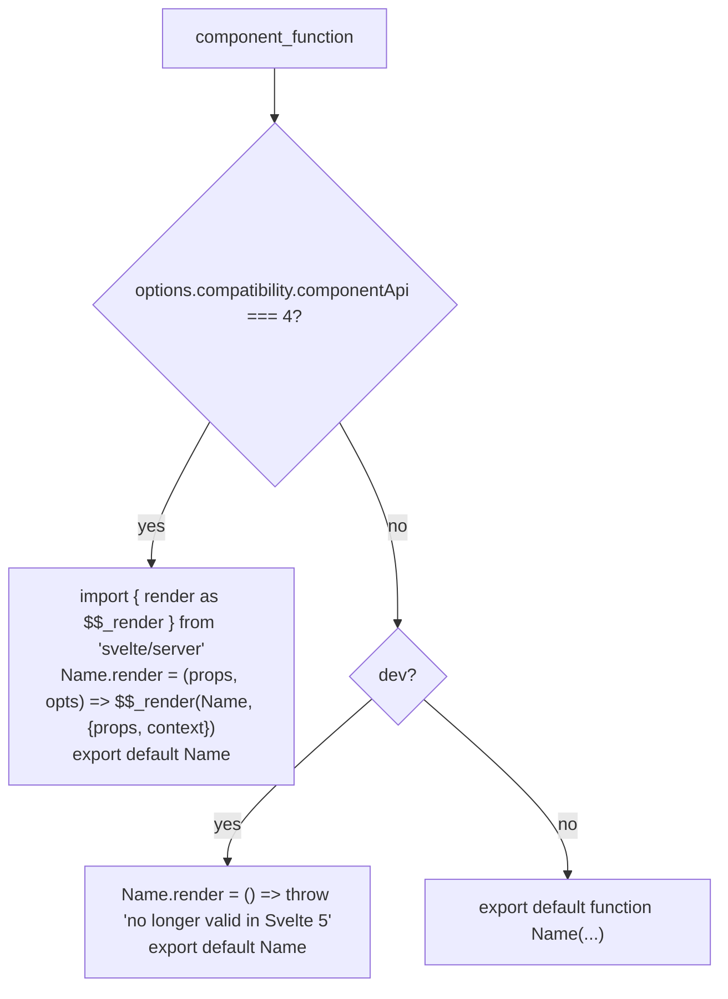
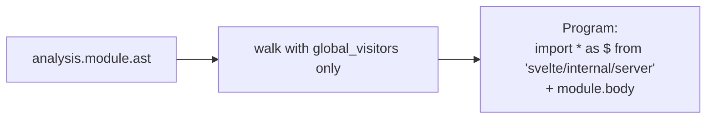
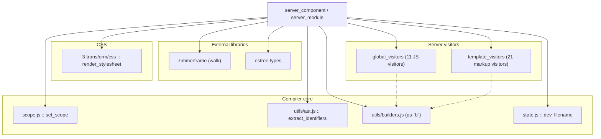

# compiler_transform_server_core_program

## Introduction

This module is the **program builder** of Svelte's server (SSR) code generator. It is the entry point of phase 3 when `generate: 'server'` is used.

Its job is simple to say and detailed to do: take the analysed AST of a `.svelte` file (or a `.svelte.js` module) and hand back a single ESTree `Program` — a finished JavaScript module that, when run, writes HTML strings into a payload object.

It owns two exported functions and one shared state shape:

| Component | File | What it does |
| --- | --- | --- |
| `server_component` | `phases/3-transform/server/transform-server.js` | Builds the full SSR module for a `.svelte` component |
| `server_module` | `phases/3-transform/server/transform-server.js` | Builds the SSR module for a `.svelte.js` / `.svelte.ts` file |
| `ServerTransformState` / `ComponentServerTransformState` | `phases/3-transform/server/types.d.ts` | The state object threaded through every visitor |

Everything else in the server transform (elements, blocks, components, expressions) is a *visitor* that this module registers and drives. Those visitors are documented in their own modules — see [compiler_transform_server](compiler_transform_server.md) and the sibling module [compiler_transform_server_core_template](compiler_transform_server_core_template.md).

---

## Where this module sits

The compiler runs three phases. This module is the very top of the third phase, on the server branch.



`transform_component` in `phases/3-transform/index.js` picks the branch, then prints the returned `Program` with `esrap` and merges source maps. This module never prints code itself — it only builds AST.

The generated module imports the SSR runtime as `$`:

```js
import * as $ from 'svelte/internal/server';
```

Everything the output calls at runtime (`$.push`, `$.pop`, `$.escape`, `$.bind_props`, `$.copy_payload`, …) lives in [server_runtime](server_runtime.md).

---

## Architecture: three walks over three ASTs

Phase 2 splits a component into three separate ASTs, each with its own scope map:

* `analysis.module` — the `<script module>` block
* `analysis.instance` — the ordinary `<script>` block
* `analysis.template` — the markup

`server_component` walks each one with `zimmerframe`'s `walk`, using a different visitor set per walk.



### Visitor sets

`global_visitors` handles plain JavaScript and is used by **all three** walks. Every entry is documented in [compiler_transform_server_javascript](compiler_transform_server_javascript.md).

```
_ (set_scope), AssignmentExpression, AwaitExpression, CallExpression,
ClassBody, ExpressionStatement, Identifier, LabeledStatement,
MemberExpression, PropertyDefinition, UpdateExpression, VariableDeclaration
```

The `_` entry is `set_scope` from [compiler_core](compiler_core.md). It runs on every node and swaps `state.scope` when the node opens a new scope, so any visitor can look up bindings by name without tracking scope itself.

`template_visitors` is added only for the template walk:

```
Fragment, RegularElement, SvelteElement, TitleElement, SvelteHead,
SvelteFragment, SlotElement, SpreadAttribute        → compiler_transform_server_elements
IfBlock, EachBlock, AwaitBlock, KeyBlock, SnippetBlock,
RenderTag, HtmlTag, ConstTag, DebugTag, SvelteBoundary → compiler_transform_server_blocks
Component, SvelteComponent, SvelteSelf              → compiler_transform_server_components
Fragment                                             → compiler_transform_server_core_template
```

### The instance walk's two extra visitors

The instance script needs two rewrites that the module script does not:

| Visitor | Behaviour |
| --- | --- |
| `ImportDeclaration` | Pushes the import onto `state.hoisted` and returns `b.empty`. Imports must live at module top level, not inside the component function. |
| `ExportNamedDeclaration` | If it has a declaration, visit and keep the declaration only (the `export` keyword is dropped — exports become props). If it is a bare `export { x }`, return `b.empty`. |

---

## State shape



`TransformState` is shared with the client transform and lives in [compiler_ast_types](compiler_ast_types.md).

Notes on the fields this module sets up:

* **`hoisted`** starts as `[import * as $ from 'svelte/internal/server']`. Instance imports get appended during the walk.
* **`init` and `template`** are created as `null` on purpose. They are only meaningful inside a fragment, and the `Fragment` visitor replaces them with fresh arrays for each fragment it enters. Touching them before that is a bug.
* **`legacy_reactive_statements`** is filled by the `LabeledStatement` visitor for `$:` statements. It is declared on `ServerTransformState` (not the component subtype) only because the shared legacy JavaScript visitors need the field to exist in both walks — in a `.svelte.js` module it always stays empty.
* **`skip_hydration_boundaries`** tells child visitors they can omit the `<!--[-->` / `<!--]-->` hydration markers, because the fragment is a lone standalone node.

---

## `server_component` step by step

```mermaid
flowchart TD
    A["build initial state<br/>hoisted = [import $]"] --> B["walk module AST"]
    B --> C["walk instance AST<br/>(hoist imports, unwrap exports)"]
    C --> D["walk template AST"]
    D --> E["order legacy $: statements<br/>+ declare their variables"]
    E --> F{"uses_component_bindings?"}
    F -->|yes| G["wrap template in<br/>$$render_inner + do/while settle loop"]
    F -->|no| H
    G --> H{"any store_sub bindings?"}
    H -->|yes| I["var $$store_subs<br/>+ $.unsubscribe_stores at end"]
    H -->|no| J
    I --> J["collect bindable props + exports"]
    J --> K{"props.length > 0?"}
    K -->|yes| L["append $.bind_props($$props, {...})"]
    K -->|no| M
    L --> M["component_block = instance.body + template.body"]
    M --> N["prepend props_id / $.push+$.pop /<br/>$$restProps / $$sanitized_props / $$slots"]
    N --> O["body = hoisted + module.body"]
    O --> P{"css === 'injected'?"}
    P -->|yes| Q["add $$css const<br/>+ $$payload.css.add"]
    P -->|no| R
    Q --> R["build function_declaration(analysis.name, params, block)"]
    R --> S{"componentApi === 4 / dev / default"}
    S --> T["attach .render shim + export default"]
    T --> U{"dev?"}
    U -->|yes| V["prepend Name[$.FILENAME] = filename"]
    U -->|no| W
    V --> W["return Program"]
```

### Legacy `$:` ordering

`$:` statements must run in dependency order, not source order. Phase 2 computes that order into `analysis.reactive_statements`; this module replays it.



If a node in `analysis.reactive_statements` has no matching built statement, the module throws `Could not find reactive statement` — a hard invariant, not a user-facing error.

### The component-bindings settle loop

Legacy `bind:` on a child component means a value can flow *back up* after the child renders. SSR is one pass, so the output is re-rendered until nothing changes.

When `analysis.uses_component_bindings` is set, the template body is restructured:

```js
// snippet function declarations stay hoisted outside the loop
function greeting($$payload) { /* ... */ }

let $$settled = true;
let $$inner_payload;

function $$render_inner($$payload) {
  /* the rest of the template body */
}

do {
  $$settled = true;
  $$inner_payload = $.copy_payload($$payload);
  $$render_inner($$inner_payload);
} while (!$$settled);

$.assign_payload($$payload, $$inner_payload);
```

Snippets are separated out by the `___snippet` marker that the `SnippetBlock` visitor stamps on the function declaration, so they are declared once instead of on every iteration. `$$settled` is flipped to `false` by `$.bind_props` at runtime when a bound value actually changed. This whole path exists only for the legacy syntax and disappears in runes mode.

### Store subscriptions

If any instance binding has `kind === 'store_sub'` (i.e. the code uses `$store`), two pieces are added:

* `var $$store_subs;` at the top of the instance body
* `if ($$store_subs) $.unsubscribe_stores($$store_subs);` at the end of the template body

The lazy `$$store_subs ??= {}` initialisation happens inside `build_getter` in [compiler_transform_server_core_template](compiler_transform_server_core_template.md). See [client_store_interop](client_store_interop.md) for the client-side counterpart.

### Propagating bound props back up

Two sources feed one `$.bind_props` call at the end of the template:

1. instance declarations with `kind === 'bindable_prop'` whose name does not start with `$$` (using `binding.prop_alias` when renamed)
2. every entry in `analysis.exports` (using `alias` when renamed)

```js
$.bind_props($$props, { value, count: internalCount });
```

In runes mode this is effectively a validation call — it throws only when `undefined` is passed to a binding that has a default value.

### Prologue injections

These are all `unshift`-ed onto `component_block.body`, so the reverse of the listing order below is what you see in the output. Each is conditional:

| Condition | Injected |
| --- | --- |
| `analysis.props_id` | `const <id> = $.props_id($$payload)` — must be on the first line for hydration id stability |
| `dev \|\| analysis.needs_context` | `$.push(<Name> in dev)` at the top and `$.pop()` at the bottom |
| `analysis.uses_rest_props` | `const $$restProps = $.rest_props($$sanitized_props, [...named props])` |
| `analysis.uses_props \|\| uses_rest_props` | `const $$sanitized_props = $.sanitize_props($$props)` |
| `analysis.uses_slots` | `const $$slots = $.sanitize_slots($$props)` |
| injected CSS | `$$payload.css.add($$css)` |

`component_block.loc` is copied from `instance.loc` — a deliberate trick so `esrap` keeps the leading comments of the instance script in the output.

### CSS

When `analysis.css.ast` exists, `options.css === 'injected'`, and it is not a custom element, the stylesheet is rendered *here* and embedded in the module:

```js
const $$css = { hash: 'svelte-xyz123', code: '...' };
// and inside the component: $$payload.css.add($$css);
```

`render_stylesheet` comes from [compiler_css_transform](compiler_css_transform.md). In the non-injected case, `transform_component` calls the same function separately and returns the CSS as a distinct file.

### Function signature and exports

The parameter list is trimmed when possible — a component that touches no props at all is emitted as `function App($$payload)`:

```
should_inject_props = should_inject_context
                    || props.length > 0
                    || analysis.needs_props
                    || analysis.uses_props
                    || analysis.uses_rest_props
                    || analysis.uses_slots
                    || analysis.slot_names.size > 0
```

Three export shapes are possible:



The `componentApi: 4` path is part of the Svelte 4 compatibility surface — see [legacy_compat](legacy_compat.md). The dev-only throwing `render` exists purely to give a good error message with a link to the migration guide.

Finally, in dev, `Name[$.FILENAME] = 'App.svelte'` is prepended to the module body so runtime warnings can name the file. `dev` and `filename` are read from the compiler-wide mutable state in [compiler_core](compiler_core.md).

---

## `server_module`

The module path is much smaller. A `.svelte.js` file has no template, no props, and no component function — just JavaScript with runes in it.



State is a plain `ServerTransformState`: `analysis`, `options`, `scope`, `scopes`, an empty `legacy_reactive_statements` (present only to satisfy the shared legacy visitors), and `state_fields`.

The practical effect is that runes get stripped or rewritten to their SSR equivalents by the JavaScript visitors — for example `$state(x)` becomes plain `x`, and `$derived(...)` becomes a `$.derived(...)` call. Nothing else about the file changes.

---

## Output shape

A minimal component, roughly:

```js
/* App.svelte generated by Svelte v5 */
import * as $ from 'svelte/internal/server';
import Child from './Child.svelte';   // hoisted out of the instance script

export default function App($$payload, $$props) {
  $.push();

  let { name } = $$props;

  $$payload.out.push(`<h1>Hello ${$.escape(name)}!</h1>`);

  $.pop();
}
```

The string-pushing is not built here — `Fragment` and `build_template` produce it. See [compiler_transform_server_core_template](compiler_transform_server_core_template.md).

---

## Dependencies



Linked module docs:

* [compiler_core](compiler_core.md) — `set_scope`, the `builders` helpers (`b.*`), and the `dev` / `filename` compiler state
* [compiler_analyze](compiler_analyze.md) — produces the `ComponentAnalysis` this module reads from
* [compiler_transform_server_core_template](compiler_transform_server_core_template.md) — the sibling module: `Fragment`, `process_children`, `build_template`, `build_getter`
* [compiler_transform_server_javascript](compiler_transform_server_javascript.md) — the `global_visitors` set
* [compiler_transform_server_blocks](compiler_transform_server_blocks.md), [compiler_transform_server_elements](compiler_transform_server_elements.md), [compiler_transform_server_components](compiler_transform_server_components.md) — the `template_visitors` set
* [compiler_css_transform](compiler_css_transform.md) — `render_stylesheet`
* [server_runtime](server_runtime.md) — the `$.*` functions the generated code calls
* [compiler_transform_client](compiler_transform_client.md) — the parallel client generator
* [compiler_ast_types](compiler_ast_types.md) — `TransformState`, `AST`, `ValidatedCompileOptions`

---

## Client vs server: the same job, a different target

Both `server_component` and `client_component` are called from the same place and return a `Program`, but what they build is very different.

| | Server (this module) | Client ([compiler_transform_client](compiler_transform_client.md)) |
| --- | --- | --- |
| Output unit | one function that pushes strings | template factories + effects |
| Reactivity | none — a single pass | signals, deriveds, effects |
| Runtime import | `svelte/internal/server` | `svelte/internal/client` |
| Walks | 3 (module, instance, template) | 3, plus template extraction |
| Extra state | `template` as a string array | `Memoizer`, transformers, template nodes |
| Legacy binding fix-up | `do/while` settle loop | two-way signal binding |

The shared ground is thin on purpose: `TransformState`, the builder helpers, `set_scope`, and the analysis object. Everything else is target-specific.

---

## Working on this module

Things worth knowing before you change it:

* **Order of `unshift` calls matters.** The prologue is built by repeatedly unshifting, so the code reads bottom-up relative to the output. `props_id` is unshifted early yet must end up first, which is why `$.push`, `$$restProps`, `$$sanitized_props`, and `$$slots` are all unshifted *after* it.
* **`state.init` and `state.template` are `null` until `Fragment` runs.** If you add a new top-level step that touches them, it will crash. Fragment-scoped work belongs in a visitor.
* **New analysis flags need a decision here.** Anything that changes the component signature or the prologue (a new `$$`-prefixed helper, a new context need) is wired in this file, and usually also in `should_inject_props`.
* **`state.hoisted` is the only escape hatch to module scope** from inside the instance or template walk. Visitors that need a module-level constant push onto it.
* **The `___snippet` marker is a private contract** between `SnippetBlock` and the settle-loop code here. Renaming it breaks legacy component bindings silently.
* **`server_module` shares `global_visitors` with `server_component`.** A JavaScript visitor that assumes `state.template` exists will break `.svelte.js` compilation, since the module state has no `template` field at all.
