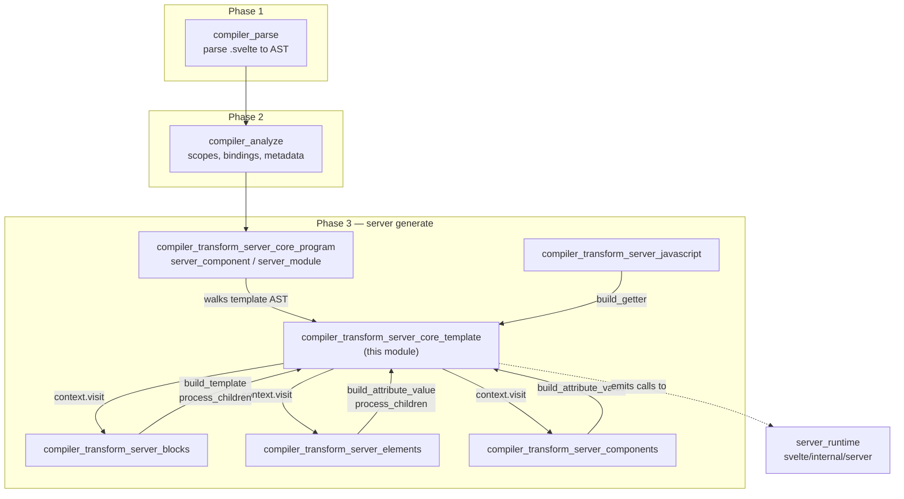
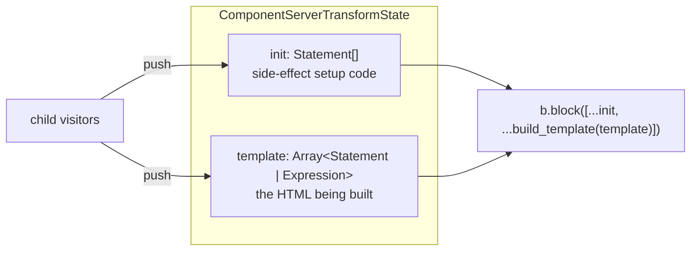
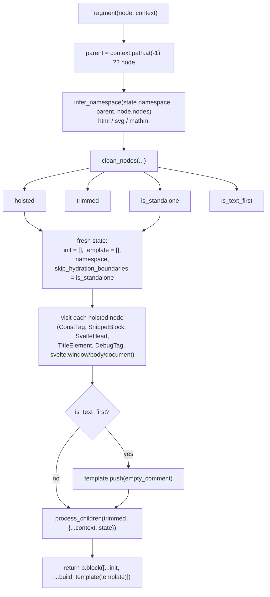
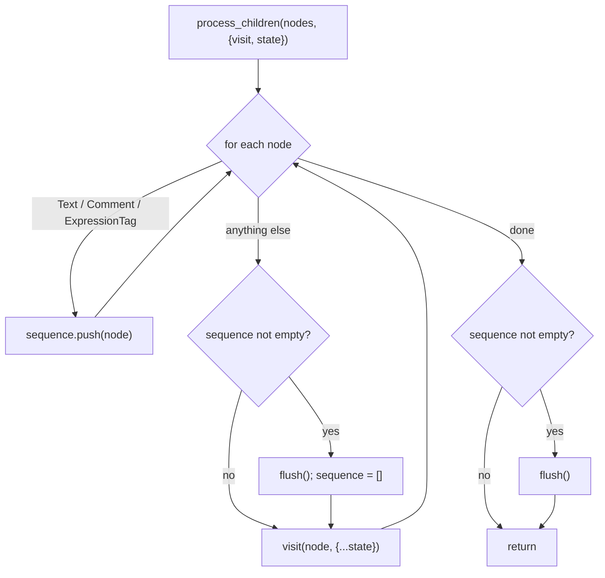
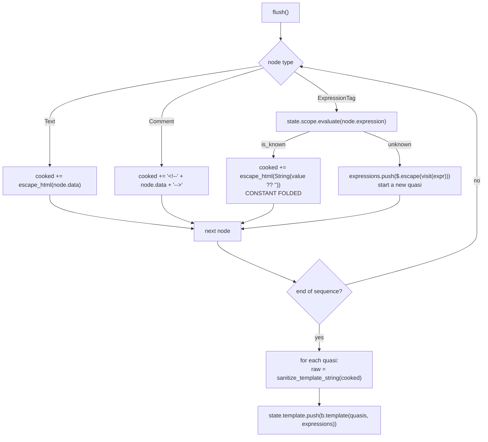
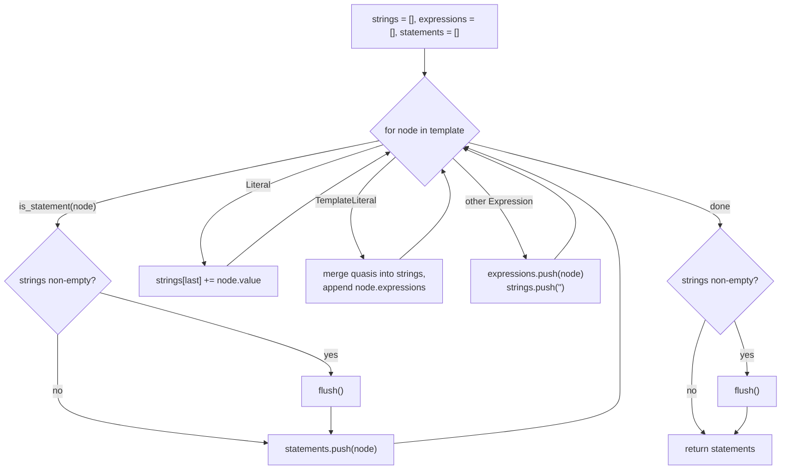
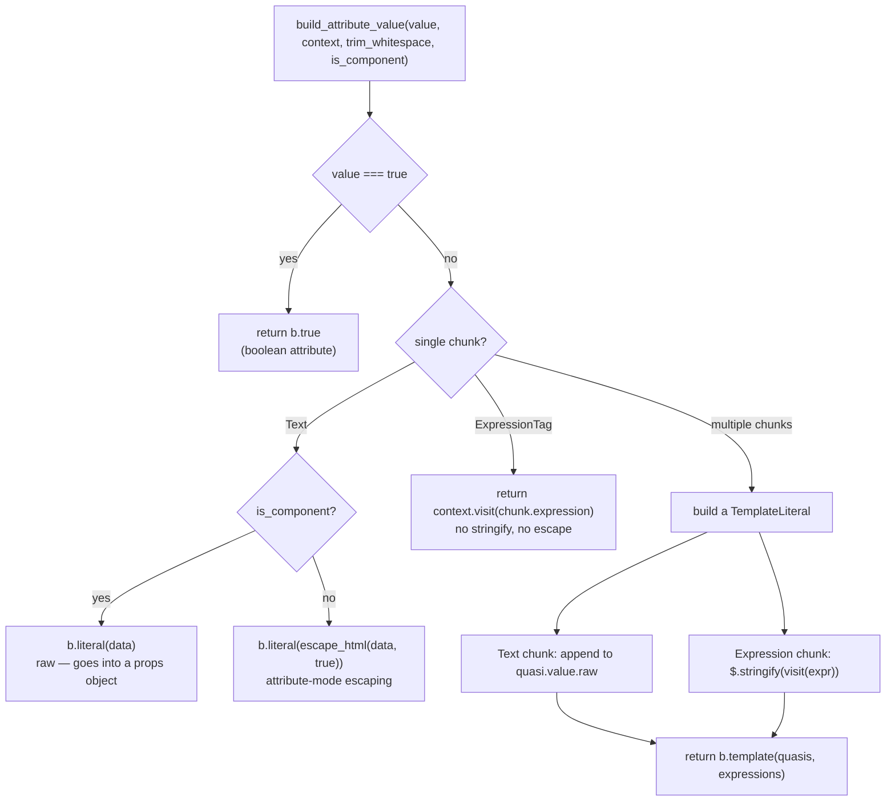
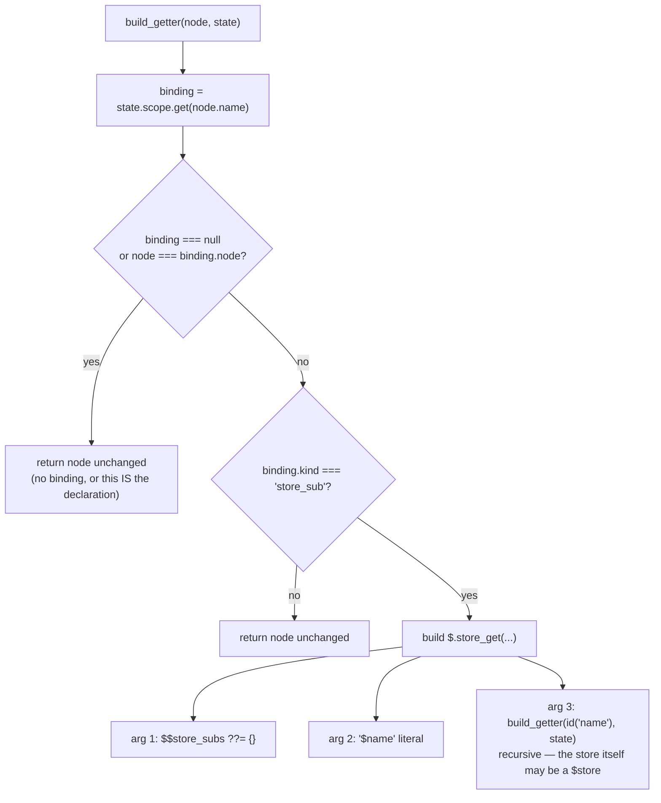
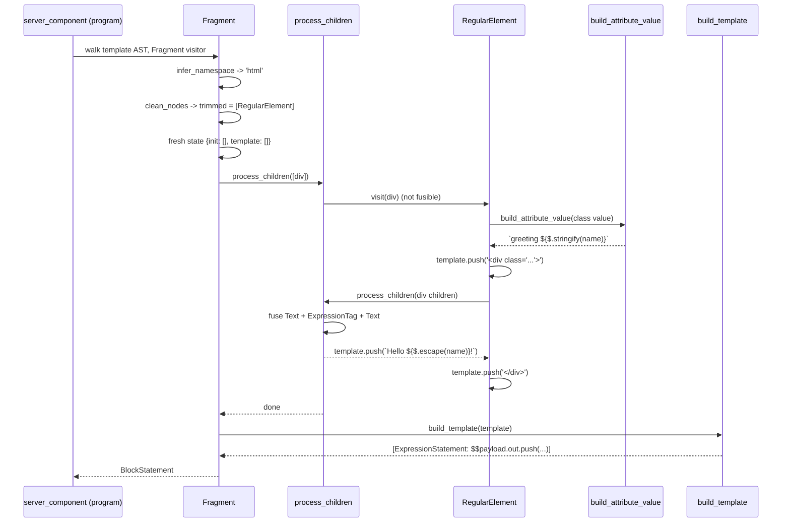

# compiler_transform_server_core_template

## Introduction

This module is the **string-building engine of Svelte's server (SSR) code generator**.

Every other server visitor eventually needs to answer the same two questions:

1. *"How do I turn a list of template child nodes into HTML text?"*
2. *"How do I turn that text into JavaScript statements that push into `$$payload.out`?"*

This module answers both. It contains one visitor (`Fragment`) plus a small set of
shared helpers (`process_children`, `build_template`, `build_attribute_value`,
`build_getter`) that nearly every file in [compiler_transform_server](compiler_transform_server.md)
imports.

The output of the server compiler is not a DOM tree — it is a plain function that appends
strings to a payload. So this module is deliberately simple: **collect strings, fuse them,
flush them**.

| Component | File | Role |
| --- | --- | --- |
| `Fragment` | `server/visitors/Fragment.js` | Visitor for `AST.Fragment`. Creates a fresh template scope and returns a `BlockStatement`. |
| `process_children` | `server/visitors/shared/utils.js` | Fuses runs of `Text` / `Comment` / `ExpressionTag` into one template literal; delegates everything else back to the walker. |
| `build_template` | `server/visitors/shared/utils.js` | Turns the mixed `Array<Statement \| Expression>` template buffer into real `Statement[]`. |
| `build_attribute_value` | `server/visitors/shared/utils.js` | Turns an attribute's value chunks into a single expression. |
| `build_getter` | `server/visitors/shared/utils.js` | Rewrites `$store` identifier reads into `$.store_get(...)`. |
| `block_open` / `block_close` / `empty_comment` | `server/visitors/shared/utils.js` | Pre-built literals for hydration marker comments. |

---

## Where this module sits



Related docs:

- [compiler_transform_server](compiler_transform_server.md) — parent module overview
- [compiler_transform_server_core](compiler_transform_server_core.md) — sibling grouping
- [compiler_transform_server_core_program](compiler_transform_server_core_program.md) — sets up the initial `ServerTransformState`
- [compiler_transform_server_blocks](compiler_transform_server_blocks.md), [compiler_transform_server_elements](compiler_transform_server_elements.md), [compiler_transform_server_components](compiler_transform_server_components.md), [compiler_transform_server_javascript](compiler_transform_server_javascript.md) — the consumers
- [compiler_transform_client_template](compiler_transform_client_template.md) — the client-side counterpart (which builds real DOM templates instead of strings)
- [server_runtime](server_runtime.md) — the `$.escape`, `$.stringify`, `$.store_get` helpers that get called at runtime

---

## The mental model: two buffers per fragment

The whole module revolves around two arrays that live on the transform state:



- **`init`** holds statements that must run *before* any output — `const` declarations from
  `{@const}`, `$$payload.title = ...` from `<title>`, snippet function declarations, and so on.
- **`template`** is a *mixed* buffer. Entries are either
  - **Expressions** (`Literal`, `TemplateLiteral`, or any other expression) — these are pieces
    of HTML text, OR
  - **Statements** (`IfStatement`, `ForOfStatement`, `ExpressionStatement`, ...) — these are
    control-flow chunks contributed by block visitors.

`build_template` is the function that reconciles that mix back into a valid statement list.

Both fields are typed `readonly` in `ServerTransformState` / `ComponentServerTransformState`
(see [compiler_transform_server_core_program](compiler_transform_server_core_program.md)):
visitors may `push` into them, but never reassign them. Reassignment happens only by creating
a *new* state object — which is exactly what `Fragment` does.

---

## `Fragment`

`Fragment` is the boundary where a new template buffer begins. It is registered in the
`template_visitors` table in `transform-server.js`, so the walker calls it for the component
root fragment and for every nested fragment (if/each bodies, element children, snippet bodies,
component slot content).



### Step details

**1. Namespace inference.** `infer_namespace` (from
[compiler_core](compiler_core.md)'s `3-transform/utils.js`) walks the parent and the child
nodes to decide whether this fragment renders HTML, SVG, or MathML. On the server this mainly
affects whitespace trimming rules (SVG whitespace can be dropped entirely) and is threaded
down to element visitors.

**2. `clean_nodes`.** This shared helper does four jobs at once:

| Return value | Meaning |
| --- | --- |
| `hoisted` | Nodes that must be emitted *before* the visible children: `ConstTag`, `DebugTag`, `SnippetBlock`, `SvelteHead`, `TitleElement`, `SvelteBody`, `SvelteWindow`, `SvelteDocument`. |
| `trimmed` | The remaining children, with whitespace normalized and comments dropped unless `preserveComments` is set. |
| `is_standalone` | `true` when the fragment is exactly one non-dynamic `Component` or `RenderTag` — meaning the surrounding block's anchor comment is enough and we can skip our own. |
| `is_text_first` | `true` when the fragment starts with `Text`/`ExpressionTag` inside a boundary that could glue text nodes together (fragment, snippet, each block, component, `svelte:boundary`, `svelte:self`). |

Whitespace handling is driven by `state.preserve_whitespace` and
`state.options.preserveComments`, both seeded by the program module from compile options.

**3. Fresh state.** Crucially, `Fragment` *shadows* `init` and `template` with empty arrays.
This is what makes nesting work: an inner fragment's output never leaks into the outer
fragment's buffer. Everything else (scope, options, analysis, `legacy_reactive_statements`)
is inherited by spread.

**4. Hydration anchoring.** Two independent mechanisms:

- `is_text_first` → prepend `<!---->` so the client hydrator does not fuse this fragment's
  first text node with the preceding sibling's text node.
- `is_standalone` → set `skip_hydration_boundaries = true`, which
  [compiler_transform_server_components](compiler_transform_server_components.md)
  (`build_inline_component`) and `RenderTag` read to *omit* their trailing `<!---->`.

**5. Return value.** A `BlockStatement`, not a pushed side effect. Callers such as
`IfBlock`, `EachBlock`, `SvelteElement`, and `SnippetBlock` do
`context.visit(node.fragment)` and then embed the returned block directly as an if-branch,
loop body, or function body.

---

## `process_children`

This is the text-fusing pass. Its goal: emit **as few template literals as possible**.



### What `flush` does

`flush` builds a single `TemplateLiteral` out of the accumulated sequence and pushes it onto
`state.template`.



Three details worth internalizing:

1. **Constant folding.** `state.scope.evaluate(...)` comes from
   [compiler_core](compiler_core.md)'s `scope.js`. When the analyzer can prove an expression's
   value statically, the value is baked into the string and the `$.escape` call disappears
   entirely. `null`/`undefined` fold to the empty string (`evaluated.value ?? ''`), matching
   the runtime's behavior.
2. **Escaping happens at compile time for literals, at runtime for expressions.** Static text
   goes through the compiler's `escape_html`; dynamic values get wrapped in `$.escape(...)`
   from [server_runtime](server_runtime.md).
3. **`cooked` then `raw`.** The builder accumulates into `quasi.value.cooked` (the logical
   string) and only at the end derives `quasi.value.raw` by escaping backticks, `${`, and
   backslashes via `sanitize_template_string`. Forgetting this is how you get generated code
   that fails to parse.

Non-fusible nodes are re-dispatched with `visit(node, { ...state })` — a shallow copy, so the
child sees the same `init` / `template` arrays and appends into them in order.

`process_children` is used not only by `Fragment` but also by `RegularElement` (for element
children) and `TitleElement` (which redirects into its own local `template` array).

---

## `build_template`

`build_template` is the "linker". It takes the mixed buffer and produces statements.

```javascript
build_template(template, out = b.id('$$payload.out'), operator = 'push')
```

| Parameter | Purpose |
| --- | --- |
| `template` | The mixed `Array<Statement \| Expression>` buffer. |
| `out` | Target identifier. Defaults to `$$payload.out`; `TitleElement` passes `$$payload.title`. |
| `operator` | `'push'` → `out.push(\`...\`)`. Any `AssignmentOperator` (`=`, `+=`, ...) → `out = \`...\``. |

### Algorithm



`is_statement` is a duck-type check: `node.type` ends with `Statement` or `Declaration`.

`flush` emits one statement from the accumulated `strings`/`expressions` pair:

```javascript
// operator === 'push'
$$payload.out.push(`str0${expr0}str1${expr1}str2`);

// operator is an assignment operator, e.g. '='
$$payload.title = `str0${expr0}str1`;
```

### Why the statement split matters

Statements act as **barriers**. Text before a statement must be flushed before the statement
runs, otherwise output ordering breaks. Concretely:

```svelte
<div>{#if cool}yes{/if}</div>
```

The buffer looks like `[Literal('<div>'), IfStatement, Literal('</div>')]`, and
`build_template` produces:

```javascript
$$payload.out.push(`<div>`);
if (cool) {
  $$payload.out.push(`<!--[-->yes`);
} else {
  $$payload.out.push(`<!--[!-->`);
}
$$payload.out.push(`<!--]--></div>`);
```

Consecutive literals, by contrast, are merged into one `push` — this is the main reason SSR
output is a handful of large `push` calls instead of one per node.

### Hydration marker literals

`build_template`'s consumers rely on three pre-built literals exported from the same file,
sourced from `internal/server/hydration.js`:

| Export | Value | Used by |
| --- | --- | --- |
| `block_open` | `<!--[-->` (`BLOCK_OPEN`) | `IfBlock`, `EachBlock`, `SvelteBoundary` |
| `block_close` | `<!--]-->` (`BLOCK_CLOSE`) | `IfBlock`, `EachBlock`, `AwaitBlock` |
| `empty_comment` | `<!---->` (`EMPTY_COMMENT`) | `Fragment`, `KeyBlock`, `RenderTag`, `SlotElement`, `build_inline_component` |

These markers let the client hydrator find and, on mismatch, remove the exact node range a
block produced. See [client_render_and_templates](client_render_and_templates.md) for the
consuming side.

---

## `build_attribute_value`

Turns an `AST.Attribute['value']` into exactly one `Expression`. Callers:
`RegularElement`, `SlotElement`, `SvelteBoundary`, and the element/component shared builders.



Behavioral notes:

- **`trim_whitespace`** collapses runs of whitespace to a single space (and trims the ends for
  the single-chunk case). Used for `class`-like attributes.
- **`is_component`** switches off HTML escaping, because component attribute values become
  JavaScript prop values rather than markup.
- **Single-expression attributes are passed through untouched.** `attr={obj}` yields the raw
  expression so the runtime (`$.attr`, `$.spread_attributes`, or a component prop) can decide
  how to handle non-string values. Only the *interpolated* multi-chunk form forces
  `$.stringify`.
- **Note the asymmetry with `process_children`:** here the multi-chunk path writes directly
  into `quasi.value.raw` rather than `cooked` + `sanitize_template_string`. That is a genuine
  difference in the two code paths, so attribute text is not put through
  `sanitize_template_string`.

---

## `build_getter`

The one non-template helper in the module. It rewrites reads of store auto-subscriptions.



Given `$count` in the source, it emits:

```javascript
$.store_get(($$store_subs ??= {}), '$count', count)
```

`$$store_subs` is declared by the program module (`instance.body.unshift(b.var('$$store_subs'))`)
and torn down with `$.unsubscribe_stores($$store_subs)` at the end of the render function.
The `??=` means the object is only allocated if a store is actually read.

`build_getter` is called from the `Identifier` visitor in
[compiler_transform_server_javascript](compiler_transform_server_javascript.md), which is
where the store-read rewrite is triggered for both instance script code and template
expressions. See [client_store_interop](client_store_interop.md) and
[stores](stores.md) for the store contract itself.

---

## End-to-end example

Input:

```svelte
<script>
  let { name } = $props();
</script>

<div class="greeting {name}">Hello {name}!</div>
```

Data flow:



Output (shape, simplified):

```javascript
export default function App($$payload, $$props) {
  let { name } = $$props;
  $$payload.out.push(`<div class="greeting ${$.stringify(name)}">Hello ${$.escape(name)}!</div>`);
}
```

Everything collapsed into a **single `push`** because nothing in the buffer was a statement.

---

## Design notes and gotchas

**`template` is append-only, and order is load-bearing.** Visitors push in document order.
Any visitor that needs an isolated sub-template must clone the state with its own
`template: []` (as `RegularElement` does for `<option>` bodies and `SvelteElement` does for
attributes) — never reuse the parent's array.

**`init` vs `template` is about *when*, not *what*.** `init` statements are emitted before all
output for the fragment. That is why `{@const}` and `<title>` land in `init`: they must be
evaluated before the markup that references them, regardless of source position.

**`Fragment` returns; block visitors push.** Two conventions coexist. `Fragment` is a *value*
visitor (returns a `BlockStatement` its caller embeds). Most others are *effect* visitors
(push into `context.state.template`). Mixing them up is the most common bug when adding a new
server visitor.

**The client transform does none of this.** The client generator builds a static HTML
template string once and then emits imperative DOM operations against it. See
[compiler_transform_client_template](compiler_transform_client_template.md). The two paths
share `clean_nodes` / `infer_namespace` from
[compiler_core](compiler_core.md) and must agree on whitespace and hydration-marker placement,
or hydration mismatches result.

**Hydration markers are a contract, not decoration.** `<!--[-->`, `<!--]-->`, and `<!---->`
placement here must match what [client_blocks](client_blocks.md) expects when hydrating. The
`is_standalone` / `skip_hydration_boundaries` optimization is exactly a negotiated exception
to that contract, which is why it is narrowly scoped in `clean_nodes`.

**Type surface.** The state shapes are declared in
`server/types.d.ts` (`ServerTransformState`, `ComponentServerTransformState`, `ComponentContext`)
and extend `TransformState` from [compiler_ast_types](compiler_ast_types.md). The walker is
`zimmerframe`; `ComponentContext` is its `Context` specialized to
`AST.SvelteNode` + `ComponentServerTransformState`.
