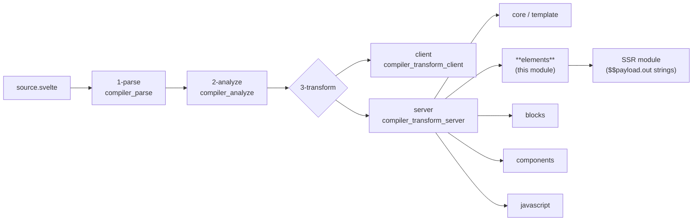
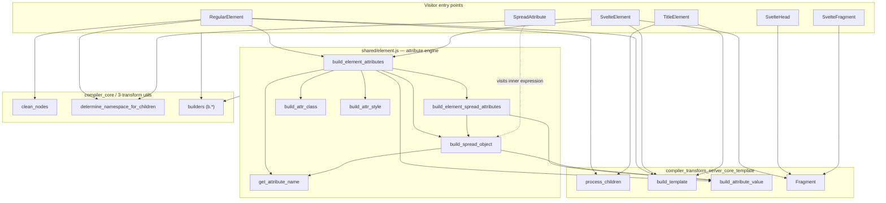
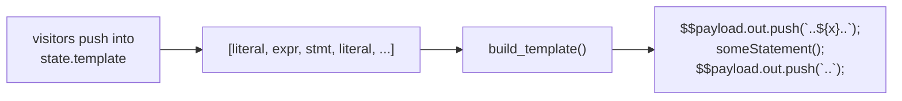
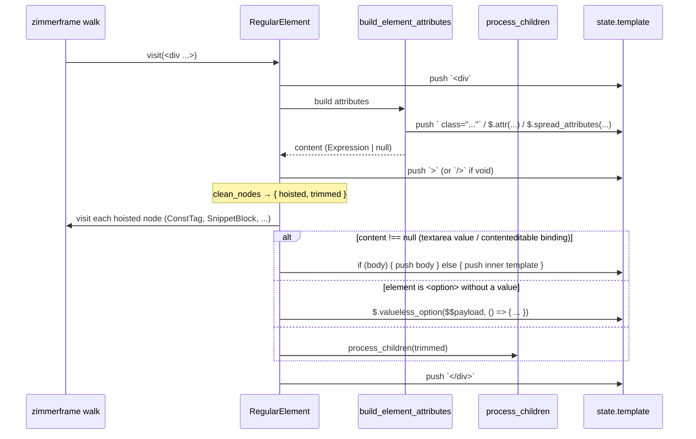
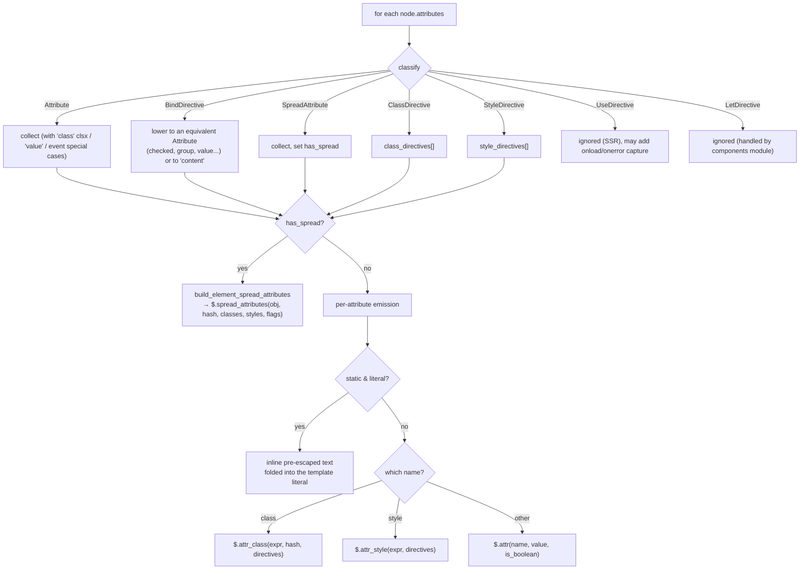
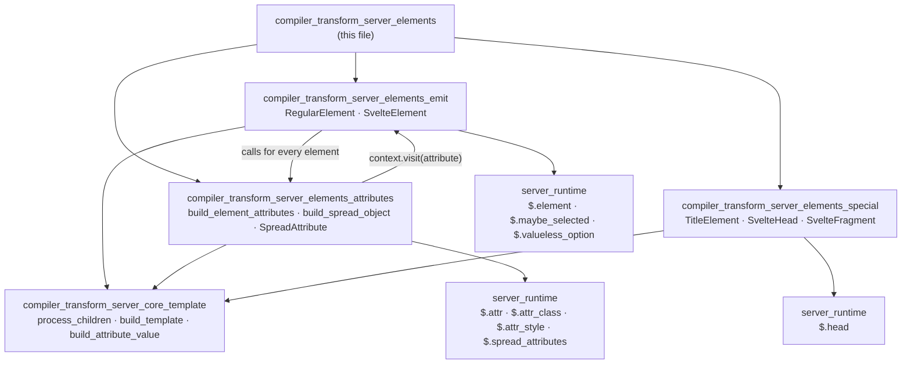

# compiler_transform_server_elements

## 1. Purpose

This module is the part of the Svelte compiler that turns **element nodes** of a
`.svelte` template into **server-side (SSR) JavaScript code**. It is one slice of
phase 3 (transform), server flavour — see [compiler_transform_server](compiler_transform_server.md).

Where the client transform builds DOM nodes and wires up reactive effects
(see [compiler_transform_client_elements](compiler_transform_client_elements.md)),
this module does something much simpler: it **appends HTML strings to an output
buffer**. The generated code writes into `$$payload.out`, so an element like:

```svelte
<div class="box" style:color={c}>hello {name}</div>
```

becomes roughly:

```js
$$payload.out.push(`<div${$.attr_class('box', 'svelte-hash')}${$.attr_style(undefined, { color: c })}>hello ${$.escape(name)}</div>`);
```

There is no reactivity, no hydration bookkeeping and no event wiring on the
server. The only jobs are: emit the right tag text, emit the right attribute
text, escape user values, and handle the handful of HTML elements whose SSR
output cannot be a plain string (`<select>`, `<option>`, `<textarea>`,
`<title>`, `<svelte:head>`, dynamic `<svelte:element>`).

### What this module owns

| File | Node type handled |
| --- | --- |
| `visitors/RegularElement.js` | `<div>`, `<span>`, any literal HTML tag |
| `visitors/SvelteElement.js` | `<svelte:element this={tag}>` |
| `visitors/shared/element.js` | attributes, spreads, `class:`/`style:` directives (shared by both of the above) |
| `visitors/SpreadAttribute.js` | `{...props}` |
| `visitors/TitleElement.js` | `<title>` |
| `visitors/SvelteHead.js` | `<svelte:head>` |
| `visitors/SvelteFragment.js` | `<svelte:fragment>` |

### What this module does *not* own

- Components and slots → [compiler_transform_server_components](compiler_transform_server_components.md)
- `{#if}`, `{#each}`, `{#await}`, `{#snippet}`, `{@html}` → [compiler_transform_server_blocks](compiler_transform_server_blocks.md)
- The `Fragment` visitor, `process_children`, `build_template`, `build_attribute_value` →
  [compiler_transform_server_core_template](compiler_transform_server_core_template.md)
- Plain JS/rune expressions inside attributes → [compiler_transform_server_javascript](compiler_transform_server_javascript.md)
- The runtime helpers the emitted code calls (`$.attr`, `$.attr_class`, `$.attr_style`,
  `$.spread_attributes`, `$.escape`, `$.element`, `$.head`, `$.maybe_selected`,
  `$.valueless_option`) → [server_runtime](server_runtime.md)

## 2. Where it sits in the pipeline



The transform is a [zimmerframe](https://github.com/Rich-Harris/zimmerframe) AST
walk. `compiler_transform_server_core` owns the visitor table and the walk state;
this module just contributes the entries for element-shaped nodes.

## 3. Architecture



The shape is simple and deliberate: **two element emitters share one attribute
engine**, and three thin special-element visitors delegate almost everything to
the core fragment machinery.

### The output buffer model

Every visitor writes into `state.template`, an array that mixes **expressions**
(string pieces) and **statements** (side effects). At the end, the core helper
`build_template` folds runs of adjacent expressions into a single
`` $$payload.out.push(`...`) `` template literal and leaves statements in place.
This is why the visitors can freely interleave `b.literal('<div')` with
`b.stmt(b.call('$.push_element', ...))` — the flattening happens later.



## 4. Data flow for a regular element



## 5. The special cases (why this module is not trivial)

A string-concatenating SSR renderer runs into several HTML quirks. Each one is a
named branch in this module:

| Case | Problem | Handling |
| --- | --- | --- |
| `<script>` / `<style>` with one text child | contents must never be escaped or walked | emit the raw `data` verbatim and return early (`RegularElement`) |
| `<select value={x}>` | the `value` *attribute* does nothing; children `<option>`s must know the selected value | stash it in `$$payload.select_value` before children, reset to `undefined` after |
| `<option>` with a `value` | needs `selected` when it matches `select_value` | emit `$.maybe_selected($$payload, value)` |
| `<option>` with **no** `value` | selected-ness depends on its rendered text | buffer children separately, pass as a thunk to `$.valueless_option` |
| `<textarea value={x}>` | value is child content, not an attribute | `build_element_attributes` returns it as `content` |
| `bind:innerHTML` etc. | binding is child content | same `content` return path |
| `<pre>` / `<textarea>` | whitespace is significant | force `preserve_whitespace` on the child state |
| Void elements | no closing tag | `is_void(name)` → emit `/>` for XHTML compliance |
| `<svelte:element this={tag}>` | tag is unknown at compile time | wrap in the `$.element(...)` runtime helper with attribute/child thunks |
| Namespaced elements (SVG/MathML) | attribute case must be preserved | `determine_namespace_for_children` + `ELEMENT_PRESERVE_ATTRIBUTE_CASE` flag |
| `dev` mode | element stack for error messages | `$.push_element` / `$.pop_element` around the body |

## 6. Attribute strategy

`build_element_attributes` picks one of two whole-element strategies:



The **static path is the fast path**: whenever an attribute value is known at
compile time and no `class:`/`style:` directive competes for the same name, the
attribute is escaped at compile time and folded straight into the surrounding
template literal — zero runtime work. Everything else falls back to a runtime
helper from [server_runtime](server_runtime.md).

The scoped-CSS hash (`node.metadata.scoped` → `analysis.css.hash`, produced by
[compiler_analyze_css](compiler_analyze_css.md)) is appended to `class` on every
path, including inside `$.spread_attributes`.

## 7. Sub-modules

| Sub-module | Contents | Documentation |
| --- | --- | --- |
| Element emitters | `RegularElement`, `SvelteElement` — the two visitors that write tag text and orchestrate children | [compiler_transform_server_elements_emit](compiler_transform_server_elements_emit.md) |
| Attribute engine | `shared/element.js` (`build_element_attributes`, `build_element_spread_attributes`, `build_spread_object`) and `SpreadAttribute` | [compiler_transform_server_elements_attributes](compiler_transform_server_elements_attributes.md) |
| Special elements | `TitleElement`, `SvelteHead`, `SvelteFragment` — out-of-band and transparent wrappers | [compiler_transform_server_elements_special](compiler_transform_server_elements_special.md) |

How the three sub-modules relate — the emitters are the only callers of the
attribute engine, and the special elements stand apart, going straight to the
core fragment helpers:



## 8. Related modules

- [compiler_transform_server](compiler_transform_server.md) — parent module
- [compiler_transform_server_core](compiler_transform_server_core.md) /
  [compiler_transform_server_core_template](compiler_transform_server_core_template.md) —
  the visitor table, walk state and template helpers this module builds on
- [compiler_transform_server_components](compiler_transform_server_components.md) —
  handles `LetDirective`s that this module deliberately skips
- [compiler_transform_server_blocks](compiler_transform_server_blocks.md) —
  control-flow siblings inside the same fragment
- [compiler_transform_client_elements](compiler_transform_client_elements.md) —
  the client-side counterpart; useful for contrast
- [server_runtime](server_runtime.md) — the `$.*` helpers the emitted code calls
- [compiler_ast_types](compiler_ast_types.md) — `AST.RegularElement`, `AST.SvelteElement`,
  `AST.Attribute`, `AST.SpreadAttribute` and friends
