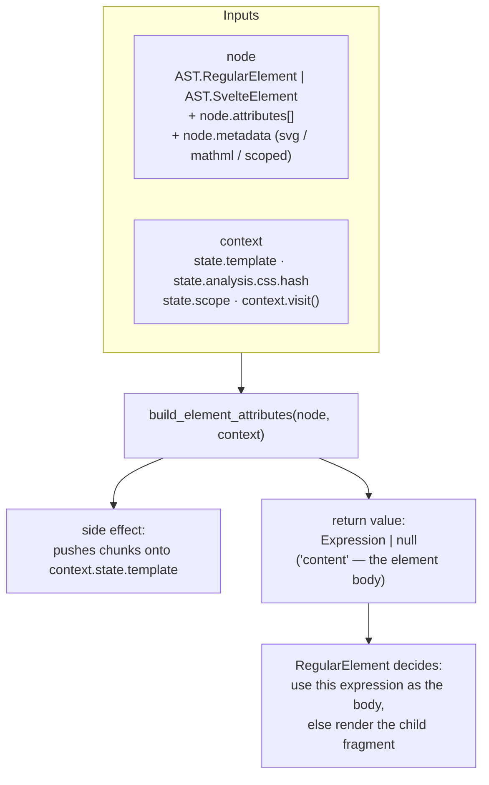
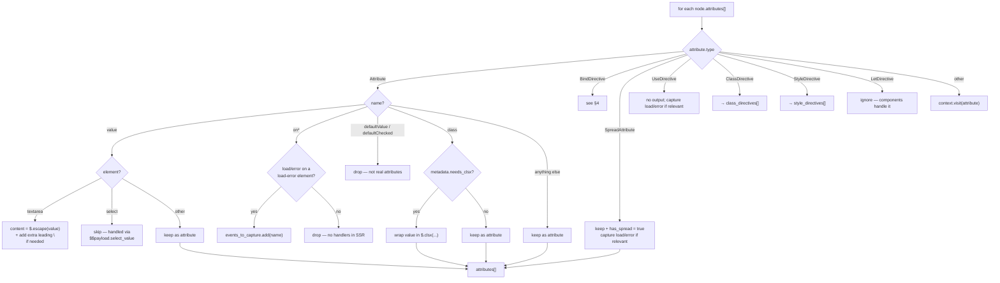
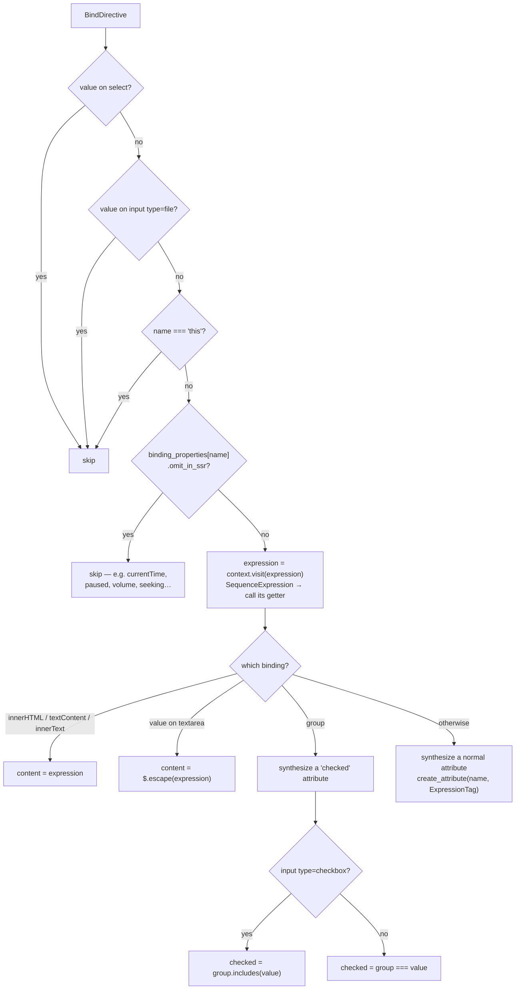
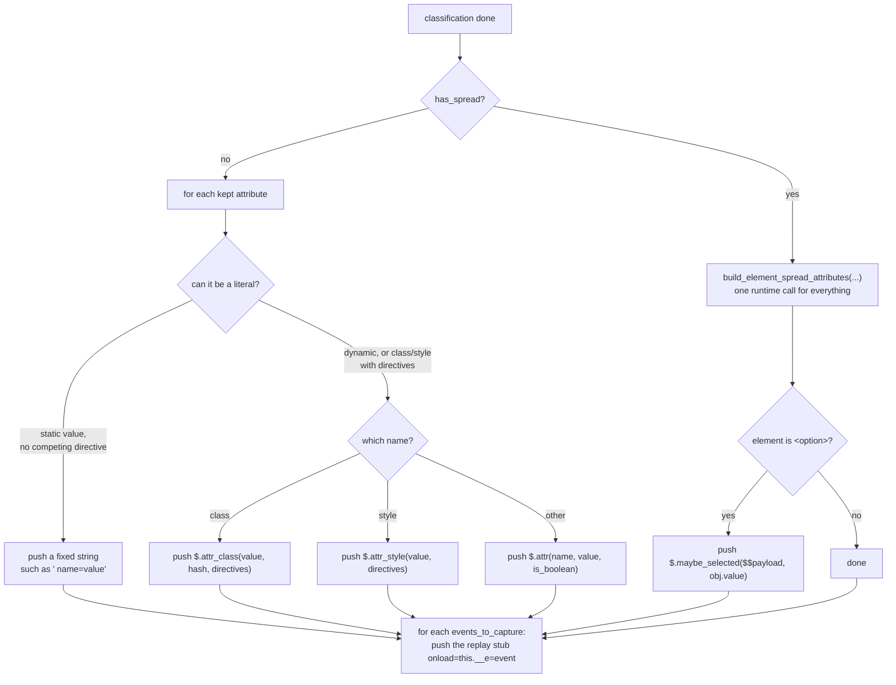
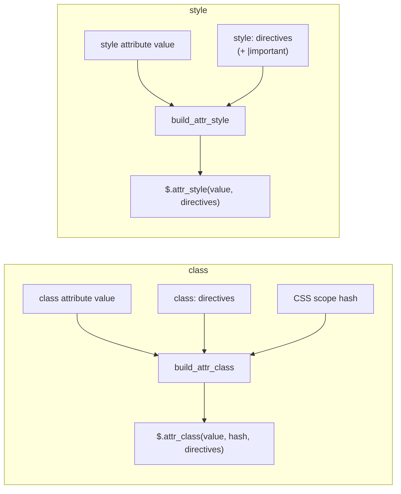
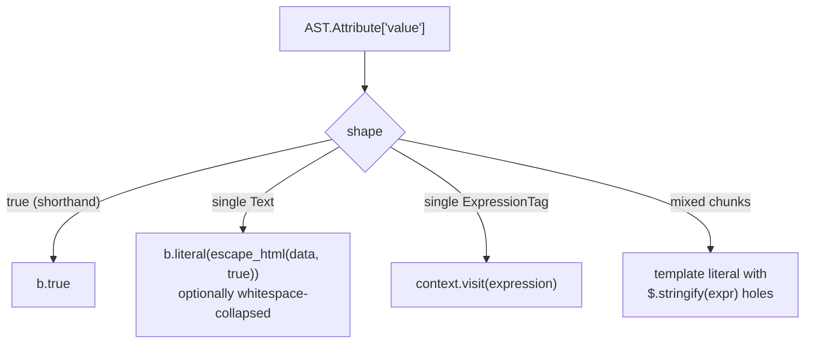
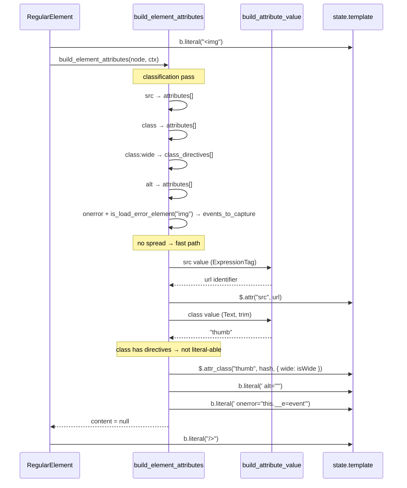
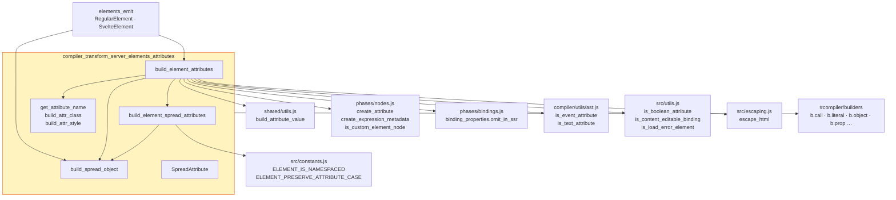

# compiler_transform_server_elements_attributes

## Introduction

This module is the part of the server (SSR) compiler that turns **everything written inside an element's opening tag** into code that prints an HTML attribute string.

Given source like this:

```svelte
<a href="/x" class="btn" class:active={selected} style:color={c} {...rest} bind:this={el}>go</a>
```

…something has to decide: which of those become real HTML attributes, which are dropped on the server, which can be baked into a fixed string at compile time, and which need a runtime helper call. That decision is this module.

| Component | File | Role |
| --- | --- | --- |
| `build_element_attributes` | `server/visitors/shared/element.js` | Main entry. Sorts every attribute-ish node, then emits attribute output. Returns an optional **content expression**. |
| `build_element_spread_attributes` | `server/visitors/shared/element.js` | The "give up and do it at runtime" path — emits one `$.spread_attributes(...)` call. |
| `build_spread_object` | `server/visitors/shared/element.js` | Builds the merged props object literal handed to `$.spread_attributes` (also reused for `<select>` / `<option>`). |
| `SpreadAttribute` | `server/visitors/SpreadAttribute.js` | Tiny visitor: a `{...spread}` node simply becomes its inner expression. |

Private helpers in the same file: `get_attribute_name`, `build_attr_class`, `build_attr_style`.

The callers are `RegularElement` and `SvelteElement`, documented in [compiler_transform_server_elements_emit](compiler_transform_server_elements_emit.md). The DOM-side twin of this module is [compiler_transform_client_elements_attributes](compiler_transform_client_elements_attributes.md).

---

## 1. Where this module sits

```mermaid
flowchart LR
    SRC[".svelte source"] --> P1["Phase 1: parse<br/>compiler_parse"]
    P1 --> P2["Phase 2: analyze<br/>compiler_analyze"]
    P2 --> SW{"generate option"}
    SW -->|"'client'"| CT["compiler_transform_client"]
    SW -->|"'server'"| ST["compiler_transform_server"]

    ST --> CORE["compiler_transform_server_core"]
    CORE --> ELEM["compiler_transform_server_elements"]
    ELEM --> EMIT["elements_emit<br/>RegularElement · SvelteElement"]
    EMIT --> ATTR["elements_attributes<br/>build_element_attributes"]
    ELEM --> SPEC["elements_special"]

    ATTR --> OUT["template chunks →<br/>$$payload.out.push(...)"]
    OUT -.->|"at request time"| RT["server_runtime<br/>$.attr · $.attr_class · $.attr_style<br/>$.spread_attributes · $.maybe_selected"]

    style ATTR fill:#ffd8a8,stroke:#e8590c,stroke-width:2px
```



Related docs: [compiler_transform_server](compiler_transform_server.md) · [compiler_transform_server_core_template](compiler_transform_server_core_template.md) · [compiler_transform_server_elements](compiler_transform_server_elements.md) · [server_runtime](server_runtime.md) · [compiler_ast_types](compiler_ast_types.md)

---

## 2. What it is given, what it gives back



Two things come out:

1. **A side effect.** Attribute text and helper calls are pushed onto `context.state.template`. The core template builder later folds them into `$$payload.out.push(...)`. See [compiler_transform_server_core_template](compiler_transform_server_core_template.md).
2. **A return value called `content`.** Some attributes are really *body content* on the server, not attributes: `<textarea value={x}>`, `bind:value` on a textarea, and `bind:innerHTML` / `bind:textContent` / `bind:innerText`. In those cases the function returns the expression, and `RegularElement` emits `if (content) print content else print children`.

---

## 3. The classification pass

`build_element_attributes` first loops once over `node.attributes` and drops each node into a bucket. Nothing is printed during this loop except a few side branches.



Notes on the odd cases:

- **`<textarea value>` and the extra newline.** HTML swallows one newline right after `<textarea>`, so a leading newline in the value is duplicated (`'\n' + data`) to survive the round trip. Matches the rule in the [analysis phase](compiler_analyze.md).
- **`<select value>` is skipped** because the `value` *attribute* has no meaning on `<select>`; only the property does. The selected option is chosen instead through `$$payload.select_value` in `RegularElement`.
- **Event attributes are dropped** — there is no DOM on the server. The exception is `onload` / `onerror` on elements that can fire them (`img`, `script`, `iframe`, …, via `is_load_error_element`). Those are re-emitted as the literal ` onload="this.__e=event"` so the event can be **replayed** after hydration. A spread or a `use:` action on such an element also triggers the capture, because the compiler cannot tell whether a handler is hiding in there.
- **`needs_clsx`** is metadata set during analysis; it means the `class` value may be an object/array and must go through `clsx`.
- **`LetDirective`** belongs to components — see [compiler_transform_server_components](compiler_transform_server_components.md).

---

## 4. Bindings on the server

A `bind:` directive has no two-way behaviour during SSR. It only matters for the *initial* HTML, so each binding is either dropped or rewritten into a plain attribute.



Key points:

- `binding_properties` (`phases/bindings.js`) carries the `omit_in_ssr` flag. Media bindings (`currentTime`, `duration`, `paused`, `volume`, …) are all runtime-only, so they vanish.
- `bind:this` has no HTML meaning.
- A **`SequenceExpression`** expression means the binding was written as a get/set pair (`bind:x={() => a, (v) => a = v}`); the server only needs the getter, so it calls `expressions[0]`.
- **`bind:group`** is rewritten into a `checked` attribute by comparing the group value with the element's own `value` attribute — `includes()` for checkboxes, `===` for radios. If there is no `value` attribute, nothing is emitted.
- Synthesized attributes are created with `create_attribute(name, -1, -1, [...])` and `create_expression_metadata()` from `phases/nodes.js`. The `-1` positions mark them as compiler-generated (no source location).

---

## 5. Two output strategies

After classification the function branches once, on `has_spread`.



### 5.1 The fast path (no spread)

The goal here is to write as much of the tag as a **plain string constant**, so SSR does almost no work.

`can_use_literal` is true when the attribute is not fighting with a directive — `class` is not literal-able if there are `class:` directives, and `style` is not literal-able if there are `style:` directives, because those need merging at runtime.

Three things happen in order:

1. **Fully static value** (`value === true` or a single `Text` chunk). The chunk is turned into a literal by `build_attribute_value`, then printed inline:
   - boolean attributes with a `true` value print just the name (` disabled`), because `is_boolean_attribute(name)` says the value is meaningless;
   - the scoped-CSS hash is appended to `class` here (`"btn svelte-1abcde"`);
   - an empty `class` is skipped entirely, so you never get `class=""`.
2. **Dynamic value that still evaluates to a literal string** — pre-escaped with `escape_html(value, true)` and inlined too.
3. **Everything else** becomes one of the three runtime helpers (`$.attr`, `$.attr_class`, `$.attr_style`).

`WHITESPACE_INSENSITIVE_ATTRIBUTES = ['class', 'style']` makes `build_attribute_value` collapse runs of whitespace and trim, which keeps generated markup small for multi-line class lists.

`get_attribute_name` lower-cases the name for HTML elements but leaves SVG and MathML names alone (`viewBox` must stay camelCase). Boolean aliases are deliberately *not* resolved here, because the runtime helper only checks lowercase names.

**`<option value>`** additionally pushes `$.maybe_selected($$payload, value)`, which compares against the `select_value` that `RegularElement` set on the payload and prints ` selected` on a match.

### 5.2 The spread path

Once a `{...spread}` exists, the compiler no longer knows the attribute names, so it hands the whole thing to the runtime:

```js
$.spread_attributes(object, css_hash, classes, styles, flags)
```

`build_element_spread_attributes` assembles those five arguments:

| Argument | Built from | Notes |
| --- | --- | --- |
| `object` | `build_spread_object(...)` | Object literal of every attribute / binding, with spreads as `...` properties, so later keys win — same precedence as the source order. |
| `css_hash` | `element.metadata.scoped && analysis.css.hash` | `b.null` when the element is not scoped. |
| `classes` | `class:` directives → `{ name: expression }` | Shorthand `class:foo` reuses the identifier `foo`. |
| `styles` | `style:` directives → `{ name: expression }` | Split into `[normal, important]` when any directive has the `important` modifier. |
| `flags` | bit flags | `ELEMENT_IS_NAMESPACED` for SVG/MathML, `ELEMENT_PRESERVE_ATTRIBUTE_CASE` for SVG/MathML and custom elements. |

`build_spread_object` is also called directly by `RegularElement` for `<select>` and `<option>`, to read `.value` out of the merged object when the value is buried inside a spread.

`SpreadAttribute` (the visitor) is the trivial glue: `{...expr}` returns `context.visit(node.expression)`, so the transformed expression can be dropped into a `b.spread(...)` property.

---

## 6. class and style get special treatment

`class` and `style` are the only attributes that can be assembled from more than one source, so they have their own builders.



- **`build_attr_class`** turns directives into `{ "name": expression }`. If the base value is already a literal string, the hash is *concatenated at compile time* and no `hash` argument is passed — a small but free saving. Otherwise the hash goes through as a third argument.
- **`build_attr_style`** lower-cases property names, but leaves custom properties (`--my-var`) untouched. Directives with the `important` modifier are put in a **second** object, and the pair is passed as an array `[normal, important]`; the runtime then knows which ones need `!important`.
- The runtime helpers return `''` when the result is empty, so no stray `class=""` / `style=""` shows up in the HTML.

---

## 7. Value building

All value flattening is delegated to `build_attribute_value` in `server/visitors/shared/utils.js`, part of [compiler_transform_server_core_template](compiler_transform_server_core_template.md).



The `trim_whitespace` flag is what this module passes for `class` / `style`. The fourth parameter, `is_component`, is **not** used here — it skips escaping for props passed to components, which only matters in [compiler_transform_server_components](compiler_transform_server_components.md).

Escaping therefore happens in one of three places, never twice:

| Path | Who escapes |
| --- | --- |
| Static literal baked into the tag | `build_attribute_value` / `escape_html` at compile time |
| `$.attr` / `$.attr_class` / `$.attr_style` | The runtime helper |
| `$.spread_attributes` | The runtime helper, per key |

---

## 8. End-to-end example

Source:

```svelte

```



Roughly what the generated SSR code prints:

```js
$$payload.out.push(
  ``
);
```

Add a `{...rest}` to the source and the whole opening tag collapses into a single call instead:

```js
$$payload.out.push(
  ``
);
```

---

## 9. Dependencies



| Direction | Module | Why |
| --- | --- | --- |
| Callers | [compiler_transform_server_elements_emit](compiler_transform_server_elements_emit.md) | The only two callers of `build_element_attributes`. |
| Value building / buffer | [compiler_transform_server_core_template](compiler_transform_server_core_template.md) | `build_attribute_value`, `build_template`, `process_children`. |
| Program shape | [compiler_transform_server_core_program](compiler_transform_server_core_program.md) | Provides `$$payload`, `state.analysis`, the visitor table. |
| Runtime target | [server_runtime](server_runtime.md) | `$.attr_class`, `$.attr_style`, `$.spread_attributes`, `$.maybe_selected`, `$.stringify`, `$.escape`. |
| Metadata source | [compiler_analyze](compiler_analyze.md) | `metadata.scoped`, `metadata.needs_clsx`, `metadata.svg` / `mathml`, CSS hash. |
| AST shapes | [compiler_ast_types](compiler_ast_types.md) | `Attribute`, `SpreadAttribute`, `BindDirective`, `ClassDirective`, `StyleDirective`. |
| DOM counterpart | [compiler_transform_client_elements_attributes](compiler_transform_client_elements_attributes.md) | Same job for the browser. |
| Builders | [compiler_core](compiler_core.md) | The `b.*` ESTree builders. |

---

## 10. Server vs client, side by side

The two attribute transforms solve the same problem with opposite constraints.

| | Server (this module) | Client ([client elements_attributes](compiler_transform_client_elements_attributes.md)) |
| --- | --- | --- |
| Output | A string, printed once | Imperative DOM calls, re-run on change |
| Reactivity | None — one snapshot | Effects, memoized values, dirty checks |
| Event handlers | Dropped, except captured `onload` / `onerror` | Attached (often delegated) |
| Bindings | Rewritten into initial attributes, or dropped when `omit_in_ssr` | Full two-way wiring |
| Spread | One `$.spread_attributes(...)` call | `attribute_effect(...)` that diffs across updates |
| `class` / `style` | `$.attr_class` / `$.attr_style` returning strings | `build_set_class` / `build_set_style` mutating the element |

Because both sides must agree on the *first* rendering, small mismatches here become hydration errors. That is why oddities like the `<textarea>` newline duplication, the empty-`class` skip, and the `bind:group` → `checked` rewrite live in this module.

---

## 11. Quick reference

| Symbol | Kind | Signature (informal) |
| --- | --- | --- |
| `build_element_attributes` | exported | `(node, context) => Expression \| null` |
| `build_element_spread_attributes` | module-private | `(element, attributes, style_directives, class_directives, context) => void` |
| `build_spread_object` | exported | `(element, attributes, context) => ObjectExpression` |
| `SpreadAttribute` | exported visitor | `(node, context) => Expression` |
| `get_attribute_name` | private | `(element, attribute) => string` |
| `build_attr_class` | private | `(class_directives, expression, context, hash) => CallExpression` |
| `build_attr_style` | private | `(style_directives, expression, context) => CallExpression` |

Constants: `WHITESPACE_INSENSITIVE_ATTRIBUTES = ['class', 'style']`.

> Note: `build_element_spread_attributes` is listed as a core component of this module but is not actually exported from the file — it is reached only through `build_element_attributes`.
