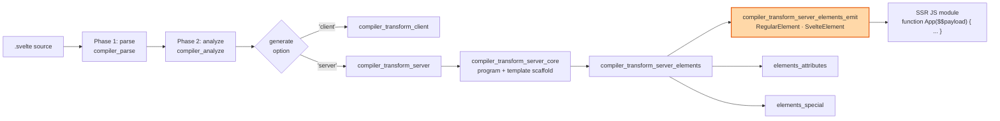
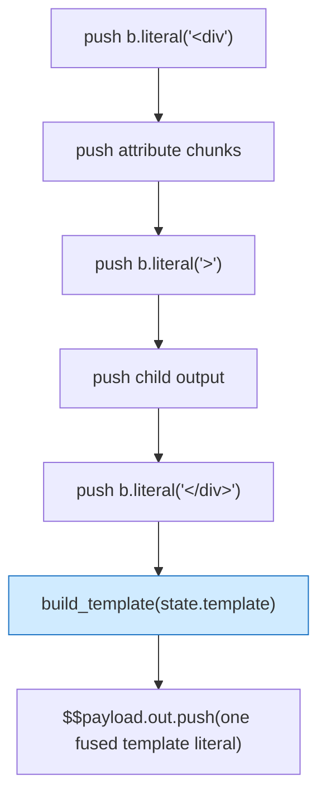
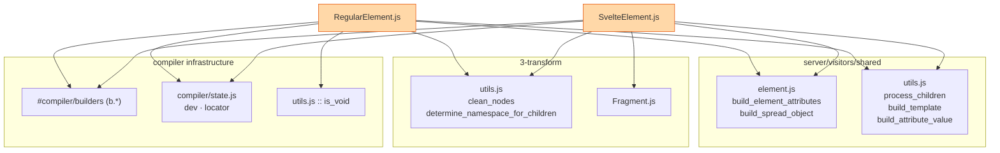
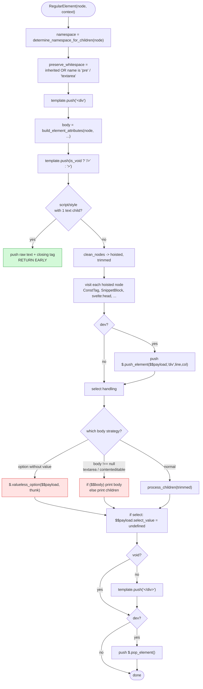
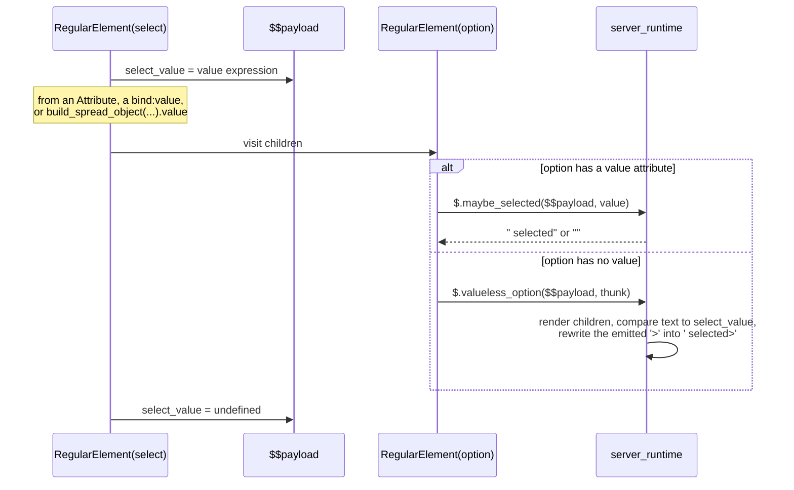
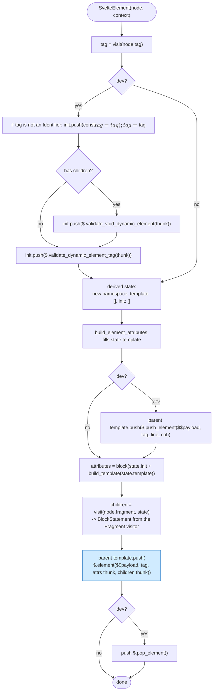
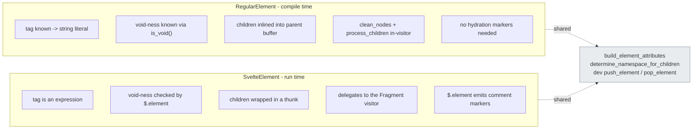

# compiler_transform_server_elements_emit

## Introduction

This module holds the two visitors that turn a Svelte **element node** into **server-side HTML output code**.

- `RegularElement` handles normal tags you write by name — `<div>`, `<select>`, `<option>`, `<textarea>`, `<script>`.
- `SvelteElement` handles `<svelte:element this={tag}>`, where the tag name is only known at run time.

Both are the "emit" step: they decide *what strings and calls get pushed into the SSR template buffer* so that, when the compiled component function runs on the server, it writes correct HTML into `$$payload.out`.

They do **not** deal with attribute values themselves — that job belongs to [compiler_transform_server_elements_attributes](compiler_transform_server_elements_attributes.md). They do **not** deal with `<svelte:head>`, `<title>`, or `<svelte:fragment>` — see [compiler_transform_server_elements_special](compiler_transform_server_elements_special.md).

| Component | File | Input node | Output strategy |
| --- | --- | --- | --- |
| `RegularElement` | `server/visitors/RegularElement.js` | `AST.RegularElement` | Mostly **static strings** baked at compile time |
| `SvelteElement` | `server/visitors/SvelteElement.js` | `AST.SvelteElement` | A **runtime call** to `$.element(...)` |

---

## 1. Where this module sits

The compiler runs in three phases. This module is a leaf inside phase 3, on the server branch.



Related docs: [compiler_transform_server](compiler_transform_server.md) · [compiler_transform_server_core](compiler_transform_server_core.md) · [compiler_transform_client_elements](compiler_transform_client_elements.md) (the DOM-side twin) · [server_runtime](server_runtime.md) (the helpers that get called).

---

## 2. The mental model: a template buffer

Every server visitor writes into `state.template`, an array that mixes two kinds of things:

- **Expressions** (`b.literal('<div')`, a template literal, a call to `$.attr(...)`) → these become *text to print*.
- **Statements** (`b.stmt(...)`, `b.if(...)`) → these become *code to run*.

At the end, `build_template()` (from [compiler_transform_server_core_template](compiler_transform_server_core_template.md)) folds that array into real JS: neighbouring text is merged into one `$$payload.out.push(...)` call, and statements break the run.



The big win: because the tag name of a `RegularElement` is a compile-time constant, almost all of the markup collapses into **one string literal**. That is why SSR in Svelte is fast.

---

## 3. Dependency map



| Dependency | Provided by | Used for |
| --- | --- | --- |
| `build_element_attributes` | [elements_attributes](compiler_transform_server_elements_attributes.md) | Pushes all attribute text; returns a *body override* expression or `null` |
| `build_spread_object` | [elements_attributes](compiler_transform_server_elements_attributes.md) | Builds one object literal from mixed `Attribute`/`Bind`/`Spread`, used to read `.value` for `<select>` |
| `process_children` | [core_template](compiler_transform_server_core_template.md) | Fuses text/comment/`{expr}` runs into template literals, recurses into other nodes |
| `build_template` | [core_template](compiler_transform_server_core_template.md) | Turns the buffer into `$$payload.out.push(...)` statements |
| `build_attribute_value` | [core_template](compiler_transform_server_core_template.md) | Turns an attribute value array into a single expression |
| `clean_nodes` | [compiler_core](compiler_core.md) | Splits children into `hoisted` vs `trimmed`, applies whitespace/comment rules |
| `determine_namespace_for_children` | [compiler_core](compiler_core.md) | Picks `html` / `svg` / `mathml` for descendants |
| `b.*` builders | [compiler_core](compiler_core.md) | ESTree node construction |
| `dev`, `locator` | [compiler_core](compiler_core.md) | Dev-only line/column for `$.push_element` |

---

## 4. `RegularElement`

### 4.1 Full flow



### 4.2 Step notes

**Namespace and whitespace state.** The visitor builds a *derived* state object rather than mutating `context.state`. Children of `<pre>` and `<textarea>` keep their whitespace; everything else inherits. `<foreignObject>` flips back to `html`, `svg`/`mathml` metadata flips into those namespaces.

**Opening tag.** Two literals bracket the attributes: `<div` goes in before `build_element_attributes`, and `>` (or `/>` for void elements, for XHTML compliance) goes in after. Note these are pushed onto **`context.state.template`**, not the derived `state` — the tag markup belongs to the parent's buffer, while children output uses the derived state.

**Raw-text fast path.** A `<script>` or `<style>` whose fragment is exactly one text node is emitted verbatim, with no escaping and no child processing, then the function returns. This preserves JS/CSS source exactly.

**`clean_nodes`.** Children are split:

- `hoisted` — `ConstTag`, `DebugTag`, `SnippetBlock`, `SvelteHead`, `TitleElement`, `SvelteWindow`/`Body`/`Document`. These are visited first so their declarations exist before the markup that uses them.
- `trimmed` — real markup, with whitespace collapsed and comments dropped unless `preserveComments` is on.

**Dev instrumentation.** In dev builds, `$.push_element` / `$.pop_element` bracket the element so the runtime can validate HTML nesting (`<p>` inside `<p>`, `<td>` outside `<tr>`, ...) and report a `file:line:column`. See [server_runtime](server_runtime.md).

### 4.3 The `<select>` / `<option>` protocol

SSR cannot set a DOM `value` property, so `selected` must be computed while writing. The two visitors cooperate through a scratch field on the payload, `$$payload.select_value`.



Three source shapes are recognised on `<select>`:

| Source | Emitted assignment |
| --- | --- |
| Has any `SpreadAttribute` | `select_value = ({...spread}).value` via `build_spread_object` |
| `value="..."` attribute | `select_value = build_attribute_value(...)` |
| `bind:value={x}` | `select_value = x` (or `getter()` if the binding is a get/set sequence pair) |

The `select_value` reset at the end is essential — nested selects and sibling markup must not inherit a stale value.

The `<option>` side lives partly here (`valueless_option`, when the option has no `value` and no spread) and partly in the attributes module (`maybe_selected`, when it does).

### 4.4 The "body override" branch

`build_element_attributes` returns a non-`null` expression when the element's content is really driven by an attribute or binding rather than by its children:

- `<textarea value={x}>` or `<textarea bind:value={x}>` → content is `$.escape(x)`
- `bind:innerHTML` / `bind:textContent` / `bind:innerText` → content is that expression

In that case the visitor renders **both** paths and picks at run time:

```js
// conceptually
const $$body = <body expression>;
if ($$body) {
    $$payload.out.push(`${$$body}`);
} else {
    $$payload.out.push(`<default children>`);
}
```

The children are rendered into an isolated `inner_state` (`template: []`, `init: []`) so that their output does not leak into the outer buffer. If the body expression is not already an `Identifier`, it is bound to a generated `$$body` const first, so it is evaluated only once.

---

## 5. `SvelteElement`

Because the tag is an arbitrary expression, nothing about the markup can be baked in. Everything is handed to the runtime helper `$.element`.



### 5.1 Generated shape

```js
$.element(
    $$payload,
    tag,
    () => { $$payload.out.push(` class="x"`); },   // attributes thunk, omitted if empty
    () => { $$payload.out.push(`hello`); }         // children thunk, omitted if empty
);
```

The runtime `$.element` (see [server_runtime](server_runtime.md)) then:

1. writes a `<!---->` hydration marker,
2. if `tag` is truthy, writes `<tag`, runs the attributes thunk, writes `>`,
3. if the tag is **not void**, runs the children thunk, adds an empty comment for non-raw-text tags, and writes `</tag>`,
4. writes a closing `<!---->` marker.

So void-ness, and the falsy-tag "render nothing" case, are decided at run time — the opposite of `RegularElement`, where both are decided at compile time.

### 5.2 Dev-only guards

| Guard | Condition | Purpose |
| --- | --- | --- |
| `$$tag` const | `tag` is not a plain identifier | Avoids calling a getter or function twice, since `tag` is referenced by several guards |
| `$.validate_void_dynamic_element` | Element has children | Warns if a void tag (`br`, `img`) is given content |
| `$.validate_dynamic_element_tag` | Always | Errors if `this` resolves to a non-string, non-nullish value |

These land in `context.state.init`, so they run *before* the element is written.

### 5.3 Children

Unlike `RegularElement`, `SvelteElement` does not call `clean_nodes` / `process_children` itself. It delegates the whole fragment to the `Fragment` visitor ([compiler_transform_server_core_template](compiler_transform_server_core_template.md)), which returns a ready-made `BlockStatement`. That block becomes the children thunk.

---

## 6. Side-by-side comparison



| Concern | `RegularElement` | `SvelteElement` |
| --- | --- | --- |
| Tag emission | `b.literal('<div')` | `$.element($$payload, tag, ...)` |
| Void elements | `/>` inlined at compile time | Runtime `is_void(tag)` check |
| Attributes buffer | Pushed straight into the parent's `template` | Collected into a private buffer, wrapped in a thunk |
| Children | `process_children` on `trimmed` | Whole `fragment` visited → `BlockStatement` |
| Hoisted nodes | Visited explicitly by this visitor | Handled inside the `Fragment` visitor |
| `<select>` / `<option>` specials | Yes | No |
| Body override (`textarea`, contenteditable) | Yes | No (return value of `build_element_attributes` is ignored) |
| Falsy tag | N/A | Renders only the markers |

---

## 7. Worked examples

### 7.1 Plain element

```svelte
<div class="card">{title}</div>
```

```js
$$payload.out.push(`<div class="card">${$.escape(title)}</div>`);
```

One buffer entry — the literals, attribute text, and escaped expression all fuse.

### 7.2 Select with bound value

```svelte
<select bind:value={colour}>
  <option>red</option>
</select>
```

```js
$$payload.out.push(`<select>`);
$$payload.select_value = colour;
$.valueless_option($$payload, () => {
    $$payload.out.push(`<option>red</option>`);
});
$$payload.select_value = undefined;
$$payload.out.push(`</select>`);
```

### 7.3 Textarea body override

```svelte
<textarea value={draft}>fallback</textarea>
```

```js
$$payload.out.push(`<textarea>`);
const $$body = $.escape(draft);
if ($$body) {
    $$payload.out.push(`${$$body}`);
} else {
    $$payload.out.push(`fallback`);
}
$$payload.out.push(`</textarea>`);
```

### 7.4 Dynamic element

```svelte
<svelte:element this={tag} class="x">hi</svelte:element>
```

```js
$.element(
    $$payload,
    tag,
    () => { $$payload.out.push(` class="x"`); },
    () => { $$payload.out.push(`hi`); }
);
```

---

## 8. Invariants and gotchas for maintainers

1. **Two buffers, two meanings.** `context.state.template` is the caller's buffer; the locally derived `state.template` carries the child-scoped namespace and whitespace rules. Mixing them up produces markup in the wrong order. `RegularElement` deliberately pushes the opening/closing tag literals onto `context.state.template` while children go through the derived `state`.

2. **Statements vs expressions.** Anything pushed with `b.stmt(...)` / `b.if(...)` becomes a real statement and *breaks* the string fusion in `build_template`. Prefer expressions when a value is just being printed — that is what keeps output compact.

3. **Always reset `select_value`.** It is a single mutable slot on the payload. Forgetting the reset makes options in later markup wrongly `selected`.

4. **Evaluate dynamic tags once.** `SvelteElement` memoises non-identifier tags in dev because it references `tag` three or four times. The comment in the source is a standing warning: if prod ever references it more than once, hoist the memoisation out of the `dev` branch.

5. **Hoisted-first ordering.** `clean_nodes` hoists `ConstTag` and `SnippetBlock`; those must be visited before `process_children`, otherwise the markup references bindings that do not exist yet.

6. **The raw-text early return skips everything after it** — no dev instrumentation, no children processing. Only reachable for `<script>`/`<style>` with a single text child.

---

## 9. See also

- [compiler_transform_server_elements_attributes](compiler_transform_server_elements_attributes.md) — `build_element_attributes`, spreads, class/style directives, `maybe_selected`
- [compiler_transform_server_elements_special](compiler_transform_server_elements_special.md) — `<svelte:head>`, `<title>`, `<svelte:fragment>`
- [compiler_transform_server_core_template](compiler_transform_server_core_template.md) — `Fragment`, `process_children`, `build_template`
- [compiler_transform_server_core_program](compiler_transform_server_core_program.md) — how the component function and `$$payload` are assembled
- [compiler_transform_server_blocks](compiler_transform_server_blocks.md) — `{#if}`, `{#each}`, `{@html}` inside these elements
- [compiler_transform_server_components](compiler_transform_server_components.md) — child components and slots
- [compiler_transform_client_elements](compiler_transform_client_elements.md) — the DOM-generating counterpart
- [server_runtime](server_runtime.md) — `$.element`, `$.valueless_option`, `$.maybe_selected`, `$.escape`, `$.push_element`
- [compiler_ast_types](compiler_ast_types.md) — `AST.RegularElement`, `AST.SvelteElement` node shapes
- [compiler_core](compiler_core.md) — builders, `clean_nodes`, `determine_namespace_for_children`, `dev`/`locator`
