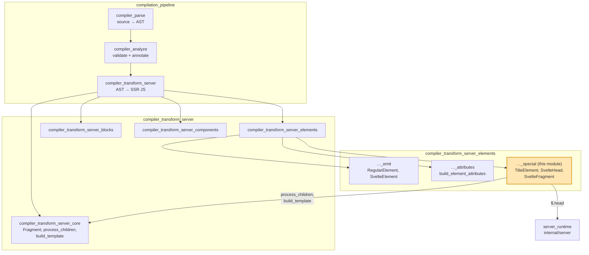
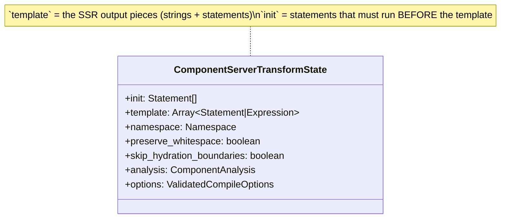
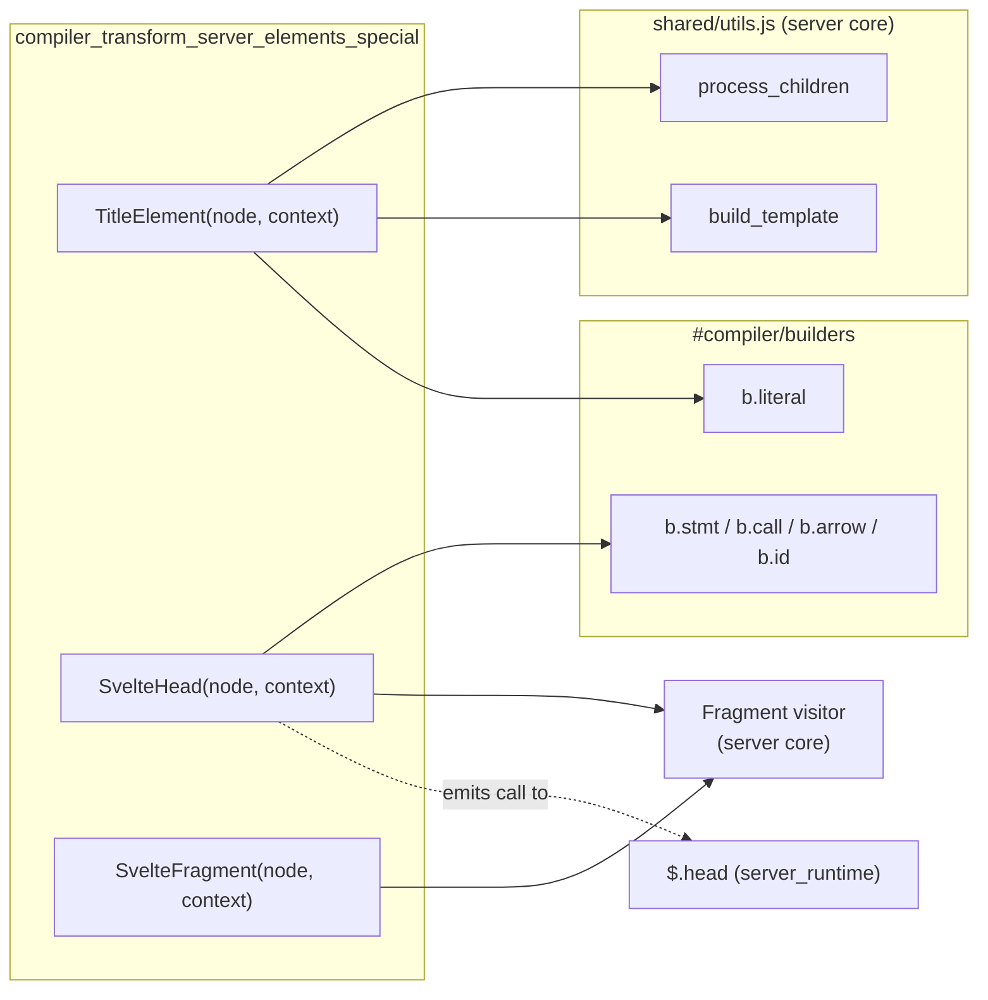
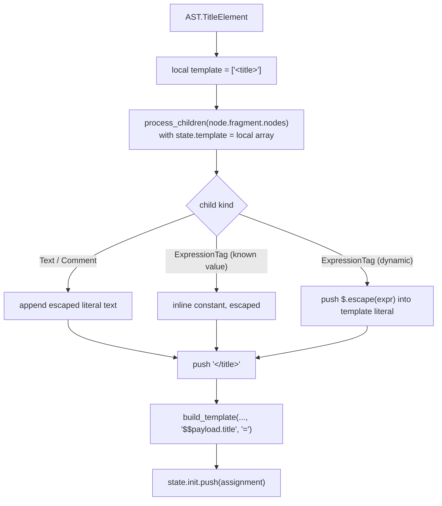
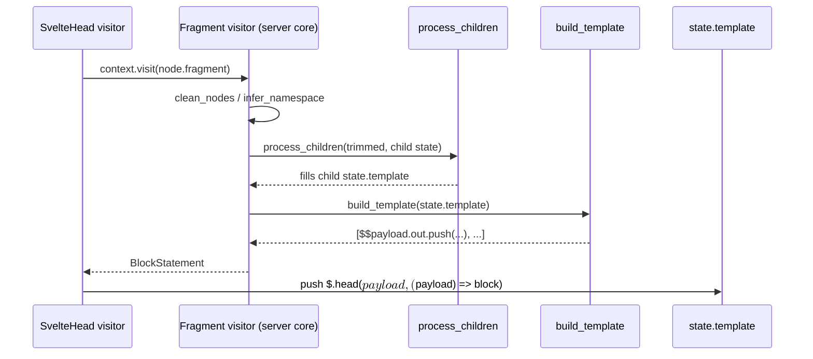
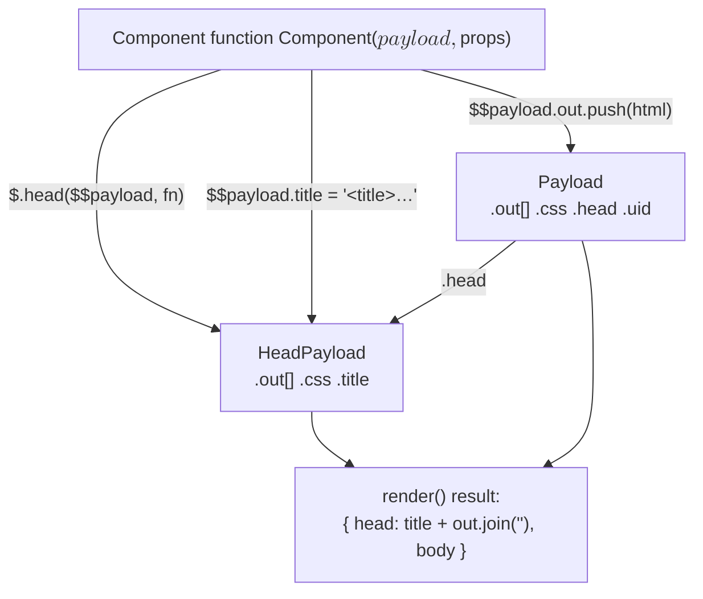
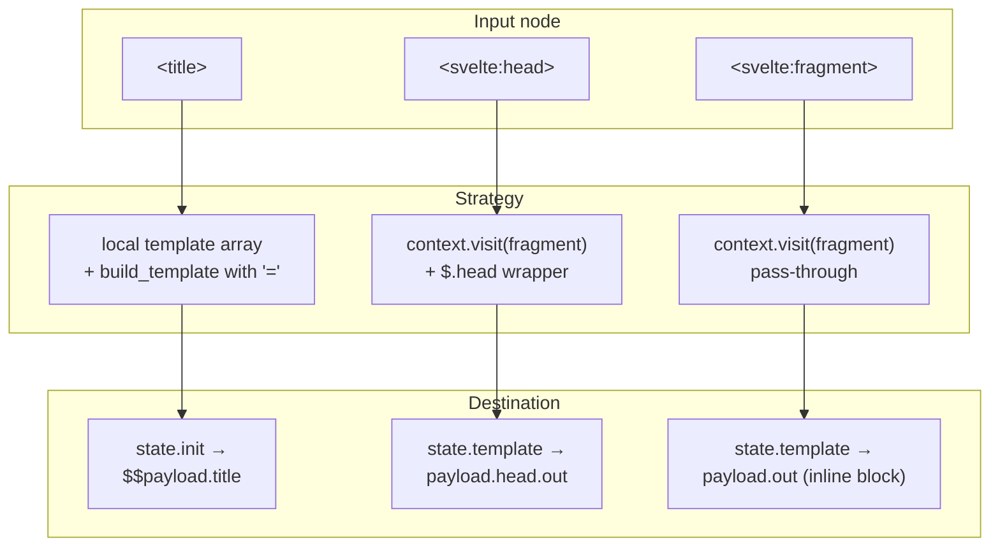
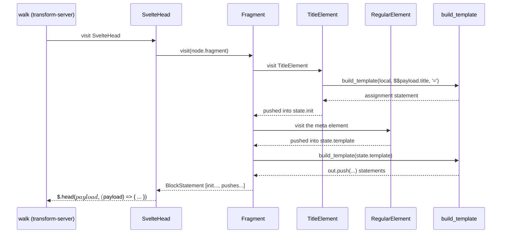

# compiler_transform_server_elements_special

## Introduction

This module holds three small server-side transform visitors. Each one handles a Svelte
template node that is **not** a normal HTML element, but still lives in the element part of
the tree:

| Node | Visitor file | What it means in a `.svelte` file |
| --- | --- | --- |
| `TitleElement` | `server/visitors/TitleElement.js` | `<title>...</title>` |
| `SvelteHead` | `server/visitors/SvelteHead.js` | `<svelte:head>...</svelte:head>` |
| `SvelteFragment` | `server/visitors/SvelteFragment.js` | `<svelte:fragment slot="x">...</svelte:fragment>` |

They are "special" because they do **not** emit an open tag / attributes / close tag the way
[`compiler_transform_server_elements_emit`](compiler_transform_server_elements_emit.md) does.
Instead each one changes *where* the output goes:

- `<title>` writes to a **separate slot** on the payload (`$$payload.title`), not to the HTML stream.
- `<svelte:head>` writes to a **different output buffer** (the head payload), through a runtime call.
- `<svelte:fragment>` writes **nothing of its own** — it only passes its children through, wrapped in a JS block.

All three are tiny on purpose. The real work is delegated to shared helpers described in
[`compiler_transform_server_core`](compiler_transform_server_core.md).

---

## Where this module sits



Related docs:

- [`compiler_transform_server_core`](compiler_transform_server_core.md) — the `Fragment` visitor, `process_children`, `build_template`, and the transform state.
- [`compiler_transform_server_elements`](compiler_transform_server_elements.md) — the parent group.
- [`compiler_transform_client_elements_special`](compiler_transform_client_elements_special.md) — the client-side counterpart (same node types, DOM output instead of strings).
- [`compiler_analyze_special_elements`](compiler_analyze_special_elements.md) — the validation that runs *before* this module.
- [`server_runtime`](server_runtime.md) — the `$.head` helper and the payload objects.
- [`compiler_ast_types`](compiler_ast_types.md) — `AST.TitleElement`, `AST.SvelteHead`, `AST.SvelteFragment`.

---

## Shared context: the server transform state

Every visitor here receives a `ComponentContext`, whose `state` is a
`ComponentServerTransformState` (see [`compiler_transform_server_core`](compiler_transform_server_core.md)).
Two fields matter for this module:



- **`state.template`** — an ordered list of literals, expressions and statements. `build_template`
  later folds the string-ish pieces into `` $$payload.out.push(`...`) `` calls.
- **`state.init`** — statements hoisted in front of the template of the current fragment.
  `TitleElement` uses this so the title assignment does not land in the middle of the HTML stream.

---

## Component overview



Notice the split:

- `TitleElement` builds its own **local** template array and finalises it itself with `build_template`.
- `SvelteHead` and `SvelteFragment` both call `context.visit(node.fragment)`, which reaches the
  `Fragment` visitor and gives back a ready-made `BlockStatement`.

---

## 1. `TitleElement`

Handles `<title>My page</title>`.

### Source shape

```javascript
export function TitleElement(node, context) {
        // title is guaranteed to contain only text/expression tag children
        const template = [b.literal('<title>')];
        process_children(node.fragment.nodes, { ...context, state: { ...context.state, template } });
        template.push(b.literal('</title>'));

        context.state.init.push(...build_template(template, b.id('$$payload.title'), '='));
}
```

### How it works

1. It starts a **fresh, local `template` array** — the title must not be mixed into the
   surrounding HTML stream, so the visitor deliberately does not use `context.state.template`.
2. It calls `process_children` with a shallow-copied state whose `template` points at the local
   array. `process_children` escapes text, folds known constant expressions, and wraps unknown
   expressions in `$.escape(...)`.
3. It wraps the result in literal `<title>` / `</title>` strings.
4. `build_template(template, b.id('$$payload.title'), '=')` turns the pieces into a single
   **assignment** instead of the usual `out.push(...)`. The result looks like:

   ```js
   $$payload.title = `<title>${$.escape(name)}</title>`;
   ```

5. The statement is pushed into **`state.init`**, not `state.template`, so it runs before the
   surrounding markup is emitted.

### Why an assignment, not a push?

`title` is a single string field on `HeadPayload`, not an array. Using `=` means the **last**
`<title>` rendered wins, which matches how a browser treats a document title. Compare with
`$$payload.out.push(...)`, which appends.



### The `$$payload` that gets assigned

`b.id('$$payload.title')` is a raw identifier with a dot in its name — the code printer emits it
verbatim. This matters because `$$payload` is resolved **lexically**:

- `<title>` is only valid inside `<svelte:head>` (enforced during analysis).
- `SvelteHead` emits `b.arrow([b.id('$$payload')], block)`, so inside that block `$$payload` is the
  **head payload**.
- Therefore `$$payload.title` resolves to `HeadPayload.title` at runtime, not the outer payload.

### Guarantees from the analysis phase

`TitleElement` has the comment *"title is guaranteed to contain only text/expression tag children"*.
That guarantee comes from the analyze visitor in
[`compiler_analyze_special_elements`](compiler_analyze_special_elements.md):

```javascript
// phases/2-analyze/visitors/TitleElement.js
for (const attribute of node.attributes) e.title_illegal_attribute(attribute);
for (const child of node.fragment.nodes) {
        if (child.type !== 'Text' && child.type !== 'ExpressionTag') e.title_invalid_content(child);
}
```

So the transform needs **no attribute handling and no block handling** — a good example of how
analysis keeps the transform visitors small.

---

## 2. `SvelteHead`

Handles `<svelte:head> ... </svelte:head>`.

### Source shape

```javascript
export function SvelteHead(node, context) {
        const block = /** @type {BlockStatement} */ (context.visit(node.fragment));

        context.state.template.push(
                b.stmt(b.call('$.head', b.id('$$payload'), b.arrow([b.id('$$payload')], block)))
        );
}
```

### How it works

1. `context.visit(node.fragment)` hands the fragment to the `Fragment` visitor, which returns a
   complete `BlockStatement` containing that fragment's `init` statements plus its
   `$$payload.out.push(...)` calls.
2. The block becomes the body of an arrow function whose single parameter is **also** named
   `$$payload`. This shadowing is the trick that redirects all nested output to the head buffer.
3. The whole thing is emitted as one statement into `state.template`.

Generated code looks like:

```js
$.head($$payload, ($$payload) => {
        $$payload.out.push(`<meta name="description" content="...">`);
});
```

### Runtime side

```javascript
// internal/server/index.js
function head(payload, fn) {
        const head_payload = payload.head;
        head_payload.out.push(BLOCK_OPEN);
        fn(head_payload);
        head_payload.out.push(BLOCK_CLOSE);
}
```

`$.head` swaps in `payload.head` (a `HeadPayload`) and wraps the content in hydration block
markers, so the client can find and claim the head content when hydrating. See
[`server_runtime`](server_runtime.md).



### Runtime data flow of the two buffers



This diagram shows why the two visitors in this module look so different from `RegularElement`:
they target `HeadPayload`, a **side channel** of the main output stream.

### Interaction with `copy_payload`

When a component uses legacy component bindings, `server_component` wraps the template in a
`do…while` loop and clones the payload with `$.copy_payload`. `copy_payload` explicitly deep-copies
`head.out`, `head.css` **and** `head.title`, so head content and titles survive the retry loop
without being duplicated. Details in
[`compiler_transform_server_core`](compiler_transform_server_core.md) and
[`server_runtime`](server_runtime.md).

### Guarantees from the analysis phase

```javascript
// phases/2-analyze/visitors/SvelteHead.js
for (const attribute of node.attributes) e.svelte_head_illegal_attribute(attribute);
mark_subtree_dynamic(context.path);
```

`<svelte:head>` may not take attributes, so the transform ignores `node.attributes` completely.

---

## 3. `SvelteFragment`

Handles `<svelte:fragment slot="name">...</svelte:fragment>` (the legacy slot-content wrapper).

### Source shape

```javascript
export function SvelteFragment(node, context) {
        context.state.template.push(/** @type {BlockStatement} */ (context.visit(node.fragment)));
}
```

This is the smallest visitor in the whole server transform. It:

1. Visits the fragment to get a `BlockStatement`.
2. Pushes that block **directly** into `state.template`.

No tag, no attributes, no runtime call. `<svelte:fragment>` produces no markup of its own — it is
purely a syntactic container.

### Why push a block instead of splicing statements?

`build_template` treats a `BlockStatement` as a statement (via its `is_statement` check), so it
flushes any pending string literals and then emits the block as-is:

```js
$$payload.out.push(`before`);
{
        // the fragment's own declarations live here
        $$payload.out.push(`inside`);
}
$$payload.out.push(`after`);
```

Keeping the braces gives the fragment its **own JS block scope**. Any `const` emitted by
`{@const}` tags, `let:` bindings, or `SnippetBlock` declarations inside the fragment stay local and
cannot collide with sibling fragments that declare the same names.

### Where the `slot` attribute is handled

`SvelteFragment` here ignores `node.attributes` — including `slot="..."` and `let:` directives.
Those are consumed by the **component** visitor, which reads the children of a component and routes
each `<svelte:fragment slot="x">` into the right slot property. See
[`compiler_transform_server_components`](compiler_transform_server_components.md).

The analyze phase makes this safe:

```javascript
// phases/2-analyze/visitors/SvelteFragment.js
const parent = context.path.at(-2);
if (parent?.type !== 'Component' && parent?.type !== 'SvelteComponent') {
        e.svelte_fragment_invalid_placement(node);
}
// only `slot` attributes and LetDirectives are allowed
```

So by transform time a `SvelteFragment` is always a direct child of a component, with only legal
attributes.

---

## Comparison of the three visitors



| Aspect | `TitleElement` | `SvelteHead` | `SvelteFragment` |
| --- | --- | --- | --- |
| Uses `context.visit(node.fragment)` | no (uses `process_children`) | yes | yes |
| Emits a runtime call | no | yes (`$.head`) | no |
| Writes to | `state.init` | `state.template` | `state.template` |
| Output target at runtime | `HeadPayload.title` | `HeadPayload.out` | `Payload.out` |
| Emits markup itself | yes (`<title>` tags) | no (children only) | no |
| Reads `node.attributes` | no | no | no |
| Creates a JS block scope | no | yes (arrow body) | yes (bare block) |

The reason `TitleElement` calls `process_children` directly rather than `context.visit(node.fragment)`:
its children are guaranteed to be only text and expression tags, so it does not need the
whitespace-trimming, namespace inference or hydration-boundary logic that the `Fragment` visitor
provides — and it must keep the result out of `state.template`.

---

## Worked end-to-end example

Input:

```svelte
<script>
        let { title, description } = $props();
</script>

<svelte:head>
        <title>{title}</title>
        <meta name="description" content={description} />
</svelte:head>
```

Roughly what the server transform produces:

```js
import * as $ from 'svelte/internal/server';

export default function App($$payload, $$props) {
        let { title, description } = $$props;

        $.head($$payload, ($$payload) => {
                $$payload.title = `<title>${$.escape(title)}</title>`;
                $$payload.out.push(`<meta name="description" content="${$.escape(description)}">`);
        });
}
```

Trace of which visitor did what:



Note the ordering: because `TitleElement` writes into `state.init`, the title assignment appears
**before** the `<meta>` push, regardless of source order inside `<svelte:head>`.

---

## Extending or debugging this module

- **Adding output to the head from elsewhere?** Emit a `$.head(...)` call the same way
  `SvelteHead` does; the arrow-parameter shadowing is what makes nested pushes land in the head.
- **A `<title>` shows up in the body instead of the head?** Check that the emitted assignment
  target is the shadowed `$$payload` — i.e. that the `TitleElement` statement ends up inside the
  `$.head` arrow body.
- **Duplicate head content with legacy bindings?** Look at `copy_payload` / `assign_payload` in
  [`server_runtime`](server_runtime.md) and the `uses_component_bindings` retry loop in
  [`compiler_transform_server_core`](compiler_transform_server_core.md).
- **Missing validation errors?** These transform visitors intentionally do no validation. Add it
  to [`compiler_analyze_special_elements`](compiler_analyze_special_elements.md) instead, so both
  the client and server transforms benefit.
- **Client/server output drift?** Compare against
  [`compiler_transform_client_elements_special`](compiler_transform_client_elements_special.md),
  where the same three nodes map to `$.head(...)` DOM blocks and `document.title` updates.
