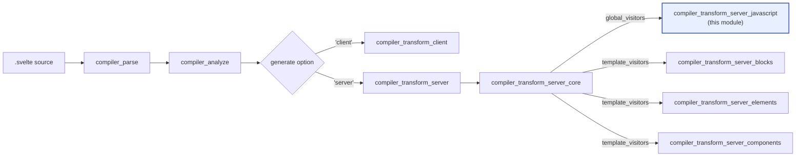
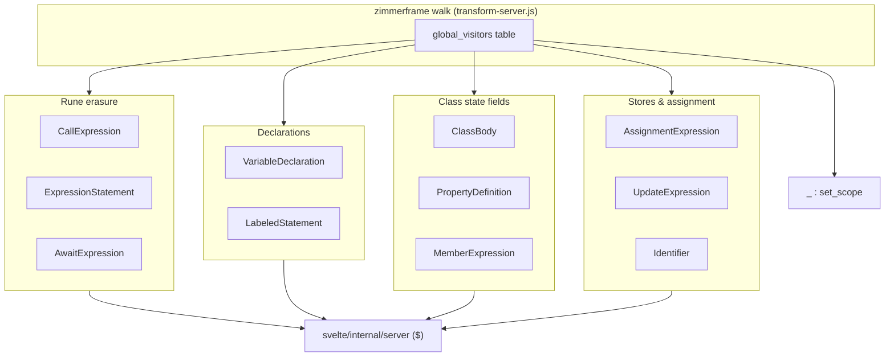
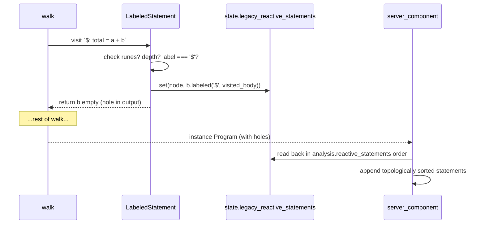
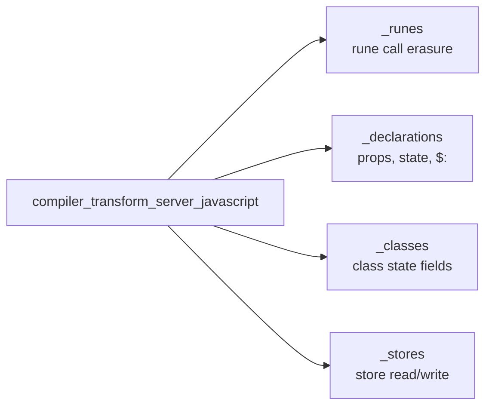
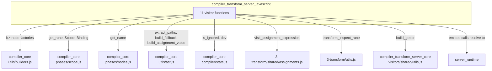

# compiler_transform_server_javascript

## Purpose

This module holds the **JavaScript visitors of the server (SSR) transform**. It rewrites the plain-JavaScript parts of a Svelte component — variable declarations, assignments, class bodies, rune calls, store access, and legacy `$:` statements — into code that runs once on the server and produces an HTML string.

The guiding idea is simple: **on the server there is no reactivity**. A server render happens once, top to bottom, and then the component is thrown away. So most of Svelte's reactive machinery has nothing to do. This module is the place where that machinery is stripped away:

| Client-side concept | What the server transform does with it |
| --- | --- |
| `$state(x)` / `$state.raw(x)` | Unwrap to the plain value `x` |
| `$derived(fn)` | Turn into a `$.derived(...)` getter thunk, evaluated on demand |
| `$effect(...)`, `$effect.pre(...)` | Delete — effects never run on the server |
| `$effect.tracking()` | Replace with `false` |
| `$effect.pending()` | Replace with `0` |
| `$host()` | Replace with `undefined` |
| `$props()` | Destructure from the `$$props` argument |
| `$store` auto-subscription | Replace with `$.store_get` / `$.store_set` calls |
| `$: ...` (legacy) | Collect, then re-emit in topological order |

Everything this module emits targets the `svelte/internal/server` runtime, imported under the alias `$`. See [server_runtime](server_runtime.md) for the helpers on the receiving end (`$.derived`, `$.store_get`, `$.fallback`, `$.snapshot`, …).

## Where this module sits

The server transform is phase 3 of the compiler. It receives an analyzed AST from [compiler_analyze](compiler_analyze.md) and hands a `Program` to code generation.



The split between `global_visitors` and `template_visitors` matters:

- **This module supplies `global_visitors`** — the visitors that apply to *every* AST the transform walks: the `<script module>` program, the `<script>` instance program, and the template program.
- The sibling modules supply `template_visitors`, which only apply to the template walk.

Because of that, this module is the only part of the server transform that also runs for `compileModule` (`.svelte.js` / `.svelte.ts` files) via `server_module`. See [compiler_transform_server_core](compiler_transform_server_core.md) for how the walks are set up.

## Architecture

Every visitor in this module is a small pure function with the same shape:

```js
export function SomeNode(node, context) {
    // inspect node + context.state
    // return a replacement AST node, or
    // return b.empty / undefined, or
    // call context.next() to keep walking unchanged
}
```

The walk is driven by [zimmerframe](compiler_transform_server_core.md), and the visitors are wired into a single flat table in `transform-server.js`:



### Shared context

All visitors read from a `ServerTransformState` (see [compiler_transform_server_core](compiler_transform_server_core.md) for the full type). The four fields this module depends on:

| Field | Used for |
| --- | --- |
| `analysis.runes` | The big fork: runes mode vs. legacy mode behaviour |
| `scope` | Resolving an identifier to its `Binding` (`state`, `store_sub`, `bindable_prop`, …), and generating conflict-free temp names |
| `state_fields` | `Map<string, StateField>` of `$state` / `$derived` class fields, populated by `ClassBody` for its children |
| `legacy_reactive_statements` | Output channel where `LabeledStatement` parks `$:` bodies for later re-ordering |

`analysis.runes` is worth calling out. Several visitors are effectively two separate visitors sharing a name — one branch for modern runes code, one for Svelte 4-style legacy code. `VariableDeclaration` is the clearest example: its two halves barely share a line.

### The two-pass pattern for `$:`

Legacy reactive statements cannot be emitted where they are found, because `$: a = b + 1` may depend on a `$:` block written further down the file. The module handles this with a deferral:



The ordering itself is decided during analysis, not here — this module only preserves the bodies and marks their original position as removed.

## Sub-modules

The eleven visitor files group into four concerns. Each has its own document.



| Document | Visitors covered |
| --- | --- |
| [compiler_transform_server_javascript_runes](compiler_transform_server_javascript_runes.md) | `CallExpression`, `ExpressionStatement`, `AwaitExpression` |
| [compiler_transform_server_javascript_declarations](compiler_transform_server_javascript_declarations.md) | `VariableDeclaration`, `LabeledStatement` |
| [compiler_transform_server_javascript_classes](compiler_transform_server_javascript_classes.md) | `ClassBody`, `PropertyDefinition`, `MemberExpression` |
| [compiler_transform_server_javascript_stores](compiler_transform_server_javascript_stores.md) | `AssignmentExpression` (+ `build_assignment`), `UpdateExpression`, `Identifier` |

### 1. Rune erasure — [compiler_transform_server_javascript_runes](compiler_transform_server_javascript_runes.md)

`CallExpression`, `ExpressionStatement`, `AwaitExpression`.

Handles runes at their *call site*. `CallExpression` is the central lookup table: it asks `get_rune()` what rune (if any) a call is, then returns a server-appropriate replacement — `$.derived(...)` for `$derived`, the bare argument for `$state`, `false` for `$effect.tracking()`, a no-op arrow for `$effect.root()`. `ExpressionStatement` deletes standalone effect statements outright. `AwaitExpression` enforces that top-level `await` in template position is an error, emitting `$.await_outside_boundary()`.

### 2. Declarations — [compiler_transform_server_javascript_declarations](compiler_transform_server_javascript_declarations.md)

`VariableDeclaration`, `LabeledStatement`.

The largest and most branch-heavy part of the module. `VariableDeclaration` rewrites `let { a, b } = $props()` into a destructuring of `$$props` (carefully splicing in `$$slots` / `$$events` so a rest pattern does not leak them), unwraps `$state`, evaluates `$derived`, drops `$props.id`, and in legacy mode converts `export let` into `$$props` member reads with `$.fallback` defaults. `LabeledStatement` implements the `$:` deferral described above.

### 3. Class state fields — [compiler_transform_server_javascript_classes](compiler_transform_server_javascript_classes.md)

`ClassBody`, `PropertyDefinition`, `MemberExpression`.

Rewrites `$state` / `$derived` class fields. `ClassBody` is the coordinator: it looks the class up in `analysis.classes`, seeds `state_fields` into the child state, and for each `$derived` field emits a private backing field plus a `get`/`set` accessor pair. `PropertyDefinition` unwraps field initializers. `MemberExpression` turns a read of a private derived field (`this.#x`) into the call (`this.#x()`) that the accessor pair expects.

### 4. Stores and assignment — [compiler_transform_server_javascript_stores](compiler_transform_server_javascript_stores.md)

`AssignmentExpression` (+ `build_assignment`), `UpdateExpression`, `Identifier`.

Implements the `$store` auto-subscription contract on the server. `Identifier` rewrites every *read* of `$count` into `$.store_get($$store_subs ??= {}, '$count', count)` (and maps `$$props` to `$$sanitized_props`). `AssignmentExpression` and `UpdateExpression` cover the *write* side with `$.store_set`, `$.store_mutate`, `$.update_store` and `$.update_store_pre`. `build_assignment` doubles as the hook for class-field assignments made inside a constructor.

## Cross-cutting dependencies



Two dependencies are shared with the client transform and are worth knowing about:

- **`visit_assignment_expression`** (`3-transform/shared/assignments.js`) handles destructuring assignment targets (`[a, b] = ...`, `{x} = ...`) for both the client and server transforms. It calls back into the server's `build_assignment` for each extracted path, and returns `null` when nothing changed so the original assignment can be kept verbatim. The client equivalent is in [compiler_transform_client_javascript](compiler_transform_client_javascript.md).
- **`b.*` builders** ([compiler_core](compiler_core.md)) are used everywhere. `b.empty` in particular is the idiom for "delete this statement".

## Comparison with the client transform

The same node types are handled on both sides, and reading them side by side is the fastest way to understand either. The counterpart module is [compiler_transform_client_javascript](compiler_transform_client_javascript.md).

| Node | Server (this module) | Client |
| --- | --- | --- |
| `$state` declaration | Plain `let x = value` | `$.state(...)`, possibly `$.proxy(...)` |
| `$derived` declaration | `$.derived(thunk)`, pull-based | `$.derived(...)` signal wired into the graph |
| `$effect` | Deleted | `$.user_effect(...)` |
| `$props()` | Destructure `$$props` object | `$.prop(...)` per prop, with `$.rest_props` |
| Identifier read | `$.store_get` for stores only | `$.get(...)` for any reactive binding |
| Class `$derived` field | Backing field + accessor pair | `$.derived` signal + accessor pair |
| `await` in template | Error (`$.await_outside_boundary`) | Suspends via boundary |

The recurring theme: the client transform builds a *graph* that will be updated later, the server transform builds a *straight line* that runs once.

## Related documentation

- [compiler_transform_server](compiler_transform_server.md) — parent module
- [compiler_transform_server_core](compiler_transform_server_core.md) — walk setup, `ServerTransformState`, `build_getter`
- [compiler_transform_server_blocks](compiler_transform_server_blocks.md) — `{#if}`, `{#each}`, `{#await}` on the server
- [compiler_transform_server_elements](compiler_transform_server_elements.md) — element and attribute output
- [compiler_transform_server_components](compiler_transform_server_components.md) — component invocation and slots
- [compiler_transform_client_javascript](compiler_transform_client_javascript.md) — the client counterpart
- [compiler_analyze](compiler_analyze.md) — produces the `analysis` this module reads
- [compiler_core](compiler_core.md) — builders, scope, shared AST utilities
- [server_runtime](server_runtime.md) — the `$.*` helpers the emitted code calls
