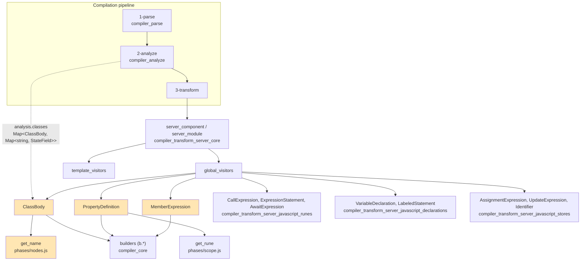
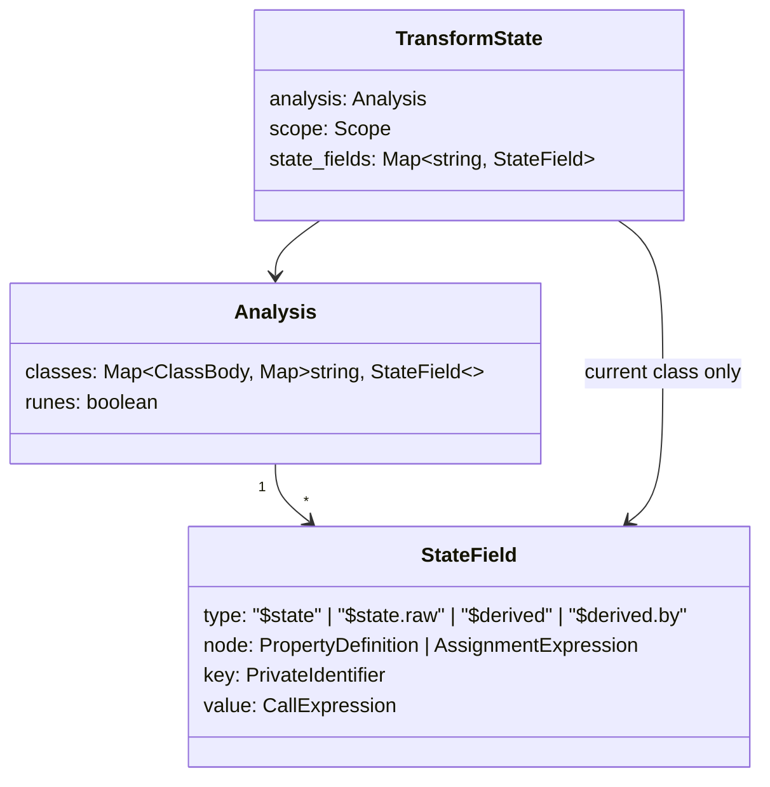
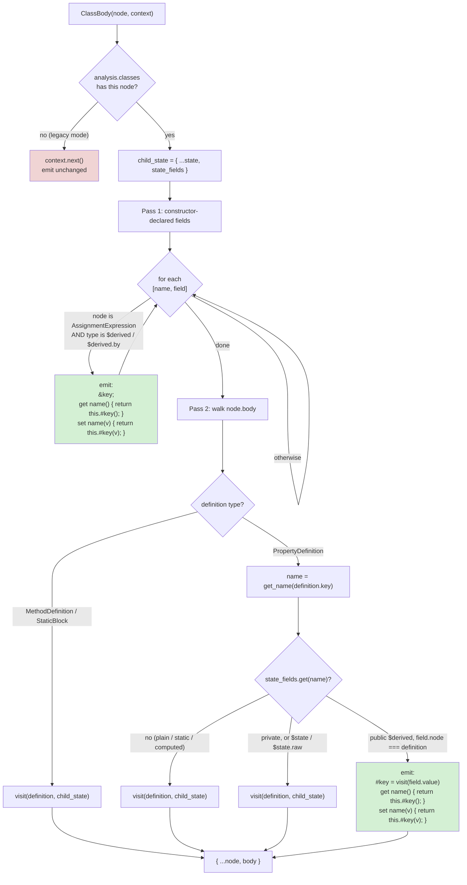
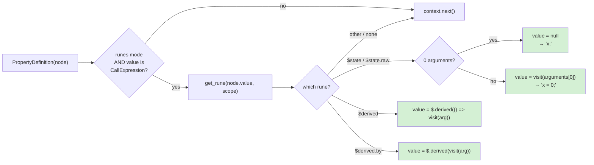
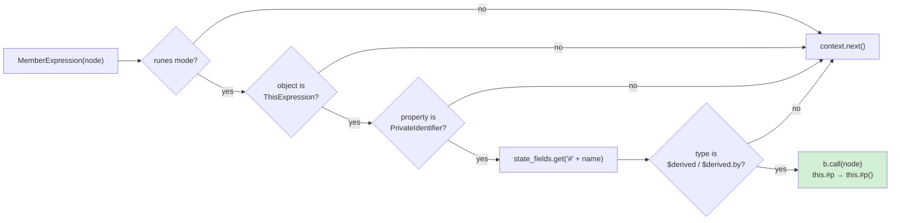
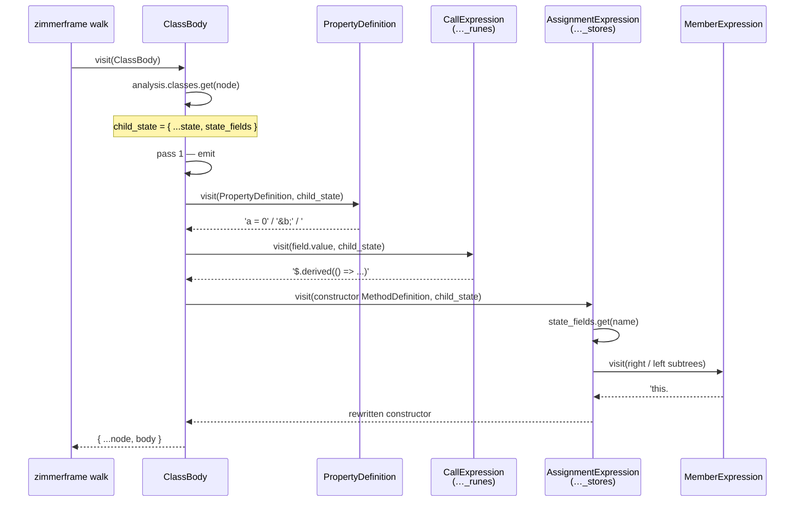
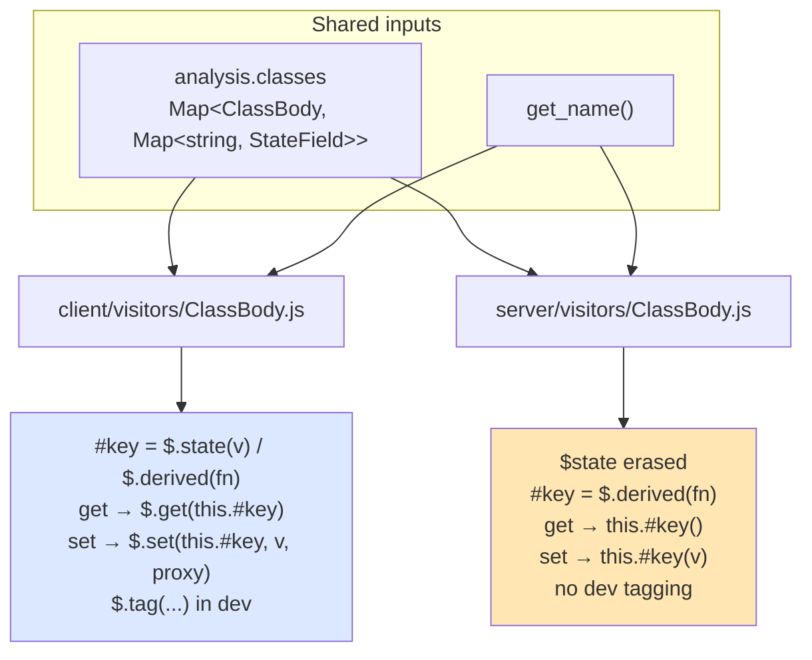

# compiler_transform_server_javascript_classes

## Introduction

This module rewrites **JavaScript classes** during the server (SSR) transform. It only cares about one thing: classes whose fields are declared with the state runes — `$state`, `$state.raw`, `$derived` and `$derived.by`.

```js
class Counter {
	count = $state(0);
	double = $derived(this.count * 2);
}
```

On the client those fields become real signals with getter/setter accessor pairs (see [compiler_transform_client_javascript](compiler_transform_client_javascript.md)). On the server there is **no reactivity** — HTML is rendered once and thrown away — so the module strips the runes down to the smallest thing that still behaves correctly for a single render:

| Source field | Client output (roughly) | Server output |
| --- | --- | --- |
| `count = $state(0)` | signal + `get`/`set` accessors | `count = 0` |
| `x = $state()` | signal holding `undefined` | `x;` (no initialiser) |
| `double = $derived(this.count * 2)` | `$.derived(...)` signal + accessors | `#double = $.derived(() => this.count * 2)` + accessors |
| `d = $derived.by(() => ...)` | `$.derived(fn)` signal + accessors | `#d = $.derived(fn)` + accessors |
| `#p = $derived(...)` | private signal, read via `$.get` | `#p = $.derived(...)`, read via `this.#p()` |

`$state` disappears entirely. `$derived` survives — but as a **lazy once-only closure**, not a signal. That single asymmetry explains almost every line of code in this module.

### Core components

| Component | File | Role |
| --- | --- | --- |
| `ClassBody` | `server/visitors/ClassBody.js` | Rebuilds the whole class body: reorders fields, injects private backing fields and `get`/`set` accessor pairs for `$derived` |
| `PropertyDefinition` | `server/visitors/PropertyDefinition.js` | Unwraps a single rune-initialised field (`$state(0)` → `0`, `$derived(x)` → `$.derived(() => x)`) |
| `MemberExpression` | `server/visitors/MemberExpression.js` | Turns a read of a private derived field, `this.#p`, into the call `this.#p()` |
| `get_name` | `compiler/phases/nodes.js` | Normalises any field key (`Identifier`, `Literal`, `PrivateIdentifier`) into the string used as the map key |

---

## Where this module sits

All three visitors live in the server transform's **global visitor set**, so they run over `<script module>`, `<script>`, and expressions inside the template alike.



The rewritten class flows back into `server_component`, which assembles the final `function App($$payload, $$props) { ... }`. See [compiler_transform_server_core](compiler_transform_server_core.md) for that step and [compiler_transform_server](compiler_transform_server.md) for the whole server transform.

---

## The input contract: `analysis.classes`

This module does **no discovery of its own**. Phase 2 already walked every `ClassBody`, found the rune-initialised fields, and recorded them. The transform just reads that record.



The four fields of `StateField` each answer a specific question for the transform:

| Field | Meaning | Why the transform needs it |
| --- | --- | --- |
| `type` | which rune was used | `$state` → erase; `$derived` → keep as `$.derived` and add accessors |
| `node` | the `PropertyDefinition`, **or** the `AssignmentExpression` if the field was created in the constructor | tells `ClassBody` whether a backing field must be *declared* separately |
| `key` | a **deconflicted `PrivateIdentifier`** invented by phase 2 (e.g. `#count` for public `count`) | the name of the hidden backing field |
| `value` | the original rune call | what gets visited and re-emitted |

Two important consequences:

- **Legacy (non-runes) mode is a no-op.** `analysis.classes.get(node)` returns `undefined`, `ClassBody` calls `context.next()` and the class is emitted as written.
- **`state_fields` is scoped per class.** `ClassBody` builds a `child_state` with the current class's map and passes it to every `context.visit(...)`. Nested classes therefore shadow correctly, and `MemberExpression` never mistakes an outer class's `#p` for the inner one's.

See [compiler_analyze](compiler_analyze.md) for how the map is populated (including duplicate-field errors and private-name deconflicting).

---

## `ClassBody` — the orchestrator

`ClassBody` is the only visitor that returns a *whole new body array*. It runs in two passes.



### Why two passes?

A rune field can be created in two places, and each needs different treatment:

**(a) As a class field** — `field.node` is the `PropertyDefinition`. The declaration site and the value site are the same node, so pass 2 can replace it in place with `#key = <value>` plus accessors.

**(b) In the constructor** — `field.node` is the `AssignmentExpression` inside the constructor body. JavaScript requires private fields to be *declared* in the class body, so pass 1 must emit a bare `#key;` declaration up front. The assignment itself is rewritten separately by the `AssignmentExpression` visitor (see [compiler_transform_server_javascript_stores](compiler_transform_server_javascript_stores.md), which owns that file).

Pass 1 deliberately narrows to `$derived` / `$derived.by` only. A constructor-assigned `$state` needs nothing: `this.count = $state(0)` collapses to `this.count = 0`, an ordinary property write with no backing field and no accessors.

### Why accessors at all?

Because the server's `$.derived` is a **function**, not a value:

```js
// packages/svelte/src/internal/server/index.js
export function derived(fn) {
	const get_value = once(fn);
	let updated_value;
	return function (new_value) {
		if (arguments.length === 0) return updated_value ?? get_value();
		updated_value = new_value;
		return updated_value;
	};
}
```

Call it with no arguments to read (lazily, once), call it with one argument to override. The accessor pair is the bridge that keeps the *public* API of the class identical to the source — `obj.double` still reads like a plain property, while the machinery `this.#double()` stays hidden. This also preserves `$derived`'s documented ability to be temporarily overwritten.

See [server_runtime](server_runtime.md) for the rest of the SSR runtime helpers.

---

## `PropertyDefinition` — the per-field unwrapper

Where `ClassBody` decides *structure*, `PropertyDefinition` decides *value*. It is a plain rune-matcher and does not consult `state_fields` at all, which makes it a useful catch-all: it also handles `static` and computed fields that phase 2 never recorded.



The `0 arguments → null` branch is the reason this visitor exists as well as the shared `CallExpression` rune visitor. `#b = $state()` becomes `#b;` rather than `#b = void 0` — cleaner output, and a declared-but-uninitialised private field is what the source meant.

For the public-`$derived` path, note that `ClassBody` visits `field.value` (the `CallExpression`) directly rather than the `PropertyDefinition`, so the `$.derived(...)` wrapping there is produced by the `CallExpression` visitor in [compiler_transform_server_javascript_runes](compiler_transform_server_javascript_runes.md). The two code paths are intentionally identical in output.

---

## `MemberExpression` — reads of private derived fields

Public `$derived` fields get accessors, so `this.double` just works. Private ones cannot — `#double` *is* the backing field, there is nowhere to hide a getter. So every read must be rewritten into a call.



The guard chain is deliberately narrow. `this.#p` where `#p` is `$state` is left alone (it holds a plain value on the server). `other.#p` is left alone. And `state_fields` is read with `?.` because this visitor also fires on member expressions **outside** any class body, where the map may be absent.

---

## Worked example

Source (`tests/snapshot/samples/class-state-field-constructor-assignment`):

```svelte
<script>
	class Foo {
		a = $state(0);
		#b = $state();
		foo = $derived({ bar: this.a * 2 });
		bar = $derived({ baz: this.foo });
		constructor() {
			this.a = 1;
			this.#b = 2;
			this.foo.bar = 3;
			this.bar = 4;
		}
	}
</script>
```

Server output:

```js
class Foo {
	a = 0;
	#b;
	#foo = $.derived(() => ({ bar: this.a * 2 }));

	get foo() { return this.#foo(); }
	set foo($$value) { return this.#foo($$value); }

	#bar = $.derived(() => ({ baz: this.foo }));

	get bar() { return this.#bar(); }
	set bar($$value) { return this.#bar($$value); }

	constructor() {
		this.a = 1;
		this.#b = 2;
		this.foo.bar = 3;
		this.bar = 4;
	}
}
```

Line by line:

| Source | Output | Who did it |
| --- | --- | --- |
| `a = $state(0)` | `a = 0` | `ClassBody` routes to `PropertyDefinition`, which unwraps the call |
| `#b = $state()` | `#b;` | `PropertyDefinition`, zero-argument branch |
| `foo = $derived({...})` | `#foo = $.derived(() => ({...}))` + accessors | `ClassBody` pass 2, public-`$derived` branch; `#foo` is the `field.key` invented by phase 2 |
| `this.a = 1` | unchanged | `AssignmentExpression` finds a `$state` field created by a `PropertyDefinition`, not by this assignment → falls through |
| `this.#b = 2` | unchanged | `$state`, not `$derived` → `MemberExpression` and `AssignmentExpression` both decline |
| `this.foo.bar = 3` | unchanged | the assignment target's object is `this.foo`, not `this` → falls through; the public getter runs at runtime |
| `this.bar = 4` | unchanged in source form | goes through the generated `set bar`, which forwards to `this.#bar(4)` |

### The constructor-declared variant

```svelte
<script>
	class Foo {
		constructor() {
			this.total = $derived(1 + 1);
		}
	}
</script>
```

```js
class Foo {
	#total;
	get total() { return this.#total(); }
	set total($$value) { return this.#total($$value); }

	constructor() {
		this.#total = $.derived(() => 1 + 1);
	}
}
```

Here `ClassBody` pass 1 emits the declaration and accessors, and the assignment rewrite (`this.total` → `this.#total`) comes from `build_assignment`.

---

## Component interaction

The three visitors never call each other directly. They cooperate through two shared channels: the `state_fields` map threaded down as visitor state, and the recursive `context.visit` walk.



| Boundary | Contract |
| --- | --- |
| ← [compiler_analyze](compiler_analyze.md) | supplies `analysis.classes`, the deconflicted `field.key`, and all duplicate-field / invalid-rune errors |
| ← [compiler_transform_server_core](compiler_transform_server_core.md) | registers the visitors and seeds `state_fields` with an empty map |
| → [compiler_transform_server_javascript_runes](compiler_transform_server_javascript_runes.md) | `CallExpression` performs the `$derived` → `$.derived` rewrite that `ClassBody` relies on |
| → [compiler_transform_server_javascript_stores](compiler_transform_server_javascript_stores.md) | `AssignmentExpression` / `build_assignment` handle writes to rune fields, including the constructor declaration form |
| → [compiler_core](compiler_core.md) | `b.*` builders (`prop_def`, `method`, `member`, `key`, `private_id`, `thunk`, `call`, `return`) and `get_rune` from `phases/scope.js` |
| → [server_runtime](server_runtime.md) | the emitted `$.derived` helper |

---

## Client vs. server: the same problem, two answers

The two `ClassBody` visitors are near-mirrors, which makes the divergence easy to read.



| Concern | Client | Server |
| --- | --- | --- |
| `$state` | signal + accessors | erased to a plain property |
| `$derived` | `$.derived` signal, re-evaluates on dependency change | `$.derived` lazy `once()` closure, evaluated at most once |
| Deep reactivity | `should_proxy` → `$.set(..., true)` | not applicable, no proxies |
| Private fields | still wrapped, read through `$.get` | wrapped only for `$derived`, read through `this.#p()` |
| Dev tooling | `$.tag(...)` names signals for the inspector | none |
| Constructor-declared `$state` | gets a backing field + accessors | nothing — a plain write is enough |

Details of the client side are in [compiler_transform_client_javascript](compiler_transform_client_javascript.md).

---

## Notes and edge cases

- **Order of emitted members.** Each backing field is emitted immediately followed by its `get`/`set` pair, and pass 1 output precedes the original body. Field initialisers run in source order at construction time, so a `$derived` whose thunk reads another `$derived` is safe — the thunk is lazy and does not run during construction.
- **Static fields** are never recorded in `state_fields` (phase 2 skips `static` property definitions), so they fall to the plain `context.visit` path. `PropertyDefinition` still unwraps a rune call there, which is why the catch-all shape of that visitor matters.
- **Computed keys.** `get_name` returns `null` for anything that is not an `Identifier`, `Literal`, or `PrivateIdentifier`, so computed fields never match a `StateField` and pass through untouched.
- **`name[0] === '#'` appears three times** — in pass 1 (skip: private fields need no accessors), in pass 2 (route to `PropertyDefinition` instead of the accessor branch), and inside `MemberExpression`'s lookup key (`'#' + node.property.name`), because `get_name` stores private names with the `#` prefix included.
- **`field.node === definition` is a real guard, not a formality.** Phase 2 keys the map by name, so a field can be recorded once but referenced from several definitions in malformed input; the identity check ensures only the recording definition is rewritten.
- **Accessor key asymmetry.** The generated getter reuses `definition.key` while the setter is rebuilt with `b.key(name)`. For identifier and string keys the two produce equivalent output, so this is cosmetic.
- **No dev-mode branch.** Unlike the client visitor, nothing here depends on `dev`. SSR output is identical in dev and production for classes.
