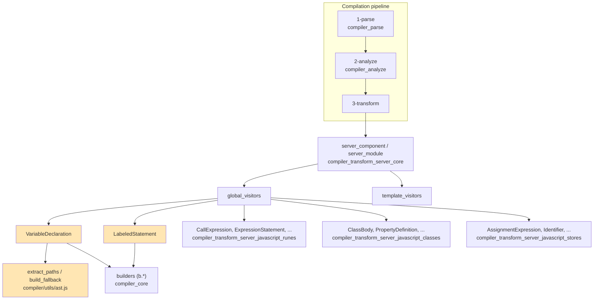
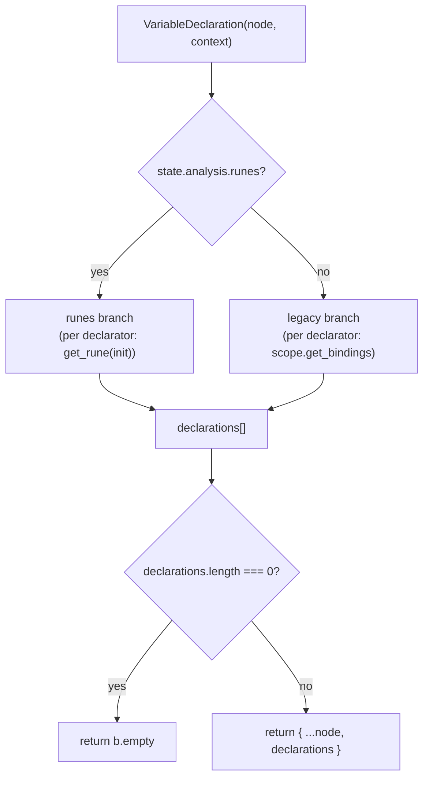
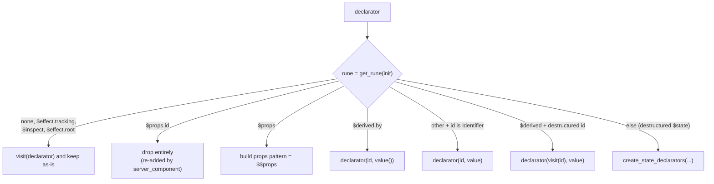
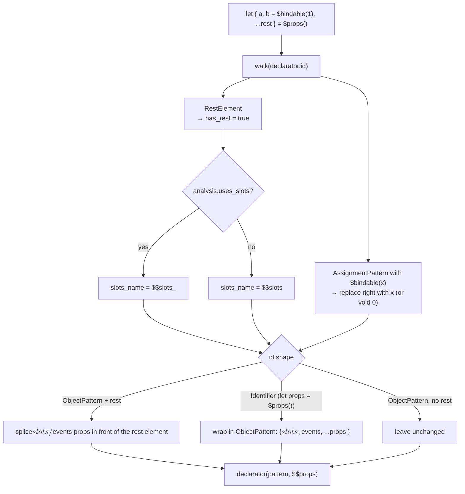
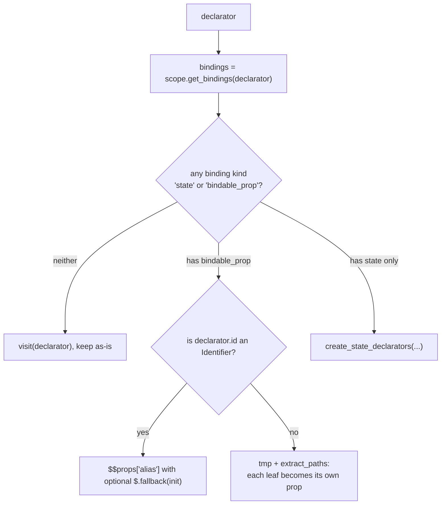
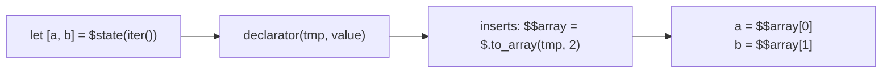
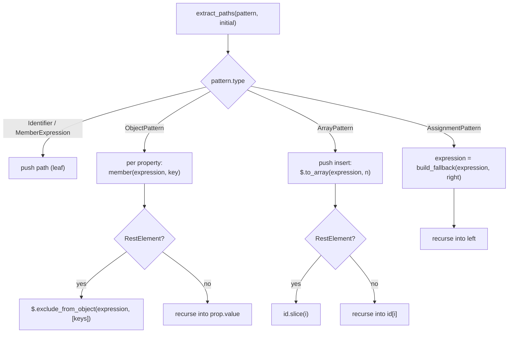
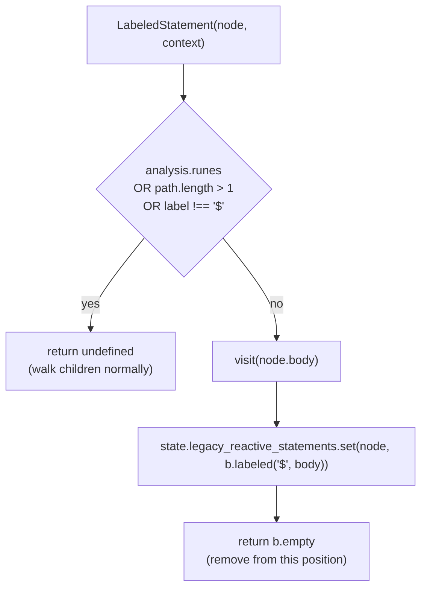
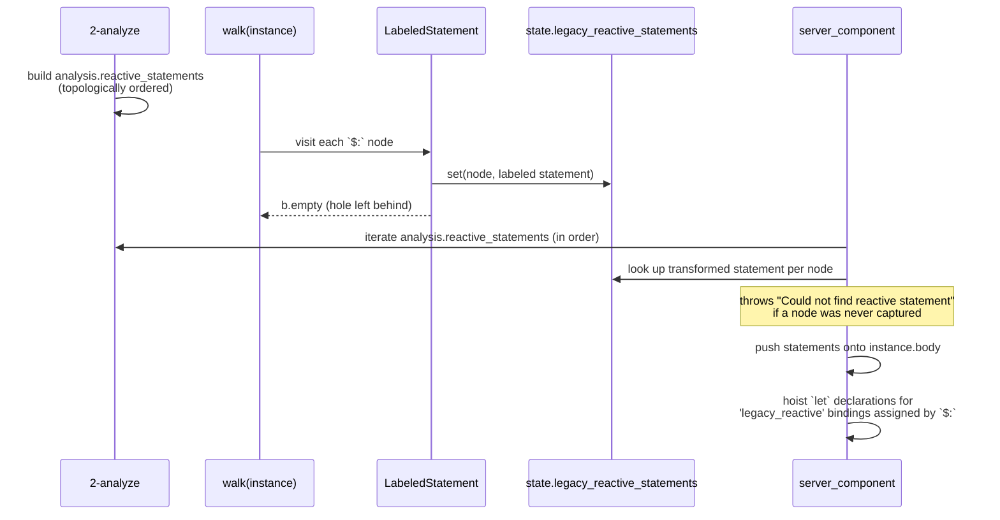
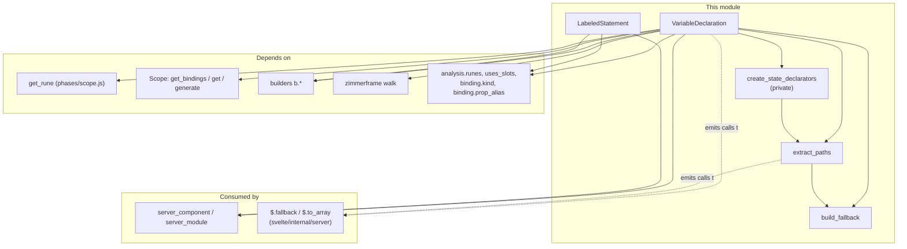

# compiler_transform_server_javascript_declarations

## Introduction

This module handles **declarations** during the server (SSR) transform. Its job is small but central: take the places where a Svelte component *declares* something — `let x = $state(0)`, `let { a, b } = $props()`, `export let name`, `$: doubled = count * 2` — and turn them into plain JavaScript that runs once, top-to-bottom, on the server.

The key idea is that **the server has no reactivity**. HTML is rendered one time and thrown away. So every declaration form that means "reactive" on the client collapses into an ordinary variable on the server:

| Source | Client output (roughly) | Server output |
| --- | --- | --- |
| `let x = $state(0)` | `let x = $.state(0)` | `let x = 0` |
| `let d = $derived(x * 2)` | `let d = $.derived(...)` | `let d = x * 2` |
| `let { a } = $props()` | prop signals | `let { a } = $$props` |
| `export let a = 1` (legacy) | prop signal | `let a = $.fallback($$props["a"], 1)` |
| `$: y = x * 2` (legacy) | pre-effect | a plain statement, re-ordered later |

Two visitors do this work, backed by one shared AST utility:

| Component | File | Role |
| --- | --- | --- |
| `VariableDeclaration` | `server/visitors/VariableDeclaration.js` | Rewrites `let`/`const`/`var` declarations (runes and legacy modes) |
| `LabeledStatement` | `server/visitors/LabeledStatement.js` | Captures legacy `$:` statements for later topological ordering |
| `extract_paths` | `compiler/utils/ast.js` | Flattens a destructuring pattern into a list of "path → expression" pairs |
| `build_fallback` | `compiler/utils/ast.js` | Builds a `$.fallback(value, default)` call for default values |

---

## Where this module sits

Both visitors are registered in the server transform's **global visitor set**, so they run over the module script (`<script module>`), the instance script (`<script>`), *and* expressions inside the template.



The output feeds back into `server_component`, which assembles the final `function App($$payload, $$props) { ... }`. See [compiler_transform_server_core](compiler_transform_server_core.md) for that assembly step, and [compiler_transform_server](compiler_transform_server.md) for the whole server transform.

---

## `VariableDeclaration`

The visitor rebuilds the declaration list from scratch. It walks each declarator, decides what to emit, and pushes zero, one, or many replacement declarators. If **nothing** is left it returns `b.empty` (an empty statement) instead of an illegal `let;`.



### Runes branch

`get_rune(init, scope)` (from [compiler_core](compiler_core.md)'s `phases/scope.js`) tells us which rune, if any, the initializer calls. The branch order matters — it is a first-match ladder.



Where `value` is the rune call's **first argument**, or `void 0` when the rune was called with no arguments (`$state()` → `undefined`). This is the whole trick: `$state(0)` becomes `0`, `$derived(a + b)` becomes `a + b`. `$derived.by(() => a + b)` becomes `(() => a + b)()` — the thunk is called immediately.

`$props.id` is skipped here because `server_component` injects `const uid = $.props_id($$payload)` at the top of the component body, where hydration needs it.

#### The `$props()` case

This is the most involved path, because the destructuring pattern has to survive into the output while `$bindable()` markers are stripped and `$$slots` / `$$events` are kept private.



Why the `$$slots` / `$$events` injection? `$$props` is the raw props object and carries internal keys. Without naming them explicitly, a `...rest` pattern would sweep them into the user's rest object. Naming them binds them to local throwaway variables instead. When the component also uses `$$slots` itself (`analysis.uses_slots`), the internal binding is renamed to `$$slots_` so the two do not collide.

`$bindable()` has no meaning on the server (there is nothing to bind back to), so `b = $bindable(1)` degrades to the plain default `b = 1`, and bare `$bindable()` to `b = void 0`.

### Legacy branch

In legacy (non-runes) mode, intent comes from **binding kinds** computed during analysis rather than from rune calls. See [compiler_analyze](compiler_analyze.md) for how bindings get their kind.



The non-identifier `export let` case is genuinely odd, and the source says so. For `export let { x: foo, z: [bar] } = ...`, the **leaves** (`foo`, `bar`) are the prop names — not the keys `x` and `z`. So the visitor:

1. declares a temp (`tmp`) holding the visited initializer,
2. emits any array-unwrap `inserts` from `extract_paths`,
3. for each leaf path, looks up the binding, and declares the leaf as `$.fallback($$props["<prop_alias ?? name>"], <path expression>)`.

The path expression (e.g. `tmp.x`) becomes the *fallback*, and the incoming prop wins. Prop renaming via `export { foo as bar }` is respected through `binding.prop_alias`.

### `create_state_declarators`

A small private helper shared by both branches for **destructured** state. It flattens the pattern so nothing reactive is needed:



Note the generated names go through `scope.generate('tmp')` / `scope.generate('$$array')`, so they never shadow user variables.

---

## `extract_paths` and `build_fallback`

These two live in `compiler/utils/ast.js` and are shared with the client transform ([compiler_transform_client_javascript](compiler_transform_client_javascript.md)). They are the reason this module can stay short.

### `extract_paths(param, initial)`

Walks a destructuring pattern and returns `{ inserts, paths }`.

- **`paths`** — one entry per leaf, each a `DestructuredAssignment` with:
  - `node` — the leaf `Identifier` (or `MemberExpression`, for assignment patterns)
  - `expression` — how to *read* that leaf out of `initial` (may include fallbacks / rest calls)
  - `update_expression` — same, but without default-value wrapping
  - `is_rest`, `has_default_value` — flags
- **`inserts`** — intermediate `$.to_array(...)` declarations needed for array patterns. Array destructuring cannot index a generic iterator, so the value is materialised once. The **caller must name these ids** (both call sites do `id.name = scope.generate('$$array')`).



### `build_fallback(expression, fallback)`

Picks the cheapest correct shape for a default value, so simple defaults do not pay for a thunk and async defaults are awaited properly:

| Fallback shape | Emitted |
| --- | --- |
| simple (literal, identifier, function, simple binary/conditional) | `$.fallback(expr, fb)` |
| `await <simple>` | `await $.fallback(expr, <simple>)` |
| async expression | `await $.fallback(expr, () => fb, true)` (thunk marked async) |
| anything else | `$.fallback(expr, () => fb, true)` |

The `true` third argument tells the runtime the second argument is **lazy** — only call it when the value is actually missing. `$.fallback` and `$.to_array` are re-exported by the server runtime from `internal/shared/utils.js`; see [server_runtime](server_runtime.md) and [internal_shared](internal_shared.md).

> Note: `extract_paths` also emits `$.exclude_from_object` for object-rest patterns. That helper currently lives in the **client** runtime (`internal/client/runtime.js`), so it is only reachable from client-transform output — worth knowing if you extend the server transform to hit that path.

---

## `LabeledStatement`

This visitor exists only for legacy reactive statements (`$: ...`). It is deliberately tiny — it does not *rewrite* anything, it **defers** the statement.



Three guards keep it narrow:

- **runes mode** — `$:` has no reactive meaning; leave it as a plain label.
- **`context.path.length > 1`** — only top-level `$:` counts. A nested label is just a label.
- **label name is not `$`** — an ordinary JavaScript label.

The label itself is *preserved* in the stored statement (`b.labeled('$', ...)`), because user code may contain `break $` inside the body — dropping the label would produce invalid JavaScript.

### Why defer? Topological ordering

Statements are removed from their original position and re-inserted later, in **dependency order**, by `server_component`. On the client this ordering matters for correctness of pre-effects; on the server it matters because there is only one pass — `$: b = a * 2` must run after `a` is assigned.



`server_component` also scans each `$: x = ...` statement for assigned identifiers whose binding kind is `legacy_reactive`, and prepends a single `let x, y;` declaration — the variables are assigned by the reactive statements but never declared anywhere else.

The `legacy_reactive_statements` map is declared on `ServerTransformState`, and `server_module` creates one too even though `$:` is component-only, purely so the shared global visitors can run unchanged over module scripts. See [compiler_ast_types](compiler_ast_types.md) for the transform-state shapes.

---

## Component interaction



Sibling modules that share the same visitor pass:

- [compiler_transform_server_javascript_runes](compiler_transform_server_javascript_runes.md) — rune *calls* in expression position (`$state.snapshot`, `$inspect`, `$host`, …)
- [compiler_transform_server_javascript_classes](compiler_transform_server_javascript_classes.md) — `$state` fields in classes (`ClassBody`, `PropertyDefinition`, `MemberExpression`)
- [compiler_transform_server_javascript_stores](compiler_transform_server_javascript_stores.md) — `$store` reads and writes, assignments, updates

Note the division of labour with the stores module: `VariableDeclaration` decides the *shape* of a declaration; `AssignmentExpression` / `UpdateExpression` handle later *writes* to whatever it declared.

---

## Worked examples

**Runes state and derived**

```js
// in
let count = $state(0);
let double = $derived(count * 2);
let lazy = $derived.by(() => count * 3);

// out
let count = 0;
let double = count * 2;
let lazy = (() => count * 3)();
```

**Runes props**

```js
// in
let { a, b = $bindable('x'), ...rest } = $props();

// out
let { a, b = 'x', $$slots, $$events, ...rest } = $$props;
```

**Runes props as an identifier**

```js
// in
let props = $props();

// out
let { $$slots, $$events, ...props } = $$props;
```

**Destructured runes state**

```js
// in
let [a, b] = $state(get_pair());

// out
let tmp = get_pair();
let $$array = $.to_array(tmp, 2);
let a = $$array[0];
let b = $$array[1];
```

**Legacy prop with a default**

```js
// in
export let name = 'world';

// out
let name = $.fallback($$props['name'], 'world');
```

**Legacy reactive statement**

```js
// in
let a = 1;
$: b = a * 2;
$: c = b + 1;

// out (statements re-inserted in topological order, declarations hoisted)
let b, c;
let a = 1;
$: b = a * 2;
$: c = b + 1;
```

---

## Design notes and sharp edges

- **Rebuild, don't mutate.** Both visitors return fresh nodes (`{ ...node, declarations }` or `b.empty`) rather than editing in place, which keeps the zimmerframe walk predictable.
- **`b.empty` instead of an empty declaration.** Dropping every declarator (e.g. a lone `$props.id`) must produce a valid statement, not `let;`.
- **First-match ladder.** The runes branch order is load-bearing: `$props.id` must be checked before the generic "first argument" path, and the `Identifier` short-circuit must precede the `$derived` destructuring case.
- **Generated names always go through `scope.generate`.** `tmp` and `$$array` are deconflicted against user code.
- **`inserts` need naming by the caller.** `extract_paths` intentionally emits placeholder `#` ids; forgetting to rename them produces invalid output.
- **The `$` label is kept.** `break $` inside a reactive statement is legal user code.
- **A captured `$:` node must be found again.** If the analysis phase records a reactive statement that the visitor never captured (or vice versa), `server_component` throws `Could not find reactive statement` — an internal-invariant error, not a user-facing one.
- **Server output has no reactivity by construction.** Anything that reads like a signal on the client is a plain value here; that is why the same source can be split into these two very different back ends.

## Related modules

- [compiler_transform_server](compiler_transform_server.md) — parent module, full server transform
- [compiler_transform_server_core](compiler_transform_server_core.md) — `server_component` / `server_module` assembly
- [compiler_transform_server_javascript](compiler_transform_server_javascript.md) — sibling JavaScript visitors overview
- [compiler_transform_client_javascript](compiler_transform_client_javascript.md) — the client counterpart of these visitors
- [compiler_analyze](compiler_analyze.md) — where binding kinds and `reactive_statements` come from
- [compiler_core](compiler_core.md) — `builders`, `Scope`, `get_rune`
- [server_runtime](server_runtime.md) / [internal_shared](internal_shared.md) — `$.fallback`, `$.to_array`, `$.props_id`
- [legacy_compatibility_and_migration](legacy_compatibility_and_migration.md) — the legacy syntax these branches support
