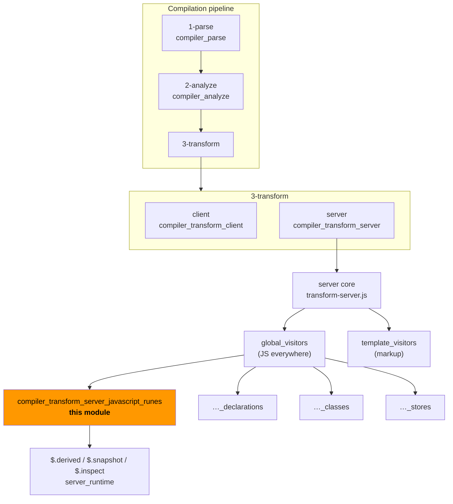
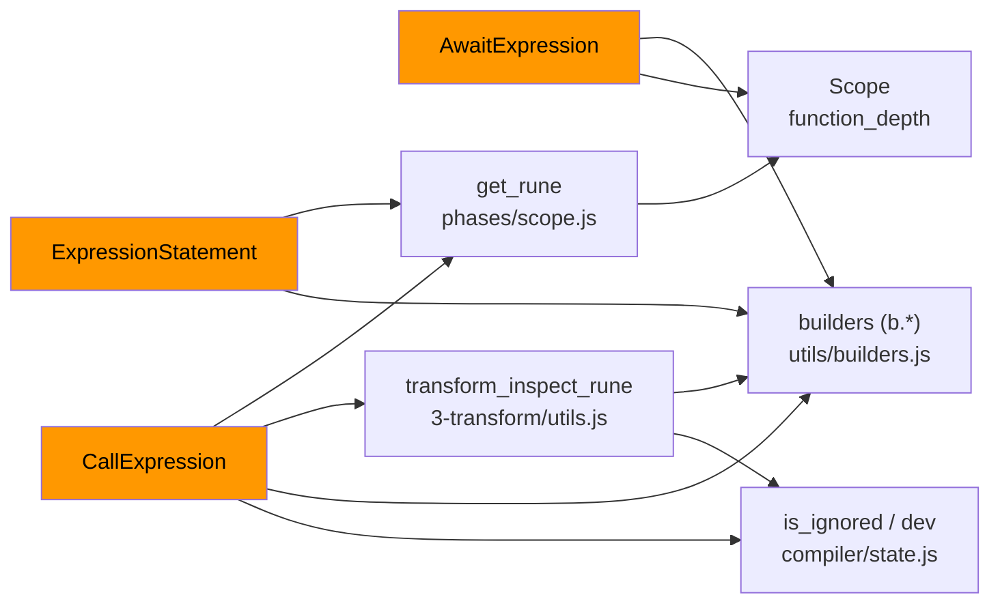
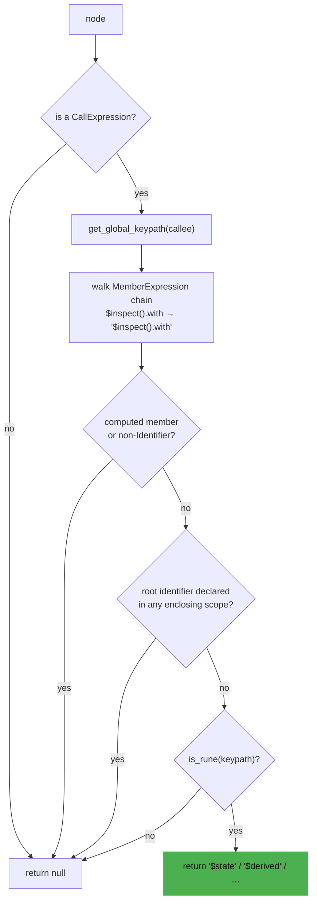
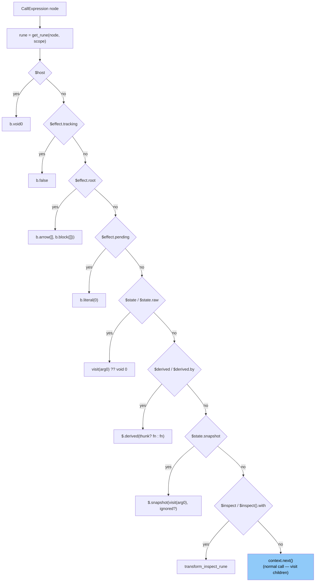
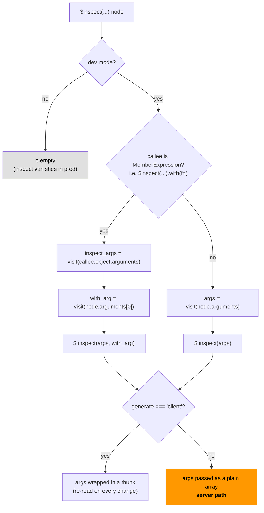
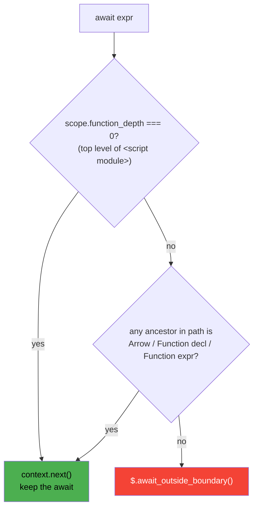
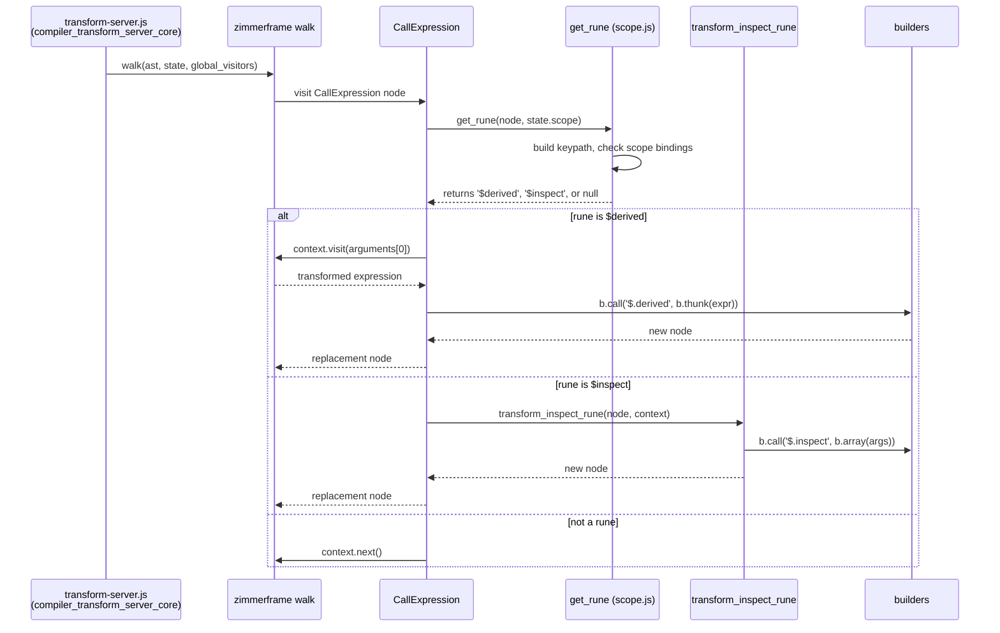

# compiler_transform_server_javascript_runes

## Introduction

Runes (`$state`, `$derived`, `$effect`, `$inspect`, `$host`, …) are the reactivity primitives of Svelte 5. On the client they compile into live signals. On the server there is **no reactivity at all** — a component is rendered once into a string and thrown away.

This module is the part of the server (SSR) transform that deals with that mismatch. It walks the JavaScript inside `<script>` blocks and inside template expressions, and rewrites every rune call into something that makes sense for a one-shot render:

- values are **unwrapped** (`$state(x)` becomes plain `x`),
- side effects are **deleted** (`$effect(...)` becomes nothing),
- a few runes are replaced with **tiny server stubs** (`$.derived`, `$.snapshot`, `$.inspect`),
- `await` in the wrong place becomes a **runtime error call**.

It also enforces one rule that has no client equivalent: a blocking `await` in the component body cannot be rendered on the server, because there is no `<svelte:boundary>` pending state to fall back to.

This module is a leaf of [compiler_transform_server_javascript](compiler_transform_server_javascript.md), which itself is part of [compiler_transform_server](compiler_transform_server.md).

---

## Core components

| Component | File | Role |
| --- | --- | --- |
| `CallExpression` | `server/visitors/CallExpression.js` | Rewrites rune calls used as **expressions** |
| `ExpressionStatement` | `server/visitors/ExpressionStatement.js` | Deletes rune calls used as **statements** |
| `AwaitExpression` | `server/visitors/AwaitExpression.js` | Guards `await` outside a function |
| `transform_inspect_rune` | `3-transform/utils.js` | Shared `$inspect` / `$inspect().with` lowering |
| `get_rune` | `phases/scope.js` | Decides whether a call *is* a rune (scope aware) |

---

## Where the module sits



`global_visitors` in `transform-server.js` is a flat map of AST node type → visitor. `CallExpression`, `ExpressionStatement` and `AwaitExpression` are registered there, so they fire for **every** JavaScript expression in the component: module script, instance script, and every `{expression}` in the markup. See [compiler_transform_server_core](compiler_transform_server_core.md) for how the visitor map is assembled and driven.

---

## Dependencies



- `get_rune` and `Scope` come from [compiler_core](compiler_core.md) (`phases/scope.js`).
- `b.*` builders (`b.call`, `b.thunk`, `b.arrow`, `b.literal`, `b.empty`, `b.void0`, …) also come from [compiler_core](compiler_core.md).
- `is_ignored` and `dev` come from the compiler-wide state module (`compiler/state.js`).
- The emitted `$.` helpers live in [server_runtime](server_runtime.md) (`svelte/internal/server`), imported once as `import * as $ from 'svelte/internal/server'` by the server core.

---

## Rune → server output

### Expression position (`CallExpression`)

| Source | Server output | Why |
| --- | --- | --- |
| `$host()` | `void 0` | No custom element host during SSR |
| `$effect.tracking()` | `false` | Nothing is ever tracked |
| `$effect.root(fn)` | `() => {}` | Only the cleanup function shape is kept |
| `$effect.pending()` | `0` | No pending async work |
| `$state(v)` / `$state.raw(v)` | `v` (visited) — or `void 0` if no arg | State is just a plain value |
| `$derived(expr)` | `$.derived(() => expr)` | Lazy, computed at most once |
| `$derived.by(fn)` | `$.derived(fn)` | `fn` is already a thunk |
| `$state.snapshot(v)` | `$.snapshot(v[, true])` | Deep clone; the extra `true` suppresses the `state_snapshot_uncloneable` warning when it is `svelte-ignore`d |
| `$inspect(...)` / `$inspect(...).with(fn)` | `$.inspect([...])` (dev only) | See below |
| anything else | `context.next()` | Not a rune → keep walking children |

`$.derived` in [server_runtime](server_runtime.md) is a `once()` wrapper: the thunk runs on first read and the value is memoised, so a `$derived` never recomputes during a single render.

The `$derived` vs `$derived.by` split matters: `$derived(a * 2)` receives an **expression**, so the visitor wraps it in `b.thunk(...)`; `$derived.by(() => a * 2)` already receives a **function**, so it is passed through unchanged.

### Statement position (`ExpressionStatement`)

| Source statement | Server output |
| --- | --- |
| `$effect(fn);` | *(removed)* |
| `$effect.pre(fn);` | *(removed)* |
| `$effect.root(fn);` | *(removed)* |
| `$inspect.trace();` | *(removed)* |
| anything else | `context.next()` |

`b.empty` is an empty statement, so the whole line — including its arguments — disappears from the SSR output. Nothing inside an effect body is ever visited, which is exactly right: effects only run in the browser.

Note that `$effect.root` is listed in **both** visitors. As a bare statement it is deleted outright; as an expression (`const stop = $effect.root(...)`) it must still produce *something* callable, so it becomes a noop arrow function.

### Runes handled elsewhere

`$props()`, `$props.id()`, `$bindable()` and `$derived` **declarations** are not rewritten here — they are handled where the variable is declared, in [compiler_transform_server_javascript_declarations](compiler_transform_server_javascript_declarations.md). Class field runes (`$state` inside a class body) are handled by [compiler_transform_server_javascript_classes](compiler_transform_server_javascript_classes.md). Reading a `$derived` variable back is handled by [compiler_transform_server_javascript_stores](compiler_transform_server_javascript_stores.md) via `build_getter`.

---

## How a rune is recognised

`get_rune` is what stops the transform from mangling user code that merely *looks* like a rune.



Two consequences worth remembering:

1. **Shadowing wins.** If the user writes `import { $state } from './x.js'` or `let $host = ...`, the scope lookup finds a binding and `get_rune` returns `null` — the call is left alone.
2. **Keypaths are joined literally**, including the call in the middle: `$inspect(x).with(fn)` becomes the keypath string `"$inspect().with"`, which is why `CallExpression` matches that exact string.

---

## Control flow inside `CallExpression`



Every branch that returns a node **replaces** the original call and, importantly, does *not* call `context.next()` — so children are only visited when the visitor explicitly does so (`context.visit(node.arguments[0])`). This is how `$effect` bodies get skipped while `$derived` bodies still get transformed.

---

## `$inspect` — `transform_inspect_rune`

`transform_inspect_rune` lives in the shared `3-transform/utils.js` because both the client and the server transform use it. The single behavioural difference is the `as_fn` flag, derived from `state.options.generate`.



On the server, `$.inspect(args)` in [server_runtime](server_runtime.md) simply does `console.log('init', ...args)` once — there are no subsequent updates to report. In production builds the whole call is erased, so `$inspect` costs nothing.

`$inspect.trace()` never reaches here: it is only ever a statement, and `ExpressionStatement` removes it first.

---

## `AwaitExpression` — the boundary guard

Async Svelte lets you `await` directly in the component body. On the client that suspends inside the nearest `<svelte:boundary>` with a `pending` snippet. On the server there is no such mechanism, so the compiler emits a call that throws at render time.



- **`function_depth === 0`** identifies the module scope. Top-level `await` in `<script module>` runs once when the module is imported, which is fine on the server.
- **An enclosing function** means the `await` only runs when that function is called — also fine.
- Anything else is a component-body `await`, and is replaced by `$.await_outside_boundary()` from `internal/shared/errors.js`, which throws `Cannot await outside a <svelte:boundary> with a pending snippet`.

Note the replacement swallows the awaited expression: the whole `await x` node becomes the error call, so `x` is never evaluated.

Compare with the client path, where `await` is compiled into real suspension machinery — see [compiler_transform_client_javascript](compiler_transform_client_javascript.md) and [client_blocks](client_blocks.md).

---

## End-to-end example

Input component:

```svelte
<script>
  let count = $state(0);
  let doubled = $derived(count * 2);

  $effect(() => {
    console.log('only in the browser');
  });

  $inspect(count);
</script>

<p>{doubled}</p>
```

What this module contributes to the SSR output:

```js
let count = 0;                            // $state unwrapped
let doubled = $.derived(() => count * 2); // lazy, memoised
                                          // $effect statement removed entirely
$.inspect([count]);                       // dev only, plain array (no thunk)
```

Declaration handling (`let count = ...`) and reading `doubled` back through a getter belong to the sibling modules linked above; this module is responsible only for the right-hand sides and the deleted statement.

---

## Interaction sequence



---

## Design notes

**Why replace instead of erase for `$derived`?** A `$derived` value may be read many times in a template, and its expression may be expensive or have observable ordering. `$.derived` memoises with `once()`, giving "compute at most once, only if read" — the closest server analogue of a lazy signal.

**Why do effects disappear rather than run once?** Effects are explicitly documented as browser-only. Running them during SSR would produce output that hydration cannot reproduce, and would frequently touch DOM APIs that do not exist.

**Why is `$state` a plain unwrap?** SSR has no mutation-after-render phase, so proxying would only cost time. The client transform, by contrast, wraps state in proxies — see [compiler_transform_client_javascript](compiler_transform_client_javascript.md).

**Why is the rune check scope-aware?** Rune names are not reserved words. `get_rune` returning `null` for any shadowed identifier means user code that happens to define `$state` keeps working, and the compiler never silently rewrites a normal function call.

---

## Related modules

- [compiler_transform_server_javascript](compiler_transform_server_javascript.md) — parent module, all JS visitors of the server transform
- [compiler_transform_server_javascript_declarations](compiler_transform_server_javascript_declarations.md) — `$props`, `$bindable`, `$derived` declarations
- [compiler_transform_server_javascript_classes](compiler_transform_server_javascript_classes.md) — rune fields in class bodies
- [compiler_transform_server_javascript_stores](compiler_transform_server_javascript_stores.md) — store access, assignments, `build_getter`
- [compiler_transform_server_core](compiler_transform_server_core.md) — visitor map, program assembly, `ServerTransformState`
- [compiler_transform_client_javascript](compiler_transform_client_javascript.md) — the client counterpart of the same runes
- [compiler_core](compiler_core.md) — `Scope`, `get_rune`, AST builders
- [server_runtime](server_runtime.md) — `$.derived`, `$.snapshot`, `$.inspect`, `$.await_outside_boundary`
- [compiler_analyze](compiler_analyze.md) — rune validation that runs before this transform
