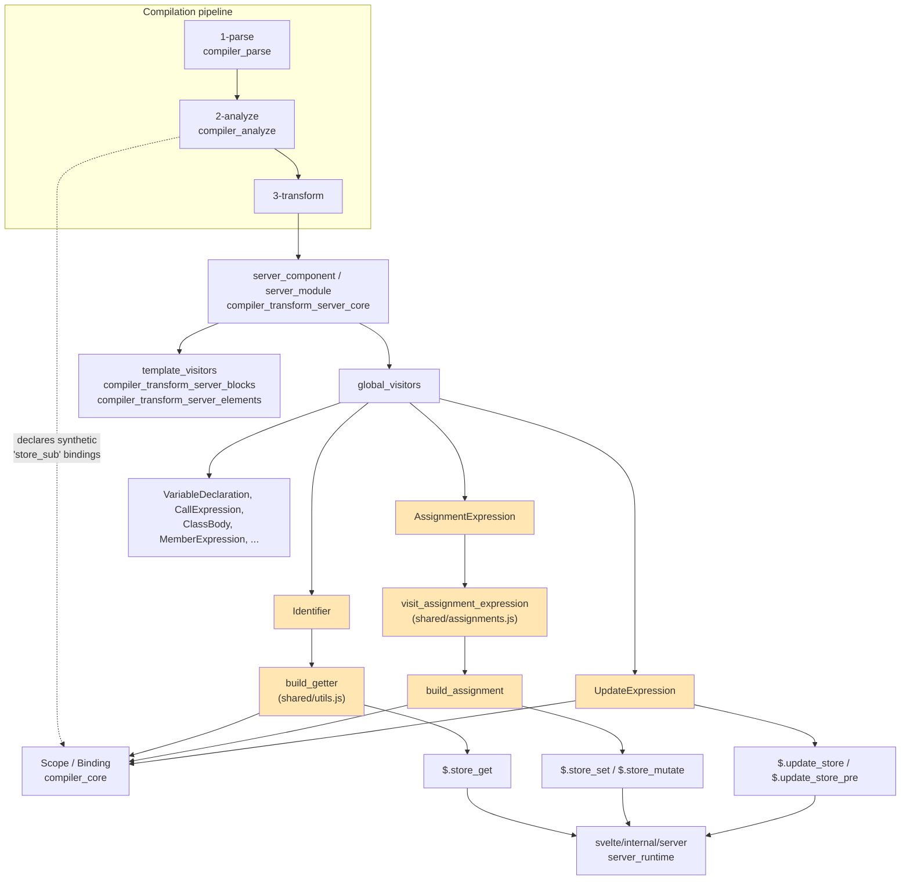
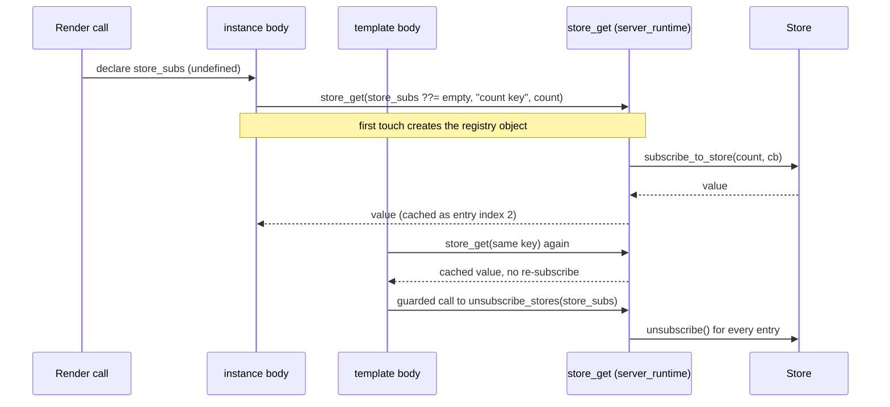
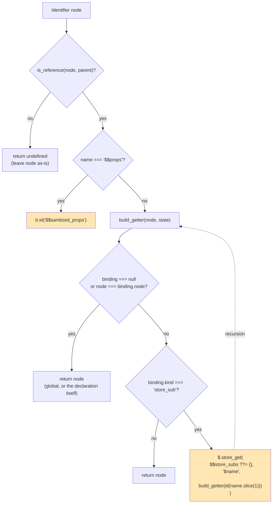
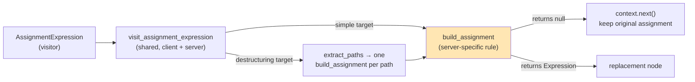
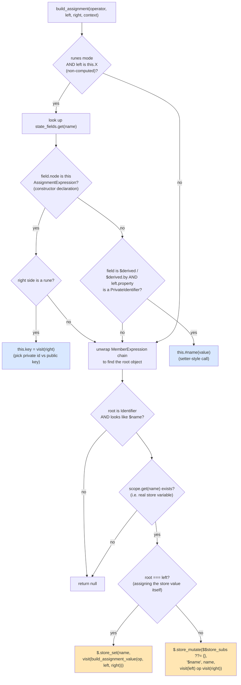
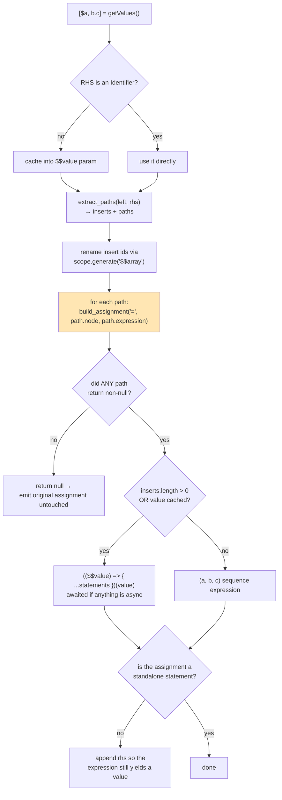

# compiler_transform_server_javascript_stores

## Introduction

This module is the part of the **server (SSR) transform** that deals with **`$store` auto-subscriptions** — the Svelte feature where writing `$count` inside a component means "read the current value of the store `count`", and writing `$count = 5` means "set the store".

On the client this is done with real subscriptions that live and die with the component. On the server there is no lifetime: the component function runs once, produces a string of HTML, and returns. So the server transform replaces every `$store` read and write with a **direct call into a tiny runtime helper**, backed by one hidden local variable, `$$store_subs`, that collects the subscriptions so they can all be torn down at the end of the render.

In short, this module rewrites four things:

| Source (what the author writes) | Server output (what this module produces) |
| --- | --- |
| `$count` (read) | `$.store_get($$store_subs ??= {}, '$count', count)` |
| `$count = 1` (write) | `$.store_set(count, 1)` |
| `$obj.foo = 1` (mutate through a store) | `$.store_mutate($$store_subs ??= {}, '$obj', obj, ...)` |
| `$count++` / `--$count` (update) | `$.update_store(...)` / `$.update_store_pre(...)` |

Everything else about assignments — destructuring, compound operators, class `$derived` fields — flows through the same three visitors, so this module also owns the **generic assignment plumbing** for the server transform.

### Component roster

| Component | File | Role |
| --- | --- | --- |
| `Identifier` | `server/visitors/Identifier.js` | Entry point for every identifier **read**; also maps `$$props` → `$$sanitized_props` |
| `build_getter` | `server/visitors/shared/utils.js` | Turns a `store_sub` identifier into a `$.store_get(...)` call (recursively) |
| `AssignmentExpression` | `server/visitors/AssignmentExpression.js` | Visitor entry point for every assignment |
| `build_assignment` | `server/visitors/AssignmentExpression.js` | The actual rewrite rule: store set / store mutate / class field, or "leave it alone" |
| `visit_assignment_expression` | `3-transform/shared/assignments.js` | Shared (client + server) driver that unrolls destructuring patterns and calls `build_assignment` per target |
| `UpdateExpression` | `server/visitors/UpdateExpression.js` | Rewrites `++` / `--` on a store value |

---

## Where this module sits

All four visitors are registered in the server transform's **global visitor set**, which means they run over the module script, the instance script, *and* every expression embedded in the template. There is no separate "store pass" — store handling is woven into the ordinary identifier/assignment walk.



Sibling modules inside the same JavaScript transform group:

- [compiler_transform_server_javascript_runes](compiler_transform_server_javascript_runes.md) — strips `$effect`, unwraps `$derived`/`$state` calls
- [compiler_transform_server_javascript_declarations](compiler_transform_server_javascript_declarations.md) — `let`/`const`/`$props()`/`$:` declarations
- [compiler_transform_server_javascript_classes](compiler_transform_server_javascript_classes.md) — `$state`/`$derived` class fields
- [compiler_transform_server_core](compiler_transform_server_core.md) — assembles the final component function and declares `$$store_subs`

---

## The core idea: `store_sub` bindings and `$$store_subs`

### Where `store_sub` comes from

This module never decides *what is a store*. That decision was already made in phase 2. When the analyzer sees a reference to `$foo` where `foo` is a real declaration (or a global), it creates a **synthetic binding** named `$foo` with kind `'store_sub'` in the instance scope:

```js
// phases/2-analyze/index.js
const binding = instance.scope.declare(b.id(name), 'store_sub', 'synthetic');
```

The analyzer also enforces the rules that make this module's job safe:

- `store_invalid_scoped_subscription` — you cannot auto-subscribe to a store declared inside a nested scope
- `store_invalid_subscription` — you cannot auto-subscribe from `<script module>`
- `store_rune_conflict` — warns when a `$`-name collides with a rune

So by the time this module runs, the only question it asks is: **`scope.get(name)?.kind === 'store_sub'`?** See [compiler_analyze](compiler_analyze.md) for the analysis side.

### The `$$store_subs` accumulator

`$$store_subs` is a plain object used as a registry: `{ '$count': [store, unsubscribe_fn, current_value] }`.

Three things about it matter:

1. **It is declared lazily by the core transform.** `server_component` only emits `var $$store_subs` if at least one `store_sub` binding exists, and only then appends the teardown:

   ```js
   // phases/3-transform/server/transform-server.js
   instance.body.unshift(b.var('$$store_subs'));
   template.body.push(
       b.if(b.id('$$store_subs'), b.stmt(b.call('$.unsubscribe_stores', b.id('$$store_subs'))))
   );
   ```

2. **Every use site initialises it defensively** with `$$store_subs ??= {}`. This is why the same snippet (`b.assignment('??=', b.id('$$store_subs'), b.object([]))`) appears in `build_getter`, `build_assignment`, and `UpdateExpression` — the first expression to touch a store creates the object, no matter which of the three it is, and no matter whether it runs inside a nested block or a snippet function.

3. **It stays `undefined` if no store is ever actually read.** The teardown is guarded by `if ($$store_subs)`, so a component that declares a store but never reads it pays nothing.



(The diagram drops the `$` sigils for readability; the real emitted names are `$$store_subs`, `$.store_get` and `$.unsubscribe_stores`, and the store key is the literal `'$count'`.)

The runtime side of this contract (`store_get`, `store_set`, `store_mutate`, `update_store`, `update_store_pre`, `unsubscribe_stores`) lives in [server_runtime](server_runtime.md). Note the subtle caching rule there: `store_get` reuses a cached value **only if the store object is identical**, otherwise it unsubscribes from the old store first — which is what makes reassignable store variables (`store = other_store`) work.

---

## Read path: `Identifier` → `build_getter`

`Identifier` is deliberately minimal. It uses `is-reference` to check that the identifier is actually a *value reference* (not a property key, not a declaration name, not a label), then delegates.



Two details worth calling out:

**1. The `node === binding.node` guard.** A declaration's own identifier must never be rewritten — otherwise `let count = ...` would become `let $.store_get(...) = ...`. This one check protects every declaration site in the file.

**2. `build_getter` recurses on the store expression.** The third argument is not `b.id(name.slice(1))` directly; it is `build_getter(store_id, state)`. This handles **stores of stores**: if `$$inner` is read and `$inner` is itself a `store_sub`, the inner reference is unwrapped too:

```js
// source
$$inner

// output
$.store_get($$store_subs ??= {}, '$$inner',
    $.store_get($$store_subs ??= {}, '$inner', inner))
```

**3. `$$props` → `$$sanitized_props`.** Not store-related, but it lives here because it is the other special-cased identifier. `server_component` builds `$$sanitized_props` via `$.sanitize_props($$props)` so that internal keys (`$$slots`, `$$events`) do not leak into a `$$props` spread.

`build_getter` is exported from `server/visitors/shared/utils.js`, the same file that holds the template helpers (`process_children`, `build_template`, `build_attribute_value`) documented in [compiler_transform_server_core_template](compiler_transform_server_core_template.md). Other visitors call `build_getter` directly when they need a raw read without going through the walker.

---

## Write path: `AssignmentExpression` → `visit_assignment_expression` → `build_assignment`

The write path has three layers, and the split matters:



- **`AssignmentExpression`** is a one-liner: `visit_assignment_expression(node, context, build_assignment) ?? context.next()`. The `?? context.next()` is the "nothing to do here" escape hatch — ordinary variable assignments are emitted unchanged.
- **`visit_assignment_expression`** is shared with the client transform. It knows *nothing* about stores; it only knows how to take a destructuring pattern apart and ask the caller's rule about each piece.
- **`build_assignment`** is the server-specific rule. It returns an `Expression` when it wants to replace the node, or `null` to mean "keep as-is".

### `build_assignment`, step by step



#### The class-field branch (first half)

Despite living in a "stores" module, the first half of `build_assignment` handles **`this.x = ...` inside runes classes**. It is here because assignments are a single AST node type and one rule function has to cover both cases. It reads `context.state.state_fields` (populated by `ClassBody`) and:

- **Constructor state declaration** — `this.count = $state(0)` becomes a normal assignment to either the private backing field or the public key, depending on which rune was used. `get_name` (from `phases/nodes.js`) normalises `Identifier` / `PrivateIdentifier` / `Literal` property names.
- **`$derived` private field write** — `this.#d = value` becomes `this.d(value)`, because on the server a `$derived` field is compiled to a function. The mirror image lives in the server `MemberExpression` visitor, which turns a *read* of `this.#d` into `this.#d()`.

Both cases are documented in depth in [compiler_transform_server_javascript_classes](compiler_transform_server_javascript_classes.md).

#### The store branch (second half)

```js
let object = left;
while (object.type === 'MemberExpression') object = object.object;
if (object.type !== 'Identifier' || !is_store_name(object.name)) return null;
```

The loop walks `$a.b.c[d]` down to the root identifier `$a`. `is_store_name` is a cheap syntactic filter — first char `$`, second char a letter or `_` — which rejects `$` alone, `$$props`, `$0`, and the runes (`$state`, `$derived`, … are filtered later by the scope lookup). The authoritative check is the next line: `context.state.scope.get(name)` — if there is no variable called `count`, then `$count` was never a store and the node is left alone.

Then the two shapes diverge:

| Shape | Condition | Output |
| --- | --- | --- |
| **Set** | `object === left` — the whole target *is* the store value | `$.store_set(count, <value>)` |
| **Mutate** | the target is a member of the store value | `$.store_mutate($$store_subs ??= {}, '$obj', obj, <inner assignment>)` |

The **set** case uses `build_assignment_value(operator, left, right)` (from `compiler/utils/ast.js`) to normalise compound operators before visiting: `+=` becomes `left + right`, `??=` becomes `left ?? right`, and `=` passes through. Because the resulting expression still contains `$count` as an `Identifier`, the subsequent `context.visit(...)` runs `Identifier`/`build_getter` on it and produces the read call. That is how one rule covers all eleven assignment operators:

```js
// source
$count += 1

// output
$.store_set(count, $.store_get($$store_subs ??= {}, '$count', count) + 1)
```

The **mutate** case cannot use `store_set`, because the value being changed is *inside* the object the store holds. Instead it performs the real property assignment and then tells the store to re-publish itself:

```js
// source
$obj.foo = 1

// output
$.store_mutate(
    $$store_subs ??= {},
    '$obj',
    obj,
    $.store_get($$store_subs ??= {}, '$obj', obj).foo = 1
)
```

At runtime `store_mutate` does `store_set(store, store_get(...))` and returns the assigned expression, so the store notifies subscribers and the expression still evaluates to the assigned value (assignments are expressions in JS, and this rewrite must preserve that).

### Destructuring: what `visit_assignment_expression` adds

When the left side is an `ArrayPattern`, `ObjectPattern`, or `RestElement`, a single output node is not enough — each destructured target may need a *different* rewrite (one might be a store, another an ordinary variable). The shared driver handles it:



Key behaviours:

- **The `changed` flag avoids churn.** If no destructured target needed a rewrite, the original node is returned verbatim — the output stays readable and source maps stay tight.
- **`$$array` temporaries** come from `extract_paths` when the pattern needs iterator spreads (`[a, ...rest]`); they are renamed through `scope.generate` to avoid collisions.
- **Statement vs expression position** is checked with `context.path.at(-1).type.endsWith('Statement')`. In expression position the IIFE gets a `return rhs` and the sequence gets `rhs` appended, so `x = ([$a] = pair)` still evaluates to `pair`.
- **Async awareness**: if the RHS or any generated assignment is async (possible on the server, where `await` in the instance script is legal), the IIFE is made `async` and wrapped in `await`.

Because this function is shared, the same destructuring semantics apply on the client — see [compiler_transform_client_javascript](compiler_transform_client_javascript.md).

---

## Update path: `UpdateExpression`

`++` and `--` are the narrowest case, and the visitor is correspondingly direct: the argument must be a plain `Identifier` whose binding kind is `store_sub`. Member expressions (`$obj.n++`) are **not** handled here — they fall through to `context.next()` and get picked up by ordinary member-expression handling plus the store read on `$obj`.

```js
// $count++
$.update_store($$store_subs ??= {}, '$count', count)

// --$count
$.update_store_pre($$store_subs ??= {}, '$count', count, -1)
```

Two encoding tricks:

- **prefix vs postfix** selects the helper name (`update_store_pre` vs `update_store`), because the two return different values (new vs old).
- **the delta argument is `node.operator === '--' && b.literal(-1)`**. For `++` this evaluates to `false`, and `b.call` drops trailing falsy arguments, so the emitted call has three arguments and the runtime default `d = 1` applies. For `--` the literal `-1` is emitted.

| Source | Helper | Returns |
| --- | --- | --- |
| `$count++` | `$.update_store(subs, '$count', count)` | old value |
| `$count--` | `$.update_store(subs, '$count', count, -1)` | old value |
| `++$count` | `$.update_store_pre(subs, '$count', count)` | new value |
| `--$count` | `$.update_store_pre(subs, '$count', count, -1)` | new value |

---

## End-to-end example

```svelte
<script>
    import { writable } from 'svelte/store';
    const count = writable(0);
    const obj = writable({ n: 0 });

    function bump() {
        $count += 1;
        $count++;
        $obj.n = $count;
    }
</script>

<p>{$count}</p>
```

Compiled (SSR, simplified):

```js
import * as $ from 'svelte/internal/server';
import { writable } from 'svelte/store';

export default function App($$payload) {
    var $$store_subs;                          // ← from server_component

    const count = writable(0);
    const obj = writable({ n: 0 });

    function bump() {
        $.store_set(count,                                          // ← build_assignment (set)
            $.store_get($$store_subs ??= {}, '$count', count) + 1);  // ← build_getter
        $.update_store($$store_subs ??= {}, '$count', count);        // ← UpdateExpression
        $.store_mutate($$store_subs ??= {}, '$obj', obj,             // ← build_assignment (mutate)
            $.store_get($$store_subs ??= {}, '$obj', obj).n =
                $.store_get($$store_subs ??= {}, '$count', count));
    }

    $$payload.out.push(`<p>${$.escape($.store_get($$store_subs ??= {}, '$count', count))}</p>`);

    if ($$store_subs) $.unsubscribe_stores($$store_subs);            // ← server_component
}
```

Notice that the template read goes through exactly the same `build_getter` as the script read — the template path (`process_children` → `$.escape(...)`, see [compiler_transform_server_core_template](compiler_transform_server_core_template.md)) just wraps the result.

---

## Client vs server: the same feature, two strategies

| Concern | Server (this module) | Client ([compiler_transform_client_javascript](compiler_transform_client_javascript.md)) |
| --- | --- | --- |
| Subscription setup | lazy, per read, into `$$store_subs` | `$.setup_stores()` once, signals per store |
| Read | `$.store_get(subs, '$name', store)` | `$.store_get(store, '$name', $$stores)` on a reactive signal |
| Write | `$.store_set(store, value)` | `$.store_set(store, value)` + invalidation |
| Teardown | `$.unsubscribe_stores` at the end of the render function | tied to effect/component lifetime |
| Re-reads | value cached in `$$store_subs`, but re-checked against store identity | reactive dependency, re-runs on change |
| Hoisting | not needed (no event handlers to hoist) | `build_hoisted_params` must pass **both** `$name` and `name` |

The shared piece is `visit_assignment_expression`, which both sides call with their own `build_assignment` rule. That is the cleanest way to see the difference: identical destructuring/operator semantics, different leaf rewrites.

---

## Invariants and edge cases

| Situation | Behaviour | Why |
| --- | --- | --- |
| `$foo` where `foo` is not declared | left untouched (`scope.get` returns nothing) | analyzer already errored (or it is a legitimate `$`-prefixed variable) |
| The declaration `let count = ...` itself | `build_getter` returns the node unchanged | guarded by `node === binding.node` |
| `$state`, `$derived`, `$props` in runes mode | not treated as stores | no `store_sub` binding is created for runes |
| `$$props`, `$$restProps`, `$$slots` | not stores (`is_store_name` requires a letter/`_` at index 1); `$$props` is remapped | internal names |
| Store read inside a snippet / `{#each}` body | works — `$$store_subs ??= {}` is evaluated wherever the read lands | the accumulator is function-scoped in the component, not block-scoped |
| Store never read, only declared | `$$store_subs` stays `undefined`, teardown skipped | `if ($$store_subs)` guard |
| `$store` in `<script module>` | compile error from phase 2 | module scope has no component lifetime |
| Destructuring with no stores involved | original assignment preserved byte-for-byte | `changed` flag in `visit_assignment_expression` |
| `$obj.n++` | not handled by `UpdateExpression` | falls through; the `$obj` read is still rewritten |

---

## Extending or debugging this module

- **Adding a new store operation?** It almost certainly belongs in `build_assignment`, and it must emit the `$$store_subs ??= {}` initialiser if it needs the registry. Add the matching helper to `svelte/internal/server` ([server_runtime](server_runtime.md)) and, if the client needs the same shape, mirror it in the client `build_assignment`.
- **Output missing `var $$store_subs`?** The declaration is emitted by `server_component` based on `analysis.instance.scope.declarations`, not by these visitors. If a `store_sub` binding was not created in phase 2, the emitted `$$store_subs ??= {}` would reference an undeclared variable — which is why the analyzer's binding creation and the core transform's declaration must stay in sync. See [compiler_transform_server_core_program](compiler_transform_server_core_program.md).
- **An identifier not being rewritten?** Check `is_reference` first (property keys, labels, and declaration ids are intentionally skipped), then check the binding kind in the analysis output.
- **Class-field assignment misbehaving?** That is the first half of `build_assignment` and depends on `state_fields`; debug it alongside [compiler_transform_server_javascript_classes](compiler_transform_server_javascript_classes.md).

---

## References

- Parent: [compiler_transform_server_javascript](compiler_transform_server_javascript.md) · [compiler_transform_server](compiler_transform_server.md)
- Siblings: [compiler_transform_server_javascript_runes](compiler_transform_server_javascript_runes.md) · [compiler_transform_server_javascript_declarations](compiler_transform_server_javascript_declarations.md) · [compiler_transform_server_javascript_classes](compiler_transform_server_javascript_classes.md)
- Assembly: [compiler_transform_server_core](compiler_transform_server_core.md) · [compiler_transform_server_core_program](compiler_transform_server_core_program.md) · [compiler_transform_server_core_template](compiler_transform_server_core_template.md)
- Analysis that creates `store_sub` bindings: [compiler_analyze](compiler_analyze.md)
- Runtime helpers: [server_runtime](server_runtime.md)
- Store implementations themselves: [stores](stores.md) · client counterpart [client_store_interop](client_store_interop.md)
- Client mirror of this module: [compiler_transform_client_javascript](compiler_transform_client_javascript.md)
- Builders (`b.*`), scope, and shared AST utilities: [compiler_core](compiler_core.md)
