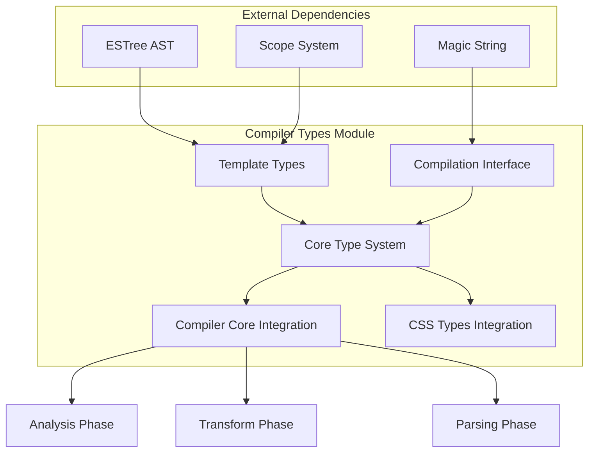
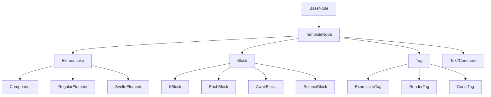
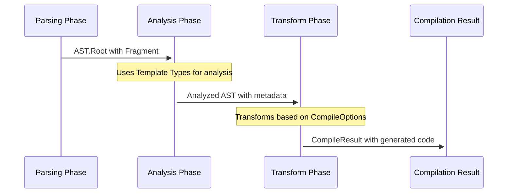
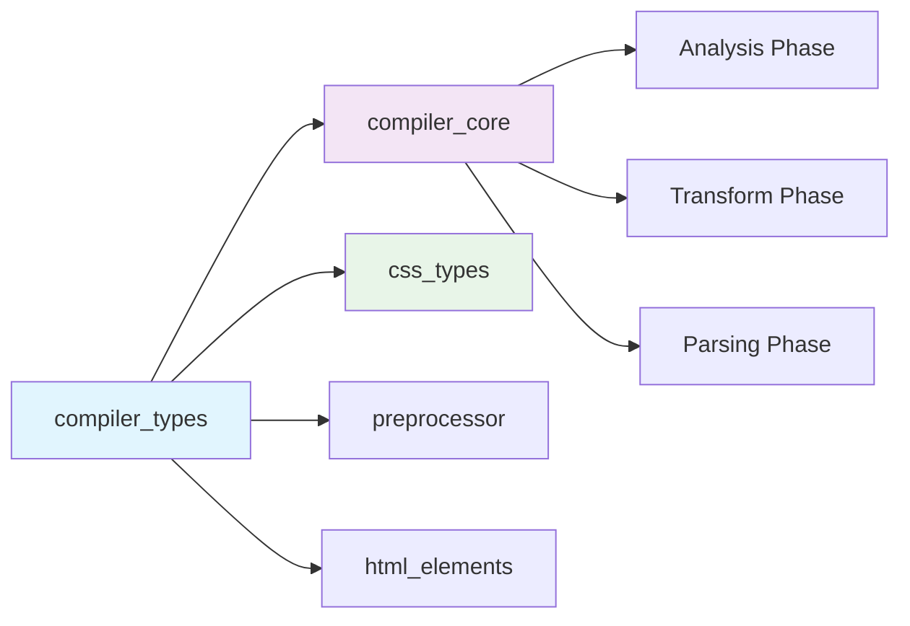

# Compiler Types Module

## Overview

The `compiler_types` module serves as the foundational type system for Svelte's compiler infrastructure, defining the core data structures and interfaces that represent parsed Svelte components and their compilation process. This module provides the essential type definitions for the Abstract Syntax Tree (AST) nodes, compilation options, and metadata structures used throughout the Svelte compilation pipeline.

## Purpose

The compiler_types module acts as the central type registry that:

- **Defines AST Structure**: Provides comprehensive type definitions for all Svelte template nodes, from basic text and comments to complex control flow blocks
- **Compilation Interface**: Establishes the contract between the compiler and external tools through `CompileOptions` and `CompileResult` interfaces
- **Type Safety**: Ensures type safety across the entire compilation process by providing strongly-typed interfaces for all compiler phases
- **Metadata Management**: Defines structures for storing compilation metadata, expression analysis, and optimization hints

## Architecture Overview

The module is organized into two main sub-modules that work together to provide a complete type system:



## Sub-modules

### [Template Types](template_types.md)
Comprehensive AST node definitions for all Svelte template constructs including elements, directives, blocks, and expressions. This sub-module forms the backbone of Svelte's template representation system, providing over 20 different AST node types that represent every possible construct in a Svelte template - from basic text nodes to complex control flow blocks and modern features like snippets and render tags.

### [Compilation Interface](compilation_interface.md)
Public API definitions for compiler options, results, and configuration. This sub-module defines how external tools and bundlers interact with the Svelte compiler, providing the `CompileOptions` interface with over 20 configuration options and the `CompileResult` interface that structures the compiler's output including generated JavaScript, CSS, warnings, and metadata.

## Core Components

### AST Node Hierarchy

The module defines a comprehensive hierarchy of AST nodes that represent every possible construct in a Svelte template:



### Compilation Flow Integration

The types integrate seamlessly with the compiler's multi-phase architecture:



## Key Features

### 1. Comprehensive AST Coverage
- **Elements**: Regular HTML elements, Svelte components, and special Svelte elements
- **Directives**: All Svelte directives (bind, on, use, transition, etc.)
- **Control Flow**: If blocks, each blocks, await blocks, and key blocks
- **Modern Features**: Snippet blocks, render tags, and runes support

### 2. Rich Metadata System
Each AST node includes internal metadata for:
- **Optimization Hints**: Information for compiler optimizations
- **Scope Management**: Integration with the scope analysis system
- **Expression Analysis**: Detailed metadata about reactive dependencies
- **CSS Integration**: Scoping and styling information

### 3. Type Safety and Extensibility
- **Strong Typing**: All interfaces are strictly typed with TypeScript
- **Extensible Design**: Easy to extend for new Svelte features
- **ESTree Integration**: Seamless integration with standard JavaScript AST

### 4. Compilation Configuration
- **Flexible Options**: Comprehensive compilation options for different use cases
- **Target Support**: Client-side, server-side, and custom element compilation
- **Development Features**: HMR, sourcemap, and debugging support

## Integration with Other Modules

### Compiler Core Dependencies
The compiler_types module has deep integration with several core compiler modules:

- **[Compiler Core](compiler_core.md)**: Provides the foundational types used across all compilation phases
- **[CSS Types](css_types.md)**: Integrates CSS AST types for style processing
- **Scope System**: Works with binding and scope analysis for variable tracking

### Runtime Integration
While primarily a compile-time module, the types also interface with runtime systems:

- **[Client Runtime](client_runtime.md)**: Types for client-side reactive features and state management
- **[Server Runtime](server_runtime.md)**: Types for server-side rendering and payload generation
- **[Component System](component_system.md)**: Component interface definitions and lifecycle management

### Cross-Module Dependencies
The compiler_types module serves as a foundational dependency for many other modules:



## Usage Patterns

### AST Node Creation
```typescript
// Example of how AST nodes are structured
interface ExampleUsage {
  // All nodes extend BaseNode with position information
  node: AST.BaseNode & {
    type: string;
    start: number;
    end: number;
  };
  
  // Rich metadata for optimization and analysis
  metadata: {
    expression: ExpressionMetadata;
    dynamic: boolean;
    dependencies: Set<Binding>;
  };
}
```

### Compilation Configuration
```typescript
// Example compilation options usage
const options: CompileOptions = {
  generate: 'client',
  dev: true,
  runes: true,
  css: 'external',
  customElement: false
};
```

## Development and Maintenance

### Adding New AST Nodes
When extending Svelte with new template features:

1. **Define the AST Interface**: Add the new node type to the AST namespace
2. **Include Metadata**: Define appropriate metadata for optimization
3. **Update Type Unions**: Add to relevant type unions (TemplateNode, etc.)
4. **Integration**: Ensure integration with parser, analyzer, and transformer

### Compilation Options Evolution
When adding new compilation features:

1. **Extend CompileOptions**: Add new options with appropriate defaults
2. **Update Validation**: Extend ValidatedCompileOptions type
3. **Backward Compatibility**: Consider compatibility implications
4. **Documentation**: Update option documentation and examples

## Performance Considerations

The type system is designed with performance in mind:

- **Efficient Metadata**: Metadata is structured for fast access during compilation
- **Lazy Evaluation**: Some metadata is computed on-demand
- **Memory Optimization**: Shared references where possible to reduce memory usage
- **Type Narrowing**: Discriminated unions for efficient type checking

## Future Evolution

The compiler_types module continues to evolve with Svelte:

- **Runes Integration**: Full support for Svelte 5's runes system
- **Performance Optimizations**: Ongoing improvements to compilation speed
- **New Features**: Support for upcoming Svelte language features
- **Tooling Integration**: Better integration with development tools and IDEs

This module serves as the foundation for Svelte's powerful and flexible compilation system, providing the type safety and structure necessary for reliable template compilation and optimization.