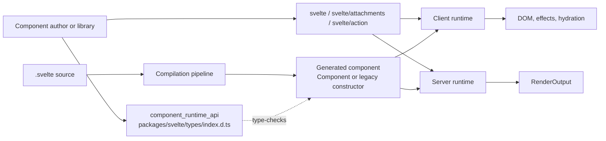
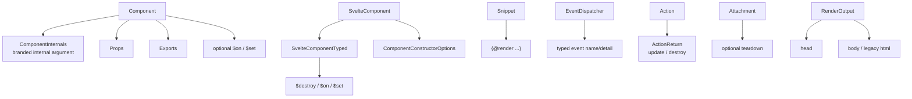
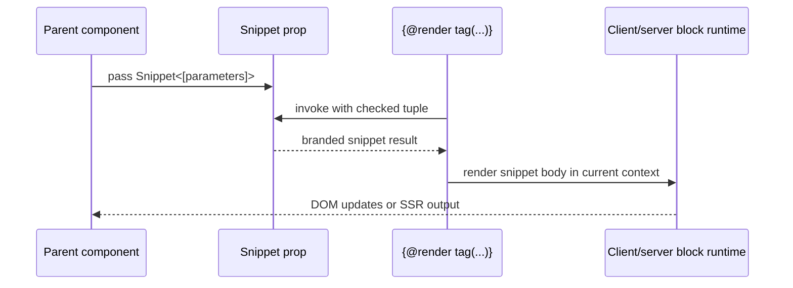
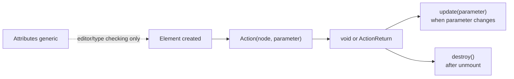
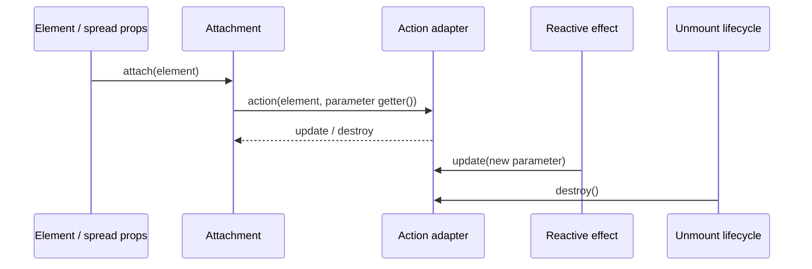
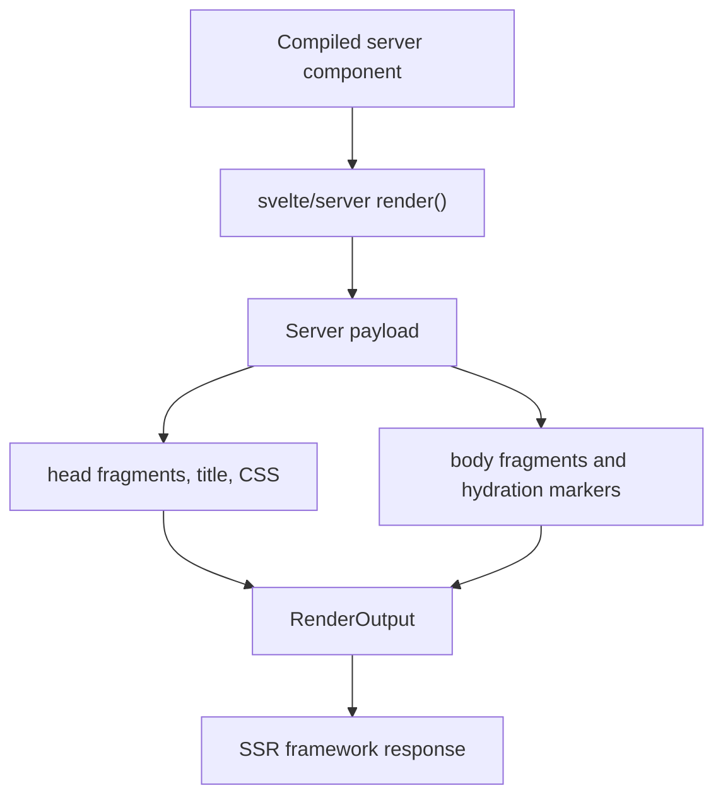
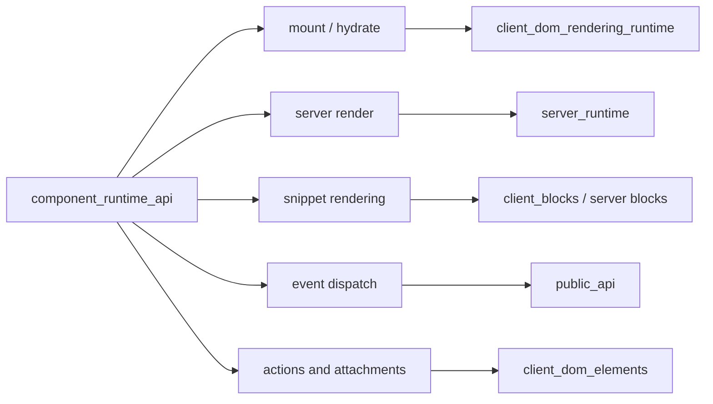
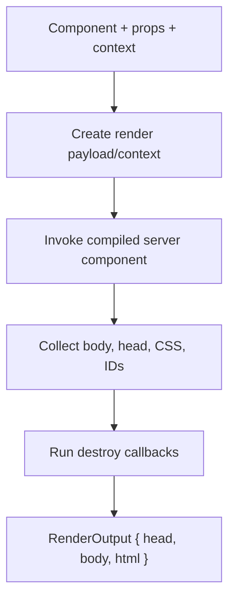

# component_runtime_api

`component_runtime_api` is Svelte's published TypeScript contract for component values and the
runtime-facing primitives used by component authors, libraries, and SSR integrations. Its source
is `packages/svelte/types/index.d.ts`. The declarations describe both the modern Svelte 5
function-shaped component model and the compatibility surface retained for Svelte 4-style class
components.

The module is primarily a type boundary: the implementations live in the public client/server
entry points and internal runtimes. For those implementations, see [public_api](public_api.md),
[client_render_and_templates](client_render_and_templates.md), [client_reactivity_core](client_reactivity_core.md),
and [server_rendering_and_shared_runtime_primitives](server_rendering_and_shared_runtime_primitives.md).
The compiler and AST contracts are documented in [compiler_api](compiler_api.md),
[template_ast](template_ast.md), and [compiler_ast_types](compiler_ast_types.md).

## Role in the system



The declarations connect three boundaries:

| Boundary | Main contracts | Consumer |
| --- | --- | --- |
| Component construction | `Component`, `ComponentInternals`, `ComponentProps`, `MountOptions` | `mount`, `hydrate`, component libraries |
| Component composition | `Snippet`, `EventDispatcher`, `Action`, `Attachment` | templates, library APIs, event/element integration |
| Runtime output | `RenderOutput` | `svelte/server` and SSR frameworks |

The same file also declares compiler, reactivity, store, transition, motion, and legacy modules.
Those declarations are related package entry points, but the current module focuses on the six
core published component/runtime types listed in the module tree.

## Type architecture



### Modern components

`Component<Props, Exports, Bindings>` models a compiled Svelte 5 component as a callable value:

```ts
type Component<Props, Exports, Bindings> = (
  internals: ComponentInternals,
  props: Props
) => Exports & {
  $on?: (type: string, callback: (event: any) => void) => () => void;
  $set?: (props: Partial<Props>) => void;
};
```

The actual declaration is an interface so it remains convenient to display in editor tooling. The
first argument is branded and reserved for Svelte; application code should pass components to
`mount` or `hydrate`, not invoke the component function directly. `Exports` represents values
exposed by the compiled component, and `Bindings` describes compile-time binding metadata only.
`element?: typeof HTMLElement` is present when the component was compiled as a custom element.

`ComponentProps<T>` extracts props from either a modern `Component` or a legacy
`SvelteComponent`. This is the principal library-author utility for coupling a component value
with a props object without duplicating its declaration.

### Legacy component types

`SvelteComponent` is the Svelte 4 class-shaped contract. It includes a constructor accepting
`ComponentConstructorOptions`, compatibility members `$destroy`, `$on`, and `$set`, and the
type-only fields `$$prop_def`, `$$events_def`, `$$slot_def`, and `$$bindings`.
`SvelteComponentTyped` is an event/slot-generic alias that extends it. Both are deprecated for
new code; `SvelteComponentTyped` is retained for generated declarations and migration tooling.

`ComponentConstructorOptions` describes the legacy imperative mount shape: a target, optional
anchor, props, context map, hydration/intro flags, recovery/synchronization controls, and an ID
prefix. The runtime compatibility adapters are described in
[legacy_compatibility_and_migration](legacy_compatibility_and_migration.md).

## Core component/runtime contracts

### `SvelteComponentTyped`

`SvelteComponentTyped<Props, Events, Slots>` preserves the familiar Svelte 4 type parameters:

- `Props` is the component input map.
- `Events` maps event names to event objects.
- `Slots` maps slot names to slot declarations.

It does not introduce a separate runtime implementation; it is a typed legacy class contract. New
component libraries should publish `Component<Props, Exports>` declarations and use
`ComponentProps` for inference. See [legacy_compatibility_and_migration](legacy_compatibility_and_migration.md)
for the runtime bridge.

### `Snippet`

`Snippet<Parameters>` is the callable type for a `#snippet` block. `Parameters` is a tuple, so
argument count and positions are checked when the snippet is rendered. A snippet returns an
opaque branded value that is intentionally valid only through `{@render ...}`; calling it as an
ordinary rendering function is not supported.



The runtime implementations for client snippets and raw snippets are documented in
[client_blocks_composition](client_blocks_composition.md) and
[server_rendering_and_shared_runtime_primitives](server_rendering_and_shared_runtime_primitives.md).

### `EventDispatcher`

`EventDispatcher<EventMap>` is a callable interface that derives its arguments from an event map.
The conditional tuple rules provide three useful forms:

| Event detail type | Dispatcher call |
| --- | --- |
| `null` or `undefined` | `dispatch('loaded')` or an optional detail |
| required value | `dispatch('change', value)` |
| nullable/optional value | `dispatch('optional')` or `dispatch('optional', value)` |

The optional `DispatchOptions` currently supports `cancelable`. At runtime the dispatcher creates
a non-bubbling `CustomEvent` and returns `false` when a listener prevents its default action.
Component events are deprecated in Svelte 5; callback props and `$host()` are preferred. The
behavioral implementation and event flow are documented in [public_api](public_api.md).

### `Action`

`Action<Element, Parameter, Attributes>` types a `use:` action. The action receives a matching
element and an optional parameter, and may return `ActionReturn<Parameter, Attributes>`:



`update` runs after Svelte applies markup updates. `destroy` runs after the element is unmounted.
The `Attributes` generic adds virtual properties/events to TypeScript checking; it has no runtime
effect. `$$_attributes` is a type-only carrier and must not be used by application code.

### `Attachment`

`Attachment<T>` is a function that runs when an `EventTarget` (normally an element) is mounted and
may return teardown logic. `createAttachmentKey()` enables library authors to expose an attachment
through an object spread, while `fromAction()` adapts an existing action to the attachment
protocol. The adapter accepts a getter for the action parameter so parameter reads can participate
in Svelte's effect tracking.



See [client_dom_elements](client_dom_elements.md) for element effects and
[public_api](public_api.md) for the action-to-attachment implementation relationship.

### `RenderOutput`

`RenderOutput` is the server-rendering result:

| Property | Meaning |
| --- | --- |
| `head` | HTML intended for the document head. |
| `body` | HTML intended for the document body. |
| `html` | Deprecated alias for `body`, retained for compatibility. |



`RenderOutput` is a data contract, not a renderer. Payload construction, context scoping, slots,
snippets, and HTML serialization belong to [server_runtime](server_runtime.md) and
[server_rendering_and_shared_runtime_primitives](server_rendering_and_shared_runtime_primitives.md).

## Interaction with public runtime APIs

The type contracts are consumed through environment-specific entry points:

| API | Uses this module's contract | Runtime destination |
| --- | --- | --- |
| `mount(component, options)` | `Component`, `ComponentProps`, `MountOptions` | client render runtime |
| `hydrate(component, options)` | `Component`/legacy component and props | hydration runtime |
| `unmount(handle)` | component handle returned by mount/hydrate | teardown and transitions |
| `render(component, options)` | component, props, `RenderOutput` | server payload runtime |
| `createEventDispatcher()` | `EventDispatcher` | component event callbacks |
| `{@render snippet(...)}` | `Snippet` | client/server snippet blocks |
| `use:action` / `{@attach ...}` | `Action`, `ActionReturn`, `Attachment` | element lifecycle |



## Process flows

### Client component lifecycle

```mermaid
flowchart TD
    INPUT["Component value + MountOptions"] --> VALIDATE["Validate target and props"]
    VALIDATE --> CREATE["Create component instance"]
    CREATE --> INIT["Initialize context, state, effects"]
    INIT --> RENDER["Create/update DOM"]
    RENDER --> HANDLE["Return exports/handle"]
    HANDLE --> CHANGE["State, prop, event, or binding change"]
    CHANGE --> SCHEDULE["Schedule reactive work"]
    SCHEDULE --> RENDER
    HANDLE --> REMOVE["unmount(handle)"]
    REMOVE --> OUTRO{ "outro enabled?" }
    OUTRO -->|yes| TRANSITION["Play outro transitions"]
    OUTRO -->|no| DESTROY["Destroy effects and actions"]
    TRANSITION --> DESTROY
```

The declarations describe the inputs and outputs of this flow; scheduling, DOM operations,
bindings, and transitions are implemented in [client_reactivity_core](client_reactivity_core.md),
[client_render_and_templates](client_render_and_templates.md), and [client_blocks](client_blocks.md).

### Server rendering lifecycle



Unlike client mounting, server rendering does not create browser nodes or run client effects.
Environment-specific behavior is supplied by [public_api](public_api.md) and the server runtime.

## Compatibility and migration guidance

- Prefer `Component<Props, Exports>` over `SvelteComponentTyped` for new library declarations.
- Prefer `mount` over directly constructing a `SvelteComponent`.
- Prefer callback props and `$host()` over `EventDispatcher` for new Svelte 5 components.
- Prefer attachments for new element composition, using `fromAction` when bridging an existing action library.
- Treat `$$prop_def`, `$$events_def`, `$$slot_def`, `$$bindings`, `$on`, `$set`, `$destroy`, and `html` as compatibility/type-support surfaces.

The migration implementations and legacy client/server adapters are documented in
[legacy_compatibility_and_migration](legacy_compatibility_and_migration.md). Related motion,
store, and transition declarations are documented separately in [reactive_state_and_stores_library](reactive_state_and_stores_library.md),
[motion_and_visual_effects_library](motion_and_visual_effects_library.md), and
[transitions](transitions.md).

## Maintenance notes

Changes to this declaration surface can affect generated component declarations, IDE inference,
Svelte language tooling, and both client and server entry points. When modifying a core contract:

1. Update the corresponding implementation and compatibility adapter.
2. Verify modern and legacy component inference with TypeScript tests.
3. Check client mounting/hydration and server `RenderOutput` consumers.
4. Keep deprecated aliases until the associated migration path is intentionally removed.

## Related documentation

- [public_api](public_api.md) — package entry points and runtime implementation mapping.
- [client_reactivity_core](client_reactivity_core.md) — effects, signals, scheduling, and cleanup.
- [client_render_and_templates](client_render_and_templates.md) — mounting, hydration, templates, and DOM updates.
- [client_dom_elements](client_dom_elements.md) — actions, attachments, attributes, events, and element effects.
- [server_runtime](server_runtime.md) — payloads and SSR serialization.
- [server_rendering_and_shared_runtime_primitives](server_rendering_and_shared_runtime_primitives.md) — shared server primitives.
- [compiler_api](compiler_api.md) — compiler-facing public declarations.
- [template_ast](template_ast.md) — modern template AST declarations.
- [legacy_compatibility_and_migration](legacy_compatibility_and_migration.md) — Svelte 4 compatibility.
