# Component System Module

The component_system module serves as the primary interface for Svelte's component architecture, providing the core types and abstractions that define how components are created, instantiated, and interact within the Svelte ecosystem. This module bridges the gap between Svelte 4's class-based components and Svelte 5's function-based components while maintaining backward compatibility.

## Architecture Overview

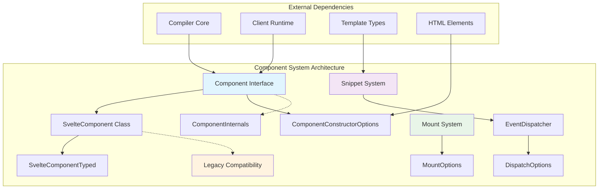

## Core Components

### Component Interface (Svelte 5)

The modern `Component` interface represents the new function-based component architecture in Svelte 5:

```typescript
interface Component<
    Props extends Record<string, any> = {},
    Exports extends Record<string, any> = {},
    Bindings extends keyof Props | '' = string
>
```

**Key Features:**
- Function-based component signature
- Generic type parameters for props, exports, and bindings
- Internal component management through `ComponentInternals`
- Optional custom element support
- Type-only binding information

### SvelteComponent Class (Legacy)

The `SvelteComponent` class provides backward compatibility for Svelte 4 components:

```typescript
class SvelteComponent<
    Props extends Record<string, any> = Record<string, any>,
    Events extends Record<string, any> = any,
    Slots extends Record<string, any> = any
>
```

**Legacy Methods:**
- `$destroy()`: Component cleanup
- `$on()`: Event listener registration
- `$set()`: Reactive property updates

### Component Instantiation

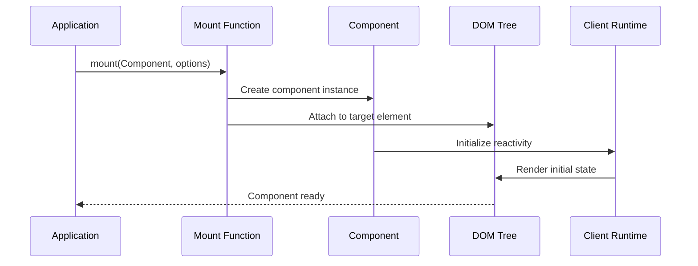

## Component Lifecycle

### Modern Component Flow (Svelte 5)

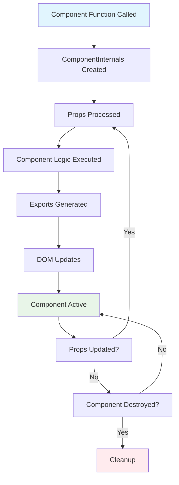

### Legacy Component Flow (Svelte 4)

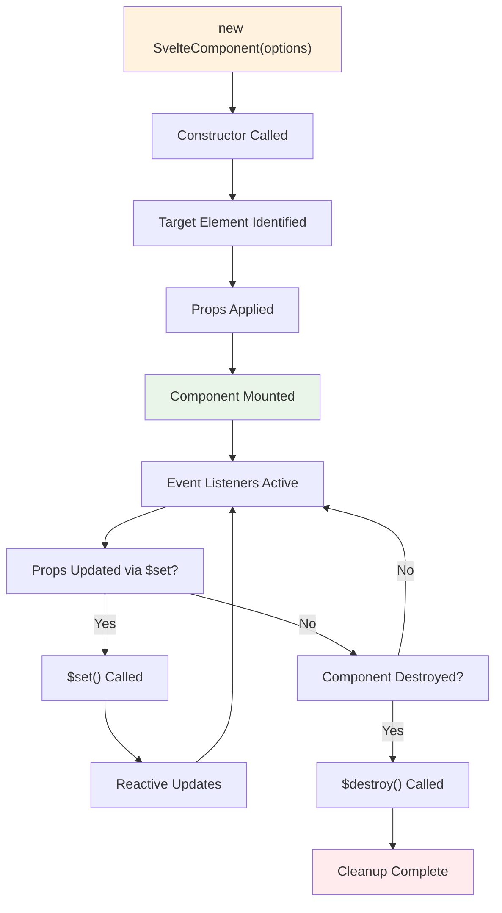

## Event System

### EventDispatcher Architecture

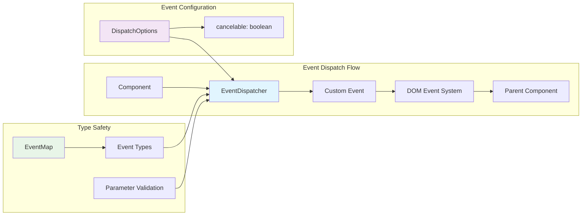

The EventDispatcher provides type-safe event emission:

```typescript
interface EventDispatcher<EventMap extends Record<string, any>> {
    <Type extends keyof EventMap>(
        ...args: [type: Type, parameter: EventMap[Type], options?: DispatchOptions]
    ): boolean;
}
```

## Snippet System

### Snippet Architecture

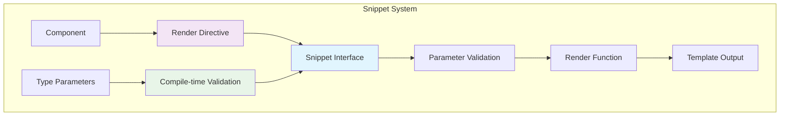

Snippets provide reusable template fragments with type safety:

```typescript
interface Snippet<Parameters extends unknown[] = []> {
    (...args: Parameters): SnippetReturn;
}
```

## Component Mounting

### Mount Options Flow

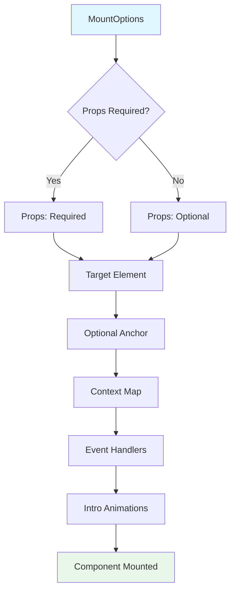

## Integration with Other Modules

### Compiler Integration

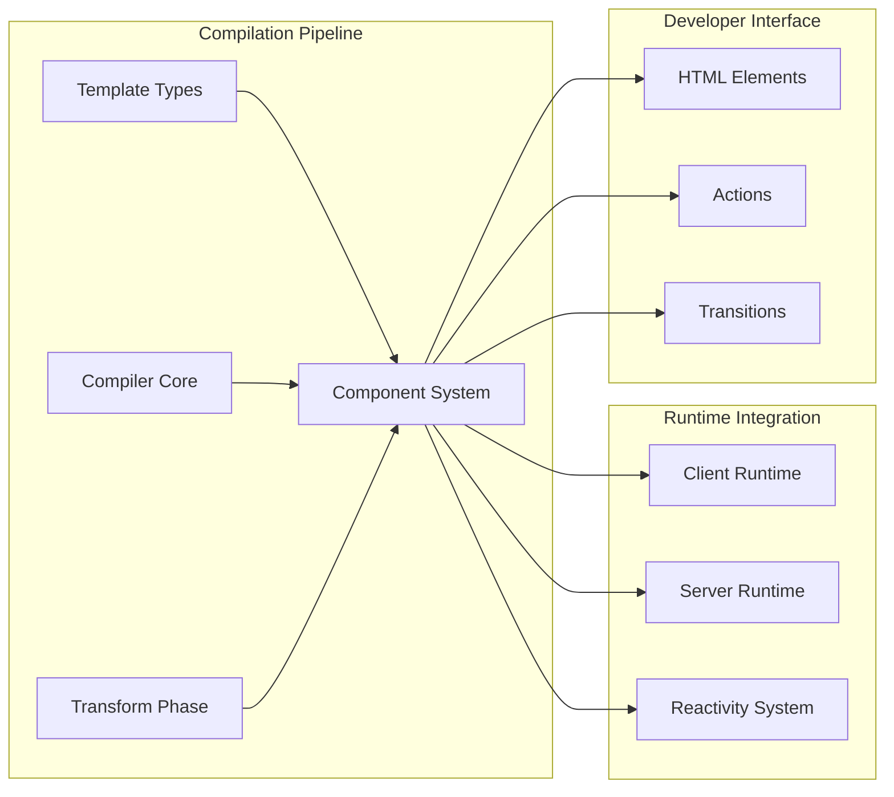

**Key Relationships:**
- **[Compiler Core](compiler_core.md)**: Transforms component definitions into executable code
- **[Client Runtime](client_runtime.md)**: Provides reactivity and DOM management
- **[Template Types](compiler_types.md)**: Defines the structure of component templates
- **[HTML Elements](html_elements.md)**: Provides type definitions for DOM elements

### Type System Dependencies

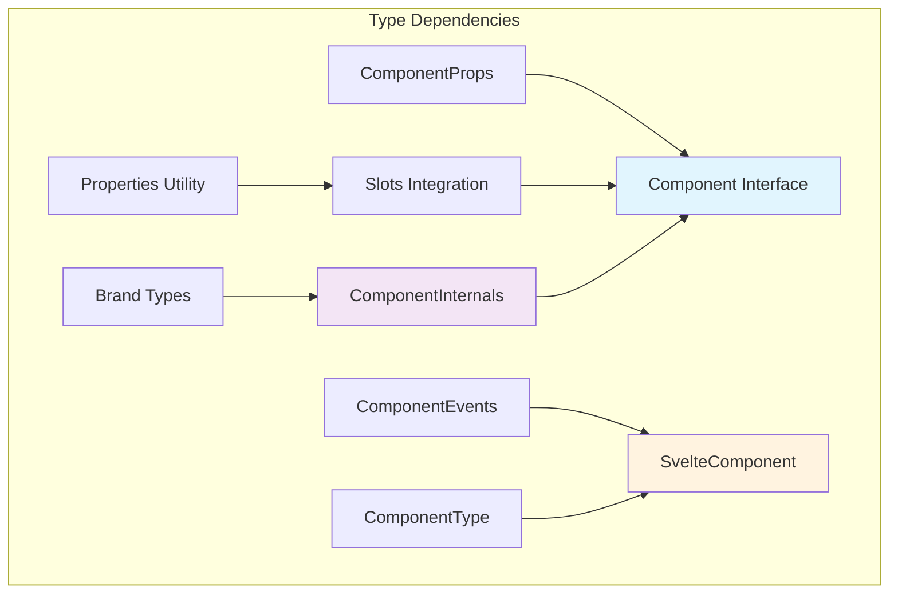

## Migration Considerations

### Svelte 4 to Svelte 5 Migration

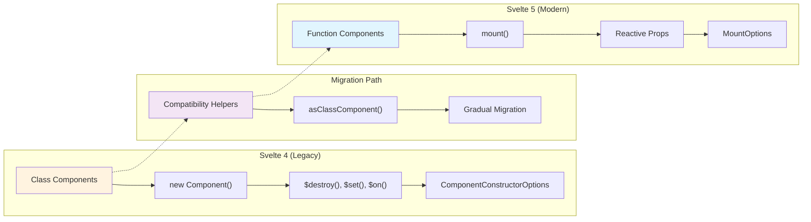

## Usage Patterns

### Component Definition

```typescript
// Svelte 5 Component Type
const MyComponent: Component<
    { title: string; count: number },  // Props
    { getValue: () => number },        // Exports
    'count'                           // Bindings
> = (internals, props) => {
    // Component implementation
    return {
        getValue: () => props.count
    };
};
```

### Component Mounting

```typescript
import { mount } from 'svelte';
import MyComponent from './MyComponent.svelte';

const instance = mount(MyComponent, {
    target: document.getElementById('app'),
    props: {
        title: 'Hello World',
        count: 42
    },
    intro: true
});
```

### Event Handling

```typescript
import { createEventDispatcher } from 'svelte';

const dispatch: EventDispatcher<{
    click: { x: number; y: number };
    change: string;
}> = createEventDispatcher();

// Type-safe event dispatch
dispatch('click', { x: 100, y: 200 });
dispatch('change', 'new value');
```

## Performance Considerations

### Component Optimization

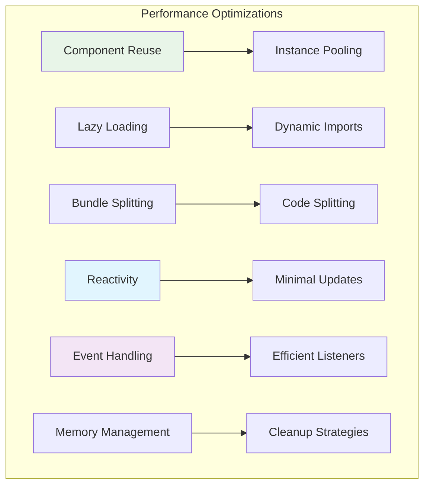

**Optimization Strategies:**
- Use function components (Svelte 5) for better performance
- Implement proper cleanup in component destruction
- Leverage type safety to prevent runtime errors
- Utilize snippet system for reusable template logic

## Error Handling

### Component Error Boundaries

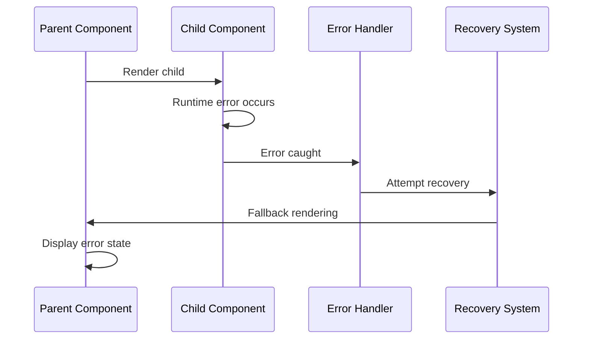

## Best Practices

### Component Design Principles

1. **Type Safety**: Always use proper TypeScript types for props, events, and exports
2. **Single Responsibility**: Keep components focused on a single concern
3. **Composition**: Use snippets and slots for flexible component composition
4. **Performance**: Prefer function components over class components
5. **Migration**: Use compatibility helpers during gradual migration from Svelte 4 to 5

### Common Patterns

```typescript
// Generic component with constraints
interface ButtonProps {
    variant: 'primary' | 'secondary';
    size: 'small' | 'medium' | 'large';
    disabled?: boolean;
}

const Button: Component<ButtonProps> = (internals, props) => {
    // Component implementation
};

// Component with complex event handling
interface FormEvents {
    submit: { data: FormData };
    cancel: void;
    validate: { field: string; valid: boolean };
}

const Form: Component<FormProps, FormExports> = (internals, props) => {
    const dispatch: EventDispatcher<FormEvents> = createEventDispatcher();
    // Implementation
};
```

The component_system module serves as the foundation for all Svelte component interactions, providing a robust type system and flexible architecture that supports both legacy and modern component patterns while maintaining excellent developer experience and runtime performance.