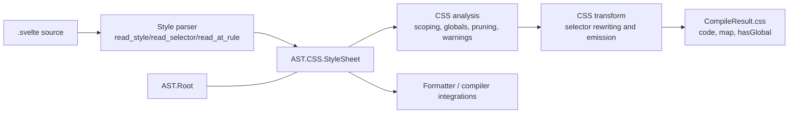
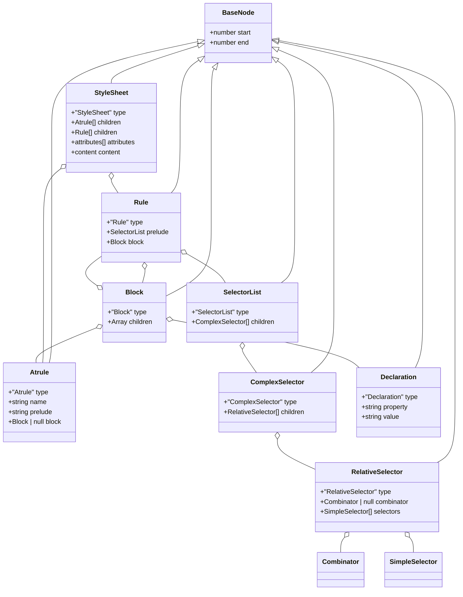
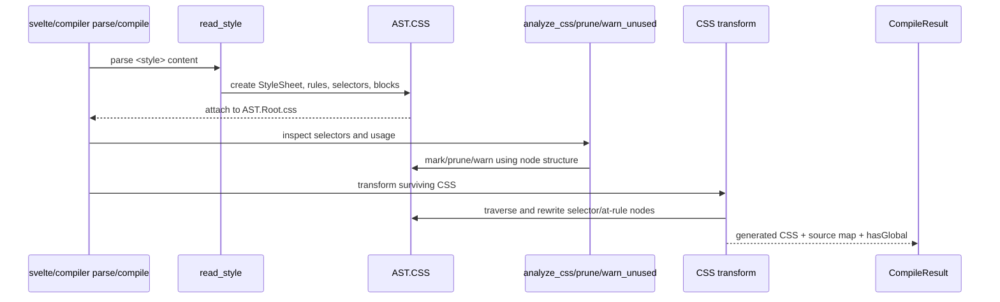
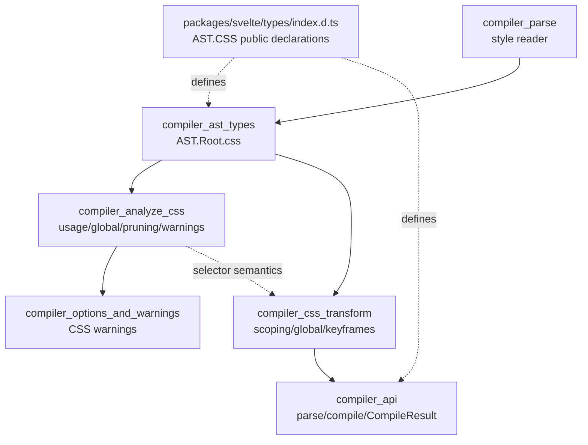

# CSS AST

The `css_ast` module defines the typed intermediate representation for CSS embedded in a Svelte component. It describes stylesheets, at-rules, rules, selectors, declarations, and source locations without implementing parsing or transformation itself. The representation is exposed through `svelte/compiler` as `AST.CSS` and is also re-exported through the published type surface.

The module is therefore a contract between the style parser, CSS analysis passes, CSS rewriting, diagnostics, and consumers such as formatters and compiler integrations. For the surrounding component AST and compiler pipeline, see [template_ast](template_ast.md), [compiler_parse](compiler_parse.md), [compiler_analyze_css](compiler_analyze_css.md), [compiler_css_transform](compiler_css_transform.md), and [compiler_api](compiler_api.md).

## Position in the compiler

CSS is parsed as part of a component's `<style>` block. The resulting `StyleSheet` is attached to the component `Root` as `root.css`; it is not a separate runtime subsystem. Later compiler phases inspect and rewrite this tree while generating component CSS and warnings.



The public compiler entry points return the tree through `CompileResult.ast` and through `parse(..., { modern: true })`. The declarations for these entry points and result metadata belong to [compiler_api](compiler_api.md); this document focuses on the CSS subtree itself.

## Design principles

### A loss-aware, source-oriented tree

Every CSS node extends `BaseNode`, which carries `start` and `end` offsets. These offsets refer to the original component source and allow diagnostics, source maps, formatting, and transformations to preserve location information. The AST stores structured syntax where compiler behavior depends on it, while retaining raw strings for CSS fragments whose grammar is intentionally not modeled in detail.

### Separate selector structure from declaration structure

Selectors are represented as a hierarchy of lists, complex selectors, relative selectors, combinators, and simple selectors. A rule body is a generic `Block` containing declarations and nested rules/at-rules. This lets the analyzer reason about selector semantics independently from property-value text.

### Public types, internal construction

The declarations are in `packages/svelte/types/index.d.ts` under `svelte/compiler` → `AST` → `_CSS`. `_CSS` is an implementation-oriented namespace, but it is exported as `AST.CSS` with:

```ts
export type { _CSS as CSS };
```

Consumers should treat node `type` discriminants as the stable way to narrow unions. Node objects are produced by the compiler parser; the types do not imply that applications should construct or mutate them manually.

## AST hierarchy

The tree has four principal layers:

1. `StyleSheet` is the document root for a `<style>` block.
2. `Rule` and `Atrule` represent top-level and nested CSS constructs.
3. `SelectorList` through `SimpleSelector` model selector syntax.
4. `Block` and `Declaration` model rule contents.



## Node reference

### `BaseNode`

```ts
interface BaseNode {
  start: number;
  end: number;
}
```

All CSS nodes include half-open source offsets conceptually suitable for slicing the original source. The type does not include a `type` field because the concrete interfaces declare their own string literal discriminants.

### `StyleSheet`

`StyleSheet` represents the content of one Svelte `<style>` element:

- `type: 'StyleSheet'`
- `attributes: any[]`, retaining style-tag attributes for parser/compiler use
- `children: Array<Atrule | Rule>`, the top-level CSS statements
- `content.start` and `content.end`, plus the raw `content.styles`
- `content.comment`, an optional comment associated with the style tag

The sheet is optional on `AST.Root`: a component without a `<style>` block has `root.css === null`. The `Root` contract and related template nodes are documented in [compiler_ast_types](compiler_ast_types.md) and [template_ast](template_ast.md).

### `Rule`

`Rule` represents a selector followed by a block, for example `.card, button:hover { ... }`:

- `prelude: SelectorList` contains structured selectors
- `block: Block` contains declarations and, where supported, nested CSS constructs

The selector is not stored as a single string. This is important for scoped CSS, where the transform must identify and rewrite individual selector components.

### `Atrule`

`Atrule` represents an at-rule such as `@media`, `@supports`, `@layer`, or `@keyframes`:

- `name` is the at-rule name
- `prelude` is the raw text after the name
- `block` is either a nested `Block` or `null` for statement-style at-rules

The generic shape allows CSS-specific passes to interpret only the at-rules relevant to them. Keyframe detection is handled by the compiler's CSS helpers; see [compiler_css_transform](compiler_css_transform.md).

### `Block` and `Declaration`

`Block.children` can contain `Declaration`, `Rule`, and `Atrule`, enabling nested CSS structures. A declaration stores `property` and `value` as strings. Property values are deliberately opaque to this AST contract; parsing and transformation can preserve custom properties, vendor syntax, functions, and arbitrary CSS value text without requiring a second value grammar.

## Selector model

Selectors are modeled from broadest to narrowest:

```mermaid
flowchart TD
    SL[SelectorList\ncomma-separated selectors] --> CS1[ComplexSelector]
    CS1 --> RS1[RelativeSelector\nfirst segment]
    CS1 --> RS2[RelativeSelector\nsubsequent segment]
    RS2 --> C[Combinator\n>, +, ~, whitespace, ...]
    RS1 --> Simple[SimpleSelector[]]
    RS2 --> Simple2[SimpleSelector[]]
    Simple --> Type[TypeSelector]
    Simple --> Id[IdSelector]
    Simple --> Class[ClassSelector]
    Simple --> Attr[AttributeSelector]
    Simple --> Pseudo[PseudoClassSelector]
    Simple --> PE[PseudoElementSelector]
    Simple --> Nest[NestingSelector]
    Simple --> Nth[Nth / Percentage]
    Pseudo --> Nested[SelectorList args, optional]
```

### Lists and combinators

- `SelectorList.children` is the comma-separated selector list (`a, b, c`).
- `ComplexSelector.children` is the ordered sequence of selector segments in one complex selector (`a > b:is(.x)`).
- `RelativeSelector.combinator` is `null` for the first segment and identifies the relationship for later segments.
- `Combinator.name` stores the combinator spelling.

This decomposition preserves both selector order and relationship semantics, which are required when adding Svelte's scoped class/hash to a selector without changing its meaning.

### Simple selectors

The `SimpleSelector` union contains:

| Node | Meaning | Important fields |
| --- | --- | --- |
| `TypeSelector` | Element/type selector, such as `button` | `name` |
| `IdSelector` | ID selector, such as `#app` | `name` |
| `ClassSelector` | Class selector, such as `.card` | `name` |
| `AttributeSelector` | Attribute selector, such as `[role="tab"]` | `name`, `matcher`, `value`, `flags` |
| `PseudoClassSelector` | Pseudo-class, such as `:global(...)` or `:not(...)` | `name`, optional nested `args` |
| `PseudoElementSelector` | Pseudo-element, such as `::before` | `name` |
| `NestingSelector` | CSS nesting marker `&` | `name: '&'` |
| `Nth` | Nth-expression fragment | `value` |
| `Percentage` | Percentage selector/value fragment | `value` |

`PseudoClassSelector.args` is another `SelectorList` when the pseudo-class accepts selector arguments. This recursive shape supports nested selector functions without flattening them into strings.

## Parsing and processing flow

The CSS AST is created by the style reader in the parse phase and consumed by analysis and transformation. The surrounding parser state machine is documented in [compiler_parse_readers_style](compiler_parse_readers_style.md) and [compiler_parse_state_machine](compiler_parse_state_machine.md).



The AST itself does not decide whether a selector is used, global, or scoped. Those policies belong to [compiler_analyze_css](compiler_analyze_css.md) and [compiler_css_transform](compiler_css_transform.md). Likewise, Svelte markup nodes that CSS analysis compares against are covered by [template_ast](template_ast.md).

## Component interactions and dependencies



The most relevant relationships are:

- **Parser → AST:** `read_style`, `read_selector`, `read_at_rule`, and `read_declaration` construct the concrete node shapes.
- **AST → analysis:** CSS analysis walks `StyleSheet`, `Rule`, selector nodes, and blocks to determine globality, possible matches, unused selectors, and pruning decisions.
- **AST → transform:** CSS transformation rewrites selectors and at-rules, removes global pseudo-class wrappers where appropriate, and emits CSS.
- **AST → public API:** `AST.CSS` is nested under the modern compiler AST, while `CompileResult.css` exposes generated output rather than the intermediate tree.

## Example shape

For a style block conceptually equivalent to:

```css
.card > button:hover { color: red; }
```

the important structure is:

```text
StyleSheet
└── Rule
    ├── prelude: SelectorList
    │   └── ComplexSelector
    │       ├── RelativeSelector(combinator: null)
    │       │   └── ClassSelector("card")
    │       └── RelativeSelector(combinator: ">")
    │           ├── TypeSelector("button")
    │           └── PseudoClassSelector("hover", args: null)
    └── block: Block
        └── Declaration(property: "color", value: "red")
```

Exact offsets are present on every node but omitted from the sketch. A compiler transform can therefore identify `.card` and `button:hover` independently, preserve the `>` relationship, and emit a scoped equivalent.

## Invariants and maintenance guidance

- Use the `type` literal as the discriminant when traversing nodes.
- Preserve `start`/`end` offsets when cloning or rewriting nodes used for diagnostics or source maps.
- Treat `Block.children` as heterogeneous; declarations, nested rules, and at-rules may coexist.
- Treat selector arguments recursively: `PseudoClassSelector.args` may contain another complete selector list.
- Do not assume every `Atrule` has a block; statement-style at-rules use `block: null`.
- Do not parse declaration values or at-rule preludes as selector nodes unless a consuming pass explicitly requires it; they are intentionally strings in this contract.
- Keep public type changes synchronized with parser construction and all CSS visitors. A new node kind must be reflected in the `Node`, `SimpleSelector`, or container unions as applicable.

## Related documentation

- [compiler_parse_readers_style](compiler_parse_readers_style.md) — style parsing and CSS node construction.
- [compiler_analyze_css](compiler_analyze_css.md) — selector analysis, global detection, pruning, and unused-selector warnings.
- [compiler_css_transform](compiler_css_transform.md) — scoped CSS rewriting and CSS emission.
- [compiler_ast_types](compiler_ast_types.md) — modern component AST and the `Root.css` attachment point.
- [compiler_api](compiler_api.md) — `parse`, `compile`, `CompileResult`, and public compiler types.
- [compiler_core](compiler_core.md) — orchestration of compiler phases.

