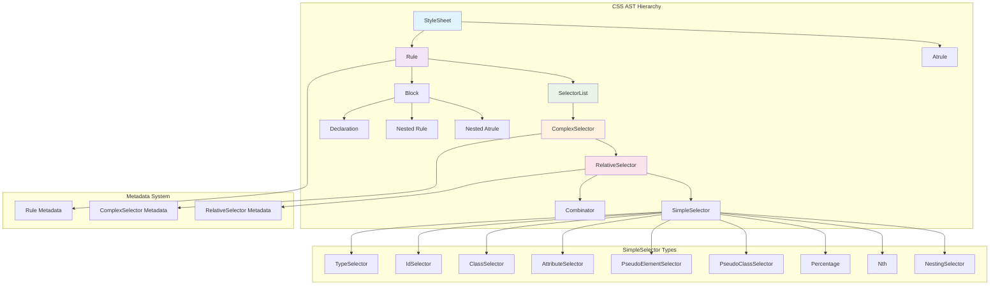
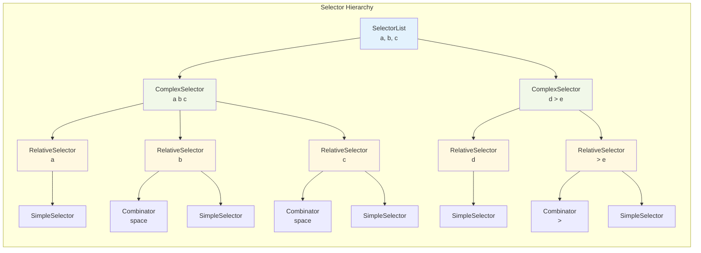
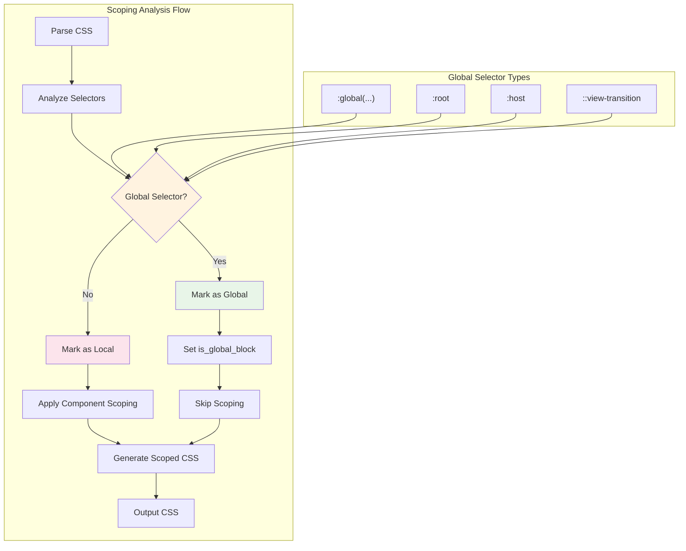
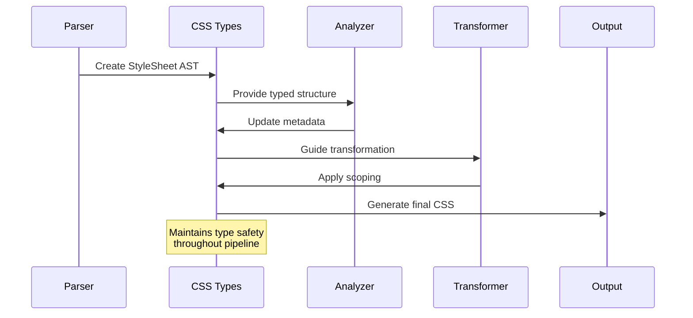

# CSS Types Module

The CSS Types module provides comprehensive TypeScript type definitions for representing CSS Abstract Syntax Trees (AST) within the Svelte compiler. This module defines the structure and relationships of CSS elements as they are parsed, analyzed, and transformed during the compilation process.

## Overview

The CSS Types module serves as the foundational type system for CSS processing in Svelte, enabling:

- **CSS Parsing**: Type-safe representation of parsed CSS structures
- **Selector Analysis**: Detailed modeling of CSS selectors and their relationships
- **Scoping Support**: Metadata for CSS scoping and global selector handling
- **Compiler Integration**: Seamless integration with Svelte's compilation pipeline

This module is essential for the [compiler_core](compiler_core.md) module's CSS processing phases and works closely with the [compiler_types](compiler_types.md) module for template-CSS integration.

## Architecture



## Core Components

### StyleSheet
The root container for all CSS content within a Svelte component.

```typescript
interface StyleSheet extends BaseNode {
  type: 'StyleSheet';
  attributes: any[];
  children: Array<Atrule | Rule>;
  content: {
    start: number;
    end: number;
    styles: string;
    comment: AST.Comment | null;
  };
}
```

**Key Features:**
- Contains all CSS rules and at-rules
- Preserves original source content and positioning
- Supports comment preservation
- Integrates with template AST through comment references

### Rule System

#### Rule
Represents a CSS rule with selectors and declarations.

```typescript
interface Rule extends BaseNode {
  type: 'Rule';
  prelude: SelectorList;
  block: Block;
  metadata: {
    parent_rule: null | Rule;
    has_local_selectors: boolean;
    has_global_selectors: boolean;
    is_global_block: boolean;
  };
}
```

**Metadata Properties:**
- `parent_rule`: Supports nested CSS rules
- `has_local_selectors`: Indicates component-scoped selectors
- `has_global_selectors`: Identifies global selector usage
- `is_global_block`: Marks entire rule blocks as global

#### Declaration
Represents CSS property-value pairs.

```typescript
interface Declaration extends BaseNode {
  type: 'Declaration';
  property: string;
  value: string;
}
```

### Selector System



#### SelectorList
Groups multiple complex selectors (comma-separated).

#### ComplexSelector
Represents a complete selector chain with metadata for scoping analysis.

```typescript
interface ComplexSelector extends BaseNode {
  type: 'ComplexSelector';
  children: RelativeSelector[];
  metadata: {
    rule: null | Rule;
    is_global: boolean;
    used: boolean;
  };
}
```

#### RelativeSelector
Individual selector components with combinators.

```typescript
interface RelativeSelector extends BaseNode {
  type: 'RelativeSelector';
  combinator: null | Combinator;
  selectors: SimpleSelector[];
  metadata: {
    is_global: boolean;
    is_global_like: boolean;
    scoped: boolean;
  };
}
```

### Simple Selectors

The module provides comprehensive support for all CSS selector types:

- **TypeSelector**: Element selectors (`div`, `span`)
- **IdSelector**: ID selectors (`#header`)
- **ClassSelector**: Class selectors (`.button`)
- **AttributeSelector**: Attribute selectors (`[type="text"]`)
- **PseudoElementSelector**: Pseudo-elements (`::before`)
- **PseudoClassSelector**: Pseudo-classes (`:hover`, `:is()`)
- **Percentage**: Percentage values in selectors
- **Nth**: Nth-child expressions (`2n+1`)
- **NestingSelector**: CSS nesting selector (`&`)

## Scoping and Global Handling



The metadata system enables sophisticated scoping behavior:

1. **Global Detection**: Identifies `:global()`, `:root`, `:host`, and other global-like selectors
2. **Scoping Application**: Determines which selectors need component scoping
3. **Usage Tracking**: Tracks selector usage for optimization
4. **Nested Rules**: Supports CSS nesting with proper scope inheritance

## Integration Points

### Compiler Core Integration
- **Parsing Phase**: Consumed by CSS parser in [parsing_phase](compiler_core.md#parsing-phase)
- **Analysis Phase**: Used for selector analysis and scoping decisions
- **Transform Phase**: Guides CSS transformation and scoping application

### Template Integration
- **Component Styles**: Links with component template types from [template_types](compiler_types.md)
- **Style Attributes**: Supports inline style processing
- **CSS-in-JS**: Enables dynamic style generation

## Data Flow



## Usage Examples

### Basic Rule Structure
```typescript
const rule: _CSS.Rule = {
  type: 'Rule',
  start: 0,
  end: 20,
  prelude: selectorList,
  block: declarationBlock,
  metadata: {
    parent_rule: null,
    has_local_selectors: true,
    has_global_selectors: false,
    is_global_block: false
  }
};
```

### Complex Selector with Metadata
```typescript
const complexSelector: _CSS.ComplexSelector = {
  type: 'ComplexSelector',
  start: 0,
  end: 10,
  children: [relativeSelector],
  metadata: {
    rule: parentRule,
    is_global: false,
    used: true
  }
};
```

### Global Selector Handling
```typescript
const globalSelector: _CSS.RelativeSelector = {
  type: 'RelativeSelector',
  start: 0,
  end: 15,
  combinator: null,
  selectors: [pseudoClassSelector],
  metadata: {
    is_global: true,
    is_global_like: true,
    scoped: false
  }
};
```

## Related Modules

- **[compiler_core](compiler_core.md)**: Uses CSS types throughout compilation phases
- **[compiler_types](compiler_types.md)**: Integrates with template and component types
- **[preprocessor](preprocessor.md)**: May transform CSS before type application

## Type Safety Benefits

1. **Compile-time Validation**: Ensures CSS AST structure integrity
2. **IntelliSense Support**: Provides rich IDE support for CSS manipulation
3. **Refactoring Safety**: Enables safe CSS transformation operations
4. **Metadata Consistency**: Guarantees consistent scoping metadata
5. **Integration Reliability**: Ensures reliable compiler phase communication

The CSS Types module forms the backbone of Svelte's CSS processing capabilities, providing the type safety and structure necessary for sophisticated CSS compilation features like component scoping, optimization, and integration with the template system.