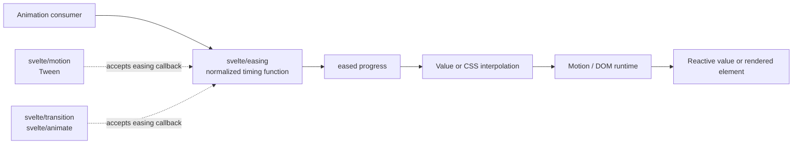
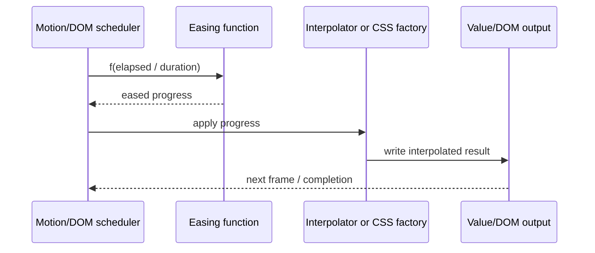
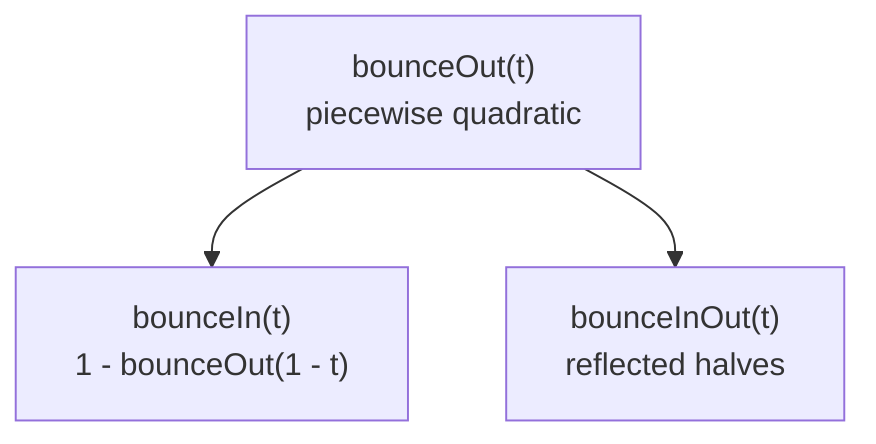
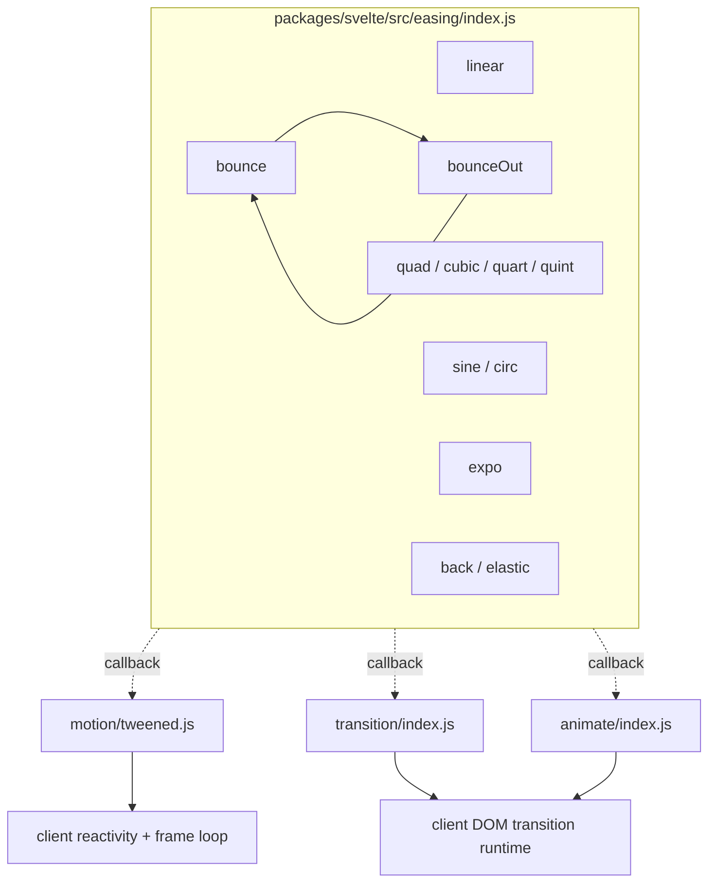
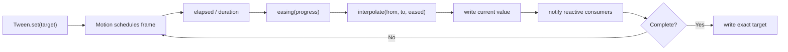
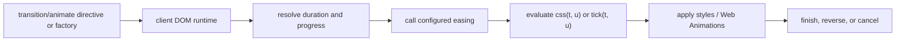

# Easing

The `easing` module is Svelte's collection of pure timing functions. Each function maps normalized animation progress `t` to an eased progress value, allowing an animation to accelerate, decelerate, overshoot, bounce, or oscillate while the consumer remains responsible for interpolation, frame scheduling, and lifecycle management.

The implementation lives in `packages/svelte/src/easing/index.js`. It is deliberately small and dependency-free: every export is a synchronous function of one numeric argument. The functions are used by value tweens and visual-effect factories; their consumers and schedulers are documented in [`motion.md`](motion.md), [`transitions.md`](transitions.md), [`animations.md`](animations.md), and [`client_dom_elements_transitions.md`](client_dom_elements_transitions.md).

## Position in the system



Easing owns the time-curve calculation only. In particular, it does not:

- interpolate between two values;
- read or write reactive state;
- schedule `requestAnimationFrame` work;
- inspect DOM or computed styles;
- create a transition or animation configuration; or
- clamp input into the `[0, 1]` interval.

This separation lets the same curve be supplied to a [`Tween`](motion.md#tween-apis), a transition factory, or the [`flip`](animations.md#flip-algorithm) animation factory.

## Public exports

The module exports 31 functions: one linear curve and ten families with `In`, `Out`, and `InOut` variants.

| Family | `In` | `Out` | `InOut` | Character |
| --- | --- | --- | --- | --- |
| Linear | — | — | — | Constant-rate progress |
| Quad | `quadIn` | `quadOut` | `quadInOut` | Quadratic acceleration/deceleration |
| Cubic | `cubicIn` | `cubicOut` | `cubicInOut` | Cubic acceleration/deceleration |
| Quart | `quartIn` | `quartOut` | `quartInOut` | Fourth-power curve |
| Quint | `quintIn` | `quintOut` | `quintInOut` | Fifth-power curve |
| Sine | `sineIn` | `sineOut` | `sineInOut` | Sinusoidal, smooth endpoints |
| Circ | `circIn` | `circOut` | `circInOut` | Circular square-root curve |
| Expo | `expoIn` | `expoOut` | `expoInOut` | Exponential acceleration/deceleration |
| Back | `backIn` | `backOut` | `backInOut` | Briefly overshoots an endpoint |
| Elastic | `elasticIn` | `elasticOut` | `elasticInOut` | Oscillatory spring-like motion |
| Bounce | `bounceIn` | `bounceOut` | `bounceInOut` | Piecewise bouncing motion |

`linear(t)` is the identity function. All other curves are organized around the conventional meanings below:

- `In`: starts slowly and accelerates toward the destination.
- `Out`: starts quickly and decelerates toward the destination.
- `InOut`: combines an `In` half and an `Out` half around `t = 0.5`.

The functions are named in camel case (`cubicInOut`), matching the source exports. Consumers may use any function with the common callback shape `(t: number) => number`.

## Mathematical model

For an animation from `from` to `to`, a consumer typically evaluates:

```js
const progress = easing(elapsed / duration);
const value = interpolate(from, to, progress);
```

The easing module supplies the first operation only. For a scalar interpolation, the usual second operation is `from + (to - from) * progress`; composite values and DOM styles use consumer-specific interpolation. [`motion.md`](motion.md#tween-process-and-cancellation) documents how `Tween` applies the callback to numbers, dates, arrays, and objects.



The intended input domain is `0 <= t <= 1`, with endpoints representing the start and end of an animation. The implementation does not validate or clamp `t`; values outside that interval are passed through the formulas and may produce overshoot, `NaN`, or other mathematically expected results. Consumers that accept arbitrary progress should normalize or clamp it before calling a curve.

## Function families

### Linear

`linear(t)` returns `t` unchanged. It is the baseline for constant-rate motion and has no separate directional variants.

### Polynomial families

The `quad`, `cubic`, `quart`, and `quint` families use powers of `t` for `In` curves. Their `Out` variants reflect the corresponding curve around the endpoint, and `InOut` variants split the domain at the midpoint and rescale each half.

The core `In` formulas are:

| Function | Formula |
| --- | --- |
| `quadIn` | `t²` |
| `cubicIn` | `t³` |
| `quartIn` | `t⁴` |
| `quintIn` | `t⁵` |

Higher powers produce a longer initial slow phase and a sharper finish. The implementation uses multiplication for cubic/quint curves and `Math.pow` for quartic curves; this is an implementation detail, not a behavioral API guarantee.

### Sine and circular families

`sineIn`, `sineOut`, and `sineInOut` use cosine/sine quarter- and half-waves. They provide smooth, low-intensity acceleration without the sharper shape of polynomial or exponential curves. `sineIn` includes a small floating-point endpoint correction: when the cosine result is effectively zero, it returns exactly `1`.

The `circ` family uses the unit-circle relationship `sqrt(1 - t²)`. It provides a stronger ease than sine while remaining bounded for the normal input domain. As with all families, invalid out-of-domain values are not guarded against.

### Exponential family

`expoIn`, `expoOut`, and `expoInOut` use powers of two. Explicit endpoint branches return `0` and `1` exactly, avoiding the small nonzero values that exponentials would otherwise produce at the boundaries:

```text
expoIn(0)  = 0
expoOut(1) = 1
expoInOut(0) = 0
expoInOut(1) = 1
```

This family gives very slow motion at one endpoint and a pronounced acceleration near the other.

### Back family

`backIn`, `backOut`, and `backInOut` use the overshoot constant `1.70158` (scaled for `backInOut`). The curve intentionally moves slightly beyond the endpoint before returning, producing anticipation or follow-through. This means the output can be below `0` or above `1` even when `t` is in `[0, 1]`; consumers should not assume every easing result is bounded.

### Elastic family

The elastic variants combine sine oscillation with exponential growth or decay. `elasticIn` oscillates while building toward the start-to-end movement, `elasticOut` oscillates while settling at the end, and `elasticInOut` applies both behaviors around the midpoint. These curves are intentionally non-monotonic and can overshoot in both directions.

### Bounce family

`bounceOut` is the primitive bounce curve. It divides the input into four intervals using the boundaries `4/11`, `8/11`, and `9/10`, then applies a quadratic expression in each interval. The other variants are derived from it:



Deriving the variants from `bounceOut` keeps their endpoint and rebound behavior consistent. `bounceInOut` reflects the bounce curve into the first half and uses the normal output bounce in the second half.

## Architecture and dependencies



The source file has no imports and all exports are pure. The only internal reuse is within the bounce family: `bounceIn` and `bounceInOut` call `bounceOut`. There is no shared base class, registry, mutable configuration, or per-animation state.

The transition module also contains local timing helpers such as `linear`, `cubic_out`, and `cubic_in_out`; those are part of the transition factory implementation and should not be conflated with this module's camel-case public easing collection. See [`transitions.md`](transitions.md#shared-timing-and-progress) for transition-specific defaults and [`client_dom_elements_transitions.md`](client_dom_elements_transitions.md) for runtime execution.

## End-to-end process flows

### Value tween



The easing function is called once per active frame by the tween implementation. Delay, duration, cancellation, interpolation, and settlement remain motion responsibilities; see [`motion.md`](motion.md#tween-process-and-cancellation).

### Element transition or animation



The compiler and DOM runtime own directive placement, block ownership, measurement, reversal, and cleanup. The easing callback is only the mapping from normalized time to visual progress. See [`compiler_transform_client_directives.md`](compiler_transform_client_directives.md), [`transitions.md`](transitions.md), and [`animations.md`](animations.md).

## Maintenance and testing guidance

- Keep every export pure and synchronous; adding scheduling or state would change the module's contract and make curves harder to reuse.
- Preserve exact endpoint behavior for `linear`, the exponential functions, and the bounce-derived variants.
- Test representative values at `t = 0`, `0.25`, `0.5`, `0.75`, and `1`, plus overshoot behavior for `back`, `elastic`, and `bounce`.
- Test that `InOut` curves meet at the midpoint and that the normal-domain endpoints are appropriate for their family.
- Do not add clamping without reviewing all consumers; overshoot is intentional for back, elastic, and bounce curves.
- If changing a formula, verify both direct callers and downstream visual effects. A small curve change affects tweened values, transition CSS, and `flip` animations that select the callback.
- Preserve the source license attribution: the implementation is adapted from `mattdesl/eases` and distributed under the MIT License, as noted in the source header.

## Related documentation

- [`motion.md`](motion.md) — value-level `Spring` and `Tween` APIs and their use of easing callbacks.
- [`transitions.md`](transitions.md) — built-in DOM transition factories and their timing defaults.
- [`animations.md`](animations.md) — the `flip` animation factory and its easing parameter.
- [`client_dom_elements_transitions.md`](client_dom_elements_transitions.md) — runtime scheduling and execution of transition/animation configurations.
- [`published_type_declaration_surface.md`](published_type_declaration_surface.md) — package-level declaration aggregation for public APIs.
