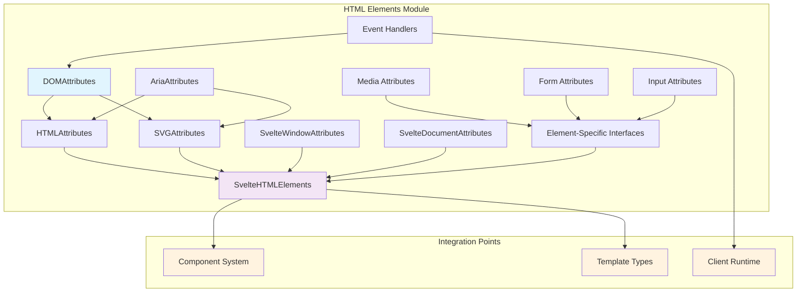
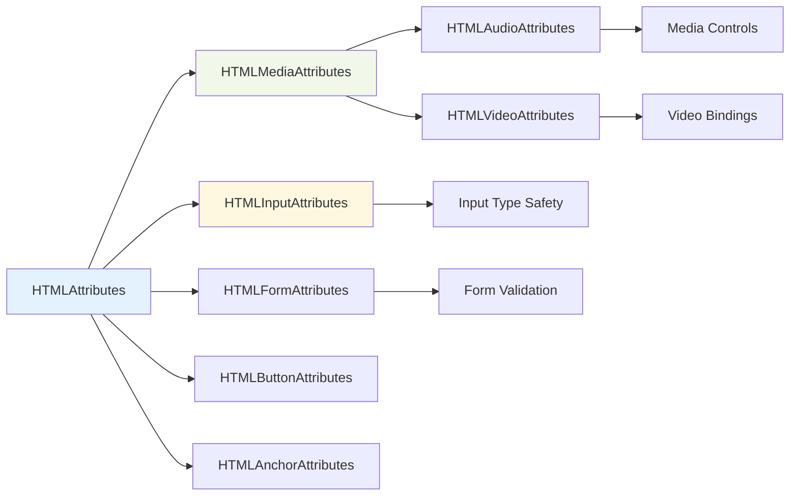
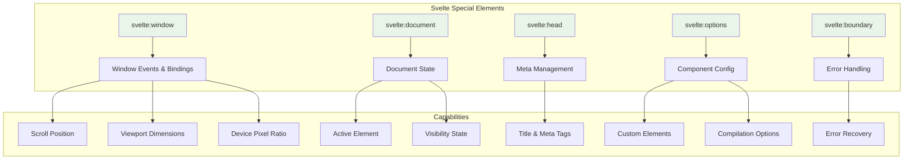
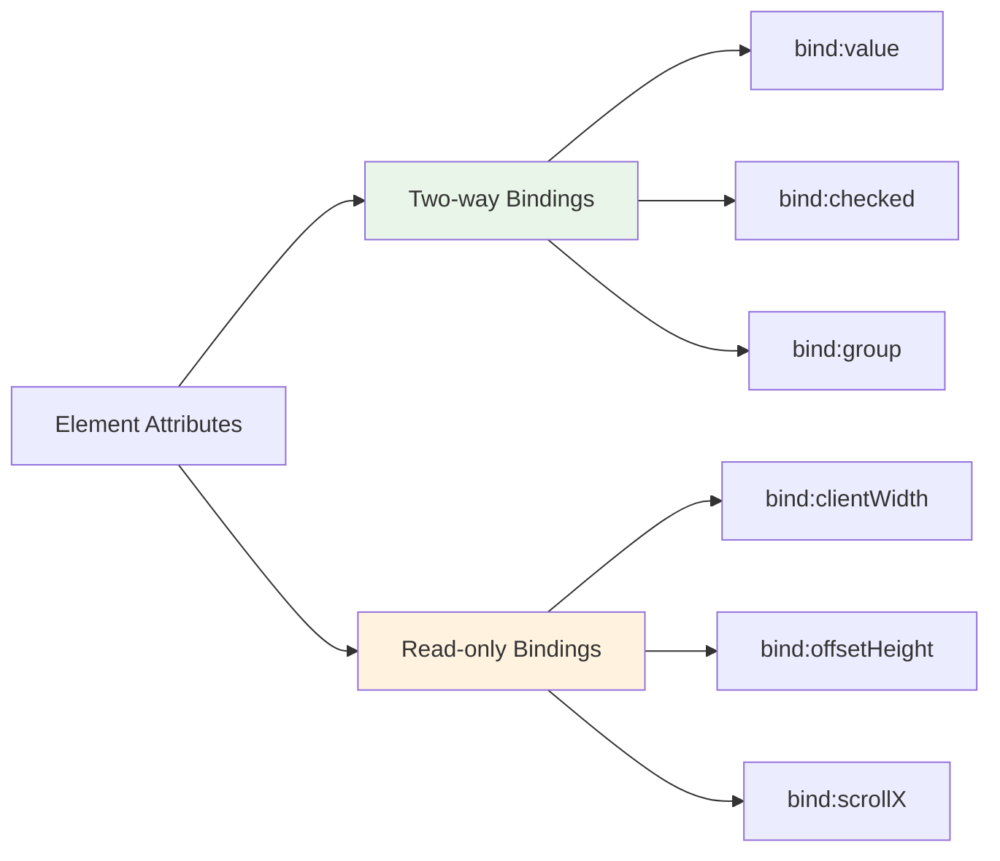

# HTML Elements Module

The HTML Elements module provides comprehensive TypeScript type definitions for HTML, SVG, and Svelte-specific elements and their attributes. This module serves as the foundation for type-safe template authoring in Svelte applications, ensuring proper attribute typing and event handling across all supported DOM elements.

## Overview

This module defines type-safe interfaces for:
- **HTML Elements**: Complete attribute definitions for all standard HTML elements
- **SVG Elements**: Comprehensive SVG attribute and element type definitions  
- **Event Handlers**: Type-safe event handling for all DOM events
- **Svelte-Specific Elements**: Special Svelte elements like `svelte:window`, `svelte:document`
- **Accessibility**: Full ARIA attribute support for accessible applications
- **Data Binding**: Type definitions for Svelte's reactive binding system

## Architecture



## Core Components

### Base Attribute Interfaces

#### DOMAttributes
The foundational interface that defines common DOM event handlers and properties available to all elements.

**Key Features:**
- Comprehensive event handler definitions (clipboard, focus, keyboard, mouse, touch, etc.)
- Support for both `on:event` and `onevent` syntaxes
- Event capture variants (`oneventcapture`)
- Svelte-specific transition events (`introstart`, `outrostart`, etc.)
- Dimension binding support (`bind:clientWidth`, `bind:clientHeight`)

#### AriaAttributes
Complete implementation of WAI-ARIA 1.1 attributes for accessibility support.

**Key Features:**
- All ARIA attributes with proper value constraints
- Role definitions with type safety
- Accessibility state management
- Screen reader optimization support

#### HTMLAttributes
Extends `DOMAttributes` and `AriaAttributes` to provide the base for all HTML elements.

**Key Features:**
- Standard HTML global attributes
- Content editability bindings
- SvelteKit navigation attributes
- Custom data attributes support
- Attachment system integration

### Element-Specific Interfaces

The module provides specialized interfaces for each HTML element type:



#### Form Elements
- **HTMLInputAttributes**: Comprehensive input element support with type-specific attributes
- **HTMLSelectAttributes**: Select element with value binding
- **HTMLTextareaAttributes**: Textarea with content binding
- **HTMLFormAttributes**: Form validation and submission handling

#### Media Elements
- **HTMLMediaAttributes**: Base for audio/video elements
- **HTMLAudioAttributes**: Audio-specific properties
- **HTMLVideoAttributes**: Video with dimension bindings

#### Interactive Elements
- **HTMLButtonAttributes**: Button with command support
- **HTMLAnchorAttributes**: Link navigation and security
- **HTMLDetailsAttributes**: Collapsible content with open binding

### SVG Support

#### SVGAttributes
Complete SVG element and attribute type definitions.

**Key Features:**
- All SVG-specific attributes with proper typing
- Coordinate and dimension properties
- Transform and animation support
- Filter and gradient definitions
- Path and shape attributes

### Svelte-Specific Elements

#### Special Elements
- **svelte:window**: Window-level event handling and property binding
- **svelte:document**: Document-level events and state
- **svelte:body**: Body element access
- **svelte:head**: Head content management
- **svelte:options**: Component configuration
- **svelte:fragment**: Template fragments
- **svelte:boundary**: Error boundary handling



## Event Handling System

### Event Handler Types
The module provides type-safe event handlers for all DOM events:

```typescript
type EventHandler<E extends Event = Event, T extends EventTarget = Element> = (
    event: E & { currentTarget: EventTarget & T }
) => any;
```

### Supported Event Categories
- **Clipboard Events**: Copy, cut, paste operations
- **Composition Events**: Text input composition
- **Focus Events**: Focus management and navigation
- **Form Events**: Input, change, submit handling
- **Keyboard Events**: Key press and release events
- **Mouse Events**: Click, hover, drag operations
- **Touch Events**: Mobile touch interactions
- **Pointer Events**: Unified pointer input
- **Media Events**: Audio/video playback events
- **Animation Events**: CSS animation lifecycle
- **Transition Events**: CSS transition handling

## Data Binding Integration

### Reactive Bindings
The module supports Svelte's reactive binding system:



### Binding Categories
- **Form Bindings**: Value, checked state, file lists
- **Dimension Bindings**: Element measurements and viewport
- **Media Bindings**: Playback state, time, volume
- **Content Bindings**: innerHTML, textContent for contenteditable
- **State Bindings**: Focus, visibility, scroll position

## Integration with Other Modules

### Component System Integration
- Provides type definitions used by [component_system](component_system.md)
- Enables type-safe component props and events
- Supports custom element creation

### Template Types Integration  
- Works with [template_types](compiler_types.md#template_types) for AST representation
- Provides runtime type checking for template compilation
- Ensures attribute validation during build

### Client Runtime Integration
- Integrates with [client_runtime](client_runtime.md) for event handling
- Supports reactive binding system
- Enables efficient DOM updates

## Usage Examples

### Basic Element Usage
```typescript
// Type-safe HTML element with proper attributes
interface ButtonProps extends HTMLButtonAttributes {
    variant?: 'primary' | 'secondary';
}

// Form element with validation
interface FormProps extends HTMLFormAttributes {
    onSubmit: (event: SubmitEvent) => void;
}
```

### Event Handling
```typescript
// Type-safe event handlers
const handleClick: MouseEventHandler<HTMLButtonElement> = (event) => {
    // event.currentTarget is properly typed as HTMLButtonElement
    console.log(event.currentTarget.textContent);
};

// Custom event handling
const handleCustomEvent: EventHandler<CustomEvent<string>, HTMLElement> = (event) => {
    // event.detail is typed as string
    console.log(event.detail);
};
```

### Reactive Bindings
```typescript
// Media element with bindings
interface VideoProps extends HTMLVideoAttributes {
    'bind:currentTime'?: number;
    'bind:paused'?: boolean;
    'bind:duration'?: number;
}

// Form input with validation
interface InputProps extends HTMLInputAttributes {
    'bind:value'?: string;
    'bind:validity'?: ValidityState;
}
```

### SVG Elements
```typescript
// Type-safe SVG with proper attributes
interface CircleProps extends SVGAttributes<SVGCircleElement> {
    cx: number;
    cy: number;
    r: number;
    fill?: string;
}
```

## Best Practices

### Type Safety
1. **Use Specific Interfaces**: Prefer element-specific interfaces over generic HTMLAttributes
2. **Event Handler Typing**: Always type event handlers with specific event and target types
3. **Binding Validation**: Use readonly bindings for computed properties

### Accessibility
1. **ARIA Support**: Leverage AriaAttributes for screen reader compatibility
2. **Semantic HTML**: Use appropriate element types with their specific attributes
3. **Keyboard Navigation**: Implement proper tabindex and focus management

### Performance
1. **Event Delegation**: Use event capture for performance-critical scenarios
2. **Binding Optimization**: Minimize reactive bindings for better performance
3. **Conditional Attributes**: Use conditional rendering for optional attributes

### Integration
1. **Component Props**: Extend element interfaces for custom component props
2. **Custom Elements**: Use proper typing for web component integration
3. **Framework Compatibility**: Maintain compatibility with SvelteKit features

## Security Considerations

### XSS Prevention
- Content bindings are automatically escaped
- Use `@html` directive carefully with trusted content only
- Validate user input in form handlers

### Navigation Security
- `target="_blank"` includes automatic `rel="noopener"`
- CSP-compatible nonce support for scripts and styles
- Referrer policy controls for external links

This module provides the foundation for type-safe, accessible, and performant DOM manipulation in Svelte applications, ensuring developers can build robust user interfaces with confidence in their type safety and runtime behavior.