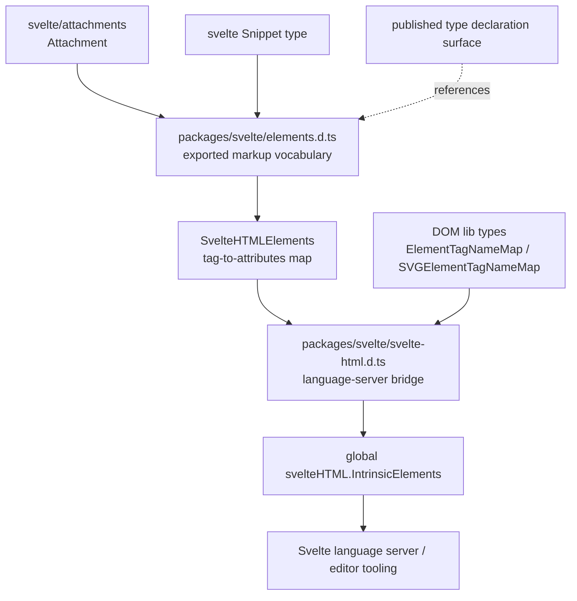
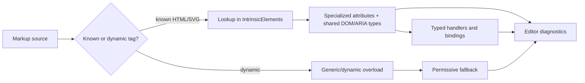

# `html_typings`

## Purpose

The `html_typings` module defines Svelte’s TypeScript contract for markup. It gives editors and users precise types for HTML/SVG attributes, DOM events, ARIA metadata, element-specific bindings, Svelte special elements, and custom-element escape hatches. It has no runtime implementation: the declarations describe how Svelte markup should be checked and inferred.

## Architecture overview

The detailed responsibilities are split into:

- [`html_typings_elements.md`](html_typings_elements.md) — exported HTML/SVG attribute interfaces, event handler types, bindings, and the `SvelteHTMLElements` tag map.
- [`html_typings_intrinsic_elements.md`](html_typings_intrinsic_elements.md) — global language-server declarations, override composition, intrinsic element inference, and dynamic-tag fallbacks.
- [`published_type_declaration_surface.md`](published_type_declaration_surface.md) — package-level type aggregation that exposes the public declaration surface.

## Component relationships

```mermaid
sequenceDiagram
    participant Editor as Editor / language server
    participant Intrinsic as svelteHTML.IntrinsicElements
    participant Map as SvelteHTMLElements
    participant Types as Element-specific interfaces
    participant DOM as TypeScript DOM library

    Editor->>Intrinsic: resolve <input>, <svg>, or Svelte special tag
    Intrinsic->>Map: select tag property type
    Map->>Types: obtain HTMLInputAttributes / SVGAttributes / etc.
    Types-->>Intrinsic: combine with HTMLProps overrides
    Intrinsic->>DOM: resolve known element and event target
    DOM-->>Editor: contextual attributes, events, bindings, and diagnostics
```

## Type-checking flow

## Public and internal boundaries

`elements.d.ts` is the reusable public vocabulary imported by application code and other Svelte declarations. `svelte-html.d.ts` is an internal language-server entry point and is intentionally excluded from the exports map. The two files are coupled by the `SvelteHTMLElements` import and by the `HTMLProps` override pattern; changes to tag names or element interfaces should therefore be reviewed together.

## Change guide

1. Add shared behavior to the appropriate base interface when it applies broadly.
2. Add element-specific behavior to the specialized interface and its entry in `SvelteHTMLElements`.
3. Verify the corresponding `IntrinsicElements` entry inherits the intended override behavior.
4. Check special tags, dynamic tags, event target generics, `null` handling, and custom-element index signatures.

