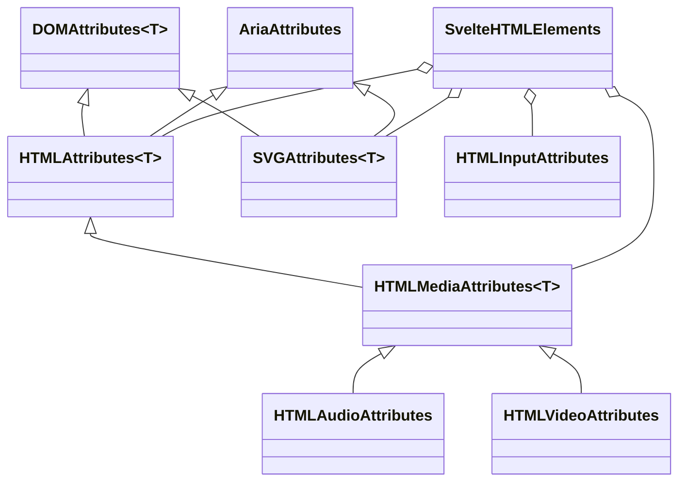

# HTML and SVG element typing model

Source: `packages/svelte/elements.d.ts`

This sub-module is Svelte’s reusable, exported type vocabulary for markup. It models common DOM attributes and event handlers, accessibility attributes, media-specific properties, SVG properties, Svelte special-element attributes, and the mapping from tag names to element-specific attribute interfaces.

## Core responsibilities

- `DOMAttributes<T>` provides the shared event surface for an `EventTarget`, including legacy `on:event` names, DOM-style event names, capture variants, Svelte transition events, and readonly dimension bindings.
- `AriaAttributes` and `AriaRole` constrain accessibility metadata while preserving an escape hatch for custom role strings.
- `HTMLAttributes<T>` (the shared base for HTML elements) combines ARIA and DOM attributes with standard, living-standard, RDFa, SvelteKit, `data-*`, and symbol-keyed attachment properties.
- Element-specific interfaces such as `HTMLInputAttributes`, `HTMLSelectAttributes`, `HTMLMediaAttributes<T>`, and `HTMLVideoAttributes` add native properties and Svelte bindings to the shared base.
- `SVGAttributes<T>` supplies SVG-specific properties while retaining shared events and ARIA metadata.
- `SvelteHTMLElements` maps HTML, SVG, and Svelte pseudo-tags to their attribute interfaces. Its string index signature allows custom elements.

## Type composition

`T` keeps event `currentTarget` and bindings aligned with the concrete browser element. Most properties are optional and accept `null` because Svelte treats it like `undefined` for these attributes.

## Integration points

The attachment symbol property imports `Attachment` from `svelte/attachments`; the implicit `children` property uses `import('svelte').Snippet`. The exported map is consumed by the language-server-facing declarations in [`html_typings_intrinsic_elements.md`](html_typings_intrinsic_elements.md) and is re-exported through the package’s published type surface described by [`published_type_declaration_surface.md`](published_type_declaration_surface.md).

## Maintenance considerations

When adding a tag or attribute, update the appropriate specialized interface and the `SvelteHTMLElements` map. Keep event target generics accurate, preserve both Svelte event syntaxes where supported, and retain `null` in public optional properties unless the runtime contract changes.

