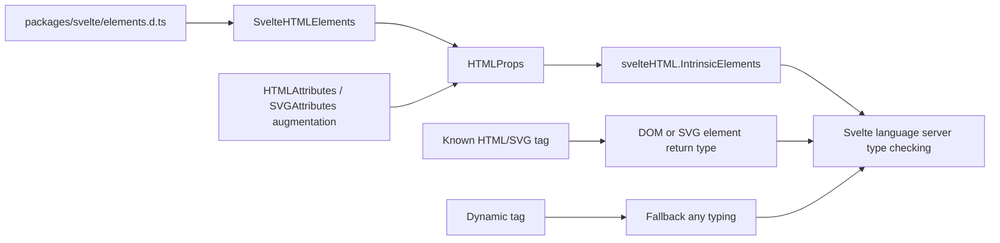

# Language-server intrinsic elements

Source: `packages/svelte/svelte-html.d.ts`

This sub-module adapts the exported element map into the global `svelteHTML` namespace used by Svelte language tooling. It is deliberately not exposed through the package exports map and is intended to be loaded directly by the language server.

## Core components

### `HTMLProps<Property, Override>`

Combines the canonical property type from `SvelteHTMLElements` with a tooling override:

```ts
Omit<SvelteHTMLElements[Property], keyof Override> & Override
```

This lets the language server layer provide contextual `HTMLAttributes` or `SVGAttributes` extensions without duplicating the complete element definitions.

### `svelteHTML.mapElementTag`

Type-level overloads map HTML tag names to `ElementTagNameMap` and SVG tag names to `SVGElementTagNameMap`. The permissive overload supports dynamic `<svelte:element>` tags.

### `svelteHTML.createElement`

Provides two overload families for tooling-generated element expressions: one accepts element attributes directly; the other accepts attribute enhancers and an enhanced attribute object. The return type follows the HTML/SVG tag map when the key is known and falls back to `any` for dynamic tags.

### `svelteHTML.IntrinsicElements`

Extends `SvelteHTMLElements` and redeclares each known HTML and SVG tag through `HTMLProps`. It also includes an index signature for custom elements. Svelte-specific entries such as `svelte:window`, `svelte:document`, `svelte:head`, `svelte:boundary`, and `svelte:options` remain available through the inherited map.

## Data flow



## Compatibility behavior

The empty global `HTMLAttributes` and `SVGAttributes` interfaces are intentional extension points. Existing tooling integrations can augment them for backwards compatibility; `HTMLProps` removes overridden keys before applying the augmentation, preventing conflicting property definitions.

