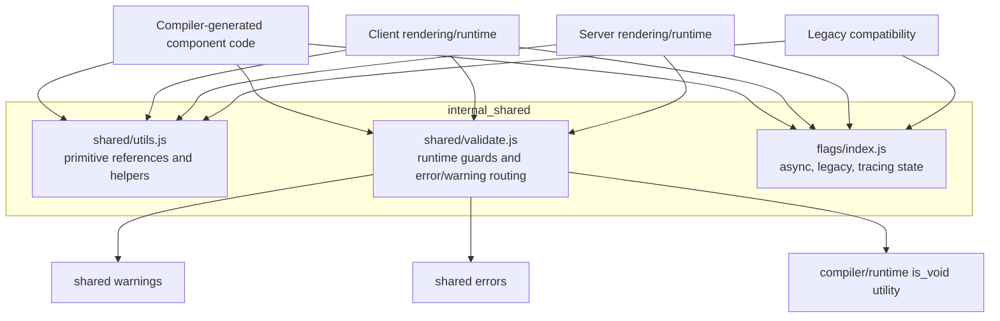
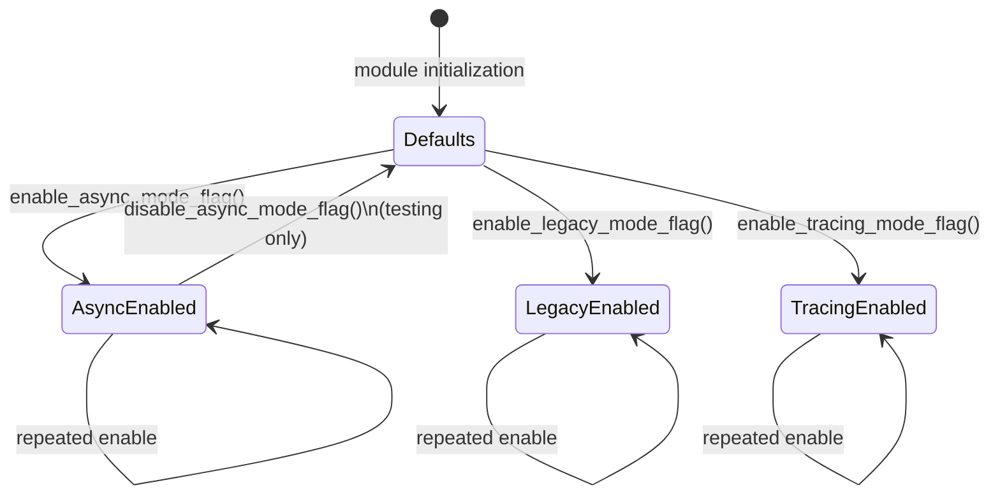
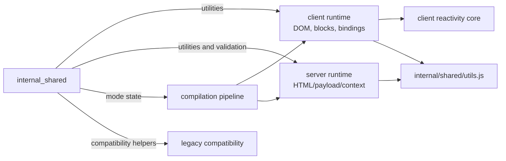
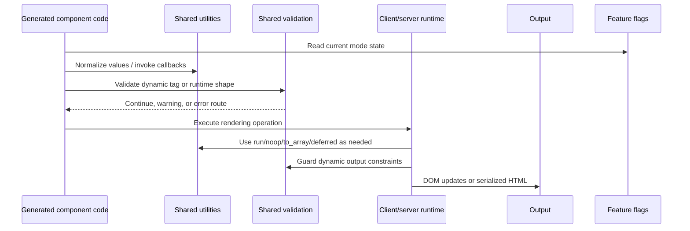
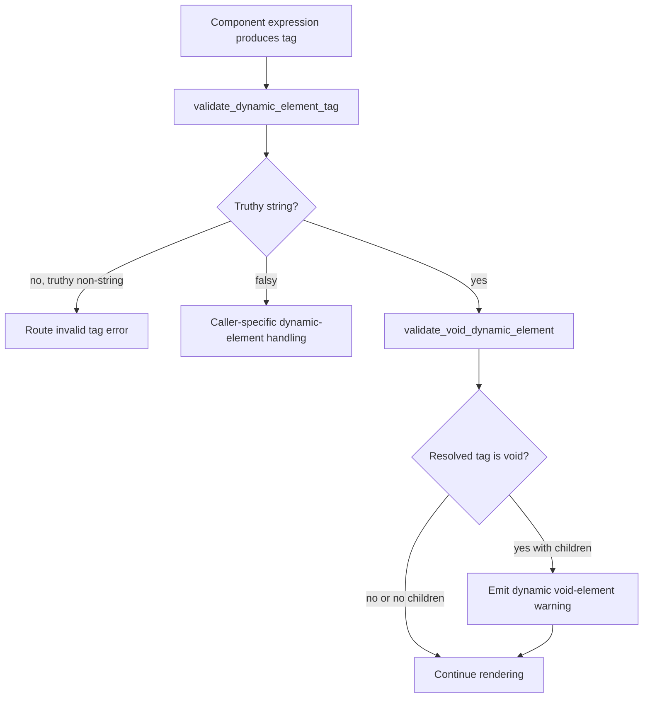

# Internal Shared

`internal_shared` is the small, environment-neutral support layer used by Svelte's runtime. It contains utilities that can be safely shared by browser/client and server code, validation guards for dynamic component output, and process-level feature flags that coordinate compiler/runtime behavior.

The module is deliberately lower-level than the client DOM and server rendering runtimes. It does not create DOM nodes, render HTML, track reactive dependencies, or implement stores. Instead, it supplies predictable primitives and policy checks consumed by those higher-level modules. See [client_dom_rendering_runtime](client_dom_rendering_runtime.md), [server_runtime](server_runtime.md), and [client_reactivity_core](client_reactivity_core.md) for those responsibilities.

## Purpose and boundaries

The module has three responsibilities:

1. **Shared utility primitives** — stable references to built-ins, function helpers, promise/deferred helpers, fallback selection, and iterable normalization.
2. **Runtime validation** — guards for dynamic element tags, void-element content, store shape, and invalid snippet stringification.
3. **Feature-mode flags** — mutable switches for async, legacy, and tracing modes.

It is not a public application API. Its exports are internal implementation dependencies and may be called from generated code, client runtime code, server runtime code, and compatibility paths.

## Architecture



The three files are independent at the source level, but together form a common contract: utilities provide mechanics, validation protects runtime assumptions, and flags provide mode state. The module therefore sits below both rendering environments and beside the compiler/runtime boundary.

## Component inventory

| Source | Core exports | Role |
| --- | --- | --- |
| `packages/svelte/src/internal/shared/utils.js` | `noop`, `run`, `to_array` | Small reusable operations and built-in references used across generated and runtime code. |
| `packages/svelte/src/internal/shared/validate.js` | `validate_dynamic_element_tag`, `validate_void_dynamic_element` | Checks dynamic element values and content before/while rendering. |
| `packages/svelte/src/internal/flags/index.js` | `enable_legacy_mode_flag`, `enable_async_mode_flag`, `disable_async_mode_flag`, `enable_tracing_mode_flag` | Enables runtime/compiler modes through module-scoped booleans. |

`utils.js` and `validate.js` also contain adjacent internal exports such as `is_function`, `is_promise`, `run_all`, `deferred`, `fallback`, `validate_store`, and `prevent_snippet_stringification`. These helpers are documented below because they explain the file's shared contract, even though the module tree highlights only the requested core symbols. `validate.js` re-exports `invalid_default_snippet` from its error definitions.

## Shared utilities

### Built-in references

`utils.js` captures references to common globals and prototype methods at module initialization: `Array.isArray`, `Array.prototype.indexOf`, `Array.from`, `Object.keys`, property-descriptor functions, prototypes, `Object.getPrototypeOf`, and `Object.isExtensible`.

The purpose is defensive and performance-oriented. If a browser extension or application monkey-patches a global later, runtime code continues using the original references and avoids de-optimization caused by changing global lookups. These references are also convenient for generated/runtime code that needs a compact, consistent primitive operation.

### Function and promise helpers

- `noop()` is an intentionally empty callback, useful as a default lifecycle or cleanup function.
- `is_function(value)` performs a function-type check.
- `is_promise(value)` uses the thenable convention (`value?.then` is a function), so it accepts native promises and promise-like objects.
- `run(fn)` invokes one callback and returns its result. It is useful where an expression-shaped callback invocation is needed.
- `run_all(arr)` invokes every callback in array order. It does not catch exceptions, so the first thrown exception stops iteration and propagates to the caller.

### Deferred completion

`deferred()` creates a promise together with externally accessible `resolve` and `reject` functions. It is used when a runtime operation needs to expose completion before the eventual completion event is available. The implementation currently constructs the promise manually for compatibility with environments that do not yet widely support `Promise.withResolvers`.

The returned shape is:

```js
{
  promise,
  resolve,
  reject
}
```

### Fallback selection

`fallback(value, fallback, lazy = false)` substitutes a fallback only when `value === undefined`. A non-lazy fallback is treated as an already computed value; with `lazy = true`, the fallback is called only when needed. `null`, `false`, `0`, and empty strings are preserved because they are explicit values rather than missing values.

### Iterable normalization

`to_array(value, n)` normalizes array-like or iterable values into an array while preserving an important optimization:

```mermaid
flowchart TD
    A[to_array(value, n)] --> B{value is Array?}
    B -- yes --> C[Return same array]
    B -- no --> D{n omitted or value not iterable?}
    D -- yes --> E[Array.from(value)]
    D -- no --> F[Iterate and collect at most n values]
```

When `n` is omitted, the function represents an unbounded/rest conversion and delegates to `Array.from`. When `n` is supplied, it collects only the requested number of values. This supports destructuring-like generated code where an iterable may be infinite or expensive and only a fixed prefix is required. Arrays are returned unchanged, avoiding an unnecessary copy.

## Runtime validation

`validate.js` is a shared policy boundary between generated component behavior and the error/warning system. It receives tag-producing callbacks rather than tag values directly, allowing callers to defer evaluation until the validation point and preserve the same dynamic expression semantics used by rendering.

### Dynamic element tags

`validate_dynamic_element_tag(tag_fn)` evaluates `tag_fn()` and validates truthy results. A truthy non-string tag is rejected through `svelte_element_invalid_this_value()`. Empty or otherwise falsy values are allowed to pass this guard because higher-level dynamic-element handling determines how they are rendered or omitted.

`validate_void_dynamic_element(tag_fn)` evaluates the dynamic tag and, when it is a void HTML element, emits the `dynamic_void_element` warning. The caller is responsible for invoking this guard in the context where element content is being checked. It delegates recognition of void tags to the shared `is_void` utility, keeping HTML element knowledge out of this module.

The checks are intentionally separate: one validates the *type* of the tag, while the other validates a *content constraint* associated with the resolved tag.

### Supporting validation policies

The same file provides related guards used by runtime features:

- `validate_store(store, name)` reports an invalid store shape when a non-null value lacks a `subscribe` function.
- `prevent_snippet_stringification(fn)` overrides a snippet function's `toString` behavior so accidental stringification reports `snippet_without_render_tag()` instead of silently producing misleading output.
- `invalid_default_snippet` is re-exported so consumers can use the shared error definition through the validation boundary.

Validation does not throw or warn directly in every case. It routes to shared warning/error definitions, allowing development-mode reporting and runtime behavior to remain centralized.

## Feature flags

`flags/index.js` owns three module-scoped booleans:

| Flag | Initial value | Setter | Meaning |
| --- | --- | --- | --- |
| `async_mode_flag` | `false` | `enable_async_mode_flag()`; test-only `disable_async_mode_flag()` | Enables async-mode behavior consumed by relevant runtime/compiler paths. |
| `legacy_mode_flag` | `false` | `enable_legacy_mode_flag()` | Enables compatibility behavior for legacy component semantics. |
| `tracing_mode_flag` | `false` | `enable_tracing_mode_flag()` | Enables tracing/instrumentation behavior. |

The setters are one-way in production: they turn a mode on and do not expose a general reset operation. Async mode is explicitly resettable for tests, as indicated by the source comment. Because the state is module-scoped, all importers in the same module graph observe the same mode.



The diagram shows each flag conceptually; the implementation stores the flags independently, so async, legacy, and tracing can be enabled in any combination.

## Dependency relationships



The dependency direction is primarily downward toward shared primitives. `internal_shared` should remain free of DOM rendering, compiler AST traversal, and application-facing store implementation. Domain-specific modules can depend on it; it should not depend on those domains.

For broader context, follow the [compilation_pipeline](compilation_pipeline.md) documentation for how generated client/server code is produced, the [client_dom_rendering_runtime](client_dom_rendering_runtime.md) documentation for browser execution, and [server_runtime](server_runtime.md) for SSR output and payload handling. Store-specific behavior belongs in [client_store_interop](client_store_interop.md) and the reactive library described by the module tree.

## End-to-end data and control flow



A typical dynamic element path is therefore:



## Operational considerations

### Error and warning behavior

Validation delegates to shared error and warning registries. Consumers should not duplicate equivalent checks or convert warnings into errors locally; doing so can produce inconsistent development diagnostics. The validation callback may evaluate user code, so callers should preserve the intended timing and avoid invoking the tag expression more than required.

### Performance and mutation assumptions

The utility layer favors low overhead: captured built-ins avoid repeated global resolution, `to_array` preserves arrays, and `run` avoids wrapper allocation. These helpers do not clone or freeze values unless their specific conversion requires it. Callers remain responsible for ownership and mutation rules.

### Flag lifecycle

Flags are process/module state, not per-component state. They should be enabled during the appropriate initialization path before code that branches on them runs. The async reset function is for tests only; production code should not rely on toggling async mode back and forth.

### Compatibility

The shared layer is used by both modern and legacy paths. Legacy behavior and adapters are described in [legacy_compatibility_and_migration](legacy_compatibility_and_migration.md) and [legacy_compat](legacy_compat.md). Changes to utility semantics or flag defaults can therefore affect both generated modern components and legacy compatibility output.

## Maintenance guidance

When changing this module:

- preserve the distinction between `undefined` and other falsy values in `fallback`;
- preserve bounded iteration behavior in `to_array(value, n)`;
- avoid replacing captured built-ins with late global lookups without measuring the runtime impact;
- keep dynamic tag type validation separate from void-element content validation;
- update tests that depend on flag initialization and the test-only async reset;
- check both client and server runtime consumers after changing shared behavior.

The most useful verification paths are compiler-generated dynamic elements, SSR rendering of dynamic elements, store interop validation, snippet misuse diagnostics, and tests that exercise async/legacy/tracing combinations.

## Source references

- `packages/svelte/src/internal/shared/utils.js`
- `packages/svelte/src/internal/shared/validate.js`
- `packages/svelte/src/internal/flags/index.js`
- [Compilation pipeline](compilation_pipeline.md)
- [Client DOM rendering runtime](client_dom_rendering_runtime.md)
- [Server runtime](server_runtime.md)
- [Client reactivity core](client_reactivity_core.md)
- [Legacy compatibility and migration](legacy_compatibility_and_migration.md)
