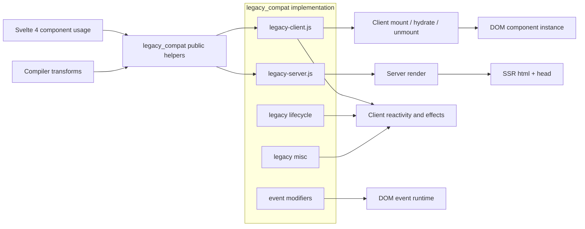
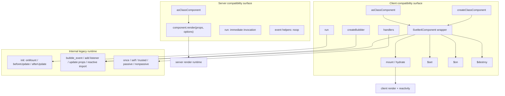
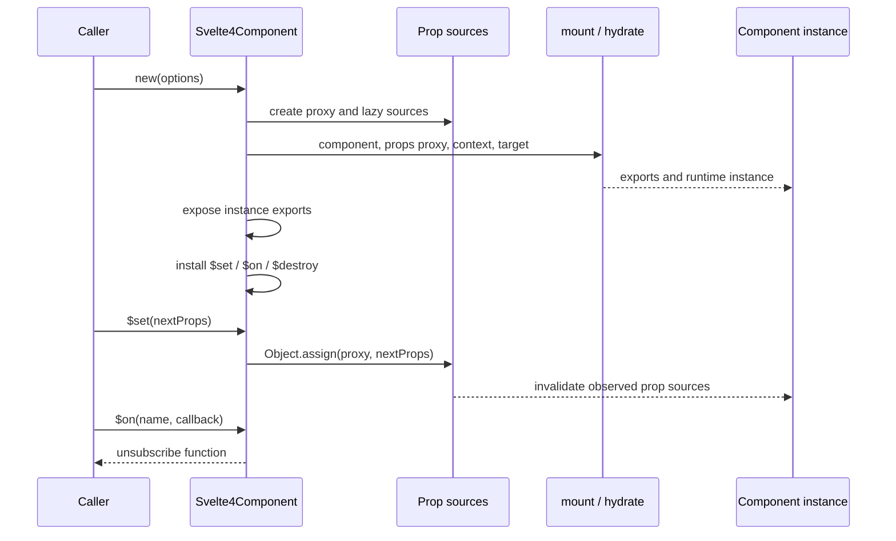
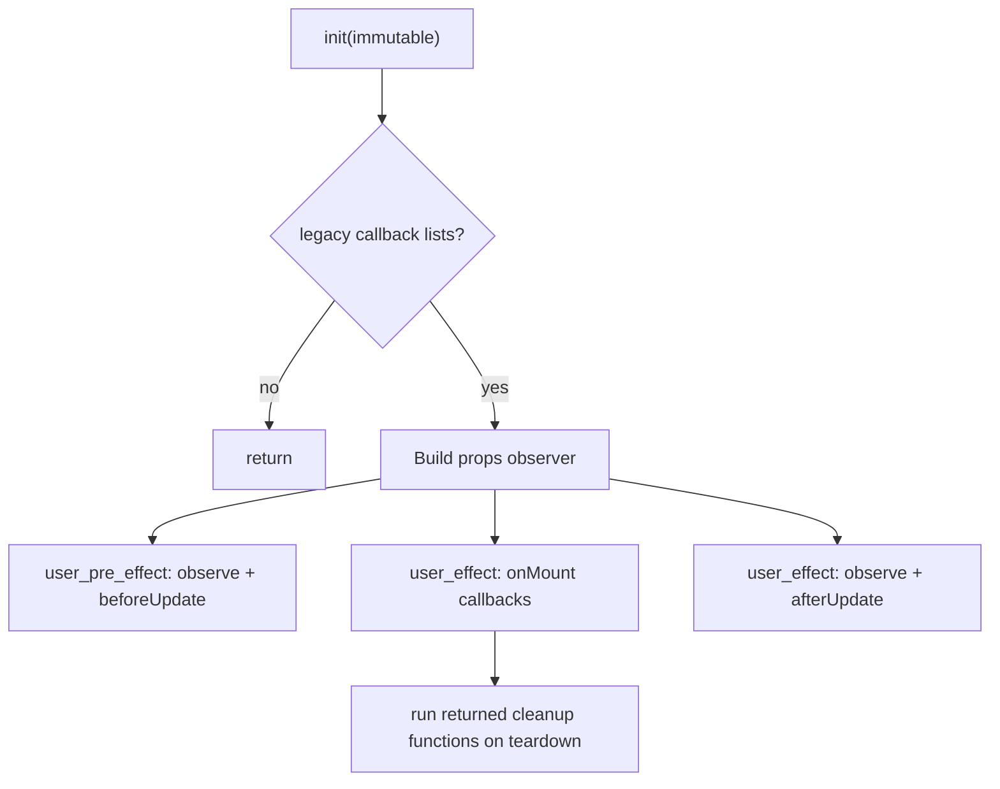
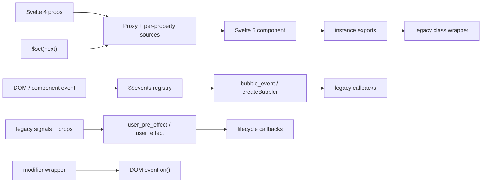

# legacy_compat

## Introduction

`legacy_compat` is Svelte 5's runtime bridge for Svelte 4 component behavior. It lets
components compiled with the modern runtime continue to be consumed through the Svelte 4
imperative component API, while preserving legacy lifecycle, event, prop, store-import, and
event-modifier semantics during migration.

The bridge has separate client and server entry points. The client entry point mounts or
hydrates a component and exposes a class-like wrapper; the server entry point provides the
same constructor shape plus an SSR `.render()` method without placing the server runtime in
client bundles. The implementation is transitional and its public helpers are deprecated;
new code should use Svelte 5 component functions and effects.

Source locations:

- [`legacy-client.js`](https://github.com/sveltejs/svelte/blob/main/packages/svelte/src/legacy/legacy-client.js)
- [`legacy-server.js`](https://github.com/sveltejs/svelte/blob/main/packages/svelte/src/legacy/legacy-server.js)
- [`internal/client/dom/legacy/lifecycle.js`](https://github.com/sveltejs/svelte/blob/main/packages/svelte/src/internal/client/dom/legacy/lifecycle.js)
- [`internal/client/dom/legacy/misc.js`](https://github.com/sveltejs/svelte/blob/main/packages/svelte/src/internal/client/dom/legacy/misc.js)
- [`internal/client/dom/legacy/event-modifiers.js`](https://github.com/sveltejs/svelte/blob/main/packages/svelte/src/internal/client/dom/legacy/event-modifiers.js)

## 1. Position in the system

The module sits between generated component code / public compatibility exports and the core
client, server, rendering, and reactivity runtimes. Compiler transforms emit calls to several
legacy helpers when legacy syntax or `compatibility.componentApi === 4` is enabled. See
[compiler_transform_client_directives](compiler_transform_client_directives.md) for event
modifier and bubbling generation, and [compiler_transform_server_core](compiler_transform_server_core.md)
for the SSR component API path.



### Related documentation

| Concern | Reference |
|---|---|
| End-to-end compiler phases | [compilation_pipeline](compilation_pipeline.md) |
| Compiler orchestration and shared state | [compiler_core](compiler_core.md) |
| Client code generation that emits legacy helpers | [compiler_transform_client](compiler_transform_client.md) |
| Client event directives and modifiers | [compiler_transform_client_directives](compiler_transform_client_directives.md) |
| Server component generation and `componentApi` compatibility | [compiler_transform_server_core](compiler_transform_server_core.md) |
| Svelte 4 → 5 source migration | [compiler_migrate](compiler_migrate.md) |
| Legacy AST declarations | [compiler_legacy_ast_types](compiler_legacy_ast_types.md) |

## 2. Architecture



### 2.1 Client class compatibility

`createClassComponent(options)` constructs `Svelte4Component`; `asClassComponent(component)`
returns a constructor whose constructor merges the component with Svelte 4-style options.
The wrapper accepts `target`, `anchor`, `props`, `context`, `intro`, `recover`, `hydrate`, and
`sync` behavior through the constructor options.

Construction performs the following operations:

1. Creates a `Proxy` around initial props and `$$events`.
2. Gives each accessed prop its own coarse-grained mutable signal. Reads call `get`; writes
   call `set`, allowing modern component code to observe legacy `$set` updates.
3. Calls `mount` or `hydrate` and passes the proxy, target, context, and hydration options.
4. Flushes synchronously unless async mode is active, the wrapper is a custom-element host, or
   `sync === false`.
5. Mirrors component exports onto the wrapper and installs `$set`, `$on`, and `$destroy`.

The wrapper intentionally does not use the fine-grained `$state` proxy: Svelte 4 exposed
coarse-grained prop invalidation, so compatibility depends on retaining that behavior.



### 2.2 Events and bubbling

`$on` stores callbacks in `props.$$events`, preserving the event registry expected by legacy
compiled code. `createBubbler()` captures the active component context and returns a type-based
handler. It invokes all matching parent callbacks with the legacy component instance as
`this`, then returns `!event.defaultPrevented`. `bubble_event($$props, event)` provides the
corresponding generated-runtime helper and also preserves `this`.

`handlers(...handlers)` combines multiple listeners. It honors
`stopImmediatePropagation`, continues to isolate later handlers from earlier exceptions, and
rethrows collected errors in microtasks after dispatch. This preserves the observable ordering
of multiple Svelte 4 event handlers.

### 2.3 Lifecycle bridge

`init(immutable)` is used only in legacy mode. It reads the component's legacy callback lists
and installs effects in this order:



`observe_all` reads registered legacy signals and the component props getter so the enclosing
effect is subscribed to all relevant state. With `immutable`, a derived version changes only
when a prop's object identity changes, matching legacy immutable update behavior.

### 2.4 Server compatibility

`legacy-server.js` reuses the client constructor adapter but adds a static `.render()` that
calls the server `render` function and maps its result to the Svelte 4 shape:

```js
{ html: result.body, head: result.head, css: { code: '', map: null } }
```

`run(fn)` invokes immediately on the server. Event handlers, bubbling, and modifiers are
exported as `noop` because SSR does not dispatch browser events, but generated code can still
import the names without crashing.

## 3. Helper behavior reference

| Helper | Environment | Compatibility responsibility |
|---|---|---|
| `createClassComponent` | Client and server export | Instantiate a Svelte 5 component through the Svelte 4 class API. |
| `asClassComponent` | Client and server | Produce a reusable class constructor; server adds `.render()`. |
| `run` | Client / server | Map legacy immediate/pre-update behavior to `user_pre_effect`; invoke directly on SSR. |
| `handlers` | Client | Compose multiple event handlers and defer collected errors. |
| `createBubbler` / `bubble_event` | Client | Redispatch events through `$$events`. |
| `init` | Client legacy mode | Connect `onMount`, `beforeUpdate`, and `afterUpdate` callback queues to effects. |
| `reactive_import` | Client legacy mode | Add a signal dependency for reactive imported values. |
| `add_legacy_event_listener` | Client generated code | Implement compatibility `$on` registration. |
| `update_legacy_props` | Client generated code | Implement compatibility `$set` through component accessors. |
| `once`, `self`, `trusted`, `passive`, `nonpassive` | Client | Reproduce Svelte 4 event modifier behavior. |

The remaining wrappers (`stopPropagation`, `stopImmediatePropagation`, and
`preventDefault`) are implemented in the same event-modifier file and are exported from the
client entry point as well.

## 4. Dependency and data flow



Primary dependencies are intentionally narrow:

- Client rendering: `mount`, `hydrate`, and `unmount` from the client render runtime.
- Reactivity: mutable/source signals, `get`, `set`, effects, status flags, and `flushSync`.
- Context: the active component context for bubbling and lifecycle state.
- DOM events: `on` for passive/nonpassive listener installation.
- Shared utilities: `noop`, array detection, property definition, and cleanup execution.
- Server rendering: the server `render` function, isolated behind the server entry point.

These lower-level concerns are implemented in the client rendering/runtime tree,
client reactivity tree, and server runtime tree linked above; the compiler-facing relationships
are covered by [compiler_transform_client](compiler_transform_client.md) and
[compiler_transform_server](compiler_transform_server.md).

## 5. Operational constraints and migration guidance

- Treat all helpers as transitional and deprecated. Prefer modern component functions, event
  attributes, snippets, and `$effect` APIs in new code.
- Use the server entry point for SSR builds; importing client compatibility code directly can
  pull client rendering machinery into a server bundle.
- `createBubbler` requires an active component context. Calling it outside component execution
  reports `lifecycle_outside_component`.
- `$set` updates only props represented by the wrapper's proxy. The generated
  `update_legacy_props` helper additionally depends on component accessors and does not update
  `$$props` or `$$restProps`.
- Synchronous construction is deliberately skipped for async mode, custom-element hosts, and
  `sync: false`; callers that depend on immediate DOM availability should account for this.
- Event modifier wrappers preserve browser event semantics but are compatibility shims, not a
  replacement for modern event attributes and listener options.

For source migration rules, see [compiler_migrate](compiler_migrate.md). For the overall
relationship between compiler output and runtime modules, see [compilation_pipeline](compilation_pipeline.md).
